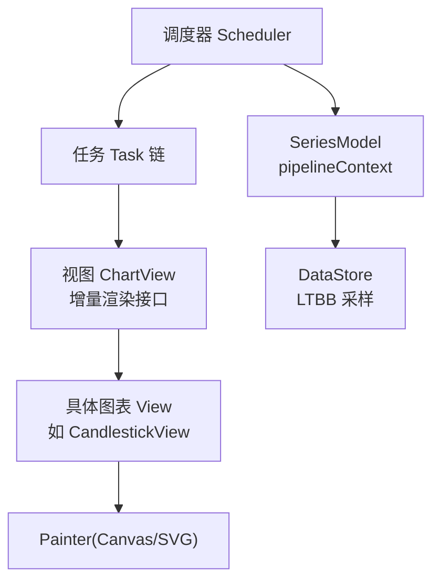
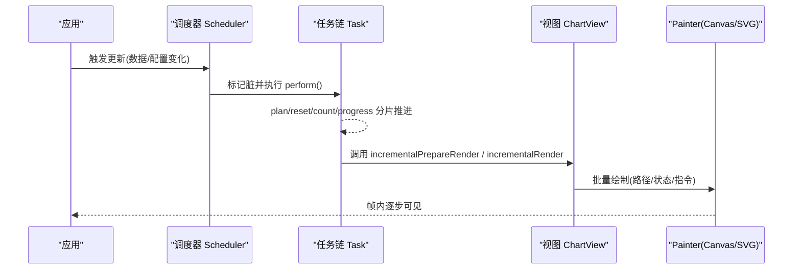
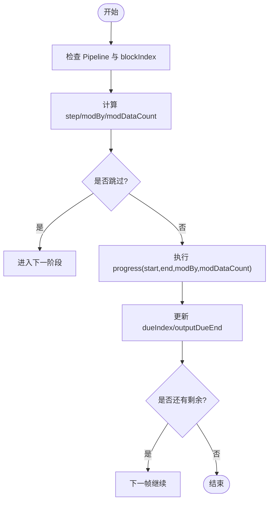
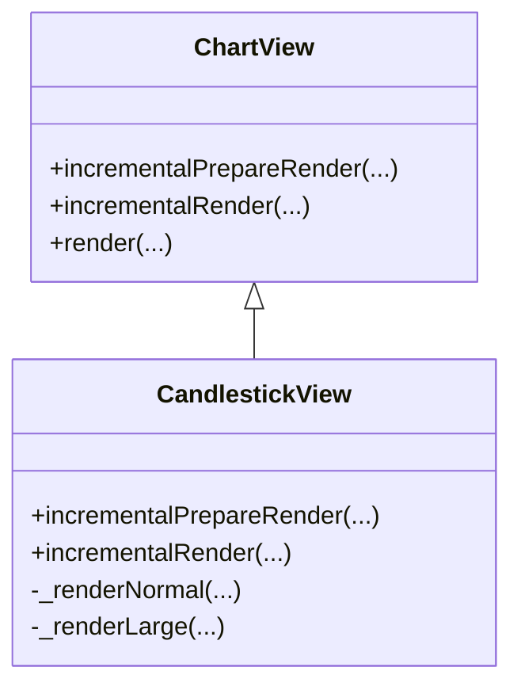
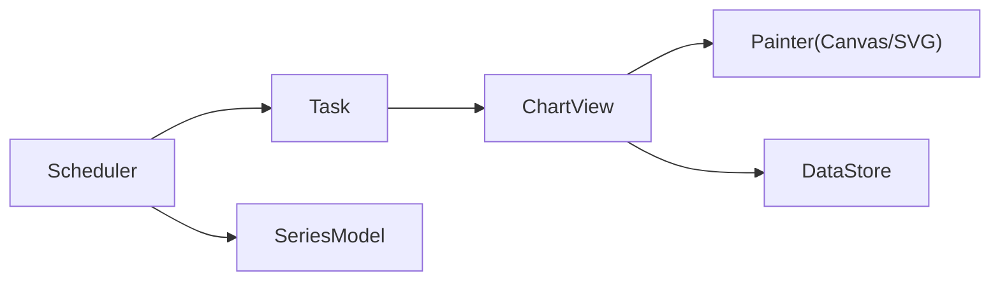

# 渲染优化

<cite>
**本文引用的文件**
- [src/core/Scheduler.ts](file://src/core/Scheduler.ts)
- [src/core/task.ts](file://src/core/task.ts)
- [src/renderer/installCanvasRenderer.ts](file://src/renderer/installCanvasRenderer.ts)
- [src/renderer/installSVGRenderer.ts](file://src/renderer/installSVGRenderer.ts)
- [src/view/Chart.ts](file://src/view/Chart.ts)
- [src/chart/helper/createRenderPlanner.ts](file://src/chart/helper/createRenderPlanner.ts)
- [src/model/Series.ts](file://src/model/Series.ts)
- [src/data/DataStore.ts](file://src/data/DataStore.ts)
- [test/appendData2.html](file://test/appendData2.html)
- [test/appendData3.html](file://test/appendData3.html)
</cite>

## 目录
1. [简介](#简介)
2. [项目结构](#项目结构)
3. [核心组件](#核心组件)
4. [架构总览](#架构总览)
5. [详细组件分析](#详细组件分析)
6. [依赖关系分析](#依赖关系分析)
7. [性能考量](#性能考量)
8. [故障排查指南](#故障排查指南)
9. [结论](#结论)
10. [附录](#附录)

## 简介
本文聚焦 ECharts 的渲染优化与性能调优，系统阐述：
- Canvas 与 SVG 两种渲染器的适用场景与取舍
- 渲染调度器的工作机制：任务队列、优先级与批量更新
- 渐进式渲染：分批次绘制避免主线程阻塞
- 图形合并与指令优化：路径合并、状态缓存、绘制指令优化
- 不同场景下的渲染器选择与配置建议，并给出可复用的性能测试思路

## 项目结构
ECharts 将“数据—视图—渲染”解耦，通过调度器串联各阶段任务，最终交由底层 Painter（Canvas/SVG）完成绘制。关键目录与职责：
- core：调度器与任务模型（Scheduler、Task）
- renderer：注册 Canvas/SVG 渲染器
- view：图表视图抽象，定义增量渲染接口
- chart：具体图表实现（如 K 线等），提供增量渲染策略
- model：系列模型，维护 pipelineContext 等上下文
- data：数据存取与采样（含大数据下采样）
- test：大量用例覆盖渐进式、大数据、流式数据等场景

图示来源
- [src/core/Scheduler.ts:114-257](file://src/core/Scheduler.ts#L114-L257)
- [src/core/task.ts:86-243](file://src/core/task.ts#L86-L243)
- [src/view/Chart.ts:138-147](file://src/view/Chart.ts#L138-L147)
- [src/chart/candlestick/CandlestickView.ts:68-83](file://src/chart/candlestick/CandlestickView.ts#L68-L83)
- [src/renderer/installCanvasRenderer.ts:20-24](file://src/renderer/installCanvasRenderer.ts#L20-L24)
- [src/renderer/installSVGRenderer.ts:20-24](file://src/renderer/installSVGRenderer.ts#L20-L24)
- [src/model/Series.ts:174-178](file://src/model/Series.ts#L174-L178)
- [src/data/DataStore.ts:865-900](file://src/data/DataStore.ts#L865-L900)

章节来源
- [src/core/Scheduler.ts:114-257](file://src/core/Scheduler.ts#L114-L257)
- [src/core/task.ts:86-243](file://src/core/task.ts#L86-L243)
- [src/view/Chart.ts:138-147](file://src/view/Chart.ts#L138-L147)
- [src/renderer/installCanvasRenderer.ts:20-24](file://src/renderer/installCanvasRenderer.ts#L20-L24)
- [src/renderer/installSVGRenderer.ts:20-24](file://src/renderer/installSVGRenderer.ts#L20-L24)
- [src/model/Series.ts:174-178](file://src/model/Series.ts#L174-L178)
- [src/data/DataStore.ts:865-900](file://src/data/DataStore.ts#L865-L900)

## 核心组件
- 调度器 Scheduler：管理数据处理器与视觉处理器的执行顺序，构建 Pipeline，计算渐进步长与块索引，驱动任务链执行。
- 任务 Task：封装 plan/reset/count/progress/onDirty，支持 modBy/modDataCount 的分片迭代，实现增量推进与脏标记传播。
- 视图 ChartView：定义 incrementalPrepareRender/incrementalRender 等接口，供具体图表实现分批绘制。
- 渲染器安装：installCanvasRenderer 与 installSVGRenderer 分别注册 Canvas 与 SVG 的 Painter。
- 系列模型 SeriesModel：持有 pipelineContext（large、progressiveRender 等），参与模式切换与上下文传递。
- 数据采样 DataStore：提供 LTBB 下采样，降低大数据量时的计算与绘制压力。

章节来源
- [src/core/Scheduler.ts:114-257](file://src/core/Scheduler.ts#L114-L257)
- [src/core/task.ts:86-243](file://src/core/task.ts#L86-L243)
- [src/view/Chart.ts:46-69](file://src/view/Chart.ts#L46-L69)
- [src/renderer/installCanvasRenderer.ts:20-24](file://src/renderer/installCanvasRenderer.ts#L20-L24)
- [src/renderer/installSVGRenderer.ts:20-24](file://src/renderer/installSVGRenderer.ts#L20-L24)
- [src/model/Series.ts:174-178](file://src/model/Series.ts#L174-L178)
- [src/data/DataStore.ts:865-900](file://src/data/DataStore.ts#L865-L900)

## 架构总览
下图展示了从选项变更到最终绘制的完整流程，突出调度器在其中的协调作用以及渐进式渲染的推进方式。

图示来源
- [src/core/Scheduler.ts:292-376](file://src/core/Scheduler.ts#L292-L376)
- [src/core/task.ts:139-243](file://src/core/task.ts#L139-L243)
- [src/view/Chart.ts:138-147](file://src/view/Chart.ts#L138-L147)
- [src/renderer/installCanvasRenderer.ts:20-24](file://src/renderer/installCanvasRenderer.ts#L20-L24)
- [src/renderer/installSVGRenderer.ts:20-24](file://src/renderer/installSVGRenderer.ts#L20-L24)

## 详细组件分析

### 渲染调度器与任务链
- 管道与批处理：每个 series 对应一个 Pipeline，包含 head/tail、阈值、步长、当前任务指针等；Scheduler 负责在恢复时建立管道并将任务串接。
- 渐进式参数：getPerformArgs 根据 progressiveEnabled、context.progressiveRender、blockIndex 决定 step/modBy/modDataCount，从而控制每帧处理的范围。
- 脏标记与传播：Task.dirty 会通知下游重新计划或推进；整体任务通过 stub 收集上游脏信息，必要时触发自身重算。
- 流式模式检测：updateStreamModes 基于 painter.type 与 series 配置决定是否启用渐进渲染。

图示来源
- [src/core/Scheduler.ts:185-206](file://src/core/Scheduler.ts#L185-L206)
- [src/core/task.ts:139-243](file://src/core/task.ts#L139-L243)

章节来源
- [src/core/Scheduler.ts:185-257](file://src/core/Scheduler.ts#L185-L257)
- [src/core/task.ts:139-243](file://src/core/task.ts#L139-L243)

### 渐进式渲染与视图接口
- 视图契约：ChartView 暴露 incrementalPrepareRender 与 incrementalRender，供具体图表按批次生成图形元素。
- 渲染规划：createRenderPlanner 依据 pipelineContext.large 与 progressiveRender 判断是否需要重置或切换模式。
- 示例实践：CandlestickView 在增量模式下清空并重走绘制逻辑，按批次追加元素，保证交互流畅。

图示来源
- [src/view/Chart.ts:46-69](file://src/view/Chart.ts#L46-L69)
- [src/chart/candlestick/CandlestickView.ts:68-83](file://src/chart/candlestick/CandlestickView.ts#L68-L83)

章节来源
- [src/view/Chart.ts:46-69](file://src/view/Chart.ts#L46-L69)
- [src/chart/helper/createRenderPlanner.ts:24-36](file://src/chart/helper/createRenderPlanner.ts#L24-L36)
- [src/chart/candlestick/CandlestickView.ts:68-83](file://src/chart/candlestick/CandlestickView.ts#L68-L83)

### 渲染器选择：Canvas vs SVG
- Canvas：位图渲染，适合海量图形元素的高性能绘制；ECharts 在恢复管道时会根据 painter.type === 'canvas' 决定是否启用渐进渲染。
- SVG：矢量特性，适合需要缩放、DOM 交互的场景；通过 installSVGRenderer 注册 SVG Painter。
- 选择建议：
  - 大数据量、频繁交互：优先 Canvas
  - 强缩放、DOM 事件密集：考虑 SVG
  - 混合场景：可按系列或组件粒度选择（需结合业务）

章节来源
- [src/core/Scheduler.ts:235-257](file://src/core/Scheduler.ts#L235-L257)
- [src/renderer/installCanvasRenderer.ts:20-24](file://src/renderer/installCanvasRenderer.ts#L20-L24)
- [src/renderer/installSVGRenderer.ts:20-24](file://src/renderer/installSVGRenderer.ts#L20-L24)

### 数据采样与图形优化
- LTBB 下采样：DataStore.lttbDownSample 使用最大三角形三桶算法对折线图等进行降采样，减少点数量同时保持视觉保真度。
- 路径与状态优化：
  - 路径合并：在视图层将相邻线段/区域合并为更少绘制指令
  - 状态缓存：复用样式、矩阵变换、裁剪路径等中间结果
  - 绘制指令优化：减少重复设置属性，批量提交绘制命令

章节来源
- [src/data/DataStore.ts:865-900](file://src/data/DataStore.ts#L865-L900)

### 配置项与渐进式控制
- series.progressive：开启渐进渲染，数值表示每帧处理的数据量步长
- series.progressiveThreshold：触发渐进渲染的数据量阈值
- series.progressiveChunkMode：分片模式（顺序/模态），影响数据遍历顺序以改善交互体验
- series.large / largeThreshold：大数据模式开关与阈值，配合视图层的大数据绘制分支

章节来源
- [test/appendData2.html:65-91](file://test/appendData2.html#L65-L91)
- [test/appendData3.html:76-92](file://test/appendData3.html#L76-L92)

## 依赖关系分析
- Scheduler 依赖 Task 进行任务编排，依赖 SeriesModel 获取 pipelineContext，依赖视图与 Painter 完成实际绘制。
- Task 内部维护上下游链接，支持脏标记传播与进度推进。
- 视图 ChartView 通过 createRenderPlanner 感知模式变化，并在增量渲染中调用 Painter。
- 数据层 DataStore 为视图提供采样后的数据集，减轻渲染压力。

图示来源
- [src/core/Scheduler.ts:114-257](file://src/core/Scheduler.ts#L114-L257)
- [src/core/task.ts:86-243](file://src/core/task.ts#L86-L243)
- [src/view/Chart.ts:138-147](file://src/view/Chart.ts#L138-L147)
- [src/data/DataStore.ts:865-900](file://src/data/DataStore.ts#L865-L900)

章节来源
- [src/core/Scheduler.ts:114-257](file://src/core/Scheduler.ts#L114-L257)
- [src/core/task.ts:86-243](file://src/core/task.ts#L86-L243)
- [src/view/Chart.ts:138-147](file://src/view/Chart.ts#L138-L147)
- [src/data/DataStore.ts:865-900](file://src/data/DataStore.ts#L865-L900)

## 性能考量
- 渐进式渲染
  - 合理设置 progressive 与 progressiveThreshold，使首屏快速可见且交互不卡顿
  - 使用 progressiveChunkMode='mod' 在拖拽/缩放时获得更均匀的分布
- 大数据模式
  - 开启 large 与合适的 largeThreshold，切换到大数据绘制分支
  - 配合 LTBB 下采样减少点数，提升绘制与交互性能
- 渲染器选择
  - 海量元素优先 Canvas；强缩放/复杂 DOM 交互考虑 SVG
- 视图层优化
  - 合并路径、复用状态、减少重复属性设置
  - 仅在必要时重建图形树，利用增量渲染接口最小化变更

[本节为通用指导，无需特定文件引用]

## 故障排查指南
- 渐进渲染未生效
  - 检查 painter.type 是否为 canvas 且 series.preventIncremental 未阻止
  - 确认 progressiveEnabled 与 context.progressiveRender 条件满足
- 卡顿或掉帧
  - 调整 progressive/progressiveThreshold/large/largeThreshold
  - 启用 LTBB 下采样，减少数据量
  - 检查视图层是否存在重复创建图形节点或过度样式计算
- 交互异常
  - 确认 incrementalPrepareRender 正确清理上一帧元素
  - 验证 incrementalRender 的批次边界与输出 end 设置

章节来源
- [src/core/Scheduler.ts:219-257](file://src/core/Scheduler.ts#L219-L257)
- [src/core/task.ts:245-302](file://src/core/task.ts#L245-L302)
- [src/chart/candlestick/CandlestickView.ts:68-83](file://src/chart/candlestick/CandlestickView.ts#L68-L83)
- [src/data/DataStore.ts:865-900](file://src/data/DataStore.ts#L865-L900)

## 结论
ECharts 通过调度器与任务链实现了高效的渲染流水线，结合渐进式渲染、大数据模式与数据采样，显著提升了大规模数据的交互体验。在实际项目中，应根据数据规模、交互需求与目标平台选择合适的渲染器与配置，并在视图层持续优化路径与状态，以获得最佳性能。

[本节为总结性内容，无需特定文件引用]

## 附录
- 性能测试建议
  - 使用 appendData 类用例模拟流式数据增长，观察首帧时间与后续帧耗时
  - 对比 progressive 不同步长与 chunkMode 的效果
  - 对比 Canvas/SVG 在不同数据量下的 FPS 与内存占用
- 参考用例
  - [test/appendData2.html](file://test/appendData2.html)
  - [test/appendData3.html](file://test/appendData3.html)

章节来源
- [test/appendData2.html:65-91](file://test/appendData2.html#L65-L91)
- [test/appendData3.html:76-92](file://test/appendData3.html#L76-L92)