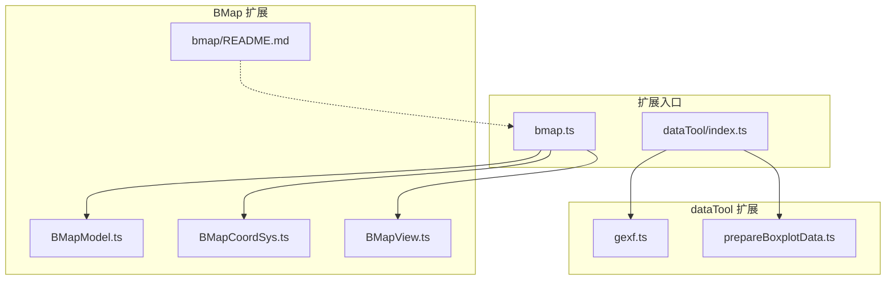
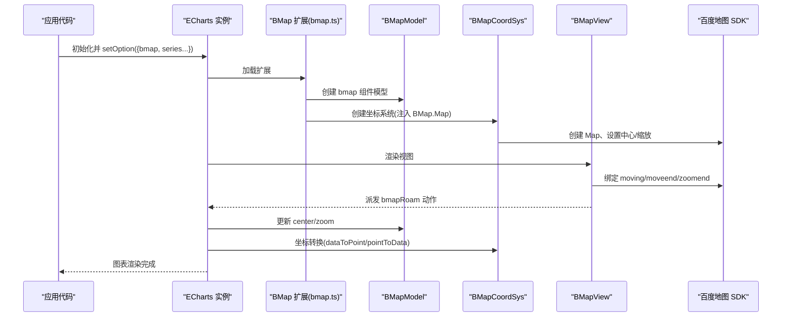
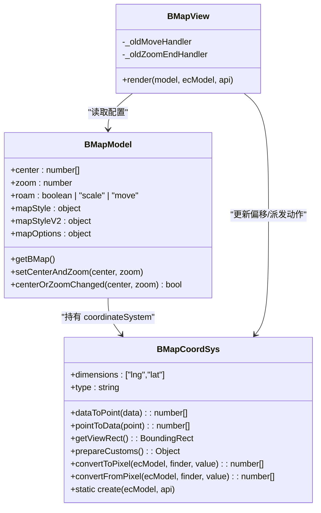
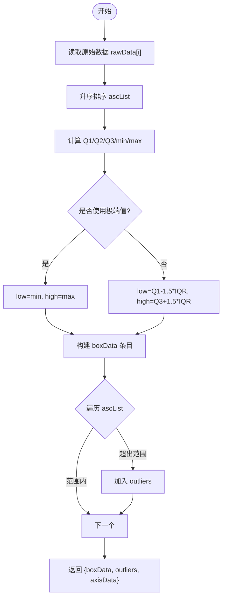
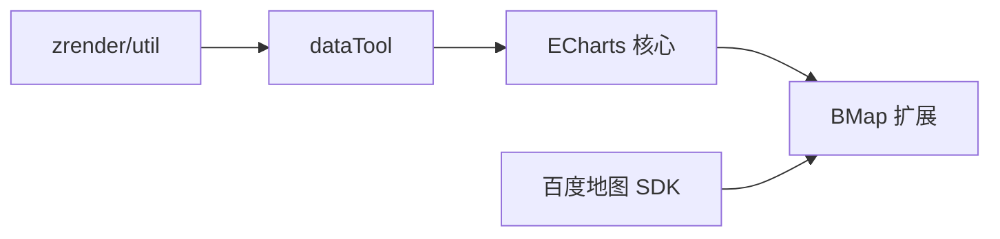

# 官方扩展

<cite>
**本文引用的文件**
- [extension-src/bmap/README.md](file://extension-src/bmap/README.md)
- [extension-src/bmap/bmap.ts](file://extension-src/bmap/bmap.ts)
- [extension-src/bmap/BMapCoordSys.ts](file://extension-src/bmap/BMapCoordSys.ts)
- [extension-src/bmap/BMapModel.ts](file://extension-src/bmap/BMapModel.ts)
- [extension-src/bmap/BMapView.ts](file://extension-src/bmap/BMapView.ts)
- [extension-src/dataTool/index.ts](file://extension-src/dataTool/index.ts)
- [extension-src/dataTool/gexf.ts](file://extension-src/dataTool/gexf.ts)
- [extension-src/dataTool/prepareBoxplotData.ts](file://extension-src/dataTool/prepareBoxplotData.ts)
- [test/bmap.html](file://test/bmap.html)
- [test/bmap2.html](file://test/bmap2.html)
- [test/bmap-mapOptions.html](file://test/bmap-mapOptions.html)
- [test/boxplot.html](file://test/boxplot.html)
</cite>

## 目录
1. [简介](#简介)
2. [项目结构](#项目结构)
3. [核心组件](#核心组件)
4. [架构总览](#架构总览)
5. [详细组件分析](#详细组件分析)
6. [依赖关系分析](#依赖关系分析)
7. [性能与优化](#性能与优化)
8. [故障排查指南](#故障排查指南)
9. [结论](#结论)
10. [附录：安装、配置与示例](#附录安装配置与示例)

## 简介
本文件系统性介绍 ECharts 官方扩展，重点覆盖：
- 百度地图扩展（BMap）的集成方式、地图初始化、图层管理、坐标转换与交互处理。
- 数据处理工具（dataTool）的功能：GEXF 格式解析、箱线图数据准备、数据分析与转换能力。
- 扩展的安装与配置：模块引入、依赖管理与环境要求。
- 使用示例与最佳实践：性能优化、错误处理与二次开发建议。

## 项目结构
ECharts 官方扩展位于 extension-src 目录下，主要包含两大扩展：
- bmap：百度地图坐标系与视图组件，提供与 BMap SDK 的桥接。
- dataTool：数据处理工具集，包括 GEXF 解析与箱线图数据准备等。

图表来源
- [extension-src/bmap/bmap.ts:20-43](file://extension-src/bmap/bmap.ts#L20-L43)
- [extension-src/dataTool/index.ts:20-43](file://extension-src/dataTool/index.ts#L20-L43)
- [extension-src/bmap/BMapModel.ts:30-95](file://extension-src/bmap/BMapModel.ts#L30-L95)
- [extension-src/bmap/BMapCoordSys.ts:106-351](file://extension-src/bmap/BMapCoordSys.ts#L106-L351)
- [extension-src/bmap/BMapView.ts:34-151](file://extension-src/bmap/BMapView.ts#L34-L151)
- [extension-src/dataTool/gexf.ts:20-223](file://extension-src/dataTool/gexf.ts#L20-L223)
- [extension-src/dataTool/prepareBoxplotData.ts:21-115](file://extension-src/dataTool/prepareBoxplotData.ts#L21-L115)

章节来源
- [extension-src/bmap/README.md:1-85](file://extension-src/bmap/README.md#L1-L85)

## 核心组件
- 百度地图扩展（BMap）
  - 模型层（BMapModel）：定义 bmap 组件的配置项与默认值，如 center、zoom、roam、mapStyle/mapStyleV2、mapOptions。
  - 坐标系统（BMapCoordSys）：实现经纬度与屏幕像素的双向转换、视图矩形、漫游变换、自定义尺寸计算等。
  - 视图层（BMapView）：监听百度地图移动/缩放事件，同步 ECharts 视口偏移，控制拖拽与滚轮缩放开关，应用地图样式。
  - 动作注册（bmap.ts）：注册 bmapRoam 动作，将地图中心与缩放回写到模型。
- 数据处理工具（dataTool）
  - GEXF 解析（gexf.ts）：将 GEXF XML 文档解析为节点与边集合，支持属性类型转换与可视化属性映射。
  - 箱线图数据准备（prepareBoxplotData.ts）：输入原始数值数组，输出箱线图所需箱体数据、异常值与轴标签。

章节来源
- [extension-src/bmap/BMapModel.ts:30-95](file://extension-src/bmap/BMapModel.ts#L30-L95)
- [extension-src/bmap/BMapCoordSys.ts:106-351](file://extension-src/bmap/BMapCoordSys.ts#L106-L351)
- [extension-src/bmap/BMapView.ts:34-151](file://extension-src/bmap/BMapView.ts#L34-L151)
- [extension-src/bmap/bmap.ts:20-43](file://extension-src/bmap/bmap.ts#L20-L43)
- [extension-src/dataTool/gexf.ts:20-223](file://extension-src/dataTool/gexf.ts#L20-L223)
- [extension-src/dataTool/prepareBoxplotData.ts:21-115](file://extension-src/dataTool/prepareBoxplotData.ts#L21-L115)

## 架构总览
BMap 扩展通过 ECharts 的坐标系与组件机制，将百度地图作为底层渲染容器，ECharts 的图形绘制以 Overlay 形式叠加在百度地图上。dataTool 则提供独立的数据处理能力，可配合 ECharts 的数据集与变换使用。

图表来源
- [extension-src/bmap/bmap.ts:20-43](file://extension-src/bmap/bmap.ts#L20-L43)
- [extension-src/bmap/BMapCoordSys.ts:266-351](file://extension-src/bmap/BMapCoordSys.ts#L266-L351)
- [extension-src/bmap/BMapView.ts:41-151](file://extension-src/bmap/BMapView.ts#L41-L151)

## 详细组件分析

### 百度地图扩展（BMap）
- 地图初始化
  - 通过 BMapCoordSys.create 创建 BMap.Map 实例，插入到 ECharts 的 DOM 容器中，并将 ZRender 的 viewport 作为 Overlay 添加到百度地图 labelPane。
  - 根据 BMapModel 的 center、zoom、mapOptions 进行初始定位与配置。
- 图层管理
  - 使用 BMap.Overlay 承载 ECharts 的渲染层，确保与百度地图图层顺序一致。
  - 视图层在渲染时重置 viewport 偏移，保证拖动后坐标对齐。
- 坐标转换
  - dataToPoint：经纬度 -> 屏幕像素，基于 BMap.pointToOverlayPixel。
  - pointToData：屏幕像素 -> 经纬度，基于 BMap.overlayPixelToPoint。
  - 提供 prepareCustoms 暴露 coord/size API 给自定义系列使用。
- 交互处理
  - 监听 moving/moveend/zoomend，派发 bmapRoam 动作，驱动 ECharts 布局更新。
  - 根据 roam 配置启用/禁用拖拽与缩放（滚轮、双击、捏合）。
  - 支持 mapStyle（2.x）与 mapStyleV2（3.x）动态切换。

图表来源
- [extension-src/bmap/BMapModel.ts:30-95](file://extension-src/bmap/BMapModel.ts#L30-L95)
- [extension-src/bmap/BMapCoordSys.ts:106-351](file://extension-src/bmap/BMapCoordSys.ts#L106-L351)
- [extension-src/bmap/BMapView.ts:34-151](file://extension-src/bmap/BMapView.ts#L34-L151)

章节来源
- [extension-src/bmap/BMapCoordSys.ts:106-351](file://extension-src/bmap/BMapCoordSys.ts#L106-L351)
- [extension-src/bmap/BMapView.ts:34-151](file://extension-src/bmap/BMapView.ts#L34-L151)
- [extension-src/bmap/BMapModel.ts:30-95](file://extension-src/bmap/BMapModel.ts#L30-L95)
- [extension-src/bmap/bmap.ts:20-43](file://extension-src/bmap/bmap.ts#L20-L43)

### 数据处理工具（dataTool）
- GEXF 解析
  - 支持字符串或 DOM 文档输入，解析 gexf/graph/nodes/edges/attributes。
  - 节点支持 viz:size/viz:position/viz:color 与 attvalues 属性，自动按类型转换 integer/float/boolean。
  - 边支持 viz:thickness/viz:color，映射到 lineStyle 的 width/color。
- 箱线图数据准备
  - 输入：二维数值数组，每组代表一个箱线图的原始样本。
  - 输出：boxData（箱体五数概括）、outliers（异常值）、axisData（类别标签）。
  - 支持 boundIQR 控制异常值阈值，layout 支持 horizontal/vertical。

图表来源
- [extension-src/dataTool/prepareBoxplotData.ts:21-115](file://extension-src/dataTool/prepareBoxplotData.ts#L21-L115)

章节来源
- [extension-src/dataTool/gexf.ts:20-223](file://extension-src/dataTool/gexf.ts#L20-L223)
- [extension-src/dataTool/prepareBoxplotData.ts:21-115](file://extension-src/dataTool/prepareBoxplotData.ts#L21-L115)
- [extension-src/dataTool/index.ts:20-43](file://extension-src/dataTool/index.ts#L20-L43)

## 依赖关系分析
- BMap 扩展依赖
  - ECharts 核心：registerCoordinateSystem、extendComponentModel、extendComponentView、util、graphic、matrix。
  - 百度地图 SDK：全局 BMap（Map、Point、MercatorProjection、Overlay）。
  - 运行时需确保 BMap 已加载，否则抛出错误。
- dataTool 扩展依赖
  - zrender/util 用于 DOM 遍历与数组映射。
  - 不依赖百度地图 SDK，可在任意环境中使用。

图表来源
- [extension-src/bmap/BMapCoordSys.ts:20-32](file://extension-src/bmap/BMapCoordSys.ts#L20-L32)
- [extension-src/bmap/BMapCoordSys.ts:266-351](file://extension-src/bmap/BMapCoordSys.ts#L266-L351)
- [extension-src/dataTool/gexf.ts:20-30](file://extension-src/dataTool/gexf.ts#L20-L30)

章节来源
- [extension-src/bmap/BMapCoordSys.ts:20-32](file://extension-src/bmap/BMapCoordSys.ts#L20-L32)
- [extension-src/dataTool/gexf.ts:20-30](file://extension-src/dataTool/gexf.ts#L20-L30)

## 性能与优化
- 坐标转换性能
  - Mercator 投影计算较慢，当前实现优先使用 BMap.pointToOverlayPixel/overlayPixelToPoint 进行像素级转换，避免频繁投影计算。
- 地图样式更新
  - 视图层仅在 mapStyle/mapStyleV2 变化时调用 setMapStyle/setMapStyleV2，减少重复渲染开销。
- 交互节流
  - 在渲染期间屏蔽 moving/moveend/zoomend 回调，避免重入导致的抖动与多余更新。
- 大数据量建议
  - 结合数据集与 transform（如 boxplot 变换）预处理数据，降低渲染压力。
  - 合理设置 symbolSize、label 显示策略，减少视觉元素数量。

[本节为通用指导，无需具体文件引用]

## 故障排查指南
- 未加载百度地图 SDK
  - 现象：初始化时报错提示 BMap API 未加载。
  - 解决：确保在页面中引入百度地图 JS SDK，并正确配置 ak。
- 仅允许一个 bmap 组件
  - 现象：同时存在多个 bmap 组件会抛错。
  - 解决：每个图表实例仅使用一个 bmap 组件。
- 地图样式闪烁或空白瓦片
  - 现象：拖动过程中可能出现短暂空白。
  - 解决：避免高频调用 setMapStyle；必要时合并样式变更再一次性应用。
- 坐标错位
  - 现象：拖动后图形位置偏移。
  - 解决：确认视图层正确更新 viewport 偏移，并确保 ECharts 容器尺寸稳定。

章节来源
- [extension-src/bmap/BMapCoordSys.ts:266-351](file://extension-src/bmap/BMapCoordSys.ts#L266-L351)
- [extension-src/bmap/BMapView.ts:41-151](file://extension-src/bmap/BMapView.ts#L41-L151)

## 结论
- BMap 扩展将百度地图作为底图，通过坐标系统与视图层无缝集成 ECharts 的渲染管线，支持丰富的交互与样式定制。
- dataTool 提供了实用的数据解析与统计工具，便于快速构建复杂图表（如图谱、箱线图）。
- 在实际项目中，应关注依赖加载、性能优化与错误处理，以获得稳定高效的可视化体验。

[本节为总结性内容，无需具体文件引用]

## 附录：安装、配置与示例

### 安装与引入
- 浏览器直接引入
  - 先引入百度地图 JS SDK（含 ak），再引入 ECharts 与 bmap 扩展。
  - 参考路径：[extension-src/bmap/README.md:19-40](file://extension-src/bmap/README.md#L19-L40)
- Webpack 打包引入
  - require('echarts') 与 require('echarts/extension/bmap/bmap')。
  - 参考路径：[extension-src/bmap/README.md:33-40](file://extension-src/bmap/README.md#L33-L40)

章节来源
- [extension-src/bmap/README.md:19-40](file://extension-src/bmap/README.md#L19-L40)

### 地图初始化与配置
- 基本配置项
  - center：中心经纬度。
  - zoom：缩放级别。
  - roam：是否开启拖拽与缩放（'move'/'scale'/true/false）。
  - mapStyle/mapStyleV2：地图样式（2.x/3.x）。
  - mapOptions：百度地图初始化选项。
- 获取百度地图实例
  - 通过 chart.getModel().getComponent('bmap').getBMap() 获取，以便添加控件或调用原生 API。
- 参考示例
  - 全国主要城市空气质量（散点/特效散点）：[test/bmap.html:448-655](file://test/bmap.html#L448-L655)
  - 使用 v3.0 SDK 的示例：[test/bmap2.html:21-45](file://test/bmap2.html#L21-L45)
  - 使用 mapOptions 的示例：[test/bmap-mapOptions.html:21-45](file://test/bmap-mapOptions.html#L21-L45)

章节来源
- [extension-src/bmap/README.md:42-85](file://extension-src/bmap/README.md#L42-L85)
- [test/bmap.html:448-655](file://test/bmap.html#L448-L655)
- [test/bmap2.html:21-45](file://test/bmap2.html#L21-L45)
- [test/bmap-mapOptions.html:21-45](file://test/bmap-mapOptions.html#L21-L45)

### 坐标转换与交互
- 坐标转换
  - dataToPoint：经纬度转屏幕像素。
  - pointToData：屏幕像素转经纬度。
  - 参考路径：[extension-src/bmap/BMapCoordSys.ts:142-166](file://extension-src/bmap/BMapCoordSys.ts#L142-L166)
- 交互处理
  - 监听 moving/moveend/zoomend，派发 bmapRoam 动作，更新模型中心与缩放。
  - 参考路径：[extension-src/bmap/BMapView.ts:47-98](file://extension-src/bmap/BMapView.ts#L47-L98)
  - 动作处理器：[extension-src/bmap/bmap.ts:30-40](file://extension-src/bmap/bmap.ts#L30-L40)

章节来源
- [extension-src/bmap/BMapCoordSys.ts:142-166](file://extension-src/bmap/BMapCoordSys.ts#L142-L166)
- [extension-src/bmap/BMapView.ts:47-98](file://extension-src/bmap/BMapView.ts#L47-L98)
- [extension-src/bmap/bmap.ts:30-40](file://extension-src/bmap/bmap.ts#L30-L40)

### dataTool 使用
- GEXF 解析
  - 函数 parse(xml)：支持字符串或 DOM 文档，返回 nodes 与 links。
  - 参考路径：[extension-src/dataTool/gexf.ts:30-61](file://extension-src/dataTool/gexf.ts#L30-L61)
- 箱线图数据准备
  - 函数 prepareBoxplotData(rawData, opt)：返回 boxData、outliers、axisData。
  - 参考路径：[extension-src/dataTool/prepareBoxplotData.ts:61-115](file://extension-src/dataTool/prepareBoxplotData.ts#L61-L115)
- 挂载到 echarts.dataTool
  - 兼容旧版本，将 gexf 与 prepareBoxplotData 挂载至 echarts.dataTool。
  - 参考路径：[extension-src/dataTool/index.ts:33-43](file://extension-src/dataTool/index.ts#L33-L43)
- 示例
  - 箱线图示例（结合 dataset 与 transform）：[test/boxplot.html:85-214](file://test/boxplot.html#L85-L214)

章节来源
- [extension-src/dataTool/gexf.ts:30-61](file://extension-src/dataTool/gexf.ts#L30-L61)
- [extension-src/dataTool/prepareBoxplotData.ts:61-115](file://extension-src/dataTool/prepareBoxplotData.ts#L61-L115)
- [extension-src/dataTool/index.ts:33-43](file://extension-src/dataTool/index.ts#L33-L43)
- [test/boxplot.html:85-214](file://test/boxplot.html#L85-L214)

### 最佳实践
- 性能
  - 避免频繁样式更新；合并样式变更。
  - 合理使用 symbolSize、label 显示策略，减少渲染负担。
  - 使用数据集与 transform 预处理数据。
- 错误处理
  - 确保百度地图 SDK 已加载；捕获初始化错误。
  - 限制单实例 bmap 组件；避免多实例冲突。
- 二次开发
  - 基于 BMapCoordSys 扩展自定义坐标转换逻辑。
  - 在 BMapView 中扩展交互行为（如自定义控件联动）。
  - 在 dataTool 中新增数据解析器或统计方法，并通过 index.ts 导出。

[本节为通用指导，无需具体文件引用]