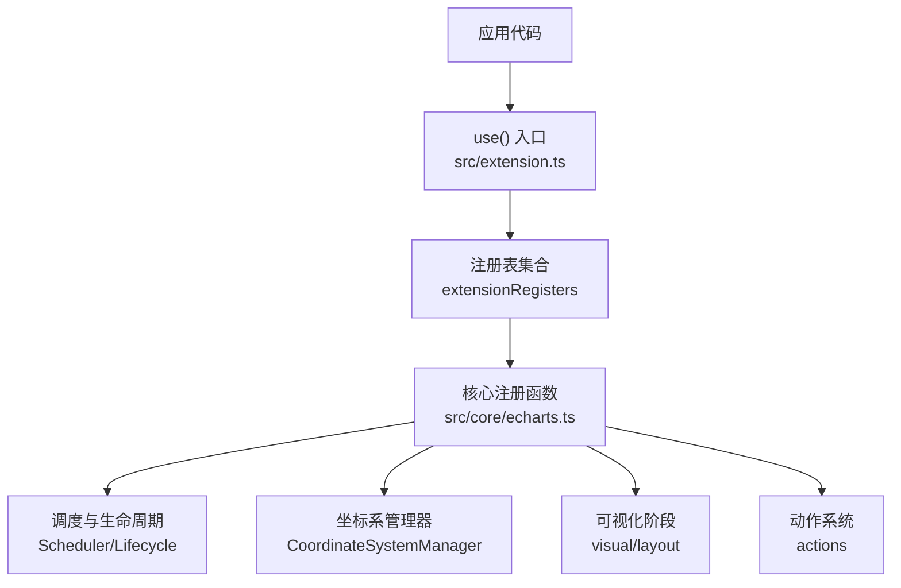
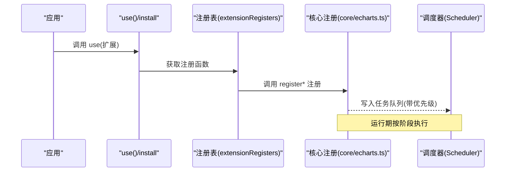
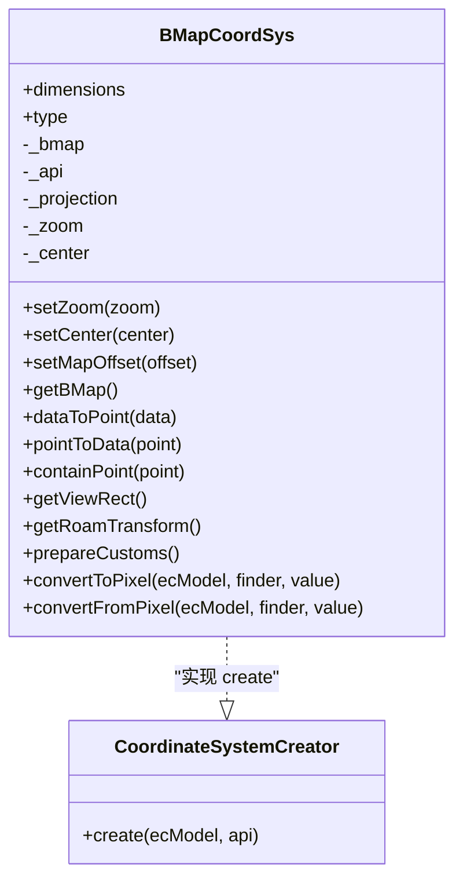
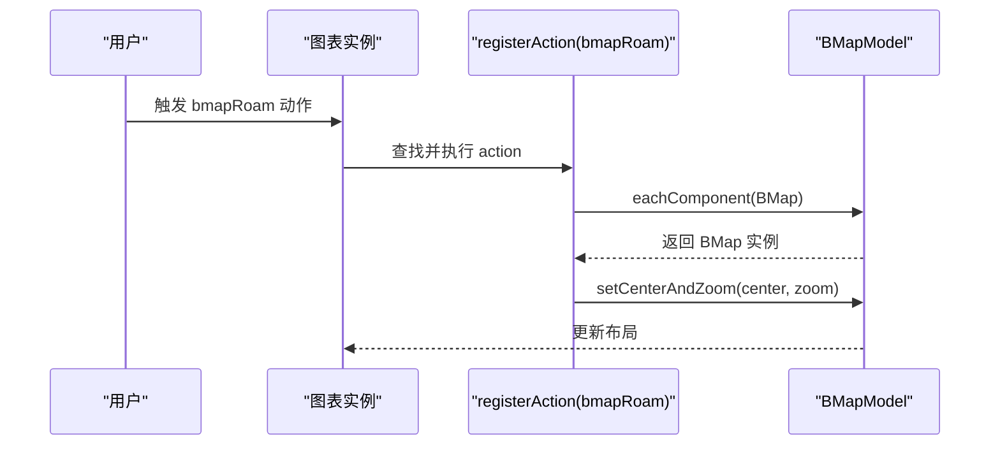
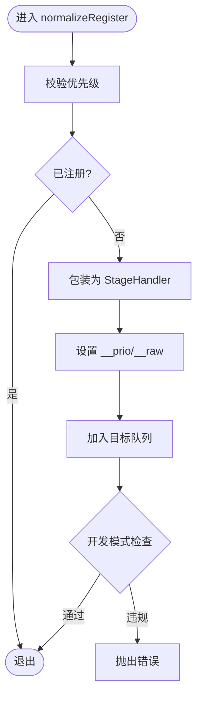
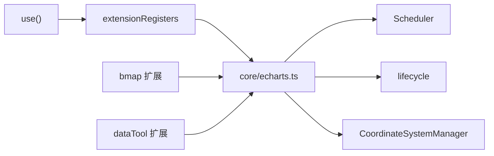

# 扩展 API 使用

<cite>
**本文引用的文件**
- [src/extension.ts](file://src/extension.ts)
- [src/core/echarts.ts](file://src/core/echarts.ts)
- [src/core/ExtensionAPI.ts](file://src/core/ExtensionAPI.ts)
- [extension-src/bmap/bmap.ts](file://extension-src/bmap/bmap.ts)
- [extension-src/bmap/BMapCoordSys.ts](file://extension-src/bmap/BMapCoordSys.ts)
- [extension-src/dataTool/index.ts](file://extension-src/dataTool/index.ts)
- [test/custom-register.html](file://test/custom-register.html)
</cite>

## 目录
1. [简介](#简介)
2. [项目结构](#项目结构)
3. [核心组件](#核心组件)
4. [架构总览](#架构总览)
5. [详细组件分析](#详细组件分析)
6. [依赖关系分析](#依赖关系分析)
7. [性能考量](#性能考量)
8. [故障排查指南](#故障排查指南)
9. [结论](#结论)
10. [附录](#附录)

## 简介
本文件系统性介绍 ECharts 的扩展 API 与注册机制，覆盖以下主题：
- 各类注册函数的作用与适用场景：registerPreprocessor、registerProcessor、registerAction、registerCoordinateSystem、registerLayout、registerVisual、registerTransform 等。
- 扩展安装器（EChartsExtensionInstaller）的实现模式：install 函数结构、依赖管理与版本兼容。
- use() 方法的调用方式：单个扩展、批量扩展与条件加载。
- 扩展开发完整示例：数据预处理、动作扩展、坐标系扩展、视觉映射扩展。
- 扩展调试、测试与分发的最佳实践。

## 项目结构
ECharts 将“扩展能力”通过统一的入口 use() 暴露给外部模块，内部由 core/echarts.ts 提供注册函数实现，并由 extension.ts 聚合导出。扩展以“插件式”组织，例如 bmap 扩展在 extension-src/bmap 中，dataTool 在 extension-src/dataTool 中。

图表来源
- [src/extension.ts:47-123](file://src/extension.ts#L47-L123)
- [src/core/echarts.ts:3055-3072](file://src/core/echarts.ts#L3055-L3072)
- [src/core/echarts.ts:3114-3188](file://src/core/echarts.ts#L3114-L3188)
- [src/core/echarts.ts:3190-3195](file://src/core/echarts.ts#L3190-L3195)
- [src/core/echarts.ts:3222-3238](file://src/core/echarts.ts#L3222-L3238)

章节来源
- [src/extension.ts:47-123](file://src/extension.ts#L47-L123)
- [src/core/echarts.ts:3055-3072](file://src/core/echarts.ts#L3055-L3072)

## 核心组件
- 扩展安装器与 use()：
  - use() 支持传入函数或对象形式的 install，也支持数组批量注册；同一扩展重复注册会被忽略。
  - 内部维护 extensions 列表，统一调用 ext.install(extensionRegisters)。
- 注册表（extensionRegisters）：
  - 封装了所有注册函数与类型，如 registerPreprocessor、registerProcessor、registerAction、registerCoordinateSystem、registerLayout、registerVisual、registerTransform、registerLoading、registerMap、registerUpdateLifecycle、PRIORITY 等。
  - 同时暴露 ComponentModel/SeriesModel/ChartView/ComponentView 以及自定义系列注册等辅助方法。
- 核心注册实现（core/echarts.ts）：
  - 提供各 register* 的具体实现，包括优先级管理、去重、包装为 StageHandler、写入目标队列等。
  - 内置默认项：向后兼容预处理器、数据堆栈处理器、默认加载效果、默认主题、默认动作等。

章节来源
- [src/extension.ts:47-123](file://src/extension.ts#L47-L123)
- [src/core/echarts.ts:3055-3072](file://src/core/echarts.ts#L3055-L3072)
- [src/core/echarts.ts:3075-3095](file://src/core/echarts.ts#L3075-L3095)
- [src/core/echarts.ts:3114-3188](file://src/core/echarts.ts#L3114-L3188)
- [src/core/echarts.ts:3190-3195](file://src/core/echarts.ts#L3190-L3195)
- [src/core/echarts.ts:3222-3238](file://src/core/echarts.ts#L3222-L3238)
- [src/core/echarts.ts:3369-3371](file://src/core/echarts.ts#L3369-L3371)

## 架构总览
扩展机制围绕“注册—调度—执行”展开：
- 注册阶段：通过 use() 调用 install，install 内调用各种 register* 将功能注入到全局注册表。
- 调度阶段：核心根据优先级对处理器、布局、视觉任务进行排序与包装，形成可执行的阶段任务。
- 执行阶段：在更新周期中按顺序触发 preprocessor、processor、layout、visual 等阶段，并配合生命周期钩子（afterinit/afterupdate）。

图表来源
- [src/extension.ts:101-123](file://src/extension.ts#L101-L123)
- [src/core/echarts.ts:3244-3288](file://src/core/echarts.ts#L3244-L3288)

## 详细组件分析

### 注册函数详解与使用场景
- registerPreprocessor
  - 作用：注册选项预处理器，用于在解析配置前对 option 做转换或兼容处理。
  - 典型场景：旧版配置迁移、字段标准化、默认值注入。
  - 关键点：去重注册，避免重复执行。
  - 参考路径
    - [src/core/echarts.ts:3055-3062](file://src/core/echarts.ts#L3055-L3062)
    - [src/core/echarts.ts:3369-3371](file://src/core/echarts.ts#L3369-L3371)

- registerProcessor
  - 作用：注册数据处理阶段处理器，支持优先级控制。
  - 典型场景：数据过滤、采样、堆叠、统计指标计算等。
  - 关键点：始终阻塞式运行（不支持渐进渲染），需关注性能。
  - 参考路径
    - [src/core/echarts.ts:3064-3072](file://src/core/echarts.ts#L3064-L3072)
    - [src/core/echarts.ts:3369-3371](file://src/core/echarts.ts#L3369-L3371)

- registerPostInit / registerPostUpdate / registerUpdateLifecycle
  - 作用：在初始化后或更新后插入自定义逻辑，或通过通用生命周期接口注册任意阶段回调。
  - 典型场景：图表就绪后的二次处理、联动刷新、埋点上报。
  - 参考路径
    - [src/core/echarts.ts:3075-3095](file://src/core/echarts.ts#L3075-L3095)

- registerAction
  - 作用：注册交互动作，绑定事件名与视图更新策略。
  - 典型场景：自定义交互（如地图平移缩放）、选择/高亮联动、跨实例通信。
  - 关键点：支持多种重载形式；事件名规范化；重复注册保护；可选 refineEvent 定制事件内容。
  - 参考路径
    - [src/core/echarts.ts:3114-3188](file://src/core/echarts.ts#L3114-L3188)
    - [extension-src/bmap/bmap.ts:29-40](file://extension-src/bmap/bmap.ts#L29-L40)

- registerCoordinateSystem
  - 作用：注册自定义坐标系，定义维度、坐标转换、视图矩形、漫游变换等。
  - 典型场景：地图坐标系、极坐标扩展、业务专属二维坐标系。
  - 关键点：create 工厂负责创建实例并与模型关联；dimensions 声明数据维度。
  - 参考路径
    - [src/core/echarts.ts:3190-3195](file://src/core/echarts.ts#L3190-L3195)
    - [extension-src/bmap/BMapCoordSys.ts:266-350](file://extension-src/bmap/BMapCoordSys.ts#L266-L350)

- registerLayout / registerVisual
  - 作用：注册布局与视觉编码阶段任务，支持优先级控制。
  - 典型场景：标签布局、节点排布、颜色/符号/尺寸映射、装饰绘制。
  - 关键点：统一通过 normalizeRegister 包装为 StageHandler；支持视觉类型标记；开发模式下检查是否允许 dirtyOnOverallProgress。
  - 参考路径
    - [src/core/echarts.ts:3222-3238](file://src/core/echarts.ts#L3222-L3238)
    - [src/core/echarts.ts:3244-3288](file://src/core/echarts.ts#L3244-L3288)
    - [src/core/echarts.ts:3359-3367](file://src/core/echarts.ts#L3359-L3367)

- registerTransform
  - 作用：注册外部数据转换器，供数据流或数据集使用。
  - 典型场景：数据清洗、格式转换、聚合计算。
  - 参考路径
    - [src/core/echarts.ts:3341-3341](file://src/core/echarts.ts#L3341-L3341)

- registerLoading / registerTheme / registerMap
  - 作用：注册加载动画、主题、地图数据。
  - 参考路径
    - [src/core/echarts.ts:3290-3295](file://src/core/echarts.ts#L3290-L3295)
    - [src/core/echarts.ts:3327-3339](file://src/core/echarts.ts#L3327-L3339)
    - [src/core/echarts.ts:3369-3371](file://src/core/echarts.ts#L3369-L3371)

章节来源
- [src/core/echarts.ts:3055-3072](file://src/core/echarts.ts#L3055-L3072)
- [src/core/echarts.ts:3075-3095](file://src/core/echarts.ts#L3075-L3095)
- [src/core/echarts.ts:3114-3188](file://src/core/echarts.ts#L3114-L3188)
- [src/core/echarts.ts:3190-3195](file://src/core/echarts.ts#L3190-L3195)
- [src/core/echarts.ts:3222-3238](file://src/core/echarts.ts#L3222-L3238)
- [src/core/echarts.ts:3244-3288](file://src/core/echarts.ts#L3244-L3288)
- [src/core/echarts.ts:3290-3295](file://src/core/echarts.ts#L3290-L3295)
- [src/core/echarts.ts:3327-3339](file://src/core/echarts.ts#L3327-L3339)
- [src/core/echarts.ts:3341-3341](file://src/core/echarts.ts#L3341-L3341)
- [src/core/echarts.ts:3359-3367](file://src/core/echarts.ts#L3359-L3367)
- [extension-src/bmap/bmap.ts:29-40](file://extension-src/bmap/bmap.ts#L29-L40)
- [extension-src/bmap/BMapCoordSys.ts:266-350](file://extension-src/bmap/BMapCoordSys.ts#L266-L350)

### 扩展安装器（EChartsExtensionInstaller）模式
- install 函数结构
  - 接收 extensionRegisters 作为参数，内部按需调用 register* 完成功能注入。
  - 可组合多个子扩展，通过递归 use() 实现依赖装配。
- 依赖管理
  - 通过 use() 的数组形式批量注册，自动去重，保证幂等性。
  - 可在 install 中先注册基础能力，再注册上层特性。
- 版本兼容
  - 扩展可暴露 version 字段，便于宿主判断兼容性。
  - dataTool 示例展示了挂载命名空间与版本信息的做法。
- 参考路径
  - [src/extension.ts:94-123](file://src/extension.ts#L94-L123)
  - [extension-src/bmap/bmap.ts:29-43](file://extension-src/bmap/bmap.ts#L29-L43)
  - [extension-src/dataTool/index.ts:20-43](file://extension-src/dataTool/index.ts#L20-L43)

章节来源
- [src/extension.ts:94-123](file://src/extension.ts#L94-L123)
- [extension-src/bmap/bmap.ts:29-43](file://extension-src/bmap/bmap.ts#L29-L43)
- [extension-src/dataTool/index.ts:20-43](file://extension-src/dataTool/index.ts#L20-L43)

### use() 方法调用方式
- 单个扩展
  - use(installFn) 或 use({ install })。
- 批量扩展
  - use([extA, extB])，内部遍历递归调用 use()。
- 条件加载
  - 在 install 中根据运行时环境或配置决定是否注册某些能力（例如仅在浏览器下注册地图相关能力）。
- 参考路径
  - [src/extension.ts:101-123](file://src/extension.ts#L101-L123)

章节来源
- [src/extension.ts:101-123](file://src/extension.ts#L101-L123)

### 扩展开发示例

#### 数据预处理扩展
- 目标：在 option 解析前进行字段标准化或兼容处理。
- 步骤：
  - 编写 OptionPreprocessor 函数。
  - 通过 registerPreprocessor 注册。
  - 在 install 中调用注册。
- 参考路径
  - [src/core/echarts.ts:3055-3062](file://src/core/echarts.ts#L3055-L3062)
  - [src/core/echarts.ts:3369-3371](file://src/core/echarts.ts#L3369-L3371)

#### 数据处理器扩展（registerProcessor）
- 目标：对数据进行过滤、采样、堆叠等处理。
- 步骤：
  - 编写 StageHandler，注意其阻塞特性。
  - 通过 registerProcessor(priority, handler) 注册。
  - 合理设置优先级，避免影响其他处理器。
- 参考路径
  - [src/core/echarts.ts:3064-3072](file://src/core/echarts.ts#L3064-L3072)
  - [src/core/echarts.ts:3369-3371](file://src/core/echarts.ts#L3369-L3371)

#### 动作扩展（registerAction）
- 目标：新增交互动作，如地图平移缩放。
- 步骤：
  - 定义 actionInfo（type、event、update、refineEvent 等）。
  - 通过 registerAction 注册。
  - 在视图中响应事件并触发更新。
- 参考路径
  - [src/core/echarts.ts:3114-3188](file://src/core/echarts.ts#L3114-L3188)
  - [extension-src/bmap/bmap.ts:29-40](file://extension-src/bmap/bmap.ts#L29-L40)

#### 坐标系扩展（registerCoordinateSystem）
- 目标：实现自定义坐标系，如百度地图。
- 步骤：
  - 定义 dimensions、create、dataToPoint、pointToData、getViewRect、convertToPixel 等方法。
  - 通过 registerCoordinateSystem('bmap', creator) 注册。
  - 在 create 中建立与模型的关联，处理 DOM 与第三方库集成。
- 参考路径
  - [src/core/echarts.ts:3190-3195](file://src/core/echarts.ts#L3190-L3195)
  - [extension-src/bmap/BMapCoordSys.ts:106-223](file://extension-src/bmap/BMapCoordSys.ts#L106-L223)
  - [extension-src/bmap/BMapCoordSys.ts:266-350](file://extension-src/bmap/BMapCoordSys.ts#L266-L350)

#### 视觉映射扩展（registerVisual）
- 目标：实现自定义视觉编码，如颜色、符号、尺寸映射。
- 步骤：
  - 编写 StageHandler，指定 visualType。
  - 通过 registerVisual(priority, handler) 注册。
  - 利用内置优先级常量控制执行顺序。
- 参考路径
  - [src/core/echarts.ts:3222-3238](file://src/core/echarts.ts#L3222-L3238)
  - [src/core/echarts.ts:3244-3288](file://src/core/echarts.ts#L3244-L3288)
  - [src/core/echarts.ts:3359-3367](file://src/core/echarts.ts#L3359-L3367)

#### 自定义系列（registerCustomSeries）
- 目标：注册自定义渲染器名称，简化 series.renderItem 配置。
- 步骤：
  - 通过 echarts.registerCustomSeries(name, renderItem) 注册。
  - 在 series 中使用 type: 'custom' 并指定 renderItem 名称。
- 参考路径
  - [test/custom-register.html:47-92](file://test/custom-register.html#L47-L92)

章节来源
- [src/core/echarts.ts:3055-3072](file://src/core/echarts.ts#L3055-L3072)
- [src/core/echarts.ts:3114-3188](file://src/core/echarts.ts#L3114-L3188)
- [src/core/echarts.ts:3190-3195](file://src/core/echarts.ts#L3190-L3195)
- [src/core/echarts.ts:3222-3238](file://src/core/echarts.ts#L3222-L3238)
- [src/core/echarts.ts:3244-3288](file://src/core/echarts.ts#L3244-L3288)
- [src/core/echarts.ts:3359-3367](file://src/core/echarts.ts#L3359-L3367)
- [extension-src/bmap/bmap.ts:29-40](file://extension-src/bmap/bmap.ts#L29-L40)
- [extension-src/bmap/BMapCoordSys.ts:106-223](file://extension-src/bmap/BMapCoordSys.ts#L106-L223)
- [extension-src/bmap/BMapCoordSys.ts:266-350](file://extension-src/bmap/BMapCoordSys.ts#L266-L350)
- [test/custom-register.html:47-92](file://test/custom-register.html#L47-L92)

### 类图：坐标系扩展（BMap）

图表来源
- [extension-src/bmap/BMapCoordSys.ts:106-223](file://extension-src/bmap/BMapCoordSys.ts#L106-L223)
- [extension-src/bmap/BMapCoordSys.ts:266-350](file://extension-src/bmap/BMapCoordSys.ts#L266-L350)

### 序列图：动作扩展流程（bmapRoam）

图表来源
- [extension-src/bmap/bmap.ts:29-40](file://extension-src/bmap/bmap.ts#L29-L40)
- [src/core/echarts.ts:3114-3188](file://src/core/echarts.ts#L3114-L3188)

### 流程图：注册与执行（normalizeRegister）

图表来源
- [src/core/echarts.ts:3244-3288](file://src/core/echarts.ts#L3244-L3288)

## 依赖关系分析
- 扩展入口依赖核心注册函数，核心注册函数依赖调度器与生命周期。
- 坐标系扩展依赖第三方地图库（如 BMap），并在 create 中进行 DOM 与图层集成。
- 数据工具扩展（dataTool）通过命名空间挂载能力，保持向后兼容。

图表来源
- [src/extension.ts:47-123](file://src/extension.ts#L47-L123)
- [src/core/echarts.ts:3055-3072](file://src/core/echarts.ts#L3055-L3072)
- [extension-src/bmap/bmap.ts:29-43](file://extension-src/bmap/bmap.ts#L29-L43)
- [extension-src/dataTool/index.ts:20-43](file://extension-src/dataTool/index.ts#L20-L43)

章节来源
- [src/extension.ts:47-123](file://src/extension.ts#L47-L123)
- [src/core/echarts.ts:3055-3072](file://src/core/echarts.ts#L3055-L3072)
- [extension-src/bmap/bmap.ts:29-43](file://extension-src/bmap/bmap.ts#L29-L43)
- [extension-src/dataTool/index.ts:20-43](file://extension-src/dataTool/index.ts#L20-L43)

## 性能考量
- 数据处理器（registerProcessor）为阻塞式，应避免耗时操作或拆分任务。
- 视觉与布局任务（registerVisual/registerLayout）可通过优先级控制执行顺序，减少不必要的重绘。
- 坐标系扩展中的投影计算可能较慢（如墨卡托），应缓存或优化。
- 使用 PRIORITY 常量确保关键任务优先执行，避免被低优先级任务阻塞。

[本节为通用指导，不直接分析具体文件]

## 故障排查指南
- 重复注册保护
  - 动作与处理器均支持重复注册保护，避免多次生效。
  - 若发现未生效，检查是否已被前置逻辑短路或优先级不当。
- 坐标系扩展缺失依赖
  - 如 BMap 未加载，create 中会抛出错误；需在扩展前确保第三方库可用。
- 事件冲突
  - 动作事件名需唯一或使用 refineEvent 区分；开发模式下会对共享事件名发出警告。
- 参考路径
  - [src/core/echarts.ts:3157-3188](file://src/core/echarts.ts#L3157-L3188)
  - [extension-src/bmap/BMapCoordSys.ts:270-280](file://extension-src/bmap/BMapCoordSys.ts#L270-L280)

章节来源
- [src/core/echarts.ts:3157-3188](file://src/core/echarts.ts#L3157-L3188)
- [extension-src/bmap/BMapCoordSys.ts:270-280](file://extension-src/bmap/BMapCoordSys.ts#L270-L280)

## 结论
ECharts 的扩展 API 通过 use() 与 extensionRegisters 提供了高度解耦的插件化能力。开发者可以基于 register* 系列函数在数据、交互、坐标系、视觉等层面进行扩展。结合生命周期与优先级机制，既能满足复杂业务需求，又能保持系统的可扩展性与可维护性。建议遵循官方示例与最佳实践，做好依赖管理、版本兼容与性能优化。

[本节为总结性内容，不直接分析具体文件]

## 附录
- 扩展调试
  - 使用开发模式下的断言与日志，定位重复注册、非法优先级等问题。
  - 在坐标系扩展中打印中间结果，验证坐标转换正确性。
- 扩展测试
  - 使用 test 目录下的 HTML 用例快速验证扩展行为（如 custom-register.html）。
  - 针对动作与坐标系编写独立用例，覆盖边界条件。
- 扩展分发
  - 暴露 version 字段，便于宿主判断兼容性。
  - 提供清晰的 install 入口与文档，说明依赖与使用方式。
- 参考路径
  - [test/custom-register.html:47-92](file://test/custom-register.html#L47-L92)
  - [extension-src/bmap/bmap.ts:29-43](file://extension-src/bmap/bmap.ts#L29-L43)
  - [extension-src/dataTool/index.ts:20-43](file://extension-src/dataTool/index.ts#L20-L43)

章节来源
- [test/custom-register.html:47-92](file://test/custom-register.html#L47-L92)
- [extension-src/bmap/bmap.ts:29-43](file://extension-src/bmap/bmap.ts#L29-L43)
- [extension-src/dataTool/index.ts:20-43](file://extension-src/dataTool/index.ts#L20-L43)