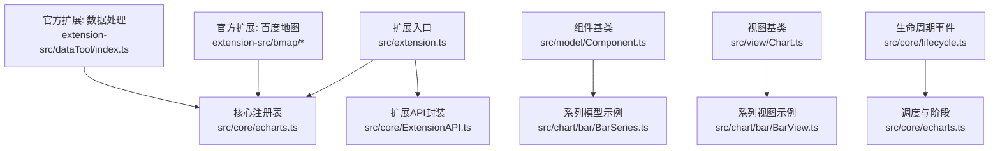
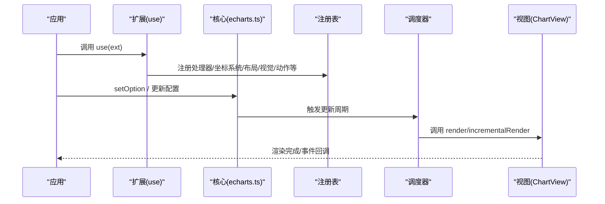
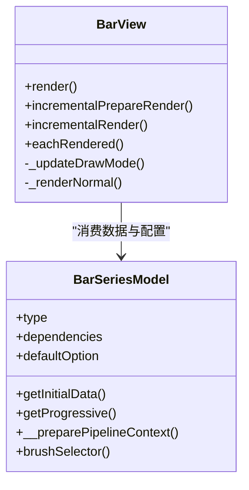
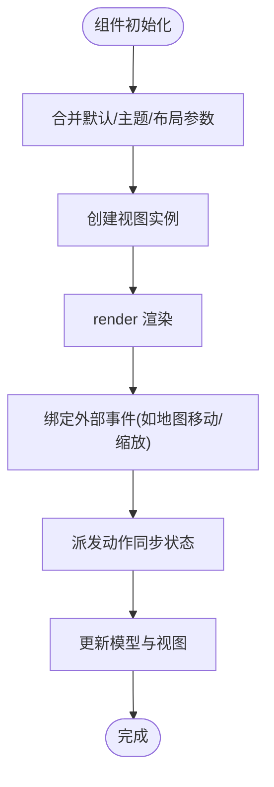
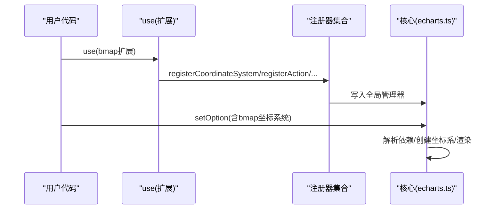
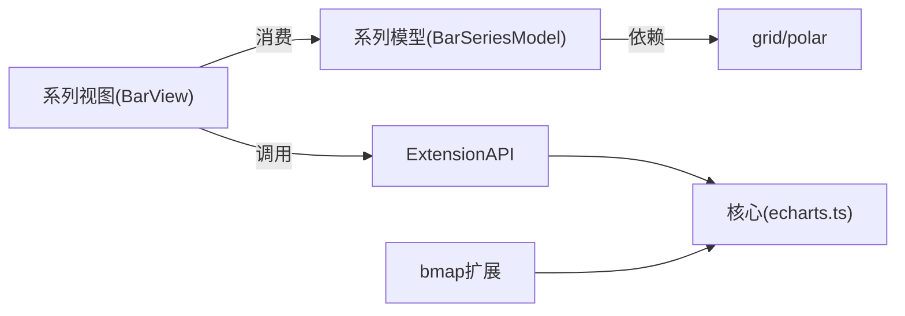

# 扩展开发

<cite>
**本文引用的文件**
- [src/extension.ts](file://src/extension.ts)
- [src/core/ExtensionAPI.ts](file://src/core/ExtensionAPI.ts)
- [src/core/lifecycle.ts](file://src/core/lifecycle.ts)
- [src/model/Component.ts](file://src/model/Component.ts)
- [src/view/Chart.ts](file://src/view/Chart.ts)
- [src/chart/bar/BarSeries.ts](file://src/chart/bar/BarSeries.ts)
- [src/chart/bar/BarView.ts](file://src/chart/bar/BarView.ts)
- [src/core/echarts.ts](file://src/core/echarts.ts)
- [extension-src/bmap/bmap.ts](file://extension-src/bmap/bmap.ts)
- [extension-src/bmap/BMapModel.ts](file://extension-src/bmap/BMapModel.ts)
- [extension-src/bmap/BMapView.ts](file://extension-src/bmap/BMapView.ts)
- [extension-src/dataTool/index.ts](file://extension-src/dataTool/index.ts)
</cite>

## 目录
1. [简介](#简介)
2. [项目结构](#项目结构)
3. [核心组件](#核心组件)
4. [架构总览](#架构总览)
5. [详细组件分析](#详细组件分析)
6. [依赖关系分析](#依赖关系分析)
7. [性能考量](#性能考量)
8. [故障排查指南](#故障排查指南)
9. [结论](#结论)
10. [附录](#附录)

## 简介
本文件系统性阐述 ECharts 的扩展开发机制与插件系统，覆盖自定义图表与自定义组件的开发流程、生命周期、布局计算、交互处理、扩展 API 使用（注册机制、依赖管理、版本兼容）、官方扩展（百度地图集成、数据处理工具）以及完整示例与调试方法、发布与分发最佳实践。文档以源码为依据，提供可追溯的文件引用与图示，帮助读者从入门到深入掌握 ECharts 扩展能力。

## 项目结构
ECharts 将“扩展点”集中在统一的入口中，通过 use 机制加载各类扩展；核心模型与视图分别位于 model 与 view 层；坐标系统与渲染管线由 core 与 coord 层支撑；官方扩展位于 extension-src 下，如 bmap 与 dataTool。

**图示来源**
- [src/extension.ts:47-123](file://src/extension.ts#L47-L123)
- [src/core/echarts.ts:3190-3223](file://src/core/echarts.ts#L3190-L3223)
- [src/core/ExtensionAPI.ts:32-77](file://src/core/ExtensionAPI.ts#L32-L77)
- [src/model/Component.ts:53-176](file://src/model/Component.ts#L53-L176)
- [src/view/Chart.ts:98-155](file://src/view/Chart.ts#L98-L155)
- [src/core/lifecycle.ts:55-65](file://src/core/lifecycle.ts#L55-L65)
- [extension-src/bmap/bmap.ts:20-43](file://extension-src/bmap/bmap.ts#L20-L43)
- [extension-src/dataTool/index.ts:20-43](file://extension-src/dataTool/index.ts#L20-L43)

**章节来源**
- [src/extension.ts:47-123](file://src/extension.ts#L47-L123)
- [src/core/echarts.ts:3190-3223](file://src/core/echarts.ts#L3190-L3223)

## 核心组件
- 扩展入口与注册：通过 use 接收函数或对象形式的扩展，统一注入注册器集合，支持注册预处理、处理器、动作、坐标系统、布局、视觉、变换、加载效果、地图、实现等。
- 扩展 API：为扩展提供受限的实例方法访问（如 getDom、getZr、dispatchAction、on/off、getOption 等），并暴露内部抽象方法用于获取坐标系、元素对应组件、高亮/选择/模糊状态切换等。
- 组件模型基类：提供默认选项合并、主题合并、布局参数合并、依赖解析、子类型默认值、布局模式等通用能力。
- 视图基类：提供渲染任务编排、增量渲染接口、高亮/取消高亮、移除与销毁、遍历已渲染元素等能力。

**章节来源**
- [src/extension.ts:47-123](file://src/extension.ts#L47-L123)
- [src/core/ExtensionAPI.ts:32-77](file://src/core/ExtensionAPI.ts#L32-L77)
- [src/model/Component.ts:53-176](file://src/model/Component.ts#L53-L176)
- [src/view/Chart.ts:98-155](file://src/view/Chart.ts#L98-L155)

## 架构总览
ECharts 的扩展体系围绕“注册—发现—执行”展开：
- 注册阶段：扩展通过 use 注入，调用注册器将自定义能力挂载到全局管理器（如坐标系统、布局、视觉、动作等）。
- 发现阶段：核心在构建 GlobalModel、创建坐标系、初始化系列时，根据依赖与类型查找已注册的模型/视图/坐标系统等。
- 执行阶段：调度器按优先级执行预处理、数据流、布局、视觉编码、渲染等阶段；扩展可在任意阶段介入。

**图示来源**
- [src/extension.ts:101-123](file://src/extension.ts#L101-L123)
- [src/core/echarts.ts:3190-3223](file://src/core/echarts.ts#L3190-L3223)
- [src/view/Chart.ts:271-320](file://src/view/Chart.ts#L271-L320)

## 详细组件分析

### 自定义图表开发流程
- 图表模型定义
  - 继承系列模型基类，声明 type、dependencies、defaultOption、坐标系统、初始数据构造、渐进式渲染开关、管道上下文准备、选择器适配等。
  - 参考柱状图系列模型的组织方式，明确数据维度、编码默认值、实时排序、裁剪与背景样式等。
- 视图渲染实现
  - 继承 ChartView，实现 render、incrementalPrepareRender、incrementalRender、eachRendered 等。
  - 根据坐标系统类型（直角/极坐标）分支绘制逻辑，支持大数据量下的渐进渲染与裁剪。
- 布局计算
  - 基于坐标系统的轴信息计算条形位置、尺寸、标签位置与旋转；必要时启用实时排序与增量更新。
- 交互处理
  - 利用高亮/选中/模糊状态切换，结合 filterForExposedEvent 控制事件透传；通过 ExtensionAPI 派发动作与订阅事件。

**图示来源**
- [src/chart/bar/BarSeries.ts:100-178](file://src/chart/bar/BarSeries.ts#L100-L178)
- [src/chart/bar/BarView.ts:98-163](file://src/chart/bar/BarView.ts#L98-L163)

**章节来源**
- [src/chart/bar/BarSeries.ts:100-178](file://src/chart/bar/BarSeries.ts#L100-L178)
- [src/chart/bar/BarView.ts:98-163](file://src/chart/bar/BarView.ts#L98-L163)

### 自定义组件开发方法
- 组件生命周期
  - 模型侧：init、mergeDefaultAndTheme、mergeOption、optionUpdated 等；负责默认项与主题合并、布局参数合并。
  - 视图侧：render、remove、dispose；负责 DOM/Canvas/SVG 元素管理与清理。
- 事件处理
  - 通过 ExtensionAPI 提供的 on/off 订阅实例级事件；在组件视图中监听外部库事件（如地图移动/缩放），并通过 dispatchAction 同步回 ECharts。
- 样式定制
  - 通过 defaultOption 与主题系统注入样式；在视图中按需更新 viewportRoot 样式或调用第三方库 API 设置样式。

**图示来源**
- [src/model/Component.ts:160-189](file://src/model/Component.ts#L160-L189)
- [src/view/Chart.ts:151-197](file://src/view/Chart.ts#L151-L197)
- [extension-src/bmap/BMapView.ts:41-147](file://extension-src/bmap/BMapView.ts#L41-L147)

**章节来源**
- [src/model/Component.ts:160-189](file://src/model/Component.ts#L160-L189)
- [src/view/Chart.ts:151-197](file://src/view/Chart.ts#L151-L197)
- [extension-src/bmap/BMapView.ts:41-147](file://extension-src/bmap/BMapView.ts#L41-L147)

### 扩展 API 的使用
- 注册机制
  - 通过 use 传入扩展函数或对象，统一注入注册器集合，支持注册预处理、处理器、动作、坐标系统、布局、视觉、变换、加载效果、地图、实现等。
- 依赖管理
  - 组件模型可通过 dependencies 声明对其它主类型的依赖；框架自动解析并保证加载顺序。
- 版本兼容
  - 扩展可导出 version 字段；dataTool 在旧版 echarts 上通过命名空间挂载保持兼容。

**图示来源**
- [src/extension.ts:47-123](file://src/extension.ts#L47-L123)
- [src/core/echarts.ts:3190-3223](file://src/core/echarts.ts#L3190-L3223)
- [extension-src/bmap/bmap.ts:20-43](file://extension-src/bmap/bmap.ts#L20-L43)
- [extension-src/dataTool/index.ts:20-43](file://extension-src/dataTool/index.ts#L20-L43)

**章节来源**
- [src/extension.ts:47-123](file://src/extension.ts#L47-L123)
- [src/core/echarts.ts:3190-3223](file://src/core/echarts.ts#L3190-L3223)
- [extension-src/bmap/bmap.ts:20-43](file://extension-src/bmap/bmap.ts#L20-L43)
- [extension-src/dataTool/index.ts:20-43](file://extension-src/dataTool/index.ts#L20-L43)

### 官方扩展功能
- 百度地图集成
  - 提供 bmap 坐标系统与组件，支持中心与缩放、漫游、地图样式（v2/v3）设置；在视图层监听地图事件并派发 bmapRoam 动作同步 ECharts 状态。
- 数据处理工具
  - 提供 gexf 解析与箱线图数据准备工具，并在 echarts.dataTool 命名空间下挂载以保持向后兼容。

**章节来源**
- [extension-src/bmap/BMapModel.ts:30-95](file://extension-src/bmap/BMapModel.ts#L30-L95)
- [extension-src/bmap/BMapView.ts:41-147](file://extension-src/bmap/BMapView.ts#L41-L147)
- [extension-src/dataTool/index.ts:20-43](file://extension-src/dataTool/index.ts#L20-L43)

## 依赖关系分析
- 组件模型依赖
  - 系列模型通过 static dependencies 声明对 grid/polar 等坐标系统主类型的依赖，确保在创建系列前这些组件已就绪。
- 视图与模型耦合
  - 视图消费模型的 getData、coordinateSystem、pipelineContext 等信息进行渲染；同时通过 ExtensionAPI 与核心交互。
- 扩展与核心
  - 扩展通过 use 注入注册器，核心在运行时根据类型与依赖查找并实例化相应组件/坐标系统/视图。

**图示来源**
- [src/chart/bar/BarSeries.ts:100-106](file://src/chart/bar/BarSeries.ts#L100-L106)
- [src/view/Chart.ts:98-155](file://src/view/Chart.ts#L98-L155)
- [src/core/ExtensionAPI.ts:32-77](file://src/core/ExtensionAPI.ts#L32-L77)
- [src/core/echarts.ts:3190-3223](file://src/core/echarts.ts#L3190-L3223)
- [extension-src/bmap/bmap.ts:20-43](file://extension-src/bmap/bmap.ts#L20-L43)

**章节来源**
- [src/chart/bar/BarSeries.ts:100-106](file://src/chart/bar/BarSeries.ts#L100-L106)
- [src/view/Chart.ts:98-155](file://src/view/Chart.ts#L98-L155)
- [src/core/ExtensionAPI.ts:32-77](file://src/core/ExtensionAPI.ts#L32-L77)
- [src/core/echarts.ts:3190-3223](file://src/core/echarts.ts#L3190-L3223)
- [extension-src/bmap/bmap.ts:20-43](file://extension-src/bmap/bmap.ts#L20-L43)

## 性能考量
- 渐进式渲染
  - 系列模型可通过 getProgressive 与 __preparePipelineContext 控制渐进渲染策略；视图需实现 incrementalPrepareRender 与 incrementalRender 分帧绘制，降低首屏压力。
- 大数据量优化
  - 柱状图在大数量模式下开启 large 标志，配合裁剪路径与增量更新减少重绘；避免每帧重复设置 clip。
- 布局与视觉阶段优先级
  - 核心定义了不同阶段的优先级常量，扩展应选择合适的优先级插入，避免阻塞关键路径。

**章节来源**
- [src/chart/bar/BarSeries.ts:118-138](file://src/chart/bar/BarSeries.ts#L118-L138)
- [src/chart/bar/BarView.ts:146-163](file://src/chart/bar/BarView.ts#L146-L163)
- [src/core/echarts.ts:158-187](file://src/core/echarts.ts#L158-L187)

## 故障排查指南
- 常见问题定位
  - 未实现 render：视图基类在开发模式下会抛出错误，提示必须实现 render。
  - 未知 dataType：高亮/取消高亮时若 payload 中的 dataType 不存在，会记录错误并跳过。
  - 不支持的坐标系统：视图在检测到不支持的坐标系统时会发出警告。
- 调试建议
  - 使用 ExtensionAPI 的 getZr/getDom 获取底层画布与 DOM 节点，检查元素层级与样式。
  - 通过 lifecycle 事件（如 series:beforeupdate、series:afterupdate）观察更新时机与数据变化。
  - 在百度地图扩展中，监听 moving/moveend/zoomend 事件，确认动作派发与状态同步是否生效。

**章节来源**
- [src/view/Chart.ts:151-183](file://src/view/Chart.ts#L151-L183)
- [src/chart/bar/BarView.ts:122-143](file://src/chart/bar/BarView.ts#L122-L143)
- [src/core/lifecycle.ts:55-65](file://src/core/lifecycle.ts#L55-L65)
- [extension-src/bmap/BMapView.ts:41-147](file://extension-src/bmap/BMapView.ts#L41-L147)

## 结论
ECharts 的扩展体系以清晰的模型/视图分层、强大的注册机制与灵活的扩展 API 为基础，支持自定义图表与组件的深度定制。通过合理设计模型与视图、利用生命周期与事件、遵循渐进渲染与优先级规范，开发者可以高效地扩展 ECharts 能力。官方扩展（百度地图、数据处理工具）提供了典型范式，可作为二次开发的参考。

## 附录
- 完整示例与调试方法
  - 自定义图表：参考柱状图的模型与视图组织，逐步实现数据构造、布局计算、渲染与交互。
  - 自定义组件：参考百度地图扩展，实现 Model/View/CoordSys 三件套，并在视图中绑定外部事件、派发动作。
  - 调试：结合 lifecycle 事件、ExtensionAPI 方法与浏览器开发者工具，逐步验证数据流与渲染结果。
- 发布与分发最佳实践
  - 导出 version 字段，便于运行时识别扩展版本。
  - 保持向后兼容：如 dataTool 通过命名空间挂载兼容旧版本。
  - 最小化依赖：仅注册必要能力，避免引入冗余模块。
  - 文档与测试：提供使用说明与用例，确保扩展在不同环境下的稳定性。