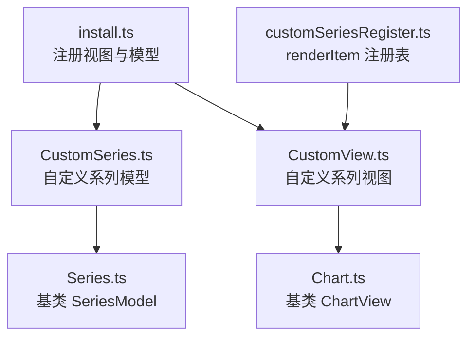
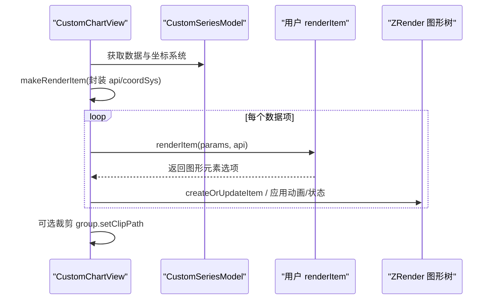
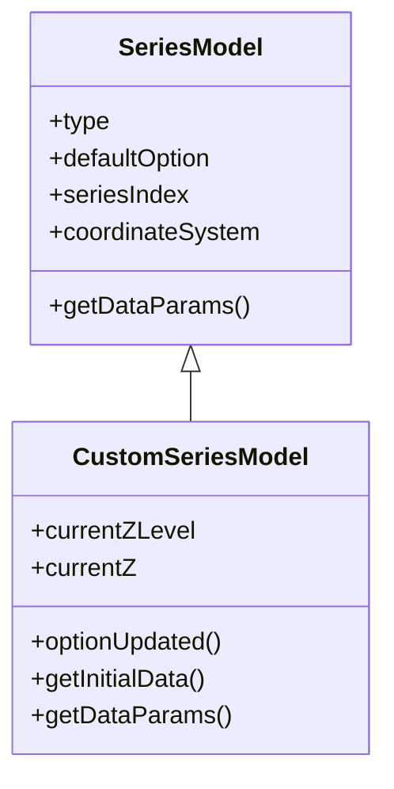
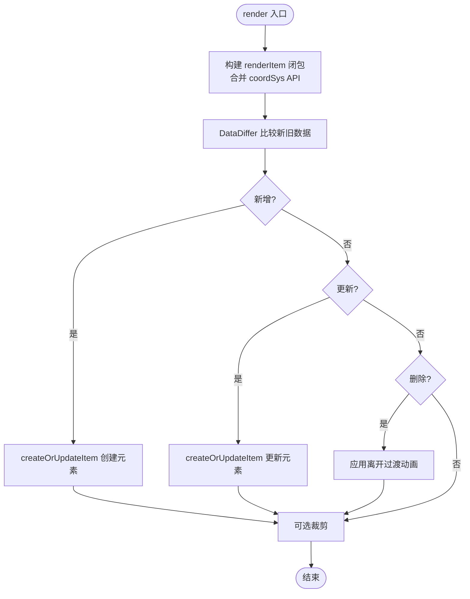
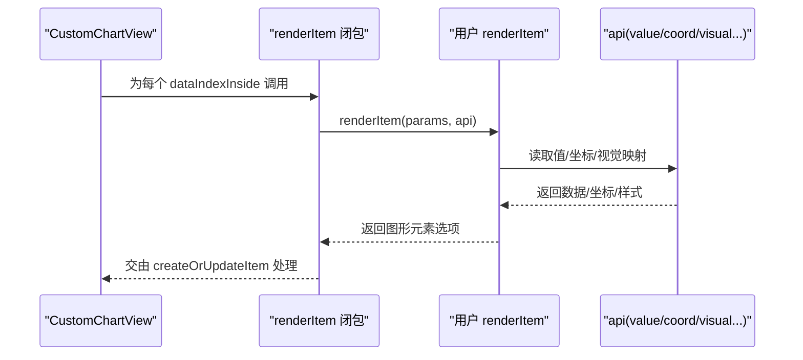
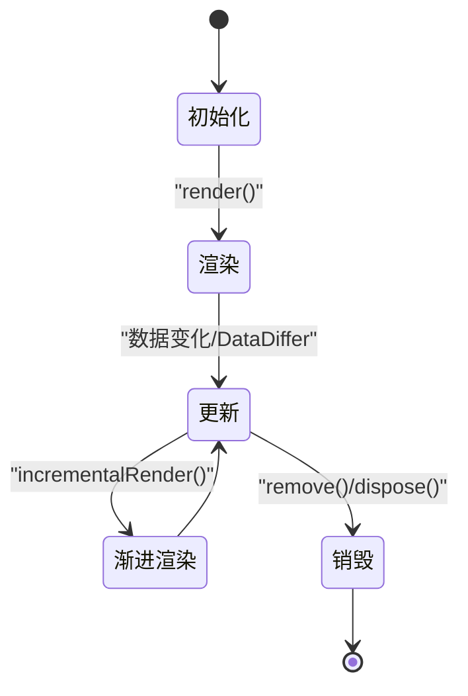
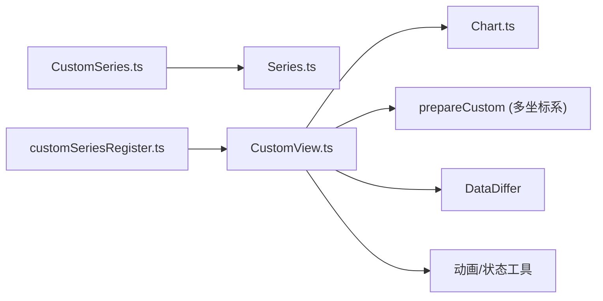

# 自定义图表开发

<cite>
**本文引用的文件**
- [src/chart/custom.ts](file://src/chart/custom.ts)
- [src/chart/custom/install.ts](file://src/chart/custom/install.ts)
- [src/chart/custom/CustomSeries.ts](file://src/chart/custom/CustomSeries.ts)
- [src/chart/custom/CustomView.ts](file://src/chart/custom/CustomView.ts)
- [src/chart/custom/customSeriesRegister.ts](file://src/chart/custom/customSeriesRegister.ts)
- [src/model/Series.ts](file://src/model/Series.ts)
- [src/view/Chart.ts](file://src/view/Chart.ts)
- [test/custom.html](file://test/custom.html)
- [test/custom-register.html](file://test/custom-register.html)
</cite>

## 目录
1. [简介](#简介)
2. [项目结构](#项目结构)
3. [核心组件](#核心组件)
4. [架构总览](#架构总览)
5. [详细组件分析](#详细组件分析)
6. [依赖分析](#依赖分析)
7. [性能考虑](#性能考虑)
8. [故障排查指南](#故障排查指南)
9. [结论](#结论)
10. [附录](#附录)

## 简介
本文件面向希望基于 ECharts 开发“自定义系列（Custom Series）”的开发者，系统讲解从模型与视图的继承、数据获取、布局计算到图形渲染的完整流程；深入解释 renderItem 函数的参数结构、数据访问、图形元素创建与样式设置；梳理自定义图表的生命周期（初始化、更新、销毁等阶段）；并提供基础图表、复杂交互图表的实现思路与性能优化技巧，以及调试方法与常见问题解决方案。

## 项目结构
ECharts 的自定义系列由“模型 + 视图”两部分组成：
- 模型层：继承自 SeriesModel，负责配置解析、数据准备、坐标系统依赖声明等。
- 视图层：继承自 ChartView，负责渲染、增量渲染、裁剪、事件过滤等。
- 注册与安装：通过 install 将自定义系列模型与视图注册到 ECharts 扩展系统中；支持以字符串形式复用 render 函数。

图示来源
- [src/chart/custom/install.ts:20-27](file://src/chart/custom/install.ts#L20-L27)
- [src/chart/custom/CustomSeries.ts:418-468](file://src/chart/custom/CustomSeries.ts#L418-L468)
- [src/chart/custom/CustomView.ts:207-330](file://src/chart/custom/CustomView.ts#L207-L330)
- [src/chart/custom/customSeriesRegister.ts:22-30](file://src/chart/custom/customSeriesRegister.ts#L22-L30)
- [src/model/Series.ts:149-200](file://src/model/Series.ts#L149-L200)
- [src/view/Chart.ts:98-197](file://src/view/Chart.ts#L98-L197)

章节来源
- [src/chart/custom.ts:21-24](file://src/chart/custom.ts#L21-L24)
- [src/chart/custom/install.ts:20-27](file://src/chart/custom/install.ts#L20-L27)

## 核心组件
- CustomSeriesModel（自定义系列模型）
  - 继承自 SeriesModel，声明依赖的坐标系统（grid/polar/geo/singleAxis/calendar/matrix）。
  - 提供默认选项（如 coordinateSystem、z/zlevel、clip 等），并实现 getInitialData、getDataParams 等方法。
- CustomChartView（自定义系列视图）
  - 继承自 ChartView，实现 render、incrementalPrepareRender、incrementalRender、filterForExposedEvent 等。
  - 负责数据 diff、元素创建/更新/删除、过渡动画、裁剪、渐进式渲染等。
- renderItem 与 API
  - 用户通过 series.renderItem 或注册的字符串类型返回图形元素树。
  - 内置 API 包括 value、ordinalRawValue、coord、size、layout、barLayout、visual、font、getWidth/getHeight/getZr 等。
- 注册机制
  - 支持 echarts.registerCustomSeries(type, renderItem)，并在 series.renderItem 中通过字符串引用。

章节来源
- [src/chart/custom/CustomSeries.ts:418-468](file://src/chart/custom/CustomSeries.ts#L418-L468)
- [src/chart/custom/CustomView.ts:207-330](file://src/chart/custom/CustomView.ts#L207-L330)
- [src/chart/custom/customSeriesRegister.ts:22-30](file://src/chart/custom/customSeriesRegister.ts#L22-L30)

## 架构总览
下图展示了自定义系列的渲染主流程：视图在 render 中构建 renderItem 闭包，遍历数据项调用用户 renderItem，生成图形元素并通过 DataDiffer 进行增删改；随后应用裁剪、状态与过渡动画。

图示来源
- [src/chart/custom/CustomView.ts:215-269](file://src/chart/custom/CustomView.ts#L215-L269)
- [src/chart/custom/CustomView.ts:627-753](file://src/chart/custom/CustomView.ts#L627-L753)

## 详细组件分析

### 自定义系列模型（CustomSeriesModel）
- 职责
  - 声明依赖坐标系统，便于视图在渲染时准备 coordSys 与 API。
  - 提供默认配置（如 clip 默认关闭，避免标签被裁剪）。
  - 管理当前 z/zlevel，供视图统一应用到元素层级。
  - 暴露 getDataParams 以便 tooltip 等组件读取 info 等额外信息。
- 关键方法
  - optionUpdated：同步 z/zlevel。
  - getInitialData：创建空数据容器。
  - getDataParams：附加 info 字段（来自内部存储）。

图示来源
- [src/model/Series.ts:149-200](file://src/model/Series.ts#L149-L200)
- [src/chart/custom/CustomSeries.ts:418-468](file://src/chart/custom/CustomSeries.ts#L418-L468)

章节来源
- [src/chart/custom/CustomSeries.ts:418-468](file://src/chart/custom/CustomSeries.ts#L418-L468)

### 自定义系列视图（CustomChartView）
- 职责
  - 渲染：根据数据差异创建/更新/移除图形元素，应用裁剪与状态。
  - 渐进式渲染：支持 incrementalPrepareRender/incrementalRender 分片渲染。
  - 事件过滤：支持按 name 过滤子元素事件。
- 关键流程
  - render：构造 renderItem 闭包，使用 DataDiffer 执行 add/remove/update。
  - 裁剪：根据 series.clip 决定是否设置 clipPath。
  - 状态与动画：为元素应用 normal/emphasis/blur/select 状态与过渡动画。

图示来源
- [src/chart/custom/CustomView.ts:215-269](file://src/chart/custom/CustomView.ts#L215-L269)
- [src/chart/custom/CustomView.ts:271-310](file://src/chart/custom/CustomView.ts#L271-L310)

章节来源
- [src/chart/custom/CustomView.ts:207-330](file://src/chart/custom/CustomView.ts#L207-L330)

### renderItem 函数详解
- 参数结构
  - params.context：本轮渲染上下文（生命周期内有效）。
  - params.dataIndex / dataIndexInside：原始索引与内部索引。
  - params.seriesId/name/index：系列标识。
  - params.coordSys：坐标系统信息（不同坐标系有不同字段）。
  - params.encode：维度映射结果。
  - params.itemPayload：用户配置的 itemPayload。
- API 能力
  - 数据访问：value(dim, idx)、ordinalRawValue(dim, idx)。
  - 坐标转换：coord(data, opt)、size(dataSize, dataItem)、layout(data, opt)。
  - 视觉映射：visual(type, idx)（颜色、symbol 等）。
  - 工具方法：font(opt)、barLayout(opt)、currentSeriesIndices()、getWidth/getHeight/getZr/getDevicePixelRatio。
- 返回值
  - 返回单个根元素选项或 null/undefined（不渲染该项）。
  - 支持 path/image/text/group/compoundPath 等内置图形类型。
- 示例参考
  - 基础条形图：使用 coord/size 计算矩形位置与尺寸，style 使用 visual('color')。
  - 气泡图：通过 registerCustomSeries 注册 renderItem，并以字符串形式在 series.renderItem 引用。

图示来源
- [src/chart/custom/CustomView.ts:627-753](file://src/chart/custom/CustomView.ts#L627-L753)
- [src/chart/custom/CustomSeries.ts:276-361](file://src/chart/custom/CustomSeries.ts#L276-L361)

章节来源
- [src/chart/custom/CustomView.ts:627-753](file://src/chart/custom/CustomView.ts#L627-L753)
- [src/chart/custom/CustomSeries.ts:276-361](file://src/chart/custom/CustomSeries.ts#L276-L361)

### 生命周期与阶段方法
- 初始化
  - 视图实例化时创建 Group 与 renderTask。
  - 首次 render 会清空组内容并建立初始数据引用。
- 更新
  - DataDiffer 驱动 add/remove/update，分别创建/更新/移除元素。
  - 支持 transition/keyframeAnimation 与状态切换（emphasis/blur/select）。
- 渐进式渲染
  - incrementalPrepareRender：清理旧数据与元素。
  - incrementalRender：按区间分批创建元素，标记 incremental ID 与 hoverLayer。
- 销毁
  - remove：移除所有子元素。
  - dispose：释放资源（可重写）。

图示来源
- [src/view/Chart.ts:138-197](file://src/view/Chart.ts#L138-L197)
- [src/chart/custom/CustomView.ts:215-310](file://src/chart/custom/CustomView.ts#L215-L310)

章节来源
- [src/view/Chart.ts:138-197](file://src/view/Chart.ts#L138-L197)
- [src/chart/custom/CustomView.ts:215-310](file://src/chart/custom/CustomView.ts#L215-L310)

### 完整开发示例（基于仓库测试用例）
- 基础图表（条形图）
  - 使用 renderItem 配合 coord/size 计算矩形，style 使用 visual('color')。
  - 参考路径：[test/custom.html:130-153](file://test/custom.html#L130-L153)
- 复杂交互（气泡图，注册 renderItem）
  - 通过 echarts.registerCustomSeries 注册 renderItem，并在 series.renderItem 中以字符串引用。
  - 参考路径：[test/custom-register.html:53-80](file://test/custom-register.html#L53-L80)
- 性能优化技巧
  - 使用 DataDiffer 仅处理变更项。
  - 合理使用 clip 控制裁剪范围。
  - 渐进式渲染 large 数据集。
  - 利用 keyframeAnimation/transition 减少重绘。
  - 参考路径：[src/chart/custom/CustomView.ts:215-310](file://src/chart/custom/CustomView.ts#L215-L310)

章节来源
- [test/custom.html:130-153](file://test/custom.html#L130-L153)
- [test/custom-register.html:53-80](file://test/custom-register.html#L53-L80)
- [src/chart/custom/CustomView.ts:215-310](file://src/chart/custom/CustomView.ts#L215-L310)

## 依赖分析
- 模块耦合
  - CustomSeriesModel 依赖 SeriesModel 与坐标系统（grid/polar/geo/singleAxis/calendar/matrix）。
  - CustomChartView 依赖 ChartView、各坐标系统的 prepareCustom、DataDiffer、动画与状态工具。
  - customSeriesRegister 提供 render 函数注册与查找，解耦具体实现。
- 外部依赖
  - zrender 图形元素与工具。
  - ECharts 内部 util/graphic、util/states、animation 等。

图示来源
- [src/chart/custom/CustomSeries.ts:418-468](file://src/chart/custom/CustomSeries.ts#L418-L468)
- [src/chart/custom/CustomView.ts:207-330](file://src/chart/custom/CustomView.ts#L207-L330)
- [src/chart/custom/customSeriesRegister.ts:22-30](file://src/chart/custom/customSeriesRegister.ts#L22-L30)
- [src/model/Series.ts:149-200](file://src/model/Series.ts#L149-L200)
- [src/view/Chart.ts:98-197](file://src/view/Chart.ts#L98-L197)

章节来源
- [src/chart/custom/CustomSeries.ts:418-468](file://src/chart/custom/CustomSeries.ts#L418-L468)
- [src/chart/custom/CustomView.ts:207-330](file://src/chart/custom/CustomView.ts#L207-L330)
- [src/chart/custom/customSeriesRegister.ts:22-30](file://src/chart/custom/customSeriesRegister.ts#L22-L30)
- [src/model/Series.ts:149-200](file://src/model/Series.ts#L149-L200)
- [src/view/Chart.ts:98-197](file://src/view/Chart.ts#L98-L197)

## 性能考虑
- 数据差异最小化：优先使用 DataDiffer 的 add/remove/update 回调，避免全量重建。
- 渐进式渲染：对大数据集启用 incrementalPrepareRender/incrementalRender，分片渲染降低卡顿。
- 裁剪策略：合理设置 series.clip，减少离屏绘制。
- 动画与过渡：仅在必要时开启 transition/keyframeAnimation，避免频繁形状插值。
- 视觉映射：尽量使用 api.visual 统一着色，减少重复计算。
- 元素复用：通过 name 区分子节点，提升 diff 效率。

[本节为通用指导，无需特定文件引用]

## 故障排查指南
- 常见错误
  - 未实现 render：基类 ChartView 的 render 会抛出错误提示需实现。
  - 坐标系不支持：若坐标系统未提供 prepareCustom，会报错。
  - 图形类型不存在：未知 type 会触发错误提示。
- 定位方法
  - 检查 series.coordinateSystem 是否匹配。
  - 确认 renderItem 已正确注册并可被字符串引用。
  - 查看控制台警告/错误信息（开发模式下有断言与告警）。
- 参考路径
  - 基类 render 抛错：[src/view/Chart.ts:151-155](file://src/view/Chart.ts#L151-L155)
  - 坐标系校验：[src/chart/custom/CustomView.ts:648-661](file://src/chart/custom/CustomView.ts#L648-L661)
  - 图形类型校验：[src/chart/custom/CustomView.ts:395-405](file://src/chart/custom/CustomView.ts#L395-L405)

章节来源
- [src/view/Chart.ts:151-155](file://src/view/Chart.ts#L151-L155)
- [src/chart/custom/CustomView.ts:648-661](file://src/chart/custom/CustomView.ts#L648-L661)
- [src/chart/custom/CustomView.ts:395-405](file://src/chart/custom/CustomView.ts#L395-L405)

## 结论
ECharts 的自定义系列通过“模型 + 视图”的清晰分层，提供了高度灵活的渲染能力。开发者只需实现 renderItem 与必要的配置，即可快速构建各类定制图表。借助 DataDiffer、坐标系统 API、视觉映射与动画机制，既能满足复杂交互需求，也能兼顾大数据场景的性能表现。建议在实际项目中结合渐进式渲染与合理的裁剪策略，以获得更优的用户体验。

## 附录
- 快速上手清单
  - 定义 series.type='custom'，设置 coordinateSystem。
  - 编写 renderItem，使用 api.value/coord/size/visual 完成数据到图形的映射。
  - 如需复用 render，使用 echarts.registerCustomSeries 并字符串引用。
  - 大数据场景启用渐进式渲染与裁剪。
- 参考示例路径
  - 基础条形图：[test/custom.html:130-153](file://test/custom.html#L130-L153)
  - 注册 renderItem 的气泡图：[test/custom-register.html:53-80](file://test/custom-register.html#L53-L80)