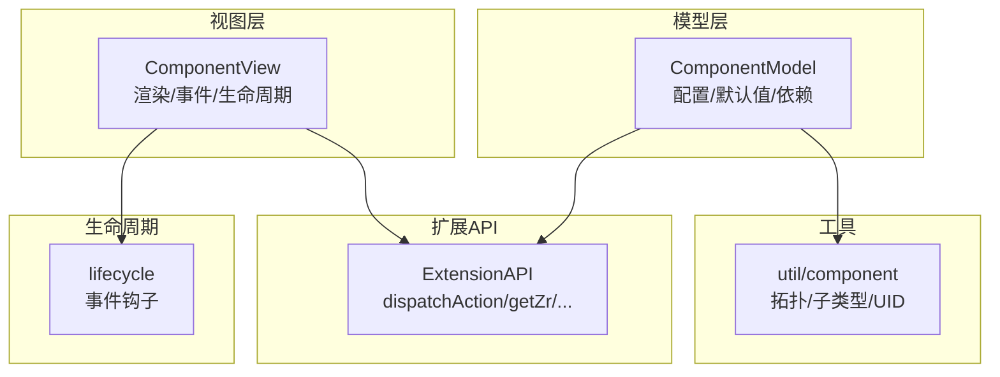
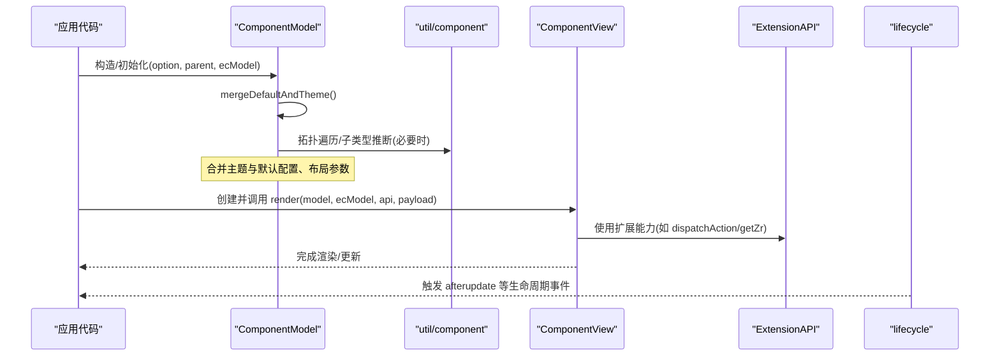
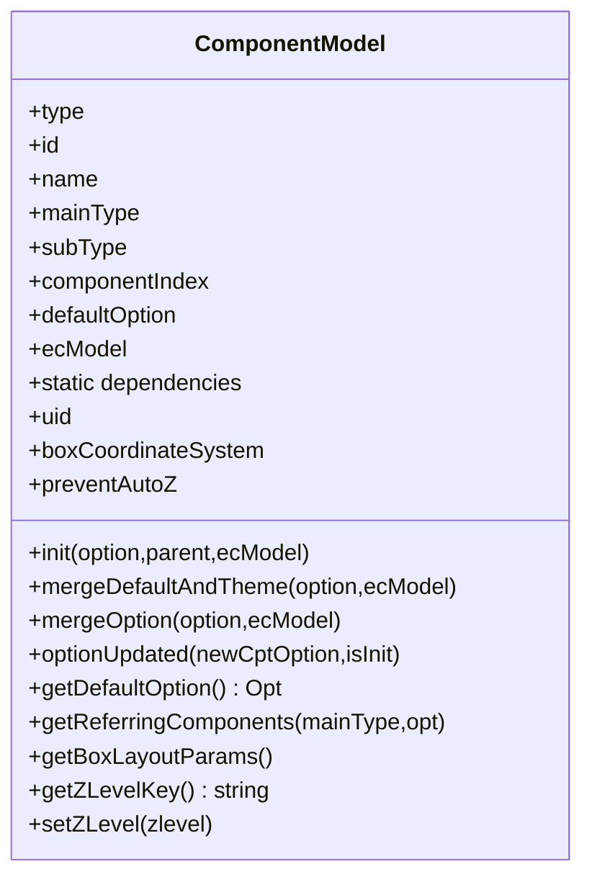
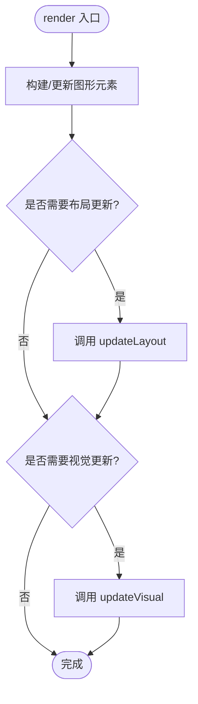
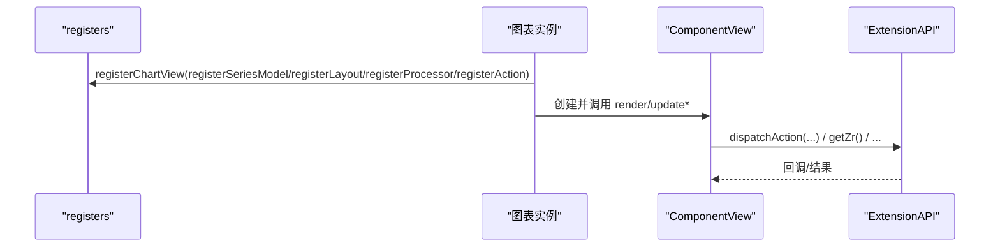
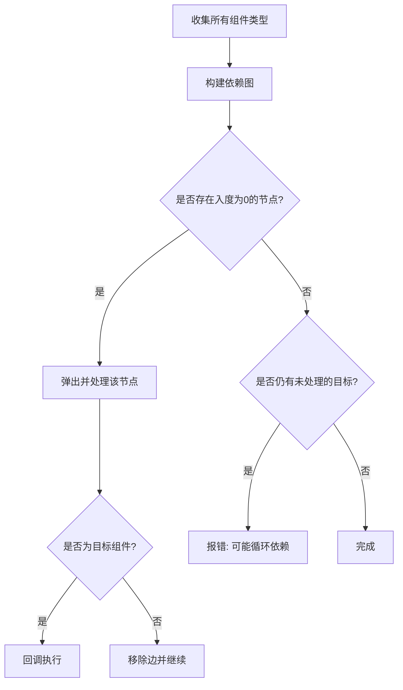

# 自定义组件开发

<cite>
**本文引用的文件**
- [src/model/Component.ts](file://src/model/Component.ts)
- [src/view/Component.ts](file://src/view/Component.ts)
- [src/core/ExtensionAPI.ts](file://src/core/ExtensionAPI.ts)
- [src/util/component.ts](file://src/util/component.ts)
- [src/core/lifecycle.ts](file://src/core/lifecycle.ts)
- [extension-src/bmap/BMapModel.ts](file://extension-src/bmap/BMapModel.ts)
- [src/chart/bar/install.ts](file://src/chart/bar/install.ts)
- [test/custom.html](file://test/custom.html)
</cite>

## 目录
1. [简介](#简介)
2. [项目结构](#项目结构)
3. [核心组件](#核心组件)
4. [架构总览](#架构总览)
5. [详细组件分析](#详细组件分析)
6. [依赖分析](#依赖分析)
7. [性能考虑](#性能考虑)
8. [故障排查指南](#故障排查指南)
9. [结论](#结论)
10. [附录](#附录)

## 简介
本文件面向希望为 ECharts 开发自定义组件的开发者，系统讲解组件模型（ComponentModel）与组件视图（ComponentView）的设计与实现要点，包括配置项处理、默认值合并、数据验证、依赖管理、DOM 操作、事件绑定、样式渲染与生命周期。同时说明组件与图表的集成机制（注册方式、通信接口、数据同步），并提供 UI 组件、工具组件与交互组件的开发示例路径与最佳实践，涵盖测试、发布与版本管理建议。

## 项目结构
ECharts 的组件体系由“模型-视图”分离构成：
- 模型层（model）负责配置解析、默认值合并、主题注入、依赖关系与布局参数处理。
- 视图层（view）负责基于 ZRender 的图形元素构建、更新、事件与生命周期管理。
- 扩展 API（ExtensionAPI）提供与图表实例交互的能力，如派发动作、获取尺寸、坐标系统等。
- 工具与基础设施（util）提供拓扑遍历、子类型推断、UID 生成等通用能力。
- 安装器（install）用于将系列、视图、布局、处理器、动作等注册到运行时。

**图示来源**
- [src/model/Component.ts:155-189](file://src/model/Component.ts#L155-L189)
- [src/view/Component.ts:87-112](file://src/view/Component.ts#L87-L112)
- [src/core/ExtensionAPI.ts:32-61](file://src/core/ExtensionAPI.ts#L32-L61)
- [src/util/component.ts:107-177](file://src/util/component.ts#L107-L177)
- [src/core/lifecycle.ts:55-69](file://src/core/lifecycle.ts#L55-L69)

**章节来源**
- [src/model/Component.ts:155-189](file://src/model/Component.ts#L155-L189)
- [src/view/Component.ts:87-112](file://src/view/Component.ts#L87-L112)
- [src/core/ExtensionAPI.ts:32-61](file://src/core/ExtensionAPI.ts#L32-L61)
- [src/util/component.ts:107-177](file://src/util/component.ts#L107-L177)
- [src/core/lifecycle.ts:55-69](file://src/core/lifecycle.ts#L55-L69)

## 核心组件
- ComponentModel：承载配置项、默认值、主题、布局参数、依赖声明与查询；提供 mergeDefaultAndTheme、mergeOption、getReferringComponents、getBoxLayoutParams 等方法。
- ComponentView：承载渲染组 group、生命周期方法 init/render/updateView/updateLayout/updateVisual/dispose，以及可选的 updateTransform/filterForExposedEvent/findHighDownDispatchers 等扩展点。
- ExtensionAPI：在视图与模型中可访问的运行时能力集合，包含 dispatchAction、getDom、getZr、getWidth/Height、updateLabelLayout 等。
- util/component：提供拓扑遍历 enableTopologicalTravel、子类型推断 enableSubTypeDefaulter、UID 生成 getUID、默认选项继承 inheritDefaultOption。
- lifecycle：定义图表级生命周期事件，如 series:beforeupdate、series:afterupdate、afterupdate 等，便于跨组件协作。

**章节来源**
- [src/model/Component.ts:155-189](file://src/model/Component.ts#L155-L189)
- [src/view/Component.ts:87-112](file://src/view/Component.ts#L87-L112)
- [src/core/ExtensionAPI.ts:32-61](file://src/core/ExtensionAPI.ts#L32-L61)
- [src/util/component.ts:107-177](file://src/util/component.ts#L107-L177)
- [src/core/lifecycle.ts:55-69](file://src/core/lifecycle.ts#L55-L69)

## 架构总览
下图展示了自定义组件从配置到渲染的关键流程，包括模型初始化、默认值合并、依赖解析、视图创建与渲染、以及通过扩展 API 进行交互。

**图示来源**
- [src/model/Component.ts:164-189](file://src/model/Component.ts#L164-L189)
- [src/util/component.ts:107-177](file://src/util/component.ts#L107-L177)
- [src/view/Component.ts:92-112](file://src/view/Component.ts#L92-L112)
- [src/core/ExtensionAPI.ts:32-61](file://src/core/ExtensionAPI.ts#L32-L61)
- [src/core/lifecycle.ts:55-69](file://src/core/lifecycle.ts#L55-L69)

## 详细组件分析

### 组件模型（ComponentModel）
- 配置项处理与默认值设置
  - 通过 mergeDefaultAndTheme 合并主题与默认选项，并在支持 box 布局时合并布局参数。
  - mergeOption 支持增量合并，保持布局参数的正确性。
  - getDefaultOption 支持 ES class 静态 defaultOption 与旧版 extend 方式的自动合并。
- 数据验证
  - 框架侧对 option 的结构化校验通常由上层 OptionManager 与具体组件的 parseOption 逻辑完成；自定义组件应遵循已有字段约定，避免非法值进入渲染阶段。
- 依赖管理
  - 通过 static dependencies 声明对其他主类型的依赖，框架会据此进行拓扑排序与按需加载。
  - getReferringComponents 提供按 index/id 引用其他组件的能力，便于联动。
- 布局与层级
  - getBoxLayoutParams 读取 left/right/top/bottom/width/height 等布局信息。
  - getZLevelKey/setZLevel 控制渐进式渲染的分层策略。

**图示来源**
- [src/model/Component.ts:53-142](file://src/model/Component.ts#L53-L142)
- [src/model/Component.ts:155-189](file://src/model/Component.ts#L155-L189)
- [src/model/Component.ts:252-283](file://src/model/Component.ts#L252-L283)
- [src/model/Component.ts:293-317](file://src/model/Component.ts#L293-L317)
- [src/model/Component.ts:338-344](file://src/model/Component.ts#L338-L344)

**章节来源**
- [src/model/Component.ts:155-189](file://src/model/Component.ts#L155-L189)
- [src/model/Component.ts:252-283](file://src/model/Component.ts#L252-L283)
- [src/model/Component.ts:293-317](file://src/model/Component.ts#L293-L317)
- [src/model/Component.ts:338-344](file://src/model/Component.ts#L338-L344)

### 组件视图（ComponentView）
- DOM 操作与图形构建
  - 基于 ZRender Group 作为根节点，通过 eachRendered 遍历新渲染的元素以支持渐进渲染。
- 事件绑定与过滤
  - filterForExposedEvent 可用于过滤暴露给外部的交互事件。
  - findHighDownDispatchers 支持按 name 的高亮/低亮联动。
- 样式渲染与生命周期
  - render 负责初次渲染；updateView/updateLayout/updateVisual 分别对应数据、布局、视觉的增量更新。
  - dispose 释放资源；toggleBlurSeries 支持标记类组件的模糊切换。
- 变换更新
  - updateTransform 可选实现，返回 {update: true} 表示需要重新计算变换。

**图示来源**
- [src/view/Component.ts:87-112](file://src/view/Component.ts#L87-L112)
- [src/view/Component.ts:118-129](file://src/view/Component.ts#L118-L129)

**章节来源**
- [src/view/Component.ts:87-112](file://src/view/Component.ts#L87-L112)
- [src/view/Component.ts:118-129](file://src/view/Component.ts#L118-L129)

### 组件与图表的集成机制
- 注册方式
  - 通过 install 函数向 registers 注册系列模型、视图、布局、处理器、动作等。例如 bar 的 install 注册了 BarSeries、BarView、布局与处理器，以及自定义动作 changeAxisOrder。
- 通信接口
  - 视图与模型可通过 ExtensionAPI 调用 dispatchAction 触发全局动作，或通过 getZr/getDom 与底层交互。
- 数据同步
  - 模型层负责配置与数据的解析与合并；视图层根据模型变化进行增量更新。通过 lifecycle 事件可在关键阶段执行副作用或跨组件协调。

**图示来源**
- [src/chart/bar/install.ts:31-77](file://src/chart/bar/install.ts#L31-L77)
- [src/core/ExtensionAPI.ts:32-61](file://src/core/ExtensionAPI.ts#L32-L61)

**章节来源**
- [src/chart/bar/install.ts:31-77](file://src/chart/bar/install.ts#L31-L77)
- [src/core/ExtensionAPI.ts:32-61](file://src/core/ExtensionAPI.ts#L32-L61)

### 完整开发示例与参考
- UI 组件示例
  - 标题组件：展示如何引入并使用内置组件的安装器进行 use。
  - 地图组件（BMap）：展示自定义组件模型的 defaultOption、属性与方法封装。
- 工具组件示例
  - 数据处理与采样：通过 processor 注册数据采样逻辑，提升大数据量下的性能。
- 交互组件示例
  - 自定义动作：通过 registerAction 定义动作类型与更新策略，配合视图中的事件处理实现交互。
- 参考用例
  - test/custom.html：演示自定义系列的 renderItem 用法，可作为自定义可视化元素的起点。

**章节来源**
- [src/component/title.ts:20-23](file://src/component/title.ts#L20-L23)
- [extension-src/bmap/BMapModel.ts:50-95](file://extension-src/bmap/BMapModel.ts#L50-L95)
- [src/chart/bar/install.ts:44-48](file://src/chart/bar/install.ts#L44-L48)
- [src/chart/bar/install.ts:59-74](file://src/chart/bar/install.ts#L59-L74)
- [test/custom.html:130-153](file://test/custom.html#L130-L153)

## 依赖分析
- 组件依赖拓扑
  - 通过 enableTopologicalTravel 构建依赖图并按拓扑序执行，确保先满足依赖再更新目标组件。
  - 若存在循环依赖，会在开发模式下抛出错误提示。
- 子类型推断
  - enableSubTypeDefaulter 允许根据 option 动态确定 subType，便于同一主类型下的多种变体。
- 外部依赖
  - 依赖 zrender 的图形系统与事件机制；通过 ExtensionAPI 与 ECharts 实例解耦。

**图示来源**
- [src/util/component.ts:107-177](file://src/util/component.ts#L107-L177)

**章节来源**
- [src/util/component.ts:107-177](file://src/util/component.ts#L107-L177)

## 性能考虑
- 渐进渲染与分层
  - 利用 getZLevelKey 为不同系列分配独立 zlevel，避免渐进渲染时的覆盖问题。
- 数据采样与预处理
  - 通过 processor 注册采样逻辑，减少渲染压力。
- 布局与视觉更新分离
  - 将布局与视觉更新拆分到 updateLayout 与 updateVisual，降低不必要的重绘。
- 事件过滤与高亮联动
  - 使用 filterForExposedEvent 减少不必要的事件传播；findHighDownDispatchers 精准定位高亮目标。

[本节为通用指导，不直接分析具体文件]

## 故障排查指南
- 循环依赖
  - 若拓扑遍历后仍有未处理的目标组件，会抛出错误提示可能存在循环依赖，需检查 dependencies 声明。
- 默认值未生效
  - 确认是否在静态 defaultOption 中正确声明，或使用 inheritDefaultOption 继承父类默认值。
- 视图未更新
  - 检查 render/updateView/updateLayout/updateVisual 是否正确实现；必要时返回 {update: true} 强制更新变换。
- 事件未触发
  - 确认是否通过 ExtensionAPI.dispatchAction 派发动作；检查 filterForExposedEvent 是否拦截了事件。

**章节来源**
- [src/util/component.ts:152-158](file://src/util/component.ts#L152-L158)
- [src/model/Component.ts:252-283](file://src/model/Component.ts#L252-L283)
- [src/view/Component.ts:35-45](file://src/view/Component.ts#L35-L45)
- [src/core/ExtensionAPI.ts:32-61](file://src/core/ExtensionAPI.ts#L32-L61)

## 结论
ECharts 的自定义组件体系以清晰的模型-视图分离为基础，结合强大的依赖拓扑、扩展 API 与生命周期机制，使开发者能够高效地扩展图表能力。遵循默认值合并、布局参数、依赖声明与视图生命周期规范，可以构建稳定、高性能且易维护的自定义组件。

[本节为总结性内容，不直接分析具体文件]

## 附录
- 测试建议
  - 使用单元测试验证模型默认值合并与依赖拓扑；使用端到端用例验证视图渲染与交互。
  - 参考 test/custom.html 编写交互与渲染用例。
- 发布与版本管理
  - 将组件拆分为独立模块，通过 install 统一注册；遵循语义化版本管理，明确 breaking changes。
  - 在文档中说明依赖的主类型与版本要求，提供最小可用示例。

[本节为通用指导，不直接分析具体文件]