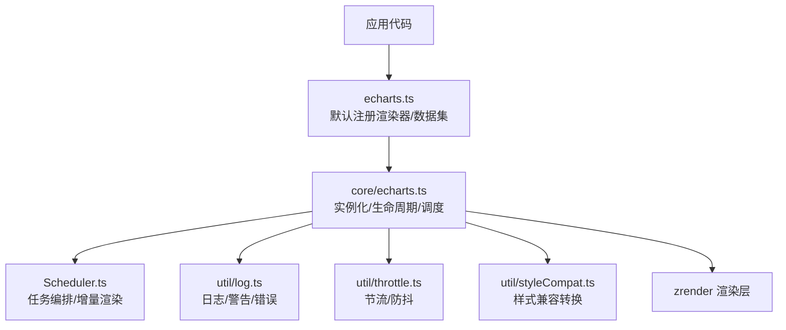
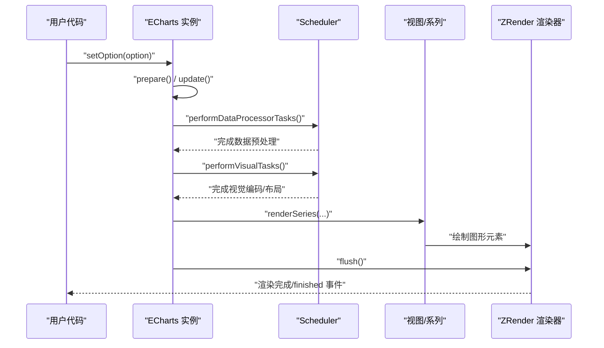
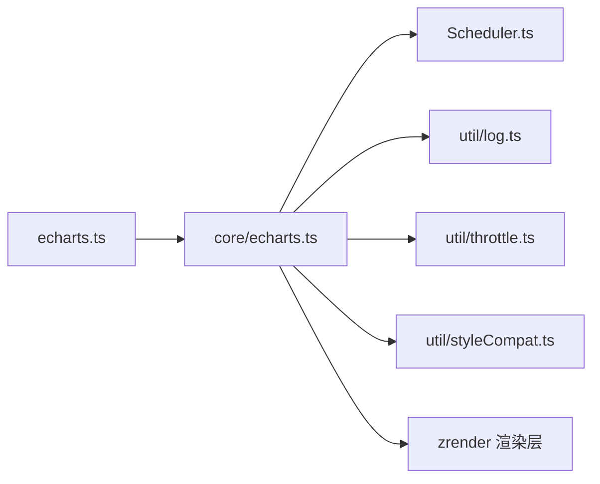

# 故障排除

<cite>
**本文引用的文件**
- [README.md](file://README.md)
- [src/echarts.ts](file://src/echarts.ts)
- [src/core/echarts.ts](file://src/core/echarts.ts)
- [src/util/log.ts](file://src/util/log.ts)
- [src/util/throttle.ts](file://src/util/throttle.ts)
- [src/core/Scheduler.ts](file://src/core/Scheduler.ts)
- [src/core/lifecycle.ts](file://src/core/lifecycle.ts)
- [src/util/styleCompat.ts](file://src/util/styleCompat.ts)
- [test/ios13-z-bug.html](file://test/ios13-z-bug.html)
- [test/manual-svg-color-bug-202311.html](file://test/manual-svg-color-bug-202311.html)
</cite>

## 目录
1. [简介](#简介)
2. [项目结构](#项目结构)
3. [核心组件](#核心组件)
4. [架构总览](#架构总览)
5. [详细组件分析](#详细组件分析)
6. [依赖关系分析](#依赖关系分析)
7. [性能注意事项](#性能注意事项)
8. [故障排查指南](#故障排查指南)
9. [结论](#结论)
10. [附录](#附录)

## 简介
本指南聚焦于 ECharts 使用过程中的常见问题诊断与解决方案，覆盖调试技巧（控制台日志、性能分析与内存泄漏检测）、常见错误识别与处理（配置错误、数据格式问题、渲染异常）、兼容性考虑（浏览器差异、移动端适配、降级策略），以及性能问题排查方法（渲染卡顿、内存占用过高、交互延迟优化）。文末汇总社区支持渠道与反馈方式。

## 项目结构
ECharts 的核心入口与初始化逻辑集中在核心模块中：
- 顶层导出与默认渲染器注册：负责暴露 init 并默认启用 Canvas 渲染器与数据集组件，便于兼容旧用法。
- 核心引擎：封装实例生命周期、调度器、事件系统、渲染管线与更新流程。
- 工具与辅助：日志输出、节流控制、样式兼容转换等。
- 测试用例：覆盖多端与多浏览器场景的回归与兼容性验证。

图表来源
- [src/echarts.ts:20-46](file://src/echarts.ts#L20-L46)
- [src/core/echarts.ts:520-618](file://src/core/echarts.ts#L520-L618)
- [src/core/Scheduler.ts:114-149](file://src/core/Scheduler.ts#L114-L149)
- [src/util/log.ts:23-53](file://src/util/log.ts#L23-L53)
- [src/util/throttle.ts:42-118](file://src/util/throttle.ts#L42-L118)
- [src/util/styleCompat.ts:36-128](file://src/util/styleCompat.ts#L36-L128)

章节来源
- [src/echarts.ts:20-46](file://src/echarts.ts#L20-L46)
- [src/core/echarts.ts:520-618](file://src/core/echarts.ts#L520-L618)

## 核心组件
- 实例与生命周期：ECharts 类管理 DOM、ZRender 实例、主题、语言、坐标系管理器、扩展 API、调度器与消息中心；提供 setOption、resize、事件绑定等能力。
- 调度器：统一编排数据处理、视觉编码、布局与渲染阶段，支持渐进式/增量渲染与流式更新。
- 日志系统：提供 log/warn/error/deprecateLog 等输出，开发环境增强可读性，生产环境可裁剪。
- 节流工具：为高频调用（如滚动、拖拽）提供固定速率执行或防抖策略，降低主线程压力。
- 样式兼容：在 EC4/EC5 风格之间进行转换，确保历史配置在新版本下仍可工作。

章节来源
- [src/core/echarts.ts:454-618](file://src/core/echarts.ts#L454-L618)
- [src/core/Scheduler.ts:114-149](file://src/core/Scheduler.ts#L114-L149)
- [src/util/log.ts:23-53](file://src/util/log.ts#L23-L53)
- [src/util/throttle.ts:42-118](file://src/util/throttle.ts#L42-L118)
- [src/util/styleCompat.ts:36-128](file://src/util/styleCompat.ts#L36-L128)

## 架构总览
下图展示了从用户调用到渲染输出的关键路径，包括 setOption 触发更新、调度器分派任务、视图渲染与帧刷新。

图表来源
- [src/core/echarts.ts:737-800](file://src/core/echarts.ts#L737-L800)
- [src/core/Scheduler.ts:292-303](file://src/core/Scheduler.ts#L292-L303)
- [src/core/echarts.ts:620-704](file://src/core/echarts.ts#L620-L704)

## 详细组件分析

### 日志与错误提示
- 日志输出：log/warn/error 统一以 “[ECharts]” 前缀输出，支持仅一次告警去重，便于快速定位重复问题。
- 开发模式增强：makePrintable 将复杂对象安全地序列化为可读字符串，便于上下文提示。
- 废弃项提示：deprecateLog/deprecateReplaceLog 在开发模式下提示弃用 API 及替代方案。
- 抛出错误：throwError 用于在非法配置时中断执行，配合上层 try/catch 捕获。

建议实践
- 在开发环境开启详细日志，结合 makePrintable 打印关键上下文。
- 对频繁触发的告警使用 onlyOnce 参数避免刷屏。
- 捕获抛出的错误并给出友好提示，必要时回退到降级渲染。

章节来源
- [src/util/log.ts:23-53](file://src/util/log.ts#L23-L53)
- [src/util/log.ts:78-130](file://src/util/log.ts#L78-L130)

### 调度与更新流程
- 更新周期：包含准备、完整更新、局部更新、渐进更新等阶段，避免嵌套调用导致的状态不一致。
- 任务编排：按优先级执行数据处理器、视觉编码、布局与渲染；支持 block/incremental 两种模式。
- 帧级推进：在动画帧中逐步推进未完成的任务，保证流畅度。

建议实践
- 避免在主流程中再次调用 setOption，防止嵌套更新。
- 对大数据集启用渐进渲染与采样，减少首屏耗时。
- 通过生命周期钩子监听 series:transition、afterupdate 等事件，做二次处理或埋点。

章节来源
- [src/core/echarts.ts:211-277](file://src/core/echarts.ts#L211-L277)
- [src/core/Scheduler.ts:185-206](file://src/core/Scheduler.ts#L185-L206)
- [src/core/Scheduler.ts:292-303](file://src/core/Scheduler.ts#L292-L303)
- [src/core/echarts.ts:620-704](file://src/core/echarts.ts#L620-L704)
- [src/core/lifecycle.ts:44-65](file://src/core/lifecycle.ts#L44-L65)

### 节流与交互优化
- 节流策略：支持固定速率执行与防抖两种模式，适用于滚动、缩放、拖拽等高频事件。
- 动态调整：可在运行时创建/更新/清除节流函数，避免内存泄漏。

建议实践
- 对 resize、mousemove、wheel 等高频事件使用节流包装。
- 在组件销毁时清理节流定时器，释放资源。

章节来源
- [src/util/throttle.ts:42-118](file://src/util/throttle.ts#L42-L118)
- [src/util/throttle.ts:141-184](file://src/util/throttle.ts#L141-L184)

### 样式兼容与渲染异常
- EC4/EC5 兼容：自动检测并转换 text/textStyle/textConfig 等属性，保证历史配置可用。
- 文本位置与富文本：在 normal/emphasis 状态间保持合理默认值，避免 hover 抖动。
- 自定义系列：提供将新样式映射回 EC4 风格的工具，便于插件生态兼容。

建议实践
- 升级后若出现文本错位/样式丢失，检查是否使用了已弃用的样式字段。
- 自定义系列尽量采用新样式体系，必要时使用兼容转换工具。

章节来源
- [src/util/styleCompat.ts:36-128](file://src/util/styleCompat.ts#L36-L128)
- [src/util/styleCompat.ts:169-212](file://src/util/styleCompat.ts#L169-L212)
- [src/util/styleCompat.ts:252-261](file://src/util/styleCompat.ts#L252-L261)

### 初始化与默认渲染器
- 默认行为：默认启用 Canvas 渲染器与数据集组件，提升开箱即用体验。
- 兼容导入：保留对旧版导入方式的兼容提示，引导迁移至命名空间导入。

建议实践
- 明确指定 renderer 为 canvas/svg，避免在不同环境下产生歧义。
- 使用命名空间导入以获得更好的类型提示与体积控制。

章节来源
- [src/echarts.ts:20-46](file://src/echarts.ts#L20-L46)

## 依赖关系分析
- echarts.ts 作为门面，默认安装渲染器与数据集，并暴露 init。
- core/echarts.ts 依赖 Scheduler、ZRender、主题、国际化、生命周期等模块。
- Scheduler 依赖全局模型、扩展 API、系列/组件视图，串联数据与渲染流水线。
- util 层被多处复用，提供日志、节流、样式兼容等通用能力。

图表来源
- [src/echarts.ts:20-46](file://src/echarts.ts#L20-L46)
- [src/core/echarts.ts:520-618](file://src/core/echarts.ts#L520-L618)
- [src/core/Scheduler.ts:114-149](file://src/core/Scheduler.ts#L114-L149)

章节来源
- [src/echarts.ts:20-46](file://src/echarts.ts#L20-L46)
- [src/core/echarts.ts:520-618](file://src/core/echarts.ts#L520-L618)
- [src/core/Scheduler.ts:114-149](file://src/core/Scheduler.ts#L114-L149)

## 性能注意事项
- 渐进/增量渲染：在大数据量场景下，优先启用 progressive/incremental，降低首帧耗时。
- 节流高频操作：对滚动、拖拽、缩放等事件使用节流，避免阻塞主线程。
- 避免嵌套更新：不要在渲染过程中调用 setOption，以免引发额外计算与重绘。
- 合理选择渲染器：Canvas 适合大量图形，SVG 适合少量且需精确交互的场景。
- 监控帧时间：利用 finished/rendered 事件与平台时间 API 评估每帧耗时。

[本节为通用指导，不直接分析具体文件]

## 故障排查指南

### 控制台日志查看
- 使用 warn/error 输出定位问题，关注 “[ECharts]” 前缀。
- 开发模式下借助 makePrintable 打印复杂对象，快速理解上下文。
- 对重复告警使用 onlyOnce 去重，避免干扰。

章节来源
- [src/util/log.ts:23-53](file://src/util/log.ts#L23-L53)
- [src/util/log.ts:78-130](file://src/util/log.ts#L78-L130)

### 性能分析与内存泄漏检测
- 使用节流工具包裹高频回调，并在销毁时 clear，避免定时器残留。
- 观察 Scheduler 的 unfinished 标志与帧推进，确认是否存在长时间阻塞任务。
- 在大数据集上启用采样与渐进渲染，对比前后帧耗时。
- 使用浏览器性能面板记录 setOption/resize/交互过程，定位热点函数。

章节来源
- [src/util/throttle.ts:42-118](file://src/util/throttle.ts#L42-L118)
- [src/core/Scheduler.ts:185-206](file://src/core/Scheduler.ts#L185-L206)
- [src/core/echarts.ts:620-704](file://src/core/echarts.ts#L620-L704)

### 常见错误信息识别与处理
- 配置错误：在开发模式下，非法配置会抛出错误或使用 makePrintable 生成可读提示；捕获后给出降级方案。
- 数据格式问题：数据维度/编码不匹配会导致坐标轴/比例尺计算失败；先校验数据再 setOption。
- 渲染异常：样式兼容问题可能导致文本错位或颜色异常；使用样式兼容转换或切换渲染器。

章节来源
- [src/util/log.ts:78-130](file://src/util/log.ts#L78-L130)
- [src/util/styleCompat.ts:36-128](file://src/util/styleCompat.ts#L36-L128)

### 兼容性考虑
- 浏览器差异：部分浏览器存在已知问题（如 iOS Safari z-index 与 SVG 颜色渲染），可通过测试用例复现与规避。
- 移动端适配：注意设备像素比、触摸事件与视口设置，必要时调整 pointerSize/useCoarsePointer。
- 降级策略：当 WebGL/特定特性不可用时，回退到 Canvas/SVG 渲染；禁用高级特性以保证可用性。

章节来源
- [test/ios13-z-bug.html](file://test/ios13-z-bug.html)
- [test/manual-svg-color-bug-202311.html](file://test/manual-svg-color-bug-202311.html)
- [src/core/echarts.ts:520-618](file://src/core/echarts.ts#L520-L618)

### 交互延迟优化
- 对拖拽/缩放/滚动等高频事件使用节流，减少主线程负载。
- 使用懒更新（lazyUpdate）合并多次 setOption，降低重绘频率。
- 拆分大型 setOption，按需更新必要组件，减少不必要计算。

章节来源
- [src/util/throttle.ts:42-118](file://src/util/throttle.ts#L42-L118)
- [src/core/echarts.ts:737-800](file://src/core/echarts.ts#L737-L800)

### 社区常见问题与专家级调试技巧
- 常见问题：
  - 首次渲染慢：启用渐进渲染与采样，减少首帧数据量。
  - 滚动卡顿：为滚动事件加节流，避免同步重排。
  - 文本错位：检查样式兼容与 textPosition/textConfig 设置。
  - 颜色异常：在 Safari 等浏览器下注意 SVG 颜色渲染差异。
- 专家技巧：
  - 通过生命周期事件（series:transition、afterupdate）精准定位更新时机。
  - 使用 Scheduler 的 pipeline 与 stage 机制，定制高性能数据处理流程。
  - 在生产环境关闭开发日志，减少序列化开销。

[本节为经验总结，不直接分析具体文件]

### 问题反馈与社区支持
- GitHub Issues：提交 Bug 与功能请求。
- 邮件列表：订阅项目更新。
- 官方文档与示例：参考手册与在线示例定位用法。

章节来源
- [README.md:30-34](file://README.md#L30-L34)

## 结论
通过合理利用日志、调度器与节流工具，结合渐进渲染与兼容性处理，可以有效解决 ECharts 在配置、数据、渲染与性能方面的常见问题。建议在开发环境充分调试，在生产环境精简日志与特性，确保稳定与高效。遇到问题时，优先查阅测试用例与社区资源，必要时提交 Issue 获取支持。

## 附录
- 构建与运行：参考 README 中的构建命令，本地启动测试用例进行复现与验证。
- 常用入口：init/setOption/resize 为核心 API，结合生命周期事件实现精细化控制。

章节来源
- [README.md:36-60](file://README.md#L36-L60)
- [src/core/echarts.ts:737-800](file://src/core/echarts.ts#L737-L800)