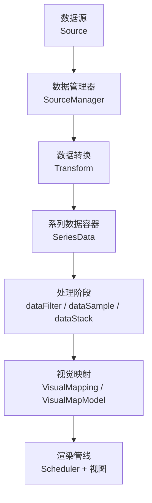
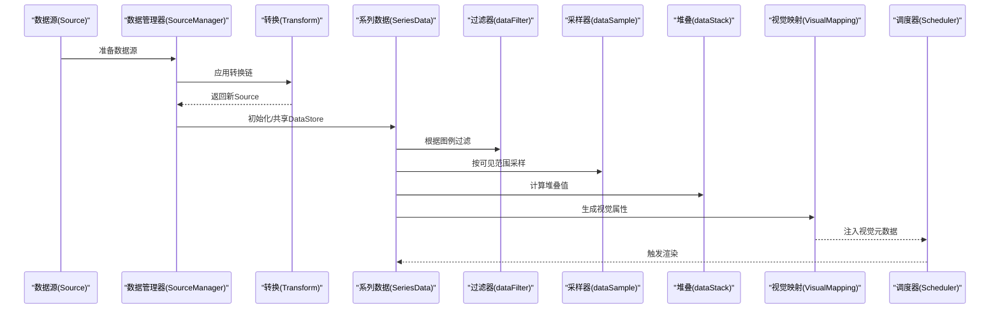
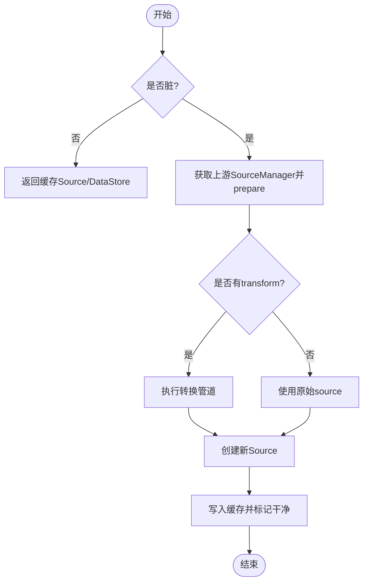
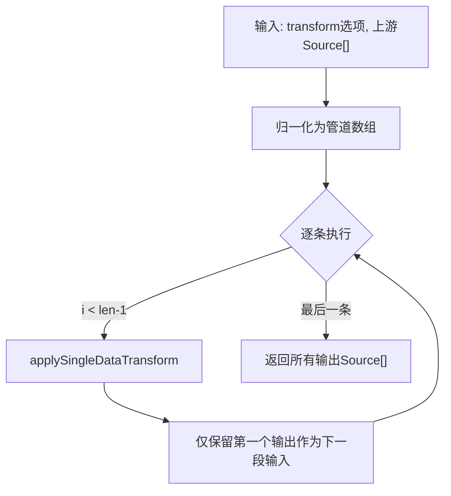
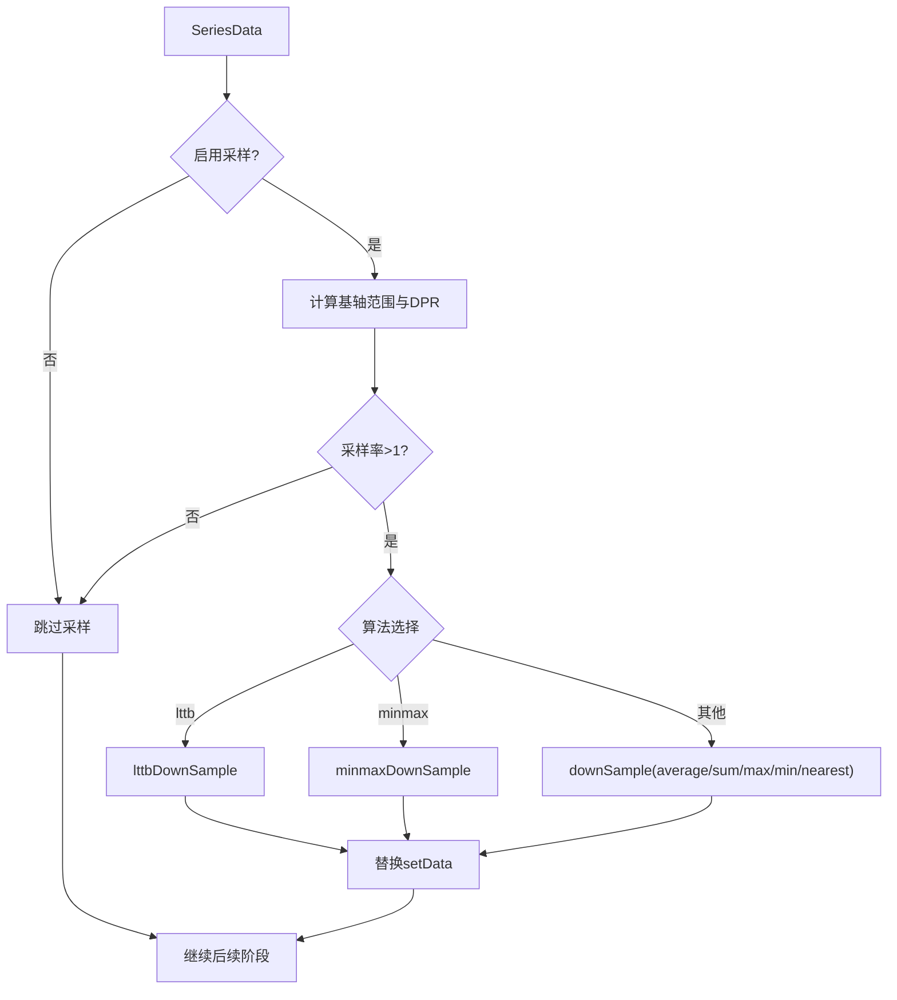
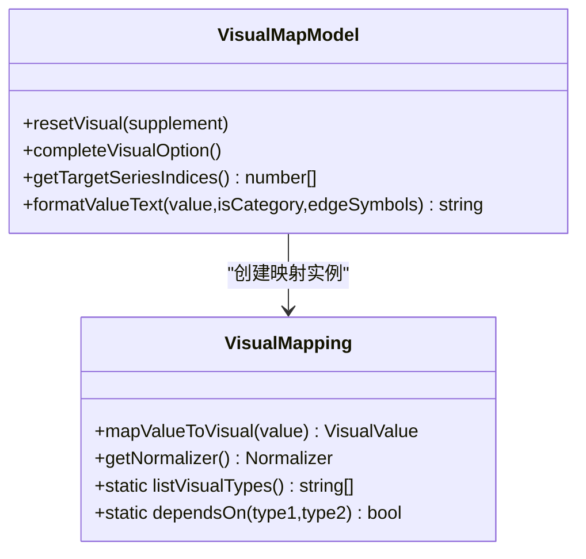
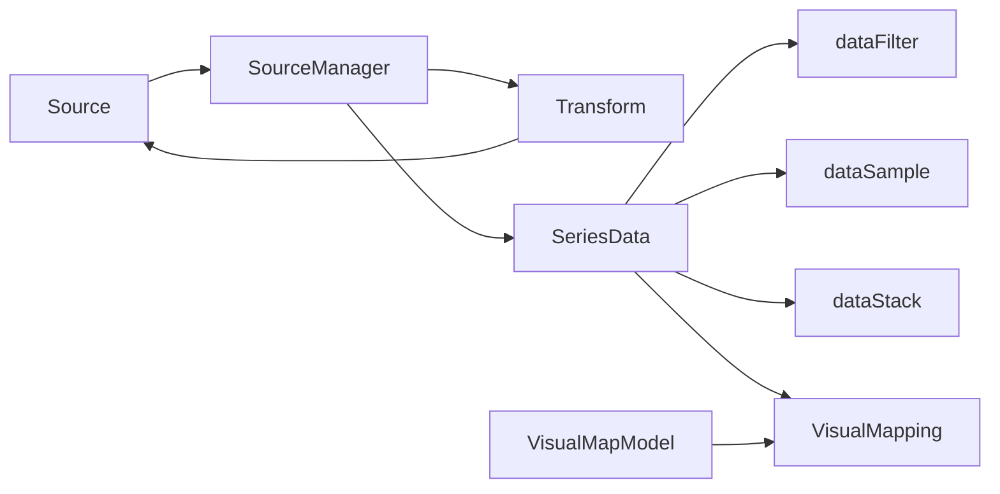

# 数据处理

<cite>
**本文引用的文件**
- [src/data/Source.ts](file://src/data/Source.ts)
- [src/component/dataset/install.ts](file://src/component/dataset/install.ts)
- [src/data/helper/sourceManager.ts](file://src/data/helper/sourceManager.ts)
- [src/data/helper/transform.ts](file://src/data/helper/transform.ts)
- [src/processor/dataFilter.ts](file://src/processor/dataFilter.ts)
- [src/processor/dataSample.ts](file://src/processor/dataSample.ts)
- [src/processor/dataStack.ts](file://src/processor/dataStack.ts)
- [src/data/SeriesData.ts](file://src/data/SeriesData.ts)
- [src/visual/VisualMapping.ts](file://src/visual/VisualMapping.ts)
- [src/component/visualMap/VisualMapModel.ts](file://src/component/visualMap/VisualMapModel.ts)
- [src/component/visualMap/install.ts](file://src/component/visualMap/install.ts)
- [src/core/Scheduler.ts](file://src/core/Scheduler.ts)
</cite>

## 目录
1. [简介](#简介)
2. [项目结构](#项目结构)
3. [核心组件](#核心组件)
4. [架构总览](#架构总览)
5. [详细组件分析](#详细组件分析)
6. [依赖关系分析](#依赖关系分析)
7. [性能考量](#性能考量)
8. [故障排查指南](#故障排查指南)
9. [结论](#结论)
10. [附录](#附录)

## 简介
本文件系统性阐述 ECharts 的数据处理管道与视觉映射机制，覆盖数据预处理（清洗、格式转换、缺失值处理、异常值过滤）、数据转换（堆叠、采样降维、聚合计算、维度变换）、视觉映射（颜色、大小、形状、透明度）配置规则，以及 Dataset 数据源管理与实时更新。同时给出大数据量场景下的优化策略（渐进式渲染、虚拟滚动、内存管理），并结合实际业务场景提供数据转换案例与调优经验。

## 项目结构
ECharts 的数据流从“数据源”开始，经“数据管理器”和“处理器阶段”，最终进入“可视化映射”并驱动渲染。关键路径如下：
- 数据源与元信息：Source、Dataset、SourceManager
- 数据转换与管道：Transform、SeriesData
- 处理阶段：dataFilter、dataSample、dataStack
- 视觉映射：VisualMapping、VisualMapModel
- 调度与管线：Scheduler

图示来源
- [src/data/Source.ts:197-224](file://src/data/Source.ts#L197-L224)
- [src/data/helper/sourceManager.ts:186-275](file://src/data/helper/sourceManager.ts#L186-L275)
- [src/data/helper/transform.ts:363-390](file://src/data/helper/transform.ts#L363-L390)
- [src/data/SeriesData.ts:527-563](file://src/data/SeriesData.ts#L527-L563)
- [src/processor/dataFilter.ts:22-45](file://src/processor/dataFilter.ts#L22-L45)
- [src/processor/dataSample.ts:75-121](file://src/processor/dataSample.ts#L75-L121)
- [src/processor/dataStack.ts:47-103](file://src/processor/dataStack.ts#L47-L103)
- [src/visual/VisualMapping.ts:157-211](file://src/visual/VisualMapping.ts#L157-L211)
- [src/component/visualMap/VisualMapModel.ts:211-247](file://src/component/visualMap/VisualMapModel.ts#L211-L247)
- [src/core/Scheduler.ts:544-552](file://src/core/Scheduler.ts#L544-L552)

章节来源
- [src/data/Source.ts:197-224](file://src/data/Source.ts#L197-L224)
- [src/data/helper/sourceManager.ts:186-275](file://src/data/helper/sourceManager.ts#L186-L275)
- [src/data/helper/transform.ts:363-390](file://src/data/helper/transform.ts#L363-L390)
- [src/data/SeriesData.ts:527-563](file://src/data/SeriesData.ts#L527-L563)
- [src/processor/dataFilter.ts:22-45](file://src/processor/dataFilter.ts#L22-L45)
- [src/processor/dataSample.ts:75-121](file://src/processor/dataSample.ts#L75-L121)
- [src/processor/dataStack.ts:47-103](file://src/processor/dataStack.ts#L47-L103)
- [src/visual/VisualMapping.ts:157-211](file://src/visual/VisualMapping.ts#L157-L211)
- [src/component/visualMap/VisualMapModel.ts:211-247](file://src/component/visualMap/VisualMapModel.ts#L211-L247)
- [src/core/Scheduler.ts:544-552](file://src/core/Scheduler.ts#L544-L552)

## 核心组件
- Source：统一封装原始数据与元信息（数据格式、布局方向、维度定义、起始行等），支持多种输入格式自动检测与规范化。
- SourceManager：负责上游数据集的依赖解析、缓存失效、转换链执行与共享 DataStore 构建。
- Transform：声明式数据转换（过滤、排序、聚合、外部算法等），支持管道化串联与结果复用。
- SeriesData：系列数据的运行时容器，提供维度访问、统计、采样、筛选、追加更新等能力。
- 处理器阶段：
  - dataFilter：基于图例选择状态进行数据过滤。
  - dataSample：按坐标轴可见范围与设备像素比进行自适应采样（含 LTTB、minmax、平均/求和/最值等）。
  - dataStack：按 stack 分组与顺序计算堆叠值与溢出值。
- VisualMapping/VisualMapModel：将数值或类别映射为颜色、符号、大小、透明度等视觉属性，支持线性、分段、分类、固定四种映射方法。

章节来源
- [src/data/Source.ts:197-224](file://src/data/Source.ts#L197-L224)
- [src/data/helper/sourceManager.ts:186-275](file://src/data/helper/sourceManager.ts#L186-L275)
- [src/data/helper/transform.ts:363-390](file://src/data/helper/transform.ts#L363-L390)
- [src/data/SeriesData.ts:527-563](file://src/data/SeriesData.ts#L527-L563)
- [src/processor/dataFilter.ts:22-45](file://src/processor/dataFilter.ts#L22-L45)
- [src/processor/dataSample.ts:75-121](file://src/processor/dataSample.ts#L75-L121)
- [src/processor/dataStack.ts:47-103](file://src/processor/dataStack.ts#L47-L103)
- [src/visual/VisualMapping.ts:157-211](file://src/visual/VisualMapping.ts#L157-L211)
- [src/component/visualMap/VisualMapModel.ts:211-247](file://src/component/visualMap/VisualMapModel.ts#L211-L247)

## 架构总览
下图展示从数据源到可视化的端到端流程，包括数据预处理、转换、堆叠、采样、过滤与视觉映射。

图示来源
- [src/data/helper/sourceManager.ts:186-275](file://src/data/helper/sourceManager.ts#L186-L275)
- [src/data/helper/transform.ts:363-390](file://src/data/helper/transform.ts#L363-L390)
- [src/data/SeriesData.ts:527-563](file://src/data/SeriesData.ts#L527-L563)
- [src/processor/dataFilter.ts:22-45](file://src/processor/dataFilter.ts#L22-L45)
- [src/processor/dataSample.ts:75-121](file://src/processor/dataSample.ts#L75-L121)
- [src/processor/dataStack.ts:47-103](file://src/processor/dataStack.ts#L47-L103)
- [src/visual/VisualMapping.ts:157-211](file://src/visual/VisualMapping.ts#L157-L211)
- [src/core/Scheduler.ts:544-552](file://src/core/Scheduler.ts#L544-L552)

## 详细组件分析

### 数据源与元信息（Source）
- 功能要点
  - 自动识别数据格式：数组行、对象行、键列、TypedArray、原始数据等。
  - 推断维度与起始行：支持 seriesLayoutBy（行/列）与 sourceHeader（首行是否为表头）。
  - 维度规范化：去重、补齐 displayName、类型推断（如 ordinal）。
- 复杂度与性能
  - 首次扫描有限行数判断表头，避免全量遍历。
  - 对 objectRows/keyedColumns 收集维度时采用哈希去重。
- 典型用法
  - 在 dataset 或 series 中声明 dimensions、seriesLayoutBy、sourceHeader。
  - 通过 createSource 创建不可变 Source，供后续转换与共享。

章节来源
- [src/data/Source.ts:256-294](file://src/data/Source.ts#L256-L294)
- [src/data/Source.ts:300-401](file://src/data/Source.ts#L300-L401)
- [src/data/Source.ts:403-469](file://src/data/Source.ts#L403-L469)

### 数据源管理（Dataset & SourceManager）
- 功能要点
  - 维护上游依赖关系，按需 prepareSource，缓存 Source 列表与 DataStore。
  - 支持 fromDatasetIndex/fromDatasetId/fromTransformResult 引用上游结果。
  - 当选项变更时标记脏并重建，保证一致性。
- 共享机制
  - 同一 schema 的 DataStore 可被多个 series 共享，减少高维数据内存占用。
- 版本签名
  - 使用上游版本签名判断是否需要重新计算，避免重复转换。

图示来源
- [src/data/helper/sourceManager.ts:186-275](file://src/data/helper/sourceManager.ts#L186-L275)
- [src/data/helper/sourceManager.ts:332-366](file://src/data/helper/sourceManager.ts#L332-L366)
- [src/data/helper/sourceManager.ts:376-423](file://src/data/helper/sourceManager.ts#L376-L423)

章节来源
- [src/component/dataset/install.ts:60-89](file://src/component/dataset/install.ts#L60-L89)
- [src/data/helper/sourceManager.ts:186-275](file://src/data/helper/sourceManager.ts#L186-L275)
- [src/data/helper/sourceManager.ts:332-423](file://src/data/helper/sourceManager.ts#L332-L423)

### 数据转换（Transform）
- 功能要点
  - 支持单条或多条 transform 管道化执行；每条 transform 接收 upstream/upstreamList/config，返回一个或多个 Source。
  - 对外暴露 ExternalSource 以安全访问维度信息与值。
  - 支持 echarts:* 内置命名空间与其他第三方 namespace。
- 维度继承规则
  - 若 transform 未返回 dimensions，则继承上游的 dimensionsDefine，并保留 header 以便下游读取。
- 错误校验
  - 严格检查上游存在性、transform 类型、输出格式等。

图示来源
- [src/data/helper/transform.ts:363-390](file://src/data/helper/transform.ts#L363-L390)
- [src/data/helper/transform.ts:392-450](file://src/data/helper/transform.ts#L392-L450)
- [src/data/helper/transform.ts:475-538](file://src/data/helper/transform.ts#L475-L538)

章节来源
- [src/data/helper/transform.ts:363-538](file://src/data/helper/transform.ts#L363-L538)

### 系列数据容器（SeriesData）
- 功能要点
  - 维度管理：名称/索引互转、编码映射、近似极值缓存。
  - 数据访问：get/getByRawIndex/count/appendData/appendValues。
  - 计算信息：堆叠相关维度、溢出维度、结果维度等。
  - 采样接口：downSample/minmaxDownSample/lttbDownSample。
- 性能优化
  - 近似极值用于快速估算过滤后的 extent，避免全量扫描。
  - 稀疏存储 name/id，降低内存开销。

章节来源
- [src/data/SeriesData.ts:152-262](file://src/data/SeriesData.ts#L152-L262)
- [src/data/SeriesData.ts:527-563](file://src/data/SeriesData.ts#L527-L563)
- [src/data/SeriesData.ts:675-698](file://src/data/SeriesData.ts#L675-L698)

### 数据预处理与转换阶段
- 数据过滤（dataFilter）
  - 依据 legend 选中状态过滤 series 数据项。
- 采样降维（dataSample）
  - 仅在笛卡尔坐标系且数据量较大时启用。
  - 根据基轴范围和设备像素比计算采样率，支持 average/sum/max/min/nearest 及 lttb/minmax 专用算法。
- 堆叠计算（dataStack）
  - 按 stack 分组，考虑 stackOrder（升/降序）与 stackStrategy（all/positive/negative/samesign）。
  - 计算堆叠结果维度与溢出维度，支持 NaN 连接策略。

图示来源
- [src/processor/dataSample.ts:75-121](file://src/processor/dataSample.ts#L75-L121)
- [src/processor/dataStack.ts:47-103](file://src/processor/dataStack.ts#L47-L103)
- [src/processor/dataStack.ts:105-176](file://src/processor/dataStack.ts#L105-L176)

章节来源
- [src/processor/dataFilter.ts:22-45](file://src/processor/dataFilter.ts#L22-L45)
- [src/processor/dataSample.ts:75-121](file://src/processor/dataSample.ts#L75-L121)
- [src/processor/dataStack.ts:47-176](file://src/processor/dataStack.ts#L47-L176)

### 视觉映射系统（VisualMapping & VisualMapModel）
- 映射方法
  - linear：线性映射，需要 dataExtent。
  - piecewise：分段映射，支持 interval/close/text/visual。
  - category：分类映射，支持 categories 与 loop。
  - fixed：固定映射。
- 支持的视觉属性
  - color、colorHue、colorSaturation、colorLightness、colorAlpha、opacity、symbol、symbolSize、liftZ、decal。
- 默认值与不激活态
  - visualDefault 提供 active/inactive 默认范围；inactive 态对 color 额外设置 opacity 以保证标签透明。
- 目标系列与控制器
  - 支持 seriesIndex/seriesId/seriesTargets 指定目标系列。
  - controller/target 分别控制控件样式与目标视觉。

图示来源
- [src/visual/VisualMapping.ts:157-211](file://src/visual/VisualMapping.ts#L157-L211)
- [src/visual/VisualMapping.ts:217-336](file://src/visual/VisualMapping.ts#L217-L336)
- [src/component/visualMap/VisualMapModel.ts:211-247](file://src/component/visualMap/VisualMapModel.ts#L211-L247)
- [src/component/visualMap/VisualMapModel.ts:484-619](file://src/component/visualMap/VisualMapModel.ts#L484-L619)

章节来源
- [src/visual/VisualMapping.ts:157-211](file://src/visual/VisualMapping.ts#L157-L211)
- [src/visual/VisualMapping.ts:217-336](file://src/visual/VisualMapping.ts#L217-L336)
- [src/component/visualMap/VisualMapModel.ts:211-247](file://src/component/visualMap/VisualMapModel.ts#L211-L247)
- [src/component/visualMap/VisualMapModel.ts:484-619](file://src/component/visualMap/VisualMapModel.ts#L484-L619)

### 调度与管线（Scheduler）
- 作用
  - 将各阶段的 StageHandler 组装成 pipeline，按序执行并在整体进度中标记脏任务。
- 关键点
  - _pipe 将任务串接，记录索引与所属管线。
  - 支持 overallReset 与 onDirty 回调，协调数据与视觉更新。

章节来源
- [src/core/Scheduler.ts:522-560](file://src/core/Scheduler.ts#L522-L560)

## 依赖关系分析
- 低耦合高内聚
  - Source/SourceManager 专注数据源与转换，SeriesData 专注运行时数据访问与统计，VisualMapping 专注映射逻辑。
- 直接依赖
  - SourceManager 依赖 transform 与 Source；SeriesData 依赖 DataStore 与 Provider；VisualMapModel 依赖 VisualMapping 与 visualDefault。
- 潜在循环
  - 通过延迟引用与工具函数避免循环依赖（如 isSeries 在 sourceManager 中内联判断）。

图示来源
- [src/data/helper/sourceManager.ts:186-275](file://src/data/helper/sourceManager.ts#L186-L275)
- [src/data/helper/transform.ts:363-390](file://src/data/helper/transform.ts#L363-L390)
- [src/processor/dataFilter.ts:22-45](file://src/processor/dataFilter.ts#L22-L45)
- [src/processor/dataSample.ts:75-121](file://src/processor/dataSample.ts#L75-L121)
- [src/processor/dataStack.ts:47-103](file://src/processor/dataStack.ts#L47-L103)
- [src/visual/VisualMapping.ts:157-211](file://src/visual/VisualMapping.ts#L157-L211)
- [src/component/visualMap/VisualMapModel.ts:211-247](file://src/component/visualMap/VisualMapModel.ts#L211-L247)

## 性能考量
- 渐进式渲染与采样
  - 在数据量大时启用 dataSample，依据基轴范围与 DPR 动态计算采样率，显著降低绘制压力。
  - 使用 LTTB 与 minmax 算法保持折线趋势与极值特征。
- 虚拟滚动与增量更新
  - 结合 dataZoom 与 appendData/appendValues 实现增量追加与局部刷新，避免全量重建。
- 内存管理
  - SourceManager 共享 DataStore，避免高维数据重复拷贝。
  - SeriesData 近似极值缓存与稀疏 name/id 存储降低内存占用。
- 转换链优化
  - 通过版本签名与脏标记避免重复转换；管道中间结果最小化（仅保留必要输出）。

[本节为通用性能建议，不直接分析具体文件]

## 故障排查指南
- 常见问题
  - 转换类型不存在：检查 transform.type 是否已注册，注意命名空间（echarts:* 或其他）。
  - 上游为空：确保至少有一个上游 dataset 或 series.data。
  - 输出格式不支持：transform 必须返回 arrayRows 或 objectRows。
  - 维度重复：ExternalSource 维度名不允许重复，需修正上游维度定义。
- 定位方法
  - 开启 transform.print 打印中间结果。
  - 检查 SourceManager 脏标记与版本签名，确认是否误判导致重复计算。
  - 查看 SeriesData 的近似极值与维度信息，确认 encode 与 dimension 映射是否正确。

章节来源
- [src/data/helper/transform.ts:392-450](file://src/data/helper/transform.ts#L392-L450)
- [src/data/helper/sourceManager.ts:332-366](file://src/data/helper/sourceManager.ts#L332-L366)

## 结论
ECharts 的数据处理管道以 Source/SourceManager 为核心，配合 Transform 实现灵活的数据转换；SeriesData 提供高效的运行时数据访问与统计；dataFilter/dataSample/dataStack 构成关键处理阶段；VisualMapping/VisualMapModel 完成从数据到视觉属性的映射。通过缓存、共享、近似计算与采样等手段，系统在大数据量下仍保持良好性能。合理运用 Dataset 与 transform 管道，可在复杂业务场景中高效完成数据清洗、转换与可视化。

## 附录
- 实际业务场景示例
  - 时间序列折线图：使用 dataSample 的 lttb 算法在缩放时保持趋势；通过 dataZoom 联动采样率。
  - 多系列堆叠柱状图：配置 stack 与 stackStrategy，利用 dataStack 计算堆叠值与溢出值。
  - 热力图颜色映射：使用 visualMap 的 continuous 模式，配置 inRange/outOfRange 的颜色区间与精度。
  - 分类散点图：使用 visualMap 的 category 模式，为不同类别映射不同 symbol 与颜色。
- 调优经验
  - 优先在 transform 层做数据清洗与聚合，减少 SeriesData 的计算负担。
  - 对高频更新场景使用 appendData/appendValues 增量更新，避免全量 setOption。
  - 合理设置 seriesLayoutBy 与 sourceHeader，减少维度推断成本。

[本节为概念性内容，不直接分析具体文件]