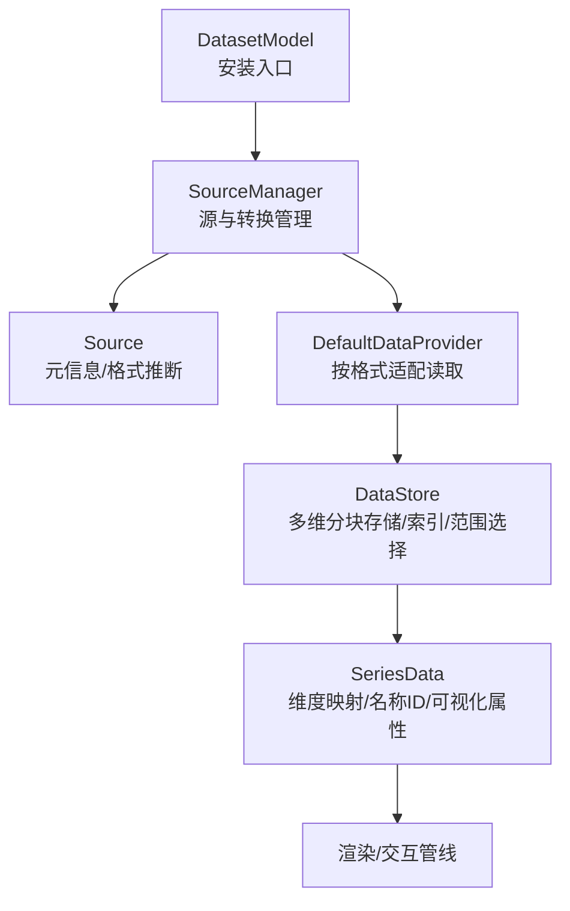
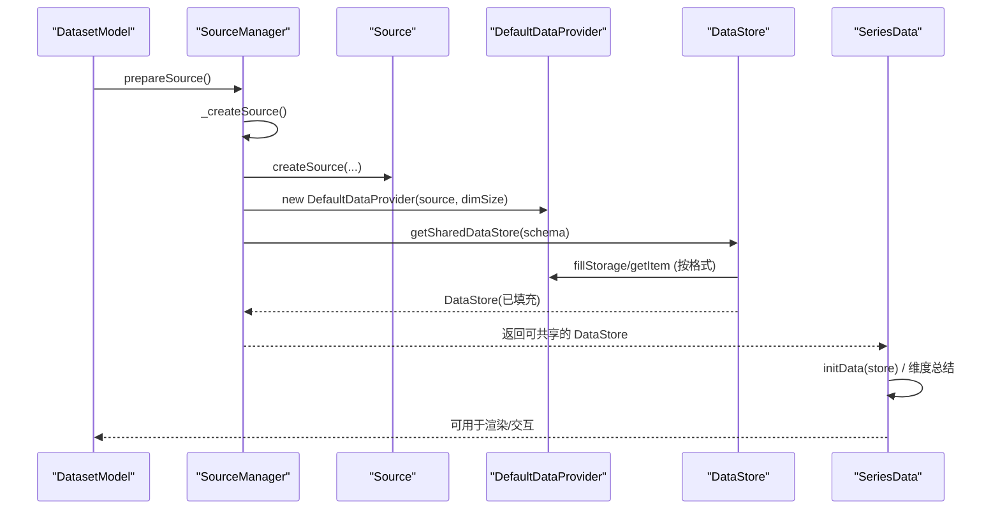
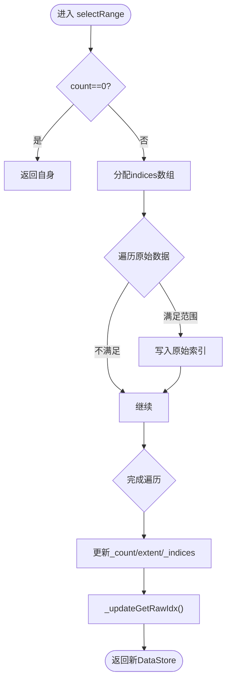
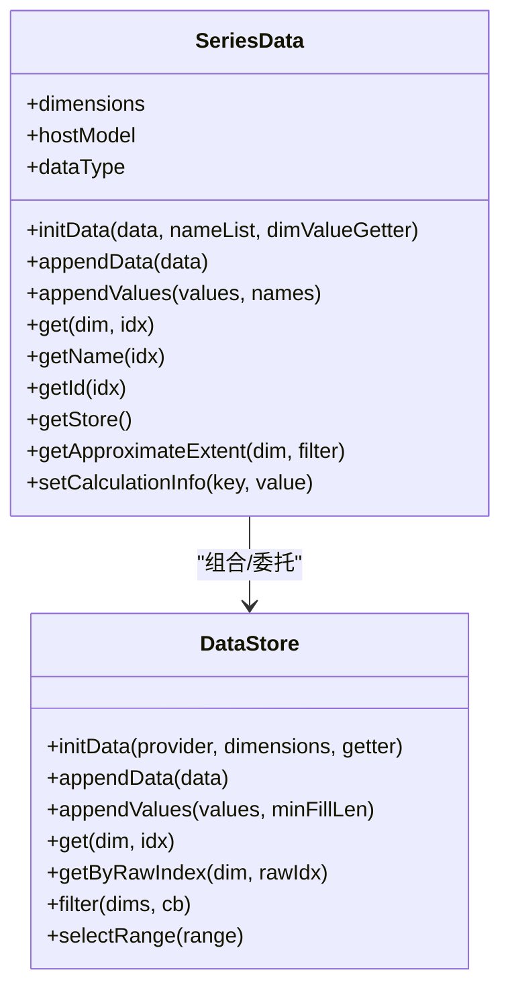
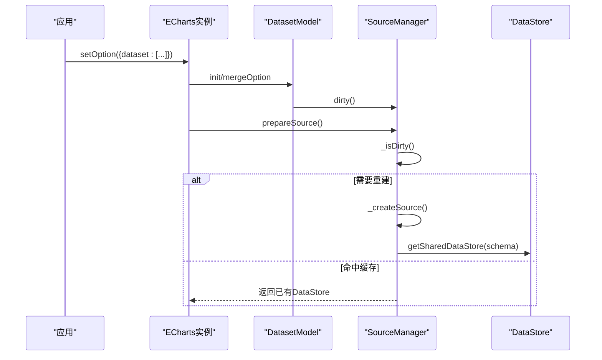
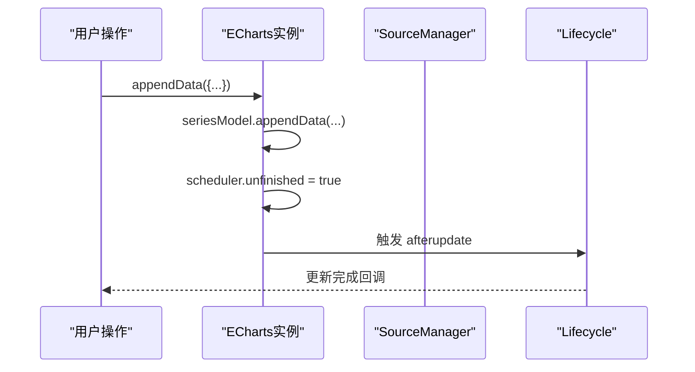
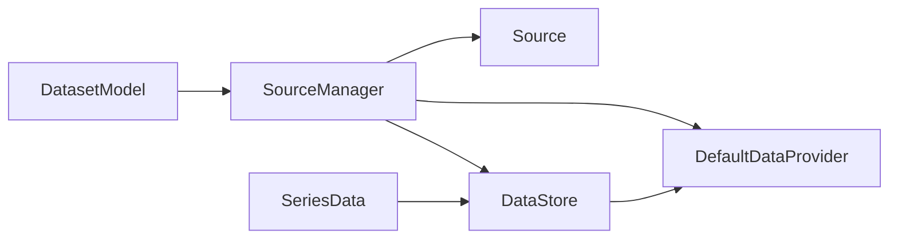

# 数据源管理

<cite>
**本文引用的文件**
- [DataStore.ts](file://src/data/DataStore.ts)
- [SeriesData.ts](file://src/data/SeriesData.ts)
- [Source.ts](file://src/data/Source.ts)
- [sourceManager.ts](file://src/data/helper/sourceManager.ts)
- [dataProvider.ts](file://src/data/helper/dataProvider.ts)
- [install.ts](file://src/component/dataset/install.ts)
- [dataset.ts](file://src/component/dataset.ts)
- [lifecycle.ts](file://src/core/lifecycle.ts)
- [echarts.ts](file://src/core/echarts.ts)
</cite>

## 目录
1. [简介](#简介)
2. [项目结构](#项目结构)
3. [核心组件](#核心组件)
4. [架构总览](#架构总览)
5. [详细组件分析](#详细组件分析)
6. [依赖关系分析](#依赖关系分析)
7. [性能考量](#性能考量)
8. [故障排查指南](#故障排查指南)
9. [结论](#结论)
10. [附录](#附录)

## 简介
本文件系统性阐述 ECharts 数据源管理的核心架构，聚焦以下主题：
- DataStore 组件：数据存储结构、索引机制与查询接口
- SeriesData 模型：序列数据组织、维度定义与数据访问模式
- Dataset 组件：数据声明、共享机制与实时更新
- 数据同步机制：变更监听、状态管理与事件通知
- 实际使用案例：多图表数据共享、动态数据更新、复杂数据结构处理
- 性能优化建议：数据缓存、懒加载与内存优化策略

## 项目结构
ECharts 的数据源体系围绕“源(Source) → 提供者(DataProvider) → 存储(DataStore) → 序列视图(SeriesData)”展开，并通过 SourceManager 在 Dataset/Series 之间进行统一调度与共享。

图示来源
- [install.ts:60-88](file://src/component/dataset/install.ts#L60-L88)
- [sourceManager.ts:133-193](file://src/data/helper/sourceManager.ts#L133-L193)
- [Source.ts:94-224](file://src/data/Source.ts#L94-L224)
- [dataProvider.ts:84-183](file://src/data/helper/dataProvider.ts#L84-L183)
- [DataStore.ts:162-234](file://src/data/DataStore.ts#L162-L234)
- [SeriesData.ts:152-186](file://src/data/SeriesData.ts#L152-L186)

章节来源
- [install.ts:60-88](file://src/component/dataset/install.ts#L60-L88)
- [sourceManager.ts:133-193](file://src/data/helper/sourceManager.ts#L133-L193)
- [Source.ts:94-224](file://src/data/Source.ts#L94-L224)
- [dataProvider.ts:84-183](file://src/data/helper/dataProvider.ts#L84-L183)
- [DataStore.ts:162-234](file://src/data/DataStore.ts#L162-L234)
- [SeriesData.ts:152-186](file://src/data/SeriesData.ts#L152-L186)

## 核心组件
- DataStore：多维数据的底层存储与查询引擎，支持分块存储、类型化数组、过滤与范围选择、原始索引映射等。
- SeriesData：面向系列的序列数据抽象，负责维度定义、名称/ID管理、近似极值缓存、计算信息等。
- Source：描述数据来源的不可变元信息，包含数据类型、布局方式、维度定义与起始行等。
- DefaultDataProvider：根据 Source.format 提供统一的 getItem/count/fillStorage 等访问能力。
- SourceManager：串联 Dataset/Series 的源解析、转换链路与 DataStore 共享。
- DatasetModel：注册 dataset 组件，持有 SourceManager，并在选项更新时标记脏检查。

章节来源
- [DataStore.ts:162-234](file://src/data/DataStore.ts#L162-L234)
- [SeriesData.ts:152-186](file://src/data/SeriesData.ts#L152-L186)
- [Source.ts:94-224](file://src/data/Source.ts#L94-L224)
- [dataProvider.ts:84-183](file://src/data/helper/dataProvider.ts#L84-L183)
- [sourceManager.ts:133-193](file://src/data/helper/sourceManager.ts#L133-L193)
- [install.ts:60-88](file://src/component/dataset/install.ts#L60-L88)

## 架构总览
下图展示从 Dataset 到 SeriesData 的数据流与控制流：

图示来源
- [sourceManager.ts:186-275](file://src/data/helper/sourceManager.ts#L186-L275)
- [sourceManager.ts:376-423](file://src/data/helper/sourceManager.ts#L376-L423)
- [dataProvider.ts:157-227](file://src/data/helper/dataProvider.ts#L157-L227)
- [DataStore.ts:381-440](file://src/data/DataStore.ts#L381-L440)
- [SeriesData.ts:527-563](file://src/data/SeriesData.ts#L527-L563)

## 详细组件分析

### DataStore：多维数据存储与查询
- 存储结构
  - 以“维度”为列的分块存储（chunks），每个维度一个数组或类型化数组（float/int/time/ordinal/number）。
  - 维护原始极值 rawExtent 与过滤后的 extent 缓存。
  - 通过 indices 记录过滤后的可见项对应的原始索引，实现高效子集访问。
- 初始化与填充
  - initData(provider, dimensions, getter) 设置 Provider、维度定义与默认取值函数。
  - _initDataFromProvider(start,end,append) 调用 provider.fillStorage 或直接遍历 getItem 填充 chunks，并更新 rawExtent。
- 追加数据
  - appendData(data) 将新数据追加至 provider，再增量填充 store。
  - appendValues(values,minFillLen) 直接按维度写入数值，适合高性能场景。
- 查询接口
  - get(dim,idx)/getByRawIndex(dim,rawIdx)/getValues(...)
  - getSum()/getMedian() 用于统计聚合。
  - indexOfRawIndex(rawIndex) 在有序 indices 上二分查找。
- 过滤与范围选择
  - filter(dims, cb) 生成新的 DataStore，维护 indices 与 count。
  - selectRange(range) 针对 dataZoom 等高频场景做内联优化，支持一维/二维快速路径。
- 维度与序数
  - ensureCalculationDimension 按需创建计算维度。
  - collectOrdinalMeta 收集分类维度并转为序数索引。

图示来源
- [DataStore.ts:667-781](file://src/data/DataStore.ts#L667-L781)

章节来源
- [DataStore.ts:162-234](file://src/data/DataStore.ts#L162-L234)
- [DataStore.ts:325-440](file://src/data/DataStore.ts#L325-L440)
- [DataStore.ts:442-570](file://src/data/DataStore.ts#L442-L570)
- [DataStore.ts:606-781](file://src/data/DataStore.ts#L606-L781)

### SeriesData：序列数据模型与访问模式
- 维度与映射
  - dimensions 保存系列维度名；_dimInfos 保存维度类型、坐标映射、otherDims 等。
  - mapDimension/mapDimensionsAll 将坐标系维度映射回数据维度。
- 数据初始化
  - initData(data,nameList,dimValueGetter) 支持传入 Source/DataProvider/DataStore，内部构造 DataStore 并汇总维度信息。
  - appendData/appendValues 支持增量追加，同时维护 name/id 列表与逆序索引。
- 名称与标识
  - getName(idx)/getId(idx) 优先取 nameList/idList，否则从 store 维度或 name 派生。
  - 支持从 name 自动生成 id，避免重复。
- 近似极值与计算信息
  - getApproximateExtent/setApproximateExtent 缓存过滤外的极值，减少昂贵计算。
  - setCalculationInfo/getCalculationInfo 用于堆叠等计算上下文。
- 与 DataStore 的关系
  - 通过 getStore() 获取底层 DataStore，所有维度访问最终落到 store.get/store.getByRawIndex。

图示来源
- [SeriesData.ts:152-186](file://src/data/SeriesData.ts#L152-L186)
- [SeriesData.ts:527-603](file://src/data/SeriesData.ts#L527-L603)
- [SeriesData.ts:731-800](file://src/data/SeriesData.ts#L731-L800)
- [DataStore.ts:162-234](file://src/data/DataStore.ts#L162-L234)

章节来源
- [SeriesData.ts:152-186](file://src/data/SeriesData.ts#L152-L186)
- [SeriesData.ts:527-603](file://src/data/SeriesData.ts#L527-L603)
- [SeriesData.ts:731-800](file://src/data/SeriesData.ts#L731-L800)

### Dataset：数据声明、共享与更新
- 组件注册
  - dataset.ts 作为安装入口，引入 install 模块。
  - install.ts 注册 DatasetModel/DatasetView，并在 init/mergeOption 中禁用 transform 合并，保证 transform 配置不被意外覆盖。
- 数据源管理
  - DatasetModel 持有 SourceManager，optionUpdated 时调用 dirty() 使缓存失效。
  - SourceManager.prepareSource() 惰性构建 Source 与 DataStore，基于上游版本签名判断是否重建。
- 共享机制
  - getSharedDataStore(schema) 在同一 series 范围内复用 DataStore，避免高维数据重复拷贝。
  - 当 series 与 dataset 共享相同 metaRawOption 时，可直接复用 Source。

图示来源
- [install.ts:60-88](file://src/component/dataset/install.ts#L60-L88)
- [sourceManager.ts:157-193](file://src/data/helper/sourceManager.ts#L157-L193)
- [sourceManager.ts:376-423](file://src/data/helper/sourceManager.ts#L376-L423)

章节来源
- [dataset.ts:20-23](file://src/component/dataset.ts#L20-L23)
- [install.ts:60-88](file://src/component/dataset/install.ts#L60-L88)
- [sourceManager.ts:157-193](file://src/data/helper/sourceManager.ts#L157-L193)
- [sourceManager.ts:376-423](file://src/data/helper/sourceManager.ts#L376-L423)

### 数据同步机制：变更监听、状态管理与事件通知
- 状态管理
  - SourceManager 通过 _dirty 与 upstreamSignList 追踪上游变化，prepareSource 前执行 _isDirty 判断。
  - DatasetModel.optionUpdated 触发 dirty()，确保后续重新计算。
- 事件通知
  - lifecycle.ts 暴露生命周期事件（如 afterupdate），可在全局层面感知更新完成。
- 动态追加
  - echarts.ts 暴露 appendData API，内部调用 seriesModel.appendData，并标记 unfinished 以触发重绘。

图示来源
- [sourceManager.ts:157-193](file://src/data/helper/sourceManager.ts#L157-L193)
- [lifecycle.ts:61-74](file://src/core/lifecycle.ts#L61-L74)
- [echarts.ts:1634-1663](file://src/core/echarts.ts#L1634-L1663)

章节来源
- [sourceManager.ts:157-193](file://src/data/helper/sourceManager.ts#L157-L193)
- [lifecycle.ts:61-74](file://src/core/lifecycle.ts#L61-L74)
- [echarts.ts:1634-1663](file://src/core/echarts.ts#L1634-L1663)

## 依赖关系分析
- 组件耦合
  - DatasetModel 依赖 SourceManager；SeriesData 依赖 DataStore；DataStore 依赖 DataProvider；三者共同依赖 Source。
- 外部依赖
  - zrender 工具库用于类型判断、哈希表、克隆等基础能力。
- 循环依赖规避
  - sourceManager 通过 isSeries 运行时判断避免与 Series 模块的直接循环引用。

图示来源
- [sourceManager.ts:133-193](file://src/data/helper/sourceManager.ts#L133-L193)
- [dataProvider.ts:84-183](file://src/data/helper/dataProvider.ts#L84-L183)
- [DataStore.ts:162-234](file://src/data/DataStore.ts#L162-L234)
- [SeriesData.ts:152-186](file://src/data/SeriesData.ts#L152-L186)

章节来源
- [sourceManager.ts:133-193](file://src/data/helper/sourceManager.ts#L133-L193)
- [dataProvider.ts:84-183](file://src/data/helper/dataProvider.ts#L84-L183)
- [DataStore.ts:162-234](file://src/data/DataStore.ts#L162-L234)
- [SeriesData.ts:152-186](file://src/data/SeriesData.ts#L152-L186)

## 性能考量
- 数据缓存
  - SourceManager 缓存 Source 与 DataStore，基于上游版本签名与 _dirty 标志避免重复计算。
  - SeriesData 缓存近似极值 _approximateExtent，减少过滤后极值计算开销。
- 懒加载
  - SourceManager.prepareSource 仅在必要时创建 Source/DataStore。
  - DataStore 的 indices 仅在过滤后创建，未过滤时直接顺序访问。
- 内存优化
  - DataStore 使用类型化数组（Float64Array/Int32Array/Uint32Array/Uint16Array）降低内存占用。
  - DefaultDataProvider 对 TypedArray 数据在 clean 后释放引用，避免长期驻留。
  - 高维数据下，SeriesData 仅保留使用的 store 维度，降低额外开销。
- 算法优化
  - DataStore.selectRange 对一维/二维范围选择做了内联快速路径，显著提升大数据量下的筛选性能。
  - indexOfRawIndex 使用二分查找加速原始索引定位。

章节来源
- [sourceManager.ts:157-193](file://src/data/helper/sourceManager.ts#L157-L193)
- [sourceManager.ts:376-423](file://src/data/helper/sourceManager.ts#L376-L423)
- [DataStore.ts:47-57](file://src/data/DataStore.ts#L47-L57)
- [DataStore.ts:667-781](file://src/data/DataStore.ts#L667-L781)
- [DataStore.ts:537-570](file://src/data/DataStore.ts#L537-L570)
- [dataProvider.ts:265-284](file://src/data/helper/dataProvider.ts#L265-L284)
- [SeriesData.ts:681-698](file://src/data/SeriesData.ts#L681-L698)

## 故障排查指南
- 常见错误与提示
  - 无效数据提供者：initData 时对 provider.getItem/count 进行断言校验。
  - TypedArray 必须指定维度大小：DefaultDataProvider 构造时校验 dimSize。
  - 不支持的 appendData 场景：seriesLayoutBy 为 row 时禁止追加。
  - 维度缺失：keyedColumns 模式下要求维度名称非空。
- 调试建议
  - 使用 dev 模式的断言与日志定位问题。
  - 通过 SourceManager.dirty() 强制刷新缓存，验证数据链路。
  - 利用 lifecycle 的 afterupdate 事件确认更新是否生效。

章节来源
- [DataStore.ts:197-202](file://src/data/DataStore.ts#L197-L202)
- [dataProvider.ts:120-128](file://src/data/helper/dataProvider.ts#L120-L128)
- [dataProvider.ts:236-240](file://src/data/helper/dataProvider.ts#L236-L240)
- [dataProvider.ts:317-326](file://src/data/helper/dataProvider.ts#L317-L326)
- [sourceManager.ts:157-161](file://src/data/helper/sourceManager.ts#L157-L161)
- [lifecycle.ts:61-74](file://src/core/lifecycle.ts#L61-L74)

## 结论
ECharts 的数据源管理以 Source 为中心，通过 SourceManager 协调 Dataset/Series 的源解析与转换，DataStore 提供高性能的多维存储与查询，SeriesData 封装面向系列的维度与访问语义。该架构在保证功能完备的同时，通过缓存、懒加载、类型化数组与内联优化等手段实现了良好的性能表现。结合 Dataset 的共享机制与生命周期事件，能够支撑多图表数据共享、动态更新与复杂数据处理等典型场景。

## 附录

### 实际使用案例

- 多图表数据共享
  - 在多个 series 中通过 datasetIndex 引用同一 dataset，由 SourceManager 共享 DataStore，避免重复存储。
  - 参考路径：[sourceManager.ts:376-423](file://src/data/helper/sourceManager.ts#L376-L423)

- 动态数据更新
  - 使用 echarts.appendData 追加数据，内部调用 seriesModel.appendData，并触发重绘。
  - 参考路径：[echarts.ts:1634-1663](file://src/core/echarts.ts#L1634-L1663)

- 复杂数据结构处理
  - 通过 Source 自动推断数据格式（arrayRows/objectRows/keyedColumns/typedArray），配合 DefaultDataProvider 的适配方法读取数据。
  - 参考路径：[Source.ts:256-294](file://src/data/Source.ts#L256-L294)，[dataProvider.ts:347-378](file://src/data/helper/dataProvider.ts#L347-L378)