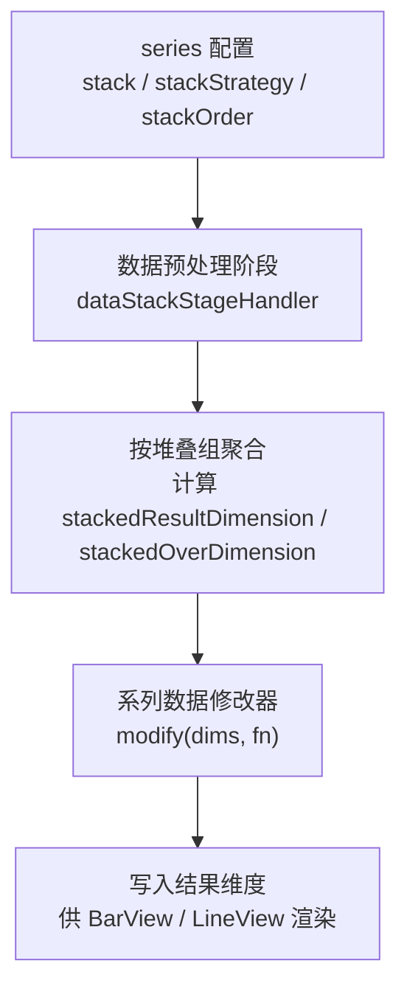
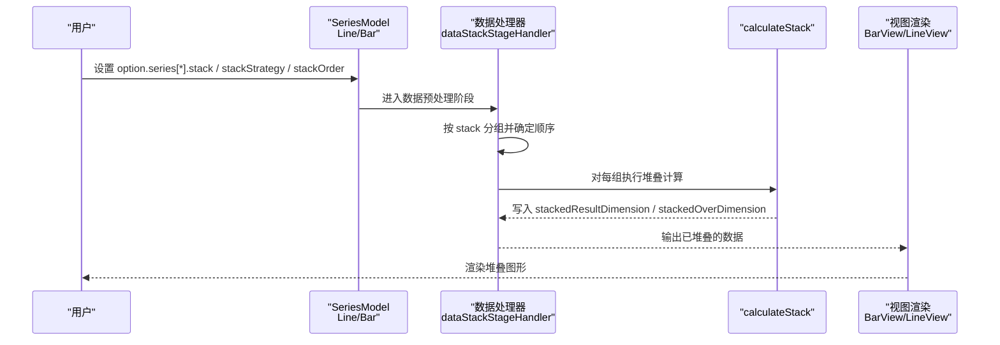
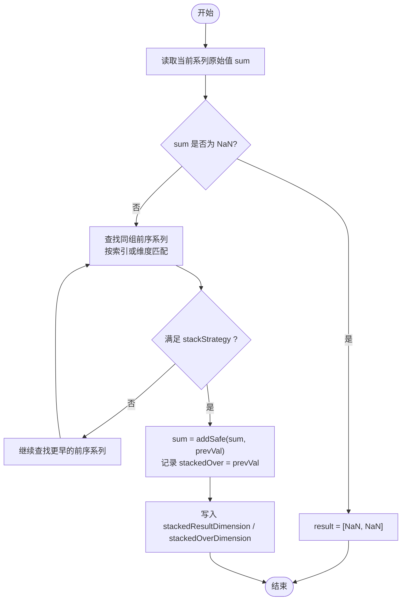
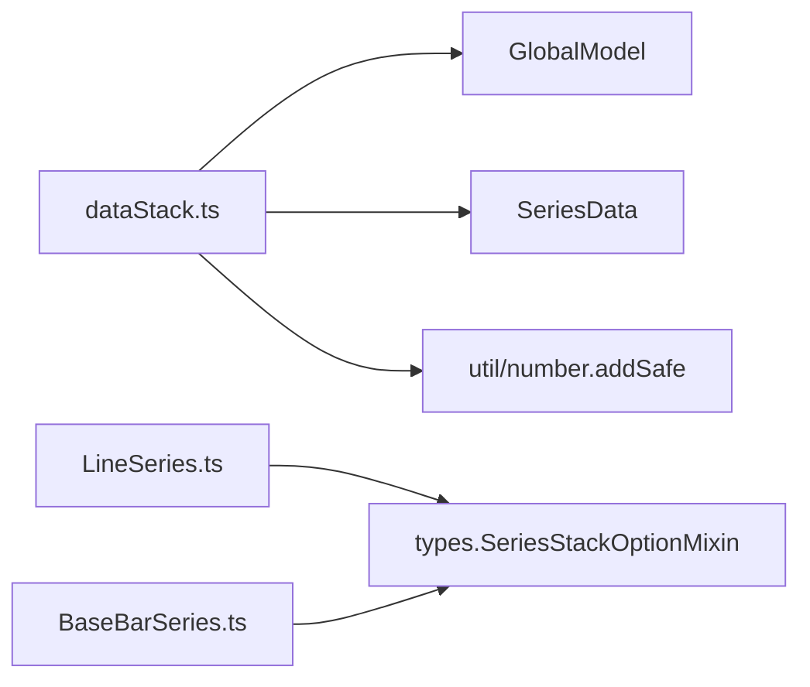

# 数据堆叠

<cite>
**本文引用的文件**
- [src/processor/dataStack.ts](file://src/processor/dataStack.ts)
- [src/chart/bar/BaseBarSeries.ts](file://src/chart/bar/BaseBarSeries.ts)
- [src/chart/line/LineSeries.ts](file://src/chart/line/LineSeries.ts)
- [src/util/types.ts](file://src/util/types.ts)
- [test/bar-stack.html](file://test/bar-stack.html)
- [test/area-stack.html](file://test/area-stack.html)
</cite>

## 目录
1. [简介](#简介)
2. [项目结构](#项目结构)
3. [核心组件](#核心组件)
4. [架构总览](#架构总览)
5. [详细组件分析](#详细组件分析)
6. [依赖关系分析](#依赖关系分析)
7. [性能考虑](#性能考虑)
8. [故障排查指南](#故障排查指南)
9. [结论](#结论)
10. [附录：配置与示例速查](#附录配置与示例速查)

## 简介
本文件系统性阐述 ECharts 数据堆叠功能的实现原理与配置方法，覆盖以下关键点：
- 堆叠计算算法：如何按系列类型自动识别堆叠组、处理正负值混合数据、计算堆叠基准线。
- 多系列堆叠场景：同组堆叠、分组堆叠、基于索引的堆叠（时间轴/数值轴）等。
- 完整示例路径：基础堆叠柱状图、带基准线的堆叠图、动态更新堆叠数据。
- 性能优化建议：大数据量下的内存管理与计算优化策略。

## 项目结构
围绕“数据堆叠”的核心代码主要分布在处理器层、图表系列模型层以及测试用例中：
- 处理器层负责在数据预处理阶段完成堆叠计算，输出结果维度供视图渲染使用。
- 图表系列模型提供堆叠相关默认选项与能力声明（如折线图支持 areaStyle、connectNulls 等）。
- 测试用例覆盖多种堆叠场景与边界情况，便于验证行为一致性。

**图示来源**
- [src/processor/dataStack.ts:47-103](file://src/processor/dataStack.ts#L47-L103)
- [src/processor/dataStack.ts:105-175](file://src/processor/dataStack.ts#L105-L175)

**章节来源**
- [src/processor/dataStack.ts:47-103](file://src/processor/dataStack.ts#L47-L103)
- [src/processor/dataStack.ts:105-175](file://src/processor/dataStack.ts#L105-L175)
- [src/chart/line/LineSeries.ts:74-135](file://src/chart/line/LineSeries.ts#L74-L135)
- [src/chart/bar/BaseBarSeries.ts:200-221](file://src/chart/bar/BaseBarSeries.ts#L200-L221)

## 核心组件
- 堆叠处理器 dataStackStageHandler：注册为整体数据处理阶段处理器，遍历所有 series，收集具备堆叠能力的系列并按 stack 键分组，随后对每组执行排序与堆叠计算。
- 堆叠计算函数 calculateStack：针对每个目标系列，读取其原始值与“被堆叠系列”的结果值，依据 stackStrategy 决定累加规则，并写入结果维度与“被堆叠值”维度。
- 系列模型：
  - 折线图 LineSeries：声明支持 areaStyle、connectNulls、smooth 等，配合堆叠可绘制面积堆叠图。
  - 柱状图 BaseBarSeries：提供默认布局与尺寸参数，常用于堆叠柱状图。
- 类型定义 SeriesStackOptionMixin：描述堆叠相关选项的类型约束（如 stack、stackStrategy、stackOrder 等）。

**章节来源**
- [src/processor/dataStack.ts:40-103](file://src/processor/dataStack.ts#L40-L103)
- [src/processor/dataStack.ts:105-175](file://src/processor/dataStack.ts#L105-L175)
- [src/chart/line/LineSeries.ts:74-135](file://src/chart/line/LineSeries.ts#L74-L135)
- [src/chart/bar/BaseBarSeries.ts:200-221](file://src/chart/bar/BaseBarSeries.ts#L200-L221)
- [src/util/types.ts:2096-2120](file://src/util/types.ts#L2096-L2120)

## 架构总览
下图展示了从用户配置到最终渲染的完整链路，重点标注了堆叠计算在数据流中的位置与作用。

**图示来源**
- [src/processor/dataStack.ts:47-103](file://src/processor/dataStack.ts#L47-L103)
- [src/processor/dataStack.ts:105-175](file://src/processor/dataStack.ts#L105-L175)
- [src/chart/line/LineSeries.ts:147-157](file://src/chart/line/LineSeries.ts#L147-L157)
- [src/chart/bar/BaseBarSeries.ts:93-95](file://src/chart/bar/BaseBarSeries.ts#L93-L95)

## 详细组件分析

### 堆叠计算算法与基准线
- 堆叠组识别：
  - 通过 series.stack 非空字符串进行分组；若为空则不参与堆叠。
  - 同一 stack 值的系列归入同一堆叠组，不同 stack 值形成独立堆叠组（分组堆叠）。
- 堆叠顺序：
  - 通过 series.stackOrder 控制组内顺序，默认升序；可设置为降序以反转堆叠次序。
- 基准线与累加逻辑：
  - 对每个目标系列，读取其原始值 sum，并向前查找同组前序系列的 stackedResultDimension 作为“被堆叠值”。
  - 根据 stackStrategy 决定是否累加：
    - all：无条件累加（忽略正负号）。
    - positive：仅当被堆叠值 > 0 时累加。
    - negative：仅当被堆叠值 < 0 时累加。
    - samesign：当前 sum 与被堆叠值同号时才累加（默认策略）。
  - 使用 addSafe 进行安全加法，避免浮点误差影响坐标范围。
- NaN 与 connectNulls：
  - 若当前值为 NaN，则 stackedOver 也置为 NaN，以便折线/面积在断点处正确断开或连接（取决于 connectNulls）。
- 按维度匹配 vs 按索引匹配：
  - 若 isStackedByIndex 为真，则按原始索引匹配前序系列（适用于时间轴/数值轴上的按索引堆叠）。
  - 否则按 stackedByDimension 的值进行匹配（适用于类目轴上按类别对齐）。

**图示来源**
- [src/processor/dataStack.ts:105-175](file://src/processor/dataStack.ts#L105-L175)

**章节来源**
- [src/processor/dataStack.ts:47-103](file://src/processor/dataStack.ts#L47-L103)
- [src/processor/dataStack.ts:105-175](file://src/processor/dataStack.ts#L105-L175)

### 多系列堆叠场景
- 同组堆叠：
  - 多个系列设置相同的 stack 值，形成一组堆叠。
  - 示例参考：[test/bar-stack.html](file://test/bar-stack.html) 中多处将多个 bar 系列设为相同 stack。
- 分组堆叠：
  - 不同 stack 值形成多组独立堆叠，互不影响。
  - 示例参考：[test/bar-stack.html](file://test/bar-stack.html) 中演示了切换不同 series 的 stack 属性以改变分组。
- 嵌套堆叠（概念性说明）：
  - ECharts 本身不直接提供“多层嵌套堆叠”的配置项；可通过组合多个独立堆叠组（不同 stack 值）并在视觉上叠加达到类似效果。
- 按索引堆叠（时间轴/数值轴）：
  - 当横轴为 time/value 且未显式指定 stackedByDimension 时，系统按索引匹配前序系列进行堆叠。
  - 示例参考：[test/area-stack.html](file://test/area-stack.html) 中时间轴上的堆叠演示。

**章节来源**
- [test/bar-stack.html:452-512](file://test/bar-stack.html#L452-L512)
- [test/bar-stack.html:560-660](file://test/bar-stack.html#L560-L660)
- [test/area-stack.html:560-572](file://test/area-stack.html#L560-L572)

### 正负值混合数据的处理
- 默认策略 samesign：
  - 当前累计值与“被堆叠值”同号时才累加，从而保证正负区域各自堆叠，避免相互抵消。
- 其他策略：
  - positive：仅累加正值。
  - negative：仅累加负值。
  - all：忽略符号，全部累加。
- 示例参考：
  - 默认策略演示：[test/area-stack.html](file://test/area-stack.html) 的 “stack-default”。
  - 全量累加演示：[test/area-stack.html](file://test/area-stack.html) 的 “stack-all”。
  - 仅正/仅负演示：[test/area-stack.html](file://test/area-stack.html) 的 “stack-positive”、“stack-negative”。

**章节来源**
- [src/processor/dataStack.ts:112-167](file://src/processor/dataStack.ts#L112-L167)
- [test/area-stack.html:583-616](file://test/area-stack.html#L583-L616)
- [test/area-stack.html:627-662](file://test/area-stack.html#L627-L662)
- [test/area-stack.html:673-708](file://test/area-stack.html#L673-L708)
- [test/area-stack.html:719-754](file://test/area-stack.html#L719-L754)

### 基准线与可视化的协同
- 堆叠结果维度 stackedResultDimension：用于渲染的实际高度/长度。
- 被堆叠值维度 stackedOverDimension：用于定位基准线（即下一段的起点），在面积图中尤为关键。
- 折线图的 areaStyle 与 connectNulls：
  - areaStyle 使堆叠区域可视化。
  - connectNulls 控制断点是否连接，影响堆叠面积在缺失值处的表现。
- 示例参考：
  - 折线堆叠面积图：[test/area-stack.html](file://test/area-stack.html) 中多条 line 系列启用 areaStyle 与 connectNulls。

**章节来源**
- [src/processor/dataStack.ts:116-173](file://src/processor/dataStack.ts#L116-L173)
- [src/chart/line/LineSeries.ts:104-115](file://src/chart/line/LineSeries.ts#L104-L115)
- [test/area-stack.html:166-241](file://test/area-stack.html#L166-L241)

## 依赖关系分析
- 处理器依赖：
  - GlobalModel：遍历所有 series 以收集堆叠信息。
  - SeriesData：读取/写入计算信息（如 stackedDimension、stackedByDimension、isStackedByIndex）。
  - 工具函数：addSafe 用于安全累加；createHashMap 用于堆叠组缓存。
- 系列模型依赖：
  - LineSeries：声明 areaStyle、connectNulls 等与堆叠渲染相关的特性。
  - BaseBarSeries：提供柱状图默认布局参数，支撑堆叠柱状图。
- 类型定义：
  - SeriesStackOptionMixin：约束 stack、stackStrategy、stackOrder 等选项类型。

**图示来源**
- [src/processor/dataStack.ts:20-27](file://src/processor/dataStack.ts#L20-L27)
- [src/chart/line/LineSeries.ts:20-38](file://src/chart/line/LineSeries.ts#L20-L38)
- [src/chart/bar/BaseBarSeries.ts:20-35](file://src/chart/bar/BaseBarSeries.ts#L20-L35)
- [src/util/types.ts:2096-2120](file://src/util/types.ts#L2096-L2120)

**章节来源**
- [src/processor/dataStack.ts:20-27](file://src/processor/dataStack.ts#L20-L27)
- [src/chart/line/LineSeries.ts:20-38](file://src/chart/line/LineSeries.ts#L20-L38)
- [src/chart/bar/BaseBarSeries.ts:20-35](file://src/chart/bar/BaseBarSeries.ts#L20-L35)
- [src/util/types.ts:2096-2120](file://src/util/types.ts#L2096-L2120)

## 性能考虑
- 数据预处理阶段集中计算：
  - 堆叠计算在数据预处理阶段一次性完成，避免重复计算。
- 按组聚合与倒序索引优化：
  - 使用 HashMap 按 stack 分组，减少跨系列查找成本。
  - 对于按维度匹配的场景，内部维护倒序索引以提升 rawIndexOf 效率。
- 安全累加与范围过滤：
  - 使用 addSafe 降低浮点误差对坐标范围的影响，避免不必要的重算。
- 大数据量建议：
  - 合理设置 largeThreshold、progressive 等参数以减少渲染压力。
  - 对时间轴/数值轴的大规模堆叠，优先使用按索引匹配（isStackedByIndex）以避免维度匹配开销。
  - 结合 dataZoom 与采样策略（如折线的 sampling）降低交互时的计算量。

**章节来源**
- [src/processor/dataStack.ts:47-103](file://src/processor/dataStack.ts#L47-L103)
- [src/processor/dataStack.ts:105-175](file://src/processor/dataStack.ts#L105-L175)
- [src/chart/line/LineSeries.ts:212-223](file://src/chart/line/LineSeries.ts#L212-L223)
- [src/chart/bar/BaseBarSeries.ts:215-221](file://src/chart/bar/BaseBarSeries.ts#L215-L221)

## 故障排查指南
- 现象：堆叠未按预期分组
  - 检查各 series 的 stack 值是否一致；不同值会形成独立组。
  - 确认 stack 不为空字符串（空表示不堆叠）。
- 现象：正负值混排异常
  - 调整 stackStrategy：samesign（默认）、positive、negative、all。
- 现象：折线断点导致面积不连续
  - 设置 connectNulls 为 true 以连接断点；或确保数据无 NaN。
- 现象：时间轴/数值轴堆叠错位
  - 确认是否按索引匹配（isStackedByIndex）；必要时统一数据长度与顺序。
- 现象：标签或基准线位置不正确
  - 检查 stackedOverDimension 是否正确写入；确认 axis 方向与 inverse 设置。

**章节来源**
- [src/processor/dataStack.ts:47-103](file://src/processor/dataStack.ts#L47-L103)
- [src/processor/dataStack.ts:116-173](file://src/processor/dataStack.ts#L116-L173)
- [test/area-stack.html:166-241](file://test/area-stack.html#L166-L241)

## 结论
ECharts 的堆叠功能通过数据预处理阶段的集中计算，实现了灵活且高性能的多系列堆叠能力。其核心在于：
- 按 stack 分组与顺序控制；
- 基于 stackStrategy 的正负值处理；
- 按维度或索引的匹配策略；
- 与折线/柱状图渲染特性的良好协同（areaStyle、connectNulls、axis 方向等）。
在实际使用中，可根据业务场景选择合适的 stackStrategy 与匹配方式，并结合大数据优化策略保障性能。

## 附录：配置与示例速查
- 基础堆叠柱状图
  - 配置要点：多个 series 设置相同 stack；xAxis 为 category；yAxis 为 value。
  - 示例路径：[test/bar-stack.html](file://test/bar-stack.html)
- 带基准线的堆叠图（面积图）
  - 配置要点：line + areaStyle；根据需要设置 connectNulls；stackStrategy 控制正负值行为。
  - 示例路径：[test/area-stack.html](file://test/area-stack.html)
- 动态堆叠数据更新
  - 配置要点：通过 setOption 动态调整 series 的 stack 或数据；注意保持维度与索引一致性。
  - 示例路径：[test/bar-stack.html](file://test/bar-stack.html) 中的按钮交互部分

**章节来源**
- [test/bar-stack.html:452-512](file://test/bar-stack.html#L452-L512)
- [test/area-stack.html:583-616](file://test/area-stack.html#L583-L616)
- [test/area-stack.html:627-662](file://test/area-stack.html#L627-L662)
- [test/area-stack.html:673-708](file://test/area-stack.html#L673-L708)
- [test/area-stack.html:719-754](file://test/area-stack.html#L719-L754)