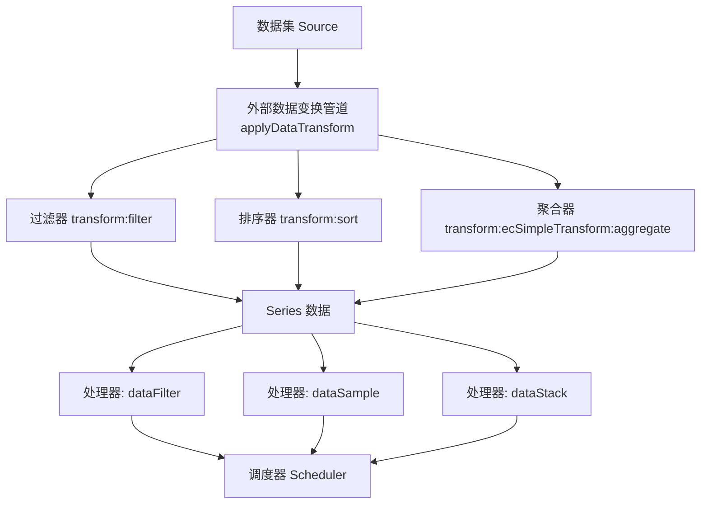
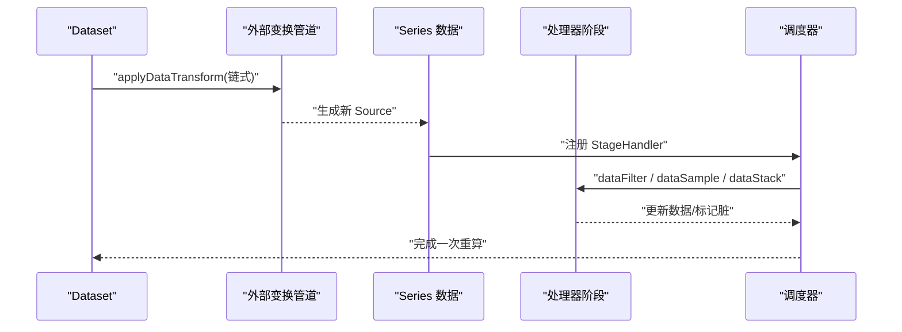
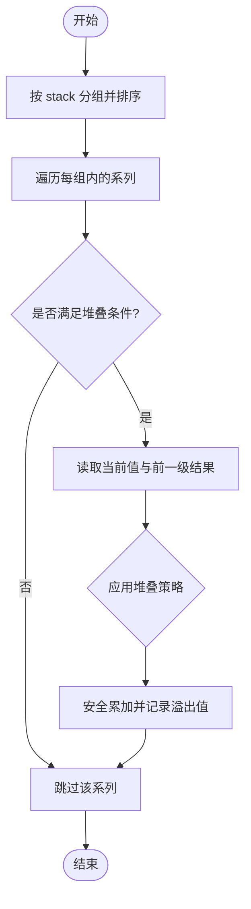
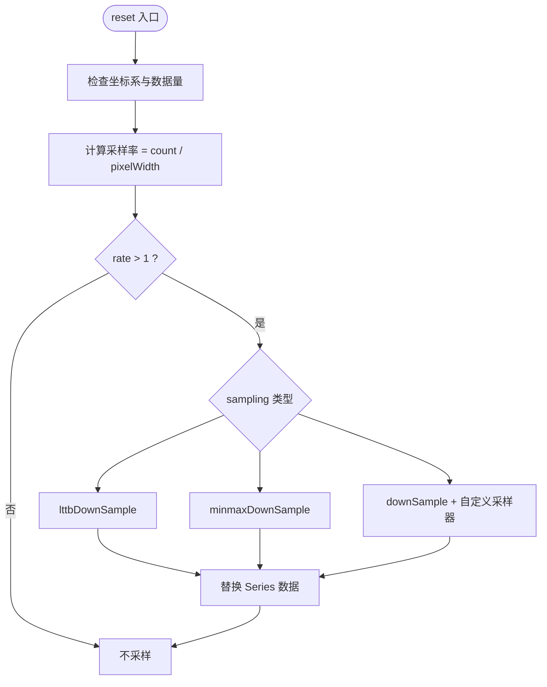
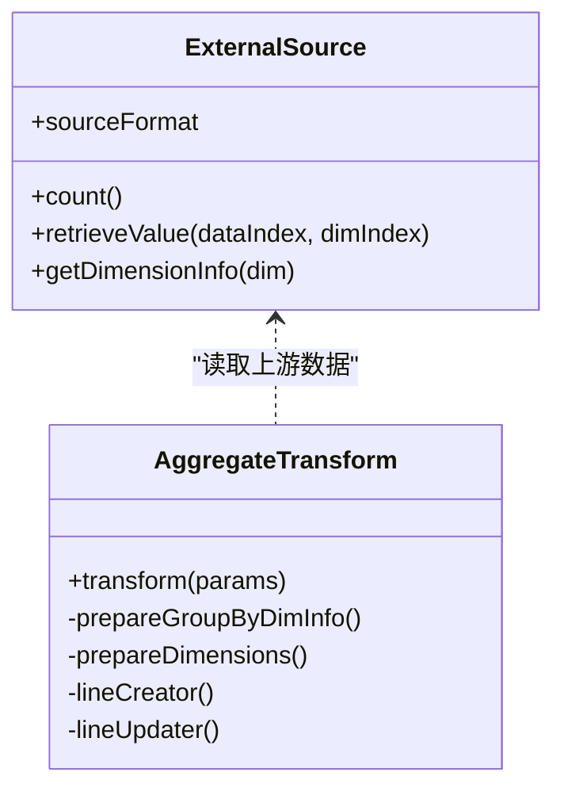
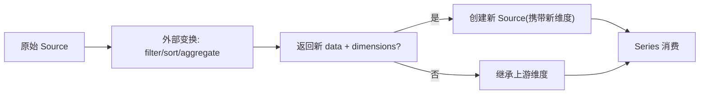
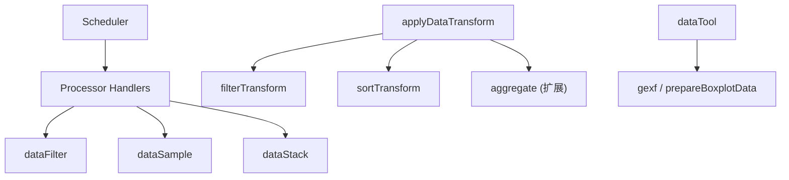

# 数据转换

<cite>
**本文引用的文件**
- [src/processor/dataStack.ts](file://src/processor/dataStack.ts)
- [src/processor/dataSample.ts](file://src/processor/dataSample.ts)
- [src/processor/dataFilter.ts](file://src/processor/dataFilter.ts)
- [src/component/transform/filterTransform.ts](file://src/component/transform/filterTransform.ts)
- [src/component/transform/sortTransform.ts](file://src/component/transform/sortTransform.ts)
- [src/data/helper/transform.ts](file://src/data/helper/transform.ts)
- [src/core/Scheduler.ts](file://src/core/Scheduler.ts)
- [extension-src/dataTool/index.ts](file://extension-src/dataTool/index.ts)
</cite>

## 目录
1. [简介](#简介)
2. [项目结构](#项目结构)
3. [核心组件](#核心组件)
4. [架构总览](#架构总览)
5. [详细组件分析](#详细组件分析)
6. [依赖关系分析](#依赖关系分析)
7. [性能考量](#性能考量)
8. [故障排查指南](#故障排查指南)
9. [结论](#结论)
10. [附录：配置示例与最佳实践](#附录：配置示例与最佳实践)

## 简介
本文件系统性阐述 ECharts 数据转换系统的核心能力，重点覆盖：
- 数据堆叠机制：堆叠计算、基准线设置、多系列堆叠处理
- 数据采样算法：降维策略、抽样方法与性能优化
- 聚合计算功能：分组统计、聚合函数与自定义计算逻辑
- 维度变换技术：维度映射、数据重塑与结构转换
- 大数据量处理最佳实践：流式处理与增量计算思路

## 项目结构
ECharts 的数据转换由“处理器阶段（Stage）”和“外部数据变换（External Data Transform）”两部分组成：
- 处理器阶段：在渲染管线中按序执行，负责过滤、采样、堆叠等通用数据处理
- 外部数据变换：通过 dataset.transform 声明的链式变换，支持 filter、sort、以及扩展的 aggregate 等

图表来源
- [src/data/helper/transform.ts:363-390](file://src/data/helper/transform.ts#L363-L390)
- [src/component/transform/filterTransform.ts:34-96](file://src/component/transform/filterTransform.ts#L34-L96)
- [src/component/transform/sortTransform.ts:77-206](file://src/component/transform/sortTransform.ts#L77-L206)
- [src/processor/dataFilter.ts:22-45](file://src/processor/dataFilter.ts#L22-L45)
- [src/processor/dataSample.ts:75-121](file://src/processor/dataSample.ts#L75-L121)
- [src/processor/dataStack.ts:47-103](file://src/processor/dataStack.ts#L47-L103)
- [src/core/Scheduler.ts:378-386](file://src/core/Scheduler.ts#L378-L386)

章节来源
- [src/data/helper/transform.ts:363-390](file://src/data/helper/transform.ts#L363-L390)
- [src/core/Scheduler.ts:378-386](file://src/core/Scheduler.ts#L378-L386)

## 核心组件
- 数据堆叠处理器：实现同组系列的值累加、溢出值记录、正负号策略控制与顺序反转
- 数据采样处理器：基于坐标轴范围自适应采样率，提供多种聚合采样器与专用算法
- 数据过滤处理器：依据图例选择状态对数据进行行级过滤
- 外部数据变换：
  - filter：条件表达式过滤
  - sort：多维度排序，支持解析器与不可比较值处理
  - aggregate（扩展）：分组聚合、分位数、均值等

章节来源
- [src/processor/dataStack.ts:47-176](file://src/processor/dataStack.ts#L47-L176)
- [src/processor/dataSample.ts:26-121](file://src/processor/dataSample.ts#L26-L121)
- [src/processor/dataFilter.ts:22-45](file://src/processor/dataFilter.ts#L22-L45)
- [src/component/transform/filterTransform.ts:34-96](file://src/component/transform/filterTransform.ts#L34-L96)
- [src/component/transform/sortTransform.ts:77-206](file://src/component/transform/sortTransform.ts#L77-L206)
- [extension-src/dataTool/index.ts:20-42](file://extension-src/dataTool/index.ts#L20-L42)

## 架构总览
数据从 dataset.source 进入，先经过外部数据变换管道（可链式组合），再进入 Series 数据构建阶段，随后由调度器依次触发各处理器阶段。

图表来源
- [src/data/helper/transform.ts:363-390](file://src/data/helper/transform.ts#L363-L390)
- [src/core/Scheduler.ts:378-386](file://src/core/Scheduler.ts#L378-L386)

## 详细组件分析

### 数据堆叠机制
- 堆叠分组：根据 series.stack 将系列分组，同组内按 stackOrder 决定顺序（支持升/降序）
- 基准线与溢出：为每个点计算堆叠结果与溢出值（用于面积/带状区域绘制）
- 多系列堆叠：支持按索引或按维度匹配进行堆叠；支持 connectNulls 场景下的 NaN 传播
- 堆叠策略：all、positive、negative、samesign，控制正负值的叠加方式

图表来源
- [src/processor/dataStack.ts:47-103](file://src/processor/dataStack.ts#L47-L103)
- [src/processor/dataStack.ts:105-176](file://src/processor/dataStack.ts#L105-L176)

章节来源
- [src/processor/dataStack.ts:47-176](file://src/processor/dataStack.ts#L47-L176)

### 数据采样算法
- 降维策略：仅在笛卡尔坐标系且数据量大于阈值时启用；根据坐标轴像素宽度计算采样率
- 抽样方法：
  - 内置聚合器：average、sum、max、min、nearest
  - 专用算法：lttb、minmax
- 性能优化：仅对第一个值维度采样；使用 downSample/minmaxDownSample/lttbDownSample 高效实现

图表来源
- [src/processor/dataSample.ts:75-121](file://src/processor/dataSample.ts#L75-L121)
- [src/processor/dataSample.ts:26-69](file://src/processor/dataSample.ts#L26-L69)

章节来源
- [src/processor/dataSample.ts:26-121](file://src/processor/dataSample.ts#L26-L121)

### 聚合计算功能
- 分组统计：支持按某维度分组，对其它维度进行聚合
- 聚合函数：SUM、COUNT、FIRST、AVERAGE、MIN、MAX、Q1/Q2/Q3（分位数）
- 自定义计算：可通过扩展 transform 注入新的聚合方法
- 输出维度：可返回新的 dimensions 定义，或继承上游维度

图表来源
- [src/data/helper/transform.ts:92-159](file://src/data/helper/transform.ts#L92-L159)
- [test/lib/ecSimpleTransform.js:44-343](file://test/lib/ecSimpleTransform.js#L44-L343)

章节来源
- [test/lib/ecSimpleTransform.js:44-343](file://test/lib/ecSimpleTransform.js#L44-L343)
- [src/data/helper/transform.ts:92-159](file://src/data/helper/transform.ts#L92-L159)

### 维度变换技术
- 维度映射：通过 mapDimension 将值轴维度映射到数据列，供采样与堆叠使用
- 数据重塑：外部变换可返回新的数据行结构与维度定义
- 结构转换：支持数组行/对象行两种源格式，统一转换为内部 Source 元信息

图表来源
- [src/data/helper/transform.ts:363-390](file://src/data/helper/transform.ts#L363-L390)
- [src/data/helper/transform.ts:475-538](file://src/data/helper/transform.ts#L475-L538)

章节来源
- [src/data/helper/transform.ts:363-390](file://src/data/helper/transform.ts#L363-L390)
- [src/data/helper/transform.ts:475-538](file://src/data/helper/transform.ts#L475-L538)

## 依赖关系分析
- 处理器与调度器：Scheduler 统一管理 StageHandler 的执行顺序与脏标记
- 外部变换与 Source：applyDataTransform 将用户声明的 transform 链转换为新的 Source 列表
- 扩展工具：dataTool 暴露 gexf、prepareBoxplotData 等辅助能力

图表来源
- [src/core/Scheduler.ts:378-386](file://src/core/Scheduler.ts#L378-L386)
- [src/processor/dataFilter.ts:22-45](file://src/processor/dataFilter.ts#L22-L45)
- [src/processor/dataSample.ts:75-121](file://src/processor/dataSample.ts#L75-L121)
- [src/processor/dataStack.ts:47-103](file://src/processor/dataStack.ts#L47-L103)
- [src/data/helper/transform.ts:363-390](file://src/data/helper/transform.ts#L363-L390)
- [extension-src/dataTool/index.ts:20-42](file://extension-src/dataTool/index.ts#L20-L42)

章节来源
- [src/core/Scheduler.ts:378-386](file://src/core/Scheduler.ts#L378-L386)
- [src/data/helper/transform.ts:363-390](file://src/data/helper/transform.ts#L363-L390)
- [extension-src/dataTool/index.ts:20-42](file://extension-src/dataTool/index.ts#L20-L42)

## 性能考量
- 采样时机：仅在笛卡尔坐标系且数据量足够大时启用，避免小数据开销
- 采样粒度：按像素宽度估算 rate，减少冗余点
- 堆叠优化：使用安全加法避免浮点误差；按索引或维度快速定位前一级数据
- 外部变换：优先使用轻量级 filter/sort；复杂聚合建议在数据源侧预处理或使用扩展 aggregate
- 流式与增量：结合 appendData/appendGeoData 等接口，配合采样与过滤，降低内存与计算压力

[本节为通用指导，无需具体文件引用]

## 故障排查指南
- 堆叠异常
  - 现象：堆叠错位或值为 NaN
  - 排查：确认 stackedDimension 与 stackedByDimension 是否正确；检查 connectNulls 导致的 NaN 传播；核对 stackStrategy
  - 参考路径：[src/processor/dataStack.ts:105-176](file://src/processor/dataStack.ts#L105-L176)
- 采样无效
  - 现象：未发生降采样
  - 排查：确认坐标系为 cartesian2d；数据量>10；sampling 配置有效；valueAxis 映射维度存在
  - 参考路径：[src/processor/dataSample.ts:83-121](file://src/processor/dataSample.ts#L83-L121)
- 过滤不生效
  - 现象：图例切换后数据未变化
  - 排查：确认 legend 已注册且名称与数据名一致；检查 filterSelf 回调返回值
  - 参考路径：[src/processor/dataFilter.ts:22-45](file://src/processor/dataFilter.ts#L22-L45)
- 外部变换报错
  - 现象：找不到 transform 类型或维度不存在
  - 排查：确认 type 命名空间正确；dimension 名称存在；返回数据结构符合规范
  - 参考路径：[src/data/helper/transform.ts:333-361](file://src/data/helper/transform.ts#L333-L361), [src/data/helper/transform.ts:413-421](file://src/data/helper/transform.ts#L413-L421)

章节来源
- [src/processor/dataStack.ts:105-176](file://src/processor/dataStack.ts#L105-L176)
- [src/processor/dataSample.ts:83-121](file://src/processor/dataSample.ts#L83-L121)
- [src/processor/dataFilter.ts:22-45](file://src/processor/dataFilter.ts#L22-L45)
- [src/data/helper/transform.ts:333-361](file://src/data/helper/transform.ts#L333-L361)
- [src/data/helper/transform.ts:413-421](file://src/data/helper/transform.ts#L413-L421)

## 结论
ECharts 的数据转换系统以“外部变换 + 处理器阶段”的双层架构实现灵活而高性能的数据处理能力。堆叠、采样、过滤与聚合各司其职，既保证可视化准确性，又兼顾大数据场景的性能。通过合理的配置与扩展，可覆盖绝大多数业务需求。

[本节为总结性内容，无需具体文件引用]

## 附录：配置示例与最佳实践
以下为常见转换场景的配置要点与参考路径（不包含代码片段）：
- 数据堆叠
  - 配置项：stack、stackOrder、stackStrategy
  - 参考路径：[src/processor/dataStack.ts:47-103](file://src/processor/dataStack.ts#L47-L103), [src/processor/dataStack.ts:105-176](file://src/processor/dataStack.ts#L105-L176)
- 数据采样
  - 配置项：sampling（lttb/minmax/自定义函数）、seriesType
  - 参考路径：[src/processor/dataSample.ts:75-121](file://src/processor/dataSample.ts#L75-L121)
- 数据过滤
  - 配置项：legend 联动过滤
  - 参考路径：[src/processor/dataFilter.ts:22-45](file://src/processor/dataFilter.ts#L22-L45)
- 外部变换
  - filter：type='echarts:filter'，config 为条件表达式
  - sort：type='echarts:sort'，config 支持多维排序与解析器
  - 参考路径：[src/component/transform/filterTransform.ts:34-96](file://src/component/transform/filterTransform.ts#L34-L96), [src/component/transform/sortTransform.ts:77-206](file://src/component/transform/sortTransform.ts#L77-L206)
- 聚合计算（扩展）
  - 通过扩展注册 aggregate 变换，支持 SUM/COUNT/AVERAGE/MIN/MAX/Q1/Q3 等
  - 参考路径：[extension-src/dataTool/index.ts:20-42](file://extension-src/dataTool/index.ts#L20-L42), [test/lib/ecSimpleTransform.js:44-343](file://test/lib/ecSimpleTransform.js#L44-L343)
- 大数据量最佳实践
  - 启用采样、合理设置 sampling 策略
  - 使用外部变换在数据源侧做初步过滤/排序/聚合
  - 结合 appendData 进行增量更新，减少全量重算
  - 参考路径：[src/processor/dataSample.ts:83-121](file://src/processor/dataSample.ts#L83-L121), [src/data/helper/transform.ts:363-390](file://src/data/helper/transform.ts#L363-L390)