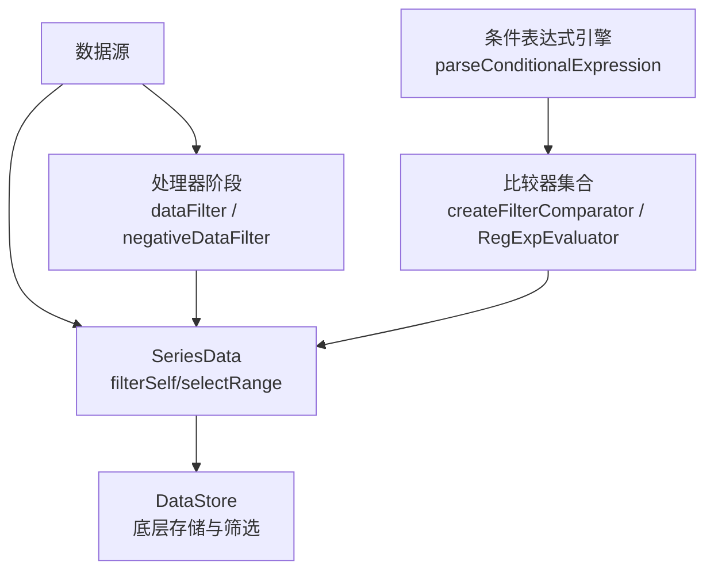
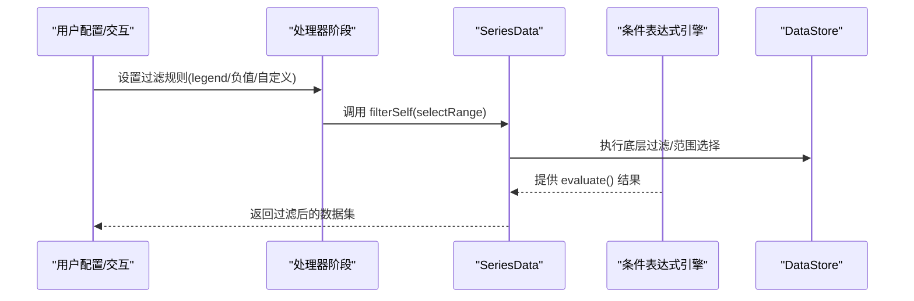
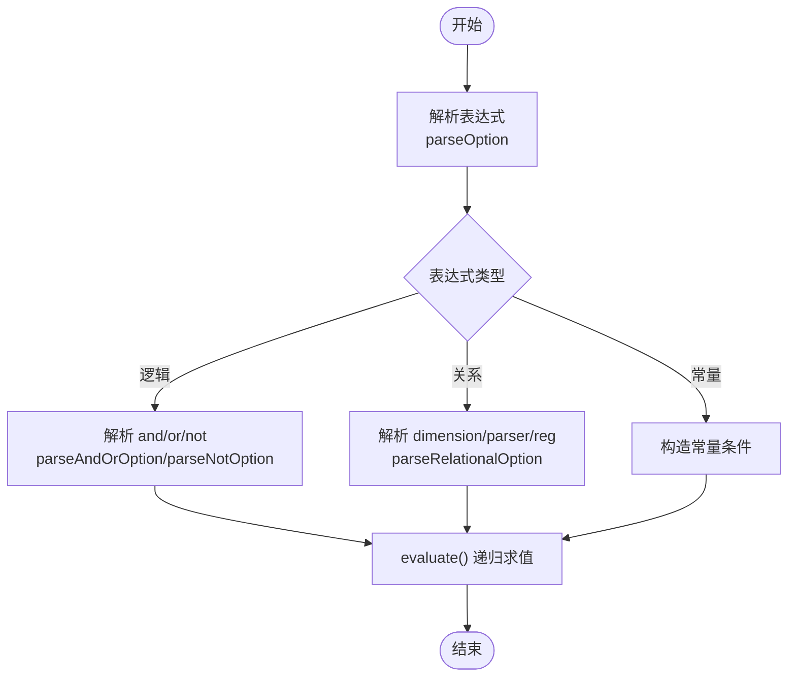
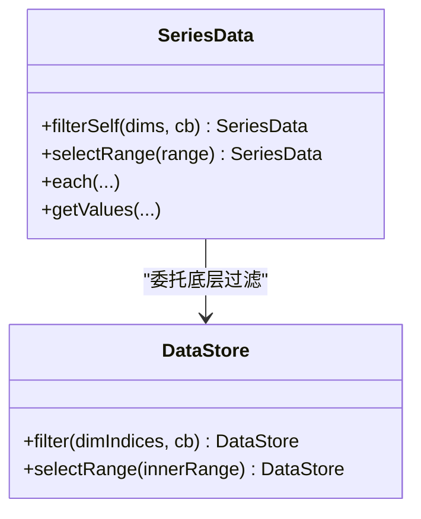
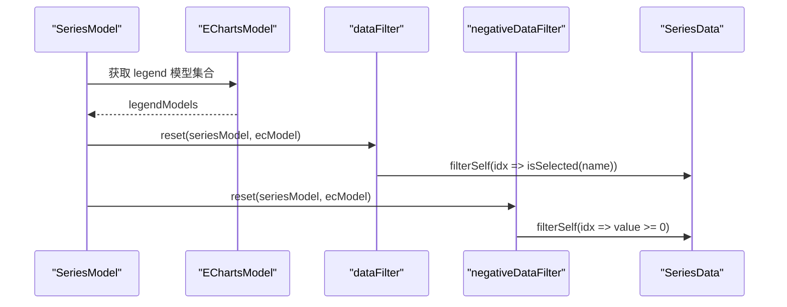
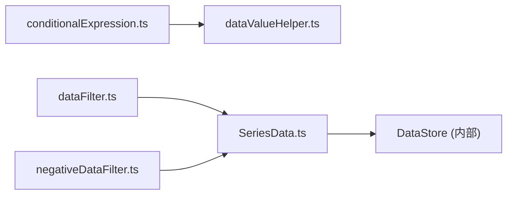

# 数据过滤

<cite>
**本文引用的文件**
- [src/processor/dataFilter.ts](file://src/processor/dataFilter.ts)
- [src/processor/negativeDataFilter.ts](file://src/processor/negativeDataFilter.ts)
- [src/util/conditionalExpression.ts](file://src/util/conditionalExpression.ts)
- [src/data/helper/dataValueHelper.ts](file://src/data/helper/dataValueHelper.ts)
- [src/data/SeriesData.ts](file://src/data/SeriesData.ts)
- [test/ut/spec/data/SeriesData.test.ts](file://test/ut/spec/data/SeriesData.test.ts)
</cite>

## 目录
1. [简介](#简介)
2. [项目结构](#项目结构)
3. [核心组件](#核心组件)
4. [架构总览](#架构总览)
5. [详细组件分析](#详细组件分析)
6. [依赖关系分析](#依赖关系分析)
7. [性能考虑](#性能考虑)
8. [故障排查指南](#故障排查指南)
9. [结论](#结论)
10. [附录：配置示例与最佳实践](#附录：配置示例与最佳实践)

## 简介
本文件围绕 ECharts 的数据过滤系统，系统性解析通用过滤机制（条件表达式语法、过滤器链式调用、自定义过滤函数）、负值数据处理（负值过滤器的特殊逻辑、零值处理策略、异常值检测），并提供丰富的配置示例与大数据集下的性能优化建议。内容基于源码实现进行说明，确保准确可追溯。

## 项目结构
ECharts 的数据过滤由“处理器阶段 + 数据结构 + 条件表达式引擎”三部分协同完成：
- 处理器阶段：在数据管线中按系列类型执行过滤逻辑，如 legend 选择过滤、负值过滤等。
- 数据结构：SeriesData 提供 filterSelf/selectRange 等能力，底层委托 DataStore 完成高效过滤与范围选择。
- 条件表达式引擎：将声明式的结构化表达式解析为可执行的比较器集合，支持数值、时间、正则匹配及 and/or/not 组合。

图表来源
- [src/processor/dataFilter.ts:22-45](file://src/processor/dataFilter.ts#L22-L45)
- [src/processor/negativeDataFilter.ts:23-38](file://src/processor/negativeDataFilter.ts#L23-L38)
- [src/data/SeriesData.ts:917-946](file://src/data/SeriesData.ts#L917-L946)
- [src/util/conditionalExpression.ts:449-476](file://src/util/conditionalExpression.ts#L449-L476)
- [src/data/helper/dataValueHelper.ts:260-269](file://src/data/helper/dataValueHelper.ts#L260-L269)

章节来源
- [src/processor/dataFilter.ts:22-45](file://src/processor/dataFilter.ts#L22-L45)
- [src/processor/negativeDataFilter.ts:23-38](file://src/processor/negativeDataFilter.ts#L23-L38)
- [src/data/SeriesData.ts:917-946](file://src/data/SeriesData.ts#L917-L946)
- [src/util/conditionalExpression.ts:449-476](file://src/util/conditionalExpression.ts#L449-L476)
- [src/data/helper/dataValueHelper.ts:260-269](file://src/data/helper/dataValueHelper.ts#L260-L269)

## 核心组件
- 条件表达式引擎：负责将结构化表达式解析为可评估对象，内部包含常量、逻辑（and/or/not）与关系型条件，并支持内置解析器（number/time/trim）与正则匹配。
- 比较器工厂：根据操作符生成高性能比较器（数值大小比较、相等/不等比较、正则匹配）。
- SeriesData 过滤接口：提供 filterSelf（回调过滤）和 selectRange（范围选择）两种高效过滤方式；底层通过 DataStore 实现。
- 处理器阶段：以 StageHandler 形式在数据管线中注入过滤逻辑，例如 legend 选择过滤、负值过滤。

章节来源
- [src/util/conditionalExpression.ts:301-442](file://src/util/conditionalExpression.ts#L301-L442)
- [src/data/helper/dataValueHelper.ts:107-269](file://src/data/helper/dataValueHelper.ts#L107-L269)
- [src/data/SeriesData.ts:917-946](file://src/data/SeriesData.ts#L917-L946)
- [src/processor/dataFilter.ts:22-45](file://src/processor/dataFilter.ts#L22-L45)
- [src/processor/negativeDataFilter.ts:23-38](file://src/processor/negativeDataFilter.ts#L23-L38)

## 架构总览
下图展示了从配置到渲染的过滤链路：用户配置或运行时触发 → 处理器阶段执行 → SeriesData 过滤 → 条件表达式引擎评估 → 最终可视数据。

图表来源
- [src/processor/dataFilter.ts:22-45](file://src/processor/dataFilter.ts#L22-L45)
- [src/processor/negativeDataFilter.ts:23-38](file://src/processor/negativeDataFilter.ts#L23-L38)
- [src/data/SeriesData.ts:917-946](file://src/data/SeriesData.ts#L917-L946)
- [src/util/conditionalExpression.ts:449-476](file://src/util/conditionalExpression.ts#L449-L476)

## 详细组件分析

### 条件表达式引擎与比较器
- 表达式类型
  - 布尔常量：true/false
  - 逻辑组合：and/or/not
  - 关系型条件：dimension/parser/reg 配合操作符 lt/lte/gt/gte/eq/ne
- 解析流程
  - parseOption 识别表达式类型并构建内部节点
  - parseRelationalOption 提取维度、解析器与操作符，生成比较器列表
  - evaluate 时按“与”语义依次评估子条件
- 比较器
  - 数值比较：FilterOrderComparator（lt/lte/gt/gte）
  - 相等比较：FilterEqualityComparator（eq/ne）
  - 正则匹配：RegExpEvaluator（支持字符串或正则对象）

图表来源
- [src/util/conditionalExpression.ts:301-442](file://src/util/conditionalExpression.ts#L301-L442)
- [src/data/helper/dataValueHelper.ts:107-269](file://src/data/helper/dataValueHelper.ts#L107-L269)

章节来源
- [src/util/conditionalExpression.ts:301-442](file://src/util/conditionalExpression.ts#L301-L442)
- [src/data/helper/dataValueHelper.ts:107-269](file://src/data/helper/dataValueHelper.ts#L107-L269)

### SeriesData 过滤接口与链式调用
- filterSelf：支持按维度或全量遍历，回调返回布尔值决定是否保留该项；底层委托 DataStore.filter。
- selectRange：针对多维度的范围选择，适合大数据集的高性能过滤（如 dataZoom）。
- 链式调用：filterSelf/selectRange 均返回 this，便于串联多个过滤步骤。

图表来源
- [src/data/SeriesData.ts:917-946](file://src/data/SeriesData.ts#L917-L946)
- [src/data/SeriesData.ts:948-966](file://src/data/SeriesData.ts#L948-L966)

章节来源
- [src/data/SeriesData.ts:917-946](file://src/data/SeriesData.ts#L917-L946)
- [src/data/SeriesData.ts:948-966](file://src/data/SeriesData.ts#L948-L966)
- [test/ut/spec/data/SeriesData.test.ts:167-175](file://test/ut/spec/data/SeriesData.test.ts#L167-L175)

### 处理器阶段：Legend 选择过滤与负值过滤
- Legend 选择过滤：遍历所有 legend 组件，若某项在任何 legend 中未被选中则过滤掉对应数据项。
- 负值过滤：读取 value 维度，若值为有效数字且小于 0，则过滤掉该数据项。

图表来源
- [src/processor/dataFilter.ts:22-45](file://src/processor/dataFilter.ts#L22-L45)
- [src/processor/negativeDataFilter.ts:23-38](file://src/processor/negativeDataFilter.ts#L23-L38)

章节来源
- [src/processor/dataFilter.ts:22-45](file://src/processor/dataFilter.ts#L22-L45)
- [src/processor/negativeDataFilter.ts:23-38](file://src/processor/negativeDataFilter.ts#L23-L38)

### 负值数据处理：特殊逻辑、零值策略与异常值检测
- 负值过滤器的特殊逻辑：仅当 value 维度为有效数字且小于 0 时才过滤；非数字、NaN、null/undefined 不视为负值。
- 零值处理策略：零值不被视为负值，因此不会被负值过滤器剔除；如需排除零值，可在自定义回调中显式判断。
- 异常值检测：结合 hasValue 与数据清洗（如 sanitization filter）可识别缺失/无效坐标维度；对于数值维度，可通过范围过滤（g/ge/l/le）屏蔽异常极值。

章节来源
- [src/processor/negativeDataFilter.ts:23-38](file://src/processor/negativeDataFilter.ts#L23-L38)
- [src/data/SeriesData.ts:818-833](file://src/data/SeriesData.ts#L818-L833)
- [src/data/helper/dataValueHelper.ts:292-332](file://src/data/helper/dataValueHelper.ts#L292-L332)

## 依赖关系分析
- conditionalExpression.ts 依赖 dataValueHelper.ts 的比较器与解析器，用于将表达式转换为可执行逻辑。
- processor 阶段的过滤器依赖 SeriesData 的 filterSelf 接口，间接依赖 DataStore。
- SeriesData 的 selectRange/filterSelf 是高性能过滤的关键入口，广泛用于 dataZoom 等场景。

图表来源
- [src/util/conditionalExpression.ts:449-476](file://src/util/conditionalExpression.ts#L449-L476)
- [src/data/helper/dataValueHelper.ts:260-269](file://src/data/helper/dataValueHelper.ts#L260-L269)
- [src/processor/dataFilter.ts:22-45](file://src/processor/dataFilter.ts#L22-L45)
- [src/processor/negativeDataFilter.ts:23-38](file://src/processor/negativeDataFilter.ts#L23-L38)
- [src/data/SeriesData.ts:917-946](file://src/data/SeriesData.ts#L917-L946)

章节来源
- [src/util/conditionalExpression.ts:449-476](file://src/util/conditionalExpression.ts#L449-L476)
- [src/data/helper/dataValueHelper.ts:260-269](file://src/data/helper/dataValueHelper.ts#L260-L269)
- [src/processor/dataFilter.ts:22-45](file://src/processor/dataFilter.ts#L22-L45)
- [src/processor/negativeDataFilter.ts:23-38](file://src/processor/negativeDataFilter.ts#L23-L38)
- [src/data/SeriesData.ts:917-946](file://src/data/SeriesData.ts#L917-L946)

## 性能考虑
- 优先使用 selectRange：对大数据集（如 dataZoom）建议使用 selectRange 进行范围选择，避免逐条回调带来的开销。
- 减少回调复杂度：filterSelf 的回调应尽量轻量，避免复杂计算；必要时先做粗筛再细筛。
- 复用比较器：条件表达式引擎在解析阶段生成比较器，运行期直接 evaluate，避免重复创建对象。
- 维度选择：仅在必要维度上过滤，减少不必要的维度访问与转换。
- 内存管理：filterSelf/selectRange 会更新内部 store 引用，注意避免频繁重建导致 GC 压力；批量更新时合并多次过滤。

[本节为通用性能建议，无需特定文件引用]

## 故障排查指南
- 表达式非法
  - 关系型条件缺少操作符会报错；请确保至少提供一个操作符（如 gt/lt/eq 等）。
  - and/or 必须为非空数组；not 必须为对象。
- 数据类型不匹配
  - 数值比较要求右值为数字；字符串需通过 parser:'number' 或 trim 预处理。
  - 时间比较需使用 parser:'time'，并确保输入可解析为时间戳。
- 正则匹配失败
  - reg 字段需为 RegExp 或可构造为 RegExp 的字符串；非法输入会抛出错误。
- 负值过滤未生效
  - 确认 value 维度存在且为数值；非数字或 NaN 不会被当作负值处理。
- 零值与异常值
  - 零值不会被负值过滤器剔除；如需排除，请在自定义回调中显式判断。
  - 使用 sanitization filter（g/ge/l/le）屏蔽超出范围的异常值。

章节来源
- [src/util/conditionalExpression.ts:301-442](file://src/util/conditionalExpression.ts#L301-L442)
- [src/data/helper/dataValueHelper.ts:260-269](file://src/data/helper/dataValueHelper.ts#L260-L269)
- [src/processor/negativeDataFilter.ts:23-38](file://src/processor/negativeDataFilter.ts#L23-L38)
- [src/data/helper/dataValueHelper.ts:292-332](file://src/data/helper/dataValueHelper.ts#L292-L332)

## 结论
ECharts 的数据过滤系统通过“处理器阶段 + SeriesData 接口 + 条件表达式引擎”形成清晰、可扩展的过滤体系。开发者既可利用声明式表达式进行复杂条件组合，也可通过回调与范围选择实现高性能过滤。理解负值与零值的处理策略、合理使用 sanitization filter，并结合 selectRange 优化大数据集性能，是构建稳定高效可视化应用的关键。

[本节为总结性内容，无需特定文件引用]

## 附录：配置示例与最佳实践
以下为常见过滤场景的配置思路与要点（不直接展示代码片段，路径指向相关实现以便查阅）：
- 基于数值的范围过滤
  - 使用关系型条件的 lt/lte/gt/gte 与 parser:'number' 进行数值范围筛选。
  - 参考：[src/util/conditionalExpression.ts:384-442](file://src/util/conditionalExpression.ts#L384-L442)、[src/data/helper/dataValueHelper.ts:120-141](file://src/data/helper/dataValueHelper.ts#L120-L141)
- 基于字符串的模式匹配
  - 使用 reg 字段进行正则匹配，支持字符串或 RegExp 对象。
  - 参考：[src/util/conditionalExpression.ts:173-196](file://src/util/conditionalExpression.ts#L173-L196)
- 复杂条件的组合使用
  - 使用 and/or/not 组合多个关系型条件，实现多条件联动过滤。
  - 参考：[src/util/conditionalExpression.ts:321-382](file://src/util/conditionalExpression.ts#L321-L382)
- 自定义过滤函数实现
  - 使用 SeriesData.filterSelf 传入回调，灵活实现业务过滤逻辑。
  - 参考：[src/data/SeriesData.ts:917-946](file://src/data/SeriesData.ts#L917-L946)、[test/ut/spec/data/SeriesData.test.ts:167-175](file://test/ut/spec/data/SeriesData.test.ts#L167-L175)
- 大数据集优化
  - 优先使用 selectRange 进行范围选择，减少回调开销。
  - 参考：[src/data/SeriesData.ts:948-966](file://src/data/SeriesData.ts#L948-L966)
- 异常值与零值处理
  - 使用 sanitization filter（g/ge/l/le）屏蔽异常值；零值需单独处理。
  - 参考：[src/data/helper/dataValueHelper.ts:292-332](file://src/data/helper/dataValueHelper.ts#L292-L332)

[本节为示例指引，无需额外图表来源]