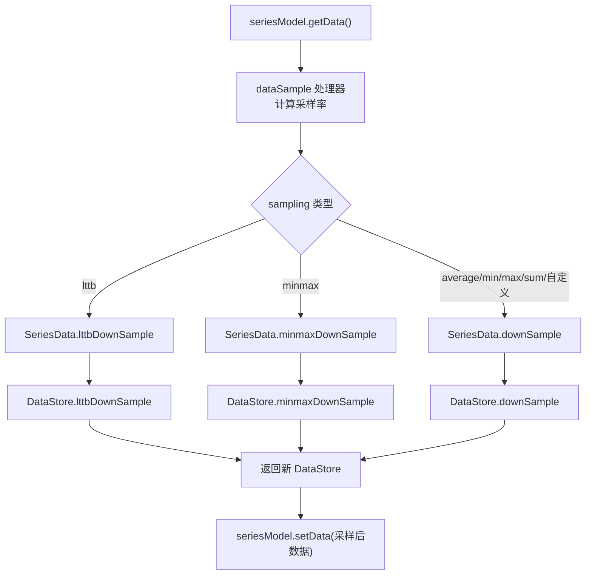
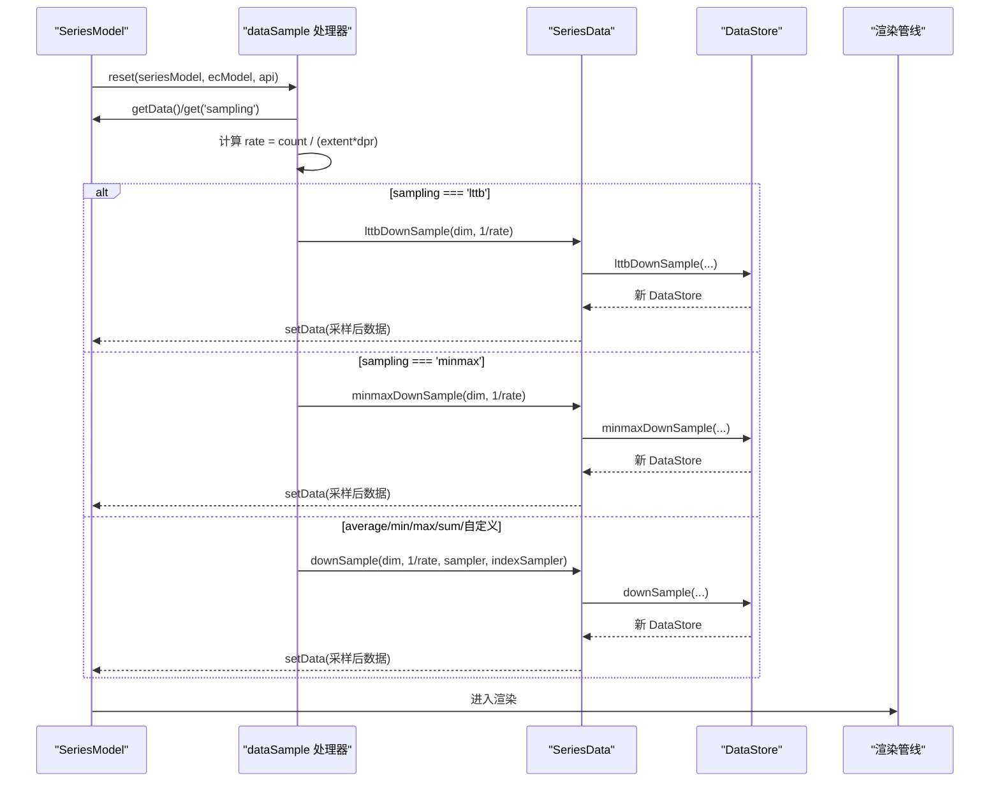
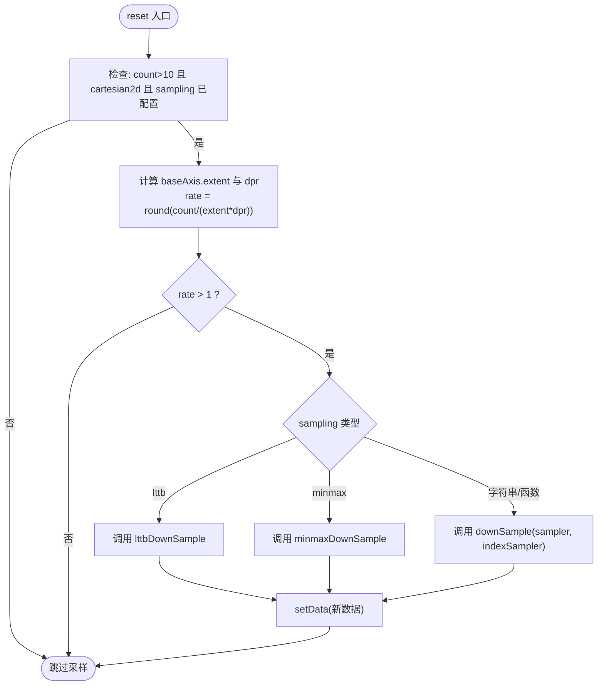
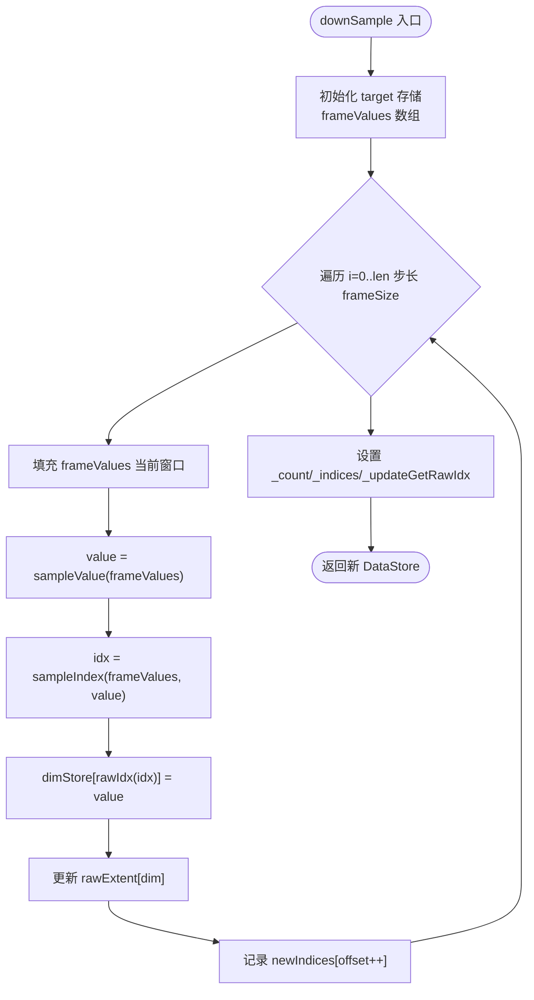
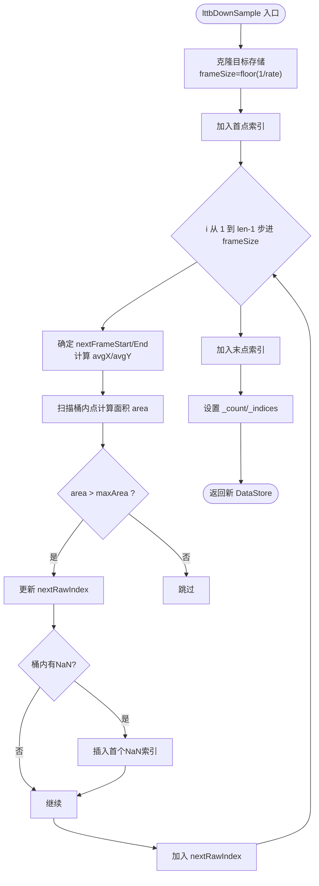
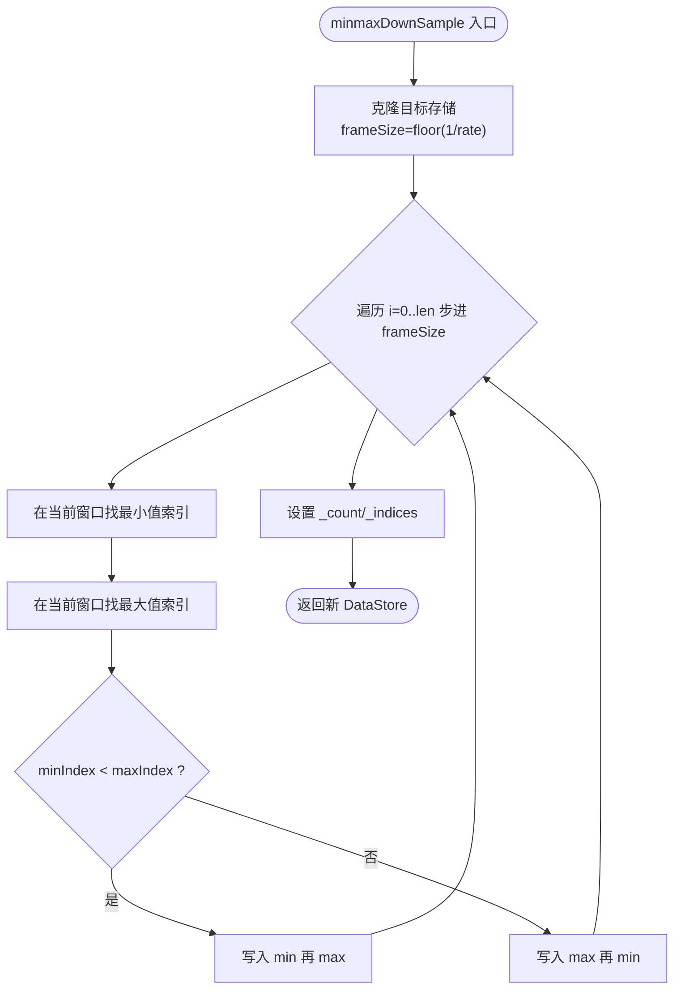
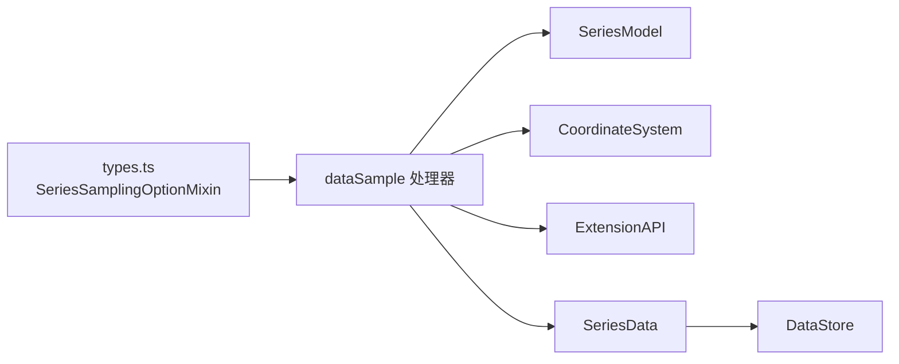

# 数据采样

<cite>
**本文引用的文件**
- [src/processor/dataSample.ts](file://src/processor/dataSample.ts)
- [src/data/DataStore.ts](file://src/data/DataStore.ts)
- [src/data/SeriesData.ts](file://src/data/SeriesData.ts)
- [src/util/types.ts](file://src/util/types.ts)
- [src/chart/line/LineSeries.ts](file://src/chart/line/LineSeries.ts)
- [test/sample-compare.html](file://test/sample-compare.html)
</cite>

## 目录
1. [简介](#简介)
2. [项目结构](#项目结构)
3. [核心组件](#核心组件)
4. [架构总览](#架构总览)
5. [详细组件分析](#详细组件分析)
6. [依赖关系分析](#依赖关系分析)
7. [性能考量](#性能考量)
8. [故障排查指南](#故障排查指南)
9. [结论](#结论)
10. [附录](#附录)

## 简介
本文件系统性阐述 ECharts 的数据采样机制，重点包括：
- 降维策略与算法选择：平均值、最大值/最小值、LTTB（最大三角形三桶）、minmax、sum 等，如何适配不同数据类型与可视化目标。
- 采样参数配置：采样阈值与触发条件、质量与性能的平衡、可定制采样函数。
- 实际应用案例：时间序列降采样、散点图密度优化、大数据流畅渲染。
- 效果对比：不同算法对数据特征保留的影响与适用场景。

## 项目结构
ECharts 的采样能力由“处理器 + 数据层”协同实现：
- 处理器负责在渲染前根据坐标轴范围和设备像素比计算采样率，并调用数据层的采样方法替换数据集。
- 数据层提供通用 downSample、专用 lttbDownSample/minmaxDownSample 等方法，完成分块窗口内的聚合或关键帧选取。
- 类型定义统一了 sampling 选项的可用值与自定义函数签名。
- 折线图默认关闭采样，可通过 series.sampling 开启。

**图表来源**
- [src/processor/dataSample.ts:83-120](file://src/processor/dataSample.ts#L83-L120)
- [src/data/SeriesData.ts:1073-1116](file://src/data/SeriesData.ts#L1073-L1116)
- [src/data/DataStore.ts:870-1090](file://src/data/DataStore.ts#L870-L1090)

**章节来源**
- [src/processor/dataSample.ts:83-120](file://src/processor/dataSample.ts#L83-L120)
- [src/data/SeriesData.ts:1073-1116](file://src/data/SeriesData.ts#L1073-L1116)
- [src/data/DataStore.ts:870-1090](file://src/data/DataStore.ts#L870-L1090)
- [src/util/types.ts:2102-2106](file://src/util/types.ts#L2102-L2106)
- [src/chart/line/LineSeries.ts:210-222](file://src/chart/line/LineSeries.ts#L210-L222)

## 核心组件
- 采样处理器 dataSample
  - 职责：在 reset 阶段读取 series.sampling，基于基轴范围和设备像素比计算采样率 rate，按策略调用数据层采样方法，将采样后的数据写回 seriesModel。
  - 关键点：仅在笛卡尔坐标系且数据量大于阈值时启用；rate = count / (extent * dpr)。
- 数据层 SeriesData/DataStore
  - 通用 downSample：按 frameSize 切分窗口，使用 sampleValue 聚合值，sampleIndex 选择索引，更新 rawExtent。
  - 专用 lttbDownSample：LTTB 算法，按三桶面积最大化原则选点，保留波形特征。
  - 专用 minmaxDownSample：每窗口取最小值和最大值，适合强调极值的折线/柱状展示。
- 类型与配置
  - sampling 支持 'none' | 'average' | 'min' | 'max' | 'minmax' | 'sum' | 'lttb' | 自定义函数。
  - 折线图默认 sampling: 'none'，需显式开启。

**章节来源**
- [src/processor/dataSample.ts:26-120](file://src/processor/dataSample.ts#L26-L120)
- [src/data/DataStore.ts:870-1090](file://src/data/DataStore.ts#L870-L1090)
- [src/data/SeriesData.ts:1073-1116](file://src/data/SeriesData.ts#L1073-L1116)
- [src/util/types.ts:2102-2106](file://src/util/types.ts#L2102-L2106)
- [src/chart/line/LineSeries.ts:210-222](file://src/chart/line/LineSeries.ts#L210-L222)

## 架构总览
下图展示了从系列模型到数据采样的完整调用链，以及不同采样策略的分发逻辑。

**图表来源**
- [src/processor/dataSample.ts:83-120](file://src/processor/dataSample.ts#L83-L120)
- [src/data/SeriesData.ts:1073-1116](file://src/data/SeriesData.ts#L1073-L1116)
- [src/data/DataStore.ts:870-1090](file://src/data/DataStore.ts#L870-L1090)

## 详细组件分析

### 采样处理器 dataSample
- 触发条件：数据点数 > 10，且为 cartesian2d 坐标系，且配置了 sampling。
- 采样率计算：rate = round(count / (baseAxis.extent * devicePixelRatio))，当 rate > 1 才执行采样。
- 策略分发：
  - 'lttb'：调用 lttbDownSample，适合曲线趋势保持。
  - 'minmax'：调用 minmaxDownSample，适合极值保留。
  - 其他字符串或函数：通过 downSample 传入 sampler 与 indexSampler。
- 索引选择：indexSampler 默认取窗口中间位置，保证稳定的时序对齐。

**图表来源**
- [src/processor/dataSample.ts:83-120](file://src/processor/dataSample.ts#L83-L120)

**章节来源**
- [src/processor/dataSample.ts:26-120](file://src/processor/dataSample.ts#L26-L120)

### 数据层：通用 downSample
- 窗口划分：frameSize = floor(1/rate)，逐窗口收集值。
- 值聚合：sampleValue(frameValues) 返回聚合值（如平均、最大、最小、求和）。
- 索引选择：sampleIndex(frameValues, value) 决定写入哪个原始索引（默认取窗口中位）。
- 范围更新：同步更新该维度的 rawExtent，便于后续坐标轴计算。

**图表来源**
- [src/data/DataStore.ts:1038-1090](file://src/data/DataStore.ts#L1038-L1090)

**章节来源**
- [src/data/DataStore.ts:1038-1090](file://src/data/DataStore.ts#L1038-L1090)
- [src/data/SeriesData.ts:1073-1086](file://src/data/SeriesData.ts#L1073-L1086)

### 数据层：LTTB 降采样
- 思想：将数据划分为三个桶，选择使相邻三点构成的三角形面积最大的点作为下一采样点，从而更好地保留波形特征。
- 处理细节：
  - 首尾点固定保留。
  - 每桶内统计 NaN 数量，必要时插入首个 NaN 以保证顺序正确。
  - 输出 indices 数组控制最终可见数据项。

**图表来源**
- [src/data/DataStore.ts:870-962](file://src/data/DataStore.ts#L870-L962)

**章节来源**
- [src/data/DataStore.ts:870-962](file://src/data/DataStore.ts#L870-L962)
- [src/data/SeriesData.ts:1111-1116](file://src/data/SeriesData.ts#L1111-L1116)

### 数据层：minmax 降采样
- 思想：每个窗口同时保留最小值与最大值，确保极值不被丢失，适合强调波峰波谷的场景。
- 行为：每窗口产生两个采样点，按原序写入 indices。

**图表来源**
- [src/data/DataStore.ts:969-1031](file://src/data/DataStore.ts#L969-L1031)

**章节来源**
- [src/data/DataStore.ts:969-1031](file://src/data/DataStore.ts#L969-L1031)
- [src/data/SeriesData.ts:1094-1104](file://src/data/SeriesData.ts#L1094-L1104)

### 采样器集合与默认行为
- 内置采样器：average、sum、max、min、nearest（取窗口首点）。
- 默认索引选择：indexSampler 取窗口中位，保证时序稳定。
- 折线图默认不采样：series.sampling 默认为 'none'，需显式开启。

**章节来源**
- [src/processor/dataSample.ts:26-73](file://src/processor/dataSample.ts#L26-L73)
- [src/chart/line/LineSeries.ts:210-222](file://src/chart/line/LineSeries.ts#L210-L222)
- [src/util/types.ts:2102-2106](file://src/util/types.ts#L2102-L2106)

## 依赖关系分析
- 处理器依赖：
  - SeriesModel 获取数据与配置。
  - CoordinateSystem 获取基轴范围以计算采样率。
  - ExtensionAPI 获取设备像素比。
- 数据层依赖：
  - SeriesData 暴露 downSample/minmaxDownSample/lttbDownSample。
  - DataStore 实现具体算法与存储管理。
- 类型约束：
  - SeriesSamplingOptionMixin 限定 sampling 可选值与自定义函数签名。

**图表来源**
- [src/processor/dataSample.ts:83-120](file://src/processor/dataSample.ts#L83-L120)
- [src/data/SeriesData.ts:1073-1116](file://src/data/SeriesData.ts#L1073-L1116)
- [src/util/types.ts:2102-2106](file://src/util/types.ts#L2102-L2106)

**章节来源**
- [src/processor/dataSample.ts:83-120](file://src/processor/dataSample.ts#L83-L120)
- [src/data/SeriesData.ts:1073-1116](file://src/data/SeriesData.ts#L1073-L1116)
- [src/util/types.ts:2102-2106](file://src/util/types.ts#L2102-L2106)

## 性能考量
- 采样触发阈值：仅当数据量 > 10 且为笛卡尔坐标系时启用，避免小数据不必要的开销。
- 采样率计算：rate = count / (extent * dpr)，随可视区域宽度与像素密度自适应，保证渲染密度一致。
- 算法复杂度：
  - downSample：O(n)，线性扫描窗口聚合。
  - lttbDownSample：近似 O(n)，桶内扫描与面积比较。
  - minmaxDownSample：O(n)，每窗口两次扫描求极值。
- 内存与缓存：
  - 采样后生成新的 DataStore，避免污染原始数据。
  - 更新 rawExtent 有助于后续坐标轴快速计算。
- 实践建议：
  - 大数据折线优先使用 'lttb' 或 'minmax'。
  - 需要整体趋势与波动均值时使用 'average'。
  - 关注极值时用 'minmax'。
  - 流式数据结合 progressive/hoverLayerThreshold 进一步优化交互。

[本节为通用指导，无需特定文件引用]

## 故障排查指南
- 未生效：确认 series.sampling 非 'none'，且为 cartesian2d 坐标系，数据量 > 10。
- 采样过密：检查坐标轴 extent 是否异常，或设备像素比 dpr 导致 rate 过小。
- 波形失真：若使用 'average' 或 'min/max'，可能平滑掉尖峰；改用 'lttb' 或 'minmax'。
- NaN 影响：LTTB 会插入首个 NaN 以保持顺序；如需过滤 NaN，可在数据预处理阶段处理。
- 交互延迟：配合 progressive、hoverLayerThreshold 降低首屏与交互压力。

**章节来源**
- [src/processor/dataSample.ts:83-120](file://src/processor/dataSample.ts#L83-L120)
- [src/data/DataStore.ts:870-1090](file://src/data/DataStore.ts#L870-L1090)

## 结论
ECharts 的数据采样机制通过“处理器 + 数据层”的解耦设计，实现了高性能、可扩展的大数据可视化能力。通过合理选择采样算法与参数，可以在不同数据类型与业务目标之间取得良好的平衡：
- 时间序列：推荐 'lttb' 或 'minmax'，兼顾趋势与极值。
- 散点图：结合数据密度与 symbolSize，必要时用 'average' 或自定义采样器。
- 大数据渲染：利用 rate 自适应与渐进渲染，保障流畅体验。

[本节为总结性内容，无需特定文件引用]

## 附录

### 采样参数配置速查
- series.sampling
  - 可选值：'none' | 'average' | 'min' | 'max' | 'minmax' | 'sum' | 'lttb' | 自定义函数
  - 默认：'none'（折线图）
- 触发条件
  - 数据量 > 10
  - 笛卡尔坐标系
  - 存在有效的 baseAxis.extent 与 dpr
- 采样率
  - rate = round(count / (baseAxis.extent * dpr))
  - 仅当 rate > 1 时执行采样

**章节来源**
- [src/util/types.ts:2102-2106](file://src/util/types.ts#L2102-L2106)
- [src/processor/dataSample.ts:83-120](file://src/processor/dataSample.ts#L83-L120)
- [src/chart/line/LineSeries.ts:210-222](file://src/chart/line/LineSeries.ts#L210-L222)

### 实际应用案例
- 时间序列降采样
  - 使用 dataset 声明维度，xAxis 类型为 time，series.sampling 设为 'lttb' 或 'minmax'，观察趋势与极值保留。
  - 参考示例：测试页面中对多列时间序列进行不同采样策略对比。
- 散点图密度优化
  - 大量点叠加时，可使用 'average' 或自定义采样器对 y 维度聚合，减少重叠与绘制压力。
- 大数据流畅渲染
  - 结合 progressive 与 hoverLayerThreshold，先渲染骨架，再逐步细化，提升首屏与交互响应。

**章节来源**
- [test/sample-compare.html:98-173](file://test/sample-compare.html#L98-L173)

### 采样效果对比与选择建议
- 'average'
  - 优点：平滑噪声，适合趋势概览。
  - 缺点：可能掩盖峰值与谷值。
- 'min'/'max'
  - 优点：分别保留单侧极值。
  - 缺点：信息不完整。
- 'minmax'
  - 优点：同时保留窗口内极值，适合强调波动幅度。
  - 缺点：数据量约为窗口数的两倍。
- 'lttb'
  - 优点：视觉保真度高，适合复杂波形。
  - 缺点：计算略重，但总体仍为线性复杂度。
- 自定义函数
  - 可按业务需求实现任意聚合与索引选择策略。

**章节来源**
- [src/processor/dataSample.ts:26-73](file://src/processor/dataSample.ts#L26-L73)
- [src/data/DataStore.ts:870-1090](file://src/data/DataStore.ts#L870-L1090)