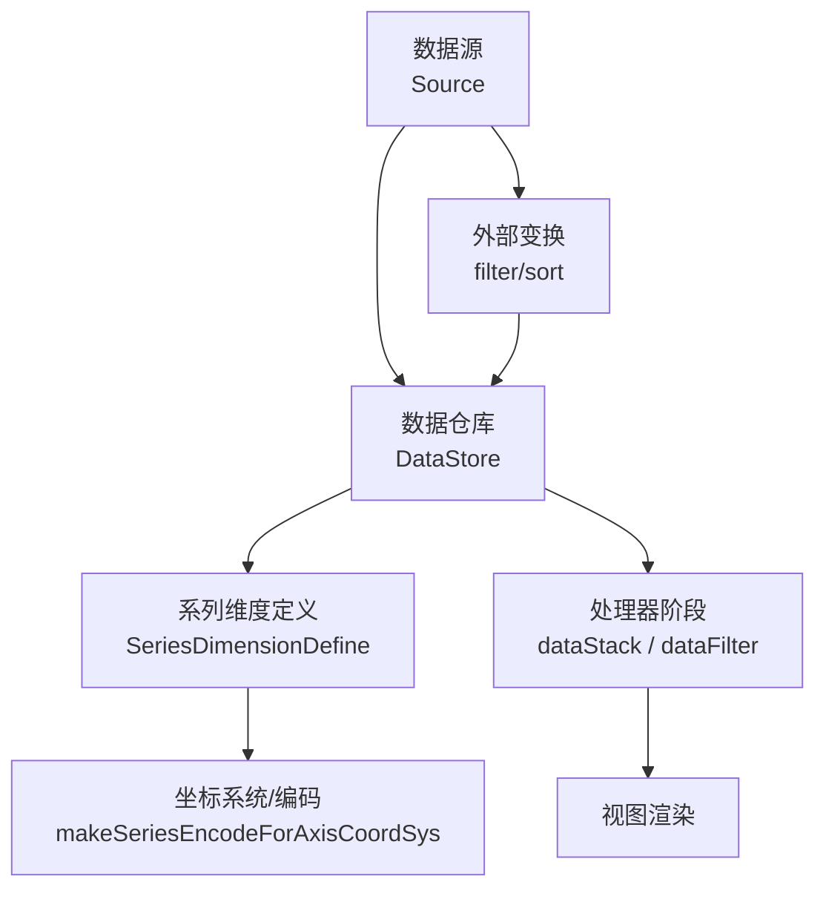
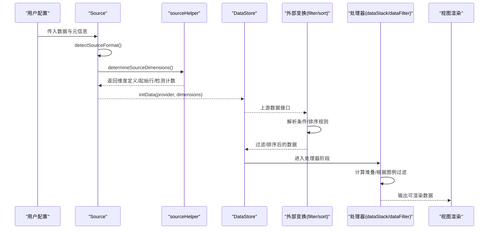
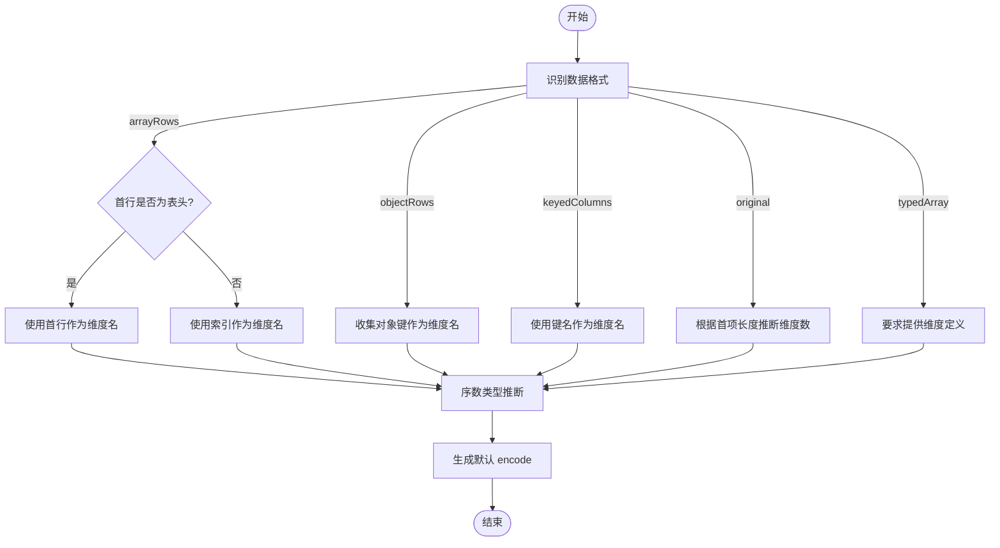
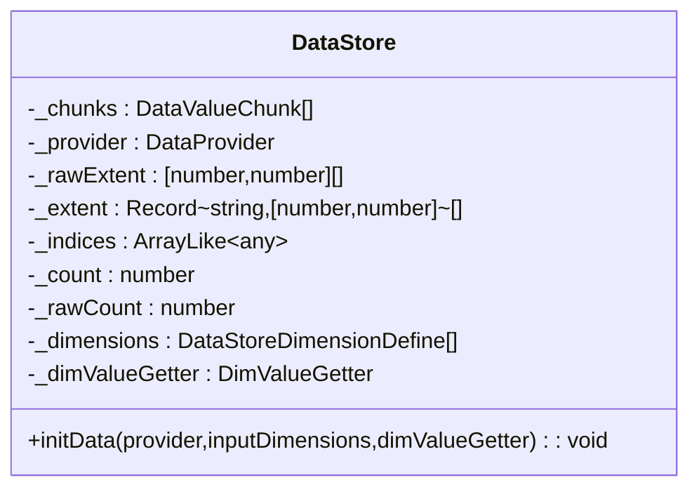
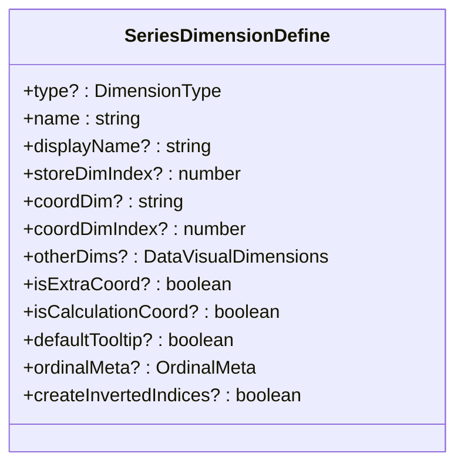
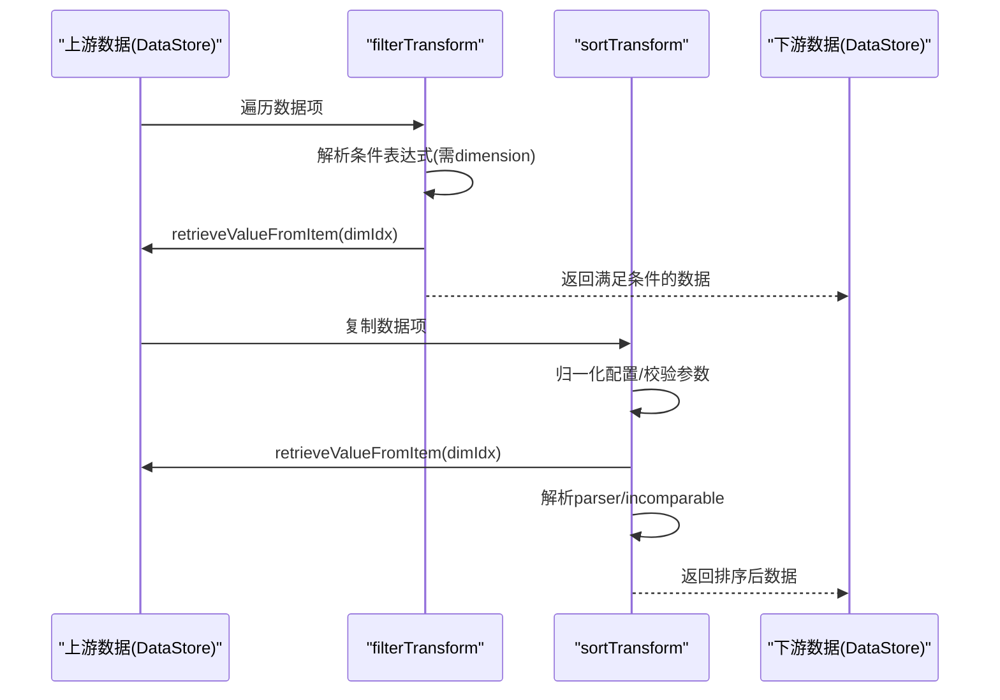
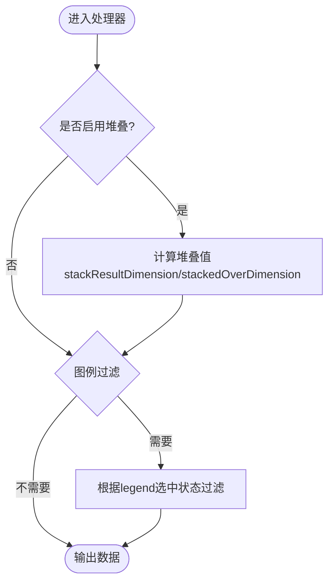
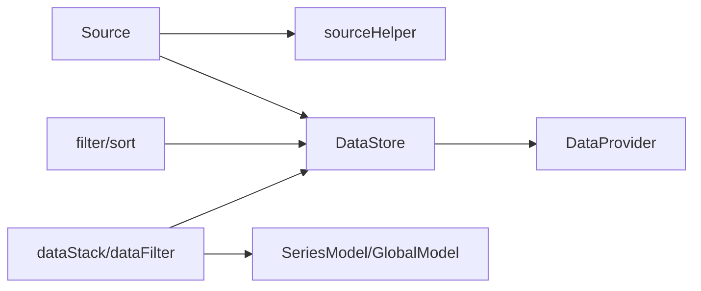

# 维度变换

<cite>
**本文引用的文件**
- [src/component/transform.ts](file://src/component/transform.ts)
- [src/component/transform/install.ts](file://src/component/transform/install.ts)
- [src/component/transform/filterTransform.ts](file://src/component/transform/filterTransform.ts)
- [src/component/transform/sortTransform.ts](file://src/component/transform/sortTransform.ts)
- [src/data/Source.ts](file://src/data/Source.ts)
- [src/data/helper/sourceHelper.ts](file://src/data/helper/sourceHelper.ts)
- [src/data/SeriesDimensionDefine.ts](file://src/data/SeriesDimensionDefine.ts)
- [src/data/DataStore.ts](file://src/data/DataStore.ts)
- [src/processor/dataStack.ts](file://src/processor/dataStack.ts)
- [src/processor/dataFilter.ts](file://src/processor/dataFilter.ts)
</cite>

## 目录
1. [简介](#简介)
2. [项目结构](#项目结构)
3. [核心组件](#核心组件)
4. [架构总览](#架构总览)
5. [详细组件分析](#详细组件分析)
6. [依赖分析](#依赖分析)
7. [性能考虑](#性能考虑)
8. [故障排查指南](#故障排查指南)
9. [结论](#结论)
10. [附录](#附录)

## 简介
本文件系统性阐述 ECharts 的“维度变换”技术，覆盖以下关键主题：
- 维度映射机制：原始数据字段到图表维度的映射、数据类型推断与转换、自定义映射函数。
- 数据重塑技术：二维数组转一维、对象数组扁平化、嵌套数据结构展开。
- 实际应用场景：表格数据转图表格式、API 响应适配、多维数据可视化准备。
- 最佳实践：性能优化策略、错误处理与兼容性考虑。

ECharts 通过 Source、DataStore、SeriesDimensionDefine 以及 transform（filter/sort）等模块，将用户提供的多样化数据源统一为可计算的维度化数据，并在渲染前完成必要的排序、过滤、堆叠等预处理。

## 项目结构
围绕维度变换的核心代码主要分布在以下目录：
- src/data：数据源抽象与存储（Source、DataStore、SeriesDimensionDefine）。
- src/component/transform：外部数据变换（filter、sort），用于在数据集管道中执行条件过滤与排序。
- src/processor：数据处理阶段（如堆叠 dataStack、图例联动过滤 dataFilter）。
- src/data/helper/sourceHelper：默认 encode 推导、序数类型推断、维度收集等。

**图示来源**
- [src/data/Source.ts:197-224](file://src/data/Source.ts#L197-L224)
- [src/data/DataStore.ts:192-200](file://src/data/DataStore.ts#L192-L200)
- [src/data/helper/sourceHelper.ts:99-185](file://src/data/helper/sourceHelper.ts#L99-L185)
- [src/component/transform/filterTransform.ts:34-97](file://src/component/transform/filterTransform.ts#L34-L97)
- [src/component/transform/sortTransform.ts:77-207](file://src/component/transform/sortTransform.ts#L77-L207)
- [src/processor/dataStack.ts:47-103](file://src/processor/dataStack.ts#L47-L103)
- [src/processor/dataFilter.ts:22-45](file://src/processor/dataFilter.ts#L22-L45)

**章节来源**
- [src/component/transform.ts:20-23](file://src/component/transform.ts#L20-L23)
- [src/component/transform/install.ts:20-27](file://src/component/transform/install.ts#L20-L27)

## 核心组件
- 数据源抽象 Source：负责识别输入数据格式（行/列/对象/原始/TypedArray）、推断维度定义、确定起始行、检测维度数量。
- 数据仓库 DataStore：按维度组织数值、维护索引、计算范围、提供值获取器。
- 系列维度定义 SeriesDimensionDefine：描述每个维度的名称、类型、显示名、与坐标轴维度的映射关系、是否额外维度、是否计算维度等。
- 外部变换 filter/sort：在数据集管道中对数据进行条件过滤和排序，支持解析表达式、维度查找、值解析器。
- 处理器 dataStack/dataFilter：在渲染前进行堆叠计算与基于图例的过滤。

**章节来源**
- [src/data/Source.ts:94-187](file://src/data/Source.ts#L94-L187)
- [src/data/DataStore.ts:162-200](file://src/data/DataStore.ts#L162-L200)
- [src/data/SeriesDimensionDefine.ts:24-152](file://src/data/SeriesDimensionDefine.ts#L24-L152)
- [src/component/transform/filterTransform.ts:34-97](file://src/component/transform/filterTransform.ts#L34-L97)
- [src/component/transform/sortTransform.ts:77-207](file://src/component/transform/sortTransform.ts#L77-L207)
- [src/processor/dataStack.ts:47-103](file://src/processor/dataStack.ts#L47-L103)
- [src/processor/dataFilter.ts:22-45](file://src/processor/dataFilter.ts#L22-L45)

## 架构总览
下图展示了从原始数据到最终渲染的维度变换流程，包括数据源识别、维度推断、默认编码生成、外部变换（过滤/排序）、处理器阶段（堆叠/过滤）等。

**图示来源**
- [src/data/Source.ts:256-294](file://src/data/Source.ts#L256-L294)
- [src/data/Source.ts:300-401](file://src/data/Source.ts#L300-L401)
- [src/data/helper/sourceHelper.ts:99-185](file://src/data/helper/sourceHelper.ts#L99-L185)
- [src/data/DataStore.ts:192-200](file://src/data/DataStore.ts#L192-L200)
- [src/component/transform/filterTransform.ts:34-97](file://src/component/transform/filterTransform.ts#L34-L97)
- [src/component/transform/sortTransform.ts:77-207](file://src/component/transform/sortTransform.ts#L77-L207)
- [src/processor/dataStack.ts:47-103](file://src/processor/dataStack.ts#L47-L103)
- [src/processor/dataFilter.ts:22-45](file://src/processor/dataFilter.ts#L22-L45)

## 详细组件分析

### 数据源与维度推断（Source + sourceHelper）
- 数据格式识别：支持 original、arrayRows、objectRows、keyedColumns、typedArray、unknown。
- 维度定义推断：
  - 行式数据：自动检测首行是否为表头；若未显式指定 dimensions，则从首行或列名提取维度名。
  - 对象数组：收集所有键作为维度名。
  - 键控列：以键名为维度名。
  - 原始数据：根据首项长度推断维度数。
  - TypedArray：必须提供维度定义。
- 序数类型推断：对字符串/数字样式的值进行采样判断，决定是否为 ordinal。
- 默认编码生成：根据坐标轴维度与数据布局（行/列）自动生成 encode，使 x/y/itemName/seriesName 等与数据维度对齐。

**图示来源**
- [src/data/Source.ts:256-294](file://src/data/Source.ts#L256-L294)
- [src/data/Source.ts:300-401](file://src/data/Source.ts#L300-L401)
- [src/data/helper/sourceHelper.ts:341-463](file://src/data/helper/sourceHelper.ts#L341-L463)
- [src/data/helper/sourceHelper.ts:99-185](file://src/data/helper/sourceHelper.ts#L99-L185)

**章节来源**
- [src/data/Source.ts:256-294](file://src/data/Source.ts#L256-L294)
- [src/data/Source.ts:300-401](file://src/data/Source.ts#L300-L401)
- [src/data/helper/sourceHelper.ts:341-463](file://src/data/helper/sourceHelper.ts#L341-L463)
- [src/data/helper/sourceHelper.ts:99-185](file://src/data/helper/sourceHelper.ts#L99-L185)

### 数据仓库与维度存储（DataStore）
- 按维度分块存储：不同维度类型使用合适的构造器（float/int/ordinal/number/time）。
- 索引与范围：维护过滤后的索引集合与维度范围，便于高效查询与缩放。
- 值获取器：根据数据格式选择默认 getter，支持按属性名或索引取值。
- 不可变 API：对外保持不可变风格，内部通过 chunks/provider 管理数据。

**图示来源**
- [src/data/DataStore.ts:162-200](file://src/data/DataStore.ts#L162-L200)

**章节来源**
- [src/data/DataStore.ts:47-61](file://src/data/DataStore.ts#L47-L61)
- [src/data/DataStore.ts:119-157](file://src/data/DataStore.ts#L119-L157)
- [src/data/DataStore.ts:162-200](file://src/data/DataStore.ts#L162-L200)

### 系列维度定义（SeriesDimensionDefine）
- 字段说明：type、name、displayName、storeDimIndex、coordDim、coordDimIndex、otherDims、isExtraCoord、isCalculationCoord、ordinalMeta、createInvertedIndices 等。
- 作用：将数据维度与坐标轴维度、视觉维度（tooltip/label/itemName/seriesName）建立映射，支撑后续渲染与交互。

**图示来源**
- [src/data/SeriesDimensionDefine.ts:24-152](file://src/data/SeriesDimensionDefine.ts#L24-L152)

**章节来源**
- [src/data/SeriesDimensionDefine.ts:24-152](file://src/data/SeriesDimensionDefine.ts#L24-L152)

### 外部数据变换：过滤与排序（filter/sort）
- 过滤（filterTransform）：
  - 支持条件表达式，需指定 dimension。
  - 通过 upstream.getDimensionInfo 查找维度信息，retrieveValueFromItem 获取值并评估条件。
  - 失败快速原则：若无条件或维度不存在，返回空结果或报错提示。
- 排序（sortTransform）：
  - 支持单个或多个排序维度，order 为 asc/desc。
  - 支持 parser 解析原始值，incomparable 处理不可比较值的策略（min/max）。
  - 仅支持 arrayRows/objectRows 上游格式。
  - 通过 SortOrderComparator 比较值，稳定排序。

**图示来源**
- [src/component/transform/filterTransform.ts:34-97](file://src/component/transform/filterTransform.ts#L34-L97)
- [src/component/transform/sortTransform.ts:77-207](file://src/component/transform/sortTransform.ts#L77-L207)

**章节来源**
- [src/component/transform/filterTransform.ts:34-97](file://src/component/transform/filterTransform.ts#L34-L97)
- [src/component/transform/sortTransform.ts:77-207](file://src/component/transform/sortTransform.ts#L77-L207)

### 处理器阶段：堆叠与图例过滤（dataStack/dataFilter）
- 堆叠（dataStack）：
  - 按 stack 分组，计算 stackedResultDimension 与 stackedOverDimension。
  - 支持按索引或维度值匹配前一项，考虑正负堆叠策略（all/positive/negative/samesign）。
  - 通过 modify 写入计算结果，避免修改原始数据。
- 图例过滤（dataFilter）：
  - 根据 legend 选中状态过滤 series 数据项。
  - 在 reset 阶段调用 filterSelf，仅保留被选中的系列。

**图示来源**
- [src/processor/dataStack.ts:47-103](file://src/processor/dataStack.ts#L47-L103)
- [src/processor/dataStack.ts:105-176](file://src/processor/dataStack.ts#L105-L176)
- [src/processor/dataFilter.ts:22-45](file://src/processor/dataFilter.ts#L22-L45)

**章节来源**
- [src/processor/dataStack.ts:47-103](file://src/processor/dataStack.ts#L47-L103)
- [src/processor/dataStack.ts:105-176](file://src/processor/dataStack.ts#L105-L176)
- [src/processor/dataFilter.ts:22-45](file://src/processor/dataFilter.ts#L22-L45)

## 依赖分析
- Source 依赖 sourceHelper 进行维度推断与默认编码生成。
- DataStore 依赖 DataProvider 与值解析器，提供维度值访问与范围计算。
- 外部变换（filter/sort）依赖 upstream 的数据接口与维度信息，确保维度存在且可取值。
- 处理器（dataStack/dataFilter）依赖 SeriesModel 与 GlobalModel，协调多系列与全局状态。

**图示来源**
- [src/data/Source.ts:197-224](file://src/data/Source.ts#L197-L224)
- [src/data/helper/sourceHelper.ts:99-185](file://src/data/helper/sourceHelper.ts#L99-L185)
- [src/data/DataStore.ts:192-200](file://src/data/DataStore.ts#L192-L200)
- [src/component/transform/filterTransform.ts:34-97](file://src/component/transform/filterTransform.ts#L34-L97)
- [src/component/transform/sortTransform.ts:77-207](file://src/component/transform/sortTransform.ts#L77-L207)
- [src/processor/dataStack.ts:47-103](file://src/processor/dataStack.ts#L47-L103)
- [src/processor/dataFilter.ts:22-45](file://src/processor/dataFilter.ts#L22-L45)

**章节来源**
- [src/data/Source.ts:197-224](file://src/data/Source.ts#L197-L224)
- [src/data/helper/sourceHelper.ts:99-185](file://src/data/helper/sourceHelper.ts#L99-L185)
- [src/data/DataStore.ts:192-200](file://src/data/DataStore.ts#L192-L200)
- [src/component/transform/filterTransform.ts:34-97](file://src/component/transform/filterTransform.ts#L34-L97)
- [src/component/transform/sortTransform.ts:77-207](file://src/component/transform/sortTransform.ts#L77-L207)
- [src/processor/dataStack.ts:47-103](file://src/processor/dataStack.ts#L47-L103)
- [src/processor/dataFilter.ts:22-45](file://src/processor/dataFilter.ts#L22-L45)

## 性能考虑
- 维度推断采样限制：序数推断与表头检测采用有限采样（如最多 5 条或 10 次循环），避免大数据集上的全量扫描。
- 类型化数组优化：DataStore 对 float/int/time 等维度使用 TypedArray，减少内存占用与提升计算速度。
- 外部变换的失败快速：filter 在无配置或维度缺失时返回空结果，避免误用导致的全量数据泄露。
- 排序仅支持行式数据：sortTransform 限定 arrayRows/objectRows，简化实现并提高稳定性。
- 堆叠计算避免重复查找：利用 inverted indices 与 rawIndexOf 加速匹配前一项。

[本节为通用性能建议，不直接分析具体文件]

## 故障排查指南
- 过滤条件缺少 dimension：filterTransform 会抛出错误并提示现有维度列表，检查配置是否正确。
- 排序维度不存在：sortTransform 会报错并列出可用维度，确认维度名或索引正确。
- 排序不支持的数据格式：当上游非 arrayRows/objectRows 时会报错，需调整数据格式或前置转换。
- 堆叠维度缺失：若 stackedDimension 或 stackedByDimension 未设置，堆叠不会生效，检查数据维度与模型配置。
- 图例过滤无效：确认 legend 组件已注册且选中状态正确，reset 阶段会依据 legend 过滤数据。

**章节来源**
- [src/component/transform/filterTransform.ts:52-83](file://src/component/transform/filterTransform.ts#L52-L83)
- [src/component/transform/sortTransform.ts:104-178](file://src/component/transform/sortTransform.ts#L104-L178)
- [src/processor/dataStack.ts:68-76](file://src/processor/dataStack.ts#L68-L76)
- [src/processor/dataFilter.ts:26-43](file://src/processor/dataFilter.ts#L26-L43)

## 结论
ECharts 的维度变换体系通过 Source 的数据格式识别与维度推断、DataStore 的维度化存储、SeriesDimensionDefine 的维度映射、以及 transform 与 processor 阶段的过滤/排序/堆叠，实现了从多样数据源到可渲染数据的完整流水线。借助默认编码生成与序数推断，用户只需少量配置即可将表格、对象数组、键控列等数据转换为图表所需格式。在生产环境中，应关注性能优化（采样、类型化数组、失败快速）与错误处理（维度缺失、格式不支持），以确保稳定高效的可视化体验。

[本节为总结性内容，不直接分析具体文件]

## 附录
- 典型应用场景
  - 表格数据转图表格式：使用 arrayRows 或 objectRows，配合 dimensions 与 encode 自动生成。
  - API 响应适配：keyedColumns 可直接以键名为维度名；必要时通过 sort/filter 调整顺序与子集。
  - 多维数据可视化准备：通过 makeSeriesEncodeForAxisCoordSys 自动生成 x/y 映射，结合堆叠与过滤展示复杂关系。
- 最佳实践
  - 明确指定 dimensions 与 type，减少推断成本与歧义。
  - 在大样本上使用 sort/filter 前，先进行必要的数据清洗与格式化。
  - 合理设置 stackStrategy 与 incomparable，保证堆叠逻辑符合业务预期。

[本节为概念性内容，不直接分析具体文件]