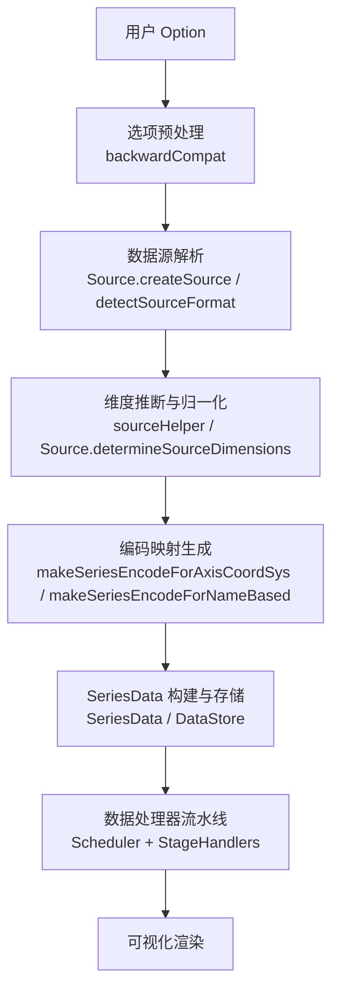
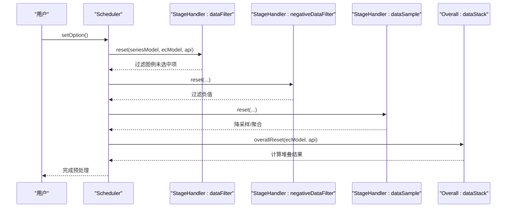
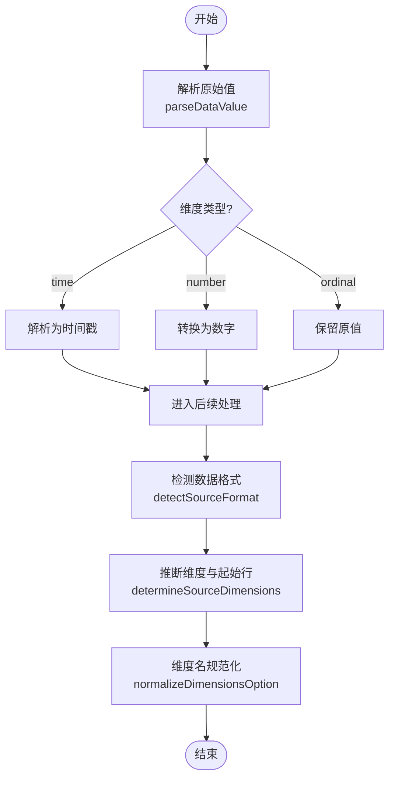
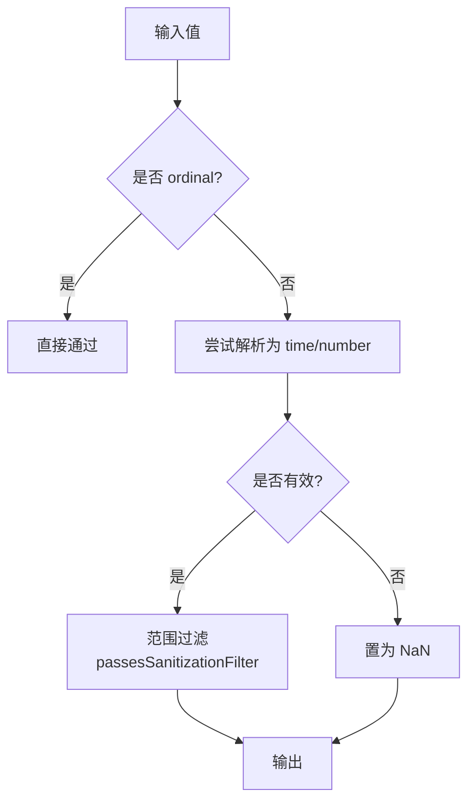
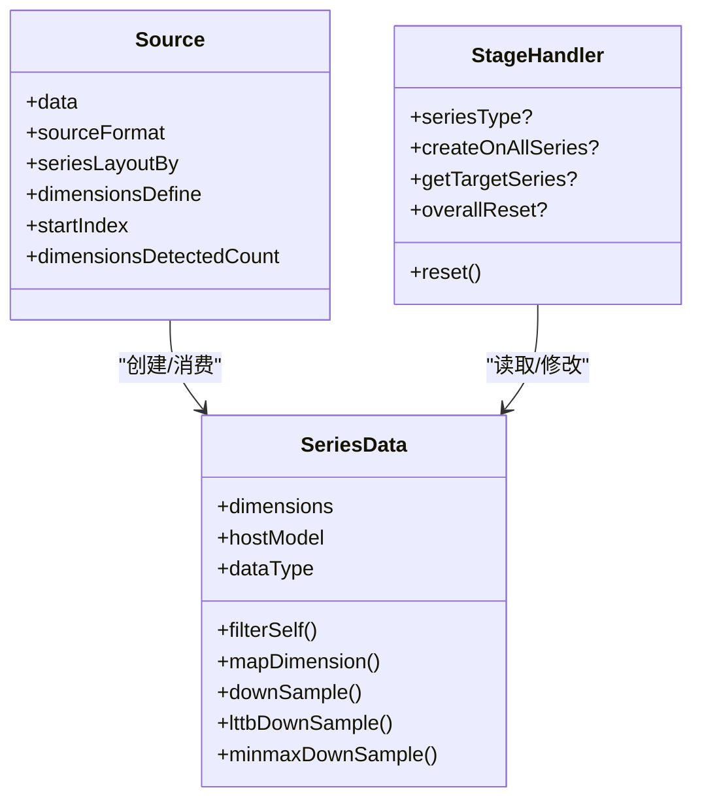
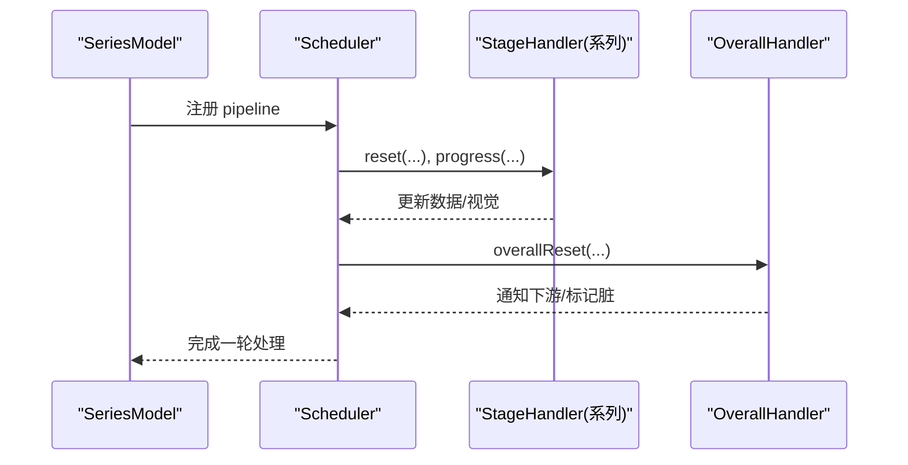
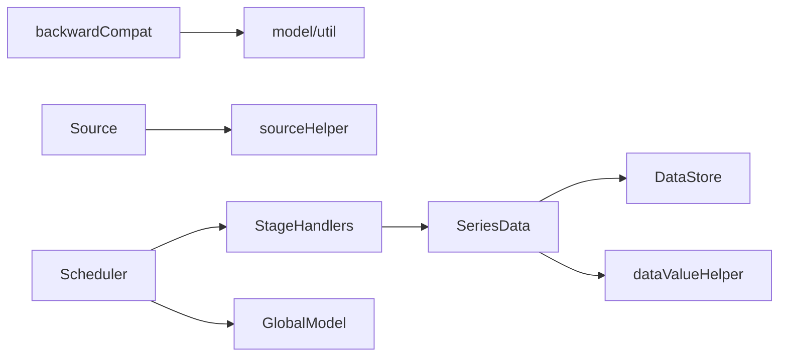

# 数据预处理

<cite>
**本文引用的文件**
- [src/processor/dataFilter.ts](file://src/processor/dataFilter.ts)
- [src/processor/dataSample.ts](file://src/processor/dataSample.ts)
- [src/processor/dataStack.ts](file://src/processor/dataStack.ts)
- [src/processor/negativeDataFilter.ts](file://src/processor/negativeDataFilter.ts)
- [src/preprocessor/backwardCompat.ts](file://src/preprocessor/backwardCompat.ts)
- [src/data/Source.ts](file://src/data/Source.ts)
- [src/data/SeriesData.ts](file://src/data/SeriesData.ts)
- [src/data/helper/sourceHelper.ts](file://src/data/helper/sourceHelper.ts)
- [src/data/helper/dataValueHelper.ts](file://src/data/helper/dataValueHelper.ts)
- [src/core/Scheduler.ts](file://src/core/Scheduler.ts)
- [src/util/types.ts](file://src/util/types.ts)
</cite>

## 目录
1. [简介](#简介)
2. [项目结构](#项目结构)
3. [核心组件](#核心组件)
4. [架构总览](#架构总览)
5. [详细组件分析](#详细组件分析)
6. [依赖关系分析](#依赖关系分析)
7. [性能考量](#性能考量)
8. [故障排查指南](#故障排查指南)
9. [结论](#结论)
10. [附录](#附录)

## 简介
本文件系统性阐述 ECharts 在数据进入渲染前的“数据预处理”机制，覆盖：
- 数据清洗：空值处理、类型转换、格式标准化与重复数据处理
- 数据验证：类型检查、范围校验与业务规则过滤
- 数据转换：维度推断、编码映射与数据结构重组（含 transform 管道）
- 预处理器架构：插件化 StageHandler、处理管道与执行顺序
- 配置示例：数据过滤、格式转换、异常值处理的实践方式
- 性能优化：批量处理与内存管理策略

## 项目结构
ECharts 的数据预处理由“选项预处理”和“运行时数据处理器”两部分组成：
- 选项预处理：对用户 option 进行兼容性与规范化（如 backwardCompat）
- 运行时数据处理器：以 StageHandler 形式注册到调度器 Scheduler，按系列或全局任务执行，形成流水线

图表来源
- [src/preprocessor/backwardCompat.ts:144-273](file://src/preprocessor/backwardCompat.ts#L144-L273)
- [src/data/Source.ts:197-224](file://src/data/Source.ts#L197-L224)
- [src/data/Source.ts:256-401](file://src/data/Source.ts#L256-L401)
- [src/data/helper/sourceHelper.ts:99-185](file://src/data/helper/sourceHelper.ts#L99-L185)
- [src/data/helper/sourceHelper.ts:192-284](file://src/data/helper/sourceHelper.ts#L192-L284)
- [src/data/SeriesData.ts:152-200](file://src/data/SeriesData.ts#L152-L200)
- [src/core/Scheduler.ts:114-200](file://src/core/Scheduler.ts#L114-L200)

章节来源
- [src/preprocessor/backwardCompat.ts:144-273](file://src/preprocessor/backwardCompat.ts#L144-L273)
- [src/data/Source.ts:197-401](file://src/data/Source.ts#L197-L401)
- [src/data/helper/sourceHelper.ts:99-284](file://src/data/helper/sourceHelper.ts#L99-L284)
- [src/data/SeriesData.ts:152-200](file://src/data/SeriesData.ts#L152-L200)
- [src/core/Scheduler.ts:114-200](file://src/core/Scheduler.ts#L114-L200)

## 核心组件
- 选项预处理：统一兼容旧版配置，确保后续流程稳定
- 数据源与维度：自动识别数据格式、推断维度名称与类型、标准化维度定义
- 编码映射：根据坐标系与数据集自动生成 encode，将数据列映射到 x/y 等维度
- SeriesData：高性能数据容器，提供过滤、采样、堆叠等能力
- 数据处理器：以 StageHandler 形式实现过滤、采样、堆叠、负值过滤等
- 调度器：编排任务管线，支持整体任务与系列任务，控制执行顺序与脏标记

章节来源
- [src/preprocessor/backwardCompat.ts:144-273](file://src/preprocessor/backwardCompat.ts#L144-L273)
- [src/data/Source.ts:197-401](file://src/data/Source.ts#L197-L401)
- [src/data/helper/sourceHelper.ts:99-284](file://src/data/helper/sourceHelper.ts#L99-L284)
- [src/data/SeriesData.ts:152-200](file://src/data/SeriesData.ts#L152-L200)
- [src/core/Scheduler.ts:114-200](file://src/core/Scheduler.ts#L114-L200)

## 架构总览
ECharts 的预处理采用“插件化 + 流水线”的架构：
- 插件化：每个处理器实现 StageHandler 接口，可指定 seriesType 或 createOnAllSeries，支持 getTargetSeries 精确作用域
- 流水线：Scheduler 为每个系列维护 Pipeline，串联多个 StageHandler；同时支持 OverallTask 跨系列协作
- 执行顺序：通过管道索引与 blockIndex 控制渐进式渲染与阻塞点

图表来源
- [src/processor/dataFilter.ts:22-45](file://src/processor/dataFilter.ts#L22-L45)
- [src/processor/negativeDataFilter.ts:23-39](file://src/processor/negativeDataFilter.ts#L23-L39)
- [src/processor/dataSample.ts:75-122](file://src/processor/dataSample.ts#L75-L122)
- [src/processor/dataStack.ts:47-103](file://src/processor/dataStack.ts#L47-L103)
- [src/core/Scheduler.ts:410-552](file://src/core/Scheduler.ts#L410-L552)

## 详细组件分析

### 数据清洗流程
- 空值处理
  - 数值型维度默认将 null/undefined/空串/'-' 解析为 NaN，时间维度优先使用时间戳
  - 排序与比较时，非数值视为不可比较，置于最小或最大端
- 数据类型转换
  - 支持 number/time/trim 三类原始值解析器
  - ordinal 类型保持原值，time 类型尝试解析日期并转为时间戳
- 格式标准化
  - Source 自动检测数据格式（数组行/对象行/键列/原始/TypedArray），并确定起始行与维度定义
  - 维度名去重与 displayName 规范化，保证后续编码稳定
- 重复数据处理
  - 维度名重复时自动追加序号后缀，避免冲突
  - 对象行/键列模式下收集唯一维度名

图表来源
- [src/data/helper/dataValueHelper.ts:36-73](file://src/data/helper/dataValueHelper.ts#L36-L73)
- [src/data/helper/dataValueHelper.ts:80-98](file://src/data/helper/dataValueHelper.ts#L80-L98)
- [src/data/Source.ts:256-401](file://src/data/Source.ts#L256-L401)
- [src/data/Source.ts:426-469](file://src/data/Source.ts#L426-L469)

章节来源
- [src/data/helper/dataValueHelper.ts:36-98](file://src/data/helper/dataValueHelper.ts#L36-L98)
- [src/data/Source.ts:256-469](file://src/data/Source.ts#L256-L469)

### 数据验证规则
- 类型检查
  - ordinal 不强制转数；time 需可解析；其他默认转数，失败为 NaN
- 范围验证
  - 提供 sanitization filter（g/ge/l/le）用于快速范围过滤
  - 排序比较遵循“数值优先、字符串次之、其他不可比较”的规则
- 业务规则校验
  - 过滤器比较器支持 lt/lte/gt/gte/eq/ne，内部做类型兼容与数值化比较
  - 自定义过滤可在 StageHandler 中基于 SeriesData 的 filterSelf/mapDimension 实现

图表来源
- [src/data/helper/dataValueHelper.ts:36-73](file://src/data/helper/dataValueHelper.ts#L36-L73)
- [src/data/helper/dataValueHelper.ts:260-269](file://src/data/helper/dataValueHelper.ts#L260-L269)
- [src/data/helper/dataValueHelper.ts:292-332](file://src/data/helper/dataValueHelper.ts#L292-L332)

章节来源
- [src/data/helper/dataValueHelper.ts:260-332](file://src/data/helper/dataValueHelper.ts#L260-L332)

### 数据转换算法
- 维度推断
  - 根据数据前若干行判断是否为序数（BE_ORDINAL.Must/Might/Not）
  - 自动识别首行作为表头（arrayRows 模式）
- 编码映射
  - 坐标轴场景：按“值方式/类别方式”分配维度索引，生成 encode
  - 名称驱动：优先寻找 name 列，自动映射 itemName/seriesName/value
- 数据结构重组
  - transform 管道支持链式变换，每步可返回新 dimensions 定义
  - 外部扩展 transform 通过 ExternalSource 暴露只读视图，限制写入

图表来源
- [src/data/Source.ts:94-185](file://src/data/Source.ts#L94-L185)
- [src/data/SeriesData.ts:152-200](file://src/data/SeriesData.ts#L152-L200)
- [src/util/types.ts:354-415](file://src/util/types.ts#L354-L415)

章节来源
- [src/data/helper/sourceHelper.ts:341-464](file://src/data/helper/sourceHelper.ts#L341-L464)
- [src/data/helper/sourceHelper.ts:99-284](file://src/data/helper/sourceHelper.ts#L99-L284)
- [src/data/helper/transform.ts:39-81](file://src/data/helper/transform.ts#L39-L81)
- [src/data/helper/transform.ts:162-200](file://src/data/helper/transform.ts#L162-L200)

### 预处理器架构
- 插件化设计
  - StageHandler 支持 seriesType 限定作用域，或 createOnAllSeries 作用于所有系列
  - getTargetSeries 可动态选择目标系列集合
- 处理管道
  - Scheduler 为每个系列维护 Pipeline，串联 StageHandler 任务
  - OverallTask 跨系列协作，通过 stub 传递 dirty/output 信号
- 执行顺序
  - 通过 __idxInPipeline 与 blockIndex 控制渐进式渲染与阻塞点
  - 支持 performRawSeries 决定是否对被过滤系列也执行

图表来源
- [src/core/Scheduler.ts:410-552](file://src/core/Scheduler.ts#L410-L552)
- [src/util/types.ts:354-415](file://src/util/types.ts#L354-L415)

章节来源
- [src/core/Scheduler.ts:114-200](file://src/core/Scheduler.ts#L114-L200)
- [src/core/Scheduler.ts:410-552](file://src/core/Scheduler.ts#L410-L552)
- [src/util/types.ts:354-415](file://src/util/types.ts#L354-L415)

### 实际配置示例（代码路径指引）
- 数据过滤
  - 按图例状态过滤：参考 [src/processor/dataFilter.ts:22-45](file://src/processor/dataFilter.ts#L22-L45)
  - 过滤负值：参考 [src/processor/negativeDataFilter.ts:23-39](file://src/processor/negativeDataFilter.ts#L23-L39)
  - 自定义过滤逻辑：在 StageHandler.reset 中使用 data.filterSelf 与 mapDimension
- 格式转换
  - 原始值解析：参考 [src/data/helper/dataValueHelper.ts:36-98](file://src/data/helper/dataValueHelper.ts#L36-L98)
  - 维度推断与编码：参考 [src/data/Source.ts:256-401](file://src/data/Source.ts#L256-L401)、[src/data/helper/sourceHelper.ts:99-284](file://src/data/helper/sourceHelper.ts#L99-L284)
- 异常值处理
  - 范围过滤：参考 [src/data/helper/dataValueHelper.ts:292-332](file://src/data/helper/dataValueHelper.ts#L292-L332)
  - 排序比较规则：参考 [src/data/helper/dataValueHelper.ts:260-269](file://src/data/helper/dataValueHelper.ts#L260-L269)

章节来源
- [src/processor/dataFilter.ts:22-45](file://src/processor/dataFilter.ts#L22-L45)
- [src/processor/negativeDataFilter.ts:23-39](file://src/processor/negativeDataFilter.ts#L23-L39)
- [src/data/helper/dataValueHelper.ts:36-98](file://src/data/helper/dataValueHelper.ts#L36-L98)
- [src/data/helper/dataValueHelper.ts:260-332](file://src/data/helper/dataValueHelper.ts#L260-L332)
- [src/data/Source.ts:256-401](file://src/data/Source.ts#L256-L401)
- [src/data/helper/sourceHelper.ts:99-284](file://src/data/helper/sourceHelper.ts#L99-L284)

## 依赖关系分析
- 模块耦合
  - backwardCompat 依赖 model 工具函数与日志，负责选项兼容
  - Source 依赖 zrender 工具与 sourceHelper，负责数据格式与维度推断
  - SeriesData 依赖 DataStore、helper 与 util，提供高效数据操作
  - 处理器依赖 SeriesData 与 GlobalModel，访问数据与全局信息
  - Scheduler 协调处理器与模型，管理任务与管道
- 外部依赖
  - zrender 工具库（类型判断、哈希表、遍历等）
  - 可选扩展 transform（ExternalDataTransform）

图表来源
- [src/preprocessor/backwardCompat.ts:144-273](file://src/preprocessor/backwardCompat.ts#L144-L273)
- [src/data/Source.ts:197-224](file://src/data/Source.ts#L197-L224)
- [src/data/SeriesData.ts:152-200](file://src/data/SeriesData.ts#L152-L200)
- [src/core/Scheduler.ts:114-200](file://src/core/Scheduler.ts#L114-L200)

章节来源
- [src/preprocessor/backwardCompat.ts:144-273](file://src/preprocessor/backwardCompat.ts#L144-L273)
- [src/data/Source.ts:197-224](file://src/data/Source.ts#L197-L224)
- [src/data/SeriesData.ts:152-200](file://src/data/SeriesData.ts#L152-L200)
- [src/core/Scheduler.ts:114-200](file://src/core/Scheduler.ts#L114-L200)

## 性能考量
- 批量处理
  - 使用 SeriesData 的批量方法（如 downSample、lttbDownSample、minmaxDownSample）减少逐条开销
  - 在 cartesian2d 且数据量较大时启用采样，依据设备像素比与坐标轴范围动态计算采样率
- 内存管理
  - Source 与 SeriesData 尽量复用与浅拷贝，避免不必要深拷贝
  - 维度定义与 encode 缓存，减少重复推断
- 增量与渐进
  - Scheduler 支持渐进式渲染与 blockIndex 控制，避免整批阻塞
  - OverallTask 通过 dirty 机制精准触发重算

章节来源
- [src/processor/dataSample.ts:75-122](file://src/processor/dataSample.ts#L75-L122)
- [src/core/Scheduler.ts:185-200](file://src/core/Scheduler.ts#L185-L200)
- [src/data/Source.ts:241-251](file://src/data/Source.ts#L241-L251)

## 故障排查指南
- 维度推断异常
  - 检查 sourceHeader 与 seriesLayoutBy 设置是否正确
  - 确认 dimensionsDefine 是否被意外覆盖
- 编码映射错误
  - 确认坐标系维度定义与数据列匹配
  - 对于名称驱动场景，确保存在 name 列或显式 encode
- 过滤与排序问题
  - 检查 sanitization filter 的范围配置
  - 注意非数值参与排序时的“不可比较”行为
- 处理器执行顺序
  - 若出现数据未生效，确认 StageHandler 的 seriesType 与 getTargetSeries 是否命中目标系列
  - 检查 OverallTask 的 dirty 传播是否到位

章节来源
- [src/data/Source.ts:256-401](file://src/data/Source.ts#L256-L401)
- [src/data/helper/sourceHelper.ts:99-284](file://src/data/helper/sourceHelper.ts#L99-L284)
- [src/data/helper/dataValueHelper.ts:260-332](file://src/data/helper/dataValueHelper.ts#L260-L332)
- [src/core/Scheduler.ts:410-552](file://src/core/Scheduler.ts#L410-L552)

## 结论
ECharts 的数据预处理以“插件化 + 流水线”为核心，结合强大的数据源解析、维度推断与编码映射能力，提供了灵活而高效的清洗、验证与转换机制。通过 StageHandler 与 Scheduler 的配合，既能满足复杂业务需求，又能保障大规模数据的渲染性能。合理配置过滤、采样与范围校验，可显著提升用户体验与系统稳定性。

## 附录
- 关键入口与类型定义
  - StageHandler 接口：[src/util/types.ts:354-415](file://src/util/types.ts#L354-L415)
  - 调度器核心：[src/core/Scheduler.ts:114-200](file://src/core/Scheduler.ts#L114-L200)
- 常用处理器
  - 数据过滤：[src/processor/dataFilter.ts:22-45](file://src/processor/dataFilter.ts#L22-L45)
  - 负值过滤：[src/processor/negativeDataFilter.ts:23-39](file://src/processor/negativeDataFilter.ts#L23-L39)
  - 数据采样：[src/processor/dataSample.ts:75-122](file://src/processor/dataSample.ts#L75-L122)
  - 堆叠计算：[src/processor/dataStack.ts:47-103](file://src/processor/dataStack.ts#L47-L103)
- 数据源与维度
  - 数据源创建与检测：[src/data/Source.ts:197-224](file://src/data/Source.ts#L197-L224)、[src/data/Source.ts:256-401](file://src/data/Source.ts#L256-L401)
  - 维度推断与编码：[src/data/helper/sourceHelper.ts:99-284](file://src/data/helper/sourceHelper.ts#L99-L284)、[src/data/helper/sourceHelper.ts:341-464](file://src/data/helper/sourceHelper.ts#L341-L464)
- 值解析与过滤
  - 值解析器：[src/data/helper/dataValueHelper.ts:36-98](file://src/data/helper/dataValueHelper.ts#L36-L98)
  - 过滤比较器与范围过滤：[src/data/helper/dataValueHelper.ts:260-332](file://src/data/helper/dataValueHelper.ts#L260-L332)