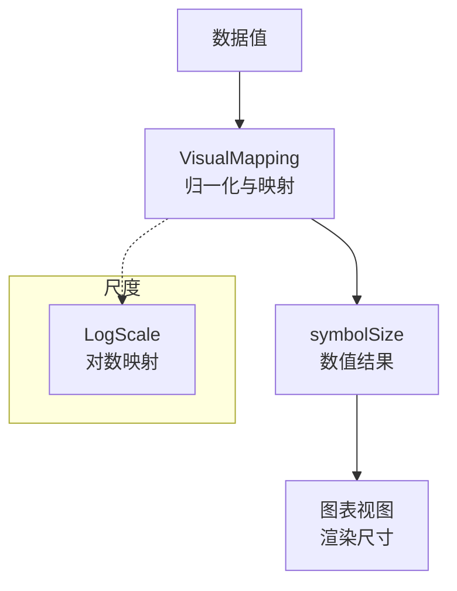
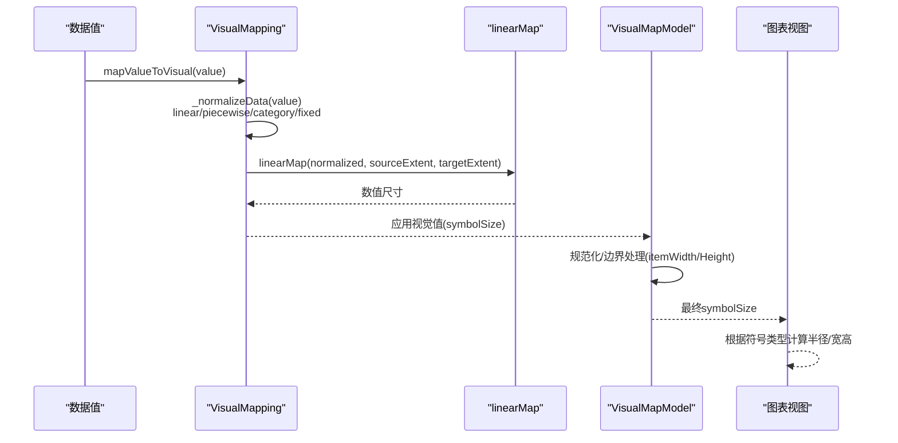
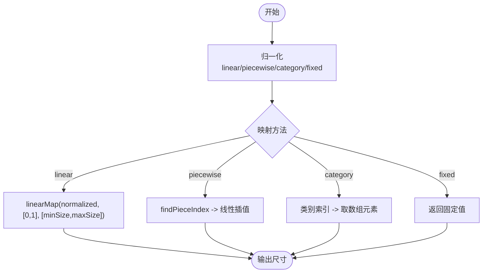
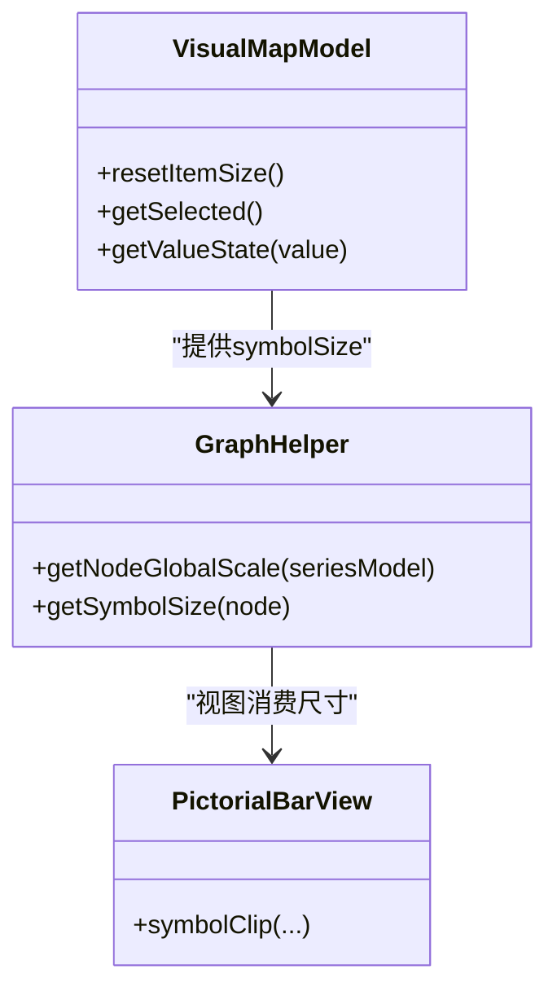
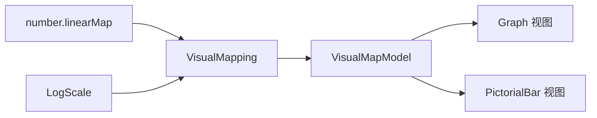

# 大小映射

<cite>
**本文引用的文件**
- [VisualMapping.ts](file://src/visual/VisualMapping.ts)
- [number.ts](file://src/util/number.ts)
- [Log.ts](file://src/scale/Log.ts)
- [VisualMapModel.ts](file://src/component/visualMap/VisualMapModel.ts)
- [ContinuousModel.ts](file://src/component/visualMap/ContinuousModel.ts)
- [graphHelper.ts](file://src/chart/graph/graphHelper.ts)
- [circularLayoutHelper.ts](file://src/chart/graph/circularLayoutHelper.ts)
- [PictorialBarView.ts](file://src/chart/bar/PictorialBarView.ts)
- [symbol.html](file://test/symbol.html)
- [dataZoom-toolbox.html](file://test/dataZoom-toolbox.html)
- [visualMap-continuous.html](file://test/visualMap-continuous.html)
</cite>

## 目录
1. [简介](#简介)
2. [项目结构](#项目结构)
3. [核心组件](#核心组件)
4. [架构总览](#架构总览)
5. [详细组件分析](#详细组件分析)
6. [依赖关系分析](#依赖关系分析)
7. [性能考虑](#性能考虑)
8. [故障排查指南](#故障排查指南)
9. [结论](#结论)
10. [附录：配置与示例速查](#附录配置与示例速查)

## 简介
本文件系统性解析 ECharts 的“大小映射”机制，聚焦数值到尺寸的映射算法、符号大小的计算规则、不同图表类型（散点图、气泡图、关系图）的差异、配置项（如 minSize、maxSize、scale 等）的作用方式，以及大数据量下的性能优化策略。文档以源码为依据，提供可视化流程图与时序图，帮助读者从原理到实践全面掌握。

## 项目结构
ECharts 的大小映射由“视觉映射系统”统一驱动，核心在 visual 层，配合 scale 层与具体图表视图进行尺寸落地。关键路径包括：
- 视觉映射定义与执行：src/visual/VisualMapping.ts
- 数值工具与线性映射：src/util/number.ts
- 对数尺度支持：src/scale/Log.ts
- 视觉映射模型与默认值处理：src/component/visualMap/VisualMapModel.ts、src/component/visualMap/ContinuousModel.ts
- 图表侧的尺寸使用：src/chart/graph/graphHelper.ts、src/chart/bar/PictorialBarView.ts
- 测试用例展示用法：test/*.html

图示来源
- [VisualMapping.ts:157-215](file://src/visual/VisualMapping.ts#L157-L215)
- [number.ts:67-120](file://src/util/number.ts#L67-L120)
- [Log.ts:163-177](file://src/scale/Log.ts#L163-L177)

章节来源
- [VisualMapping.ts:157-215](file://src/visual/VisualMapping.ts#L157-L215)
- [number.ts:67-120](file://src/util/number.ts#L67-L120)
- [Log.ts:163-177](file://src/scale/Log.ts#L163-L177)

## 核心组件
- VisualMapping：负责将原始数据值按映射方法（linear/piecewise/category/fixed）归一化并转换为视觉值；内置 symbolSize 处理器，将归一化后的值映射到像素尺寸范围。
- number.linearMap：提供高性能的线性映射实现，支持区间裁剪与边界精度保护。
- LogScale：为坐标轴提供对数映射能力，影响数据归一化的输入域（当维度使用对数刻度时）。
- VisualMapModel/ContinuousModel：负责视觉映射模型的默认值、范围与可视化控件配置，并对 symbolSize 做最终规范化（如基于 itemWidth/Height 的缩放）。
- 图表视图（Graph、PictorialBar 等）：读取 symbolSize 并用于实际绘制，部分场景会结合全局缩放或布局参数调整最终尺寸。

章节来源
- [VisualMapping.ts:217-335](file://src/visual/VisualMapping.ts#L217-L335)
- [number.ts:67-120](file://src/util/number.ts#L67-L120)
- [Log.ts:163-177](file://src/scale/Log.ts#L163-L177)
- [VisualMapModel.ts:577-615](file://src/component/visualMap/VisualMapModel.ts#L577-L615)
- [ContinuousModel.ts:302-347](file://src/component/visualMap/ContinuousModel.ts#L302-L347)

## 架构总览
下图展示了从数据到最终绘制的完整流程，包括映射方法选择、归一化、数值到尺寸的转换，以及图表视图如何消费 symbolSize。

图示来源
- [VisualMapping.ts:208-215](file://src/visual/VisualMapping.ts#L208-L215)
- [VisualMapping.ts:664-679](file://src/visual/VisualMapping.ts#L664-L679)
- [number.ts:67-120](file://src/util/number.ts#L67-L120)
- [VisualMapModel.ts:603-615](file://src/component/visualMap/VisualMapModel.ts#L603-L615)

## 详细组件分析

### 数值到尺寸的映射算法
- 线性映射：通过 linearMap 将归一化后的值映射到目标尺寸区间，支持 clamp 模式避免越界。
- 分段映射：根据 pieceList 查找对应区间或精确值，再映射到目标尺寸。
- 分类映射：将类别索引映射到视觉数组中的某一项。
- 固定映射：直接返回配置的固定值。

图示来源
- [VisualMapping.ts:711-732](file://src/visual/VisualMapping.ts#L711-L732)
- [VisualMapping.ts:664-679](file://src/visual/VisualMapping.ts#L664-L679)
- [number.ts:67-120](file://src/util/number.ts#L67-L120)

章节来源
- [VisualMapping.ts:711-732](file://src/visual/VisualMapping.ts#L711-L732)
- [VisualMapping.ts:664-679](file://src/visual/VisualMapping.ts#L664-L679)
- [number.ts:67-120](file://src/util/number.ts#L67-L120)

### 符号大小的计算规则
- 基础尺寸：由映射结果决定，通常为像素值或数组形式 [宽, 高]。
- 缩放因子：图表视图可能根据坐标系缩放或布局参数对 symbolSize 进行调整（例如 Graph 的全局节点缩放补偿）。
- 边界值处理：VisualMapModel 会对 symbolSize 做规范化，确保在 itemWidth/itemHeight 范围内；超出范围的值会被裁剪或映射到边界。

图示来源
- [VisualMapModel.ts:603-615](file://src/component/visualMap/VisualMapModel.ts#L603-L615)
- [graphHelper.ts:24-40](file://src/chart/graph/graphHelper.ts#L24-L40)
- [PictorialBarView.ts:362-494](file://src/chart/bar/PictorialBarView.ts#L362-L494)

章节来源
- [VisualMapModel.ts:603-615](file://src/component/visualMap/VisualMapModel.ts#L603-L615)
- [graphHelper.ts:24-40](file://src/chart/graph/graphHelper.ts#L24-L40)
- [PictorialBarView.ts:362-494](file://src/chart/bar/PictorialBarView.ts#L362-L494)

### 不同图表类型的大小映射差异
- 散点图/气泡图：通常直接使用 series.symbolSize 或 visualMap.inRange.outOfRange 的 symbolSize 映射；可配置为函数或数组，支持动态计算。
- 关系图（Graph）：节点尺寸受全局缩放影响，需结合 getNodeGlobalScale 与 getSymbolSize 得到最终显示尺寸；环形布局中还会依据 value 或 symbolSize 分配角度。
- 象形柱图（PictorialBar）：symbolSize 支持百分比与绝对值混合，会根据 boundingLength 和重复次数自动调整边距与尺寸。

章节来源
- [dataZoom-toolbox.html:191-229](file://test/dataZoom-toolbox.html#L191-L229)
- [visualMap-continuous.html:583-619](file://test/visualMap-continuous.html#L583-L619)
- [graphHelper.ts:24-40](file://src/chart/graph/graphHelper.ts#L24-L40)
- [circularLayoutHelper.ts:130-151](file://src/chart/graph/circularLayoutHelper.ts#L130-L151)
- [PictorialBarView.ts:362-494](file://src/chart/bar/PictorialBarView.ts#L362-L494)

### 大小映射的配置选项
- minSize / maxSize：在 symbolSize 的视觉映射中体现为目标区间的两端值；可通过 visualMap.inRange/outOfRange 设置。
- scale：在坐标轴层面，若使用对数刻度（LogScale），会影响数据归一化的输入域，从而间接改变 symbolSize 的分布。
- itemWidth / itemHeight：在 VisualMapModel 中作为 symbolSize 的参考基准，用于规范化与边界控制。
- categories / loop：分类映射时的类别列表与是否循环映射。
- pieceList：分段映射的区间与视觉值定义。

章节来源
- [VisualMapModel.ts:670-704](file://src/component/visualMap/VisualMapModel.ts#L670-L704)
- [Log.ts:163-177](file://src/scale/Log.ts#L163-L177)
- [VisualMapping.ts:100-136](file://src/visual/VisualMapping.ts#L100-L136)

### 实际使用示例（代码片段路径）
- 散点图使用函数式 symbolSize：[symbol.html:54-74](file://test/symbol.html#L54-L74)
- 多系列 scatter 使用函数式 symbolSize：[dataZoom-toolbox.html:191-229](file://test/dataZoom-toolbox.html#L191-L229)
- 连续型 visualMap 配置 symbolSize 区间：[visualMap-continuous.html:205-236](file://test/visualMap-continuous.html#L205-L236)

章节来源
- [symbol.html:54-74](file://test/symbol.html#L54-L74)
- [dataZoom-toolbox.html:191-229](file://test/dataZoom-toolbox.html#L191-L229)
- [visualMap-continuous.html:205-236](file://test/visualMap-continuous.html#L205-L236)

## 依赖关系分析
- VisualMapping 依赖 number.linearMap 完成线性映射，依赖 LogScale 的 normalize/scale 以支持对数刻度下的归一化。
- VisualMapModel 依赖 VisualMapping 提供的 symbolSize 处理器，并在自身逻辑中对 symbolSize 做规范化与边界处理。
- 图表视图（Graph、PictorialBar）依赖 VisualMapModel 输出的 symbolSize，并结合自身布局与缩放逻辑得出最终尺寸。

图示来源
- [number.ts:67-120](file://src/util/number.ts#L67-L120)
- [Log.ts:163-177](file://src/scale/Log.ts#L163-L177)
- [VisualMapping.ts:217-335](file://src/visual/VisualMapping.ts#L217-L335)
- [VisualMapModel.ts:603-615](file://src/component/visualMap/VisualMapModel.ts#L603-L615)

章节来源
- [number.ts:67-120](file://src/util/number.ts#L67-L120)
- [Log.ts:163-177](file://src/scale/Log.ts#L163-L177)
- [VisualMapping.ts:217-335](file://src/visual/VisualMapping.ts#L217-L335)
- [VisualMapModel.ts:603-615](file://src/component/visualMap/VisualMapModel.ts#L603-L615)

## 性能考虑
- 线性映射热点优化：linearMap 内部针对边界情况做了快速分支与精度保护，适合高频调用。
- 大数据量建议：
  - 使用分段映射（piecewise）减少复杂计算，或将 symbolSize 预计算后缓存。
  - 合理设置 dataExtent 与 visual 范围，避免极端值导致尺寸过大或过小。
  - 对数刻度下注意数据分布，必要时对数据进行采样或聚合。
  - 在关系图中利用全局缩放补偿，避免重复计算节点尺寸。
- 视图层优化：象形柱图等重复符号的场景，通过 boundingLength 与 repeatTimes 计算减少冗余绘制。

章节来源
- [number.ts:67-120](file://src/util/number.ts#L67-L120)
- [PictorialBarView.ts:362-494](file://src/chart/bar/PictorialBarView.ts#L362-L494)
- [graphHelper.ts:24-40](file://src/chart/graph/graphHelper.ts#L24-L40)

## 故障排查指南
- 尺寸异常放大/缩小：检查 visualMap 的 inRange/outOfRange 的 symbolSize 区间是否合理；确认 itemWidth/itemHeight 是否正确设置。
- 对数刻度下尺寸分布不均：确认坐标轴是否为对数刻度，必要时调整数据范围或启用 break 配置。
- 分类映射未生效：检查 categories 与 loop 配置，确保类别与视觉数组长度匹配。
- 关系图节点尺寸不正确：查看 getNodeGlobalScale 返回值与 getSymbolSize 的计算逻辑，确认坐标系缩放是否被正确应用。

章节来源
- [VisualMapModel.ts:603-615](file://src/component/visualMap/VisualMapModel.ts#L603-L615)
- [Log.ts:163-177](file://src/scale/Log.ts#L163-L177)
- [graphHelper.ts:24-40](file://src/chart/graph/graphHelper.ts#L24-L40)

## 结论
ECharts 的大小映射以 VisualMapping 为核心，通过统一的归一化与映射方法将数据值转换为可视尺寸；配合 VisualMapModel 的规范化与边界处理，以及各图表视图的具体实现，形成灵活且高性能的符号尺寸体系。通过对数刻度、分段映射与分类映射的支持，能够覆盖多种业务场景；在大体量数据下，借助线性映射优化与视图层策略，可实现稳定高效的渲染表现。

## 附录：配置与示例速查
- 常用配置项
  - symbolSize：数值或数组，表示映射的目标尺寸范围。
  - min/max：数据范围，影响归一化与映射。
  - itemWidth/itemHeight：作为 symbolSize 的参考基准。
  - categories/loop：分类映射的类别与循环行为。
  - pieceList：分段映射的区间与视觉值。
- 示例路径
  - 函数式 symbolSize：[symbol.html:54-74](file://test/symbol.html#L54-L74)、[dataZoom-toolbox.html:191-229](file://test/dataZoom-toolbox.html#L191-L229)
  - 连续型 visualMap 的 symbolSize 区间：[visualMap-continuous.html:205-236](file://test/visualMap-continuous.html#L205-L236)