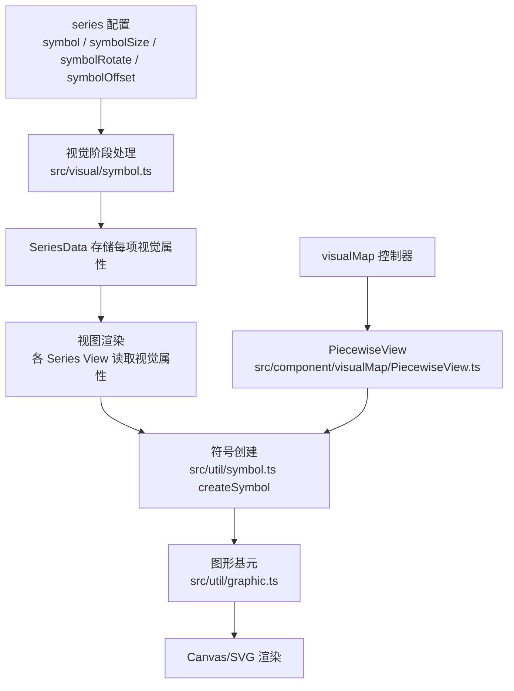
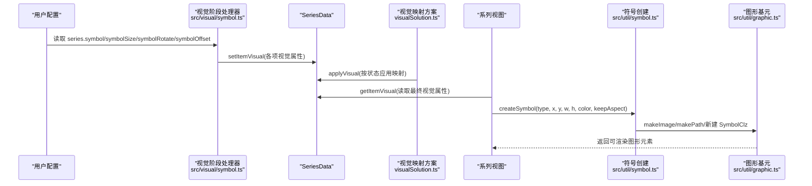
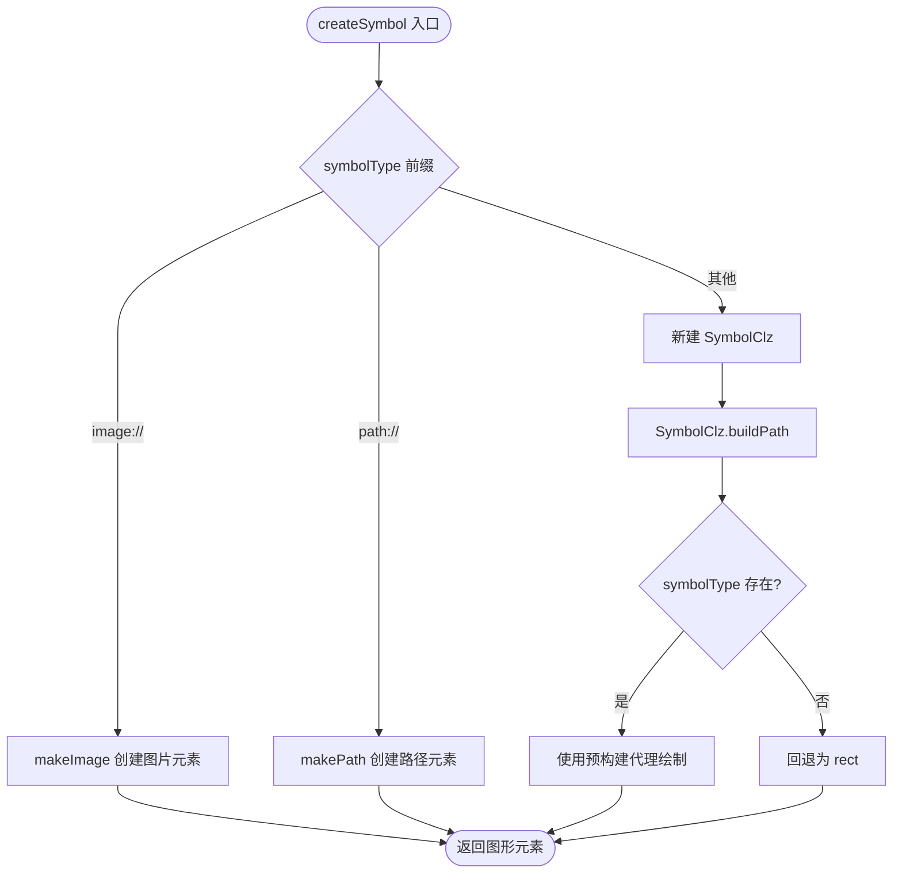
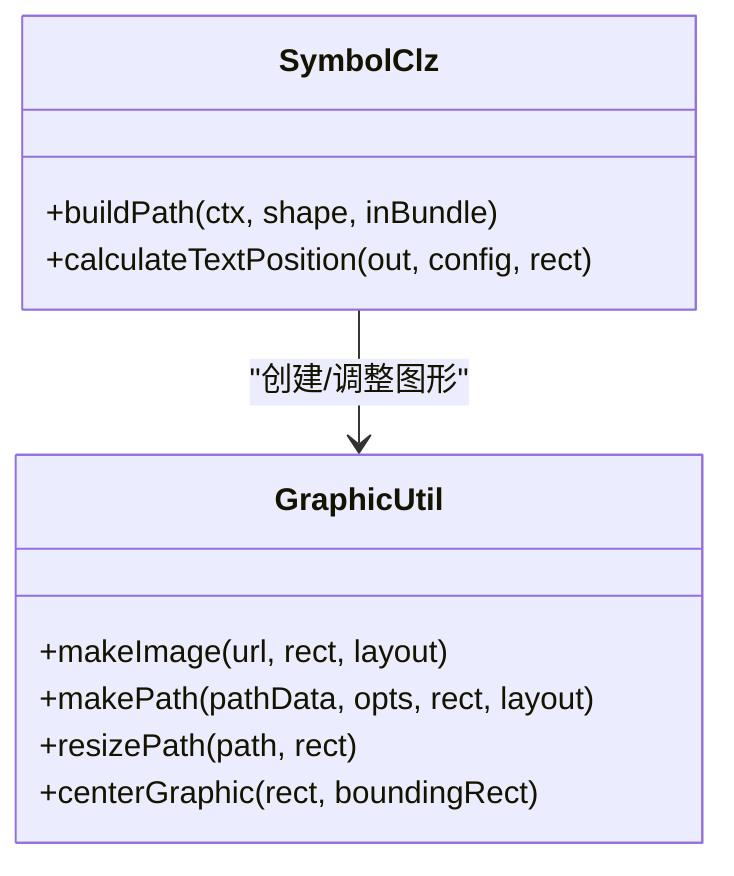
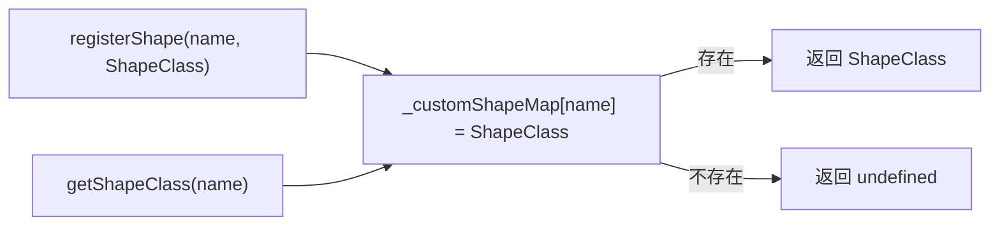
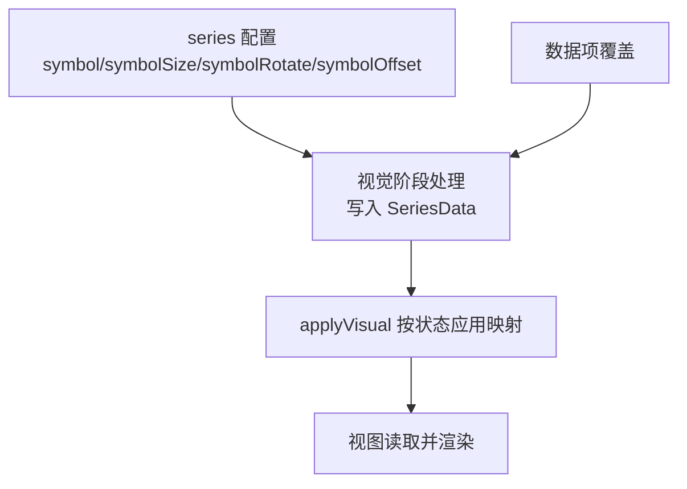
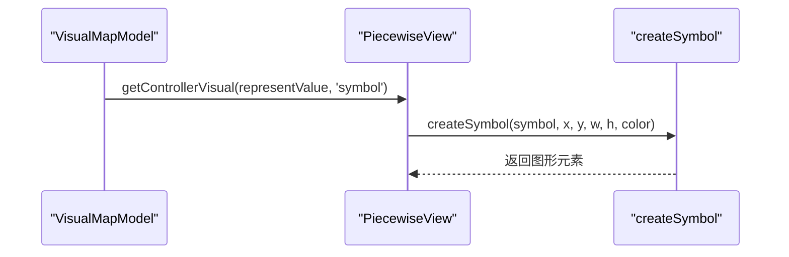
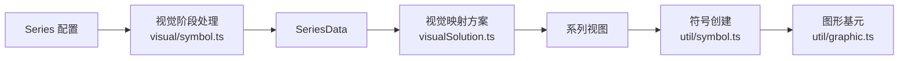

# 形状映射

<cite>
**本文引用的文件**
- [src/util/symbol.ts](file://src/util/symbol.ts)
- [src/visual/symbol.ts](file://src/visual/symbol.ts)
- [src/util/graphic.ts](file://src/util/graphic.ts)
- [src/visual/VisualMapping.ts](file://src/visual/VisualMapping.ts)
- [src/visual/visualSolution.ts](file://src/visual/visualSolution.ts)
- [src/component/visualMap/PiecewiseView.ts](file://src/component/visualMap/PiecewiseView.ts)
- [test/symbol.html](file://test/symbol.html)
</cite>

## 目录
1. [简介](#简介)
2. [项目结构](#项目结构)
3. [核心组件](#核心组件)
4. [架构总览](#架构总览)
5. [详细组件分析](#详细组件分析)
6. [依赖关系分析](#依赖关系分析)
7. [性能考量](#性能考量)
8. [故障排查指南](#故障排查指南)
9. [结论](#结论)
10. [附录：配置示例与扩展开发](#附录配置示例与扩展开发)

## 简介
本文件系统性解析 ECharts 的形状映射系统，覆盖以下主题：
- 内置符号的自动选择与绘制（圆形、方形、三角形、菱形、图钉、箭头等）
- 图标映射技术（图片资源加载、居中/铺满策略、路径字符串渲染）
- 自定义形状绑定（注册与使用）
- 形状映射的配置方式（基于数值、类别或固定值）
- 完整配置示例（通过测试用例引用）
- 扩展开发指南（如何创建并注册自定义形状）

## 项目结构
围绕“形状映射”的关键代码分布在如下模块：
- 图形基元与工厂：负责创建 Path、Image、Path 字符串元素，以及用户自定义形状的注册与获取
- 符号构建器：定义内置符号类型、构造器与形状生成函数，统一封装 createSymbol
- 视觉阶段处理器：将 series 配置中的 symbol/symbolSize/symbolRotate/symbolOffset 等属性编码到数据项上
- 视觉映射方案：提供 applyVisual/incrementalApplyVisual，按状态对数据进行可视化映射
- 可视化控件：在 visualMap 中根据映射结果创建符号用于图例/滑块等展示

**图表来源**
- [src/visual/symbol.ts:39-103](file://src/visual/symbol.ts#L39-L103)
- [src/util/symbol.ts:333-388](file://src/util/symbol.ts#L333-L388)
- [src/util/graphic.ts:184-231](file://src/util/graphic.ts#L184-L231)
- [src/component/visualMap/PiecewiseView.ts:200-212](file://src/component/visualMap/PiecewiseView.ts#L200-L212)

**章节来源**
- [src/visual/symbol.ts:39-103](file://src/visual/symbol.ts#L39-L103)
- [src/util/symbol.ts:333-388](file://src/util/symbol.ts#L333-L388)
- [src/util/graphic.ts:184-231](file://src/util/graphic.ts#L184-L231)
- [src/component/visualMap/PiecewiseView.ts:200-212](file://src/component/visualMap/PiecewiseView.ts#L200-L212)

## 核心组件
- 符号构建器（symbol.ts）
  - 内置符号类型：line、rect、roundRect、square、circle、diamond、pin、arrow、triangle
  - 每个类型对应一个构造器与 shape 生成函数，统一由 SymbolClz 调度绘制
  - createSymbol 支持三种输入：
    - 内置符号名
    - image://URL 图片资源
    - path://SVG 路径字符串
  - 支持空刷样式（empty*）与颜色设置辅助方法
- 视觉阶段处理器（visual/symbol.ts）
  - 将 series 配置的 symbol/symbolSize/symbolRotate/symbolOffset/symbolKeepAspect 等属性写入 SeriesData
  - 支持回调形式逐项计算，也支持单条数据项覆盖
- 图形基元（util/graphic.ts）
  - registerShape/getShapeClass：用户自定义形状注册与获取
  - makePath/makeImage：从路径字符串或 URL 创建图形元素，支持居中/铺满布局
  - resizePath/centerGraphic：尺寸适配与居中算法
- 视觉映射方案（visual/VisualMapping.ts, visualSolution.ts）
  - 提供 applyVisual/incrementalApplyVisual，按状态（active/inactive 等）应用视觉映射
  - 内置 handler 包括 color、opacity、symbolSize 等

**章节来源**
- [src/util/symbol.ts:43-196](file://src/util/symbol.ts#L43-L196)
- [src/util/symbol.ts:272-388](file://src/util/symbol.ts#L272-L388)
- [src/visual/symbol.ts:32-103](file://src/visual/symbol.ts#L32-L103)
- [src/util/graphic.ts:140-175](file://src/util/graphic.ts#L140-L175)
- [src/util/graphic.ts:184-231](file://src/util/graphic.ts#L184-L231)
- [src/visual/VisualMapping.ts:325-379](file://src/visual/VisualMapping.ts#L325-L379)
- [src/visual/visualSolution.ts:61-102](file://src/visual/visualSolution.ts#L61-L102)
- [src/visual/visualSolution.ts:136-190](file://src/visual/visualSolution.ts#L136-L190)

## 架构总览
下图展示了从配置到渲染的完整流程，以及视觉映射在其中的作用。

**图表来源**
- [src/visual/symbol.ts:46-103](file://src/visual/symbol.ts#L46-L103)
- [src/visual/visualSolution.ts:136-190](file://src/visual/visualSolution.ts#L136-L190)
- [src/util/symbol.ts:333-388](file://src/util/symbol.ts#L333-L388)
- [src/util/graphic.ts:184-231](file://src/util/graphic.ts#L184-L231)

## 详细组件分析

### 内置符号与自动选择
- 内置符号集合与构造器映射：line、rect、roundRect、square、circle、diamond、pin、arrow、triangle
- 每种符号都有对应的 shape 生成函数，将统一的 (x,y,w,h) 转换为具体 shape 参数
- SymbolClz.buildPath 根据 symbolType 查找代理对象并调用其 buildPath
- 若未识别的 symbolType，则回退为 rect，保证健壮性

**图表来源**
- [src/util/symbol.ts:333-388](file://src/util/symbol.ts#L333-L388)
- [src/util/symbol.ts:272-308](file://src/util/symbol.ts#L272-L308)
- [src/util/graphic.ts:184-231](file://src/util/graphic.ts#L184-L231)

**章节来源**
- [src/util/symbol.ts:43-196](file://src/util/symbol.ts#L43-L196)
- [src/util/symbol.ts:272-308](file://src/util/symbol.ts#L272-L308)
- [src/util/symbol.ts:333-388](file://src/util/symbol.ts#L333-L388)

### 图标映射技术（图片与路径）
- 图片资源
  - 通过 image://URL 指定，内部使用 makeImage 创建 ZRImage
  - 支持 layout=center（保持宽高比居中）或 cover（铺满）
  - onload 回调中可重新设置居中位置
- 路径字符串
  - 通过 path://SVG 路径字符串，内部使用 makePath 创建 SVGPath
  - 支持 resizePath 与 centerGraphic 进行尺寸适配与居中
- 空刷样式
  - empty* 前缀表示仅描边不填充，setColor 会区分 fill/stroke 逻辑

**图表来源**
- [src/util/symbol.ts:272-308](file://src/util/symbol.ts#L272-L308)
- [src/util/graphic.ts:184-231](file://src/util/graphic.ts#L184-L231)
- [src/util/graphic.ts:240-264](file://src/util/graphic.ts#L240-L264)

**章节来源**
- [src/util/symbol.ts:333-388](file://src/util/symbol.ts#L333-L388)
- [src/util/graphic.ts:184-231](file://src/util/graphic.ts#L184-L231)
- [src/util/graphic.ts:240-264](file://src/util/graphic.ts#L240-L264)

### 自定义形状绑定（注册与使用）
- 注册：通过 registerShape(name, ShapeClass) 将自定义形状类注册到全局映射表
- 获取：getShapeClass(name) 用于外部特性（如 custom series、graphic component）按需取用
- 注意：ECharts 内部不应随意从此处取形状，避免被用户覆盖影响内部行为；但 custom 系列等场景会刻意使用

**图表来源**
- [src/util/graphic.ts:140-175](file://src/util/graphic.ts#L140-L175)

**章节来源**
- [src/util/graphic.ts:140-175](file://src/util/graphic.ts#L140-L175)

### 形状映射的配置方式（数值、类别、固定值）
- 系列级配置
  - symbol：字符串或回调，决定数据点形状
  - symbolSize：数字、数组或回调，控制大小
  - symbolRotate：旋转角度
  - symbolOffset：偏移量（支持百分比）
  - symbolKeepAspect：是否保持宽高比
- 数据项级覆盖
  - 通过 itemModel.getShallow 读取单项配置并写入视觉属性
- 视觉映射
  - VisualMapping 提供 symbolSize 的数值映射能力
  - visualSolution.applyVisual 按状态（active/inactive）批量应用映射

**图表来源**
- [src/visual/symbol.ts:46-103](file://src/visual/symbol.ts#L46-L103)
- [src/visual/symbol.ts:105-140](file://src/visual/symbol.ts#L105-L140)
- [src/visual/visualSolution.ts:136-190](file://src/visual/visualSolution.ts#L136-L190)
- [src/visual/VisualMapping.ts:325-379](file://src/visual/VisualMapping.ts#L325-L379)

**章节来源**
- [src/visual/symbol.ts:32-103](file://src/visual/symbol.ts#L32-L103)
- [src/visual/symbol.ts:105-140](file://src/visual/symbol.ts#L105-L140)
- [src/visual/visualSolution.ts:136-190](file://src/visual/visualSolution.ts#L136-L190)
- [src/visual/VisualMapping.ts:325-379](file://src/visual/VisualMapping.ts#L325-L379)

### 可视化控件中的符号使用
- visualMap 的 PiecewiseView 在绘制图例/分段时，使用 createSymbol 根据控制器视觉结果生成符号
- 支持将 representValue 映射为 symbol/color 等视觉属性

**图表来源**
- [src/component/visualMap/PiecewiseView.ts:200-212](file://src/component/visualMap/PiecewiseView.ts#L200-L212)
- [src/util/symbol.ts:333-388](file://src/util/symbol.ts#L333-L388)

**章节来源**
- [src/component/visualMap/PiecewiseView.ts:200-212](file://src/component/visualMap/PiecewiseView.ts#L200-L212)

## 依赖关系分析
- 低耦合设计
  - 符号构建器与图形基元解耦：createSymbol 只关心输入类型与输出元素
  - 视觉阶段处理器与视图解耦：通过 SeriesData 传递视觉属性
- 关键依赖链
  - series -> visual/symbol.ts -> SeriesData -> visualSolution.ts -> 视图 -> util/symbol.ts -> util/graphic.ts
- 潜在循环风险
  - 当前模块职责清晰，未见直接循环依赖；需注意在扩展 custom 系列时谨慎引入

**图表来源**
- [src/visual/symbol.ts:46-103](file://src/visual/symbol.ts#L46-L103)
- [src/visual/visualSolution.ts:136-190](file://src/visual/visualSolution.ts#L136-L190)
- [src/util/symbol.ts:333-388](file://src/util/symbol.ts#L333-L388)
- [src/util/graphic.ts:184-231](file://src/util/graphic.ts#L184-L231)

**章节来源**
- [src/visual/symbol.ts:46-103](file://src/visual/symbol.ts#L46-L103)
- [src/visual/visualSolution.ts:136-190](file://src/visual/visualSolution.ts#L136-L190)
- [src/util/symbol.ts:333-388](file://src/util/symbol.ts#L333-L388)
- [src/util/graphic.ts:184-231](file://src/util/graphic.ts#L184-L231)

## 性能考量
- 预构建代理
  - 内置符号构造器实例化一次作为代理，减少重复创建开销
- 尺寸归一化
  - normalizeSymbolSize/normalizeSymbolOffset 统一处理数组/百分比，降低分支判断成本
- 图像与路径
  - makeImage/makePath 支持居中/铺满布局，避免多次重算
- 视觉映射
  - applyVisual 支持增量更新，适合大数据集场景

[本节为通用指导，无需特定文件来源]

## 故障排查指南
- 符号未显示
  - 检查 symbolType 是否正确，未知类型会回退为 rect
  - 确认 image://URL 可访问且尺寸合理
  - 确认 path:// 路径字符串有效
- 尺寸异常
  - 检查 symbolSize 是否为数字或数组，百分比是否合法
  - 对于图片/路径，确认 keepAspect 与布局策略是否符合预期
- 自定义形状无效
  - 确认已通过 registerShape 正确注册
  - 在 custom 系列中使用 getShapeClass 获取时，确保名称未被保留字冲突

**章节来源**
- [src/util/symbol.ts:272-308](file://src/util/symbol.ts#L272-L308)
- [src/util/symbol.ts:333-388](file://src/util/symbol.ts#L333-L388)
- [src/util/graphic.ts:140-175](file://src/util/graphic.ts#L140-L175)

## 结论
ECharts 的形状映射系统以“符号构建器 + 图形基元 + 视觉阶段处理 + 视觉映射方案”为核心，形成从配置到渲染的完整链路。它既支持丰富的内置符号与图标资源，又提供灵活的自定义形状注册机制，并通过视觉映射实现按数值、类别或固定值的动态分配。该体系具备良好的可扩展性与性能表现，适用于多种可视化场景。

[本节为总结，无需特定文件来源]

## 附录：配置示例与扩展开发

### 配置示例（参考测试用例）
- 散点图多系列演示不同符号与尺寸映射
  - 参考：[test/symbol.html:47-85](file://test/symbol.html#L47-L85)
  - 说明：演示 circle/triangle/diamond/pin/image://.../path://... 等多种 symbol 类型，并使用回调计算 symbolSize

**章节来源**
- [test/symbol.html:47-85](file://test/symbol.html#L47-L85)

### 扩展开发指南：创建并注册自定义形状
- 步骤
  - 定义自定义 Path 类（继承 Path），实现 buildPath
  - 调用 echarts.graphic.registerShape('yourName', YourShapeClass)
  - 在 series 或 custom 系列中使用 type: 'yourName' 引用
- 注意事项
  - 避免覆盖保留名称（如 group/text/image/path）
  - 在 custom 系列中可通过 getShapeClass 获取已注册的形状类

**章节来源**
- [src/util/graphic.ts:140-175](file://src/util/graphic.ts#L140-L175)