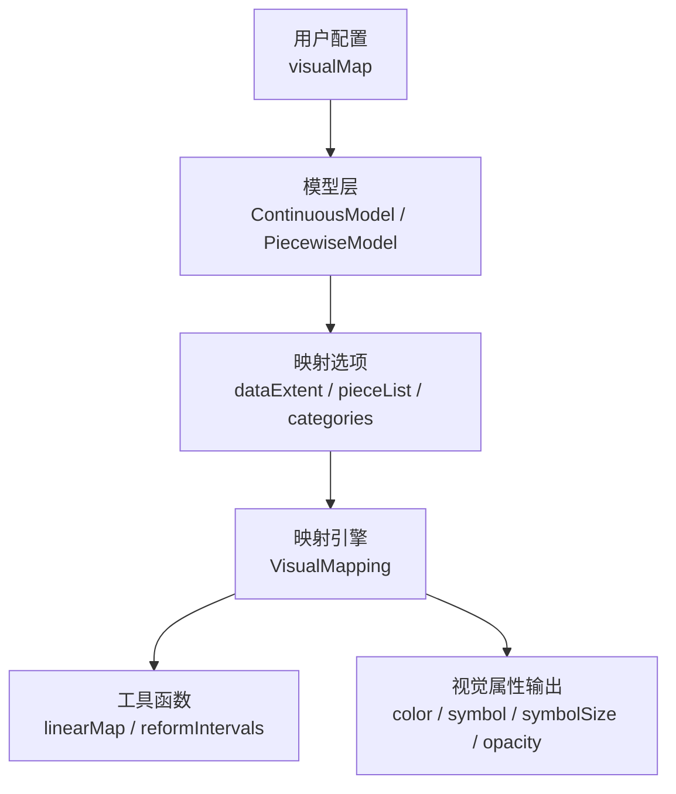
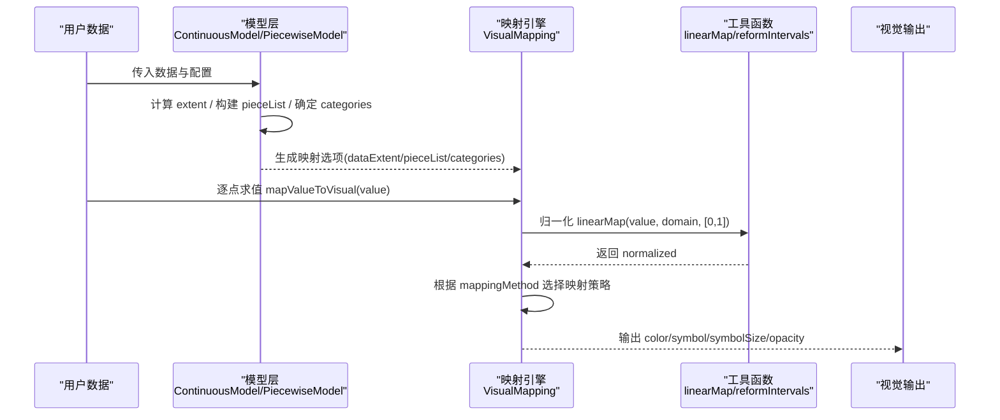
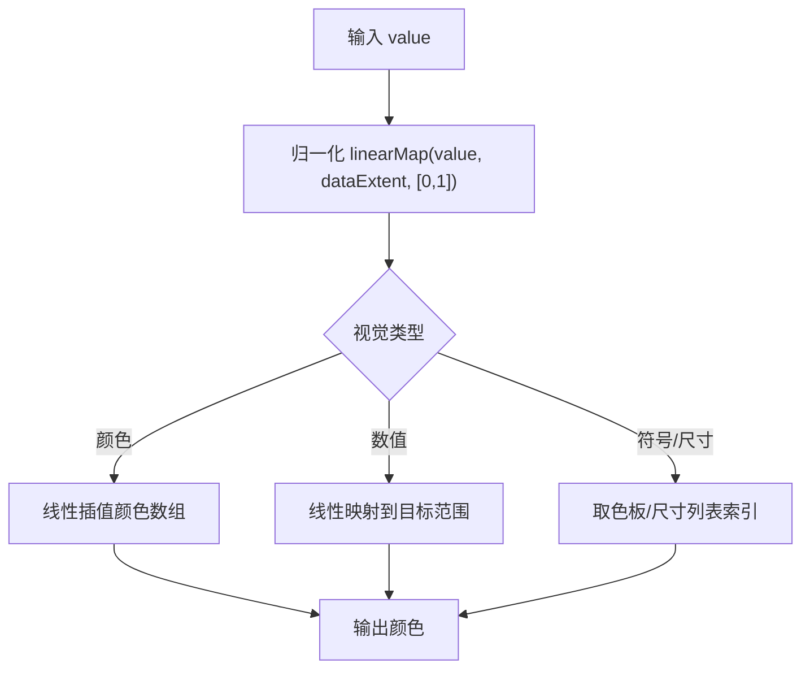
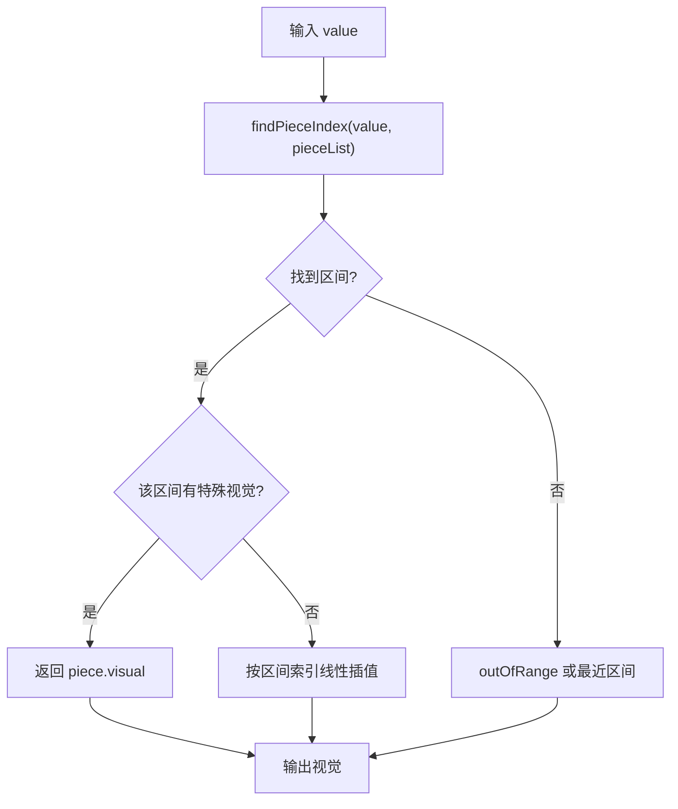
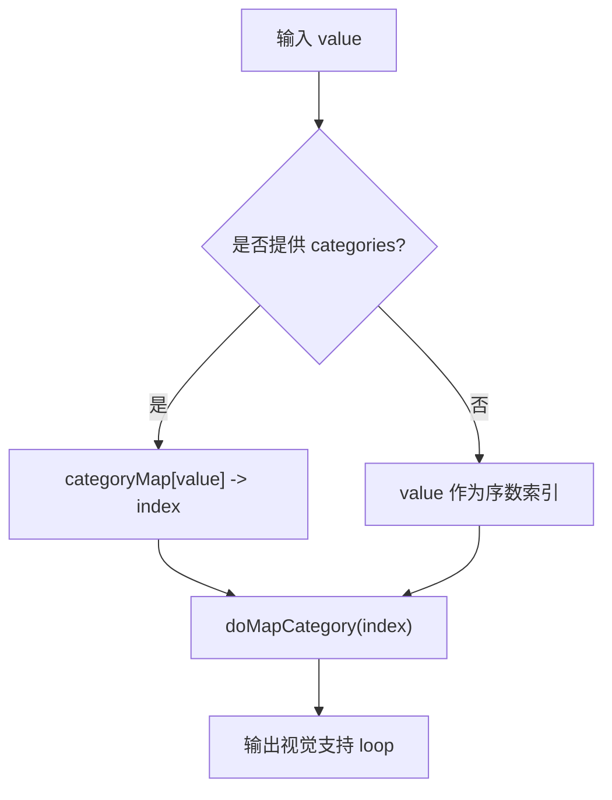
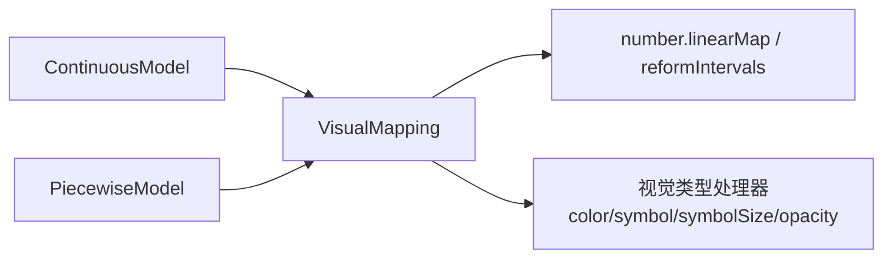

# 映射方法

<cite>
**本文引用的文件**
- [VisualMapping.ts](file://src/visual/VisualMapping.ts)
- [number.ts](file://src/util/number.ts)
- [ContinuousModel.ts](file://src/component/visualMap/ContinuousModel.ts)
- [PiecewiseModel.ts](file://src/component/visualMap/PiecewiseModel.ts)
- [VisualMapModel.ts](file://src/component/visualMap/VisualMapModel.ts)
- [visualMap-continuous.html](file://test/visualMap-continuous.html)
- [visualMap-pieces.html](file://test/visualMap-pieces.html)
</cite>

## 目录
1. [简介](#简介)
2. [项目结构](#项目结构)
3. [核心组件](#核心组件)
4. [架构总览](#架构总览)
5. [详细组件分析](#详细组件分析)
6. [依赖关系分析](#依赖关系分析)
7. [性能考量](#性能考量)
8. [故障排查指南](#故障排查指南)
9. [结论](#结论)
10. [附录：配置示例与参数说明](#附录：配置示例与参数说明)

## 简介
本文件系统性解析 ECharts 视觉映射的四种核心映射方法：线性映射、分段映射、类别映射与固定映射。围绕数据到视觉属性的映射过程，阐述其算法原理、实现要点、适用场景与性能特征，并提供可落地的配置指引与优化建议，帮助读者在不同数据特征下选择最优可视化策略。

## 项目结构
ECharts 视觉映射由“模型层 + 映射引擎 + 工具函数”构成：
- 模型层：负责解析用户配置、计算数据范围、生成映射选项（如 dataExtent、pieceList、categories）。
- 映射引擎：将数值或类别归一化并映射为视觉值（颜色、符号、尺寸等）。
- 工具函数：提供线性插值、区间规整、精度控制等基础能力。

图表来源
- [ContinuousModel.ts:114-125](file://src/component/visualMap/ContinuousModel.ts#L114-L125)
- [PiecewiseModel.ts:130-162](file://src/component/visualMap/PiecewiseModel.ts#L130-L162)
- [VisualMapping.ts:173-205](file://src/visual/VisualMapping.ts#L173-L205)
- [number.ts:67-120](file://src/util/number.ts#L67-L120)

章节来源
- [ContinuousModel.ts:114-125](file://src/component/visualMap/ContinuousModel.ts#L114-L125)
- [PiecewiseModel.ts:130-162](file://src/component/visualMap/PiecewiseModel.ts#L130-L162)
- [VisualMapping.ts:173-205](file://src/visual/VisualMapping.ts#L173-L205)
- [number.ts:67-120](file://src/util/number.ts#L67-L120)

## 核心组件
- VisualMapping：统一封装四种映射方法（linear/piecewise/category/fixed），负责归一化与映射到具体视觉类型（颜色、符号、尺寸、透明度等）。
- ContinuousModel：连续型视觉映射模型，设置 mappingMethod=linear，基于 dataExtent 进行线性插值。
- PiecewiseModel：分段型视觉映射模型，支持 pieces/categories/splitNumber 三种模式，内部构建 pieceList 并映射为 category 或 piecewise。
- VisualMapModel：通用基类，管理状态（inRange/outOfRange）、默认视觉、维度与目标系列等。

章节来源
- [VisualMapping.ts:157-205](file://src/visual/VisualMapping.ts#L157-L205)
- [ContinuousModel.ts:114-125](file://src/component/visualMap/ContinuousModel.ts#L114-L125)
- [PiecewiseModel.ts:130-162](file://src/component/visualMap/PiecewiseModel.ts#L130-L162)
- [VisualMapModel.ts:179-200](file://src/component/visualMap/VisualMapModel.ts#L179-L200)

## 架构总览
以下序列图展示从数据到视觉输出的完整调用链：

图表来源
- [ContinuousModel.ts:114-125](file://src/component/visualMap/ContinuousModel.ts#L114-L125)
- [PiecewiseModel.ts:130-162](file://src/component/visualMap/PiecewiseModel.ts#L130-L162)
- [VisualMapping.ts:208-215](file://src/visual/VisualMapping.ts#L208-L215)
- [number.ts:67-120](file://src/util/number.ts#L67-L120)

## 详细组件分析

### 线性映射（linear）
- 算法要点
  - 归一化：使用 linearMap 将 value 映射到 [0,1] 区间，支持边界钳制与零域处理。
  - 插值：对颜色数组或数值范围进行线性插值，得到最终视觉值。
- 关键流程
  - 模型设置 mappingMethod='linear' 与 dataExtent=[min,max]。
  - 映射器按 visualType 选择对应 _normalizedToVisual.linear 实现。
- 复杂度
  - 单点映射 O(1)。
- 适用场景
  - 连续数值型数据，强调渐变与趋势表达（如温度、销售额）。
- 参考路径
  - 模型设置：[ContinuousModel.ts:114-125](file://src/component/visualMap/ContinuousModel.ts#L114-L125)
  - 归一化与插值：[number.ts:67-120](file://src/util/number.ts#L67-L120)
  - 颜色线性映射：[VisualMapping.ts:250-269](file://src/visual/VisualMapping.ts#L250-L269)

图表来源
- [number.ts:67-120](file://src/util/number.ts#L67-L120)
- [VisualMapping.ts:250-269](file://src/visual/VisualMapping.ts#L250-L269)
- [VisualMapping.ts:634-639](file://src/visual/VisualMapping.ts#L634-L639)

章节来源
- [ContinuousModel.ts:114-125](file://src/component/visualMap/ContinuousModel.ts#L114-L125)
- [number.ts:67-120](file://src/util/number.ts#L67-L120)
- [VisualMapping.ts:250-269](file://src/visual/VisualMapping.ts#L250-L269)

### 分段映射（piecewise）
- 算法要点
  - 区间划分：通过 pieces/categories/splitNumber 构建 pieceList，规范化区间与闭开边界。
  - 查找匹配：findPieceIndex 按 value 定位所属区间或精确值；支持 closest 回退。
  - 特殊视觉：若某 piece 指定了视觉，则优先使用；否则回退到整体线性映射。
- 关键流程
  - 模型根据 mode 生成 pieceList，并在 resetVisual 中注入 mappingOption。
  - 映射器在 piecewise 模式下先尝试 getSpecifiedVisual，再 fallback 到线性插值。
- 复杂度
  - 单点查找 O(k)，k 为区间数量；可通过二分优化但当前为线性扫描。
- 适用场景
  - 离散分组、阈值分级、自定义标签与特殊高亮（如等级、评分段）。
- 参考路径
  - 区间构建与模式判定：[PiecewiseModel.ts:130-162](file://src/component/visualMap/PiecewiseModel.ts#L130-L162)
  - 区间规整与文本生成：[PiecewiseModel.ts:443-587](file://src/component/visualMap/PiecewiseModel.ts#L443-L587)
  - 区间查找与特殊视觉：[VisualMapping.ts:475-540](file://src/visual/VisualMapping.ts#L475-L540), [VisualMapping.ts:681-691](file://src/visual/VisualMapping.ts#L681-L691)

图表来源
- [VisualMapping.ts:475-540](file://src/visual/VisualMapping.ts#L475-L540)
- [VisualMapping.ts:681-691](file://src/visual/VisualMapping.ts#L681-L691)
- [PiecewiseModel.ts:443-587](file://src/component/visualMap/PiecewiseModel.ts#L443-L587)

章节来源
- [PiecewiseModel.ts:130-162](file://src/component/visualMap/PiecewiseModel.ts#L130-L162)
- [PiecewiseModel.ts:443-587](file://src/component/visualMap/PiecewiseModel.ts#L443-L587)
- [VisualMapping.ts:475-540](file://src/visual/VisualMapping.ts#L475-L540)
- [VisualMapping.ts:681-691](file://src/visual/VisualMapping.ts#L681-L691)

### 类别映射（category）
- 算法要点
  - 类别索引：当未显式提供 categories 时，使用序数索引；否则通过 categoryMap 将类别名映射到索引。
  - 循环映射：支持 loop 选项，使索引超出范围时循环取色。
- 关键流程
  - 模型在 categories 模式下设置 mappingMethod='category' 与 categories。
  - 映射器通过 doMapCategory 获取对应视觉。
- 复杂度
  - 单点映射 O(1)（哈希表查找）。
- 适用场景
  - 分类数据（如地区、品牌、等级）需要固定视觉区分。
- 参考路径
  - 类别预处理与映射：[VisualMapping.ts:557-592](file://src/visual/VisualMapping.ts#L557-L592), [VisualMapping.ts:647-654](file://src/visual/VisualMapping.ts#L647-L654)
  - 模型设置：[PiecewiseModel.ts:142-148](file://src/component/visualMap/PiecewiseModel.ts#L142-L148)

图表来源
- [VisualMapping.ts:557-592](file://src/visual/VisualMapping.ts#L557-L592)
- [VisualMapping.ts:647-654](file://src/visual/VisualMapping.ts#L647-L654)
- [PiecewiseModel.ts:142-148](file://src/component/visualMap/PiecewiseModel.ts#L142-L148)

章节来源
- [VisualMapping.ts:557-592](file://src/visual/VisualMapping.ts#L557-L592)
- [VisualMapping.ts:647-654](file://src/visual/VisualMapping.ts#L647-L654)
- [PiecewiseModel.ts:142-148](file://src/component/visualMap/PiecewiseModel.ts#L142-L148)

### 固定映射（fixed）
- 算法要点
  - 忽略数据值，直接返回配置的单一视觉值。
- 关键流程
  - 映射器在 fixed 模式下直接取 visual[0] 作为结果。
- 复杂度
  - O(1)。
- 适用场景
  - 强制样式覆盖、占位或调试用途。
- 参考路径
  - 固定映射实现：[VisualMapping.ts:656-659](file://src/visual/VisualMapping.ts#L656-L659)

章节来源
- [VisualMapping.ts:656-659](file://src/visual/VisualMapping.ts#L656-L659)

## 依赖关系分析
- 模型到映射引擎：ContinuousModel 与 PiecewiseModel 均通过 resetVisual 向 VisualMapping 注入 mappingOption。
- 映射引擎到工具函数：VisualMapping 依赖 number.linearMap 完成归一化与插值；依赖 reformIntervals 规整区间。
- 视觉类型处理器：不同视觉类型（color、symbol、symbolSize、opacity）在 VisualMapping 中注册各自的处理逻辑。

图表来源
- [ContinuousModel.ts:114-125](file://src/component/visualMap/ContinuousModel.ts#L114-L125)
- [PiecewiseModel.ts:130-162](file://src/component/visualMap/PiecewiseModel.ts#L130-L162)
- [VisualMapping.ts:217-336](file://src/visual/VisualMapping.ts#L217-L336)
- [number.ts:67-120](file://src/util/number.ts#L67-L120)

章节来源
- [ContinuousModel.ts:114-125](file://src/component/visualMap/ContinuousModel.ts#L114-L125)
- [PiecewiseModel.ts:130-162](file://src/component/visualMap/PiecewiseModel.ts#L130-L162)
- [VisualMapping.ts:217-336](file://src/visual/VisualMapping.ts#L217-L336)
- [number.ts:67-120](file://src/util/number.ts#L67-L120)

## 性能考量
- 线性映射
  - 时间复杂度 O(1)，适合大数据量高频更新。
  - 颜色插值使用 fastLerp，减少字符串转换开销。
- 分段映射
  - 时间复杂度 O(k)，k 为区间数；大量区间时可能成为热点。
  - 优化建议：减少不必要的 piece 数量；避免频繁重算；必要时预排序与二分查找。
- 类别映射
  - 时间复杂度 O(1)，哈希查找；适合多类别快速映射。
- 固定映射
  - 时间复杂度 O(1)，无计算成本。
- 工具函数
  - linearMap 已做边界钳制与精度保护；reformIntervals 在初始化阶段执行，不影响渲染路径。

章节来源
- [VisualMapping.ts:217-336](file://src/visual/VisualMapping.ts#L217-L336)
- [VisualMapping.ts:475-540](file://src/visual/VisualMapping.ts#L475-L540)
- [number.ts:67-120](file://src/util/number.ts#L67-L120)
- [PiecewiseModel.ts:443-587](file://src/component/visualMap/PiecewiseModel.ts#L443-L587)

## 故障排查指南
- 颜色无效
  - 现象：颜色无法生效或回退到黑色。
  - 原因：颜色字符串非法被解析失败。
  - 处理：检查颜色格式；查看开发警告提示。
  - 参考路径：[VisualMapping.ts:693-705](file://src/visual/VisualMapping.ts#L693-L705)
- 区间不生效或顺序异常
  - 现象：分段映射未按预期工作。
  - 原因：区间重叠或未规整；闭开边界错误。
  - 处理：确保区间有序且不相交；使用 reformIntervals 后再生效。
  - 参考路径：[number.ts:716-756](file://src/util/number.ts#L716-L756)
- 类别映射错位
  - 现象：类别与视觉不对应。
  - 原因：categories 顺序与 visual 数组不一致。
  - 处理：核对 categories 与 visual 的顺序；必要时启用 loop。
  - 参考路径：[VisualMapping.ts:557-592](file://src/visual/VisualMapping.ts#L557-L592)

章节来源
- [VisualMapping.ts:693-705](file://src/visual/VisualMapping.ts#L693-L705)
- [number.ts:716-756](file://src/util/number.ts#L716-L756)
- [VisualMapping.ts:557-592](file://src/visual/VisualMapping.ts#L557-L592)

## 结论
- 线性映射适用于连续数值数据的渐变表达，性能优异。
- 分段映射适合分级与阈值场景，注意区间数量与性能权衡。
- 类别映射用于分类数据的固定视觉区分，查找高效。
- 固定映射用于强制样式覆盖或调试。
- 在实际项目中，应根据数据特征与可视化目标选择合适的映射方法，并结合性能与可维护性进行调优。

## 附录：配置示例与参数说明
以下为各映射方法的典型配置片段与关键参数说明（以测试用例为参考路径）：

- 线性映射（连续）
  - 关键参数：type、mappingMethod='linear'、dataExtent（由模型自动设置）、inRange/outOfRange 的视觉配置。
  - 参考路径：
    - [visualMap-continuous.html:106-145](file://test/visualMap-continuous.html#L106-L145)
    - [ContinuousModel.ts:114-125](file://src/component/visualMap/ContinuousModel.ts#L114-L125)

- 分段映射（pieces）
  - 关键参数：type、mappingMethod='piecewise'、pieces（区间或精确值）、text、color、selectedMode。
  - 参考路径：
    - [visualMap-pieces.html:84-110](file://test/visualMap-pieces.html#L84-L110)
    - [PiecewiseModel.ts:443-587](file://src/component/visualMap/PiecewiseModel.ts#L443-L587)

- 类别映射（categories）
  - 关键参数：type、mappingMethod='category'、categories、visual（可为对象或数组）、loop。
  - 参考路径：
    - [PiecewiseModel.ts:142-148](file://src/component/visualMap/PiecewiseModel.ts#L142-L148)
    - [VisualMapping.ts:557-592](file://src/visual/VisualMapping.ts#L557-L592)

- 固定映射（fixed）
  - 关键参数：type、mappingMethod='fixed'、visual（单一值）。
  - 参考路径：
    - [VisualMapping.ts:656-659](file://src/visual/VisualMapping.ts#L656-L659)