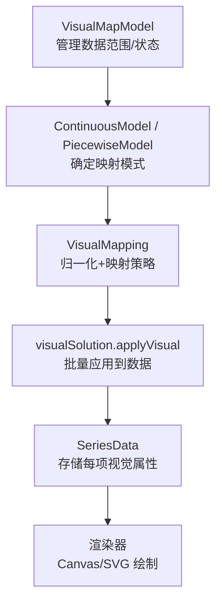
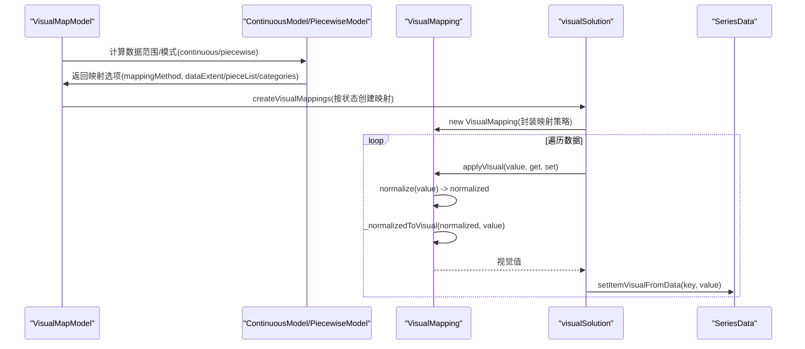
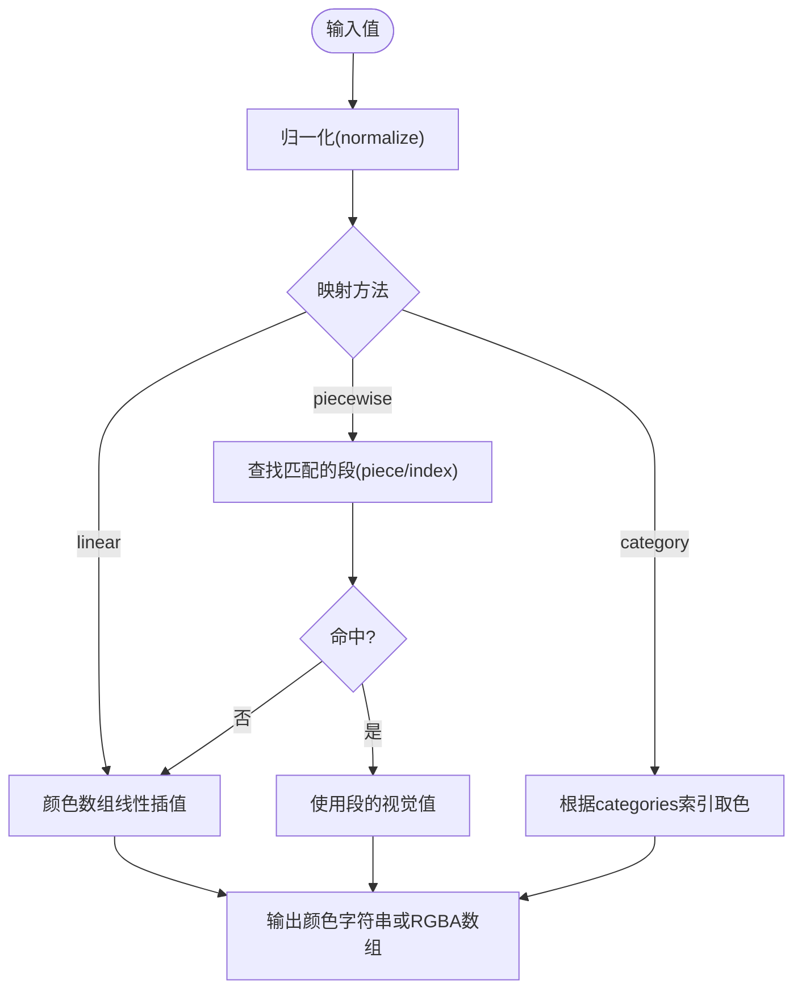
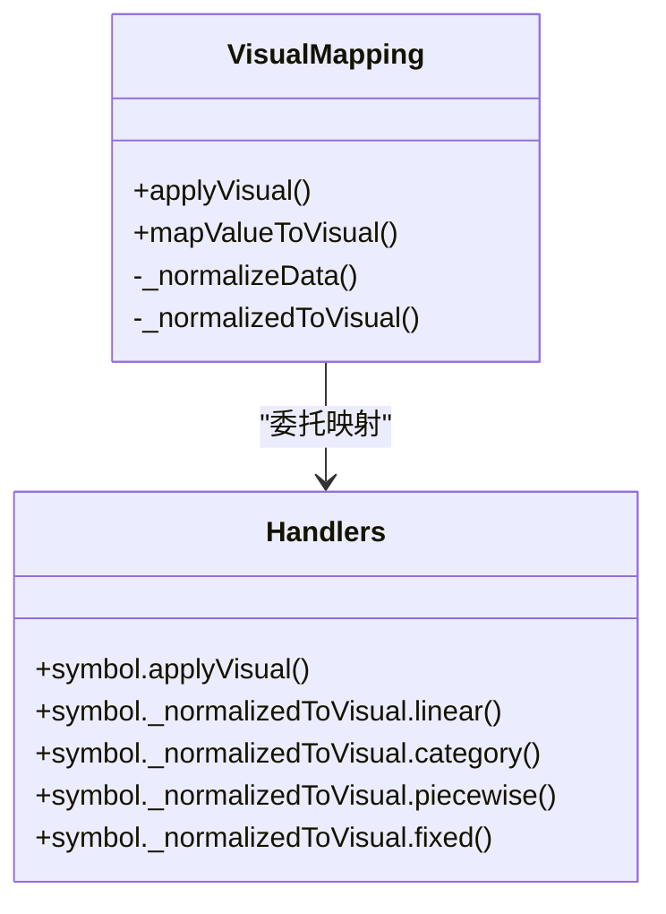
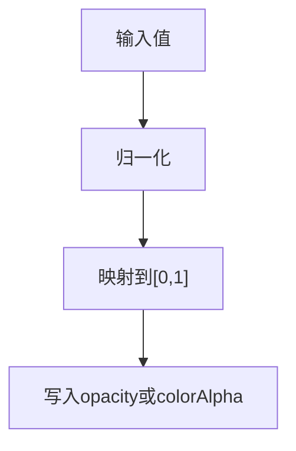
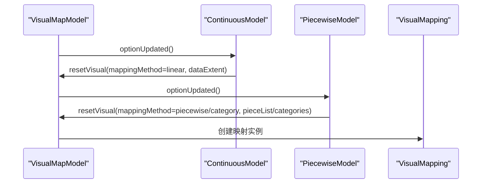
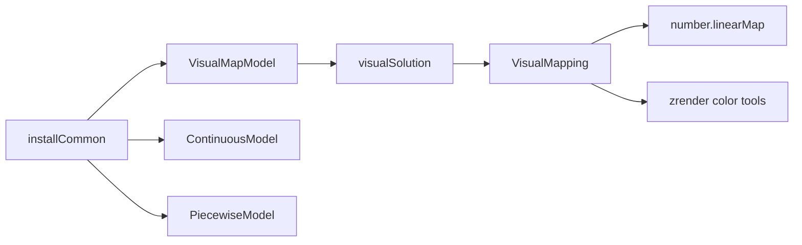

# 视觉映射

<cite>
**本文引用的文件**
- [VisualMapping.ts](file://src/visual/VisualMapping.ts)
- [visualSolution.ts](file://src/visual/visualSolution.ts)
- [VisualMapModel.ts](file://src/component/visualMap/VisualMapModel.ts)
- [ContinuousModel.ts](file://src/component/visualMap/ContinuousModel.ts)
- [PiecewiseModel.ts](file://src/component/visualMap/PiecewiseModel.ts)
- [install.ts](file://src/component/visualMap/install.ts)
- [installCommon.ts](file://src/component/visualMap/installCommon.ts)
- [number.ts](file://src/util/number.ts)
</cite>

## 目录
1. [简介](#简介)
2. [项目结构](#项目结构)
3. [核心组件](#核心组件)
4. [架构总览](#架构总览)
5. [详细组件分析](#详细组件分析)
6. [依赖关系分析](#依赖关系分析)
7. [性能考量](#性能考量)
8. [故障排查指南](#故障排查指南)
9. [结论](#结论)
10. [附录：配置示例与最佳实践](#附录：配置示例与最佳实践)

## 简介
本文件深入解析 ECharts 视觉映射系统的工作原理，覆盖颜色、大小、形状、透明度等视觉通道的映射机制；说明连续映射、分段映射与类别映射的配置方式；解释数值到尺寸的映射规则、比例尺选择与边界处理；阐述符号选择、图标映射与自定义形状绑定；提供完整场景的配置路径参考与性能优化建议（映射缓存、批量处理）。

## 项目结构
ECharts 的视觉映射由“模型层 + 映射引擎 + 应用层”构成：
- 模型层：负责数据范围、状态划分（inRange/outOfRange）、控制器与目标样式补全。
- 映射引擎：将原始值归一化并映射为具体视觉值（颜色、大小、符号、透明度等）。
- 应用层：遍历数据项，按状态调用映射器写入 SeriesData，供渲染阶段消费。

**图表来源**
- [VisualMapModel.ts:179-247](file://src/component/visualMap/VisualMapModel.ts#L179-L247)
- [ContinuousModel.ts:114-125](file://src/component/visualMap/ContinuousModel.ts#LL114-L125)
- [PiecewiseModel.ts:130-163](file://src/component/visualMap/PiecewiseModel.ts#L130-L163)
- [VisualMapping.ts:157-215](file://src/visual/VisualMapping.ts#L157-L215)
- [visualSolution.ts:136-190](file://src/visual/visualSolution.ts#L136-L190)

**章节来源**
- [VisualMapModel.ts:179-247](file://src/component/visualMap/VisualMapModel.ts#L179-L247)
- [install.ts:24-30](file://src/component/visualMap/install.ts#L24-L30)
- [installCommon.ts:36-58](file://src/component/visualMap/installCommon.ts#L36-L58)

## 核心组件
- VisualMapping：实现归一化与映射策略（linear/piecewise/category/fixed），内置 color/symbol/symbolSize/opacity/colorAlpha/colorHue/colorSaturation/colorLightness/decal/liftZ 等处理器。
- visualSolution：创建映射集合、按状态批量应用到数据，支持增量进度执行。
- VisualMapModel：维护 inRange/outOfRange 状态、默认视觉补全、尺寸与控制器样式规范化。
- ContinuousModel：连续型视觉映射，线性归一化，区间选择与无界范围控制。
- PiecewiseModel：分段/类别型视觉映射，pieces/categories/splitNumber 三种模式，区间闭合与文本格式化。

**章节来源**
- [VisualMapping.ts:157-336](file://src/visual/VisualMapping.ts#L157-L336)
- [visualSolution.ts:61-102](file://src/visual/visualSolution.ts#L61-L102)
- [VisualMapModel.ts:484-619](file://src/component/visualMap/VisualMapModel.ts#L484-L619)
- [ContinuousModel.ts:114-216](file://src/component/visualMap/ContinuousModel.ts#L114-L216)
- [PiecewiseModel.ts:130-297](file://src/component/visualMap/PiecewiseModel.ts#L130-L297)

## 架构总览
视觉映射从模型初始化开始，完成数据范围计算、状态划分与映射策略装配，随后在数据处理阶段对每个数据项进行映射并写入数据项视觉属性。

**图表来源**
- [VisualMapModel.ts:235-247](file://src/component/visualMap/VisualMapModel.ts#L235-L247)
- [ContinuousModel.ts:114-125](file://src/component/visualMap/ContinuousModel.ts#L114-L125)
- [PiecewiseModel.ts:130-163](file://src/component/visualMap/PiecewiseModel.ts#L130-L163)
- [VisualMapping.ts:173-215](file://src/visual/VisualMapping.ts#L173-L215)
- [visualSolution.ts:136-190](file://src/visual/visualSolution.ts#L136-L190)

## 详细组件分析

### 颜色映射机制（连续/分段/类别）
- 连续映射（linear）：将数值归一化到 [0,1]，再在颜色数组上进行插值，支持 RGBA 输出以加速像素操作。
- 分段映射（piecewise）：优先匹配 piece.value 或 interval，未命中时回退到线性插值；支持特殊视觉覆盖。
- 类别映射（category）：基于 categories 索引映射到对应颜色，支持循环映射。

**图表来源**
- [VisualMapping.ts:217-270](file://src/visual/VisualMapping.ts#L217-L270)
- [VisualMapping.ts:711-732](file://src/visual/VisualMapping.ts#L711-L732)
- [VisualMapping.ts:475-540](file://src/visual/VisualMapping.ts#L475-L540)

**章节来源**
- [VisualMapping.ts:217-270](file://src/visual/VisualMapping.ts#L217-L270)
- [VisualMapping.ts:475-540](file://src/visual/VisualMapping.ts#L475-L540)
- [VisualMapping.ts:711-732](file://src/visual/VisualMapping.ts#L711-L732)

### 大小映射算法（symbolSize）
- 数值到尺寸：通过 createNormalizedToNumericVisual 将归一化值映射到指定范围（如 [minSize, maxSize]）。
- 比例尺选择：默认线性映射；若为类别模式则走 category 分支。
- 边界处理：linearMap 支持 clamp 模式，超出范围会截断到端点。

**图表来源**
- [VisualMapping.ts:332-335](file://src/visual/VisualMapping.ts#L332-L335)
- [VisualMapping.ts:664-679](file://src/visual/VisualMapping.ts#L664-L679)
- [number.ts:67-120](file://src/util/number.ts#L67-L120)

**章节来源**
- [VisualMapping.ts:332-335](file://src/visual/VisualMapping.ts#L332-L335)
- [VisualMapping.ts:664-679](file://src/visual/VisualMapping.ts#L664-L679)
- [number.ts:67-120](file://src/util/number.ts#L67-L120)

### 形状映射技术（symbol）
- 符号选择：支持 linear/category/piecewise/fixed 四种映射方法。
- 图标映射：可传入字符串或数组，类别模式下按索引选取。
- 自定义形状：可通过 symbol 指向自定义图形名称（需提前注册）。

**图表来源**
- [VisualMapping.ts:313-330](file://src/visual/VisualMapping.ts#L313-L330)

**章节来源**
- [VisualMapping.ts:313-330](file://src/visual/VisualMapping.ts#L313-L330)

### 透明度映射（opacity 与 colorAlpha）
- opacity：通过 createNormalizedToNumericVisual 将归一化值映射到 [0,1]。
- colorAlpha：当某些渲染不支持 opacity 时，使用 colorAlpha 通道调整颜色的 alpha 分量。

**图表来源**
- [VisualMapping.ts:298-301](file://src/visual/VisualMapping.ts#L298-L301)
- [VisualMapping.ts:284-286](file://src/visual/VisualMapping.ts#L284-L286)
- [visualSolution.ts:82-88](file://src/visual/visualSolution.ts#L82-L88)

**章节来源**
- [VisualMapping.ts:284-301](file://src/visual/VisualMapping.ts#L284-L301)
- [visualSolution.ts:82-88](file://src/visual/visualSolution.ts#L82-L88)

### 连续映射与分段映射模型
- 连续映射（ContinuousModel）：
  - mappingMethod=linear，dataExtent=数据范围。
  - 支持 unboundedRange 控制无界范围行为。
  - getValueState 判断 inRange/outOfRange。
- 分段映射（PiecewiseModel）：
  - 支持 pieces/categories/splitNumber 三种模式。
  - 自动构建 pieceList，处理区间闭合与文本格式化。
  - getValueState 基于 findPieceIndex 判定选中状态。

**图表来源**
- [ContinuousModel.ts:114-125](file://src/component/visualMap/ContinuousModel.ts#L114-L125)
- [PiecewiseModel.ts:130-163](file://src/component/visualMap/PiecewiseModel.ts#L130-L163)
- [VisualMapModel.ts:235-247](file://src/component/visualMap/VisualMapModel.ts#L235-L247)

**章节来源**
- [ContinuousModel.ts:114-216](file://src/component/visualMap/ContinuousModel.ts#L114-L216)
- [PiecewiseModel.ts:130-297](file://src/component/visualMap/PiecewiseModel.ts#L130-L297)
- [VisualMapModel.ts:235-247](file://src/component/visualMap/VisualMapModel.ts#L235-L247)

## 依赖关系分析
- installCommon 注册子类型默认器、动作与视觉编码处理器，统一入口安装 continuous/piecewise。
- VisualMapModel 依赖 visualSolution 创建映射集合，并在更新时替换相关选项。
- VisualMapping 依赖 number.linearMap 做数值映射，依赖 zrender 颜色工具做颜色插值与格式转换。

**图表来源**
- [installCommon.ts:36-58](file://src/component/visualMap/installCommon.ts#L36-L58)
- [VisualMapModel.ts:235-247](file://src/component/visualMap/VisualMapModel.ts#L235-L247)
- [VisualMapping.ts:20-23](file://src/visual/VisualMapping.ts#L20-L23)
- [number.ts:67-120](file://src/util/number.ts#L67-L120)

**章节来源**
- [installCommon.ts:36-58](file://src/component/visualMap/installCommon.ts#L36-L58)
- [VisualMapModel.ts:235-247](file://src/component/visualMap/VisualMapModel.ts#L235-L247)
- [VisualMapping.ts:20-23](file://src/visual/VisualMapping.ts#L20-L23)
- [number.ts:67-120](file://src/util/number.ts#L67-L120)

## 性能考量
- 映射缓存：
  - 颜色映射预解析为 RGBA 数组，避免重复解析字符串颜色。
  - 分类映射建立 categoryMap 哈希表，O(1) 查找类别索引。
- 批量处理：
  - applyVisual 与 incrementalApplyVisual 支持逐条/分块处理，减少主线程阻塞。
  - 支持跳过特定数据项（visualMap: false）以提升大数据集性能。
- 数值映射优化：
  - linearMap 在 clamp 模式下快速边界判断，避免多余计算。
  - 分段映射中 findPieceIndex 支持外部最近匹配，提升越界数据表现。

**章节来源**
- [VisualMapping.ts:147-155](file://src/visual/VisualMapping.ts#L147-L155)
- [VisualMapping.ts:475-540](file://src/visual/VisualMapping.ts#L475-L540)
- [visualSolution.ts:167-190](file://src/visual/visualSolution.ts#L167-L190)
- [visualSolution.ts:199-252](file://src/visual/visualSolution.ts#L199-L252)
- [number.ts:67-120](file://src/util/number.ts#L67-L120)

## 故障排查指南
- 颜色无效：
  - 检查颜色字符串是否合法，非法颜色会回退到默认值并给出警告。
- 分段映射未命中：
  - 确认 pieceList 顺序与闭区间设置是否正确；必要时启用 findClosestWhenOutside。
- 大小映射异常：
  - 检查映射范围是否合理；确保 min/max 非 NaN 且顺序正确。
- 透明度不生效：
  - 某些渲染路径不支持 opacity，可使用 colorAlpha 替代。

**章节来源**
- [VisualMapping.ts:693-705](file://src/visual/VisualMapping.ts#L693-L705)
- [VisualMapping.ts:475-540](file://src/visual/VisualMapping.ts#L475-L540)
- [VisualMapping.ts:664-679](file://src/visual/VisualMapping.ts#L664-L679)
- [visualSolution.ts:82-88](file://src/visual/visualSolution.ts#L82-L88)

## 结论
ECharts 视觉映射系统通过统一的归一化与映射策略，将数据值高效转换为颜色、大小、形状、透明度等视觉属性。连续映射适合平滑渐变，分段映射适合离散区间与类别区分，类别映射则用于有序或无序分类数据的可视化。借助映射缓存与批量处理，系统在大数据量下仍保持良好性能。

## 附录：配置示例与最佳实践
以下示例均为“路径引用”，请根据实际场景组合使用：
- 连续颜色映射
  - 参考路径：[test/visualMap-continuous.html](file://test/visualMap-continuous.html)
- 分段颜色映射
  - 参考路径：[test/visualMap-pieces.html](file://test/visualMap-pieces.html)
- 类别映射
  - 参考路径：[test/visualMap-categories.html](file://test/visualMap-categories.html)
- 大小映射（散点图）
  - 参考路径：[test/visualMap-scatter-symbolSize.html](file://test/visualMap-scatter-symbolSize.html)
- 颜色与符号组合
  - 参考路径：[test/visualMap-scatter-colorAndSymbol.html](file://test/visualMap-scatter-colorAndSymbol.html)
- 透明度映射
  - 参考路径：[test/visualMap-opacity.html](file://test/visualMap-opacity.html)
- 多连续映射
  - 参考路径：[test/visualMap-multi-continuous.html](file://test/visualMap-multi-continuous.html)
- 大数据性能
  - 参考路径：[test/visualMap-performance1.html](file://test/visualMap-performance1.html)

最佳实践要点
- 明确数据范围：为连续映射设置合理的 dataExtent，避免极端值导致视觉失真。
- 合理使用分段：对业务有明确区间的场景优先使用分段映射，语义更清晰。
- 类别映射注意顺序：categories 的顺序决定视觉顺序，必要时结合 inverse 调整。
- 性能优化：
  - 开启增量处理（incrementalApplyVisual）以降低首帧延迟。
  - 对不需要映射的数据项设置 visualMap: false 跳过处理。
  - 复用颜色数组与类别映射表，避免重复创建。

**章节来源**
- [test/visualMap-continuous.html](file://test/visualMap-continuous.html)
- [test/visualMap-pieces.html](file://test/visualMap-pieces.html)
- [test/visualMap-categories.html](file://test/visualMap-categories.html)
- [test/visualMap-scatter-symbolSize.html](file://test/visualMap-scatter-symbolSize.html)
- [test/visualMap-scatter-colorAndSymbol.html](file://test/visualMap-scatter-colorAndSymbol.html)
- [test/visualMap-opacity.html](file://test/visualMap-opacity.html)
- [test/visualMap-multi-continuous.html](file://test/visualMap-multi-continuous.html)
- [test/visualMap-performance1.html](file://test/visualMap-performance1.html)