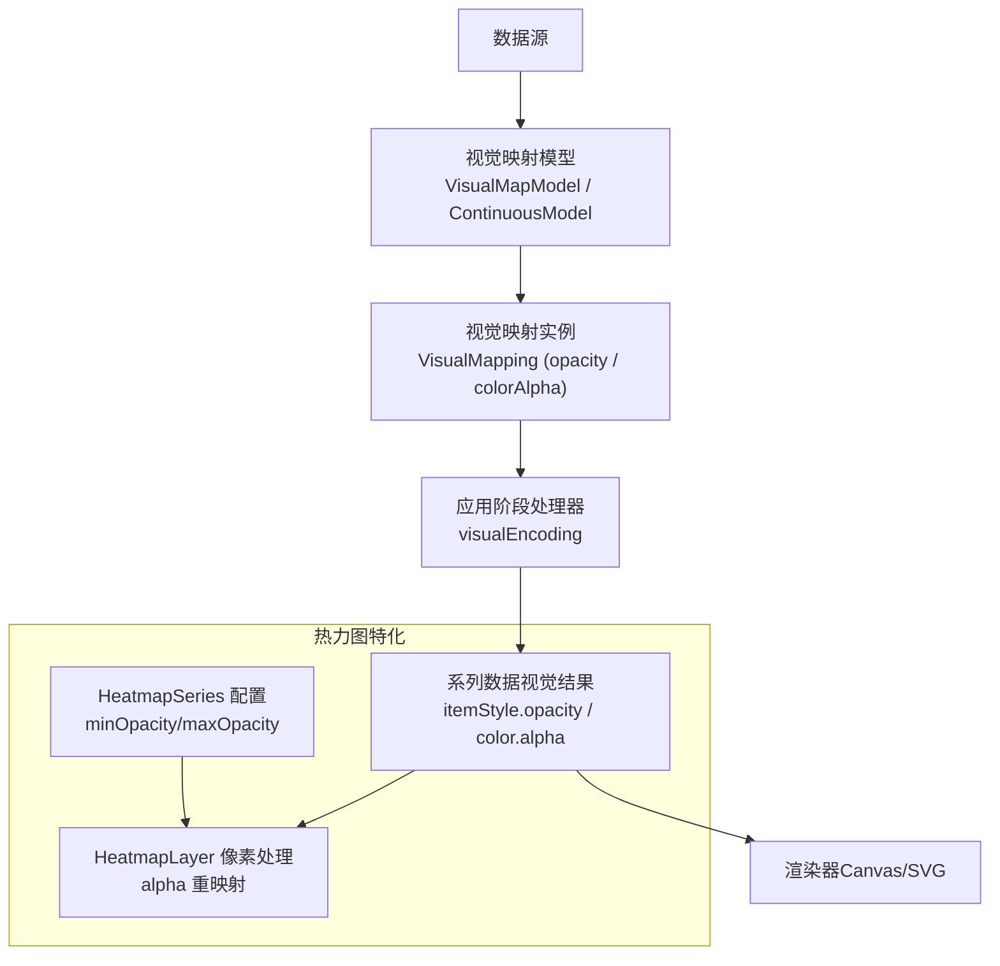
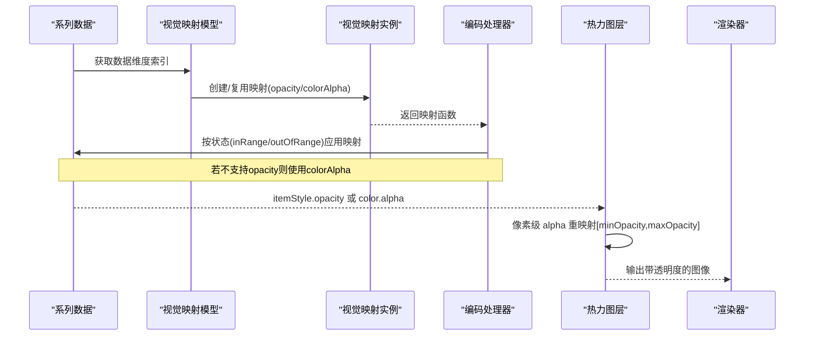
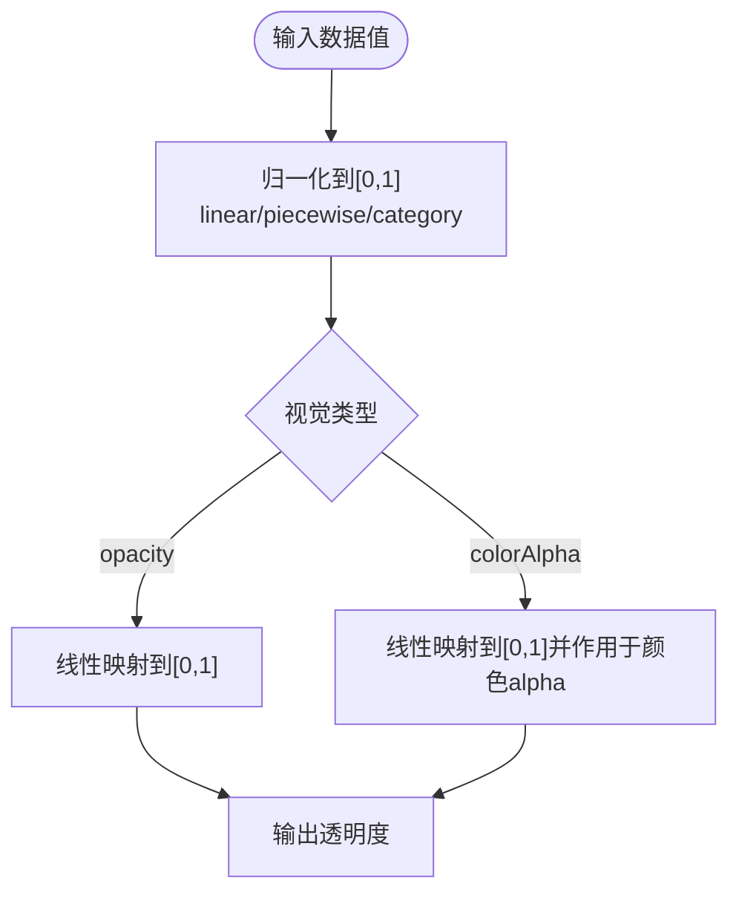
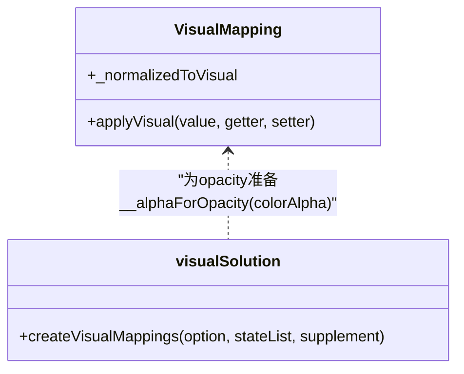
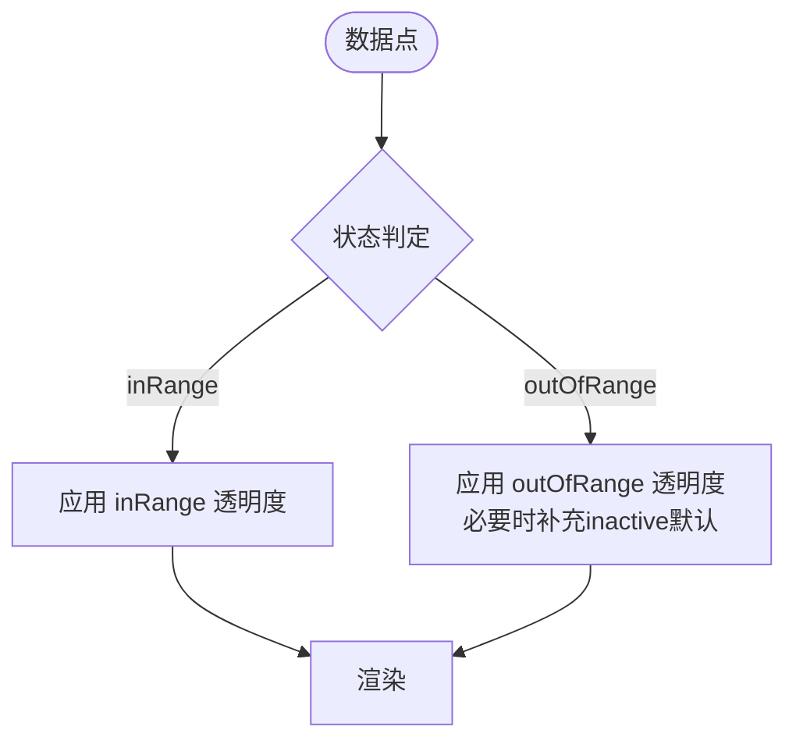
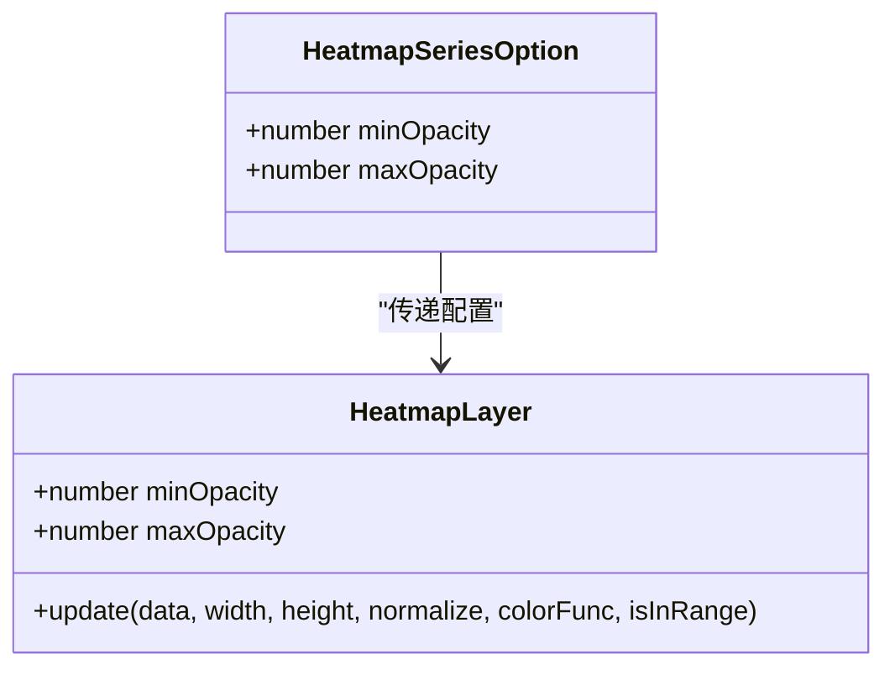
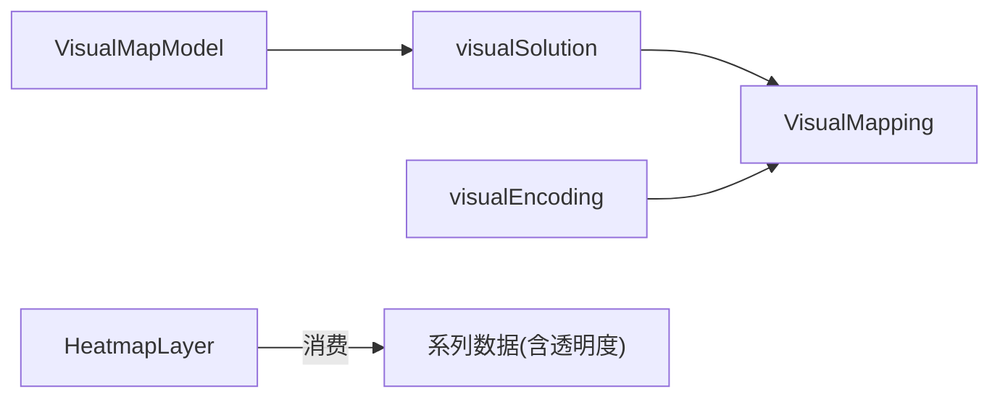

# 透明度映射

<cite>
**本文引用的文件**
- [VisualMapModel.ts](file://src/component/visualMap/VisualMapModel.ts)
- [ContinuousModel.ts](file://src/component/visualMap/ContinuousModel.ts)
- [visualEncoding.ts](file://src/component/visualMap/visualEncoding.ts)
- [VisualMapping.ts](file://src/visual/VisualMapping.ts)
- [visualSolution.ts](file://src/visual/visualSolution.ts)
- [HeatmapLayer.ts](file://src/chart/heatmap/HeatmapLayer.ts)
- [HeatmapSeries.ts](file://src/chart/heatmap/HeatmapSeries.ts)
</cite>

## 目录
1. [简介](#简介)
2. [项目结构](#项目结构)
3. [核心组件](#核心组件)
4. [架构总览](#架构总览)
5. [详细组件分析](#详细组件分析)
6. [依赖关系分析](#依赖关系分析)
7. [性能考量](#性能考量)
8. [故障排查指南](#故障排查指南)
9. [结论](#结论)
10. [附录](#附录)

## 简介
本文件系统性解析 ECharts 透明度映射机制，覆盖以下关键点：
- 数值到透明度的映射与插值（0-1 范围）
- 透明度与颜色（RGBA alpha 通道）的结合方式
- 不同状态（正常、强调、禁用）下的透明度控制
- 配置项说明（如 minOpacity、maxOpacity 等）
- 典型应用场景示例（数据密度可视化、层次结构展示）
- 渲染性能影响与优化建议

## 项目结构
围绕透明度映射的核心代码分布在视觉映射系统与具体图表层：
- 视觉映射系统：负责将数据维度映射为视觉属性（包括 opacity/colorAlpha），并处理 inRange/outOfRange 状态
- 具体图表层：以热力图为代表，使用 minOpacity/maxOpacity 对像素级 alpha 进行重映射

图示来源
- [VisualMapModel.ts:179-247](file://src/component/visualMap/VisualMapModel.ts#L179-L247)
- [ContinuousModel.ts:114-125](file://src/component/visualMap/ContinuousModel.ts#L114-L125)
- [VisualMapping.ts:298-301](file://src/visual/VisualMapping.ts#L298-L301)
- [visualEncoding.ts:28-80](file://src/component/visualMap/visualEncoding.ts#L28-L80)
- [HeatmapSeries.ts:79-80](file://src/chart/heatmap/HeatmapSeries.ts#L79-L80)
- [HeatmapLayer.ts:36-37](file://src/chart/heatmap/HeatmapLayer.ts#L36-L37)

章节来源
- [VisualMapModel.ts:179-247](file://src/component/visualMap/VisualMapModel.ts#L179-L247)
- [ContinuousModel.ts:114-125](file://src/component/visualMap/ContinuousModel.ts#L114-L125)
- [VisualMapping.ts:298-301](file://src/visual/VisualMapping.ts#L298-L301)
- [visualEncoding.ts:28-80](file://src/component/visualMap/visualEncoding.ts#L28-L80)
- [HeatmapSeries.ts:79-80](file://src/chart/heatmap/HeatmapSeries.ts#L79-L80)
- [HeatmapLayer.ts:36-37](file://src/chart/heatmap/HeatmapLayer.ts#L36-L37)

## 核心组件
- 视觉映射模型（VisualMapModel / ContinuousModel）
  - 维护 inRange/outOfRange 两套视觉配置，计算数据范围与选择区间
  - 提供 getVisualMeta 用于生成渐变色阶（含 outerColors）
- 视觉映射（VisualMapping）
  - 定义各视觉类型的映射策略，其中 opacity 映射到 [0,1] 的线性区间
  - colorAlpha 通过修改颜色的 alpha 通道实现“带透明度的颜色”
- 编码阶段处理器（visualEncoding）
  - 在流水线中按状态（inRange/outOfRange）应用映射，支持增量式处理
  - 当类型是 opacity 时，内部会准备一个 __alphaForOpacity 的 colorAlpha 映射，供不支持直接 opacity 的场景使用
- 热力图层（HeatmapLayer）
  - 基于像素操作，将归一化的 alpha 映射到 [minOpacity, maxOpacity] 区间，再写入图像数据的 alpha 通道

章节来源
- [VisualMapModel.ts:179-247](file://src/component/visualMap/VisualMapModel.ts#L179-L247)
- [ContinuousModel.ts:114-125](file://src/component/visualMap/ContinuousModel.ts#L114-L125)
- [VisualMapping.ts:298-301](file://src/visual/VisualMapping.ts#L298-L301)
- [visualEncoding.ts:28-80](file://src/component/visualMap/visualEncoding.ts#L28-L80)
- [HeatmapLayer.ts:101-117](file://src/chart/heatmap/HeatmapLayer.ts#L101-L117)

## 架构总览
下图展示了从数据到最终渲染的透明度映射流程，以及热力图的像素级重映射。

图示来源
- [visualEncoding.ts:28-80](file://src/component/visualMap/visualEncoding.ts#L28-L80)
- [VisualMapping.ts:298-301](file://src/visual/VisualMapping.ts#L298-L301)
- [HeatmapLayer.ts:101-117](file://src/chart/heatmap/HeatmapLayer.ts#L101-L117)

## 详细组件分析

### 透明度数值映射与插值算法
- 线性映射
  - 数据值首先被归一化到 [0,1] 区间（基于数据范围或分段区间）
  - 对于 opacity 类型，映射目标区间为 [0,1]；对于 colorAlpha，同样映射到 [0,1] 后作用于颜色 alpha 通道
- 分段映射
  - 当使用 piecewise 时，根据区间匹配得到归一化位置，再进行线性插值
- 类别映射
  - 类别型数据通过类别索引映射到对应视觉值

图示来源
- [VisualMapping.ts:711-732](file://src/visual/VisualMapping.ts#L711-L732)
- [VisualMapping.ts:664-679](file://src/visual/VisualMapping.ts#L664-L679)
- [VisualMapping.ts:298-301](file://src/visual/VisualMapping.ts#L298-L301)

章节来源
- [VisualMapping.ts:711-732](file://src/visual/VisualMapping.ts#L711-L732)
- [VisualMapping.ts:664-679](file://src/visual/VisualMapping.ts#L664-L679)
- [VisualMapping.ts:298-301](file://src/visual/VisualMapping.ts#L298-L301)

### 透明度与颜色（RGBA alpha 通道）的结合
- 当目标渲染环境不支持直接设置 opacity 时，系统会自动准备一个 __alphaForOpacity 的 colorAlpha 映射
- 该映射通过修改颜色的 alpha 通道实现同等视觉效果，保证在不同渲染后端的一致性

图示来源
- [visualSolution.ts:61-102](file://src/visual/visualSolution.ts#L61-L102)
- [VisualMapping.ts:298-301](file://src/visual/VisualMapping.ts#L298-L301)

章节来源
- [visualSolution.ts:61-102](file://src/visual/visualSolution.ts#L61-L102)
- [VisualMapping.ts:298-301](file://src/visual/VisualMapping.ts#L298-L301)

### 不同状态下的透明度控制
- 正常状态（inRange）
  - 由 inRange 配置的 opacity 或 colorAlpha 决定
- 非选中状态（outOfRange）
  - 由 outOfRange 配置决定；若未显式设置，系统会根据 inactive 默认值补齐
  - 当仅设置了颜色且未设置 opacity/colorAlpha 时，inactive 下会补充 opacity:[0,0] 以保证标签等元素完全透明
- 强调状态（emphasis）
  - 可通过 series emphasis 或组件 emphasis 配置增强效果；透明度可与其他视觉属性共同作用

图示来源
- [VisualMapModel.ts:529-562](file://src/component/visualMap/VisualMapModel.ts#L529-L562)
- [ContinuousModel.ts:207-216](file://src/component/visualMap/ContinuousModel.ts#L207-L216)

章节来源
- [VisualMapModel.ts:529-562](file://src/component/visualMap/VisualMapModel.ts#L529-L562)
- [ContinuousModel.ts:207-216](file://src/component/visualMap/ContinuousModel.ts#L207-L216)

### 透明度映射的配置选项
- 通用视觉映射
  - inRange/outOfRange 中可配置 opacity 或 colorAlpha
  - 连续型映射使用 mappingMethod:'linear'，数据范围由 dataExtent 决定
- 热力图专用
  - minOpacity、maxOpacity：控制像素级 alpha 的最终可见范围
  - 默认值：minOpacity=0，maxOpacity=1

图示来源
- [HeatmapSeries.ts:79-80](file://src/chart/heatmap/HeatmapSeries.ts#L79-L80)
- [HeatmapLayer.ts:36-37](file://src/chart/heatmap/HeatmapLayer.ts#L36-L37)
- [HeatmapLayer.ts:101-117](file://src/chart/heatmap/HeatmapLayer.ts#L101-L117)

章节来源
- [HeatmapSeries.ts:79-80](file://src/chart/heatmap/HeatmapSeries.ts#L79-L80)
- [HeatmapLayer.ts:36-37](file://src/chart/heatmap/HeatmapLayer.ts#L36-L37)
- [HeatmapLayer.ts:101-117](file://src/chart/heatmap/HeatmapLayer.ts#L101-L117)

### 实际应用示例
- 数据密度可视化（热力图）
  - 通过 minOpacity/maxOpacity 控制低密度区域的可见性，突出高密度区域
  - 结合 color 映射形成渐变色彩，配合 alpha 重映射提升对比度
- 层次结构展示（树/桑基图等）
  - 使用 inRange/outOfRange 分别设置透明度，使非聚焦层级更淡，聚焦层级更清晰
  - 强调状态下可适当提高透明度或亮度，增强交互反馈

章节来源
- [HeatmapLayer.ts:101-117](file://src/chart/heatmap/HeatmapLayer.ts#L101-L117)
- [VisualMapModel.ts:529-562](file://src/component/visualMap/VisualMapModel.ts#L529-L562)

## 依赖关系分析
- 模块耦合
  - VisualMapModel/ContinuousModel 依赖 visualSolution 创建映射实例
  - visualEncoding 在流水线阶段调用映射实例 applyVisual
  - 热力图层独立于通用映射，但消费系列数据中的透明度结果
- 外部依赖
  - zrender 的颜色工具用于颜色解析与快速插值
  - 数字工具用于线性映射与排序

图示来源
- [VisualMapModel.ts:179-247](file://src/component/visualMap/VisualMapModel.ts#L179-L247)
- [visualSolution.ts:61-102](file://src/visual/visualSolution.ts#L61-L102)
- [visualEncoding.ts:28-80](file://src/component/visualMap/visualEncoding.ts#L28-L80)
- [HeatmapLayer.ts:101-117](file://src/chart/heatmap/HeatmapLayer.ts#L101-L117)

章节来源
- [VisualMapModel.ts:179-247](file://src/component/visualMap/VisualMapModel.ts#L179-L247)
- [visualSolution.ts:61-102](file://src/visual/visualSolution.ts#L61-L102)
- [visualEncoding.ts:28-80](file://src/component/visualMap/visualEncoding.ts#L28-L80)
- [HeatmapLayer.ts:101-117](file://src/chart/heatmap/HeatmapLayer.ts#L101-L117)

## 性能考量
- 像素级处理开销
  - 热力图通过 getImageData/putImageData 逐像素修改 alpha，数据量大时可能成为瓶颈
  - 建议：合理设置 pointSize/blurSize，减少绘制半径；控制数据规模或使用采样
- 映射计算成本
  - 大量数据点的 opacity/colorAlpha 映射在流水线中执行，建议使用 incrementalApplyVisual 分批处理
- 颜色插值
  - 颜色映射使用快速插值，避免重复解析颜色字符串
- 透明度叠加
  - 多层半透明叠加会增加混合计算量，应控制层级数量与透明度范围

## 故障排查指南
- 透明度不生效
  - 检查是否在 inRange/outOfRange 中正确配置了 opacity 或 colorAlpha
  - 确认数据维度索引是否正确，确保映射应用于正确的维度
- 热力图透明度异常
  - 核对 minOpacity/maxOpacity 是否越界（应在 0-1 之间）
  - 检查 normalize 函数是否正确将数据映射到 0-1
- 标签或文本不可见
  - 当仅设置颜色而未设置 opacity/colorAlpha 时，inactive 状态会补充 opacity:[0,0]，导致完全透明；如需保留可见性，请显式设置 inactive 的 opacity

章节来源
- [VisualMapModel.ts:529-562](file://src/component/visualMap/VisualMapModel.ts#L529-L562)
- [HeatmapLayer.ts:101-117](file://src/chart/heatmap/HeatmapLayer.ts#L101-L117)

## 结论
ECharts 的透明度映射体系通过统一的视觉映射框架，将数据值平滑映射到透明度区间，并与颜色 alpha 通道无缝结合。针对不同状态（inRange/outOfRange）提供灵活的透明度控制，同时为热力图等高性能场景提供像素级重映射能力。合理使用 minOpacity/maxOpacity 与 inRange/outOfRange 配置，可在保证视觉效果的同时兼顾渲染性能。

## 附录
- 关键配置项速查
  - 通用：inRange.opacity / inRange.colorAlpha / outOfRange.opacity / outOfRange.colorAlpha
  - 热力图：minOpacity、maxOpacity（默认 0、1）
- 推荐实践
  - 大数据量优先使用增量映射与采样
  - 避免过大的模糊半径与点数，平衡清晰度与性能
  - 明确区分 inRange/outOfRange 的透明度策略，提升可读性与交互性