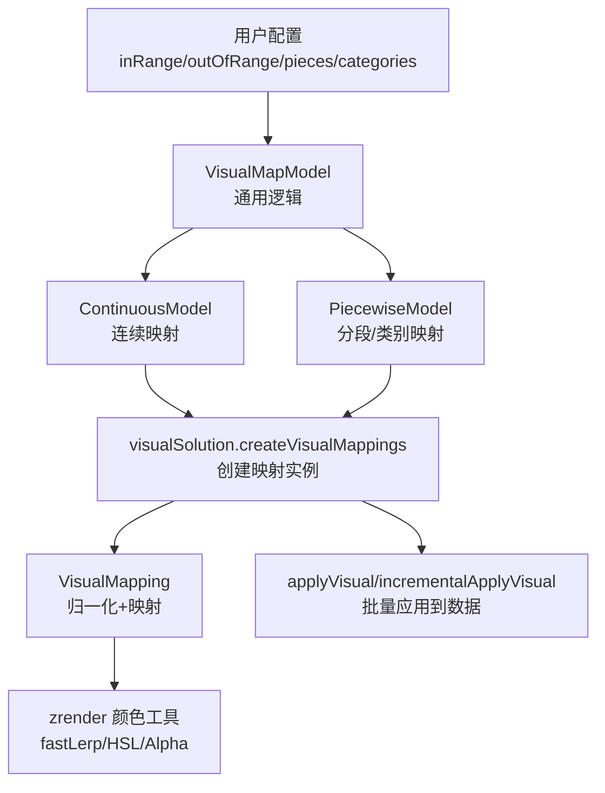
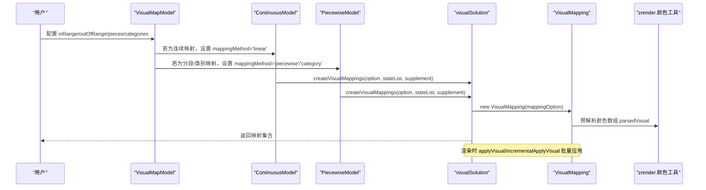
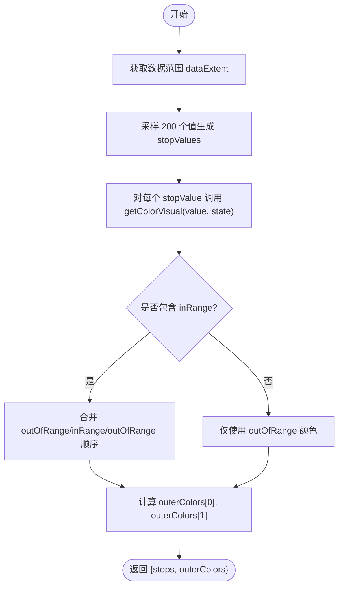
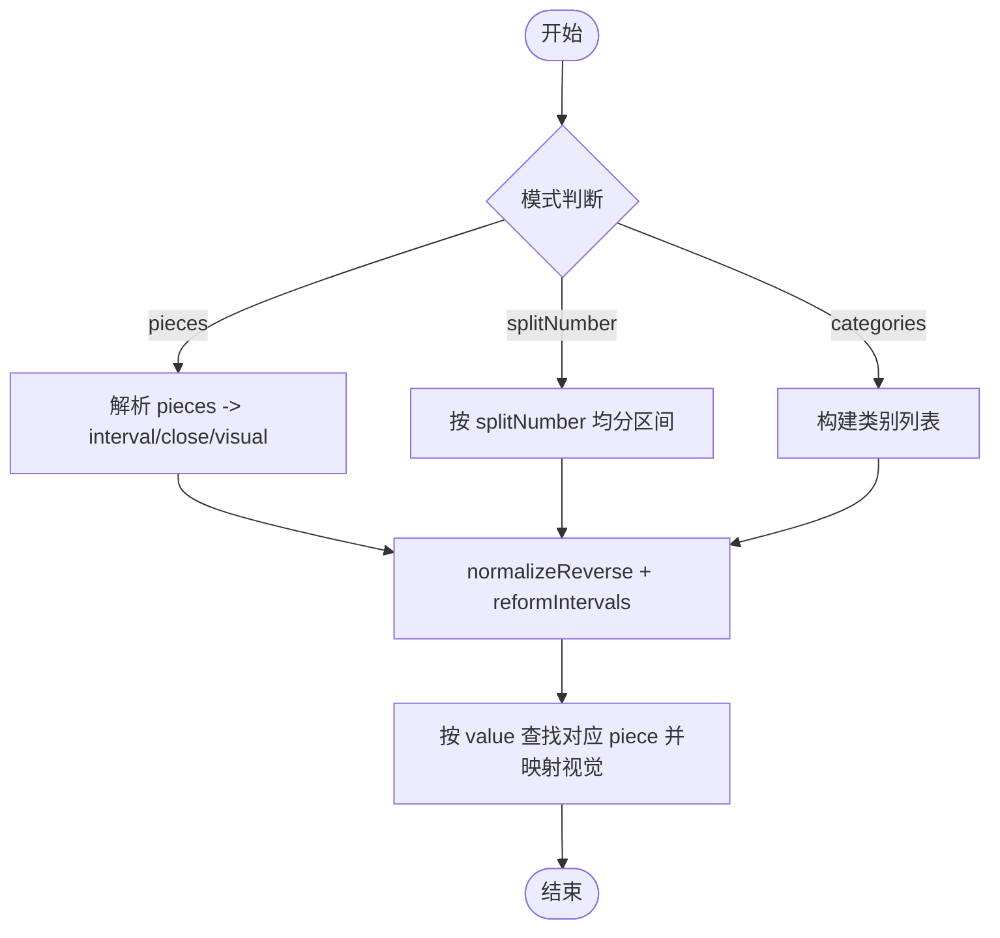
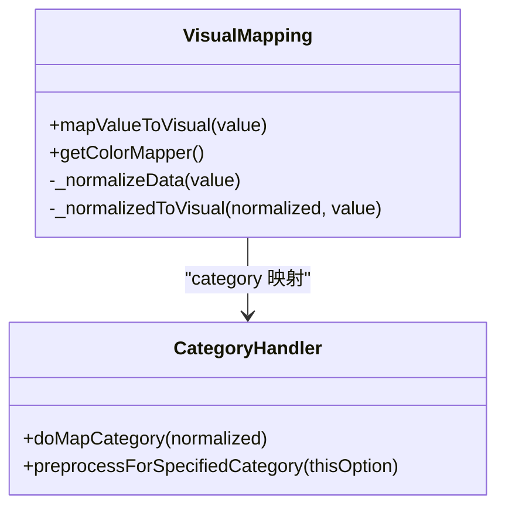
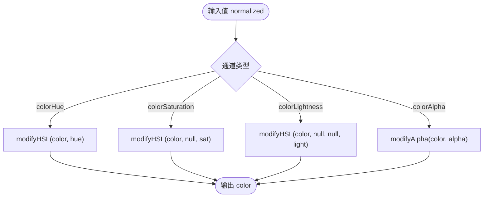
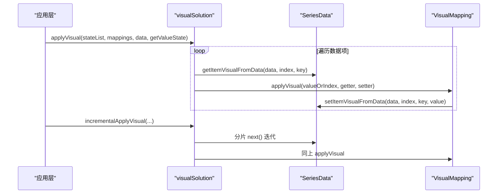
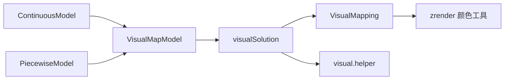

# 颜色映射

<cite>
**本文引用的文件**
- [VisualMapModel.ts](file://src/component/visualMap/VisualMapModel.ts)
- [ContinuousModel.ts](file://src/component/visualMap/ContinuousModel.ts)
- [PiecewiseModel.ts](file://src/component/visualMap/PiecewiseModel.ts)
- [VisualMapping.ts](file://src/visual/VisualMapping.ts)
- [visualSolution.ts](file://src/visual/visualSolution.ts)
- [helper.ts](file://src/visual/helper.ts)
- [helper.ts](file://src/component/visualMap/helper.ts)
</cite>

## 目录
1. [简介](#简介)
2. [项目结构](#项目结构)
3. [核心组件](#核心组件)
4. [架构总览](#架构总览)
5. [详细组件分析](#详细组件分析)
6. [依赖关系分析](#依赖关系分析)
7. [性能考量](#性能考量)
8. [故障排查指南](#故障排查指南)
9. [结论](#结论)
10. [附录：配置示例与最佳实践](#附录配置示例与最佳实践)

## 简介
本文件深入解析 ECharts 颜色映射系统的实现原理，覆盖以下主题：
- 连续颜色映射：基于数值范围的颜色渐变算法（线性插值、颜色空间转换）
- 分段颜色映射：通过 pieceList 配置不同区间的颜色分配策略
- 类别颜色映射：为不同类别数据分配固定颜色的机制
- 颜色通道控制：色相、饱和度、亮度、透明度的独立调节方法
- 完整配置示例：各场景的实现思路与最佳实践
- 性能优化技巧：颜色缓存机制与批量处理策略

## 项目结构
ECharts 的颜色映射由“视觉映射模型”和“视觉映射引擎”两部分组成：
- 视觉映射模型：负责解析用户配置、确定数据范围、选择映射模式（连续/分段/类别）、生成视觉元信息（如渐变色标）
- 视觉映射引擎：负责将数据值归一化并映射到具体视觉属性（颜色、透明度等），支持批量增量应用

**图表来源**
- [VisualMapModel.ts:179-247](file://src/component/visualMap/VisualMapModel.ts#L179-L247)
- [ContinuousModel.ts:106-125](file://src/component/visualMap/ContinuousModel.ts#L106-L125)
- [PiecewiseModel.ts:117-163](file://src/component/visualMap/PiecewiseModel.ts#L117-L163)
- [visualSolution.ts:61-102](file://src/visual/visualSolution.ts#L61-L102)
- [VisualMapping.ts:157-206](file://src/visual/VisualMapping.ts#L157-L206)

**章节来源**
- [VisualMapModel.ts:179-247](file://src/component/visualMap/VisualMapModel.ts#L179-L247)
- [visualSolution.ts:61-102](file://src/visual/visualSolution.ts#L61-L102)

## 核心组件
- VisualMapModel：提供通用的视觉映射能力，包括状态管理（inRange/outOfRange）、目标系列筛选、维度解析、默认值补齐、视觉选项合并等
- ContinuousModel：实现连续映射，设置线性映射方法、计算数据范围、生成颜色停止点（stops）和外层颜色（outerColors）
- PiecewiseModel：实现分段与类别映射，构建 pieceList，决定映射模式（pieces/categories/splitNumber），并输出 stops/outerColors
- VisualMapping：核心映射器，支持 linear/piecewise/category/fixed 四种映射方法；内置颜色、色相、饱和度、亮度、透明度等通道的映射处理器
- visualSolution：负责创建和管理多个状态的映射集合，并提供 applyVisual/incrementalApplyVisual 进行批量应用

**章节来源**
- [VisualMapModel.ts:179-247](file://src/component/visualMap/VisualMapModel.ts#L179-L247)
- [ContinuousModel.ts:106-125](file://src/component/visualMap/ContinuousModel.ts#L106-L125)
- [PiecewiseModel.ts:117-163](file://src/component/visualMap/PiecewiseModel.ts#L117-L163)
- [VisualMapping.ts:157-206](file://src/visual/VisualMapping.ts#L157-L206)
- [visualSolution.ts:61-102](file://src/visual/visualSolution.ts#L61-L102)

## 架构总览
颜色映射的整体流程如下：
1. 用户配置 inRange/outOfRange/pieces/categories 等
2. VisualMapModel 完成默认值补齐与状态准备
3. ContinuousModel/PiecewiseModel 根据类型生成映射参数（dataExtent、pieceList、categories）
4. visualSolution 为每个状态创建 VisualMapping 实例
5. 渲染阶段通过 applyVisual/incrementalApplyVisual 遍历数据，按值状态选择映射器并应用视觉属性
6. 颜色相关映射使用 zrender 颜色工具进行快速插值与通道调整

**图表来源**
- [VisualMapModel.ts:218-247](file://src/component/visualMap/VisualMapModel.ts#L218-L247)
- [ContinuousModel.ts:114-125](file://src/component/visualMap/ContinuousModel.ts#L114-L125)
- [PiecewiseModel.ts:130-163](file://src/component/visualMap/PiecewiseModel.ts#L130-L163)
- [visualSolution.ts:61-102](file://src/visual/visualSolution.ts#L61-L102)
- [VisualMapping.ts:693-705](file://src/visual/VisualMapping.ts#L693-L705)

## 详细组件分析

### 连续颜色映射（Continuous）
- 映射方法：linear
- 数据范围：由 dataExtent 指定，通常来自 getExtent()
- 颜色插值：使用 zrender 的 fastLerp 在 parsedVisual 数组上进行线性插值，得到 RGBA 颜色
- 色标生成：ContinuousModel.getVisualMeta 会采样 200 个点生成 stops，并计算 outerColors（超出范围的颜色）
- 未选中区域：outOfRange 同样参与 stops 构建，形成“外-内-外”的三段式渐变

**图表来源**
- [ContinuousModel.ts:245-298](file://src/component/visualMap/ContinuousModel.ts#L245-L298)
- [ContinuousModel.ts:336-361](file://src/component/visualMap/ContinuousModel.ts#L336-L361)

**章节来源**
- [ContinuousModel.ts:106-125](file://src/component/visualMap/ContinuousModel.ts#L106-L125)
- [ContinuousModel.ts:245-298](file://src/component/visualMap/ContinuousModel.ts#L245-L298)
- [ContinuousModel.ts:336-361](file://src/component/visualMap/ContinuousModel.ts#L336-L361)

### 分段颜色映射（Piecewise）
- 映射方法：piecewise
- 区间定义：通过 pieces 或 splitNumber 自动生成 interval/close，内部统一为 _pieceList
- 特殊视觉：若某 piece 定义了 visual，则优先使用该 piece 的视觉值
- 边界处理：自动补充 -Infinity 与 Infinity 的区间，确保全覆盖
- 类别模式：当 categories 存在时，mappingMethod 切换为 category，value 为类别名

**图表来源**
- [PiecewiseModel.ts:130-163](file://src/component/visualMap/PiecewiseModel.ts#L130-L163)
- [PiecewiseModel.ts:441-588](file://src/component/visualMap/PiecewiseModel.ts#L441-L588)

**章节来源**
- [PiecewiseModel.ts:117-163](file://src/component/visualMap/PiecewiseModel.ts#L117-L163)
- [PiecewiseModel.ts:269-277](file://src/component/visualMap/PiecewiseModel.ts#L269-L277)
- [PiecewiseModel.ts:441-588](file://src/component/visualMap/PiecewiseModel.ts#L441-L588)

### 类别颜色映射（Category）
- 映射方法：category
- 类别索引：通过 categoryMap 将类别名映射到索引；未指定视觉的类别回退到默认视觉
- 循环映射：loop=true 时，索引对视觉数组长度取模，实现循环配色
- 适用场景：离散分类数据的固定颜色分配

**图表来源**
- [VisualMapping.ts:557-592](file://src/visual/VisualMapping.ts#L557-L592)
- [VisualMapping.ts:647-654](file://src/visual/VisualMapping.ts#L647-L654)

**章节来源**
- [VisualMapping.ts:557-592](file://src/visual/VisualMapping.ts#L557-L592)
- [VisualMapping.ts:647-654](file://src/visual/VisualMapping.ts#L647-L654)

### 颜色通道控制（HSL/Alpha）
- 色相（colorHue）：基于 HSL 的 hue 通道调整
- 饱和度（colorSaturation）：基于 HSL 的 saturation 通道调整
- 亮度（colorLightness）：基于 HSL 的 lightness 通道调整
- 透明度（colorAlpha）：基于 RGBA 的 alpha 通道调整
- 这些通道均复用统一的归一化与映射流程，最终作用于 color 属性

**图表来源**
- [VisualMapping.ts:272-286](file://src/visual/VisualMapping.ts#L272-L286)

**章节来源**
- [VisualMapping.ts:272-286](file://src/visual/VisualMapping.ts#L272-L286)

### 批量应用与增量应用
- applyVisual：一次性遍历 SeriesData，按值状态选择映射器并写入数据项的视觉属性
- incrementalApplyVisual：分片迭代，适合大数据量场景，减少单次内存压力
- 数据项跳过：若 rawItem.visualMap === false，则跳过该条目的视觉映射

**图表来源**
- [visualSolution.ts:136-190](file://src/visual/visualSolution.ts#L136-L190)
- [visualSolution.ts:199-252](file://src/visual/visualSolution.ts#L199-L252)
- [helper.ts:30-88](file://src/visual/helper.ts#L30-L88)

**章节来源**
- [visualSolution.ts:136-190](file://src/visual/visualSolution.ts#L136-L190)
- [visualSolution.ts:199-252](file://src/visual/visualSolution.ts#L199-L252)
- [helper.ts:30-88](file://src/visual/helper.ts#L30-L88)

## 依赖关系分析
- VisualMapModel 依赖 visualSolution 创建映射集合，依赖 numberUtil 进行数值操作
- ContinuousModel/PiecewiseModel 继承 VisualMapModel，分别扩展连续与分段/类别逻辑
- VisualMapping 依赖 zrender 颜色工具进行颜色解析与插值，依赖 numberUtil 进行线性映射
- visualSolution 依赖 helper 进行数据项视觉属性的读写

**图表来源**
- [VisualMapModel.ts:218-247](file://src/component/visualMap/VisualMapModel.ts#L218-L247)
- [visualSolution.ts:61-102](file://src/visual/visualSolution.ts#L61-L102)
- [VisualMapping.ts:693-705](file://src/visual/VisualMapping.ts#L693-L705)

**章节来源**
- [VisualMapModel.ts:218-247](file://src/component/visualMap/VisualMapModel.ts#L218-L247)
- [visualSolution.ts:61-102](file://src/visual/visualSolution.ts#L61-L102)
- [VisualMapping.ts:693-705](file://src/visual/VisualMapping.ts#L693-L705)

## 性能考量
- 颜色缓存：VisualMapping 在构造时将颜色字符串解析为 RGBA 数组（parsedVisual），避免重复解析
- 快速插值：颜色插值使用 zrender 的 fastLerp，提升大量数据下的性能
- 批量处理：applyVisual 与 incrementalApplyVisual 支持全量与分片两种模式，后者更适合大数据集
- 跳过标记：rawItem.visualMap === false 可跳过特定数据项的映射，减少不必要计算
- 采样优化：连续映射采用固定采样数（200）生成 stops，平衡精度与性能

**章节来源**
- [VisualMapping.ts:693-705](file://src/visual/VisualMapping.ts#L693-L705)
- [visualSolution.ts:136-190](file://src/visual/visualSolution.ts#L136-L190)
- [visualSolution.ts:199-252](file://src/visual/visualSolution.ts#L199-L252)
- [ContinuousModel.ts:336-361](file://src/component/visualMap/ContinuousModel.ts#L336-L361)

## 故障排查指南
- 颜色无效：检查 inRange/outOfRange 中的颜色格式是否正确，非法颜色会回退为黑色并给出警告
- 映射不生效：确认 mappingMethod 与数据类型匹配（continuous 需要数值范围，piecewise 需要区间或类别）
- 范围异常：检查 min/max 或 range 配置，确保与数据范围一致；unboundedRange 会影响越界数据处理
- 性能问题：大数据量建议使用 incrementalApplyVisual，并合理设置采样数与 piece 数量

**章节来源**
- [VisualMapping.ts:693-705](file://src/visual/VisualMapping.ts#L693-L705)
- [ContinuousModel.ts:143-160](file://src/component/visualMap/ContinuousModel.ts#L143-L160)
- [PiecewiseModel.ts:441-588](file://src/component/visualMap/PiecewiseModel.ts#L441-L588)

## 结论
ECharts 的颜色映射系统以 VisualMapModel 为核心，结合 ContinuousModel 与 PiecewiseModel 实现连续、分段与类别三种映射模式。VisualMapping 提供统一的归一化与映射接口，并通过 zrender 颜色工具实现高效的颜色插值与通道控制。visualSolution 负责批量应用与增量处理，保障在大场景下的性能表现。通过合理的配置与优化策略，可实现灵活且高性能的颜色可视化效果。

## 附录：配置示例与最佳实践
- 连续映射
  - 配置要点：设置 min/max 或 range，inRange.color 为颜色数组
  - 最佳实践：使用合适的采样数（默认 200），避免过细导致性能下降
  - 参考路径：[ContinuousModel.ts:106-125](file://src/component/visualMap/ContinuousModel.ts#L106-L125), [ContinuousModel.ts:245-298](file://src/component/visualMap/ContinuousModel.ts#L245-L298)

- 分段映射
  - 配置要点：使用 pieces 定义区间与视觉，或使用 splitNumber 自动分割
  - 最佳实践：明确 close 边界，避免区间重叠或遗漏；必要时补充 -Infinity/Infinity
  - 参考路径：[PiecewiseModel.ts:441-588](file://src/component/visualMap/PiecewiseModel.ts#L441-L588)

- 类别映射
  - 配置要点：设置 categories 与 visual（可为对象或数组）
  - 最佳实践：为所有类别提供视觉，未提供的类别将使用默认视觉
  - 参考路径：[PiecewiseModel.ts:130-163](file://src/component/visualMap/PiecewiseModel.ts#L130-L163), [VisualMapping.ts:557-592](file://src/visual/VisualMapping.ts#L557-L592)

- 颜色通道控制
  - 配置要点：使用 colorHue/colorSaturation/colorLightness/colorAlpha 独立调节
  - 最佳实践：先确定基础 color，再叠加通道变化，避免过度饱和或过暗
  - 参考路径：[VisualMapping.ts:272-286](file://src/visual/VisualMapping.ts#L272-L286)

- 批量与增量应用
  - 配置要点：大数据量使用 incrementalApplyVisual，小数据量使用 applyVisual
  - 最佳实践：合理设置维度 dimension，避免不必要的遍历
  - 参考路径：[visualSolution.ts:136-190](file://src/visual/visualSolution.ts#L136-L190), [visualSolution.ts:199-252](file://src/visual/visualSolution.ts#L199-L252)