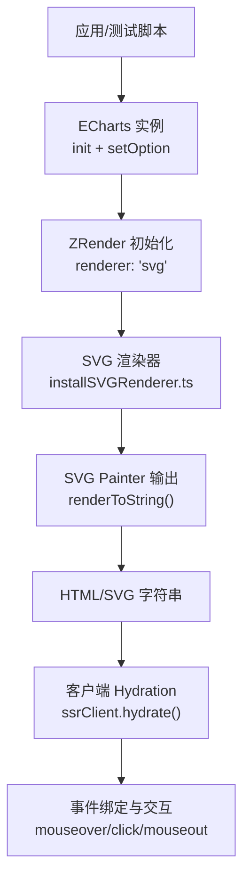
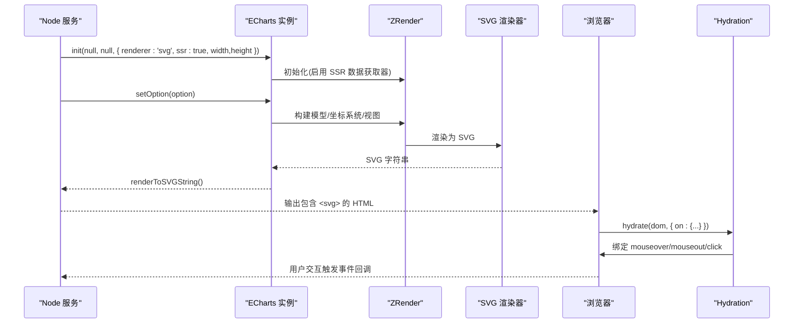
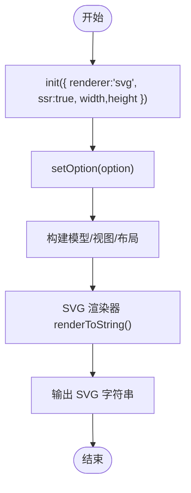
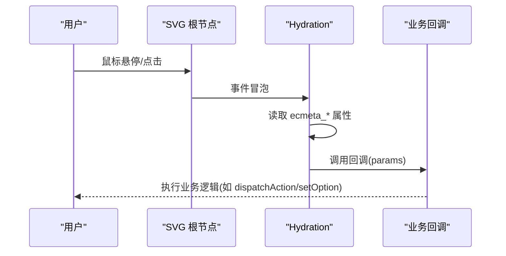
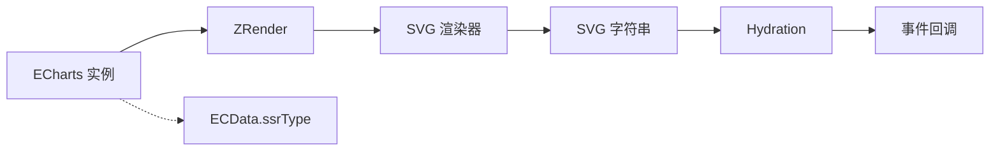

# 服务端渲染

<cite>
**本文引用的文件**
- [src/core/echarts.ts](file://src/core/echarts.ts)
- [src/renderer/installSVGRenderer.ts](file://src/renderer/installSVGRenderer.ts)
- [src/export/renderers.ts](file://src/export/renderers.ts)
- [src/util/innerStore.ts](file://src/util/innerStore.ts)
- [ssr/client/src/index.ts](file://ssr/client/src/index.ts)
- [test/node/ssr.js](file://test/node/ssr.js)
- [test/ssr.html](file://test/ssr.html)
- [test/svg-ssr.html](file://test/svg-ssr.html)
</cite>

## 目录
1. [简介](#简介)
2. [项目结构](#项目结构)
3. [核心组件](#核心组件)
4. [架构总览](#架构总览)
5. [详细组件分析](#详细组件分析)
6. [依赖关系分析](#依赖关系分析)
7. [性能考量](#性能考量)
8. [故障排查指南](#故障排查指南)
9. [结论](#结论)
10. [附录：完整示例与部署要点](#附录完整示例与部署要点)

## 简介
本文件系统性介绍 ECharts 在服务端渲染（SSR）环境下的能力与客户端集成方案。内容涵盖 Node.js 环境准备、依赖安装与模块导入；无 DOM 环境下生成 SVG 字符串的渲染原理；HTML 输出与静态资源处理；客户端 Hydration、事件绑定与动态更新；以及 SSR 的优势与限制、常见问题与优化建议。文末提供可运行的示例与部署指引，帮助快速落地。

## 项目结构
围绕 SSR 的关键代码分布在以下位置：
- 核心实例与渲染入口：src/core/echarts.ts
- 渲染器注册与选择：src/renderer/installSVGRenderer.ts、src/export/renderers.ts
- 元素元数据与 SSR 类型标记：src/util/innerStore.ts
- 客户端 Hydration 与事件桥接：ssr/client/src/index.ts
- Node 端示例与浏览器端演示：test/node/ssr.js、test/ssr.html、test/svg-ssr.html

图表来源
- [src/core/echarts.ts:555-580](file://src/core/echarts.ts#L555-L580)
- [src/renderer/installSVGRenderer.ts:20-25](file://src/renderer/installSVGRenderer.ts#L20-L25)
- [src/export/renderers.ts:20-21](file://src/export/renderers.ts#L20-L21)
- [ssr/client/src/index.ts:42-90](file://ssr/client/src/index.ts#L42-L90)

章节来源
- [src/core/echarts.ts:555-580](file://src/core/echarts.ts#L555-L580)
- [src/renderer/installSVGRenderer.ts:20-25](file://src/renderer/installSVGRenderer.ts#L20-L25)
- [src/export/renderers.ts:20-21](file://src/export/renderers.ts#L20-L21)
- [ssr/client/src/index.ts:42-90](file://ssr/client/src/index.ts#L42-L90)

## 核心组件
- ECharts 实例与 SSR 模式开关
  - 通过 init 配置项 ssr: true 开启 SSR 模式，并传入 width/height 以在无 DOM 环境中计算布局。
  - 在 SSR 模式下，ECharts 会向 ZRender 注册“SSR 数据获取器”，将 seriesIndex、dataIndex、ssrType 等元信息写入 SVG 节点属性，供客户端 Hydration 使用。
  - 在 SSR 模式下，setOption 后不会调用 flush，避免不必要的绘制开销。
- SVG 渲染器
  - 通过 installSVGRenderer 注册 SVG 渲染器，使 ECharts 能在无 DOM 环境下生成 SVG 字符串。
  - renderToSVGString 仅在 SVG 渲染器下可用，返回完整的 SVG 字符串。
- 客户端 Hydration
  - ssrClient.hydrate(dom, options) 查找根 SVG，遍历监听事件，读取 ecmeta_* 属性，将事件转发给上层业务逻辑。
- 元数据与类型标记
  - innerStore 定义 ECData 中的 ssrType，用于区分 legend/chart 等 SSR 元素类型。

章节来源
- [src/core/echarts.ts:555-580](file://src/core/echarts.ts#L555-L580)
- [src/core/echarts.ts:718-720](file://src/core/echarts.ts#L718-L720)
- [src/core/echarts.ts:773-812](file://src/core/echarts.ts#L773-L812)
- [src/core/echarts.ts:940-953](file://src/core/echarts.ts#L940-L953)
- [src/renderer/installSVGRenderer.ts:20-25](file://src/renderer/installSVGRenderer.ts#L20-L25)
- [src/export/renderers.ts:20-21](file://src/export/renderers.ts#L20-L21)
- [src/util/innerStore.ts:27-41](file://src/util/innerStore.ts#L27-L41)
- [ssr/client/src/index.ts:42-90](file://ssr/client/src/index.ts#L42-L90)

## 架构总览
下图展示了从服务端到客户端的完整链路：Node 端初始化 ECharts（SSR 模式），生成 SVG 字符串；浏览器端注入该 HTML，并通过 ssrClient.hydrate 完成事件绑定与交互。

图表来源
- [src/core/echarts.ts:555-580](file://src/core/echarts.ts#L555-L580)
- [src/core/echarts.ts:940-953](file://src/core/echarts.ts#L940-L953)
- [ssr/client/src/index.ts:42-90](file://ssr/client/src/index.ts#L42-L90)

## 详细组件分析

### 服务端渲染流程（无 DOM 环境）
- 初始化与配置
  - 在 Node 中通过 echarts.init(null, null, { renderer:'svg', ssr:true, width, height }) 创建实例。
  - 设置 option 后，ECharts 内部构建模型与视图，并在 SSR 模式下跳过 flush，减少不必要开销。
- 生成 SVG 字符串
  - 调用 renderToSVGString()，由 SVG 渲染器输出完整 SVG 字符串。
- 元数据注入
  - 在 SSR 模式下，ECharts 注册数据获取器，将 series_index、data_index、ssr_type 等写入 SVG 节点属性，便于客户端识别数据来源与类型。

图表来源
- [src/core/echarts.ts:555-580](file://src/core/echarts.ts#L555-L580)
- [src/core/echarts.ts:773-812](file://src/core/echarts.ts#L773-L812)
- [src/core/echarts.ts:940-953](file://src/core/echarts.ts#L940-L953)

章节来源
- [test/node/ssr.js:19-69](file://test/node/ssr.js#L19-L69)
- [src/core/echarts.ts:555-580](file://src/core/echarts.ts#L555-L580)
- [src/core/echarts.ts:773-812](file://src/core/echarts.ts#L773-L812)
- [src/core/echarts.ts:940-953](file://src/core/echarts.ts#L940-L953)

### 客户端 Hydration 与事件绑定
- Hydration 过程
  - 在浏览器中，ssrClient.hydrate(dom, options) 查找根 <svg>，若不存在则报错并中止。
  - 遍历配置的 on 事件（如 mouseover、mouseout、click），在 svgRoot 上统一监听。
- 事件分发与参数
  - 当事件冒泡至目标元素时，读取 ecmeta_ssr_type、ecmeta_series_index、ecmeta_data_index、ecmeta_silent 等属性，构造参数对象并调用对应回调。
  - 若元素标记为 silent 或没有 ssrType，则忽略事件，避免误触发。
- 与服务器交互
  - 可在回调中调用 serverChart.dispatchAction 或 setOption，再重新渲染并替换 DOM，实现“服务端驱动”的动态更新。

图表来源
- [ssr/client/src/index.ts:42-90](file://ssr/client/src/index.ts#L42-L90)

章节来源
- [ssr/client/src/index.ts:42-90](file://ssr/client/src/index.ts#L42-L90)
- [test/ssr.html:66-153](file://test/ssr.html#L66-L153)

### 元数据与类型标记
- 在 SSR 模式下，ECharts 将系列索引、数据索引与 ssrType（如 'legend'、'chart'）写入 SVG 节点属性，供客户端 Hydration 识别。
- innerStore 定义了 ECData 中的 ssrType 字段，配合 LegendView 等组件在渲染时设置 ssrType，确保客户端能正确区分元素类型。

章节来源
- [src/core/echarts.ts:555-568](file://src/core/echarts.ts#L555-L568)
- [src/util/innerStore.ts:27-41](file://src/util/innerStore.ts#L27-L41)

### 渲染器与导出
- SVG 渲染器通过 installSVGRenderer 注册，export/renderers.ts 暴露安装入口。
- renderToSVGString 仅支持 SVG 渲染器，否则抛出错误提示。

章节来源
- [src/renderer/installSVGRenderer.ts:20-25](file://src/renderer/installSVGRenderer.ts#L20-L25)
- [src/export/renderers.ts:20-21](file://src/export/renderers.ts#L20-L21)
- [src/core/echarts.ts:940-953](file://src/core/echarts.ts#L940-L953)

## 依赖关系分析
- ECharts 实例依赖 ZRender 进行图形渲染，SSR 模式下通过 SVG 渲染器输出字符串。
- 客户端 Hydration 依赖服务端输出的带有 ecmeta_* 属性的 SVG 结构。
- 组件（如图例）在 SSR 模式下会设置 ssrType，以便客户端识别。

图表来源
- [src/core/echarts.ts:555-580](file://src/core/echarts.ts#L555-L580)
- [src/renderer/installSVGRenderer.ts:20-25](file://src/renderer/installSVGRenderer.ts#L20-L25)
- [ssr/client/src/index.ts:42-90](file://ssr/client/src/index.ts#L42-L90)
- [src/util/innerStore.ts:27-41](file://src/util/innerStore.ts#L27-L41)

章节来源
- [src/core/echarts.ts:555-580](file://src/core/echarts.ts#L555-L580)
- [src/renderer/installSVGRenderer.ts:20-25](file://src/renderer/installSVGRenderer.ts#L20-L25)
- [ssr/client/src/index.ts:42-90](file://ssr/client/src/index.ts#L42-L90)
- [src/util/innerStore.ts:27-41](file://src/util/innerStore.ts#L27-L41)

## 性能考量
- 首屏性能提升
  - 服务端预渲染 SVG 字符串，减少客户端初始渲染耗时，利于 SEO 与首屏展示。
- 避免多余刷新
  - SSR 模式下不执行 flush，降低重复绘制成本。
- 大数据量渲染
  - 示例中对大量数据点进行渲染并测量时间，建议在服务端控制数据规模或使用采样/分页策略。
- 资源体积
  - SVG 字符串可能较大，需结合 CDN、压缩与按需加载策略。

[本节为通用指导，无需具体文件引用]

## 故障排查指南
- 未找到 SVG 根节点
  - 现象：Hydration 时报错提示未找到 SVG。
  - 原因：DOM 中未插入服务端输出的 <svg>。
  - 解决：确保先将 renderToSVGString() 的结果注入到目标容器。
- 事件无效或被忽略
  - 现象：hover/click 无响应。
  - 原因：元素缺少 ecmeta_ssr_type 或标记为 silent。
  - 解决：检查服务端是否启用 ssr 模式且组件是否正确设置 ssrType；确认 silent 配置。
- 渲染器不匹配
  - 现象：调用 renderToSVGString 报错。
  - 原因：未在 SSR 模式下使用 SVG 渲染器。
  - 解决：init 时指定 renderer: 'svg'。
- 动画与过渡
  - 现象：SSR 模式下动画行为与客户端不同。
  - 说明：部分动画在 SSR 下被调整或禁用，以保证静态输出一致性。

章节来源
- [ssr/client/src/index.ts:42-47](file://ssr/client/src/index.ts#L42-L47)
- [ssr/client/src/index.ts:75-87](file://ssr/client/src/index.ts#L75-L87)
- [src/core/echarts.ts:940-953](file://src/core/echarts.ts#L940-L953)
- [test/svg-ssr.html:139-158](file://test/svg-ssr.html#L139-L158)

## 结论
ECharts 的 SSR 方案通过 SVG 渲染器在无 DOM 环境下生成可复用的 SVG 字符串，并结合客户端 Hydration 完成事件绑定与交互。该方案提升了首屏性能与 SEO 友好性，同时保持与客户端一致的交互体验。合理的数据控制、资源优化与错误处理是落地的关键。

[本节为总结性内容，无需具体文件引用]

## 附录：完整示例与部署要点

### Node.js 环境准备与运行
- 安装依赖
  - 使用包管理器安装 ECharts 及构建工具（仓库已提供 dist 产物）。
- 运行示例
  - 参考 test/node/ssr.js：初始化 ECharts（renderer:'svg', ssr:true），设置 option，调用 renderToSVGString() 输出 SVG 字符串。

章节来源
- [test/node/ssr.js:19-69](file://test/node/ssr.js#L19-L69)

### 浏览器端集成与 Hydration
- 服务端输出
  - 将 renderToSVGString() 的结果注入页面容器。
- 客户端 Hydration
  - 引入 ssrClient.hydrate，传入容器与 on 事件回调，实现 hover/click 等交互。
- 动态更新
  - 在回调中调用 serverChart.dispatchAction 或 setOption，再次渲染并替换 DOM。

章节来源
- [test/ssr.html:66-153](file://test/ssr.html#L66-L153)
- [ssr/client/src/index.ts:42-90](file://ssr/client/src/index.ts#L42-L90)

### 部署与优化建议
- 缓存与 CDN
  - 对生成的 SVG 字符串进行缓存与 CDN 加速，减少重复渲染。
- 按需加载
  - 仅引入必要的图表与组件，减小打包体积。
- 安全与 XSS
  - 对服务端输出的 SVG 内容进行必要的安全校验与过滤。
- 兼容性
  - 确保目标浏览器支持 SVG 与相关事件模型；必要时降级策略。

[本节为通用指导，无需具体文件引用]