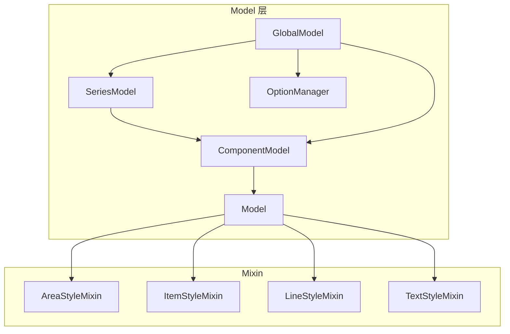
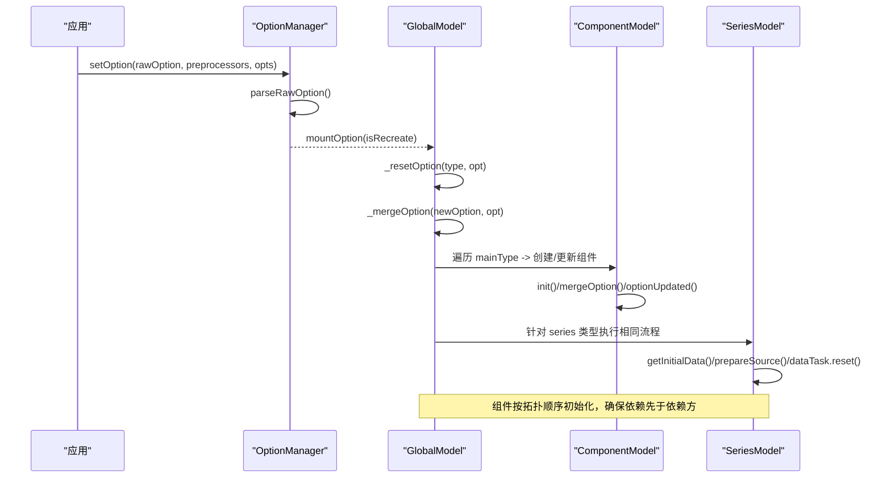
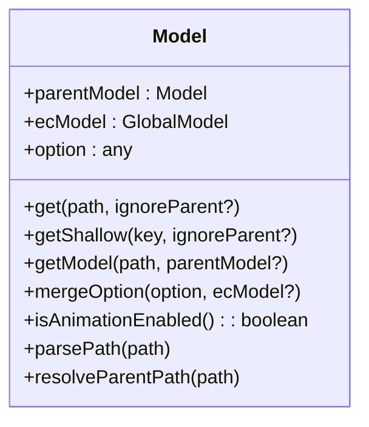
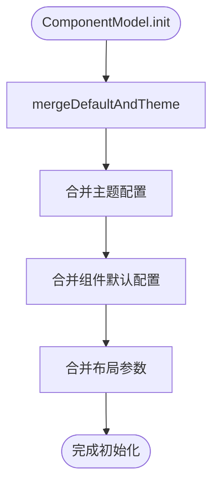
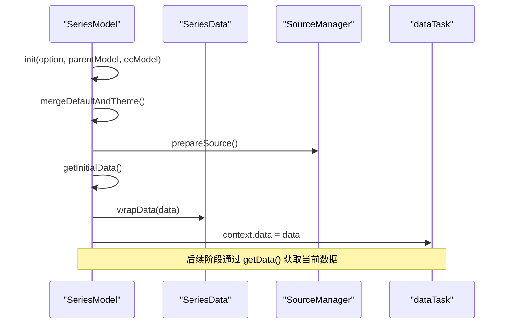
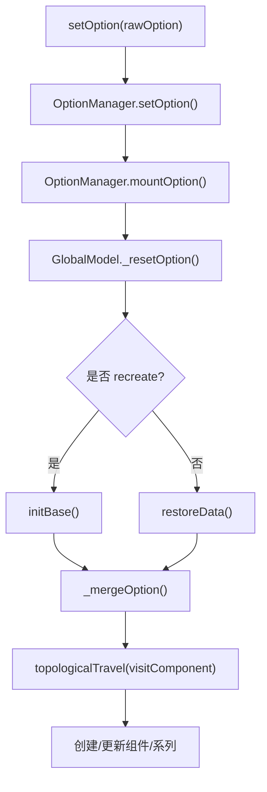
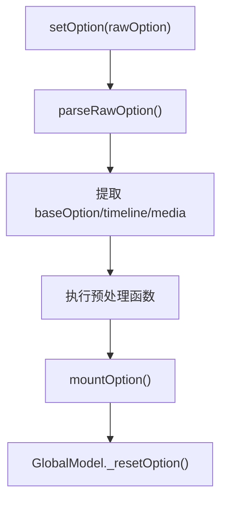
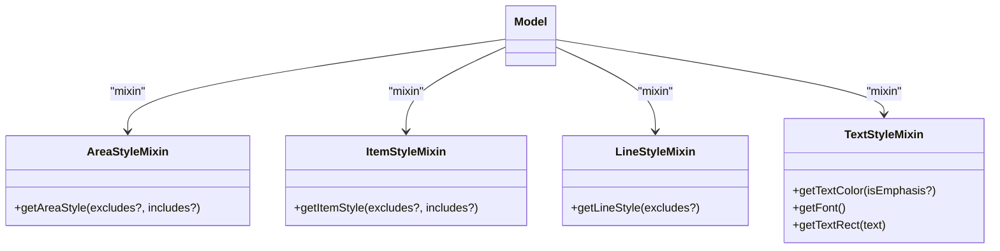

# Model 层

<cite>
**本文引用的文件**
- [Model.ts](file://src/model/Model.ts)
- [Component.ts](file://src/model/Component.ts)
- [Series.ts](file://src/model/Series.ts)
- [Global.ts](file://src/model/Global.ts)
- [OptionManager.ts](file://src/model/OptionManager.ts)
- [areaStyle.ts](file://src/model/mixin/areaStyle.ts)
- [textStyle.ts](file://src/model/mixin/textStyle.ts)
- [itemStyle.ts](file://src/model/mixin/itemStyle.ts)
- [lineStyle.ts](file://src/model/mixin/lineStyle.ts)
- [globalDefault.ts](file://src/model/globalDefault.ts)
</cite>

## 目录
1. [简介](#简介)
2. [项目结构](#项目结构)
3. [核心组件](#核心组件)
4. [架构总览](#架构总览)
5. [详细组件分析](#详细组件分析)
6. [依赖关系分析](#依赖关系分析)
7. [性能考量](#性能考量)
8. [故障排查指南](#故障排查指南)
9. [结论](#结论)
10. [附录：自定义 Model 开发指南与最佳实践](#附录自定义-model-开发指南与最佳实践)

## 简介
本章节面向希望深入理解 ECharts Model 层设计与实现的读者，系统阐述以下主题：
- ComponentModel 的基础能力与扩展点
- 如何创建自定义的 Model 类
- SeriesModel 的特殊性：数据管理、统计计算、视觉映射等
- GlobalModel 的全局配置管理与依赖注入机制
- 配置的解析、验证与默认值处理流程
- Model 之间的依赖关系与通信方式
- 自定义 Model 的开发指南与最佳实践（含代码示例路径）

## 项目结构
ECharts 的 Model 层位于 src/model 目录下，采用“基础抽象 + Mixin + 具体实现”的分层组织：
- 基础抽象
  - Model：提供通用的配置读取、继承链访问、动画开关等通用能力
  - ComponentModel：在 Model 之上增加组件生命周期、默认选项合并、布局参数、引用查询等能力
  - SeriesModel：在 ComponentModel 之上增强数据管线、可视化编码、选择状态、进度渲染等
- 全局与配置
  - GlobalModel：维护全局配置、主题、语言、组件实例集合、调度器注入等
  - OptionManager：负责原始配置的解析、预处理、时间线与媒体查询应用、挂载到 GlobalModel
- Mixin
  - areaStyle / itemStyle / lineStyle / textStyle：将样式相关能力以 Mixin 形式注入 Model，避免重复实现
- 默认配置
  - globalDefault：提供全局默认配置，如颜色、字体、动画阈值、渐进渲染阈值等

图表来源
- [Model.ts:46-259](file://src/model/Model.ts#L46-L259)
- [Component.ts:53-397](file://src/model/Component.ts#L53-L397)
- [Series.ts:149-847](file://src/model/Series.ts#L149-L847)
- [Global.ts:156-1101](file://src/model/Global.ts#L156-L1101)
- [OptionManager.ts:52-531](file://src/model/OptionManager.ts#L52-L531)
- [areaStyle.ts:46-57](file://src/model/mixin/areaStyle.ts#L46-L57)
- [itemStyle.ts:62-75](file://src/model/mixin/itemStyle.ts#L62-L75)
- [lineStyle.ts:59-71](file://src/model/mixin/lineStyle.ts#L59-L71)
- [textStyle.ts:41-83](file://src/model/mixin/textStyle.ts#L41-L83)

章节来源
- [Model.ts:46-259](file://src/model/Model.ts#L46-L259)
- [Component.ts:53-397](file://src/model/Component.ts#L53-L397)
- [Series.ts:149-847](file://src/model/Series.ts#L149-L847)
- [Global.ts:156-1101](file://src/model/Global.ts#L156-L1101)
- [OptionManager.ts:52-531](file://src/model/OptionManager.ts#L52-L531)

## 核心组件
本节聚焦 Model 层的核心职责与关键方法：
- Model
  - 配置读取：get/getShallow/getModel，支持路径解析与父级回退
  - 合并配置：mergeOption
  - 动画开关：isAnimationEnabled
  - 路径解析与父路径解析：parsePath/resolveParentPath
- ComponentModel
  - 初始化与合并：init/mergeDefaultAndTheme/mergeOption
  - 默认选项获取：getDefaultOption
  - 布局参数：getBoxLayoutParams
  - 引用查询：getReferringComponents
  - 层级控制：getZLevelKey/setZLevel
- SeriesModel
  - 数据任务：dataTask、getData/getRawData/setData
  - 数据源管理：SourceManager/Source
  - 视觉映射：visualStyleAccessPath/visualDrawType/visualStyleMapper
  - 选择状态：select/unselect/toggleSelect/getSelectedDataIndices/isSelected
  - 动画与渐进：isAnimationEnabled/getProgressive/getProgressiveThreshold
  - Tooltip 格式化：formatTooltip
- GlobalModel
  - 配置设置：setOption/resetOption/mergeOption
  - 组件管理：queryComponents/findComponents/eachComponent/getComponent
  - 系列管理：getSeries/getSeriesByIndex/getSeriesByName/getSeriesByType
  - 主题与语言：getTheme/getLocaleModel
  - 调度器注入：scheduler
- OptionManager
  - 原始配置解析：parseRawOption
  - 预处理：optionPreprocessorFuncs
  - 时间线与媒体查询：getTimelineOption/getMediaOption
  - 挂载配置：mountOption

章节来源
- [Model.ts:82-259](file://src/model/Model.ts#L82-L259)
- [Component.ts:160-397](file://src/model/Component.ts#L160-L397)
- [Series.ts:225-847](file://src/model/Series.ts#L225-L847)
- [Global.ts:216-1101](file://src/model/Global.ts#L216-L1101)
- [OptionManager.ts:87-531](file://src/model/OptionManager.ts#L87-L531)

## 架构总览
下图展示了从用户调用 setOption 到各 Model 被创建与更新的完整流程，以及 Model 之间的依赖关系。

图表来源
- [OptionManager.ts:87-169](file://src/model/OptionManager.ts#L87-L169)
- [Global.ts:216-512](file://src/model/Global.ts#L216-L512)
- [Component.ts:160-196](file://src/model/Component.ts#L160-L196)
- [Series.ts:225-328](file://src/model/Series.ts#L225-L328)

## 详细组件分析

### Model：基础配置模型
- 功能要点
  - 配置读取：支持字符串路径或数组路径；当 ignoreParent 为 false 时，若当前未命中则沿 parentModel 回溯查找
  - 子模型获取：getModel 返回一个新的 Model 实例，便于嵌套配置的结构化访问
  - 浅读：getShallow 仅读取自身 option，不向上查找
  - 动画开关：isAnimationEnabled 根据环境（Node/浏览器）与配置决定
- 设计模式
  - 组合与委托：通过 parentModel 形成配置树，支持继承式覆盖
  - Mixin：混入样式能力（线条、项、区域、文本），使 Model 具备统一的样式访问接口

图表来源
- [Model.ts:46-259](file://src/model/Model.ts#L46-L259)

章节来源
- [Model.ts:82-259](file://src/model/Model.ts#L82-L259)

### ComponentModel：组件模型基类
- 功能要点
  - 生命周期：init 中调用 mergeDefaultAndTheme，随后由框架调用 optionUpdated
  - 默认选项合并：优先主题，再合并组件自身 defaultOption，最后合并布局参数
  - 布局参数：支持 box 布局（left/right/top/bottom/width/height）
  - 引用查询：getReferringComponents 用于 axis/grid/legend 等相互引用
  - 层级控制：getZLevelKey/setZLevel 控制 z/zlevel 自动分配
- 扩展点
  - 重写 getDefaultOption 定义默认配置
  - 重写 mergeDefaultAndTheme 定制默认合并策略
  - 重写 optionUpdated 监听配置变更
  - 声明 dependencies 指定依赖主类型

图表来源
- [Component.ts:160-196](file://src/model/Component.ts#L160-L196)

章节来源
- [Component.ts:160-397](file://src/model/Component.ts#L160-L397)

### SeriesModel：系列模型（数据与视觉）
- 数据管理
  - 数据任务：dataTask 负责数据准备与流水线上下文；getData/getRawData/setData 管理当前与原始数据
  - 数据源：SourceManager/Source 负责从 option.dataset 或 series.data 构建统一数据源
  - 追加数据：appendData 支持动态追加
- 视觉映射
  - visualStyleAccessPath/visualDrawType/visualStyleMapper 控制样式映射规则
  - getColorFromPalette 从调色板取色
- 选择状态
  - select/unselect/toggleSelect/getSelectedDataIndices/isSelected 支持单/多/全选模式
- 动画与渐进
  - isAnimationEnabled 考虑 Node 环境与 animationThreshold
  - getProgressive/getProgressiveThreshold 控制渐进渲染步长与阈值
- Tooltip
  - formatTooltip 提供默认格式化逻辑

图表来源
- [Series.ts:225-328](file://src/model/Series.ts#L225-L328)

章节来源
- [Series.ts:225-847](file://src/model/Series.ts#L225-L847)

### GlobalModel：全局配置与依赖注入
- 配置管理
  - setOption/resetOption/mergeOption：统一入口，内部调用 _mergeOption 进行组件级合并与重建
  - 组件拓扑：topologicalTravel 保证依赖先于依赖方初始化
  - 输出清理：getOption 移除内部组件与标记
- 组件与系列查询
  - queryComponents/findComponents/eachComponent：灵活查询组件列表
  - getSeries/getSeriesByIndex/getSeriesByName/getSeriesByType：系列管理
- 主题与语言
  - getTheme/getLocaleModel：提供主题与国际化模型
- 调度器注入
  - scheduler：外部注入，驱动渲染与数据处理流水线

图表来源
- [Global.ts:216-512](file://src/model/Global.ts#L216-L512)
- [OptionManager.ts:87-169](file://src/model/OptionManager.ts#L87-L169)

章节来源
- [Global.ts:216-1101](file://src/model/Global.ts#L216-L1101)
- [OptionManager.ts:87-169](file://src/model/OptionManager.ts#L87-L169)

### OptionManager：配置解析与预处理
- 解析流程
  - parseRawOption：识别 baseOption、timeline、media、options 等结构
  - 预处理：optionPreprocessorFuncs 对每个单元选项执行预处理
  - 媒体查询：applyMediaQuery 根据宽高与比例匹配 media 配置
- 挂载与恢复
  - mountOption：返回克隆后的 baseOption 供 GlobalModel 使用
  - getTimelineOption/getMediaOption：根据当前 timeline/media 状态返回对应配置

图表来源
- [OptionManager.ts:87-169](file://src/model/OptionManager.ts#L87-L169)
- [OptionManager.ts:294-378](file://src/model/OptionManager.ts#L294-L378)

章节来源
- [OptionManager.ts:87-169](file://src/model/OptionManager.ts#L87-L169)
- [OptionManager.ts:294-378](file://src/model/OptionManager.ts#L294-L378)

### 样式 Mixin：统一样式访问
- AreaStyleMixin：提供 getAreaStyle，映射 fill/shadow/opacity 等属性
- ItemStyleMixin：提供 getItemStyle，映射填充、描边、阴影、虚线等
- LineStyleMixin：提供 getLineStyle，映射线条宽度、颜色、透明度、虚线等
- TextStyleMixin：提供 getTextColor/getFont/getTextRect，统一文本样式与度量

图表来源
- [areaStyle.ts:46-57](file://src/model/mixin/areaStyle.ts#L46-L57)
- [itemStyle.ts:62-75](file://src/model/mixin/itemStyle.ts#L62-L75)
- [lineStyle.ts:59-71](file://src/model/mixin/lineStyle.ts#L59-L71)
- [textStyle.ts:41-83](file://src/model/mixin/textStyle.ts#L41-L83)

章节来源
- [areaStyle.ts:46-57](file://src/model/mixin/areaStyle.ts#L46-L57)
- [itemStyle.ts:62-75](file://src/model/mixin/itemStyle.ts#L62-L75)
- [lineStyle.ts:59-71](file://src/model/mixin/lineStyle.ts#L59-L71)
- [textStyle.ts:41-83](file://src/model/mixin/textStyle.ts#L41-L83)

## 依赖关系分析
- 组件依赖
  - ComponentModel 通过 static dependencies 声明依赖的主类型，框架在 topologicalTravel 中确保依赖先于依赖方初始化
  - dataset 作为通用依赖被自动注入（除非组件类型为 dataset）
- 系列与坐标轴/网格
  - SeriesModel 通过 getReferringComponents 查询 axis/grid/legend 等组件，实现联动与视觉映射
- 全局与调度
  - GlobalModel 注入 scheduler，驱动数据与渲染流水线；SeriesModel 的 dataTask 由调度器协调执行

图表来源
- [Component.ts:376-393](file://src/model/Component.ts#L376-L393)
- [Global.ts:195-214](file://src/model/Global.ts#L195-L214)
- [Series.ts:225-243](file://src/model/Series.ts#L225-L243)

章节来源
- [Component.ts:376-393](file://src/model/Component.ts#L376-L393)
- [Global.ts:195-214](file://src/model/Global.ts#L195-L214)
- [Series.ts:225-243](file://src/model/Series.ts#L225-L243)

## 性能考量
- 数据任务与流水线
  - SeriesModel 使用 dataTask 与 PipelineContext，避免在 model 初始化阶段直接调用 getData，防止数据尚未就绪导致的副作用
  - setData 仅在任务上下文中更新 outputData，保证流式处理的正确性
- 动画与渐进渲染
  - isAnimationEnabled 在 Node 环境下默认禁用动画；大数据量时依据 animationThreshold 关闭动画
  - getProgressive/getProgressiveThreshold 控制渐进渲染步数与阈值，提升大数据场景下的交互性能
- 样式与文本度量
  - TextStyleMixin 复用临时文本对象以减少对象创建开销
- 配置合并与克隆
  - OptionManager 在 setOption 时对数据进行 clone，避免重复修改带来的副作用

[本节为通用性能讨论，不直接分析具体文件]

## 故障排查指南
- 组件缺失报错
  - 当使用了未导入的内置组件或系列时，GlobalModel 会打印错误提示，指引引入对应模块
- 媒体查询与时间线
  - OptionManager 的媒体查询基于宽高与比例匹配，若未生效请检查 query 配置格式
  - 时间线选项不支持 notMerge，避免多次 setOption 导致的状态不一致
- 数据任务上下文
  - 若在 model 初始化阶段调用 getData，可能得到未就绪的数据；应使用 getRawData 或在任务回调中操作

章节来源
- [Global.ts:142-154](file://src/model/Global.ts#L142-L154)
- [Global.ts:421-437](file://src/model/Global.ts#L421-L437)
- [OptionManager.ts:135-149](file://src/model/OptionManager.ts#L135-L149)
- [Series.ts:256-265](file://src/model/Series.ts#L256-L265)

## 结论
ECharts 的 Model 层通过清晰的层次结构与可扩展的 Mixin 机制，提供了强大的配置管理、数据管线与视觉映射能力。ComponentModel 奠定了组件生命周期与默认配置合并的基础，SeriesModel 在此基础上实现了复杂的数据与视觉处理，GlobalModel 与 OptionManager 协同完成全局配置解析与依赖注入。遵循本文档的流程与最佳实践，可以高效地扩展与定制 Model，满足多样化业务需求。

[本节为总结性内容，不直接分析具体文件]

## 附录：自定义 Model 开发指南与最佳实践

### 如何创建自定义 ComponentModel
- 步骤
  - 定义默认配置：在子类上声明 static defaultOption
  - 注册组件：使用 ComponentModel.registerClass 注册
  - 生命周期：如需自定义合并策略，重写 mergeDefaultAndTheme；如需监听配置变更，重写 optionUpdated
  - 依赖声明：通过 static dependencies 声明依赖的主类型
- 参考路径
  - 默认选项获取与合并：[Component.ts:252-283](file://src/model/Component.ts#L252-L283)
  - 组件注册与拓扑旅行：[Component.ts:356-393](file://src/model/Component.ts#L356-L393)

章节来源
- [Component.ts:252-283](file://src/model/Component.ts#L252-L283)
- [Component.ts:356-393](file://src/model/Component.ts#L356-L393)

### 如何创建自定义 SeriesModel
- 步骤
  - 继承 SeriesModel，实现 getInitialData 以从 option 构建 SeriesData
  - 如需自定义数据流水线，可在 dataTask 的 reset 中处理数据转换
  - 使用 SourceManager 管理数据源，必要时重写 prepareSource
  - 配置视觉映射：设置 visualStyleAccessPath/visualDrawType/visualStyleMapper
  - 支持选择：实现 select/unselect/toggleSelect 等选择逻辑
- 参考路径
  - 数据初始化与任务：[Series.ts:225-328](file://src/model/Series.ts#L225-L328)
  - 数据访问与设置：[Series.ts:369-417](file://src/model/Series.ts#L369-L417)
  - 选择状态管理：[Series.ts:602-741](file://src/model/Series.ts#L602-L741)

章节来源
- [Series.ts:225-328](file://src/model/Series.ts#L225-L328)
- [Series.ts:369-417](file://src/model/Series.ts#L369-L417)
- [Series.ts:602-741](file://src/model/Series.ts#L602-L741)

### 配置解析、验证与默认值处理流程
- 解析
  - OptionManager.parseRawOption 解析 baseOption、timeline、media
  - 预处理函数可对配置进行校验与转换
- 验证
  - GlobalModel 在 setOption 时检查组件是否已导入，未导入则打印错误
- 默认值
  - ComponentModel.mergeDefaultAndTheme 合并主题与组件默认配置
  - globalDefault 提供全局默认配置（颜色、字体、动画阈值等）
- 参考路径
  - 解析与预处理：[OptionManager.ts:294-378](file://src/model/OptionManager.ts#L294-L378)
  - 组件缺失检查：[Global.ts:142-154](file://src/model/Global.ts#L142-L154)
  - 默认配置：[globalDefault.ts:34-128](file://src/model/globalDefault.ts#L34-L128)

章节来源
- [OptionManager.ts:294-378](file://src/model/OptionManager.ts#L294-L378)
- [Global.ts:142-154](file://src/model/Global.ts#L142-L154)
- [globalDefault.ts:34-128](file://src/model/globalDefault.ts#L34-L128)

### Model 之间的依赖关系与通信方式
- 依赖关系
  - ComponentModel.dependencies 声明主类型依赖，框架通过 topologicalTravel 确保顺序
  - dataset 作为通用依赖自动注入
- 通信方式
  - getReferringComponents：组件间通过 index/id/name 互相引用
  - GlobalModel.queryComponents/findComponents：集中查询与管理组件实例
  - Scheduler：通过注入的调度器协调数据与渲染任务
- 参考路径
  - 依赖收集：[Component.ts:376-393](file://src/model/Component.ts#L376-L393)
  - 组件查询：[Global.ts:572-748](file://src/model/Global.ts#L572-L748)
  - 调度器注入：[Global.ts:195-214](file://src/model/Global.ts#L195-L214)

章节来源
- [Component.ts:376-393](file://src/model/Component.ts#L376-L393)
- [Global.ts:572-748](file://src/model/Global.ts#L572-L748)
- [Global.ts:195-214](file://src/model/Global.ts#L195-L214)

### 代码示例路径（不直接展示代码内容）
- 自定义 ComponentModel 的默认选项与合并策略
  - [Component.ts:252-283](file://src/model/Component.ts#L252-L283)
- 自定义 SeriesModel 的数据初始化与任务重置
  - [Series.ts:225-328](file://src/model/Series.ts#L225-L328)
- 样式 Mixin 的使用（线条、项、区域、文本）
  - [lineStyle.ts:59-71](file://src/model/mixin/lineStyle.ts#L59-L71)
  - [itemStyle.ts:62-75](file://src/model/mixin/itemStyle.ts#L62-L75)
  - [areaStyle.ts:46-57](file://src/model/mixin/areaStyle.ts#L46-L57)
  - [textStyle.ts:41-83](file://src/model/mixin/textStyle.ts#L41-L83)

[本节为示例路径汇总，不直接分析具体文件]