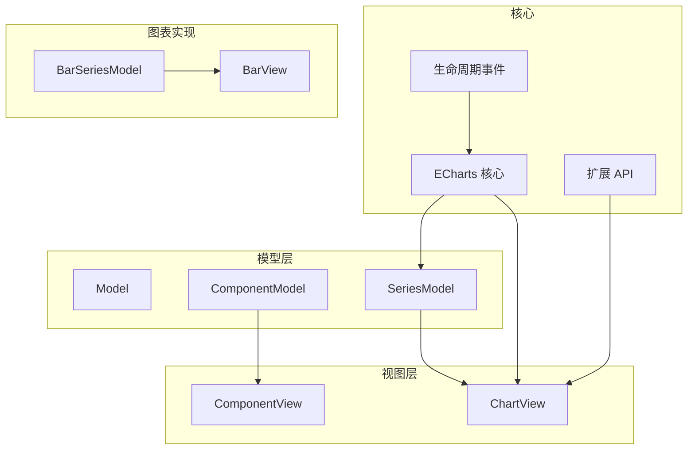
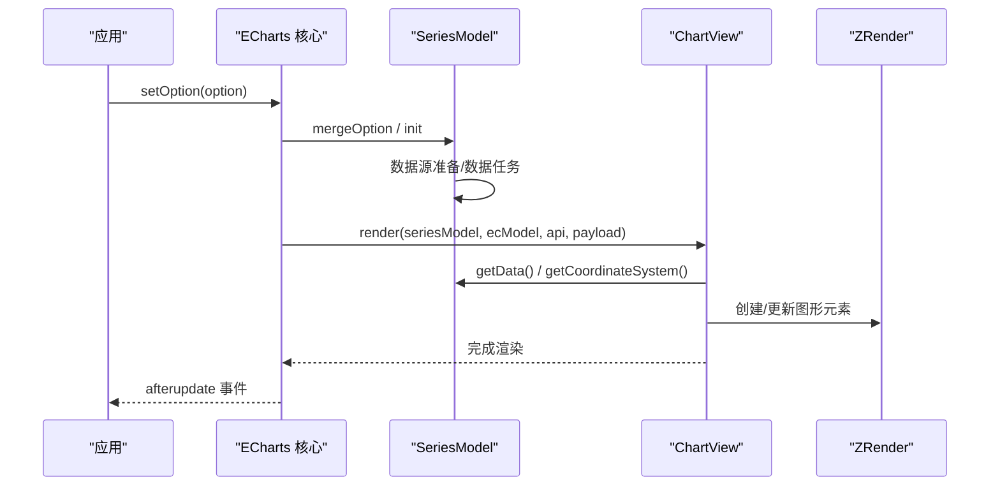
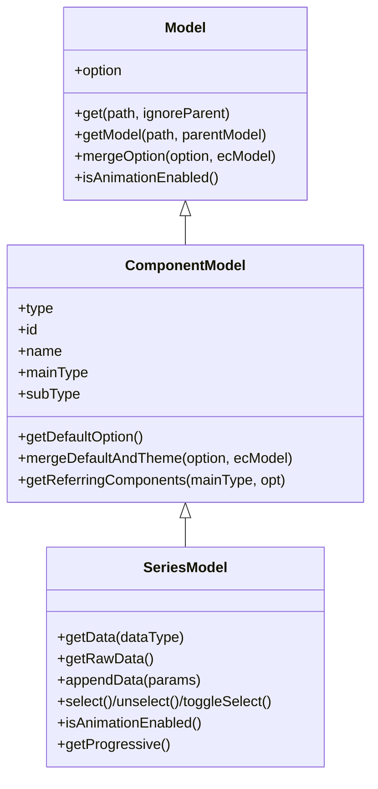
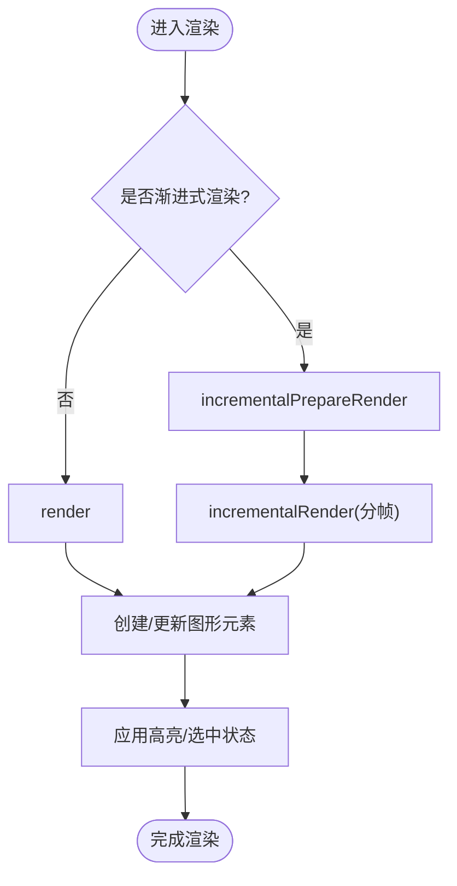
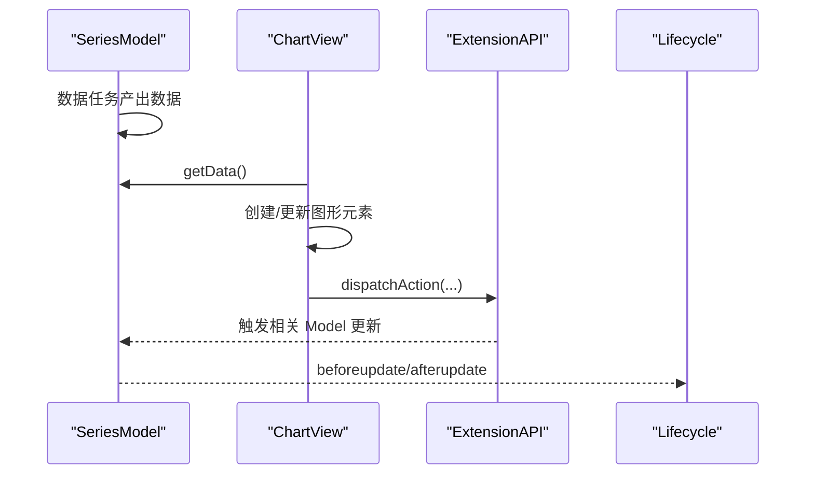
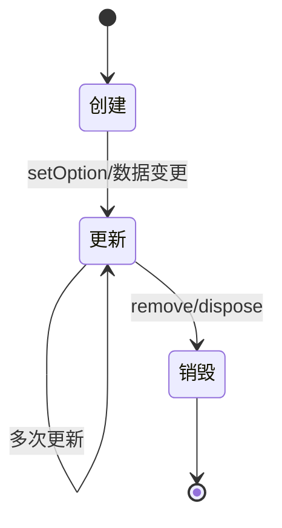
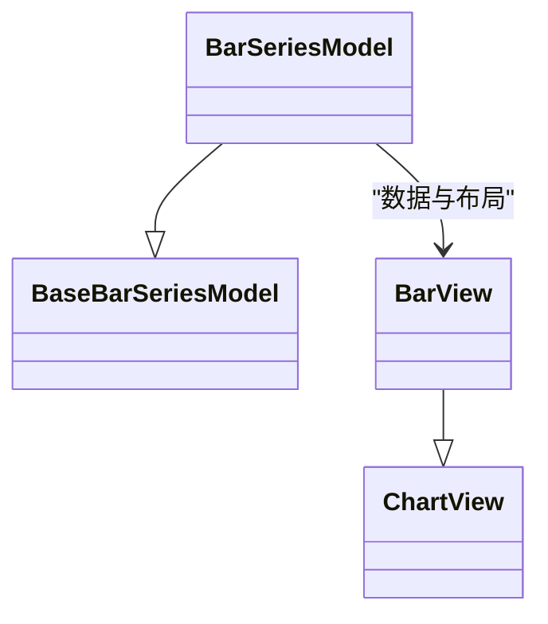
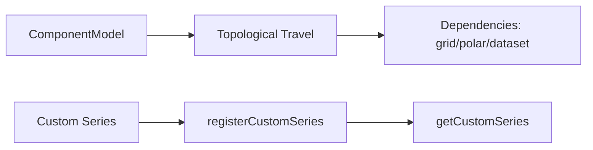
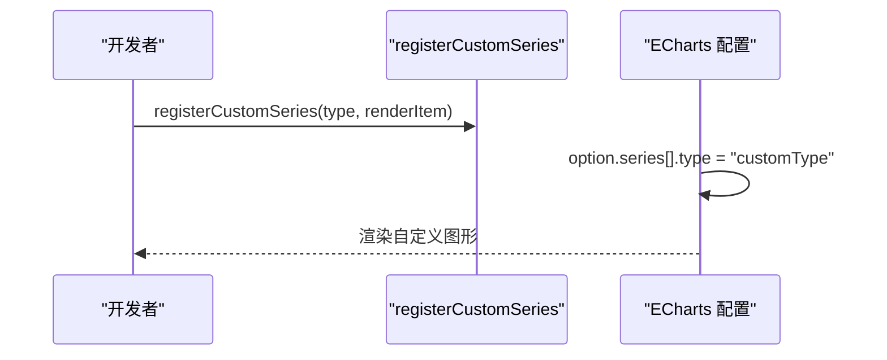

# Model-View 架构

<cite>
**本文引用的文件**
- [Model.ts](file://src/model/Model.ts)
- [Component.ts](file://src/model/Component.ts)
- [Series.ts](file://src/model/Series.ts)
- [Chart.ts](file://src/view/Chart.ts)
- [Component.ts](file://src/view/Component.ts)
- [BarSeries.ts](file://src/chart/bar/BarSeries.ts)
- [BarView.ts](file://src/chart/bar/BarView.ts)
- [lifecycle.ts](file://src/core/lifecycle.ts)
- [echarts.ts](file://src/core/echarts.ts)
- [customSeriesRegister.ts](file://src/chart/custom/customSeriesRegister.ts)
- [component.ts](file://src/util/component.ts)
</cite>

## 目录
1. [简介](#简介)
2. [项目结构](#项目结构)
3. [核心组件](#核心组件)
4. [架构总览](#架构总览)
5. [详细组件分析](#详细组件分析)
6. [依赖关系分析](#依赖关系分析)
7. [性能考量](#性能考量)
8. [故障排查指南](#故障排查指南)
9. [结论](#结论)
10. [附录：自定义组件开发示例](#附录自定义组件开发示例)

## 简介
本文件系统性阐述 ECharts 的 Model-View 分离架构设计模式，聚焦以下目标：
- 明确 Model 层职责：配置管理、数据处理、状态维护。
- 明确 View 层职责：图形渲染、交互处理、动画效果等视觉表现。
- 解释 Model 与 View 之间的通信机制和数据同步方式。
- 说明组件生命周期（创建、更新、销毁）中 Model-View 的协作流程。
- 讲解如何通过继承与组合构建复杂图表组件。
- 提供自定义组件开发的完整示例，展示 Model-View 模式的实际应用。

## 项目结构
ECharts 的核心分层清晰：
- model：负责配置解析、默认值合并、主题注入、数据源管理与数据任务编排、选择态与样式映射等。
- view：负责基于 Model 的数据与布局信息生成 ZRender 图形元素，处理高亮/选中、动画、增量渲染等。
- core：调度器、生命周期事件、全局入口、扩展 API 等。
- chart：具体图表类型（如 bar、line、pie）的 Model 与 View 实现。
- util：通用工具（类扩展、拓扑遍历、组件注册等）。

**图示来源**
- [Model.ts:46-260](file://src/model/Model.ts#L46-L260)
- [Component.ts:53-397](file://src/model/Component.ts#L53-L397)
- [Series.ts:149-800](file://src/model/Series.ts#L149-L800)
- [Chart.ts:98-323](file://src/view/Chart.ts#L98-L323)
- [Component.ts:64-143](file://src/view/Component.ts#L64-L143)
- [BarSeries.ts:100-178](file://src/chart/bar/BarSeries.ts#L100-L178)
- [BarView.ts:98-800](file://src/chart/bar/BarView.ts#L98-L800)
- [lifecycle.ts:28-74](file://src/core/lifecycle.ts#L28-L74)
- [echarts.ts:130-145](file://src/core/echarts.ts#L130-L145)

**章节来源**
- [Model.ts:46-260](file://src/model/Model.ts#L46-L260)
- [Component.ts:53-397](file://src/model/Component.ts#L53-L397)
- [Series.ts:149-800](file://src/model/Series.ts#L149-L800)
- [Chart.ts:98-323](file://src/view/Chart.ts#L98-L323)
- [Component.ts:64-143](file://src/view/Component.ts#L64-L143)
- [BarSeries.ts:100-178](file://src/chart/bar/BarSeries.ts#L100-L178)
- [BarView.ts:98-800](file://src/chart/bar/BarView.ts#L98-L800)
- [lifecycle.ts:28-74](file://src/core/lifecycle.ts#L28-L74)
- [echarts.ts:130-145](file://src/core/echarts.ts#L130-L145)

## 核心组件
- Model 基类：提供配置读取、路径解析、父级继承、动画开关判断、克隆与合并能力。
- ComponentModel：在 Model 基础上增加组件类型标识、默认选项合并、布局参数合并、引用组件查询等。
- SeriesModel：面向数据序列的 Model，封装数据源管理、数据任务、可视化映射、选择态、渐进式渲染上下文等。
- ChartView：图表视图基类，定义渲染、高亮/淡化、移除、增量渲染接口，以及渲染任务计划与进度执行。
- ComponentView：通用组件视图基类，提供组容器、事件过滤、查找高亮分发器等能力。

**章节来源**
- [Model.ts:46-260](file://src/model/Model.ts#L46-L260)
- [Component.ts:53-397](file://src/model/Component.ts#L53-L397)
- [Series.ts:149-800](file://src/model/Series.ts#L149-L800)
- [Chart.ts:98-323](file://src/view/Chart.ts#L98-L323)
- [Component.ts:64-143](file://src/view/Component.ts#L64-L143)

## 架构总览
ECharts 采用“数据驱动 + 视图解耦”的 Model-View 模式：
- Model 层专注“数据与配置”，不直接操作 DOM/Canvas；通过数据任务管道产出可视化的数据与布局。
- View 层专注“呈现与交互”，从 Model 获取数据与布局，使用 ZRender 绘制图形，并响应交互事件。
- 核心调度器协调 Model 与 View 的生命周期，触发渲染任务、过渡动画、全局/局部更新。

**图示来源**
- [echarts.ts:130-145](file://src/core/echarts.ts#L130-L145)
- [Series.ts:225-328](file://src/model/Series.ts#L225-L328)
- [Chart.ts:151-197](file://src/view/Chart.ts#L151-L197)
- [lifecycle.ts:55-65](file://src/core/lifecycle.ts#L55-L65)

## 详细组件分析

### Model 层职责与实现
- 配置管理：
  - 支持路径访问与父级继承，统一读取配置项。
  - 合并默认选项与主题，保证配置一致性。
- 数据处理：
  - SeriesModel 管理数据源与数据任务，支持数据预处理、采样、堆叠、过滤等。
  - 提供 getData/getRawData 等方法，区分原始数据与处理后数据。
- 状态维护：
  - 选择态（select/unselect/toggleSelect）、高亮态、动画开关、渐进式渲染上下文等。
  - 颜色、符号、标签等视觉映射规则由 Model 暴露给 View。

**图示来源**
- [Model.ts:46-260](file://src/model/Model.ts#L46-L260)
- [Component.ts:53-397](file://src/model/Component.ts#L53-L397)
- [Series.ts:149-800](file://src/model/Series.ts#L149-L800)

**章节来源**
- [Model.ts:46-260](file://src/model/Model.ts#L46-L260)
- [Component.ts:53-397](file://src/model/Component.ts#L53-L397)
- [Series.ts:149-800](file://src/model/Series.ts#L149-L800)

### View 层职责与实现
- 图形渲染：
  - ChartView 提供 render/updateView/updateVisual 等接口，子类实现具体绘制逻辑。
  - 支持普通渲染与渐进式渲染（incrementalPrepareRender/incrementalRender）。
- 交互处理：
  - highlight/downplay 方法统一处理高亮/淡化状态。
  - 支持事件过滤与查找高亮分发器，便于联动与跨组件交互。
- 动画效果：
  - 根据 Model 的动画开关与阈值控制动画启用。
  - 结合 ZRender 的图形属性更新实现平滑过渡。

**图示来源**
- [Chart.ts:151-197](file://src/view/Chart.ts#L151-L197)
- [Chart.ts:271-323](file://src/view/Chart.ts#L271-L323)

**章节来源**
- [Chart.ts:98-323](file://src/view/Chart.ts#L98-L323)
- [Component.ts:64-143](file://src/view/Component.ts#L64-L143)

### Model 与 View 的通信与数据同步
- 数据流：
  - Model 通过数据任务产出 SeriesData，View 调用 seriesModel.getData() 获取当前数据。
  - View 根据坐标系统与布局计算结果，创建/更新 ZRender 图形元素。
- 状态同步：
  - 选择态与高亮态由 Model 维护，View 在渲染时读取并应用到图形元素。
  - 通过 ExtensionAPI 派发/监听动作，实现跨组件联动（如轴序变化、数据缩放）。
- 生命周期事件：
  - 核心在关键阶段触发 lifecycle 事件（series:beforeupdate、series:afterupdate 等），供外部订阅。

**图示来源**
- [Series.ts:225-328](file://src/model/Series.ts#L225-L328)
- [Chart.ts:151-197](file://src/view/Chart.ts#L151-L197)
- [lifecycle.ts:55-65](file://src/core/lifecycle.ts#L55-L65)

**章节来源**
- [Series.ts:225-328](file://src/model/Series.ts#L225-L328)
- [Chart.ts:151-197](file://src/view/Chart.ts#L151-L197)
- [lifecycle.ts:55-65](file://src/core/lifecycle.ts#L55-L65)

### 组件生命周期管理（创建、更新、销毁）
- 创建：
  - Model 初始化时合并默认选项与主题，准备数据源与数据任务。
  - View 初始化时创建根 Group，绑定渲染任务。
- 更新：
  - Model.mergeOption 后标记数据任务脏，重新计算数据。
  - View 根据 payload 决定调用 render/updateView/updateVisual 或渐进式渲染。
- 销毁：
  - View.remove/dispose 清理图形元素与监听器，释放资源。

**图示来源**
- [Series.ts:225-328](file://src/model/Series.ts#L225-L328)
- [Chart.ts:185-197](file://src/view/Chart.ts#L185-L197)
- [Chart.ts:271-323](file://src/view/Chart.ts#L271-L323)

**章节来源**
- [Series.ts:225-328](file://src/model/Series.ts#L225-L328)
- [Chart.ts:185-197](file://src/view/Chart.ts#L185-L197)
- [Chart.ts:271-323](file://src/view/Chart.ts#L271-L323)

### 通过继承与组合构建复杂图表组件
- 继承：
  - BarSeriesModel 继承 BaseBarSeriesModel，复用柱状图通用逻辑。
  - BarView 继承 ChartView，实现柱状图的具体渲染。
- 组合：
  - 通过坐标系统（cartesian2d/polar）组合不同布局与裁剪策略。
  - 通过视觉映射（颜色、符号、标签）组合样式与数据维度。

**图示来源**
- [BarSeries.ts:100-178](file://src/chart/bar/BarSeries.ts#L100-L178)
- [BarView.ts:98-800](file://src/chart/bar/BarView.ts#L98-L800)

**章节来源**
- [BarSeries.ts:100-178](file://src/chart/bar/BarSeries.ts#L100-L178)
- [BarView.ts:98-800](file://src/chart/bar/BarView.ts#L98-L800)

## 依赖关系分析
- 组件依赖拓扑：
  - ComponentModel 支持拓扑遍历，确保依赖顺序正确（如 dataset、grid、polar 等）。
- 模块耦合：
  - Model 与 View 通过 ExtensionAPI 松耦合通信，避免直接依赖。
  - 图表类型通过注册机制（如 customSeriesRegister）扩展，降低核心代码复杂度。

**图示来源**
- [component.ts:107-200](file://src/util/component.ts#L107-L200)
- [customSeriesRegister.ts:22-31](file://src/chart/custom/customSeriesRegister.ts#L22-L31)

**章节来源**
- [component.ts:107-200](file://src/util/component.ts#L107-L200)
- [customSeriesRegister.ts:22-31](file://src/chart/custom/customSeriesRegister.ts#L22-L31)

## 性能考量
- 渐进式渲染：
  - 大数据量场景下，View 支持 incrementalPrepareRender/incrementalRender，分帧渲染提升交互流畅度。
- 动画阈值：
  - Model.isAnimationEnabled 根据数据量与配置动态禁用动画，避免卡顿。
- 裁剪与可见性：
  - View 对超出坐标区域的数据进行裁剪，减少无效绘制。
- 任务调度：
  - 数据任务与渲染任务分离，避免阻塞主线程。

[本节为通用性能指导，无需特定文件来源]

## 故障排查指南
- 常见问题定位：
  - 若渲染异常，检查 Model 的数据任务是否正确产出数据（getData 返回值）。
  - 若交互无响应，确认 View 的事件过滤与高亮分发器实现。
  - 若动画异常，检查 Model 的动画开关与阈值设置。
- 日志与断言：
  - 开发模式下，核心会进行断言与错误提示，便于快速定位问题。

**章节来源**
- [Chart.ts:151-197](file://src/view/Chart.ts#L151-L197)
- [echarts.ts:130-145](file://src/core/echarts.ts#L130-L145)

## 结论
ECharts 的 Model-View 分离架构通过清晰的职责划分与松耦合通信，实现了高性能、可扩展的图表渲染体系。Model 专注于数据与配置，View 专注于呈现与交互，核心调度器协调生命周期与事件，使得复杂图表组件可通过继承与组合灵活构建。

[本节为总结性内容，无需特定文件来源]

## 附录：自定义组件开发示例
以下示例展示如何基于 Model-View 模式开发自定义系列组件：

- 步骤概览：
  - 定义自定义渲染函数（CustomSeriesRenderItem）。
  - 注册自定义系列类型（registerCustomSeries）。
  - 在配置中使用 type 指定自定义系列。

**图示来源**
- [customSeriesRegister.ts:22-31](file://src/chart/custom/customSeriesRegister.ts#L22-L31)

**章节来源**
- [customSeriesRegister.ts:22-31](file://src/chart/custom/customSeriesRegister.ts#L22-L31)