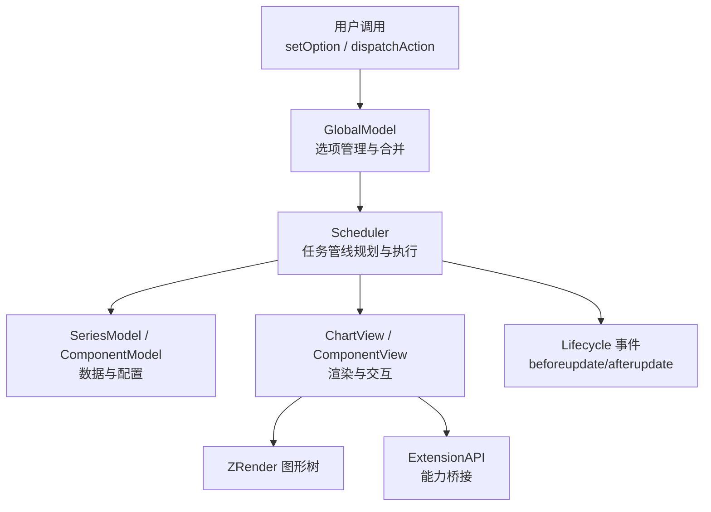
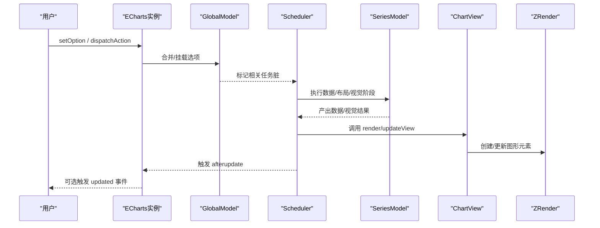
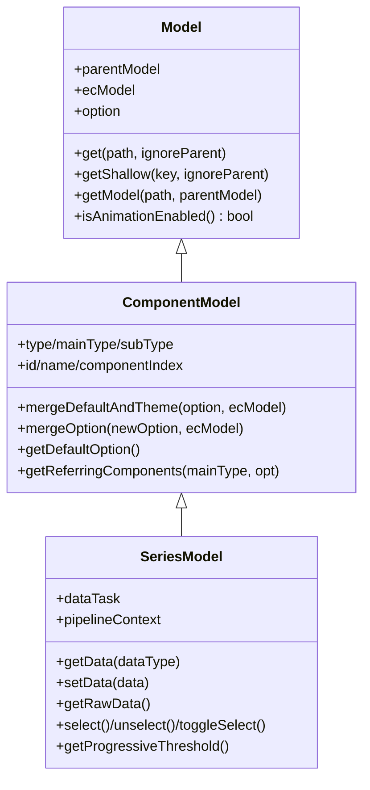
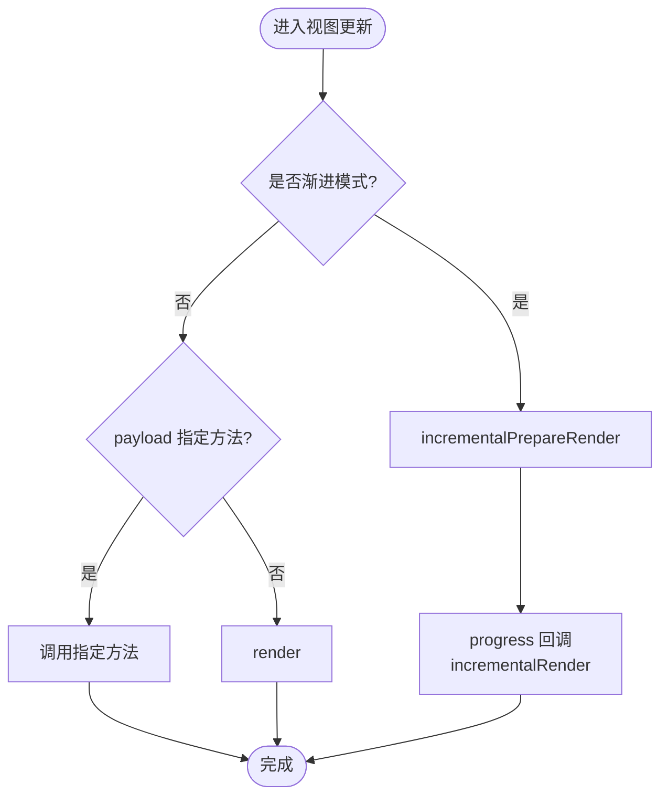
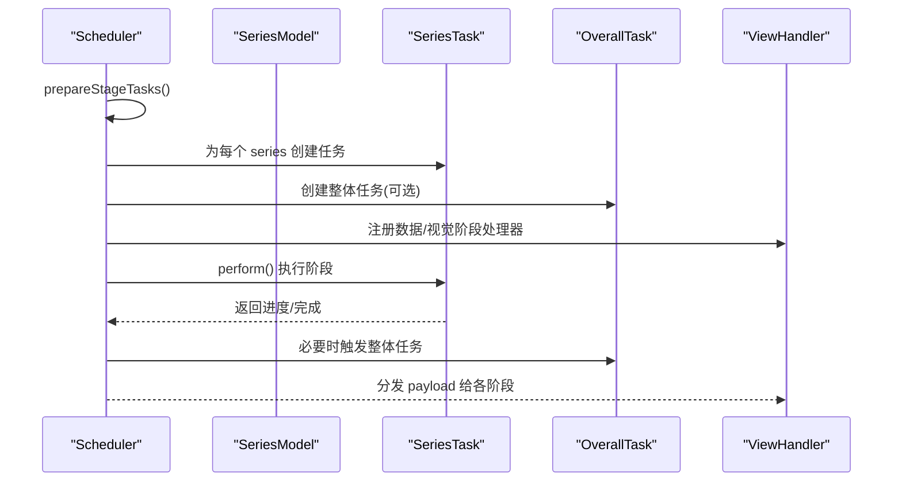
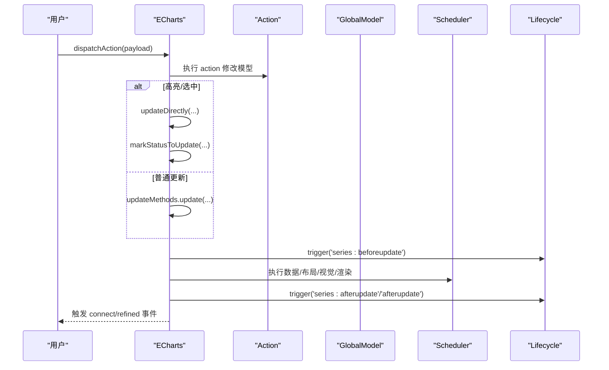
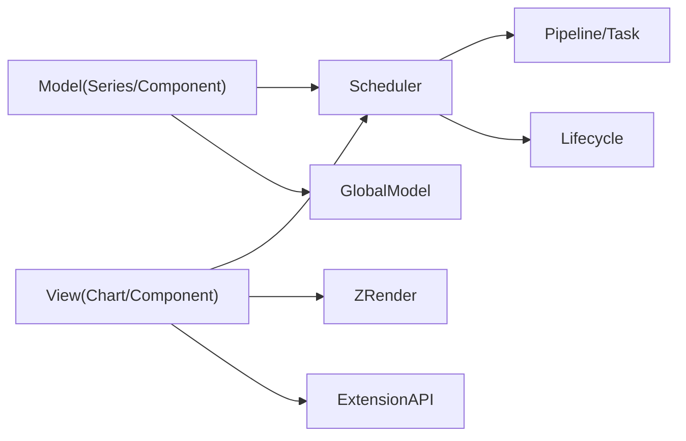

# Model-View 通信

<cite>
**本文引用的文件**
- [src/model/Model.ts](file://src/model/Model.ts)
- [src/model/Component.ts](file://src/model/Component.ts)
- [src/model/Series.ts](file://src/model/Series.ts)
- [src/view/Component.ts](file://src/view/Component.ts)
- [src/view/Chart.ts](file://src/view/Chart.ts)
- [src/core/Scheduler.ts](file://src/core/Scheduler.ts)
- [src/core/lifecycle.ts](file://src/core/lifecycle.ts)
- [src/core/ExtensionAPI.ts](file://src/core/ExtensionAPI.ts)
- [src/util/event.ts](file://src/util/event.ts)
- [src/core/echarts.ts](file://src/core/echarts.ts)
</cite>

## 目录
1. [简介](#简介)
2. [项目结构](#项目结构)
3. [核心组件](#核心组件)
4. [架构总览](#架构总览)
5. [详细组件分析](#详细组件分析)
6. [依赖关系分析](#依赖关系分析)
7. [性能与异步更新](#性能与异步更新)
8. [故障排查指南](#故障排查指南)
9. [结论](#结论)
10. [附录：自定义组件实现示例](#附录自定义组件实现示例)

## 简介
本文件系统性解释 ECharts 中 Model 与 View 的通信机制、数据同步策略、事件驱动的数据更新流程、状态同步与一致性保障、异步更新（含动画过渡与渐进渲染）以及双向绑定的实现原理与应用场景。文末提供在自定义组件中实现 Model-View 通信的实践方法与调试技巧。

## 项目结构
ECharts 采用“模型-视图”分离的架构：
- Model 层：负责配置解析、默认值合并、主题注入、数据源管理、选择态等，不直接操作 DOM/Canvas。
- View 层：负责将 Model 的状态映射为图形元素并渲染到 ZRender 上。
- Scheduler：统一编排数据预处理、布局、视觉编码、渲染等阶段任务，支持增量/渐进执行。
- Lifecycle：暴露生命周期钩子事件，便于扩展与调试。
- ExtensionAPI：为 Model/View 提供受限的运行时能力（如 dispatchAction、获取坐标系统等）。

图表来源
- [src/core/echarts.ts:2148-2272](file://src/core/echarts.ts#L2148-L2272)
- [src/core/Scheduler.ts:259-303](file://src/core/Scheduler.ts#L259-L303)
- [src/model/Component.ts:155-189](file://src/model/Component.ts#L155-L189)
- [src/view/Chart.ts:138-155](file://src/view/Chart.ts#L138-L155)

章节来源
- [src/core/echarts.ts:2148-2272](file://src/core/echarts.ts#L2148-L2272)
- [src/core/Scheduler.ts:259-303](file://src/core/Scheduler.ts#L259-L303)

## 核心组件
- Model 基类与组件模型
  - Model：提供 option 访问、路径解析、父级继承、动画开关判断等基础能力。
  - ComponentModel：扩展类型、ID、名称、布局参数、默认项合并、引用组件查询等。
  - SeriesModel：系列专属的数据流入口、数据源管理、选择态、可视化属性、渐进渲染阈值等。
- View 基类与图表视图
  - ComponentView：通用组件视图基类，提供 group、生命周期方法、遍历新渲染元素等。
  - ChartView：图表视图基类，定义 render/updateView/updateVisual/incrementalPrepareRender 等接口，封装高亮/淡化、移除、dispose 等。
- 调度器与生命周期
  - Scheduler：构建任务管线，按阶段执行数据预处理、布局、视觉、渲染；支持渐进渲染与分片执行。
  - lifecycle：提供 series:beforeupdate、series:transition、series:afterupdate、afterupdate 等事件。
- 扩展 API
  - ExtensionAPI：向 Model/View 暴露有限能力，如 dispatchAction、getCoordinateSystems、状态切换等。

章节来源
- [src/model/Model.ts:48-243](file://src/model/Model.ts#L48-L243)
- [src/model/Component.ts:53-189](file://src/model/Component.ts#L53-L189)
- [src/model/Series.ts:149-328](file://src/model/Series.ts#L149-L328)
- [src/view/Component.ts:64-143](file://src/view/Component.ts#L64-L143)
- [src/view/Chart.ts:98-229](file://src/view/Chart.ts#L98-L229)
- [src/core/Scheduler.ts:114-303](file://src/core/Scheduler.ts#L114-L303)
- [src/core/lifecycle.ts:55-72](file://src/core/lifecycle.ts#L55-L72)
- [src/core/ExtensionAPI.ts:55-98](file://src/core/ExtensionAPI.ts#L55-L98)

## 架构总览
ECharts 的 Model-View 通信围绕“事件驱动 + 任务管线”展开：
- 入口：setOption 或 dispatchAction。
- 模型层：GlobalModel 合并选项，SeriesModel/ComponentModel 维护配置与数据。
- 调度层：Scheduler 根据 dirty 标记与管线上下文，决定哪些任务需要执行、如何分片/渐进执行。
- 视图层：ChartView/ComponentView 读取 Model 数据，生成/更新 ZRender 图形元素。
- 生命周期：在关键阶段触发 beforeupdate/afterupdate 等事件，供扩展点使用。
- 事件总线：dispatchAction 内部会触发统一事件，支持 connect 与 refineEvent。

图表来源
- [src/core/echarts.ts:2148-2272](file://src/core/echarts.ts#L2148-L2272)
- [src/core/Scheduler.ts:259-303](file://src/core/Scheduler.ts#L259-L303)
- [src/view/Chart.ts:271-320](file://src/view/Chart.ts#L271-L320)

## 详细组件分析

### Model 层：配置、数据与状态
- Model
  - 提供 get/getShallow/getModel 等路径访问能力，支持从父级继承。
  - isAnimationEnabled 基于环境与配置决定是否启用动画。
- ComponentModel
  - 合并主题与默认配置，处理布局参数，支持引用组件查找。
  - 提供 getDefaultOption、mergeOption、optionUpdated 等扩展点。
- SeriesModel
  - 初始化数据源（SourceManager），创建 dataTask，维护 getData/setData/rawData。
  - 管理选择态（select/unselect/toggleSelect）、颜色、标签样式、渐进渲染阈值等。
  - 通过 pipelineContext 与 Scheduler 协作，控制渐进/增量渲染。

图表来源
- [src/model/Model.ts:48-243](file://src/model/Model.ts#L48-L243)
- [src/model/Component.ts:53-189](file://src/model/Component.ts#L53-L189)
- [src/model/Series.ts:149-328](file://src/model/Series.ts#L149-L328)

章节来源
- [src/model/Model.ts:48-243](file://src/model/Model.ts#L48-L243)
- [src/model/Component.ts:53-189](file://src/model/Component.ts#L53-L189)
- [src/model/Series.ts:149-328](file://src/model/Series.ts#L149-L328)

### View 层：渲染与交互
- ComponentView
  - 提供 group、init/render/dispose/updateView/updateLayout/updateVisual 等生命周期方法。
  - 支持遍历新渲染元素，用于渐进渲染或增量更新。
- ChartView
  - 定义 incrementalPrepareRender/incrementalRender/updateTransform/containPoint/filterForExposedEvent 等接口。
  - 内置 highlight/downplay/remove/dispose，默认 updateView/updateVisual 委托至 render。
  - 通过 renderTask 的计划与重置，决定调用 render 还是增量渲染。

图表来源
- [src/view/Chart.ts:138-155](file://src/view/Chart.ts#L138-L155)
- [src/view/Chart.ts:271-320](file://src/view/Chart.ts#L271-L320)

章节来源
- [src/view/Component.ts:64-143](file://src/view/Component.ts#L64-L143)
- [src/view/Chart.ts:98-229](file://src/view/Chart.ts#L98-L229)
- [src/view/Chart.ts:271-320](file://src/view/Chart.ts#L271-L320)

### 调度器与任务管线
- Scheduler
  - 维护 stage handlers（数据处理器、视觉处理器）与 pipeline（每系列的渲染管线）。
  - prepareStageTasks/prepareView：为每个 handler 创建 series-level 或 overall-level 任务，并将 view.renderTask 接入管线。
  - perform*：按阶段执行任务，支持 block/incremental、modBy/modDataCount 的分片策略。
  - restorePipelines：为每个 series 建立 pipeline，设置 progressiveEnabled、threshold、step 等。
- Task
  - plan/reset/count/progress：支持 reset 返回 progress 函数以支持渐进执行；dirty 标记驱动重算。

图表来源
- [src/core/Scheduler.ts:259-303](file://src/core/Scheduler.ts#L259-L303)
- [src/core/Scheduler.ts:410-552](file://src/core/Scheduler.ts#L410-L552)

章节来源
- [src/core/Scheduler.ts:259-303](file://src/core/Scheduler.ts#L259-L303)
- [src/core/Scheduler.ts:410-552](file://src/core/Scheduler.ts#L410-L552)

### 事件驱动的数据更新流程
- dispatchAction
  - 解析 actionInfo（type/update/refineEvent），执行 action 修改模型。
  - 对高亮/选中变更走轻量更新路径（仅更新视图状态，跳过数据/布局/视觉）。
  - 非轻量更新则调用 updateDirectly 或 updateMethods.update，最终进入渲染流程。
  - 结束后触发统一事件（connect 与 refineEvent 两种）。
- lifecycle
  - 在 series:beforeupdate、series:transition、series:afterupdate、afterupdate 等节点触发事件，便于扩展。

图表来源
- [src/core/echarts.ts:2148-2272](file://src/core/echarts.ts#L2148-L2272)
- [src/core/lifecycle.ts:55-72](file://src/core/lifecycle.ts#L55-L72)

章节来源
- [src/core/echarts.ts:2148-2272](file://src/core/echarts.ts#L2148-L2272)
- [src/core/lifecycle.ts:55-72](file://src/core/lifecycle.ts#L55-L72)

### 状态同步策略与一致性
- 模型侧
  - SeriesModel.setData/getData：在任务上下文中保证数据可见性，避免流水线中读到旧数据。
  - SourceManager.dirty/prepareSource：当选项变化时重新准备数据源。
- 视图侧
  - ChartView.render/updateView/updateVisual：根据 payload 与渐进模式选择合适方法。
  - eachRendered：遍历新渲染元素，支持增量更新。
- 调度侧
  - dirty 标记与 modBy/modDataCount：确保仅在必要时重算，且可分片执行。
  - overall task 与 stub：跨系列依赖的任务通过 stub 感知上游脏并触发自身重算。

章节来源
- [src/model/Series.ts:369-417](file://src/model/Series.ts#L369-L417)
- [src/view/Chart.ts:200-229](file://src/view/Chart.ts#L200-L229)
- [src/core/Scheduler.ts:305-376](file://src/core/Scheduler.ts#L305-L376)

### 异步更新：动画过渡与性能优化
- 动画开关
  - Model.isAnimationEnabled：依据环境与 animationThreshold 自动禁用大数据量动画。
  - SeriesModel.isAnimationEnabled：进一步考虑数据规模与配置。
- 渐进渲染
  - Scheduler.restorePipelines：为 Canvas 渲染开启 progressiveEnabled，设置 step/threshold。
  - ChartView.incrementalPrepareRender/incrementalRender：配合任务 progress 回调逐步绘制。
- 分片与批处理
  - Scheduler.getPerformArgs：根据 progressiveEnabled、blockIndex、modBy 计算分片步长。
  - Task.plan/reset/count/progress：支持 reset 返回多个 progress 函数，分批执行。

章节来源
- [src/model/Model.ts:205-214](file://src/model/Model.ts#L205-L214)
- [src/model/Series.ts:548-562](file://src/model/Series.ts#L548-L562)
- [src/core/Scheduler.ts:235-257](file://src/core/Scheduler.ts#L235-L257)
- [src/core/Scheduler.ts:186-206](file://src/core/Scheduler.ts#L186-L206)
- [src/view/Chart.ts:271-320](file://src/view/Chart.ts#L271-L320)

### 双向绑定的实现原理与应用场景
- 单向为主，局部“双向”
  - ECharts 主要采用“Model -> View”的单向数据流，通过调度器与生命周期事件驱动更新。
  - “双向”体现在：
    - 用户交互（如 tooltip、brush、dataZoom）通过 dispatchAction 修改模型，再触发视图更新。
    - View 可通过 ExtensionAPI 调用 dispatchAction，间接影响 Model。
- 典型场景
  - 联动：一个组件的 action 触发另一个组件的视图更新（通过 refineEvent/connect）。
  - 增量更新：appendData 触发视图增量渲染，保持 UI 与数据一致。
  - 轻量更新：高亮/选中仅更新视图状态，避免全量重算。

章节来源
- [src/core/ExtensionAPI.ts:55-98](file://src/core/ExtensionAPI.ts#L55-L98)
- [src/core/echarts.ts:2148-2272](file://src/core/echarts.ts#L2148-L2272)

## 依赖关系分析
- Model 依赖
  - GlobalModel：主题、全局配置、组件集合。
  - SourceManager/SeriesData：数据源与数据容器。
- View 依赖
  - ZRender Group/Element：图形树构建与遍历。
  - Scheduler：任务计划与执行。
- 调度器依赖
  - StageHandlers：数据处理器与视觉处理器。
  - Pipeline：串联 series-level 任务，支持阻塞与渐进。
- 事件系统
  - lifecycle：生命周期事件。
  - messageCenter：统一事件触发（connect/refined）。

图表来源
- [src/core/Scheduler.ts:259-303](file://src/core/Scheduler.ts#L259-L303)
- [src/core/lifecycle.ts:55-72](file://src/core/lifecycle.ts#L55-L72)
- [src/core/ExtensionAPI.ts:55-98](file://src/core/ExtensionAPI.ts#L55-L98)

章节来源
- [src/core/Scheduler.ts:259-303](file://src/core/Scheduler.ts#L259-L303)
- [src/core/lifecycle.ts:55-72](file://src/core/lifecycle.ts#L55-L72)
- [src/core/ExtensionAPI.ts:55-98](file://src/core/ExtensionAPI.ts#L55-L98)

## 性能与异步更新
- 渐进渲染
  - 针对大数据集，按 step 分片渲染，减少首帧耗时。
  - 通过 pipelineContext.progressiveRender 控制是否在每帧渐进。
- 分片与节流
  - modBy/modDataCount：按数据量动态调整分片大小。
  - blockIndex：阻塞点前的任务优先执行，保证关键路径。
- 动画优化
  - 大数据量自动禁用动画，避免卡顿。
  - 轻量更新（高亮/选中）跳过数据/布局/视觉阶段，提升响应速度。

章节来源
- [src/core/Scheduler.ts:186-206](file://src/core/Scheduler.ts#L186-L206)
- [src/model/Series.ts:548-562](file://src/model/Series.ts#L548-L562)
- [src/core/echarts.ts:2148-2272](file://src/core/echarts.ts#L2148-L2272)

## 故障排查指南
- 常见问题定位
  - 视图未更新：检查 Model.mergeOption 是否正确触发 sourceManager.dirty，确认 Scheduler 对应任务被标记为 dirty。
  - 渐进渲染异常：确认 progressiveEnabled 与 threshold 配置，查看 pipelineContext.progressiveRender。
  - 事件未触发：检查 dispatchAction 的 refineEvent 与 escapeConnect，确认 messageCenter 监听。
- 调试技巧
  - 利用 lifecycle 事件（series:beforeupdate/afterupdate）打印更新上下文。
  - 使用 eachRendered 遍历新渲染元素，验证增量更新范围。
  - 通过 ExtensionAPI 获取当前坐标系统与组件，辅助定位问题。

章节来源
- [src/core/lifecycle.ts:55-72](file://src/core/lifecycle.ts#L55-L72)
- [src/view/Chart.ts:220-229](file://src/view/Chart.ts#L220-L229)
- [src/core/ExtensionAPI.ts:55-98](file://src/core/ExtensionAPI.ts#L55-L98)

## 结论
ECharts 的 Model-View 通信以“事件驱动 + 任务管线”为核心，通过清晰的职责划分与可扩展的生命周期，实现了高效、可控的数据同步与视图更新。渐进渲染与分片执行保障了大数据场景下的性能，而轻量更新与双向联动提升了交互体验。理解这些机制有助于在自定义组件中正确实现通信与更新。

## 附录：自定义组件实现示例
以下示例展示如何在自定义组件中实现 Model-View 通信（不含具体代码内容，仅提供路径参考）：

- 定义 Model
  - 继承 ComponentModel，声明 defaultOption、mergeDefaultAndTheme、mergeOption 等。
  - 在 mergeOption 中处理配置变更，必要时调用 sourceManager.dirty 与 prepareSource。
  - 参考路径：[src/model/Component.ts:155-189](file://src/model/Component.ts#L155-L189)

- 定义 View
  - 继承 ComponentView，实现 init/render/dispose/updateView/updateLayout/updateVisual。
  - 在 render 中读取 Model 数据，创建/更新 ZRender 元素；在 updateView 中做增量更新。
  - 参考路径：[src/view/Component.ts:92-143](file://src/view/Component.ts#L92-L143)

- 接入调度器
  - 若需参与数据/视觉阶段，注册 StageHandler，并在 reset 中返回 progress 函数以支持渐进。
  - 参考路径：[src/core/Scheduler.ts:410-552](file://src/core/Scheduler.ts#L410-L552)

- 事件与联动
  - 通过 ExtensionAPI.dispatchAction 触发动作，或在 refineEvent 中构造用户友好事件。
  - 参考路径：[src/core/ExtensionAPI.ts:55-98](file://src/core/ExtensionAPI.ts#L55-L98)、[src/core/echarts.ts:2148-2272](file://src/core/echarts.ts#L2148-L2272)

- 调试与验证
  - 使用 lifecycle 事件观察更新时机；用 eachRendered 验证增量范围；通过日志输出 payload 与上下文。
  - 参考路径：[src/core/lifecycle.ts:55-72](file://src/core/lifecycle.ts#L55-L72)、[src/view/Component.ts:124-129](file://src/view/Component.ts#L124-L129)