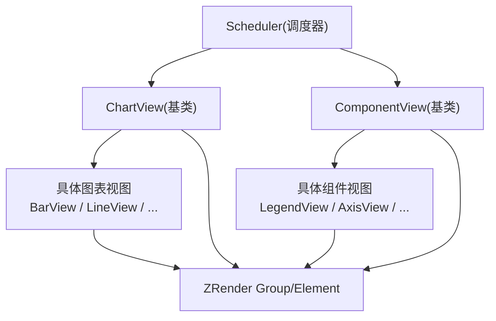
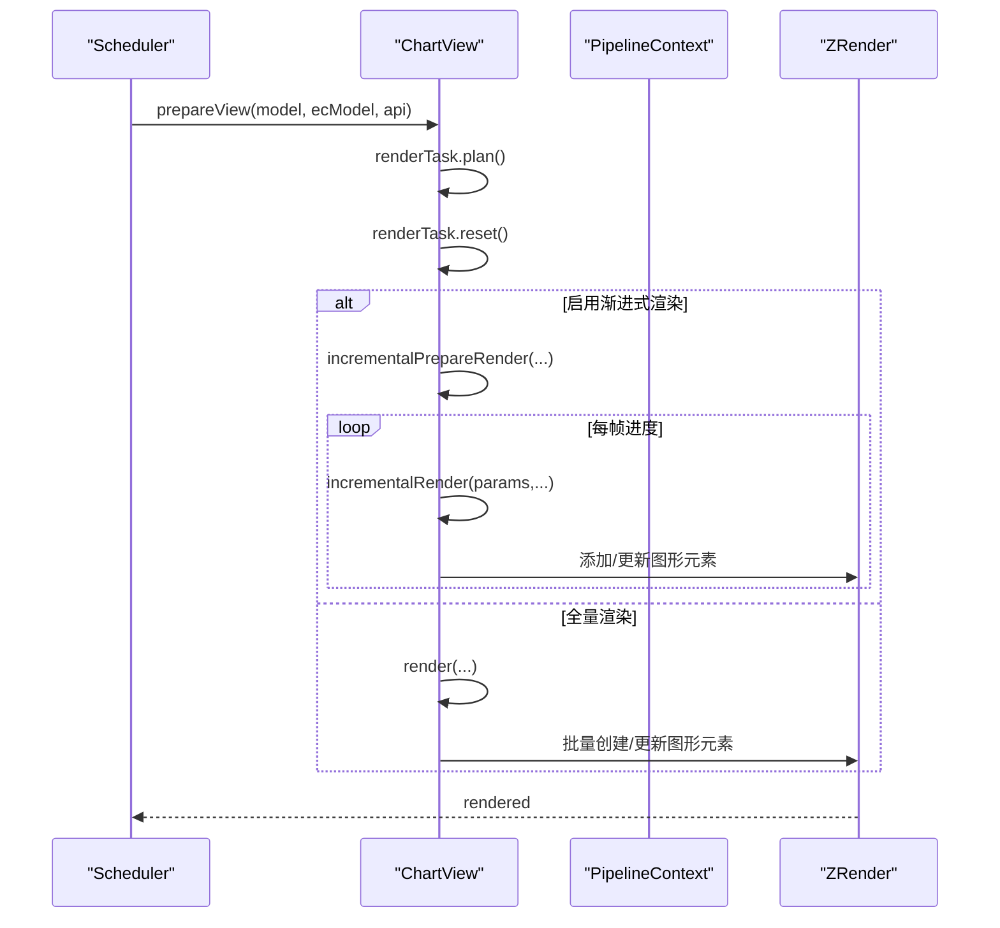
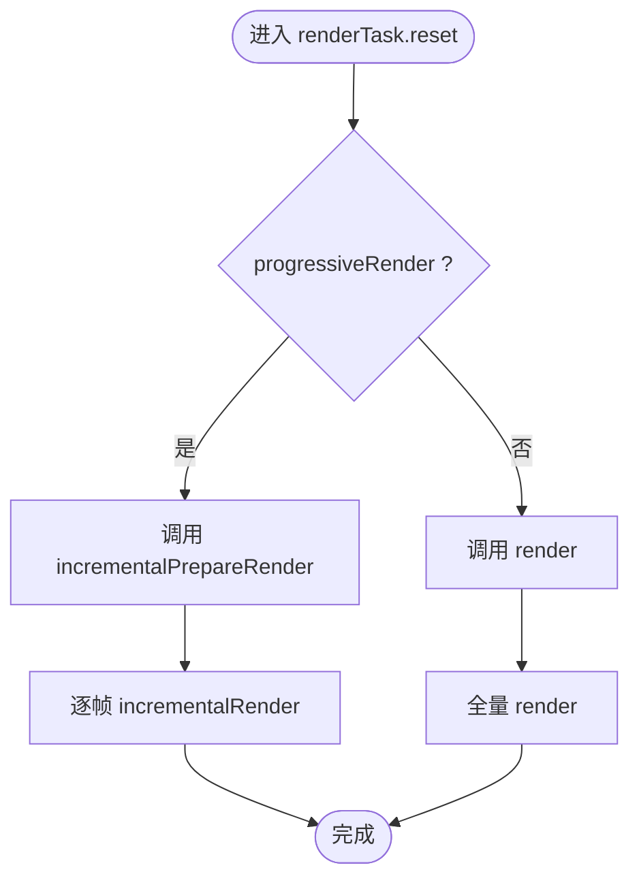
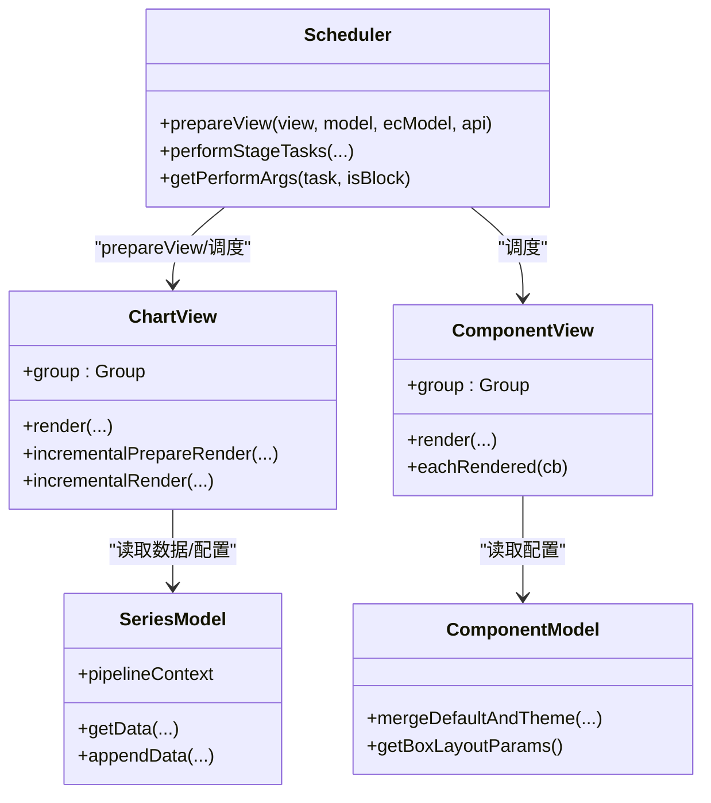

# View 层

<cite>
**本文引用的文件**
- [src/view/Chart.ts](file://src/view/Chart.ts)
- [src/view/Component.ts](file://src/view/Component.ts)
- [src/core/Scheduler.ts](file://src/core/Scheduler.ts)
- [src/model/Component.ts](file://src/model/Component.ts)
- [src/model/Series.ts](file://src/model/Series.ts)
- [src/chart/bar/BarView.ts](file://src/chart/bar/BarView.ts)
- [src/chart/line/LineView.ts](file://src/chart/line/LineView.ts)
- [src/util/graphic.ts](file://src/util/graphic.ts)
- [src/core/echarts.ts](file://src/core/echarts.ts)
</cite>

## 目录
1. [简介](#简介)
2. [项目结构](#项目结构)
3. [核心组件](#核心组件)
4. [架构总览](#架构总览)
5. [详细组件分析](#详细组件分析)
6. [依赖关系分析](#依赖关系分析)
7. [性能考量](#性能考量)
8. [故障排查指南](#故障排查指南)
9. [结论](#结论)
10. [附录：自定义视图开发示例与调优建议](#附录自定义视图开发示例与调优建议)

## 简介
本文件深入解析 ECharts 的 View 层设计与实现，重点覆盖：
- ComponentView 的基础渲染能力与扩展点
- ChartView 的特殊职责（图表特定渲染、交互、增量/全量更新）
- 视图与调度器 Scheduler 的协作机制
- 与 ZRender 引擎的集成方式与图形元素管理
- 性能优化策略（批量操作、增量渲染、内存管理）
- 自定义 View 的开发范式与调优建议

## 项目结构
ECharts 将“视图”抽象为两类：
- ComponentView：用于非系列型组件（如标题、图例、坐标轴等），提供基础渲染生命周期与遍历能力。
- ChartView：用于系列型图表（如折线、柱状图等），封装了数据到图形的映射、动画、增量渲染、高亮/选中状态管理等。

图示来源
- [src/core/Scheduler.ts:279-290](file://src/core/Scheduler.ts#L279-L290)
- [src/view/Chart.ts:138-147](file://src/view/Chart.ts#L138-L147)
- [src/view/Component.ts:87-90](file://src/view/Component.ts#L87-L90)

章节来源
- [src/view/Chart.ts:98-147](file://src/view/Chart.ts#L98-L147)
- [src/view/Component.ts:64-90](file://src/view/Component.ts#L64-L90)
- [src/core/Scheduler.ts:279-290](file://src/core/Scheduler.ts#L279-L290)

## 核心组件
- ComponentView
  - 提供基础的 group 容器、uid、render/update/dispose 生命周期钩子
  - 支持 eachRendered 遍历当前组内所有图形元素
  - 可选扩展：updateTransform、filterForExposedEvent、findHighDownDispatchers、toggleBlurSeries
- ChartView
  - 继承自通用视图能力，增加 renderTask、incrementalPrepareRender/incrementalRender、updateTransform、containPoint、filterForExposedEvent
  - 内置 highlight/downplay/remove/dispose 默认行为
  - 通过 renderTaskPlan/renderTaskReset 决定调用 render 或增量方法
  - 维护 group 作为根节点，统一交由 ZRender 管理

章节来源
- [src/view/Component.ts:31-142](file://src/view/Component.ts#L31-L142)
- [src/view/Chart.ts:46-147](file://src/view/Chart.ts#L46-L147)
- [src/view/Chart.ts:157-228](file://src/view/Chart.ts#L157-L228)

## 架构总览
视图的生命周期由 Scheduler 驱动，按阶段执行数据预处理、布局、视觉编码与渲染。ChartView 在每次渲染前会准备任务上下文，并根据是否启用渐进式渲染选择增量或全量路径。

图示来源
- [src/core/Scheduler.ts:279-290](file://src/core/Scheduler.ts#L279-L290)
- [src/view/Chart.ts:271-320](file://src/view/Chart.ts#L271-L320)
- [src/core/Scheduler.ts:219-233](file://src/core/Scheduler.ts#L219-L233)

章节来源
- [src/core/Scheduler.ts:219-233](file://src/core/Scheduler.ts#L219-L233)
- [src/core/Scheduler.ts:279-290](file://src/core/Scheduler.ts#L279-L290)
- [src/view/Chart.ts:271-320](file://src/view/Chart.ts#L271-L320)

## 详细组件分析

### ComponentView：基础渲染与扩展点
- 基础能力
  - 构造时创建 ZRender Group 作为根容器，分配唯一 uid
  - init/render/dispose 空实现供子类扩展
  - updateView/updateLayout/updateVisual 默认无操作，便于按需覆盖
  - eachRendered 基于 group.traverse 遍历元素，支持渐进模式下的增量回调
- 扩展点
  - updateTransform：用于仅更新变换（如平移、缩放）而不重建图形
  - filterForExposedEvent：过滤事件冒泡，控制对外暴露的事件
  - findHighDownDispatchers：按名称查找多个派发器，支持跨层级联动高亮/淡化
  - toggleBlurSeries：配合标记等组件实现模糊/去模糊联动

章节来源
- [src/view/Component.ts:31-142](file://src/view/Component.ts#L31-L142)

### ChartView：图表视图的职责与更新机制
- 职责
  - 维护 renderTask，负责计划与重置逻辑
  - 提供 highlight/downplay 默认实现，基于 SeriesData 的图形元素进行状态切换
  - remove 默认清空 group；dispose 可释放资源
  - updateView/updateVisual 默认委托给 render
- 增量 vs 全量
  - renderTaskReset 根据 pipelineContext.progressiveRender 与 payload.updateMethod 决定调用 incrementalPrepareRender 或 render
  - 若未实现增量接口，则走全量 render；appendData 场景也兼容此路径
- 遍历与事件
  - eachRendered 使用 traverseElements 遍历新增元素（渐进）或全部元素（全量）
  - containPoint/filterForExposedEvent 供交互系统查询与过滤

图示来源
- [src/view/Chart.ts:271-320](file://src/view/Chart.ts#L271-L320)

章节来源
- [src/view/Chart.ts:98-228](file://src/view/Chart.ts#L98-L228)
- [src/view/Chart.ts:271-320](file://src/view/Chart.ts#L271-L320)

### BarView：增量渲染与大数据优化实践
- 渲染模式
  - 普通模式：使用 diff 对比新旧数据，增删改图形元素，支持背景条、圆角、裁剪与实时排序
  - 大数据模式：使用 clipPath 裁剪区域，避免绘制溢出；支持渐进式增量渲染
- 增量流程
  - incrementalPrepareRender：清理旧元素、设置裁剪、记录进度元素数组
  - incrementalRender：分批创建/更新图形元素，逐步添加到 group
- 性能要点
  - 使用 diff + 复用元素减少创建开销
  - 大数模式下用 clipPath 替代复杂裁剪逻辑
  - 首次帧后监听 ZRender rendered 事件触发轴序重排，避免重复计算

章节来源
- [src/chart/bar/BarView.ts:122-163](file://src/chart/bar/BarView.ts#L122-L163)
- [src/chart/bar/BarView.ts:165-171](file://src/chart/bar/BarView.ts#L165-L171)
- [src/chart/bar/BarView.ts:454-476](file://src/chart/bar/BarView.ts#L454-L476)
- [src/chart/bar/BarView.ts:478-636](file://src/chart/bar/BarView.ts#L478-L636)

### LineView：折线图视图与交互处理
- 渲染要点
  - 根据坐标系类型（直角/极坐标）生成裁剪路径，支持 areaStyle、step 折线、渐变可视化
  - 符号绘制通过 SymbolDraw 统一管理，支持忽略策略与裁剪
  - 末端标签（endLabel）在动画过程中动态定位与裁剪
- 交互与状态
  - 支持 showSymbol 自动显示/隐藏策略，类别轴下考虑标签间隔策略
  - 颜色渐变根据可视映射计算并裁剪至可视范围，避免 GPU 加速导致的模糊

章节来源
- [src/chart/line/LineView.ts:635-800](file://src/chart/line/LineView.ts#L635-L800)
- [src/chart/line/LineView.ts:510-578](file://src/chart/line/LineView.ts#L510-L578)
- [src/chart/line/LineView.ts:268-368](file://src/chart/line/LineView.ts#L268-L368)

### 视图与 ZRender 的集成与图形元素管理
- 根容器
  - 每个视图拥有独立的 ZRender Group，作为该视图的根节点
  - 视图实例化时创建 group，并在 dispose 时移除或清空
- 元素生命周期
  - 创建：new Rect/Path/Text 等，设置 shape/style，加入 group
  - 更新：updateProps/initProps 进行属性变更，必要时保存旧样式以支持过渡动画
  - 删除：removeElementWithFadeOut 平滑移除，避免闪烁
- 裁剪与层级
  - 通过 setClipPath 设置裁剪区域，确保元素不越界
  - 使用 z/z2 控制绘制顺序，保证标签、背景、前景的正确叠加

章节来源
- [src/view/Chart.ts:138-147](file://src/view/Chart.ts#L138-L147)
- [src/view/Component.ts:87-90](file://src/view/Component.ts#L87-L90)
- [src/chart/bar/BarView.ts:465-476](file://src/chart/bar/BarView.ts#L465-L476)
- [src/chart/line/LineView.ts:749-783](file://src/chart/line/LineView.ts#L749-L783)
- [src/util/graphic.ts:77-92](file://src/util/graphic.ts#L77-L92)

## 依赖关系分析
- Scheduler 与视图
  - 通过 prepareView 将 model/ecModel/api 注入视图上下文，并将视图任务接入管道
  - 根据 progressiveEnabled 与 blockIndex 决定是否启用渐进式渲染
- Model 与视图
  - SeriesModel 提供 getData/getRawData、appendData、pipelineContext 等
  - ComponentModel 提供布局参数、主题合并、默认选项等
- 工具与图形
  - util/graphic 提供 create/update/remove 元素的便捷方法与动画过渡
  - ZRender 提供底层图形对象与渲染管线

图示来源
- [src/core/Scheduler.ts:279-290](file://src/core/Scheduler.ts#L279-L290)
- [src/model/Series.ts:225-265](file://src/model/Series.ts#L225-L265)
- [src/model/Component.ts:155-176](file://src/model/Component.ts#L155-L176)

章节来源
- [src/core/Scheduler.ts:279-290](file://src/core/Scheduler.ts#L279-L290)
- [src/model/Series.ts:225-265](file://src/model/Series.ts#L225-L265)
- [src/model/Component.ts:155-176](file://src/model/Component.ts#L155-L176)

## 性能考量
- 增量渲染（渐进式）
  - 条件：Canvas 渲染器且 series.getProgressive() 开启，且未被 preventIncremental 阻止
  - 效果：每帧只渲染部分数据项，提升交互流畅度
  - 关键：incrementalPrepareRender 初始化裁剪与状态；incrementalRender 分批构建元素
- 批量操作
  - 使用 diff 对比新旧数据，最小化 DOM/图形元素变更
  - 复用已有元素，避免频繁创建销毁
  - 使用 updateProps/initProps 进行批量属性更新
- 内存管理
  - 合理设置 clipPath，避免不必要的绘制
  - 及时移除不再使用的元素，使用 removeElementWithFadeOut 平滑过渡
  - 大数据场景关闭动画或降低动画阈值，减少 CPU/GPU 压力
- 裁剪与可见性
  - 利用坐标系的 getArea 计算裁剪区域，避免越界绘制
  - 对不可见元素设置 ignore/invisible，减少渲染负担

章节来源
- [src/core/Scheduler.ts:219-233](file://src/core/Scheduler.ts#L219-L233)
- [src/chart/bar/BarView.ts:146-159](file://src/chart/bar/BarView.ts#L146-L159)
- [src/chart/bar/BarView.ts:454-476](file://src/chart/bar/BarView.ts#L454-L476)
- [src/chart/line/LineView.ts:749-783](file://src/chart/line/LineView.ts#L749-L783)
- [src/util/graphic.ts:77-92](file://src/util/graphic.ts#L77-L92)

## 故障排查指南
- 视图未渲染
  - 检查是否在 echarts 初始化时注册了对应的 ChartView/ComponentView
  - 确认 scheduler.prepareView 已调用，view.__alive 为 true
- 增量渲染无效
  - 确认渲染器为 Canvas，且 series.getProgressive() 开启
  - 检查 preventIncremental 是否返回 true 阻止了增量
- 元素重叠或层级错误
  - 检查 z/z2 设置是否正确
  - 确认 clipPath 设置与坐标系匹配
- 内存泄漏
  - 检查 dispose 中是否正确移除事件监听与图形元素
  - 避免在视图中持有全局引用导致无法回收

章节来源
- [src/core/echarts.ts:1721-1749](file://src/core/echarts.ts#L1721-L1749)
- [src/core/Scheduler.ts:219-233](file://src/core/Scheduler.ts#L219-L233)
- [src/view/Chart.ts:185-197](file://src/view/Chart.ts#L185-L197)

## 结论
ECharts 的 View 层通过清晰的职责划分与可扩展的生命周期，实现了高效、灵活的渲染体系。ComponentView 提供基础能力，ChartView 聚焦图表特定逻辑与交互。Scheduler 协调各阶段任务，结合增量渲染与批量操作，显著提升了大数据场景下的性能表现。开发者可通过实现增量接口、合理使用裁剪与动画、以及遵循内存管理规范，获得更优的渲染体验。

## 附录：自定义视图开发示例与调优建议
- 开发步骤
  - 定义视图类并继承 ChartView 或 ComponentView
  - 实现 render（或 incrementalPrepareRender/incrementalRender）
  - 在视图内部使用 ZRender 的 Group/Element 创建图形，并通过 group.add 加入树
  - 使用 diff 与 updateProps 实现增量更新
  - 在 dispose 中清理资源与事件监听
- 参考实现
  - 自定义系列安装入口：注册 ChartView 与 SeriesModel
  - 具体视图实现可参考 BarView/LineView 的增量与裁剪策略
- 调优建议
  - 大数据场景优先启用渐进式渲染，合理设置 progressiveThreshold
  - 使用 clipPath 限制绘制区域，避免多余绘制
  - 复用元素、批量更新属性，减少 GC 压力
  - 关闭不必要动画或使用低开销动画策略
  - 定期审查 dispose 逻辑，确保无内存泄漏

章节来源
- [src/chart/custom/install.ts:20-27](file://src/chart/custom/install.ts#L20-L27)
- [src/chart/bar/BarView.ts:122-163](file://src/chart/bar/BarView.ts#L122-L163)
- [src/chart/line/LineView.ts:635-800](file://src/chart/line/LineView.ts#L635-L800)
- [src/util/graphic.ts:77-92](file://src/util/graphic.ts#L77-L92)