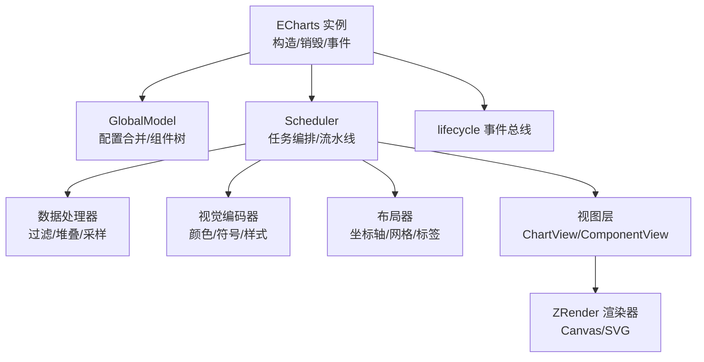
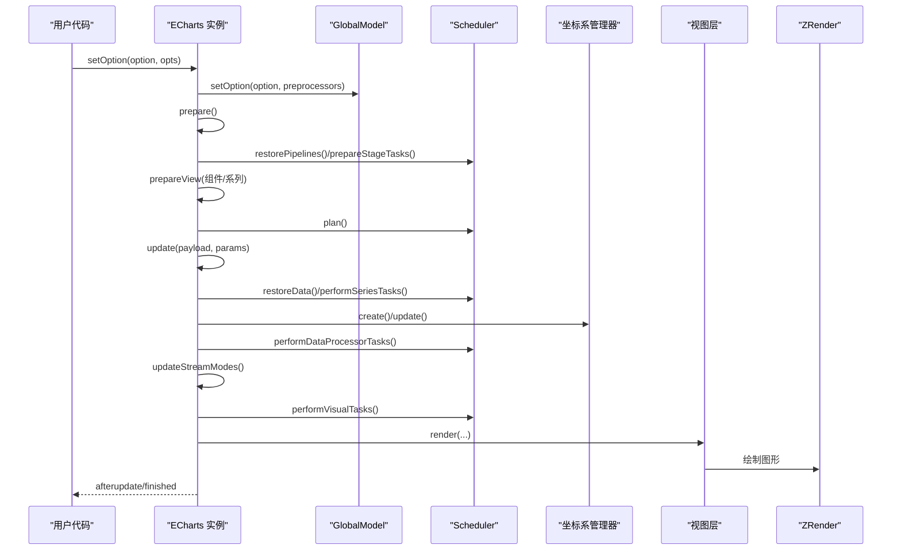
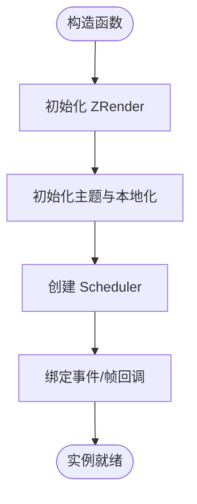
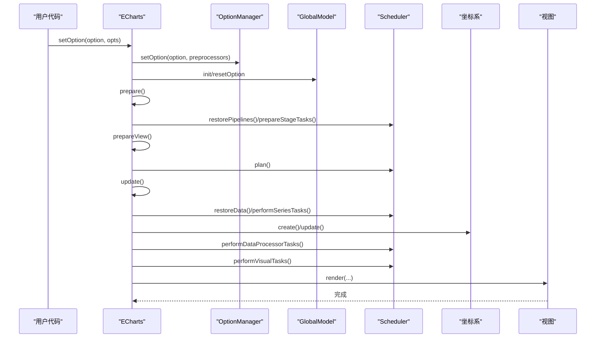
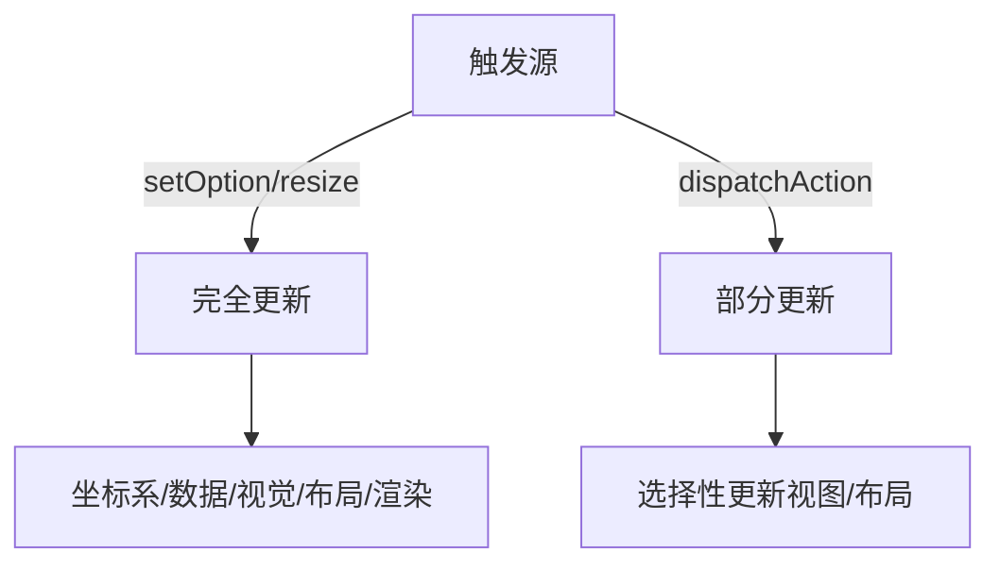
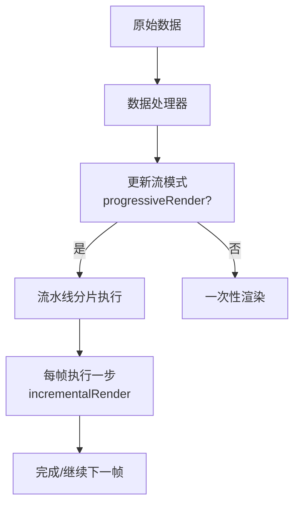
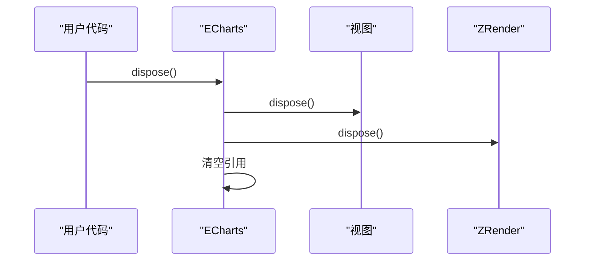
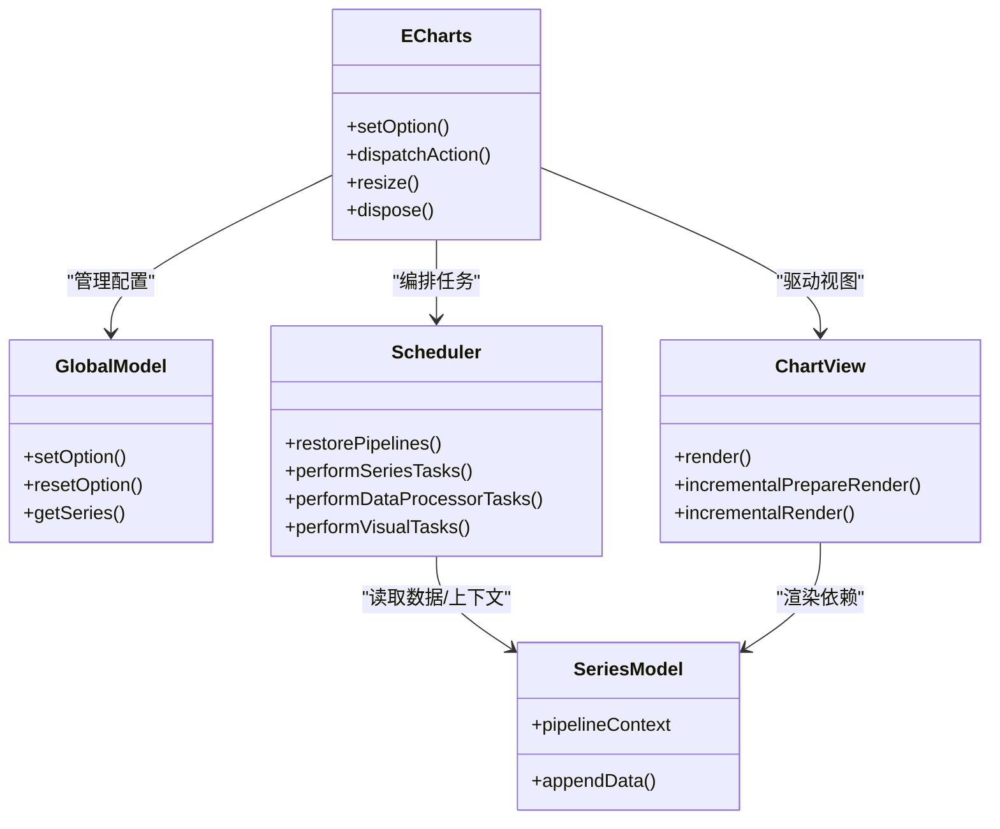

# 图表生命周期

<cite>
**本文引用的文件**
- [src/core/echarts.ts](file://src/core/echarts.ts)
- [src/core/lifecycle.ts](file://src/core/lifecycle.ts)
- [src/core/Scheduler.ts](file://src/core/Scheduler.ts)
- [src/view/Chart.ts](file://src/view/Chart.ts)
- [src/model/Global.ts](file://src/model/Global.ts)
- [src/model/Series.ts](file://src/model/Series.ts)
</cite>

## 目录
1. [简介](#简介)
2. [项目结构](#项目结构)
3. [核心组件](#核心组件)
4. [架构总览](#架构总览)
5. [详细组件分析](#详细组件分析)
6. [依赖关系分析](#依赖关系分析)
7. [性能考量](#性能考量)
8. [故障排查指南](#故障排查指南)
9. [结论](#结论)
10. [附录：关键流程与最佳实践](#附录：关键流程与最佳实践)

## 简介
本文件系统性阐述 ECharts 图表实例的完整生命周期管理，覆盖从构造函数初始化、DOM 绑定、渲染器初始化、事件绑定，到 setOption 的配置解析、模型创建、数据预处理、视觉编码、布局计算与最终渲染；并解释完全更新与部分更新的触发条件与处理流程，以及渐进式渲染在大数据量场景下的工作原理与优化策略。文末提供关键节点的最佳实践与示例路径指引。

## 项目结构
ECharts 的生命周期由以下核心模块协同完成：
- ECharts 实例（入口）：负责 DOM 绑定、ZRender 渲染器初始化、事件绑定、调度生命周期阶段、对外 API（setOption、dispatchAction、resize、dispose 等）。
- GlobalModel：统一管理与合并配置项，维护组件树与系列集合。
- Scheduler：编排数据处理器、视觉编码器、布局器与视图渲染任务，支持增量/分片执行与渐进式渲染。
- ChartView/ComponentView：具体图表与组件的视图层，负责图形元素构建与更新。
- lifecycle：生命周期事件总线，贯穿各阶段回调。

**图示来源**
- [src/core/echarts.ts:520-618](file://src/core/echarts.ts#L520-L618)
- [src/core/Scheduler.ts:114-149](file://src/core/Scheduler.ts#L114-L149)
- [src/model/Global.ts:201-235](file://src/model/Global.ts#L201-L235)
- [src/view/Chart.ts:138-147](file://src/view/Chart.ts#L138-L147)

**章节来源**
- [src/core/echarts.ts:520-618](file://src/core/echarts.ts#L520-L618)
- [src/core/Scheduler.ts:114-149](file://src/core/Scheduler.ts#L114-L149)
- [src/model/Global.ts:201-235](file://src/model/Global.ts#L201-L235)
- [src/view/Chart.ts:138-147](file://src/view/Chart.ts#L138-L147)

## 核心组件
- ECharts 实例
  - 职责：创建 ZRender 实例、绑定事件、管理主题与本地化、调度 prepare/update/render、处理 resize/dispose、对外暴露 setOption/dispatchAction 等。
  - 关键点：构造函数中初始化渲染器、节流 flush、注册帧回调、绑定鼠标事件与 rendered 事件。
- GlobalModel
  - 职责：管理 option 合并、组件实例化与更新、系列索引映射、主题与语言包。
  - 关键点：setOption 调用 OptionManager 挂载选项，按拓扑顺序创建/合并组件，维护 series 列表。
- Scheduler
  - 职责：将数据处理器、视觉编码器、布局器与视图渲染组织为流水线，支持 block/incremental/progressive 模式。
  - 关键点：restorePipelines、prepareStageTasks、performSeriesTasks、performDataProcessorTasks、performVisualTasks、plan。
- ChartView
  - 职责：每个系列的视图基类，封装渲染任务、增量渲染接口、高亮/淡化逻辑。
  - 关键点：renderTask 计划与重置、根据 progressiveRender 选择 incrementalPrepareRender/incrementalRender 或 render。

**章节来源**
- [src/core/echarts.ts:520-618](file://src/core/echarts.ts#L520-L618)
- [src/model/Global.ts:201-235](file://src/model/Global.ts#L201-L235)
- [src/core/Scheduler.ts:235-303](file://src/core/Scheduler.ts#L235-L303)
- [src/view/Chart.ts:138-147](file://src/view/Chart.ts#L138-L147)

## 架构总览
下图展示一次完整更新周期的关键阶段与调用顺序：

**图示来源**
- [src/core/echarts.ts:738-819](file://src/core/echarts.ts#L738-L819)
- [src/core/echarts.ts:1670-1782](file://src/core/echarts.ts#L1670-L1782)
- [src/core/echarts.ts:1880-1938](file://src/core/echarts.ts#L1880-L1938)
- [src/core/Scheduler.ts:235-303](file://src/core/Scheduler.ts#L235-L303)

## 详细组件分析

### 1) 初始化阶段（构造函数与首次渲染前）
- DOM 绑定与渲染器初始化
  - ECharts 构造函数接收 DOM、主题与初始化选项，内部调用 ZRender.init 创建渲染器，设置设备像素比、宽高、SSR 模式、脏矩形与粗指针等。
  - 注册帧回调 _onframe，用于懒更新与渐进式渲染推进；绑定 mouse 事件与 rendered 事件。
- 主题与本地化
  - 初始化主题模型与 locale 对象，供后续全局使用。
- 调度器与消息中心
  - 创建 Scheduler，传入数据处理器与视觉处理器列表；创建 MessageCenter 用于内部事件分发。
- 视图准备
  - 在 prepare 阶段，恢复流水线、准备阶段任务、准备组件与系列视图，建立视图与模型的关联，并将视图组加入 ZRender。

**图示来源**
- [src/core/echarts.ts:520-618](file://src/core/echarts.ts#L520-L618)

**章节来源**
- [src/core/echarts.ts:520-618](file://src/core/echarts.ts#L520-L618)

### 2) setOption 执行流程（配置解析、模型创建、数据预处理、视觉编码、布局计算、最终渲染）
- 参数解析与合并
  - setOption 支持直接传参或对象形式（notMerge、lazyUpdate、silent、replaceMerge、transition），并进行前置校验与保护（如禁止在主流程中再次调用）。
  - 若首次或 notMerge，则创建新的 GlobalModel 并初始化；否则复用已有模型。
  - 通过 OptionManager 挂载选项，并按拓扑顺序创建/合并组件与系列。
- 准备阶段（EC_PREPARE）
  - prepare：恢复流水线、准备阶段任务、准备视图（组件与系列）、规划流水线阻塞点。
- 更新阶段（EC_FULL_UPDATE）
  - restoreData：恢复数据状态，标记相关任务脏。
  - performSeriesTasks：执行系列数据任务（dataInit/dataRestore）。
  - 坐标系创建与更新：create -> update。
  - 数据处理器：filter/stack/statistics 等。
  - 视觉编码：颜色、符号、样式等。
  - 背景与暗色模式设置。
  - 渲染：renderComponents/renderSeries，交由视图层生成图形。
- 懒更新与帧推进
  - lazyUpdate=true 时，将更新挂起至下一帧执行，避免频繁同步刷新。
  - 帧回调中处理 pendingUpdate 与渐进式任务，确保动画与渲染衔接。

**图示来源**
- [src/core/echarts.ts:738-819](file://src/core/echarts.ts#L738-L819)
- [src/core/echarts.ts:1670-1782](file://src/core/echarts.ts#L1670-L1782)
- [src/core/echarts.ts:1880-1938](file://src/core/echarts.ts#L1880-L1938)
- [src/model/Global.ts:216-306](file://src/model/Global.ts#L216-L306)

**章节来源**
- [src/core/echarts.ts:738-819](file://src/core/echarts.ts#L738-L819)
- [src/model/Global.ts:216-306](file://src/model/Global.ts#L216-L306)

### 3) 更新机制：完全更新 vs 部分更新
- 完全更新（EC_FULL_UPDATE）
  - 触发：setOption、resize、主题切换等。
  - 流程：prepare -> full update（坐标系创建/更新、数据处理器、视觉编码、布局、渲染）。
- 部分更新（EC_PARTIAL_UPDATE）
  - 触发：dispatchAction（如 highlight/select/brush 等）。
  - 特点：跳过 prepare 与坐标系重建，仅对受影响组件/系列进行局部更新，提升性能。
  - 实现：updateTransform/updateView/updateLayout 等细分方法，按需标记脏并执行对应阶段。
- 直接更新（EC_PARTIAL_UPDATE_DIRECTLY）
  - 针对特定视图方法直接调用，适用于轻量交互（如 tooltip 位置更新）。

**图示来源**
- [src/core/echarts.ts:1600-1624](file://src/core/echarts.ts#L1600-L1624)
- [src/core/echarts.ts:1880-2000](file://src/core/echarts.ts#L1880-L2000)

**章节来源**
- [src/core/echarts.ts:1600-1624](file://src/core/echarts.ts#L1600-L1624)
- [src/core/echarts.ts:1880-2000](file://src/core/echarts.ts#L1880-L2000)

### 4) 渐进式渲染（大数据量优化）
- 原理
  - 基于 Scheduler 的流水线与任务分片，将渲染拆分为多步，每帧只处理一部分数据，避免主线程阻塞。
  - 通过 pipelineContext.progressiveRender 与 step/modBy 控制分片粒度与进度。
  - 视图层实现 incrementalPrepareRender 与 incrementalRender，配合任务 progress 回调逐步绘制。
- 触发条件
  - 数据量大且启用 progressive（默认 Canvas 下根据阈值判断）。
  - 在数据处理器之后更新流模式，确保过滤后的数据量决定是否需要渐进式。
- 优势
  - 降低首屏卡顿，提升交互响应性；适合大数据散点、折线、热力图等。

**图示来源**
- [src/core/Scheduler.ts:219-257](file://src/core/Scheduler.ts#L219-L257)
- [src/view/Chart.ts:275-320](file://src/view/Chart.ts#L275-L320)
- [src/core/echarts.ts:1911-1923](file://src/core/echarts.ts#L1911-L1923)

**章节来源**
- [src/core/Scheduler.ts:219-257](file://src/core/Scheduler.ts#L219-L257)
- [src/view/Chart.ts:275-320](file://src/view/Chart.ts#L275-L320)
- [src/core/echarts.ts:1911-1923](file://src/core/echarts.ts#L1911-L1923)

### 5) 销毁阶段（dispose）
- 清理视图与渲染器
  - 遍历组件与系列视图，调用 dispose 释放资源；移除视图组并从 ZRender 中移除。
  - 调用 ZRender.dispose 释放底层资源。
- 内存回收
  - 将内部引用置空，减少意外持有导致的内存泄漏。

**图示来源**
- [src/core/echarts.ts:1409-1444](file://src/core/echarts.ts#L1409-L1444)

**章节来源**
- [src/core/echarts.ts:1409-1444](file://src/core/echarts.ts#L1409-L1444)

## 依赖关系分析
- ECharts 实例依赖
  - ZRender：渲染与动画驱动。
  - GlobalModel：配置与组件树管理。
  - Scheduler：任务编排与流水线。
  - 坐标系管理器：坐标系统与尺度计算。
  - 视图层：ChartView/ComponentView 负责图形构建。
- 组件与系列
  - SeriesModel：系列配置与数据任务、管线上下文。
  - ComponentModel：通用组件模型，支持拓扑合并与更新。

**图示来源**
- [src/core/echarts.ts:520-618](file://src/core/echarts.ts#L520-L618)
- [src/model/Global.ts:201-235](file://src/model/Global.ts#L201-L235)
- [src/core/Scheduler.ts:114-149](file://src/core/Scheduler.ts#L114-L149)
- [src/view/Chart.ts:138-147](file://src/view/Chart.ts#L138-L147)
- [src/model/Series.ts:149-179](file://src/model/Series.ts#L149-L179)

**章节来源**
- [src/core/echarts.ts:520-618](file://src/core/echarts.ts#L520-L618)
- [src/model/Global.ts:201-235](file://src/model/Global.ts#L201-L235)
- [src/core/Scheduler.ts:114-149](file://src/core/Scheduler.ts#L114-L149)
- [src/view/Chart.ts:138-147](file://src/view/Chart.ts#L138-L147)
- [src/model/Series.ts:149-179](file://src/model/Series.ts#L149-L179)

## 性能考量
- 懒更新（lazyUpdate）
  - 在高频 setOption 场景下，将更新推迟到下一帧，减少重复计算与渲染开销。
- 渐进式渲染
  - 大数据量时启用 progressive，分片渲染，避免主线程阻塞；合理设置阈值与步长。
- 部分更新
  - 通过 dispatchAction 触发局部更新，避免全量重算；注意 payload 的精确性以减少不必要脏标记。
- 数据处理器优先级
  - 数据堆叠、过滤、统计等处理器有明确优先级，避免相互影响导致额外计算。
- 坐标系与视觉编码
  - 仅在必要时重建坐标系；视觉编码在数据过滤后进行，确保基于可见数据计算。

[本节为通用性能建议，不直接分析具体文件]

## 故障排查指南
- 常见问题
  - 在 main process 中调用 setOption/resize：会抛出警告或直接返回，需等待当前周期结束。
  - 未导入必要组件：会打印缺失组件提示，需补充 import 与 use。
  - 渐进式渲染异常：检查视图是否实现 incrementalPrepareRender/incrementalRender，确认 pipelineContext 正确设置。
- 调试建议
  - 使用 lifecycle 钩子（afterinit/afterupdate）观察更新时机。
  - 通过 scheduler 的 unfinished 标志判断任务是否完成。
  - 在视图中记录 eachRendered 的元素数量，评估渲染范围。

**章节来源**
- [src/core/echarts.ts:742-747](file://src/core/echarts.ts#L742-L747)
- [src/model/Global.ts:142-154](file://src/model/Global.ts#L142-L154)
- [src/core/echarts.ts:1600-1624](file://src/core/echarts.ts#L1600-L1624)

## 结论
ECharts 的生命周期以 ECharts 实例为核心，结合 GlobalModel、Scheduler 与视图层，形成清晰的分阶段更新机制。setOption 触发完全更新，包含配置解析、模型创建、数据预处理、视觉编码、布局计算与渲染；dispatchAction 触发部分更新，提升交互性能。渐进式渲染通过流水线分片与视图增量绘制，有效优化大数据量场景。遵循最佳实践可显著提升稳定性与性能。

[本节为总结性内容，不直接分析具体文件]

## 附录：关键流程与最佳实践

### 关键流程示例路径
- 初始化与首次渲染
  - 构造函数与 ZRender 初始化：[src/core/echarts.ts:520-618](file://src/core/echarts.ts#L520-L618)
  - 视图准备与流水线规划：[src/core/echarts.ts:1670-1782](file://src/core/echarts.ts#L1670-L1782)
- setOption 流程
  - 配置解析与模型合并：[src/model/Global.ts:216-306](file://src/model/Global.ts#L216-L306)
  - 完全更新阶段：[src/core/echarts.ts:1880-1938](file://src/core/echarts.ts#L1880-L1938)
- 部分更新
  - 动作分发与局部更新：[src/core/echarts.ts:1600-1624](file://src/core/echarts.ts#L1600-L1624)
  - 视图直接更新：[src/core/echarts.ts:1772-1866](file://src/core/echarts.ts#L1772-L1866)
- 渐进式渲染
  - 流水线与流模式：[src/core/Scheduler.ts:219-257](file://src/core/Scheduler.ts#L219-L257)
  - 视图增量渲染：[src/view/Chart.ts:275-320](file://src/view/Chart.ts#L275-L320)
- 销毁
  - 资源清理与引用释放：[src/core/echarts.ts:1409-1444](file://src/core/echarts.ts#L1409-L1444)

### 最佳实践
- 高频 setOption 使用 lazyUpdate，避免阻塞主线程。
- 大数据量启用 progressive，合理设置阈值与步长。
- 使用 dispatchAction 进行局部更新，减少不必要的重算。
- 在视图中实现 incrementalPrepareRender/incrementalRender，充分利用渐进式能力。
- 及时调用 dispose 释放资源，防止内存泄漏。

[本节为实践建议，不直接分析具体文件]