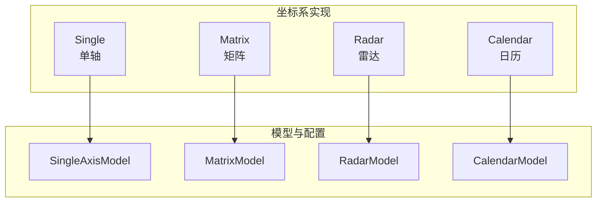
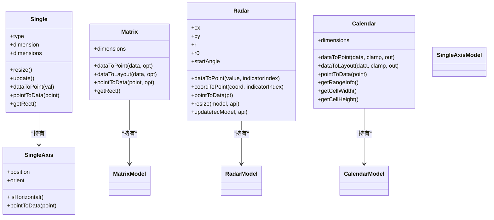
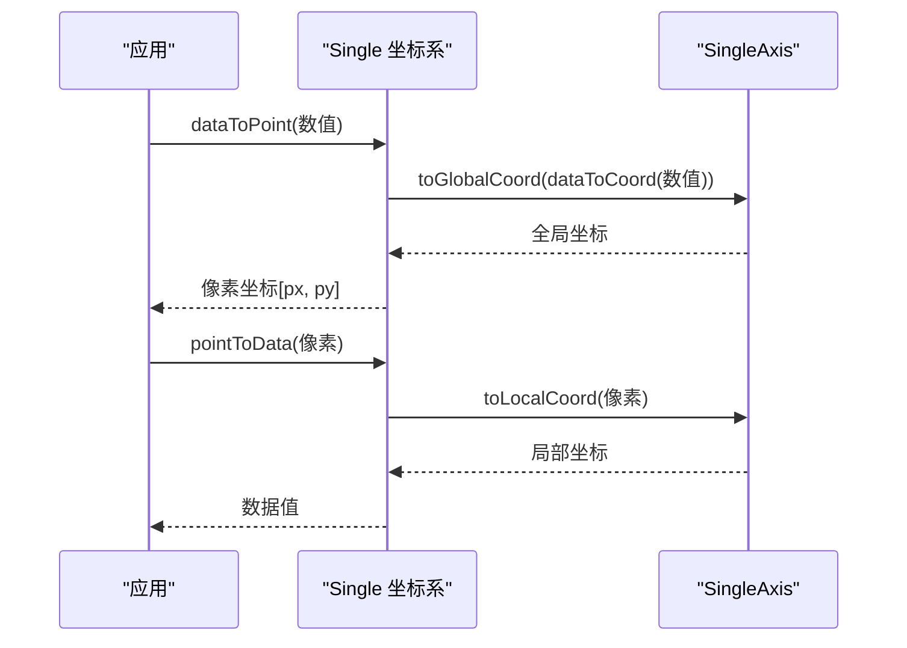
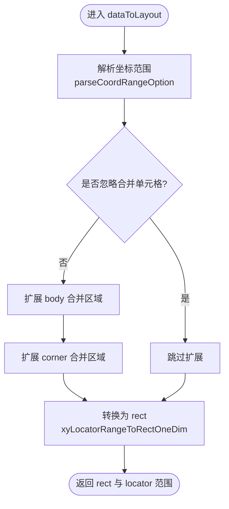
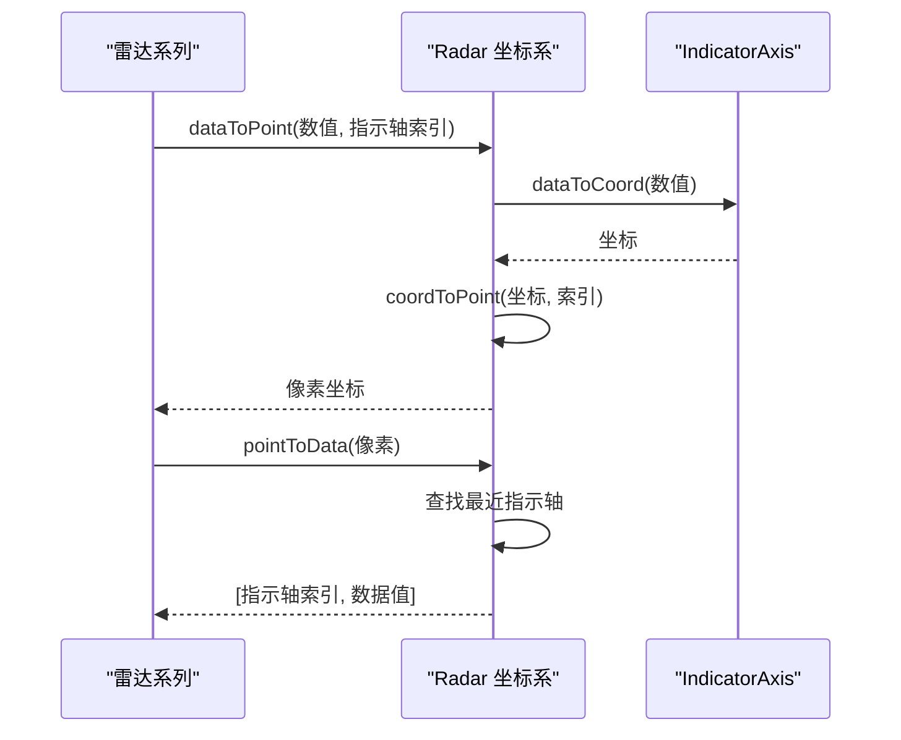
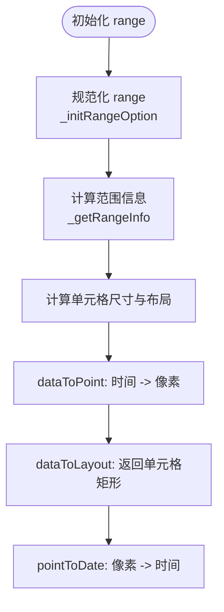
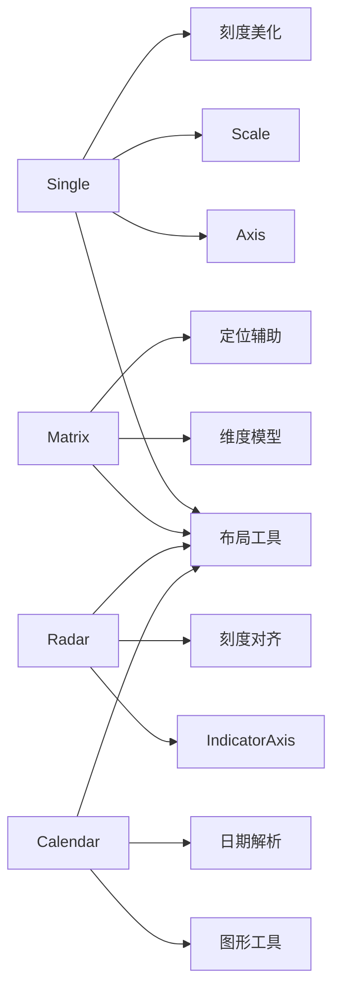

# 其他坐标系

<cite>
**本文引用的文件**
- [Single.ts](file://src/coord/single/Single.ts)
- [SingleAxis.ts](file://src/coord/single/SingleAxis.ts)
- [Matrix.ts](file://src/coord/matrix/Matrix.ts)
- [MatrixModel.ts](file://src/coord/matrix/MatrixModel.ts)
- [Radar.ts](file://src/coord/radar/Radar.ts)
- [RadarModel.ts](file://src/coord/radar/RadarModel.ts)
- [Calendar.ts](file://src/coord/calendar/Calendar.ts)
- [CalendarModel.ts](file://src/coord/calendar/CalendarModel.ts)
</cite>

## 目录
1. [简介](#简介)
2. [项目结构](#项目结构)
3. [核心组件](#核心组件)
4. [架构总览](#架构总览)
5. [详细组件分析](#详细组件分析)
6. [依赖关系分析](#依赖关系分析)
7. [性能考虑](#性能考虑)
8. [故障排查指南](#故障排查指南)
9. [结论](#结论)
10. [附录：使用示例与配置要点](#附录使用示例与配置要点)

## 简介
本章节聚焦 ECharts 中的“其他特殊坐标系”，包括单轴坐标系（Single）、矩阵坐标系（Matrix）、雷达坐标系（Radar）和日历坐标系（Calendar）。这些坐标系分别面向一维数据展示、二维矩阵数据的可视化与交互、多维指标对比以及日期时间维度的日历视图。我们将说明它们的设计思路、实现要点、与基础坐标系的差异与优势，并给出数据格式要求、配置方法与性能优化建议。

## 项目结构
ECharts 将坐标系抽象为 CoordinateSystem 接口，并通过各子目录组织具体实现：
- src/coord/single：单轴坐标系
- src/coord/matrix：矩阵坐标系
- src/coord/radar：雷达坐标系
- src/coord/calendar：日历坐标系

每个坐标系通常包含：
- 坐标系类（如 Single、Matrix、Radar、Calendar），负责数据与像素的转换、布局计算、范围判定等
- 模型类（如 SingleAxisModel、MatrixModel、RadarModel、CalendarModel），负责配置解析、默认值、维度定义等
- 辅助工具（如 matrixCoordHelper、singleAxisHelper 等）

图表来源
- [Single.ts:43-117](file://src/coord/single/Single.ts#L43-L117)
- [Matrix.ts:55-142](file://src/coord/matrix/Matrix.ts#L55-L142)
- [Radar.ts:41-82](file://src/coord/radar/Radar.ts#L41-L82)
- [Calendar.ts:94-147](file://src/coord/calendar/Calendar.ts#L94-L147)

章节来源
- [Single.ts:43-117](file://src/coord/single/Single.ts#L43-L117)
- [Matrix.ts:55-142](file://src/coord/matrix/Matrix.ts#L55-L142)
- [Radar.ts:41-82](file://src/coord/radar/Radar.ts#L41-L82)
- [Calendar.ts:94-147](file://src/coord/calendar/Calendar.ts#L94-L147)

## 核心组件
- 单轴坐标系（Single）：提供单一轴向的数据映射，支持水平/垂直方向、反转、刻度美化与布局适配，适用于一维数据展示（如进度条、评分条、单指标趋势）。
- 矩阵坐标系（Matrix）：以二维网格形式组织行列维度，支持层级维度、单元格合并、定位到单元格或区域、数据到布局的矩形返回，适合多维分类数据的交叉展示（如 MBTI、热力矩阵）。
- 雷达坐标系（Radar）：基于多根指示轴构建极坐标式坐标系，支持中心、半径、起始角度、顺时针/逆时针、分割数等，用于多维度能力评估与对比。
- 日历坐标系（Calendar）：将时间数据映射到日历网格，支持年/月/日范围、首周起始日、单元格尺寸、方向（横/竖），用于按天/周/月的统计与可视化。

章节来源
- [Single.ts:43-117](file://src/coord/single/Single.ts#L43-L117)
- [Matrix.ts:55-142](file://src/coord/matrix/Matrix.ts#L55-L142)
- [Radar.ts:41-82](file://src/coord/radar/Radar.ts#L41-L82)
- [Calendar.ts:94-147](file://src/coord/calendar/Calendar.ts#L94-L147)

## 架构总览
下图展示了四个坐标系与其模型的协作关系，以及典型的数据转换流程（dataToPoint / pointToData / dataToLayout）。

图表来源
- [Single.ts:43-117](file://src/coord/single/Single.ts#L43-L117)
- [SingleAxis.ts:40-75](file://src/coord/single/SingleAxis.ts#L40-L75)
- [Matrix.ts:55-142](file://src/coord/matrix/Matrix.ts#L55-L142)
- [MatrixModel.ts:300-362](file://src/coord/matrix/MatrixModel.ts#L300-L362)
- [Radar.ts:41-173](file://src/coord/radar/Radar.ts#L41-L173)
- [RadarModel.ts:112-195](file://src/coord/radar/RadarModel.ts#L112-L195)
- [Calendar.ts:94-147](file://src/coord/calendar/Calendar.ts#L94-L147)
- [CalendarModel.ts:157-188](file://src/coord/calendar/CalendarModel.ts#L157-L188)

## 详细组件分析

### 单轴坐标系（Single）
- 特点
  - 仅一个维度（single），通过 SingleAxis 管理刻度、方向、反转与布局。
  - 支持水平/垂直方向、反转、刻度自动美化与范围计算。
  - 提供 dataToPoint / pointToData / convertToPixel / convertFromPixel 等标准接口。
- 适用场景
  - 一维数据展示：评分、进度、单指标分布、简单条形/散点沿单轴排列。
- 关键实现要点
  - 初始化时根据模型创建 SingleAxis，设置 scale、位置、方向等。
  - update 阶段进行刻度美化和范围信息构建。
  - resize 阶段计算布局矩形并调整轴范围与变换函数。
  - containPoint 与 pointToData 根据方向与反转处理边界判断与坐标转换。

图表来源
- [Single.ts:119-156](file://src/coord/single/Single.ts#L119-L156)
- [Single.ts:201-227](file://src/coord/single/Single.ts#L201-L227)
- [SingleAxis.ts:40-75](file://src/coord/single/SingleAxis.ts#L40-L75)

章节来源
- [Single.ts:43-117](file://src/coord/single/Single.ts#L43-L117)
- [Single.ts:119-156](file://src/coord/single/Single.ts#L119-L156)
- [Single.ts:201-227](file://src/coord/single/Single.ts#L201-L227)
- [SingleAxis.ts:40-75](file://src/coord/single/SingleAxis.ts#L40-L75)

### 矩阵坐标系（Matrix）
- 功能特性
  - 二维网格布局，x/y 维度可分层级，支持单元格合并、定位到单元格或区域。
  - 提供 dataToLayout 返回矩形与定位范围，便于系列渲染与交互。
  - 支持 clamp 选项控制越界行为，支持忽略合并单元格的定位策略。
- 适用场景
  - 多维分类数据的交叉展示：如 MBTI、技能矩阵、产品-渠道矩阵等。
- 关键实现要点
  - 构造时解析 x/y 维度模型，计算布局并生成 body/corner 的单元格信息。
  - dataToLayout 解析坐标范围，考虑合并单元格扩展，输出 rect 与 locator 范围。
  - pointToData 将像素点映射到行列定位器，区分 body/corner/outside 区域。
  - 布局算法按层级与叶子节点分配空间，支持指定 size 与自动均分。

图表来源
- [Matrix.ts:181-231](file://src/coord/matrix/Matrix.ts#L181-L231)
- [Matrix.ts:325-403](file://src/coord/matrix/Matrix.ts#L325-L403)
- [MatrixModel.ts:300-362](file://src/coord/matrix/MatrixModel.ts#L300-L362)

章节来源
- [Matrix.ts:55-142](file://src/coord/matrix/Matrix.ts#L55-L142)
- [Matrix.ts:181-231](file://src/coord/matrix/Matrix.ts#L181-L231)
- [Matrix.ts:325-403](file://src/coord/matrix/Matrix.ts#L325-L403)
- [MatrixModel.ts:300-362](file://src/coord/matrix/MatrixModel.ts#L300-L362)

### 雷达坐标系（Radar）
- 实现原理
  - 基于多根指示轴（IndicatorAxis）构建极坐标式坐标系，每根轴对应一个维度。
  - 支持中心、半径、起始角度、顺时针/逆时针、分割数等配置。
  - 提供 dataToPoint / coordToPoint / pointToData 完成数据与像素的双向转换。
- 适用场景
  - 多维度能力评估、对比分析（如能力雷达图、绩效评估）。
- 关键实现要点
  - 构造时创建 IndicatorAxis，设置名称、刻度范围与角度。
  - resize 阶段计算中心、半径、起始角与各轴角度。
  - update 阶段统一刻度对齐与分割数，确保视觉一致性。
  - pointToData 通过角度匹配最近指示轴并换算半径到数据值。

图表来源
- [Radar.ts:64-82](file://src/coord/radar/Radar.ts#L64-L82)
- [Radar.ts:88-128](file://src/coord/radar/Radar.ts#L88-L128)
- [Radar.ts:130-173](file://src/coord/radar/Radar.ts#L130-L173)
- [RadarModel.ts:112-195](file://src/coord/radar/RadarModel.ts#L112-L195)

章节来源
- [Radar.ts:41-173](file://src/coord/radar/Radar.ts#L41-L173)
- [RadarModel.ts:112-195](file://src/coord/radar/RadarModel.ts#L112-L195)

### 日历坐标系（Calendar）
- 设计思路
  - 将时间数据映射到日历网格，支持年/月/日范围、首周起始日、单元格尺寸与方向。
  - 提供 dataToPoint / dataToLayout / pointToDate 等接口，支持单元格四角点计算。
- 适用场景
  - 按天/周/月的统计与可视化（如热度图、事件日历、健康打卡）。
- 关键实现要点
  - _initRangeOption 规范化 range，支持年、月、日字符串与数组。
  - _getRangeInfo 计算起止日期、总天数、周数、首尾周等信息。
  - dataToPoint 将时间转为单元格中心像素；dataToLayout 返回单元格矩形。
  - pointToDate 将像素反查为日期信息。

图表来源
- [Calendar.ts:169-194](file://src/coord/calendar/Calendar.ts#L169-L194)
- [Calendar.ts:208-247](file://src/coord/calendar/Calendar.ts#L208-L247)
- [Calendar.ts:255-321](file://src/coord/calendar/Calendar.ts#L255-L321)
- [Calendar.ts:358-368](file://src/coord/calendar/Calendar.ts#L358-L368)
- [Calendar.ts:398-447](file://src/coord/calendar/Calendar.ts#L398-L447)
- [Calendar.ts:457-516](file://src/coord/calendar/Calendar.ts#L457-L516)
- [CalendarModel.ts:157-188](file://src/coord/calendar/CalendarModel.ts#L157-L188)

章节来源
- [Calendar.ts:169-194](file://src/coord/calendar/Calendar.ts#L169-L194)
- [Calendar.ts:208-247](file://src/coord/calendar/Calendar.ts#L208-L247)
- [Calendar.ts:255-321](file://src/coord/calendar/Calendar.ts#L255-L321)
- [Calendar.ts:358-368](file://src/coord/calendar/Calendar.ts#L358-L368)
- [Calendar.ts:398-447](file://src/coord/calendar/Calendar.ts#L398-L447)
- [Calendar.ts:457-516](file://src/coord/calendar/Calendar.ts#L457-L516)
- [CalendarModel.ts:157-188](file://src/coord/calendar/CalendarModel.ts#L157-L188)

## 依赖关系分析
- 单轴坐标系依赖 Axis、Scale、布局工具与刻度美化模块。
- 矩阵坐标系依赖维度模型、布局工具、单元格合并与定位辅助。
- 雷达坐标系依赖指示轴、刻度对齐、布局工具与全局模型注入。
- 日历坐标系依赖布局工具、图形工具、日期解析与范围计算。

图表来源
- [Single.ts:24-37](file://src/coord/single/Single.ts#L24-L37)
- [Matrix.ts:20-52](file://src/coord/matrix/Matrix.ts#L20-L52)
- [Radar.ts:20-38](file://src/coord/radar/Radar.ts#L20-L38)
- [Calendar.ts:20-38](file://src/coord/calendar/Calendar.ts#L20-L38)

章节来源
- [Single.ts:24-37](file://src/coord/single/Single.ts#L24-L37)
- [Matrix.ts:20-52](file://src/coord/matrix/Matrix.ts#L20-L52)
- [Radar.ts:20-38](file://src/coord/radar/Radar.ts#L20-L38)
- [Calendar.ts:20-38](file://src/coord/calendar/Calendar.ts#L20-L38)

## 性能考虑
- 单轴坐标系
  - 合理设置刻度间隔与标签密度，避免过多标签导致渲染压力。
  - 在大数据量下，结合采样或过滤减少数据点数量。
- 矩阵坐标系
  - 使用 dataToLayout 获取单元格矩形，减少重复计算。
  - 谨慎使用合并单元格，避免大范围合并导致布局复杂化。
  - 对大量单元格渲染，优先启用高效渲染模式（如 Canvas）。
- 雷达坐标系
  - 控制指示轴数量与分割数，避免过多同心圆或轴线造成视觉拥挤。
  - 在大规模数据下，使用聚合或采样降低绘制成本。
- 日历坐标系
  - 合理设置 cellSize 与 orient，避免过小单元格导致文本重叠。
  - 对于长跨度范围，按需裁剪显示区间或使用数据缩放。

## 故障排查指南
- 单轴坐标系
  - 若数据无法映射到像素，检查 axis 的方向与反转配置是否正确。
  - 若刻度异常，确认 scale 类型与范围设置是否符合数据特征。
- 矩阵坐标系
  - 若定位失败或返回 NaN，检查输入坐标是否为有效范围，必要时启用 clamp。
  - 若合并单元格导致布局异常，检查 mergeCells 配置与坐标引用。
- 雷达坐标系
  - 若点无法映射到最近指示轴，检查 startAngle 与 clockwise 配置。
  - 若刻度不一致，确认 splitNumber 与刻度对齐逻辑。
- 日历坐标系
  - 若日期超出范围返回 NaN，检查 range 配置与数据日期是否在范围内。
  - 若单元格尺寸异常，检查 cellSize 与 orient 设置。

章节来源
- [Single.ts:119-156](file://src/coord/single/Single.ts#L119-L156)
- [Matrix.ts:181-231](file://src/coord/matrix/Matrix.ts#L181-L231)
- [Radar.ts:130-173](file://src/coord/radar/Radar.ts#L130-L173)
- [Calendar.ts:255-321](file://src/coord/calendar/Calendar.ts#L255-L321)

## 结论
单轴、矩阵、雷达与日历坐标系各自针对特定数据形态与展示需求提供了高效的坐标映射与布局能力。相比基础直角坐标系，它们在维度表达、交互定位与可视化语义上更具针对性。在实际使用中，应结合数据规模、交互复杂度与渲染性能，选择合适的坐标系与配置策略。

## 附录：使用示例与配置要点
- 单轴坐标系
  - 数据格式：一维数值或类别值。
  - 配置要点：direction/orient、inverse、scale 类型与范围、label 格式化。
  - 参考路径：[Single.ts:43-117](file://src/coord/single/Single.ts#L43-L117)
- 矩阵坐标系
  - 数据格式：二维分类数据，支持层级与合并单元格。
  - 配置要点：x/y 维度定义、levelSize、mergeCells、tooltip 触发。
  - 参考路径：[MatrixModel.ts:36-195](file://src/coord/matrix/MatrixModel.ts#L36-L195)
- 雷达坐标系
  - 数据格式：多维指标值，每个维度对应一根指示轴。
  - 配置要点：indicator、center、radius、startAngle、clockwise、splitNumber。
  - 参考路径：[RadarModel.ts:67-104](file://src/coord/radar/RadarModel.ts#L67-L104)
- 日历坐标系
  - 数据格式：时间+数值，时间可为日期字符串或时间戳。
  - 配置要点：range、cellSize、orient、dayLabel/monthLabel/yearLabel。
  - 参考路径：[CalendarModel.ts:68-155](file://src/coord/calendar/CalendarModel.ts#L68-L155)