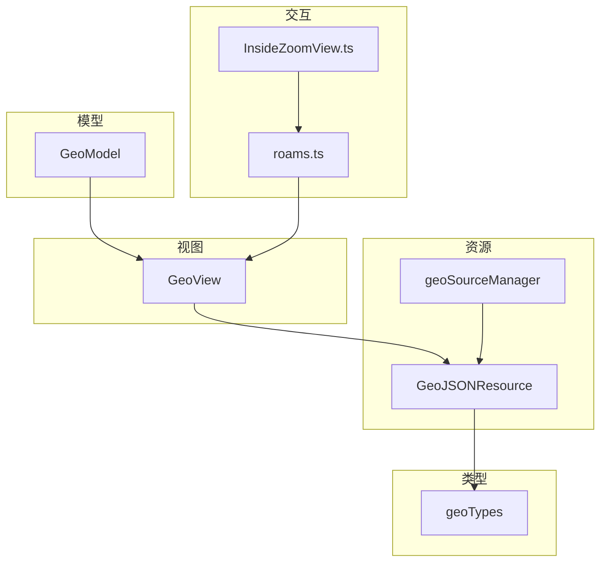
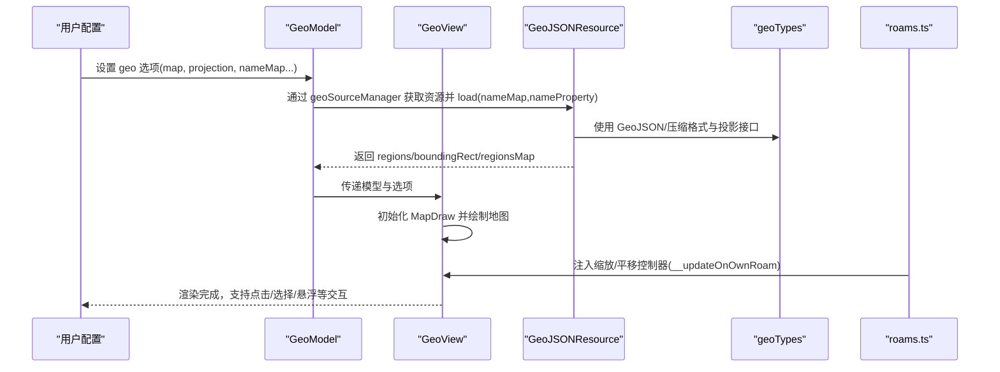
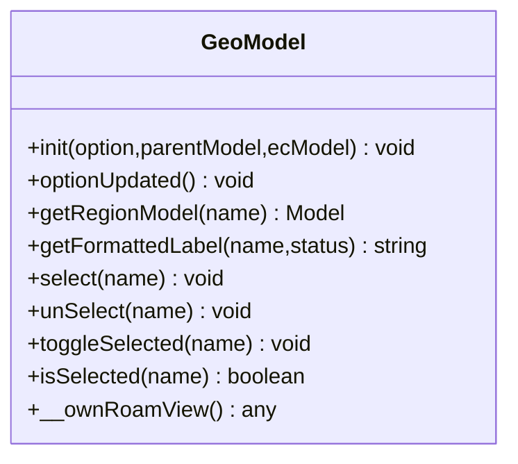
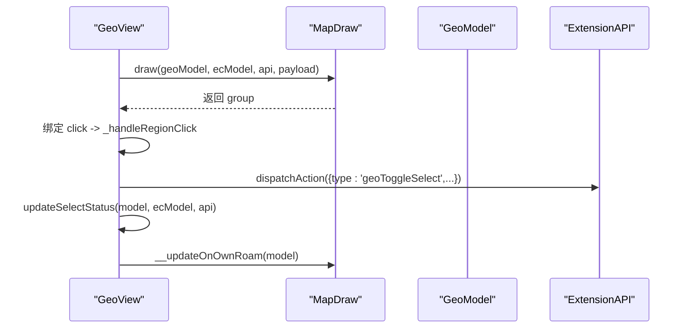
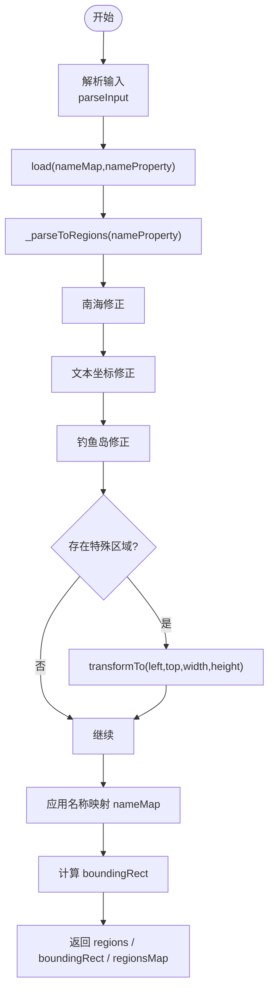
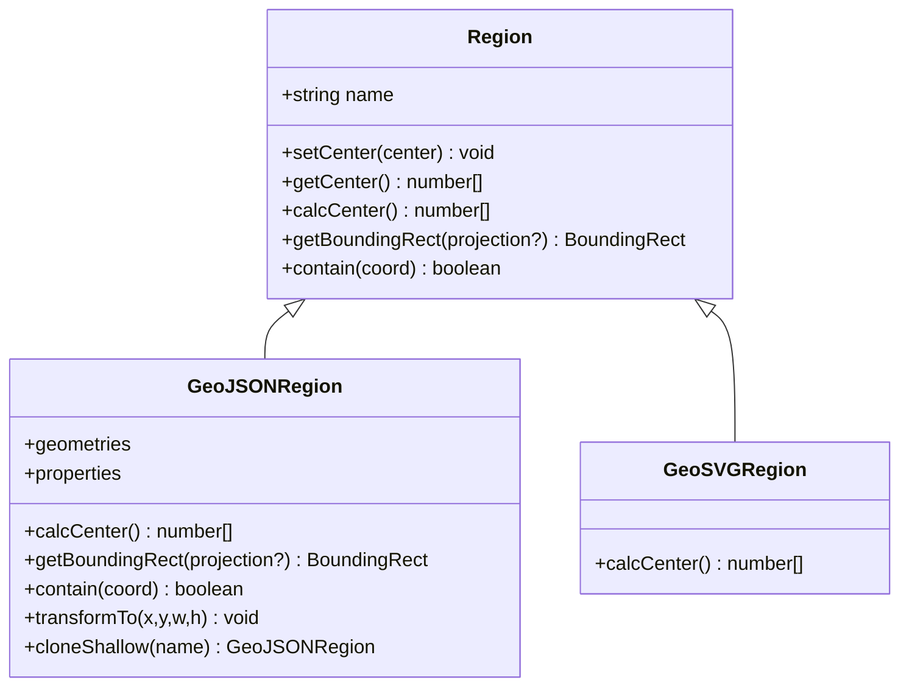
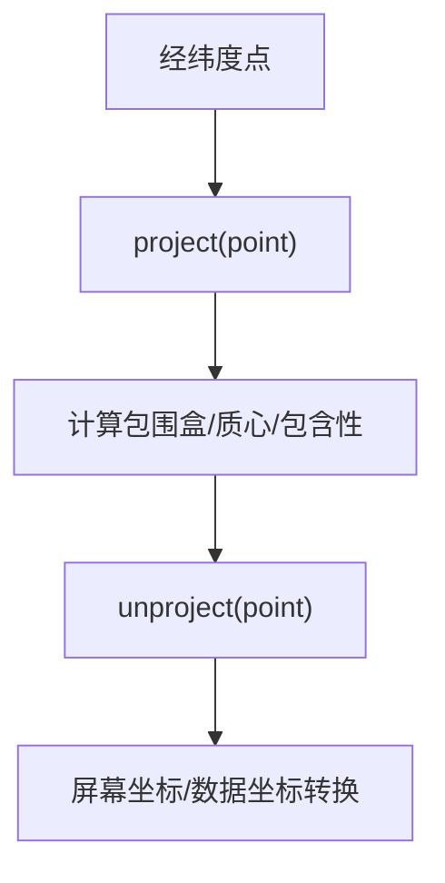
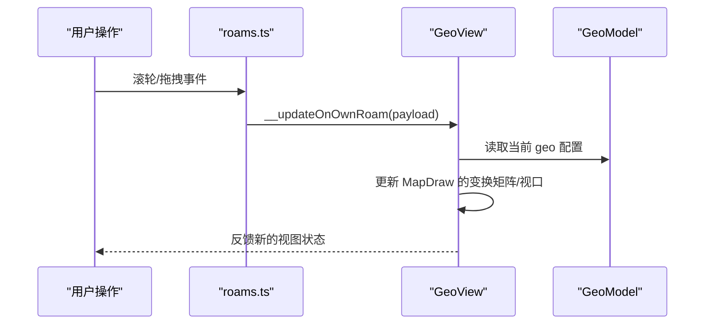
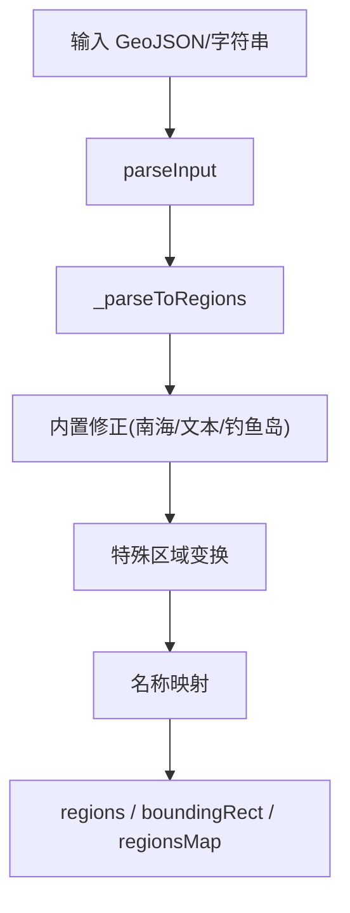
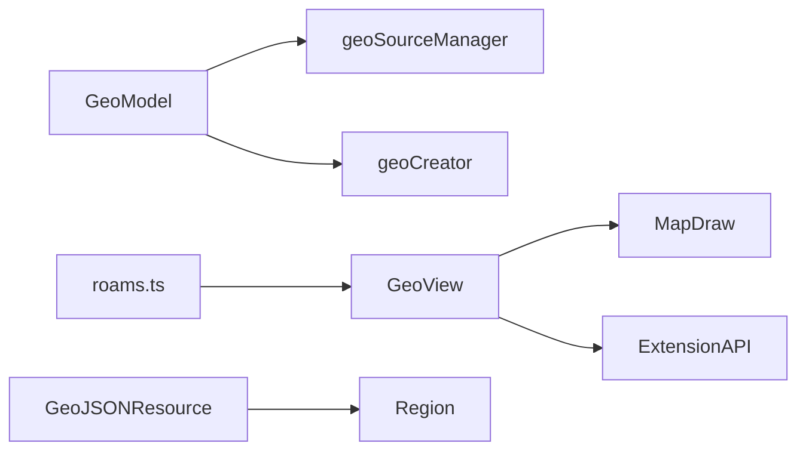

# 地理坐标系

<cite>
**本文引用的文件**
- [GeoModel.ts](file://src/coord/geo/GeoModel.ts)
- [GeoView.ts](file://src/component/geo/GeoView.ts)
- [GeoJSONResource.ts](file://src/coord/geo/GeoJSONResource.ts)
- [Region.ts](file://src/coord/geo/Region.ts)
- [geoTypes.ts](file://src/coord/geo/geoTypes.ts)
- [geoSourceManager.ts](file://src/coord/geo/geoSourceManager.ts)
- [roams.ts](file://src/component/dataZoom/roams.ts)
- [InsideZoomView.ts](file://src/component/dataZoom/InsideZoomView.ts)
- [decode.js](file://test/data/map/decode.js)
</cite>

## 目录
1. [简介](#简介)
2. [项目结构](#项目结构)
3. [核心组件](#核心组件)
4. [架构总览](#架构总览)
5. [详细组件分析](#详细组件分析)
6. [依赖关系分析](#依赖关系分析)
7. [性能考量](#性能考量)
8. [故障排查指南](#故障排查指南)
9. [结论](#结论)
10. [附录](#附录)

## 简介
本章节面向希望深入理解 ECharts 地理坐标系的读者，系统阐述其设计原理与地图功能：包括地图投影与坐标变换机制、Region 组件的职责与配置、GeoJSON 资源的加载与处理流程、地图交互（缩放/平移）的实现原理、与其他坐标系的集成与数据映射规则，以及热力图、迁徙图等高级可视化效果的实现思路与大数据量优化策略。

## 项目结构
ECharts 的地理能力由“模型-视图-资源-类型”分层组织：
- 模型层：GeoModel 负责 geo 组件的配置解析、区域选择状态、默认样式与主题合并等。
- 视图层：GeoView 负责地图绘制、事件分发、选中态更新与漫游宿主对接。
- 资源层：GeoJSONResource 负责 GeoJSON 输入解析、区域构建、边界框计算与特殊区域修正。
- 类型层：geoTypes 定义 GeoJSON/压缩格式、名称映射、投影接口等关键类型。
- 管理器：geoSourceManager 提供资源注册与获取，统一对外暴露 getMapForUser 等方法。
- 交互层：dataZoom 的 roam 处理器为 geo 提供统一的缩放/平移控制。

图表来源
- [GeoModel.ts:154-352](file://src/coord/geo/GeoModel.ts#L154-L352)
- [GeoView.ts:31-123](file://src/component/geo/GeoView.ts#L31-L123)
- [GeoJSONResource.ts:34-170](file://src/coord/geo/GeoJSONResource.ts#L34-L170)
- [geoTypes.ts:26-182](file://src/coord/geo/geoTypes.ts#L26-L182)
- [geoSourceManager.ts:121-149](file://src/coord/geo/geoSourceManager.ts#L121-L149)
- [roams.ts:171-263](file://src/component/dataZoom/roams.ts#L171-L263)
- [InsideZoomView.ts:1-30](file://src/component/dataZoom/InsideZoomView.ts#L1-L30)

章节来源
- [GeoModel.ts:154-352](file://src/coord/geo/GeoModel.ts#L154-L352)
- [GeoView.ts:31-123](file://src/component/geo/GeoView.ts#L31-L123)
- [GeoJSONResource.ts:34-170](file://src/coord/geo/GeoJSONResource.ts#L34-L170)
- [geoTypes.ts:26-182](file://src/coord/geo/geoTypes.ts#L26-L182)
- [geoSourceManager.ts:121-149](file://src/coord/geo/geoSourceManager.ts#L121-L149)
- [roams.ts:171-263](file://src/component/dataZoom/roams.ts#L171-L263)
- [InsideZoomView.ts:1-30](file://src/component/dataZoom/InsideZoomView.ts#L1-L30)

## 核心组件
- GeoModel：维护 geo 组件选项（如 map、center、zoom、boundingCoords、projection、nameMap、nameProperty 等），管理区域选择状态与标签格式化，并作为 RoamHostModel 暴露给交互子系统。
- GeoView：负责渲染地图图形、绑定点击事件以触发 geo 区域选择、更新选中态，并在自身漫游时同步更新。
- GeoJSONResource：将 GeoJSON/压缩格式解析为 Region 列表，计算包围盒，应用特殊区域修正与名称映射，支持用户侧导出原始资源。
- Region：抽象出地理区域的几何与中心点计算；GeoJSONRegion 支持多边形/线串几何、包围盒计算、包含性检测与坐标变换；GeoSVGRegion 用于 SVG 源的中心点计算。
- geoTypes：定义 GeoJSON/压缩格式、名称映射、投影接口（project/unproject/stream）、资源接口等。
- geoSourceManager：统一管理 geo 资源，提供 load/getMapForUser 等能力。
- dataZoom roam：为 geo 提供统一的鼠标滚轮缩放、拖拽平移等交互控制，并与内部 dataZoom 联动。

章节来源
- [GeoModel.ts:154-352](file://src/coord/geo/GeoModel.ts#L154-L352)
- [GeoView.ts:31-123](file://src/component/geo/GeoView.ts#L31-L123)
- [GeoJSONResource.ts:34-170](file://src/coord/geo/GeoJSONResource.ts#L34-L170)
- [Region.ts:79-338](file://src/coord/geo/Region.ts#L79-L338)
- [geoTypes.ts:26-182](file://src/coord/geo/geoTypes.ts#L26-L182)
- [geoSourceManager.ts:121-149](file://src/coord/geo/geoSourceManager.ts#L121-L149)
- [roams.ts:171-263](file://src/component/dataZoom/roams.ts#L171-L263)

## 架构总览
下图展示从配置到渲染、再到交互的关键路径：

图表来源
- [GeoModel.ts:247-284](file://src/coord/geo/GeoModel.ts#L247-L284)
- [GeoJSONResource.ts:62-95](file://src/coord/geo/GeoJSONResource.ts#L62-L95)
- [geoTypes.ts:169-181](file://src/coord/geo/geoTypes.ts#L169-L181)
- [GeoView.ts:44-68](file://src/component/geo/GeoView.ts#L44-L68)
- [roams.ts:248-263](file://src/component/dataZoom/roams.ts#L248-L263)

## 详细组件分析

### GeoModel：配置、区域与选择状态
- 负责合并默认与主题样式，针对 geoJSON 源设置默认填充色。
- 通过 geoCreator 填充 regions，并为每个 region 创建独立 Model，维护 selectedMap 与选择模式。
- 提供标签格式化、选择/取消选择/切换选择等 API。
- 作为 RoamHostModel 暴露 __ownRoamView，供 dataZoom 的 roam 控制器驱动视图更新。

图表来源
- [GeoModel.ts:154-352](file://src/coord/geo/GeoModel.ts#L154-L352)

章节来源
- [GeoModel.ts:154-352](file://src/coord/geo/GeoModel.ts#L154-L352)

### GeoView：渲染、事件与选中态
- 在 render 中创建或复用 MapDraw，绘制地图并绑定点击事件，触发 geoToggleSelect 动作。
- 根据 geoModel 的 silent 属性设置 group 的可交互性。
- 通过 updateSelectStatus 遍历节点，依据 isSelected 进入/离开选中态。
- 实现 __updateOnOwnRoam，响应来自 dataZoom 的缩放/平移变化。

图表来源
- [GeoView.ts:44-114](file://src/component/geo/GeoView.ts#L44-L114)

章节来源
- [GeoView.ts:31-123](file://src/component/geo/GeoView.ts#L31-L123)

### GeoJSONResource：资源加载与处理
- 构造时解析输入（字符串或对象），缓存 parsed 结果（按 nameProperty）。
- load 阶段：
  - 解析 GeoJSON 为 Region 列表，计算 boundingRect。
  - 应用南海修正、文本坐标修正、钓鱼岛修正等内置修复。
  - 对特殊区域（specialAreas）执行 transformTo 变换以提升显示效果。
  - 基于 nameMap 进行名称映射，输出最终 regions 与 regionsMap。
- 提供 getMapForUser 向后兼容导出原始资源与 specialAreas。

图表来源
- [GeoJSONResource.ts:62-129](file://src/coord/geo/GeoJSONResource.ts#L62-L129)
- [GeoJSONResource.ts:153-169](file://src/coord/geo/GeoJSONResource.ts#L153-L169)

章节来源
- [GeoJSONResource.ts:34-170](file://src/coord/geo/GeoJSONResource.ts#L34-L170)

### Region：几何、中心点与包围盒
- Region 抽象类提供 name、center、getBoundingRect、contain 等通用能力。
- GeoJSONRegion：
  - 支持 Polygon/MultiPolygon 与 LineString/MultiLineString。
  - calcCenter 优先基于最大外环多边形的质心，否则回退到包围盒中心。
  - getBoundingRect 支持可选投影参数，若使用投影则每次重新计算。
  - contain 使用外部多边形包含判断，并考虑内环（洞）排除。
  - transformTo 将几何整体变换到目标包围盒，同时更新中心点。
- GeoSVGRegion：基于 SVG Element 的层级变换计算中心点。

图表来源
- [Region.ts:79-338](file://src/coord/geo/Region.ts#L79-L338)

章节来源
- [Region.ts:79-338](file://src/coord/geo/Region.ts#L79-L338)

### 地图投影与坐标变换
- 投影接口：GeoProjection 提供 project/unproject，以及可选的 stream 以支持旋转投影时的反子午线裁剪。
- 使用位置：
  - Region.getBoundingRect 在传入 projection 时对点进行投影后再计算包围盒。
  - GeoJSONResource._parseToRegions 在解析后对特殊区域执行 transformTo，以便在布局上更合理展示。
- 示例与测试：测试用例展示了多种投影（如墨卡托、等距圆锥、等积地球等）的使用方式。

图表来源
- [geoTypes.ts:169-181](file://src/coord/geo/geoTypes.ts#L169-L181)
- [Region.ts:182-216](file://src/coord/geo/Region.ts#L182-L216)
- [GeoJSONResource.ts:97-129](file://src/coord/geo/GeoJSONResource.ts#L97-L129)

章节来源
- [geoTypes.ts:169-181](file://src/coord/geo/geoTypes.ts#L169-L181)
- [Region.ts:182-216](file://src/coord/geo/Region.ts#L182-L216)
- [GeoJSONResource.ts:97-129](file://src/coord/geo/GeoJSONResource.ts#L97-L129)

### 地图交互：缩放与平移
- dataZoom 的 roam 处理器为 geo 提供统一的缩放/平移控制，支持鼠标滚轮缩放、拖拽移动、触摸手势等。
- 当多个 dataZoom 共享同一 roam 控制器时，会合并配置以避免重复触发。
- GeoView.__updateOnOwnRoam 接收 roam 变更并通知 MapDraw 更新视图。

图表来源
- [roams.ts:171-263](file://src/component/dataZoom/roams.ts#L171-L263)
- [GeoView.ts:70-82](file://src/component/geo/GeoView.ts#L70-L82)

章节来源
- [roams.ts:171-263](file://src/component/dataZoom/roams.ts#L171-L263)
- [GeoView.ts:70-82](file://src/component/geo/GeoView.ts#L70-L82)

### GeoJSON 资源加载与数据格式
- 支持的输入：字符串 JSON、对象 GeoJSON、压缩格式 GeoJSONCompressed（UTF8Encoding/UTF8Scale）。
- 解析流程：
  - parseInput 将字符串转为对象（优先 JSON.parse）。
  - _parseToRegions 调用底层解析器生成 Region 列表。
  - 内置修正：南海、文本坐标、钓鱼岛。
  - 特殊区域：对指定区域执行 transformTo 提升显示效果。
  - 名称映射：通过 nameMap 将别名映射到正式名称。
- 测试工具：decode.js 演示了压缩格式的解码过程（UTF8 编码与 encodeOffsets）。

图表来源
- [GeoJSONResource.ts:54-95](file://src/coord/geo/GeoJSONResource.ts#L54-L95)
- [GeoJSONResource.ts:97-129](file://src/coord/geo/GeoJSONResource.ts#L97-L129)
- [decode.js:20-37](file://test/data/map/decode.js#L20-L37)

章节来源
- [GeoJSONResource.ts:34-170](file://src/coord/geo/GeoJSONResource.ts#L34-L170)
- [decode.js:20-37](file://test/data/map/decode.js#L20-L37)

### 与其他坐标系的集成与数据映射
- geo 作为独立坐标系，可与 series（如 scatter/line/heatmap/lines）配合使用，数据维度需与 geo 的数据空间对齐。
- 通过 geo 的 projection 与 center/zoom/boundingCoords 控制数据到屏幕的映射。
- 名称映射 nameMap 与 nameProperty 确保系列数据中的地名与 GeoJSON 中的区域名一致。
- 对于 geoSVG 源，Region 的中心点计算会考虑 SVG 元素的层级变换，保证数据与视觉一致。

章节来源
- [geoTypes.ts:26-182](file://src/coord/geo/geoTypes.ts#L26-L182)
- [Region.ts:296-338](file://src/coord/geo/Region.ts#L296-L338)

### 高级用法与特效
- 热力图：结合 geo 坐标系与 heatmap 系列，利用 geo 的投影与缩放能力，将密度数据映射到地理空间。
- 迁徙图：使用 lines 系列在 geo 坐标系中绘制起点与终点连线，结合动画与视觉映射表达流动趋势。
- 区域高亮与选择：通过 geo 的 selectedMode 与 geoToggleSelect 动作，实现单/多选交互。
- 自定义投影：通过 GeoProjection.stream 支持复杂投影（如旋转投影）的反子午线裁剪，避免拼接伪影。

章节来源
- [GeoModel.ts:165-245](file://src/coord/geo/GeoModel.ts#L165-L245)
- [geoTypes.ts:169-181](file://src/coord/geo/geoTypes.ts#L169-L181)

## 依赖关系分析
- GeoModel 依赖 geoSourceManager 获取资源，依赖 geoCreator 填充 regions，依赖 Model 体系管理区域子项。
- GeoView 依赖 MapDraw 进行绘制，依赖 ExtensionAPI 派发动作与更新选中态。
- GeoJSONResource 依赖 parseGeoJson、内置修正模块与 Region 类型。
- dataZoom 的 roam 处理器与 GeoView.__updateOnOwnRoam 形成闭环，驱动 geo 视图的缩放/平移。

图表来源
- [GeoModel.ts:247-284](file://src/coord/geo/GeoModel.ts#L247-L284)
- [GeoView.ts:44-68](file://src/component/geo/GeoView.ts#L44-L68)
- [GeoJSONResource.ts:97-129](file://src/coord/geo/GeoJSONResource.ts#L97-L129)
- [roams.ts:248-263](file://src/component/dataZoom/roams.ts#L248-L263)

章节来源
- [GeoModel.ts:247-284](file://src/coord/geo/GeoModel.ts#L247-L284)
- [GeoView.ts:44-68](file://src/component/geo/GeoView.ts#L44-L68)
- [GeoJSONResource.ts:97-129](file://src/coord/geo/GeoJSONResource.ts#L97-L129)
- [roams.ts:248-263](file://src/component/dataZoom/roams.ts#L248-L263)

## 性能考量
- 延迟解析：GeoJSONResource 在构造时解析输入，可考虑按需延迟至首次使用以降低首屏时间（代码中有注释提示）。
- 包围盒缓存：Region.getBoundingRect 在无投影时缓存矩形，减少重复计算。
- 投影开销：启用投影时会强制重算包围盒，建议仅在必要时开启，或预计算投影后的几何。
- 数据规模：
  - 使用压缩 GeoJSON（UTF8Encoding/UTF8Scale）减小体积。
  - 对超大面片数据进行简化或分块加载。
  - 合理使用 dataZoom 限制可视范围，降低渲染压力。
- 交互节流：roams 中对事件进行节流与合并，避免频繁触发导致卡顿。

章节来源
- [GeoJSONResource.ts:54-56](file://src/coord/geo/GeoJSONResource.ts#L54-L56)
- [Region.ts:182-216](file://src/coord/geo/Region.ts#L182-L216)
- [decode.js:20-37](file://test/data/map/decode.js#L20-L37)
- [roams.ts:171-263](file://src/component/dataZoom/roams.ts#L171-L263)

## 故障排查指南
- 地图未显示：检查 geoSourceManager 是否已注册对应 mapName 的资源；确认 GeoJSON 格式正确且 features 非空。
- 名称不匹配：确认 nameMap 与 nameProperty 与实际 GeoJSON 字段一致；必要时在 GeoJSONResource.load 中进行映射。
- 投影异常：检查 GeoProjection 的 project/unproject 实现是否正确；如需旋转投影，提供 stream 以处理反子午线裁剪。
- 交互无响应：确认 GeoView.silent 未被设置为 true；检查 dataZoom 的 roam 配置是否启用。
- 性能问题：评估 GeoJSON 大小与复杂度；启用压缩格式；减少不必要的投影计算；使用 dataZoom 限制可视范围。

章节来源
- [geoSourceManager.ts:121-149](file://src/coord/geo/geoSourceManager.ts#L121-L149)
- [GeoJSONResource.ts:62-95](file://src/coord/geo/GeoJSONResource.ts#L62-L95)
- [geoTypes.ts:169-181](file://src/coord/geo/geoTypes.ts#L169-L181)
- [GeoView.ts:53-68](file://src/component/geo/GeoView.ts#L53-L68)

## 结论
ECharts 地理坐标系通过清晰的模型-视图-资源分层，结合灵活的投影接口与完善的资源处理流程，实现了高性能、可扩展的地图可视化能力。借助 Region 的几何与包围盒计算、GeoJSONResource 的解析与修正、dataZoom 的统一交互控制，开发者可以便捷地构建从基础地图到热力图、迁徙图等高级场景的可视化应用。在大流量与大数据量场景下，应充分利用压缩格式、投影优化与可视范围限制等手段，保障流畅体验。

## 附录
- 配置要点速查：
  - geo 组件：map、center、zoom、boundingCoords、projection、nameMap、nameProperty、selectedMode、regions。
  - 资源：GeoJSON/压缩格式、UTF8Encoding/UTF8Scale。
  - 交互：dataZoom 的 inside 类型与 roam 配置。
- 推荐实践：
  - 使用 nameMap 统一地名映射，避免歧义。
  - 对特殊区域（如阿拉斯加）使用 specialAreas 提升显示效果。
  - 大地图优先采用压缩 GeoJSON，并结合 dataZoom 控制可视范围。
  - 需要旋转投影时提供 stream，避免反子午线伪影。