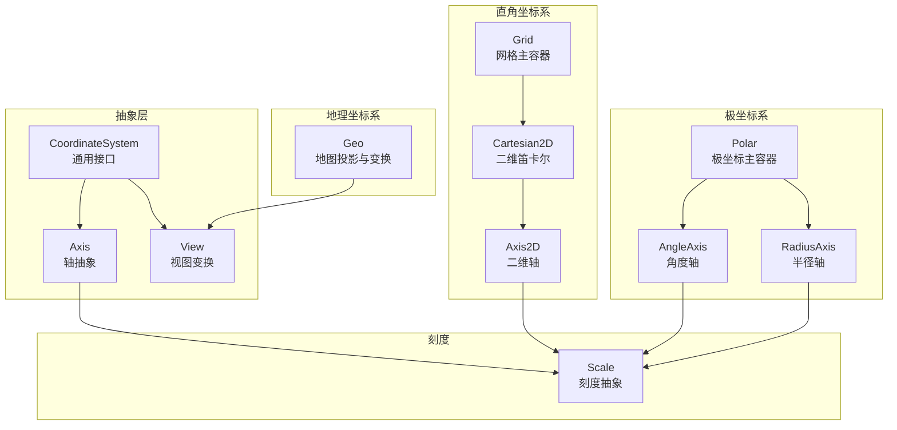
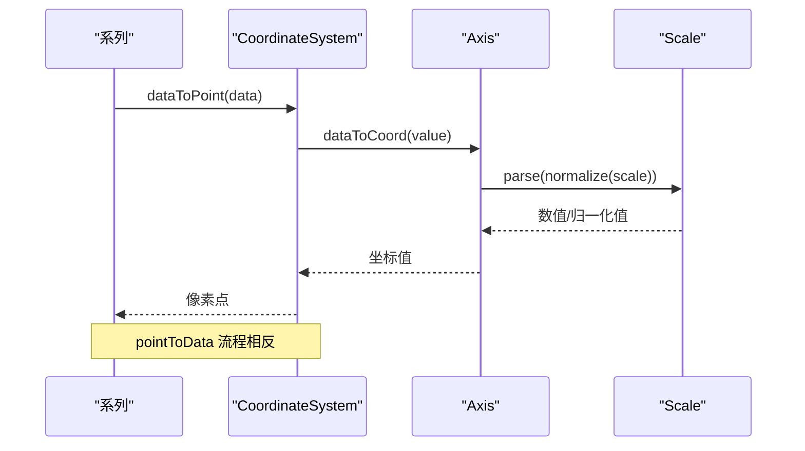
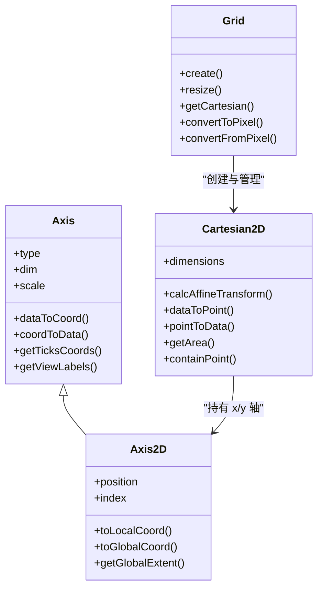
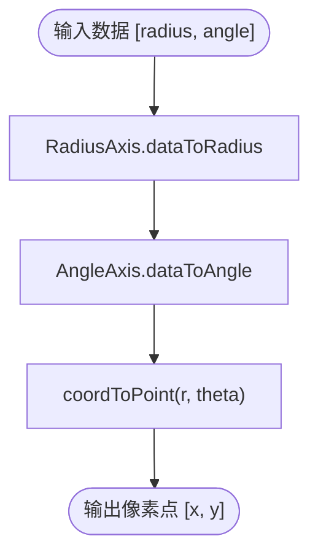
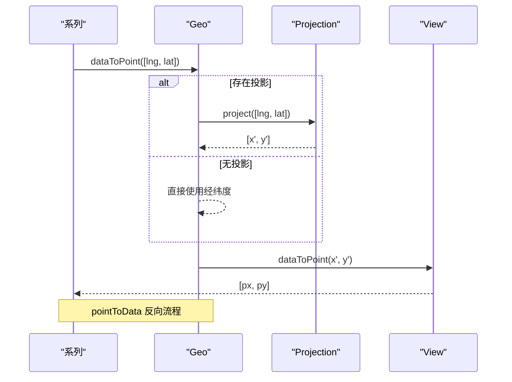
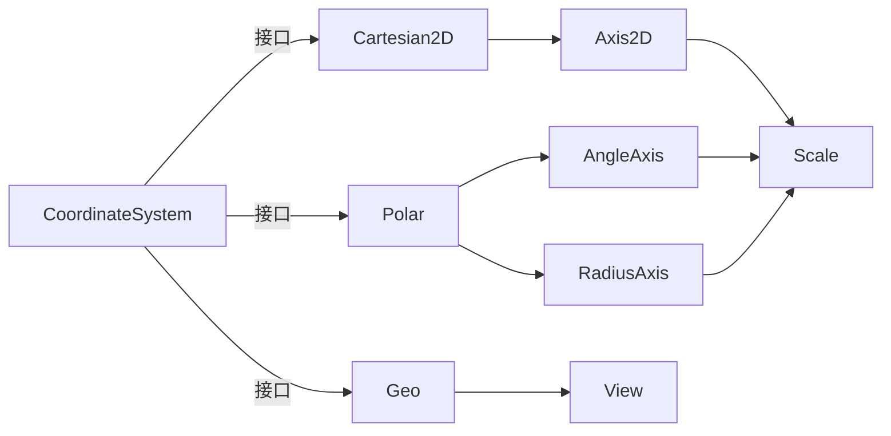

# 坐标系系统

<cite>
**本文引用的文件**
- [src/coord/CoordinateSystem.ts](file://src/coord/CoordinateSystem.ts)
- [src/coord/cartesian/Cartesian2D.ts](file://src/coord/cartesian/Cartesian2D.ts)
- [src/coord/cartesian/Grid.ts](file://src/coord/cartesian/Grid.ts)
- [src/coord/cartesian/Axis2D.ts](file://src/coord/cartesian/Axis2D.ts)
- [src/coord/polar/Polar.ts](file://src/coord/polar/Polar.ts)
- [src/coord/polar/AngleAxis.ts](file://src/coord/polar/AngleAxis.ts)
- [src/coord/polar/RadiusAxis.ts](file://src/coord/polar/RadiusAxis.ts)
- [src/coord/geo/Geo.ts](file://src/coord/geo/Geo.ts)
- [src/coord/View.ts](file://src/coord/View.ts)
- [src/coord/Axis.ts](file://src/coord/Axis.ts)
- [src/scale/Scale.ts](file://src/scale/Scale.ts)
</cite>

## 目录
1. [简介](#简介)
2. [项目结构](#项目结构)
3. [核心组件](#核心组件)
4. [架构总览](#架构总览)
5. [详细组件分析](#详细组件分析)
6. [依赖关系分析](#依赖关系分析)
7. [性能考量](#性能考量)
8. [故障排查指南](#故障排查指南)
9. [结论](#结论)
10. [附录：自定义坐标系开发指南](#附录自定义坐标系开发指南)

## 简介
本文件系统性阐述 ECharts 坐标系系统的设计原理与实现机制，覆盖抽象基类与通用接口、坐标转换原理、直角坐标系（Cartesian2D）、极坐标系（Polar）、地理坐标系（Geo）的投影与变换、以及坐标系与图表系列的集成和数据映射规则。文末提供自定义坐标系的开发指南与实际应用场景建议。

## 项目结构
ECharts 坐标系位于 src/coord 下，按类型划分模块：
- 抽象与通用：CoordinateSystem、Axis、View
- 直角坐标系：cartesian（Grid、Cartesian2D、Axis2D）
- 极坐标系：polar（Polar、AngleAxis、RadiusAxis）
- 地理坐标系：geo（Geo）
- 刻度体系：scale（Scale 及具体实现）

**图示来源**
- [src/coord/CoordinateSystem.ts:121-233](file://src/coord/CoordinateSystem.ts#L121-L233)
- [src/coord/cartesian/Grid.ts:103-128](file://src/coord/cartesian/Grid.ts#L103-L128)
- [src/coord/cartesian/Cartesian2D.ts:41-52](file://src/coord/cartesian/Cartesian2D.ts#L41-L52)
- [src/coord/cartesian/Axis2D.ts:43-86](file://src/coord/cartesian/Axis2D.ts#L43-L86)
- [src/coord/polar/Polar.ts:34-64](file://src/coord/polar/Polar.ts#L34-L64)
- [src/coord/polar/AngleAxis.ts:37-45](file://src/coord/polar/AngleAxis.ts#L37-L45)
- [src/coord/polar/RadiusAxis.ts:30-38](file://src/coord/polar/RadiusAxis.ts#L30-L38)
- [src/coord/geo/Geo.ts:58-84](file://src/coord/geo/Geo.ts#L58-L84)
- [src/scale/Scale.ts:51-125](file://src/scale/Scale.ts#L51-L125)

**章节来源**
- [src/coord/CoordinateSystem.ts:121-233](file://src/coord/CoordinateSystem.ts#L121-L233)
- [src/coord/cartesian/Grid.ts:103-128](file://src/coord/cartesian/Grid.ts#L103-L128)
- [src/coord/polar/Polar.ts:34-64](file://src/coord/polar/Polar.ts#L34-L64)
- [src/coord/geo/Geo.ts:58-84](file://src/coord/geo/Geo.ts#L58-L84)
- [src/scale/Scale.ts:51-125](file://src/scale/Scale.ts#L51-L125)

## 核心组件
- 坐标系抽象接口 CoordinateSystem：定义 dataToPoint、pointToData、getArea、containPoint、getAxes、getBaseAxis 等统一能力，使不同坐标系可被系列以一致方式访问。
- 轴抽象 Axis：封装数据到坐标的映射、刻度计算、标签布局、范围判断等；Axis2D 扩展了全局坐标与局部坐标转换。
- 视图变换 View：为支持漫游（平移缩放）的坐标系提供 raw/roam/overall 三套矩阵变换，统一处理 dataRect 与 viewRect 的映射。
- 刻度 Scale：抽象刻度生成、区间、对数、时间、序数等尺度行为，供轴使用。

**章节来源**
- [src/coord/CoordinateSystem.ts:121-233](file://src/coord/CoordinateSystem.ts#L121-L233)
- [src/coord/Axis.ts:60-151](file://src/coord/Axis.ts#L60-L151)
- [src/coord/View.ts:228-330](file://src/coord/View.ts#L228-L330)
- [src/scale/Scale.ts:51-125](file://src/scale/Scale.ts#L51-L125)

## 架构总览
坐标系体系采用“主容器 + 维度轴”的组合模式：
- Grid 作为直角坐标系主容器，管理 x/y 轴组合，生成 Cartesian2D 实例，并提供 convertToPixel/convertFromPixel 等能力。
- Polar 作为极坐标系主容器，持有 AngleAxis 与 RadiusAxis，完成角度与半径的坐标转换与区域判定。
- Geo 作为地理坐标系主容器，基于 View 提供投影与漫游变换，将经纬度或 SVG 坐标映射到画布像素。

**图示来源**
- [src/coord/CoordinateSystem.ts:141-183](file://src/coord/CoordinateSystem.ts#L141-L183)
- [src/coord/Axis.ts:136-151](file://src/coord/Axis.ts#L136-L151)
- [src/scale/Scale.ts:68-85](file://src/scale/Scale.ts#L68-L85)

## 详细组件分析

### 直角坐标系（Cartesian2D）
- 维度：x、y
- 轴：Axis2D（继承 Axis），支持 toLocalCoord/toGlobalCoord 与 getGlobalExtent
- 主容器：Grid，负责创建轴、计算 extent、对齐刻度、计算 Affine 变换加速大批量数据转换
- 关键能力：
  - dataToPoint/pointToData：优先走预计算的仿射矩阵，否则回退到逐轴转换
  - containPoint/containData/containZone：基于轴范围与区域矩形判断
  - getArea：返回 BoundingRect，用于裁剪与包含判断
  - clampData：将数据限制在轴的当前有效范围内

**图示来源**
- [src/coord/Axis.ts:60-151](file://src/coord/Axis.ts#L60-L151)
- [src/coord/cartesian/Axis2D.ts:43-118](file://src/coord/cartesian/Axis2D.ts#L43-L118)
- [src/coord/cartesian/Cartesian2D.ts:41-205](file://src/coord/cartesian/Cartesian2D.ts#L41-L205)
- [src/coord/cartesian/Grid.ts:103-128](file://src/coord/cartesian/Grid.ts#L103-L128)

**章节来源**
- [src/coord/cartesian/Cartesian2D.ts:41-205](file://src/coord/cartesian/Cartesian2D.ts#L41-L205)
- [src/coord/cartesian/Grid.ts:134-279](file://src/coord/cartesian/Grid.ts#L134-L279)
- [src/coord/cartesian/Axis2D.ts:43-118](file://src/coord/cartesian/Axis2D.ts#L43-L118)

#### 轴管理与刻度计算
- Grid 在 update 阶段执行 scaleCalcNice/align，确保多轴刻度对齐；prepareAlignToInCoordSysCreate 决定哪些轴需要对齐到同一基准。
- Axis.getTicksCoords 结合 onBand、breaks、interval 等策略生成刻度坐标；minor ticks 由 Scale.getMinorTicks 提供。
- 当启用 boundaryGap/onBand 时，tick/label 位置会进行半带宽偏移修正，保证视觉对齐。

**章节来源**
- [src/coord/cartesian/Grid.ts:146-189](file://src/coord/cartesian/Grid.ts#L146-L189)
- [src/coord/cartesian/Grid.ts:723-776](file://src/coord/cartesian/Grid.ts#L723-L776)
- [src/coord/Axis.ts:167-225](file://src/coord/Axis.ts#L167-L225)
- [src/coord/Axis.ts:267-270](file://src/coord/Axis.ts#L267-L270)

#### 网格绘制与区域判定
- Cartesian2D.getArea 返回 BoundingRect，用于 clipPath 与 contain 判断；containZone 通过两对角点构造区域矩形并与网格区域相交判断。
- Grid.resize 中根据 grid 布局参数与 axis label/name 包围盒调整 extent，必要时二次 resize。

**章节来源**
- [src/coord/cartesian/Cartesian2D.ts:190-205](file://src/coord/cartesian/Cartesian2D.ts#L190-L205)
- [src/coord/cartesian/Grid.ts:207-279](file://src/coord/cartesian/Grid.ts#L207-L279)

### 极坐标系（Polar）
- 维度：radius、angle
- 轴：RadiusAxis、AngleAxis，分别处理半径与角度的数据-坐标转换
- 主容器：Polar，同时实现 CoordinateSystem 与 CoordinateSystemMaster，提供 dataToPoint/pointToData、getArea（环形区域）、tooltip axes 选择等
- 角度与半径转换：
  - dataToPoint：先经轴转换为 (radius, angle)，再调用 coordToPoint 转为 (x, y)
  - pointToCoord：从像素点反算半径与角度，并归一化到角度范围
  - coordToPoint：将极坐标 (r, θ) 转为笛卡尔坐标 (x, y)

**图示来源**
- [src/coord/polar/Polar.ts:140-158](file://src/coord/polar/Polar.ts#L140-L158)
- [src/coord/polar/Polar.ts:163-203](file://src/coord/polar/Polar.ts#L163-L203)
- [src/coord/polar/RadiusAxis.ts:30-47](file://src/coord/polar/RadiusAxis.ts#L30-L47)
- [src/coord/polar/AngleAxis.ts:37-49](file://src/coord/polar/AngleAxis.ts#L37-L49)

**章节来源**
- [src/coord/polar/Polar.ts:34-248](file://src/coord/polar/Polar.ts#L34-L248)
- [src/coord/polar/AngleAxis.ts:37-125](file://src/coord/polar/AngleAxis.ts#L37-L125)
- [src/coord/polar/RadiusAxis.ts:30-47](file://src/coord/polar/RadiusAxis.ts#L30-L47)

### 地理坐标系（Geo）
- 维度：lng、lat（GeoLikeCoordSys）
- 主容器：Geo，继承 Transformable，实现 CoordinateSystemMaster 与 GeoLikeCoordSys
- 投影与变换：
  - 若配置 projection，则 dataToPoint 先调用 projection.project，再交由 View.dataToPoint
  - pointToData 先 unproject，再交由 View.pointToData
  - 通过 View 维护 dataRect/viewRect 与 roam 变换，支持平移缩放动画与同步
- 区域与边界：
  - getBoundingRect/getViewRect 委托 View
  - shouldClip 控制是否裁剪
  - getArea 返回带容差的视图矩形

**图示来源**
- [src/coord/geo/Geo.ts:198-222](file://src/coord/geo/Geo.ts#L198-L222)
- [src/coord/View.ts:287-301](file://src/coord/View.ts#L287-L301)

**章节来源**
- [src/coord/geo/Geo.ts:58-275](file://src/coord/geo/Geo.ts#L58-L275)
- [src/coord/View.ts:228-330](file://src/coord/View.ts#L228-L330)

### 坐标系与系列的集成与数据映射
- 注入机制：Grid.create 中通过 injectCoordSysByOption 将 Cartesian2D 注入 seriesModel；Polar/Geo 也提供 convertToPixel/convertFromPixel 以便 API 与交互查找对应坐标系。
- 数据映射：
  - 系列通过 coordinateSystem.dataToPoint/pointToData 完成数据与像素的双向转换
  - 轴负责数据到坐标的映射，Scale 负责数值解析与刻度生成
  - 对于地理数据，Geo 在数据进入 View 前应用投影变换

**章节来源**
- [src/coord/cartesian/Grid.ts:536-603](file://src/coord/cartesian/Grid.ts#L536-L603)
- [src/coord/polar/Polar.ts:250-262](file://src/coord/polar/Polar.ts#L250-L262)
- [src/coord/geo/Geo.ts:224-236](file://src/coord/geo/Geo.ts#L224-L236)
- [src/coord/Axis.ts:136-151](file://src/coord/Axis.ts#L136-L151)
- [src/scale/Scale.ts:68-85](file://src/scale/Scale.ts#L68-L85)

## 依赖关系分析
- 低耦合：CoordinateSystem 仅定义接口，具体实现解耦于系列与组件
- 高内聚：每个坐标系内部组织其轴与变换逻辑，如 Polar 聚合 AngleAxis/RadiusAxis，Cartesian2D 聚合 Axis2D
- 外部依赖：
  - zrender：矩阵、向量、包围盒、Transformable 等图形基础
  - model/ExtensionAPI：模型解析与扩展能力注入
  - scale：刻度算法与断点处理

**图示来源**
- [src/coord/CoordinateSystem.ts:121-233](file://src/coord/CoordinateSystem.ts#L121-L233)
- [src/coord/cartesian/Cartesian2D.ts:41-52](file://src/coord/cartesian/Cartesian2D.ts#L41-L52)
- [src/coord/polar/Polar.ts:34-64](file://src/coord/polar/Polar.ts#L34-L64)
- [src/coord/geo/Geo.ts:58-84](file://src/coord/geo/Geo.ts#L58-L84)
- [src/scale/Scale.ts:51-125](file://src/scale/Scale.ts#L51-L125)

**章节来源**
- [src/coord/CoordinateSystem.ts:121-233](file://src/coord/CoordinateSystem.ts#L121-L233)
- [src/coord/cartesian/Cartesian2D.ts:41-52](file://src/coord/cartesian/Cartesian2D.ts#L41-L52)
- [src/coord/polar/Polar.ts:34-64](file://src/coord/polar/Polar.ts#L34-L64)
- [src/coord/geo/Geo.ts:58-84](file://src/coord/geo/Geo.ts#L58-L84)
- [src/scale/Scale.ts:51-125](file://src/scale/Scale.ts#L51-L125)

## 性能考量
- 仿射变换加速：Cartesian2D.calcAffineTransform 在 x/y 均为 interval/time 且无断点时，构建线性变换矩阵，批量数据点转换走 applyTransform，显著降低开销
- 刻度对齐与缓存：Grid.update 中对齐刻度避免重复计算；AngleAxis.calculateCategoryInterval 使用缓存稳定区间
- 视图变换复用：View 维护 mtRaw/mtOverall 及其逆矩阵，减少重复求逆与乘法
- 断点与无效数据：Scale.brk 与 hasBreaks 影响刻度与变换路径，需避免不必要的分支

**章节来源**
- [src/coord/cartesian/Cartesian2D.ts:54-88](file://src/coord/cartesian/Cartesian2D.ts#L54-L88)
- [src/coord/polar/AngleAxis.ts:92-117](file://src/coord/polar/AngleAxis.ts#L92-L117)
- [src/coord/View.ts:471-580](file://src/coord/View.ts#L471-L580)
- [src/scale/Scale.ts:58-66](file://src/scale/Scale.ts#L58-L66)

## 故障排查指南
- 坐标转换异常
  - 检查轴 extent 是否正确设置（Grid.resize 后更新）
  - 确认 scale 类型与断点配置（hasBreaks 会影响仿射路径）
  - 地理数据未生效：确认 projection 的 project/unproject 均提供且资源类型支持
- 刻度重叠或错位
  - 检查 alignTicks 与 __alignTo 设置
  - 检查 onBand/boundaryGap 与 interval 的配合
- 区域包含判断错误
  - 确认 getArea 的 tolerance 与 contain 逻辑
  - 极坐标环形区域 r0==r 的情况不包含任何点

**章节来源**
- [src/coord/cartesian/Grid.ts:207-279](file://src/coord/cartesian/Grid.ts#L207-L279)
- [src/coord/cartesian/Grid.ts:723-776](file://src/coord/cartesian/Grid.ts#L723-L776)
- [src/coord/polar/Polar.ts:209-248](file://src/coord/polar/Polar.ts#L209-L248)
- [src/coord/geo/Geo.ts:128-143](file://src/coord/geo/Geo.ts#L128-L143)

## 结论
ECharts 坐标系系统以统一的 CoordinateSystem 接口为核心，通过 Grid/Polar/Geo 等主容器组合不同维度的轴与变换，实现了直角、极地与地理等多种坐标空间的一致访问与高效转换。借助仿射矩阵、视图变换与刻度对齐等优化手段，系统在大数据量与复杂交互场景下仍保持良好性能。

## 附录：自定义坐标系开发指南
- 实现 CoordinateSystem 接口：至少提供 dataToPoint、pointToData、containPoint、getArea；可选实现 getAxes、getBaseAxis、getOtherAxis、getBoundingRect、getViewRect、getRoamTransform
- 设计维度与轴：明确 dimensions（如 ['x','y'] 或 ['radius','angle']），为每个维度提供 Axis 子类，实现 dataToCoord/coordToData
- 主容器职责：管理轴集合、计算 extent、提供 convertToPixel/convertFromPixel、处理区域裁剪与包含判断
- 与系列集成：通过 injectCoordSysByOption 将坐标系注入系列；确保 series.coordinateSystem 可用
- 性能优化：尽可能使用仿射变换或矩阵变换批量转换；缓存刻度与区间信息；避免频繁求逆
- 实际应用场景：
  - 自定义多维并行坐标（Parallel）
  - 三维或伪三维坐标（Matrix/3D 扩展）
  - 特殊业务坐标（如雷达图、时序环图等）

**章节来源**
- [src/coord/CoordinateSystem.ts:121-233](file://src/coord/CoordinateSystem.ts#L121-L233)
- [src/coord/cartesian/Grid.ts:536-603](file://src/coord/cartesian/Grid.ts#L536-L603)
- [src/coord/View.ts:228-330](file://src/coord/View.ts#L228-L330)