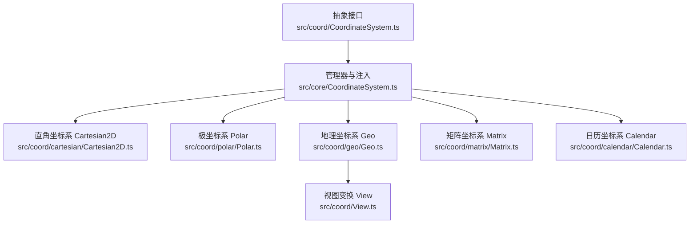
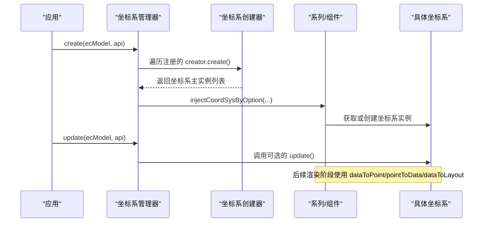
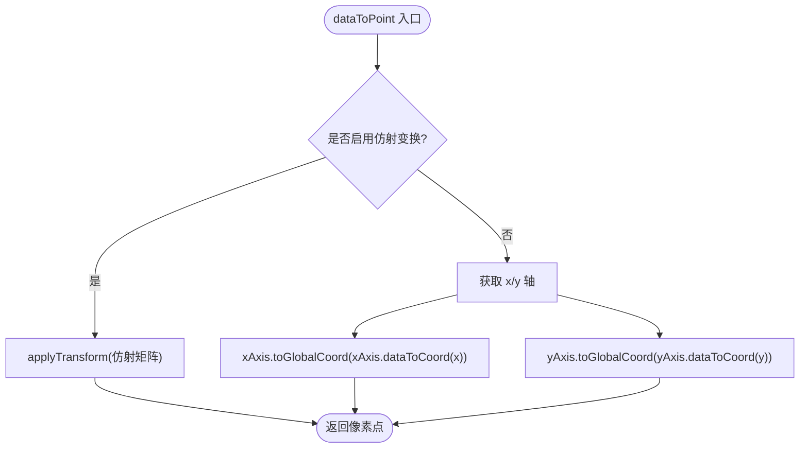
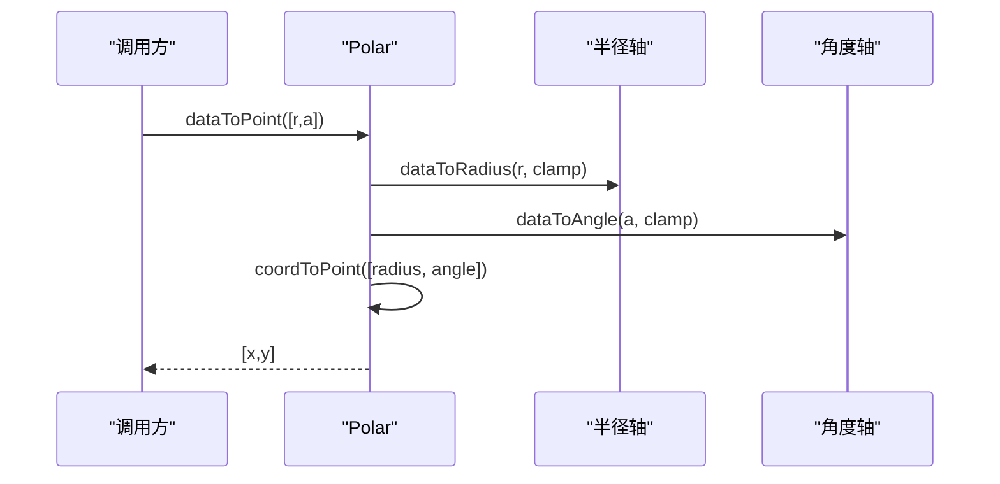
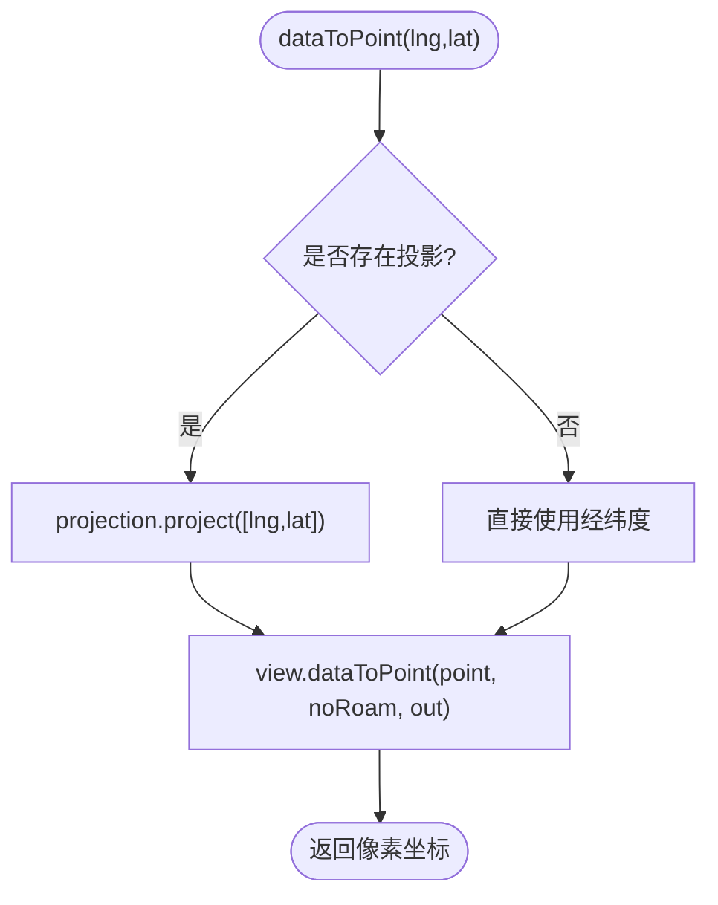
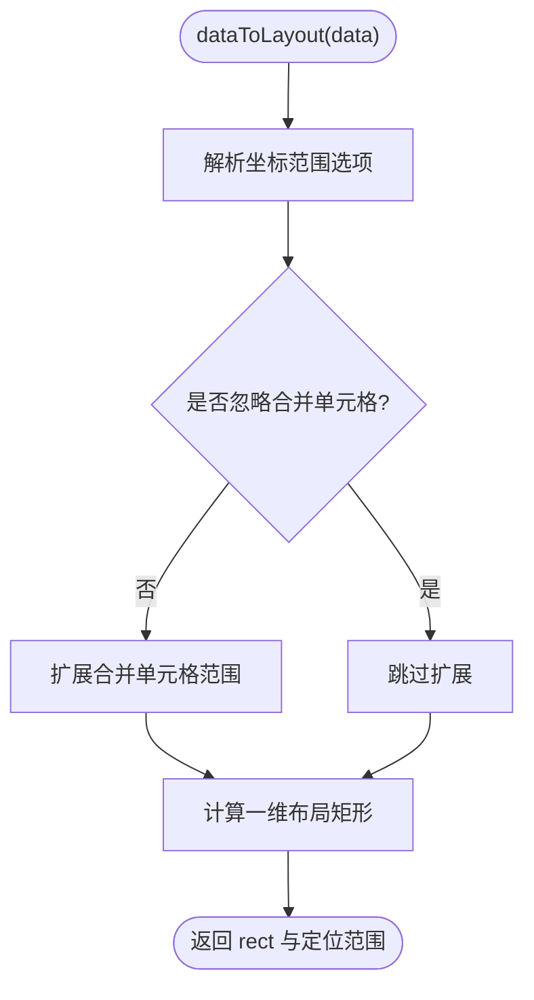
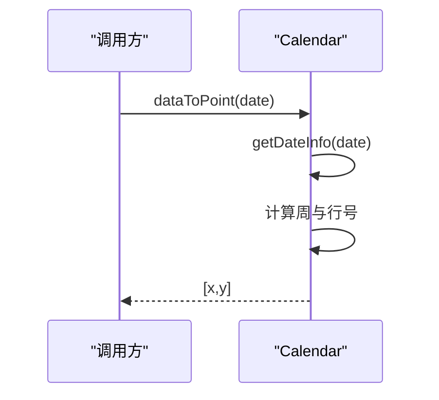
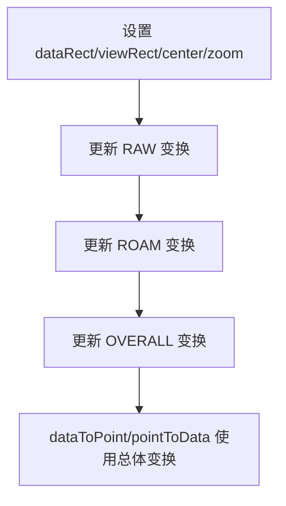

# 坐标系系统概览

<cite>
**本文引用的文件**
- [src/coord/CoordinateSystem.ts](file://src/coord/CoordinateSystem.ts)
- [src/core/CoordinateSystem.ts](file://src/core/CoordinateSystem.ts)
- [src/coord/cartesian/Cartesian2D.ts](file://src/coord/cartesian/Cartesian2D.ts)
- [src/coord/cartesian/Grid.ts](file://src/coord/cartesian/Grid.ts)
- [src/coord/polar/Polar.ts](file://src/coord/polar/Polar.ts)
- [src/coord/geo/Geo.ts](file://src/coord/geo/Geo.ts)
- [src/coord/matrix/Matrix.ts](file://src/coord/matrix/Matrix.ts)
- [src/coord/calendar/Calendar.ts](file://src/coord/calendar/Calendar.ts)
- [src/coord/View.ts](file://src/coord/View.ts)
</cite>

## 目录
1. [简介](#简介)
2. [项目结构](#项目结构)
3. [核心组件](#核心组件)
4. [架构总览](#架构总览)
5. [详细组件分析](#详细组件分析)
6. [依赖关系分析](#依赖关系分析)
7. [性能考虑](#性能考虑)
8. [故障排查指南](#故障排查指南)
9. [结论](#结论)
10. [附录](#附录)

## 简介
本文件系统性介绍 ECharts 坐标系系统的整体架构与设计原理，覆盖以下要点：
- CoordinateSystem 抽象基类的作用与通用接口定义
- 坐标系的继承体系与扩展机制（注册、创建、注入）
- 数据坐标、像素坐标、布局坐标的概念与转换关系
- 坐标系的创建、初始化与生命周期管理
- 坐标系与图表系列、组件的集成方式与数据流处理
- 自定义坐标系的开发方法与最佳实践
- 性能优化建议与常见问题解决方案

## 项目结构
ECharts 坐标系系统以“抽象接口 + 具体实现 + 管理器”的分层组织呈现：
- 抽象接口与类型定义位于 coord/CoordinateSystem.ts
- 坐标系管理器与注入逻辑位于 core/CoordinateSystem.ts
- 具体坐标系实现分布在 coord/* 子目录（如 cartesian、polar、geo、matrix、calendar）
- View 提供统一的视图变换能力，被 geo 等坐标系复用

**图示来源**
- [src/coord/CoordinateSystem.ts:121-233](file://src/coord/CoordinateSystem.ts#L121-L233)
- [src/core/CoordinateSystem.ts:47-107](file://src/core/CoordinateSystem.ts#L47-L107)
- [src/coord/cartesian/Cartesian2D.ts:41-52](file://src/coord/cartesian/Cartesian2D.ts#L41-L52)
- [src/coord/polar/Polar.ts:34-58](file://src/coord/polar/Polar.ts#L34-L58)
- [src/coord/geo/Geo.ts:58-84](file://src/coord/geo/Geo.ts#L58-L84)
- [src/coord/matrix/Matrix.ts:55-73](file://src/coord/matrix/Matrix.ts#L55-L73)
- [src/coord/calendar/Calendar.ts:94-106](file://src/coord/calendar/Calendar.ts#L94-L106)
- [src/coord/View.ts:228-259](file://src/coord/View.ts#L228-L259)

**章节来源**
- [src/coord/CoordinateSystem.ts:121-233](file://src/coord/CoordinateSystem.ts#L121-L233)
- [src/core/CoordinateSystem.ts:47-107](file://src/core/CoordinateSystem.ts#L47-L107)

## 核心组件
- CoordinateSystem 抽象接口：定义数据到像素、像素到数据、包含判断、裁剪区域、轴访问等统一方法。
- CoordinateSystemMaster：表示“主坐标系”，可包含多个具体坐标系实例（例如 Grid 作为 Cartesian2D 的主坐标系）。
- CoordinateSystemManager：负责注册、创建、更新所有坐标系，并维护非系列盒型坐标系与普通坐标系的创建顺序。
- 具体坐标系：Cartesian2D、Polar、Geo、Matrix、Calendar 等，各自实现数据/像素/布局转换与业务特性。
- View：提供 dataRect/viewRect 与三类变换（原始、漫游、总体），支撑可漫游的坐标系（如地图）。

关键职责与关系：
- 管理器通过 create/update 协调各坐标系的创建与更新；series/component 通过 injectCoordSysByOption 注入所需坐标系。
- 具体坐标系实现 dataToPoint/pointToData/dataToLayout 等转换，并提供 containPoint/getArea 等几何能力。
- Geo 使用 View 统一管理投影、缩放和平移，暴露 getBoundingRect/getViewRect/getRoamTransform。

**章节来源**
- [src/coord/CoordinateSystem.ts:121-233](file://src/coord/CoordinateSystem.ts#L121-L233)
- [src/core/CoordinateSystem.ts:47-107](file://src/core/CoordinateSystem.ts#L47-L107)
- [src/coord/geo/Geo.ts:58-84](file://src/coord/geo/Geo.ts#L58-L84)
- [src/coord/View.ts:228-259](file://src/coord/View.ts#L228-L259)

## 架构总览
坐标系系统采用“接口-实现-管理器-注入”的解耦设计：
- 接口层：CoordinateSystem 定义通用契约，确保不同坐标系对外行为一致。
- 管理层：CoordinateSystemManager 集中注册与生命周期管理，支持普通坐标系与非系列盒型坐标系两类创建流程。
- 注入层：injectCoordSysByOption 将坐标系按模型配置注入到 series/component，支持 data 与 box 两种使用模式。
- 视图层：View 为需要漫游的坐标系提供统一的变换与动画同步机制。

**图示来源**
- [src/core/CoordinateSystem.ts:59-89](file://src/core/CoordinateSystem.ts#L59-L89)
- [src/core/CoordinateSystem.ts:290-347](file://src/core/CoordinateSystem.ts#L290-L347)
- [src/coord/matrix/Matrix.ts:84-105](file://src/coord/matrix/Matrix.ts#L84-L105)
- [src/coord/calendar/Calendar.ts:544-562](file://src/coord/calendar/Calendar.ts#L544-L562)
- [src/coord/cartesian/Grid.ts:536-603](file://src/coord/cartesian/Grid.ts#L536-L603)

## 详细组件分析

### 抽象接口与类型（CoordinateSystem）
- 统一方法：
  - dataToPoint(point, opt?, out?)：数据坐标转像素坐标
  - pointToData(point, opt?, out?)：像素坐标转数据坐标
  - dataToLayout(data, opt?, out?)：数据坐标转布局矩形（部分坐标系支持）
  - containPoint(point)：点是否在坐标系可视区域内
  - getArea(tolerance?)：返回裁剪区域
  - getAxes()/getAxis(dim)：获取轴集合或指定维度轴
  - getBaseAxis()/getOtherAxis(base)：基础轴与辅助轴（用于堆叠、提示等）
  - clampData(data, out?)：数据范围钳制
  - getBoundingRect()/getViewRect()/getRoamTransform()：地理类坐标系扩展能力
- 主从关系：CoordinateSystemMaster 可持有多个 CoordinateSystem（如 Grid 管理多个 Cartesian2D）。
- 地理类扩展：GeoLikeCoordSys 要求 dimensions 为 ['lng','lat'] 且必须实现 getViewRect。

```mermaid
classDiagram
class CoordinateSystem {
+string type
+dimensions string[]
+dataToPoint(data, opt?, out?) number[]
+pointToData(point, opt?, out?) number|number[]
+dataToLayout(data, opt?, out?) CoordinateSystemDataLayout
+containPoint(point) boolean
+getArea(tolerance?) CoordinateSystemClipArea
+getAxes() Axis[]
+getAxis(dim) Axis
+getBaseAxis() Axis
+getOtherAxis(base) Axis
+clampData(data, out?) number[]
+getBoundingRect() BoundingRect
+getViewRect() BoundingRect
+getRoamTransform() MatrixArray
}
class CoordinateSystemMaster {
+dimensions string[]
+model ComponentModel
+update(ecModel, api) void
+convertToPixel(...) any
+convertToLayout(...) any
+convertFromPixel(...) any
+containPoint(point) boolean
+getAxes() Axis[]
+axisPointerEnabled boolean
+getTooltipAxes(dim) object
+getRect() RectLike
}
CoordinateSystemMaster --> CoordinateSystem : "可包含多个"
```

**图示来源**
- [src/coord/CoordinateSystem.ts:121-233](file://src/coord/CoordinateSystem.ts#L121-L233)
- [src/coord/CoordinateSystem.ts:35-119](file://src/coord/CoordinateSystem.ts#L35-L119)

**章节来源**
- [src/coord/CoordinateSystem.ts:121-233](file://src/coord/CoordinateSystem.ts#L121-L233)
- [src/coord/CoordinateSystem.ts:35-119](file://src/coord/CoordinateSystem.ts#L35-L119)

### 直角坐标系 Cartesian2D
- 维度：['x','y']，基于两条 Axis2D（x/y 轴）构建。
- 核心能力：
  - dataToPoint/pointToData：支持仿射变换加速（当 x/y 均为时间或数值且无断点时）
  - getBaseAxis：优先 ordinal/time，否则回退到 x
  - containPoint/containData/containZone：区域包含判断
  - getArea：返回包围矩形，支持容差
- 与 Grid 的关系：Grid 作为主坐标系，管理多个 Cartesian2D，并在 update 中计算刻度对齐、零线对齐、标签外扩等。

**图示来源**
- [src/coord/cartesian/Cartesian2D.ts:58-88](file://src/coord/cartesian/Cartesian2D.ts#L58-L88)
- [src/coord/cartesian/Cartesian2D.ts:131-152](file://src/coord/cartesian/Cartesian2D.ts#L131-L152)

**章节来源**
- [src/coord/cartesian/Cartesian2D.ts:41-152](file://src/coord/cartesian/Cartesian2D.ts#L41-L152)
- [src/coord/cartesian/Grid.ts:134-189](file://src/coord/cartesian/Grid.ts#L134-L189)

### 极坐标系 Polar
- 维度：['radius','angle']，由半径轴与角度轴组成。
- 核心能力：
  - dataToPoint/pointToData：在极坐标与像素之间转换
  - pointToCoord/coordToPoint：在极坐标与笛卡尔坐标之间转换
  - getArea：返回环形区域，含 contain 判定
  - convertToPixel/convertFromPixel：根据 finder 定位到对应 Polar 实例进行转换

**图示来源**
- [src/coord/polar/Polar.ts:140-158](file://src/coord/polar/Polar.ts#L140-L158)
- [src/coord/polar/Polar.ts:163-203](file://src/coord/polar/Polar.ts#L163-L203)

**章节来源**
- [src/coord/polar/Polar.ts:34-203](file://src/coord/polar/Polar.ts#L34-L203)

### 地理坐标系 Geo
- 维度：['lng','lat']，支持投影与资源加载（GeoJSON/SVG）。
- 核心能力：
  - dataToPoint/pointToData：经投影后委托 View 完成像素转换
  - getBoundingRect/getViewRect/getRoamTransform：提供地理视图的边界、视口与漫游变换
  - shouldClip：控制是否裁剪图形元素
  - convertToPixel/convertFromPixel：通过 finder 定位到对应 Geo 实例

**图示来源**
- [src/coord/geo/Geo.ts:198-222](file://src/coord/geo/Geo.ts#L198-L222)
- [src/coord/geo/Geo.ts:259-275](file://src/coord/geo/Geo.ts#L259-L275)

**章节来源**
- [src/coord/geo/Geo.ts:58-275](file://src/coord/geo/Geo.ts#L58-L275)

### 矩阵坐标系 Matrix
- 维度：['x','y','value']，用于矩阵图布局。
- 核心能力：
  - dataToPoint：返回单元格中心像素
  - dataToLayout：返回单元格布局矩形，支持合并单元格扩展
  - pointToData：将像素点映射回行列定位器，支持 body/corner 区域区分
  - convertToPixel/convertToLayout/convertFromPixel：通过 finder 定位到对应 Matrix

**图示来源**
- [src/coord/matrix/Matrix.ts:181-231](file://src/coord/matrix/Matrix.ts#L181-L231)
- [src/coord/matrix/Matrix.ts:250-310](file://src/coord/matrix/Matrix.ts#L250-L310)

**章节来源**
- [src/coord/matrix/Matrix.ts:55-318](file://src/coord/matrix/Matrix.ts#L55-L318)

### 日历坐标系 Calendar
- 维度：['time','value']，按周/日网格展示时间序列。
- 核心能力：
  - dataToPoint：将日期映射到单元格中心像素
  - dataToLayout：返回单元格矩形与内容矩形（考虑边框）
  - pointToDate：像素点反查日期信息
  - convertToPixel/convertToLayout/convertFromPixel：通过 finder 定位到对应 Calendar

**图示来源**
- [src/coord/calendar/Calendar.ts:255-289](file://src/coord/calendar/Calendar.ts#L255-L289)
- [src/coord/calendar/Calendar.ts:302-321](file://src/coord/calendar/Calendar.ts#L302-L321)

**章节来源**
- [src/coord/calendar/Calendar.ts:94-321](file://src/coord/calendar/Calendar.ts#L94-L321)

### 视图变换 View（地理类坐标系复用）
- 三类变换：
  - RAW：数据空间到视图空间的原始变换
  - ROAM：基于 center/zoom 的漫游变换
  - OVERALL：ROAM × RAW 的总体变换
- 能力：
  - dataToPoint/pointToData：使用 mtOverall 或 mtRaw 进行向量变换
  - getBoundingRect/getViewRect/getRoamTransform：提供边界、视口与漫游矩阵
  - applyViewCoordSysTransToElement：将变换应用到元素，支持动画中断与同步回写

**图示来源**
- [src/coord/View.ts:471-550](file://src/coord/View.ts#L471-L550)
- [src/coord/View.ts:287-301](file://src/coord/View.ts#L287-L301)

**章节来源**
- [src/coord/View.ts:228-301](file://src/coord/View.ts#L228-L301)
- [src/coord/View.ts:471-550](file://src/coord/View.ts#L471-L550)

## 依赖关系分析
- 管理器依赖注册表：normalCoordSysCreators 与 nonSeriesBoxCoordSysCreators 分别管理普通与非系列盒型坐标系的创建器。
- 注入依赖 finder：convertToPixel/convertToLayout/convertFromPixel 通过 ParsedModelFinder 定位目标坐标系实例。
- 系列/组件依赖注入：injectCoordSysByOption 根据 model 的 coordinateSystem 与 coordinateSystemUsage 决定注入模式（data 或 box）。

**图示来源**
- [src/core/CoordinateSystem.ts:47-107](file://src/core/CoordinateSystem.ts#L47-L107)
- [src/core/CoordinateSystem.ts:290-347](file://src/core/CoordinateSystem.ts#L290-L347)

**章节来源**
- [src/core/CoordinateSystem.ts:47-107](file://src/core/CoordinateSystem.ts#L47-L107)
- [src/core/CoordinateSystem.ts:290-347](file://src/core/CoordinateSystem.ts#L290-L347)

## 性能考虑
- 仿射变换加速：Cartesian2D 在 x/y 均为时间或数值且无断点时，计算并缓存仿射矩阵，显著提升大量数据点的转换速度。
- 快速路径与复用输出数组：dataToPoint/pointToData 支持传入 out 参数以减少分配；内部使用临时上下文对象避免频繁 GC。
- 布局与裁剪：Matrix/Calendar 的 dataToLayout 仅返回必要矩形，减少后续绘制开销；Geo 的 shouldClip 按需裁剪。
- 轴刻度对齐与零线：Grid.update 中对刻度对齐与 onZero 的处理避免重复计算与不必要的重排。

**章节来源**
- [src/coord/cartesian/Cartesian2D.ts:58-88](file://src/coord/cartesian/Cartesian2D.ts#L58-L88)
- [src/coord/cartesian/Cartesian2D.ts:131-152](file://src/coord/cartesian/Cartesian2D.ts#L131-L152)
- [src/coord/matrix/Matrix.ts:181-231](file://src/coord/matrix/Matrix.ts#L181-L231)
- [src/coord/calendar/Calendar.ts:302-321](file://src/coord/calendar/Calendar.ts#L302-L321)
- [src/coord/geo/Geo.ts:252-254](file://src/coord/geo/Geo.ts#L252-L254)
- [src/coord/cartesian/Grid.ts:134-189](file://src/coord/cartesian/Grid.ts#L134-L189)

## 故障排查指南
- 坐标系未找到：当 injectCoordSysByOption 无法找到目标坐标系时会报错（开发模式下）。检查 series/component 的 coordinateSystem 配置是否正确引用。
- 坐标转换结果为 NaN：常见于超出范围的数据或无效输入。确认数据范围与坐标系范围匹配，必要时启用 clamp 或调整 scale 范围。
- 地理坐标系投影异常：确保 projection 同时提供 project/unproject；SVG 源不支持投影会发出警告。
- 极坐标包含判断失败：确认角度范围与半径范围正确设置，注意 inverse 方向对包含判定的影响。
- 矩阵图布局错位：检查 dimension 的 levelSize/size 配置与合并单元格展开逻辑，确保 locatorRange 计算正确。

**章节来源**
- [src/core/CoordinateSystem.ts:324-334](file://src/core/CoordinateSystem.ts#L324-L334)
- [src/coord/geo/Geo.ts:128-143](file://src/coord/geo/Geo.ts#L128-L143)
- [src/coord/polar/Polar.ts:163-203](file://src/coord/polar/Polar.ts#L163-L203)
- [src/coord/matrix/Matrix.ts:181-231](file://src/coord/matrix/Matrix.ts#L181-L231)

## 结论
ECharts 坐标系系统通过清晰的抽象接口、统一的管理器与灵活的注入机制，实现了多类型坐标系的解耦与可扩展性。具体坐标系在保持高性能的同时，提供了丰富的几何与布局能力。对于扩展者而言，遵循 CoordinateSystem 契约、合理使用管理器与注入工具，即可高效地定制新的坐标系以满足复杂可视化需求。

## 附录
- 概念说明：
  - 数据坐标：业务数据的原始值（如经纬度、时间戳、类别索引）
  - 像素坐标：画布上的像素位置，用于渲染
  - 布局坐标：用于布局计算的矩形或范围（如 dataToLayout 返回的 rect）
- 扩展指南（步骤）：
  1. 实现 CoordinateSystem 接口（或继承已有基类）
  2. 实现 create 静态方法（如需作为主坐标系）
  3. 注册到管理器（通过 static register）
  4. 在 series/component 中使用 injectCoordSysByOption 注入
  5. 实现 dataToPoint/pointToData/dataToLayout 等转换方法
  6. 提供 containPoint/getArea 等几何能力
- 最佳实践：
  - 尽量复用 View 的变换能力（针对地理类坐标系）
  - 使用仿射变换加速高频转换场景
  - 合理设置 clamp 与范围，避免无效计算
  - 在 update 中仅做必要重算，避免循环依赖

[本节为概念性与指导性内容，不直接分析具体文件，故无“章节来源”标注]