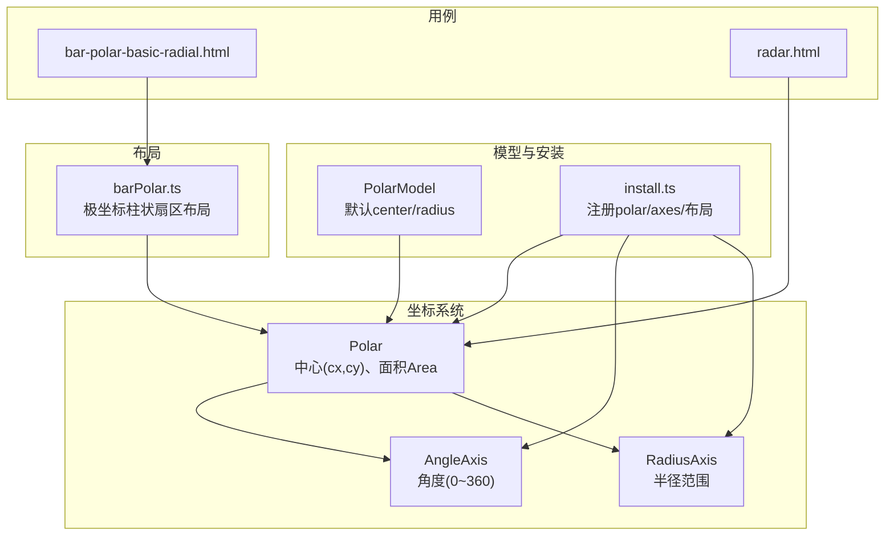
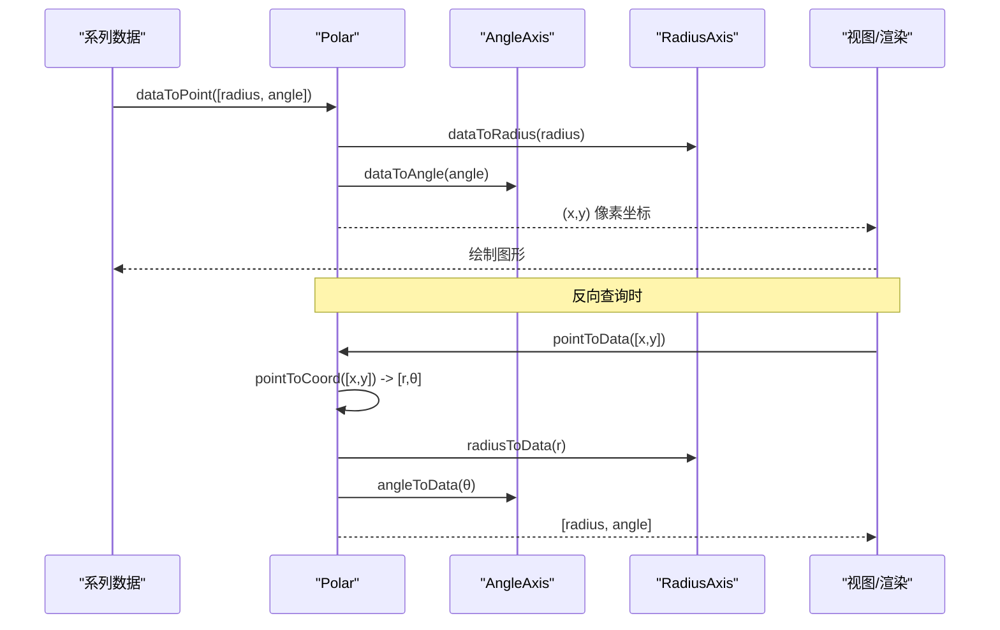
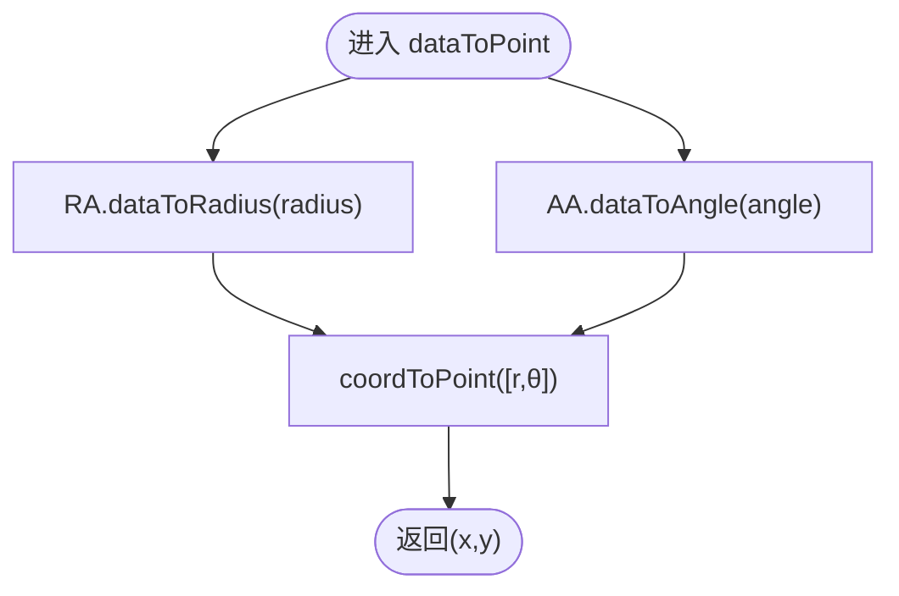
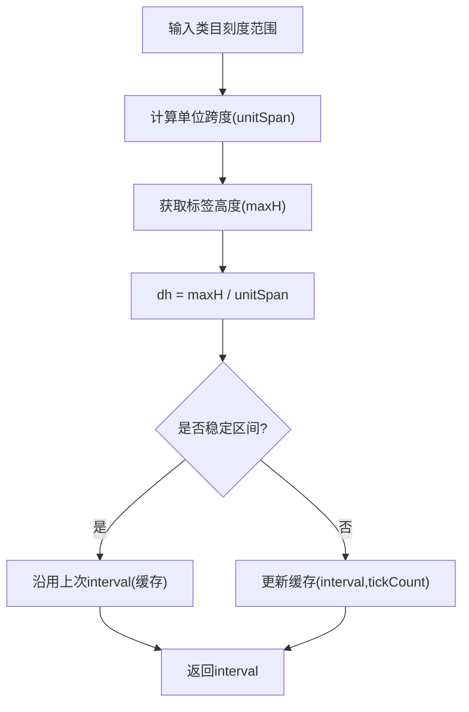
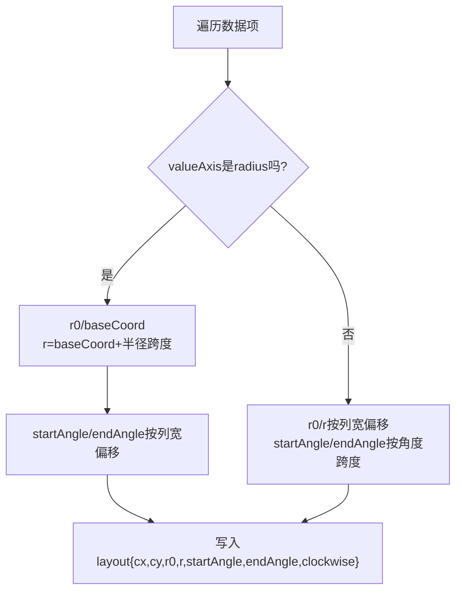
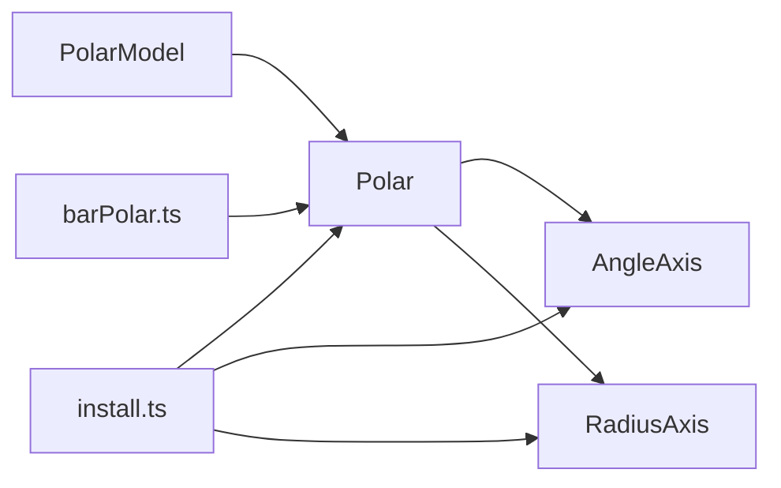

# 极坐标系

<cite>
**本文引用的文件**
- [src/coord/polar/Polar.ts](file://src/coord/polar/Polar.ts)
- [src/coord/polar/PolarModel.ts](file://src/coord/polar/PolarModel.ts)
- [src/coord/polar/AngleAxis.ts](file://src/coord/polar/AngleAxis.ts)
- [src/coord/polar/RadiusAxis.ts](file://src/coord/polar/RadiusAxis.ts)
- [src/component/polar/install.ts](file://src/component/polar/install.ts)
- [src/layout/barPolar.ts](file://src/layout/barPolar.ts)
- [test/bar-polar-basic-radial.html](file://test/bar-polar-basic-radial.html)
- [test/radar.html](file://test/radar.html)
</cite>

## 目录
1. [简介](#简介)
2. [项目结构](#项目结构)
3. [核心组件](#核心组件)
4. [架构总览](#架构总览)
5. [详细组件分析](#详细组件分析)
6. [依赖关系分析](#依赖关系分析)
7. [性能考量](#性能考量)
8. [故障排查指南](#故障排查指南)
9. [结论](#结论)
10. [附录：配置示例与最佳实践](#附录配置示例与最佳实践)

## 简介
本文件系统性解析 ECharts 极坐标系的实现原理与应用场景，覆盖数学基础、坐标变换、角度轴与半径轴特性、数据映射与可视化效果（雷达图、极坐标柱状图等）、与直角坐标系的转换关系、交互与动画能力，以及环形图、仪表盘等特殊图表的实现要点与最佳实践。

## 项目结构
ECharts 的极坐标系由“坐标系统 + 双轴模型 + 布局与渲染”三部分构成：
- 坐标系统：Polar（封装中心点、面积区域、像素与数据互转）
- 轴：AngleAxis（角度轴）、RadiusAxis（半径轴）
- 模型与安装：PolarModel、component/polar/install.ts（注册坐标系统与轴视图）
- 布局：barPolar.ts（极坐标下柱状图的扇区布局）
- 测试用例：bar-polar-basic-radial.html、radar.html（展示典型用法）

图示来源
- [src/coord/polar/Polar.ts:34-125](file://src/coord/polar/Polar.ts#L34-L125)
- [src/coord/polar/AngleAxis.ts:37-45](file://src/coord/polar/AngleAxis.ts#L37-L45)
- [src/coord/polar/RadiusAxis.ts:30-38](file://src/coord/polar/RadiusAxis.ts#L30-L38)
- [src/coord/polar/PolarModel.ts:38-69](file://src/coord/polar/PolarModel.ts#L38-L69)
- [src/component/polar/install.ts:64-84](file://src/component/polar/install.ts#L64-L84)
- [src/layout/barPolar.ts:67-82](file://src/layout/barPolar.ts#L67-L82)

章节来源
- [src/coord/polar/Polar.ts:34-125](file://src/coord/polar/Polar.ts#L34-L125)
- [src/coord/polar/PolarModel.ts:38-69](file://src/coord/polar/PolarModel.ts#L38-L69)
- [src/component/polar/install.ts:64-84](file://src/component/polar/install.ts#L64-L84)
- [src/layout/barPolar.ts:67-82](file://src/layout/barPolar.ts#L67-L82)

## 核心组件
- Polar：极坐标系统主体，提供数据到像素、像素到数据、包含性判断、面积区域等能力。
- AngleAxis：角度轴，默认范围 0~360，支持类目刻度自动间隔计算与缓存优化。
- RadiusAxis：半径轴，承载数值型或分类型的径向度量。
- PolarModel：极坐标组件模型，定义默认 center 与 radius，并关联两个轴模型。
- install.ts：注册 polar 坐标系统、角度/半径轴模型与视图、极坐标柱状布局处理器。
- barPolar.ts：在极坐标下为柱状系列计算扇区几何（r0、r、startAngle、endAngle、方向）。

章节来源
- [src/coord/polar/Polar.ts:34-125](file://src/coord/polar/Polar.ts#L34-L125)
- [src/coord/polar/AngleAxis.ts:37-117](file://src/coord/polar/AngleAxis.ts#L37-L117)
- [src/coord/polar/RadiusAxis.ts:30-47](file://src/coord/polar/RadiusAxis.ts#L30-L47)
- [src/coord/polar/PolarModel.ts:38-69](file://src/coord/polar/PolarModel.ts#L38-L69)
- [src/component/polar/install.ts:64-84](file://src/component/polar/install.ts#L64-L84)
- [src/layout/barPolar.ts:67-207](file://src/layout/barPolar.ts#L67-L207)

## 架构总览
极坐标系通过“坐标系统 + 双轴 + 布局”协作完成数据到可视化的映射：
- 数据维度：['radius', 'angle']
- 数据到像素：dataToPoint → coordToPoint（基于极坐标公式）
- 像素到数据：pointToData → pointToCoord（反解极坐标）
- 包含性：containPoint/containData 委托给两轴的 contain
- 面积区域：getArea 返回环状区域（含 contain 判定）

图示来源
- [src/coord/polar/Polar.ts:137-203](file://src/coord/polar/Polar.ts#L137-L203)

章节来源
- [src/coord/polar/Polar.ts:137-203](file://src/coord/polar/Polar.ts#L137-L203)

## 详细组件分析

### Polar 坐标系统
- 维度与类型：dimensions=['radius','angle']，type='polar'
- 中心点：cx/cy 用于像素空间定位
- 包含性：containPoint/containData 分别委托给两轴
- 坐标转换：
  - dataToPoint：先经两轴将数据映射到半径与角度坐标，再调用 coordToPoint
  - pointToData：先 pointToCoord 得到 [r, θ]，再反查两轴得到原始数据
  - pointToCoord：基于 dx/dy 计算 r 与 θ，并将 θ 对齐到角度范围
  - coordToPoint：使用 cos/sin 将极坐标转为屏幕坐标，注意 y 轴反转
- 面积区域：getArea 返回环状区域（r0,r,startAngle,endAngle,clockwise），并提供 contain(x,y)

图示来源
- [src/coord/polar/Polar.ts:137-203](file://src/coord/polar/Polar.ts#L137-L203)

章节来源
- [src/coord/polar/Polar.ts:34-248](file://src/coord/polar/Polar.ts#L34-L248)

### AngleAxis（角度轴）
- 默认范围：[0, 360]
- 类目刻度间隔：calculateCategoryInterval 基于标签高度与单位跨度估算，带缓存避免抖动
- 别名：dataToAngle/angleToData 复用 Axis 的 dataToCoord/coordToData

图示来源
- [src/coord/polar/AngleAxis.ts:58-117](file://src/coord/polar/AngleAxis.ts#L58-L117)

章节来源
- [src/coord/polar/AngleAxis.ts:37-125](file://src/coord/polar/AngleAxis.ts#L37-L125)

### RadiusAxis（半径轴）
- 承载径向度量，提供 dataToRadius/radiusToData 别名
- 支持数值/分类尺度，配合 Polar 进行数据映射

章节来源
- [src/coord/polar/RadiusAxis.ts:30-49](file://src/coord/polar/RadiusAxis.ts#L30-L49)

### PolarModel（极坐标模型）
- 默认配置：center=['50%','50%'], radius='80%'
- 依赖：angleAxis、radiusAxis
- 查找轴模型：findAxisModel 根据坐标系统匹配对应轴模型

章节来源
- [src/coord/polar/PolarModel.ts:38-69](file://src/coord/polar/PolarModel.ts#L38-L69)

### 安装与注册（install.ts）
- 注册 polar 坐标系统、角度/半径轴模型与视图
- 注册极坐标柱状布局处理器 barLayoutPolarStageHandler
- 设置角度轴额外默认项（起始角、顺时针、分割数等）

章节来源
- [src/component/polar/install.ts:40-84](file://src/component/polar/install.ts#L40-L84)

### 极坐标柱状图布局（barPolar.ts）
- 目标：为每个数据项计算扇区几何 {cx,cy,r0,r,startAngle,endAngle,clockwise}
- 关键逻辑：
  - 区分径向柱（valueAxis=radius）与切向柱（valueAxis=angle）
  - 处理堆叠、最小高度/角度、圆角端盖(roundCap)
  - 计算 bandWidth、barGap、categoryGap，分配多系列宽度与偏移
- 输出：setItemLayout 供渲染阶段直接使用

图示来源
- [src/layout/barPolar.ts:117-207](file://src/layout/barPolar.ts#L117-L207)

章节来源
- [src/layout/barPolar.ts:67-332](file://src/layout/barPolar.ts#L67-L332)

## 依赖关系分析
- Polar 依赖 AngleAxis 与 RadiusAxis 完成数据↔坐标转换
- PolarModel 声明对 angleAxis、radiusAxis 的依赖，并维护默认 center/radius
- install.ts 将 polar、axes、布局处理器串联起来
- barPolar.ts 依赖 Polar 与 Axis 统计信息计算扇区布局

图示来源
- [src/coord/polar/PolarModel.ts:38-44](file://src/coord/polar/PolarModel.ts#L38-L44)
- [src/component/polar/install.ts:64-84](file://src/component/polar/install.ts#L64-L84)
- [src/layout/barPolar.ts:67-82](file://src/layout/barPolar.ts#L67-L82)

章节来源
- [src/coord/polar/PolarModel.ts:38-44](file://src/coord/polar/PolarModel.ts#L38-L44)
- [src/component/polar/install.ts:64-84](file://src/component/polar/install.ts#L64-L84)
- [src/layout/barPolar.ts:67-82](file://src/layout/barPolar.ts#L67-L82)

## 性能考量
- 角度轴类目间隔计算采用缓存策略，减少缩放过程中的抖动与重复计算
- 极坐标柱状布局一次性计算所有数据项 layout，避免渲染期重复计算
- 面积区域 contain 使用平方距离比较，避免开方开销
- 建议：
  - 合理设置 splitNumber、barMinHeight/barMinAngle，避免过多细分导致渲染压力
  - 大数据量时优先使用合适的 scale 类型（如 interval/log）提升映射效率

章节来源
- [src/coord/polar/AngleAxis.ts:58-117](file://src/coord/polar/AngleAxis.ts#L58-L117)
- [src/layout/barPolar.ts:212-312](file://src/layout/barPolar.ts#L212-L312)
- [src/coord/polar/Polar.ts:209-248](file://src/coord/polar/Polar.ts#L209-L248)

## 故障排查指南
- 角度轴标签重叠或间隔异常：检查 calculateCategoryInterval 的缓存与 label 字体大小；必要时调整 splitNumber 或自定义 formatter
- 极坐标柱状图扇区错位：确认 valueAxis 与 baseAxis 的选择是否正确（径向 vs 切向），核对 roundCap、barMinHeight/barMinAngle
- 包含性检测失败：检查 getArea 的 r0/r 范围与 clockwise 设置，确保数据未越界
- 数据映射错误：确认 dataToPoint/pointToData 的维度顺序为 ['radius','angle']，且两轴范围一致

章节来源
- [src/coord/polar/AngleAxis.ts:58-117](file://src/coord/polar/AngleAxis.ts#L58-L117)
- [src/layout/barPolar.ts:117-207](file://src/layout/barPolar.ts#L117-L207)
- [src/coord/polar/Polar.ts:209-248](file://src/coord/polar/Polar.ts#L209-L248)

## 结论
ECharts 极坐标系以 Polar 为核心，结合 AngleAxis 与 RadiusAxis 完成数据到极坐标的映射，并通过布局模块适配多种图表（如极坐标柱状图、雷达图）。其设计清晰、扩展性强，既支持常规可视化，也满足环形图、仪表盘等特殊场景需求。通过合理的轴配置与布局参数，可在保证性能的同时获得丰富的视觉效果与交互体验。

## 附录：配置示例与最佳实践

### 数学基础与坐标变换
- 极坐标到笛卡尔坐标：x = cx + r·cosθ，y = cy − r·sinθ（y 轴反转）
- 笛卡尔坐标到极坐标：r = √((x−cx)²+(y−cy)²)，θ = atan2(−(y−cy), x−cx) 并归一化到角度范围
- 角度轴默认 0~360，可配置 startAngle、clockwise 控制起始角与方向

章节来源
- [src/coord/polar/Polar.ts:160-203](file://src/coord/polar/Polar.ts#L160-L203)

### 角度轴与半径轴配置要点
- 角度轴：type='category' 时，splitNumber 控制刻度密度；startAngle/clockwise 控制起始与方向；label.rotate 控制标签旋转
- 半径轴：splitNumber 控制刻度数量；可与数值/分类尺度配合
- 极坐标：center 控制圆心位置，radius 控制整体半径

章节来源
- [src/component/polar/install.ts:40-57](file://src/component/polar/install.ts#L40-L57)
- [src/coord/polar/PolarModel.ts:60-69](file://src/coord/polar/PolarModel.ts#L60-L69)

### 数据映射与可视化效果
- 极坐标柱状图：径向柱（valueAxis=radius）沿半径方向延伸；切向柱（valueAxis=angle）沿角度方向延伸；支持堆叠、最小高度/角度、圆角端盖
- 雷达图：基于极坐标的多维指标对比，indicator 定义各维度及最大值，series 提供多维值数组

章节来源
- [src/layout/barPolar.ts:117-207](file://src/layout/barPolar.ts#L117-L207)
- [test/radar.html:43-141](file://test/radar.html#L43-L141)

### 与直角坐标系的转换关系与适用场景
- 转换关系：通过 Polar 的 dataToPoint/pointToData 在数据与像素间转换；角度轴与半径轴分别对应角度与半径维度
- 适用场景：
  - 极坐标：周期性/环形数据（如一周七天、方位分布）、多维指标对比（雷达图）、仪表盘、环形图
  - 直角坐标：时间序列、二维散点/折线等

章节来源
- [src/coord/polar/Polar.ts:137-203](file://src/coord/polar/Polar.ts#L137-L203)

### 配置示例与最佳实践
- 极坐标柱状图示例：参考 test/bar-polar-basic-radial.html，设置 angleAxis（类目）、radiusAxis、polar.center、series.coordinateSystem='polar'，并配置 barMaxWidth、barMinHeight
- 雷达图示例：参考 test/radar.html，配置 radar.indicator 与各 series.value，调整 symbol、itemStyle、emphasis 等
- 最佳实践：
  - 合理设置 splitNumber 与 barMinHeight/barMinAngle，平衡可读性与性能
  - 使用 roundCap 与 borderRadius 提升视觉一致性
  - 利用 tooltip、axisPointer 增强交互体验

章节来源
- [test/bar-polar-basic-radial.html:46-65](file://test/bar-polar-basic-radial.html#L46-L65)
- [test/radar.html:43-141](file://test/radar.html#L43-L141)