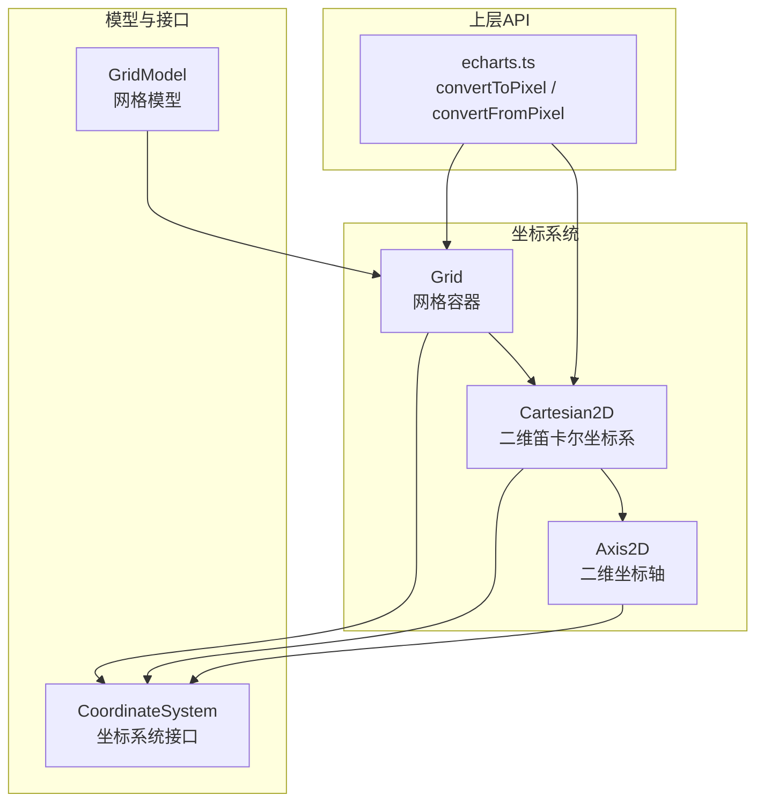
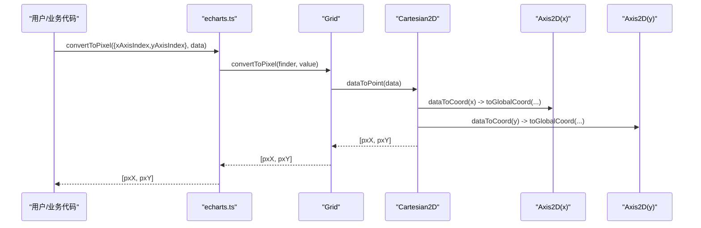
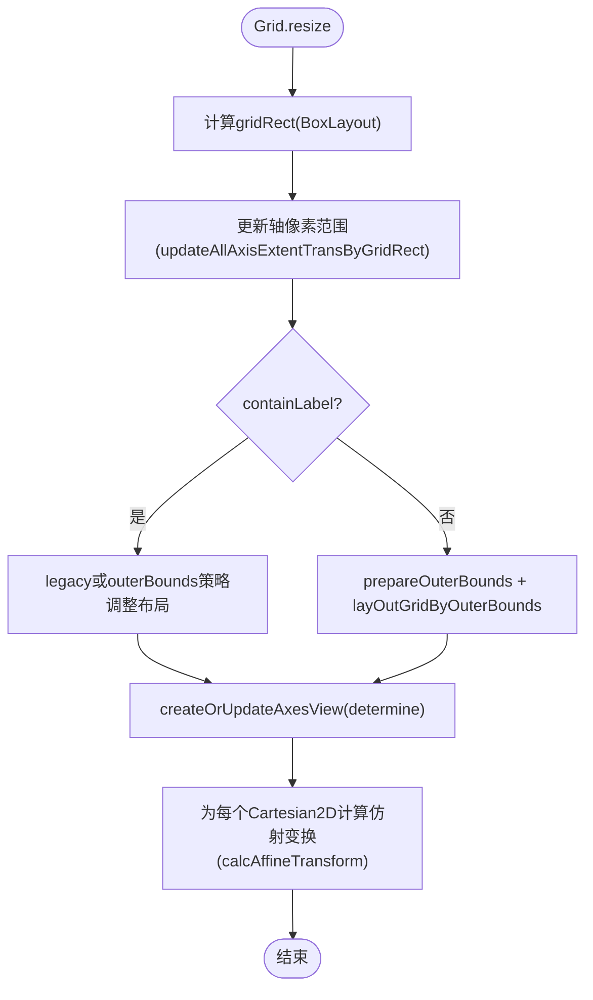
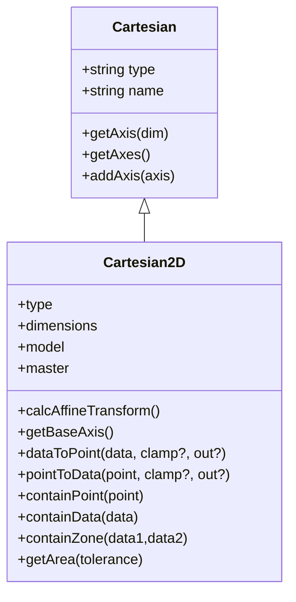
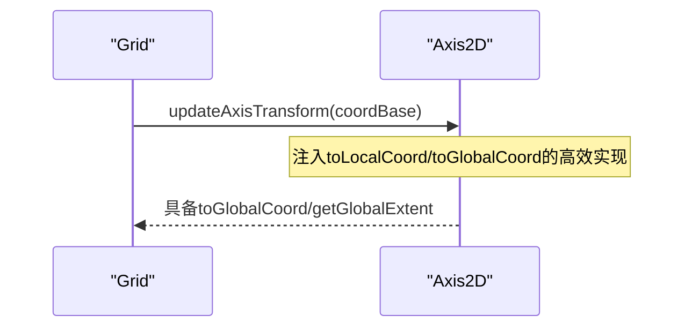
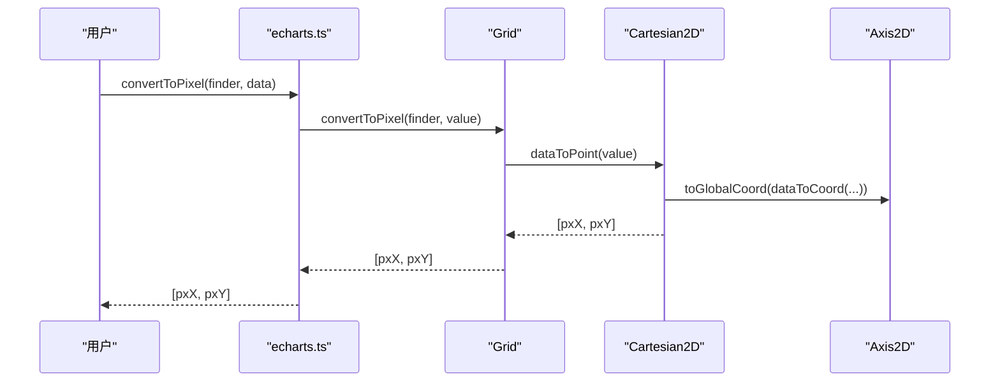
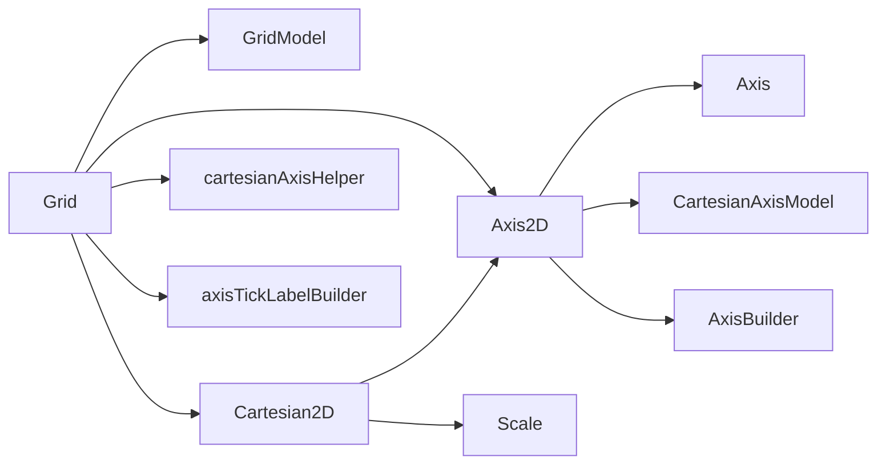

# 直角坐标系

<cite>
**本文引用的文件**
- [Cartesian2D.ts](file://src/coord/cartesian/Cartesian2D.ts)
- [Grid.ts](file://src/coord/cartesian/Grid.ts)
- [Axis2D.ts](file://src/coord/cartesian/Axis2D.ts)
- [GridModel.ts](file://src/coord/cartesian/GridModel.ts)
- [CoordinateSystem.ts](file://src/coord/CoordinateSystem.ts)
- [echarts.ts](file://src/core/echarts.ts)
- [cartesianAxisHelper.ts](file://src/coord/cartesian/cartesianAxisHelper.ts)
- [axisTickLabelBuilder.ts](file://src/coord/axisTickLabelBuilder.ts)
</cite>

## 目录
1. [简介](#简介)
2. [项目结构](#项目结构)
3. [核心组件](#核心组件)
4. [架构总览](#架构总览)
5. [详细组件分析](#详细组件分析)
6. [依赖关系分析](#依赖关系分析)
7. [性能考量](#性能考量)
8. [故障排查指南](#故障排查指南)
9. [结论](#结论)
10. [附录：配置与高级用法](#附录：配置与高级用法)

## 简介
本文件系统性阐述 ECharts 直角坐标系的实现原理与使用方法，重点覆盖以下方面：
- Cartesian2D 的核心功能：二维笛卡尔坐标系的建立、管理、数据点与像素点的转换、区域判定等。
- Grid 组件的作用：网格区域的计算与布局算法、多轴对齐、标签溢出控制、外边界约束等。
- Axis2D 的功能特性：坐标轴创建、刻度生成、标签显示、全局/局部坐标转换等。
- 坐标转换函数：数据坐标、像素坐标、布局坐标之间的转换关系与调用路径。
- 配置示例与高级用法：多轴、时间轴、堆叠、对齐刻度、外边界控制等场景。
- 支持的图表类型与最佳实践：基于直角坐标系的常见图表及性能优化建议。

## 项目结构
直角坐标系相关代码主要位于 coord/cartesian 目录，围绕 Grid、Cartesian2D、Axis2D 三个核心类组织，并通过模型层 GridModel 提供配置与默认值；同时与通用坐标系统接口 CoordinateSystem 以及上层 API echarts.ts 的转换方法紧密协作。

图示来源
- [Grid.ts:103-128](file://src/coord/cartesian/Grid.ts#L103-L128)
- [Cartesian2D.ts:41-52](file://src/coord/cartesian/Cartesian2D.ts#L41-L52)
- [Axis2D.ts:43-86](file://src/coord/cartesian/Axis2D.ts#L43-L86)
- [GridModel.ts:98-147](file://src/coord/cartesian/GridModel.ts#L98-L147)
- [CoordinateSystem.ts:65-171](file://src/coord/CoordinateSystem.ts#L65-L171)
- [echarts.ts:1155-1183](file://src/core/echarts.ts#L1155-L1183)

章节来源
- [Grid.ts:103-128](file://src/coord/cartesian/Grid.ts#L103-L128)
- [Cartesian2D.ts:41-52](file://src/coord/cartesian/Cartesian2D.ts#L41-L52)
- [Axis2D.ts:43-86](file://src/coord/cartesian/Axis2D.ts#L43-L86)
- [GridModel.ts:98-147](file://src/coord/cartesian/GridModel.ts#L98-L147)
- [CoordinateSystem.ts:65-171](file://src/coord/CoordinateSystem.ts#L65-L171)
- [echarts.ts:1155-1183](file://src/core/echarts.ts#L1155-L1183)

## 核心组件
- Grid（网格）
  - 职责：维护一个包含最多四个笛卡尔坐标系的网格区域；负责坐标轴的创建、布局、刻度对齐、标签溢出处理、外边界约束与裁剪；提供数据到像素/布局的转换入口。
  - 关键能力：update/resize、getCartesian(s)、convertToPixel/convertFromPixel、containPoint、tooltip 轴选择等。
- Cartesian2D（二维笛卡尔坐标系）
  - 职责：组合 x/y 两个 Axis2D，提供 dataToPoint/pointToData、containPoint/containData/containZone、getArea、calcAffineTransform 等。
  - 关键能力：在双轴均为线性或时间且无断点时，计算仿射变换矩阵以加速大数据量下的坐标转换。
- Axis2D（二维坐标轴）
  - 职责：表示水平或垂直坐标轴，维护位置、索引、模型、网格引用；提供 toLocalCoord/toGlobalCoord、getGlobalExtent、pointToData 等方法。
  - 关键能力：与 AxisBuilder 协作完成刻度与标签的生成与布局。

章节来源
- [Grid.ts:103-128](file://src/coord/cartesian/Grid.ts#L103-L128)
- [Cartesian2D.ts:41-52](file://src/coord/cartesian/Cartesian2D.ts#L41-L52)
- [Axis2D.ts:43-86](file://src/coord/cartesian/Axis2D.ts#L43-L86)

## 架构总览
直角坐标系由 Grid 作为“主容器”统一管理多个 Cartesian2D，每个 Cartesian2D 绑定一对 Axis2D（x/y）。Axis2D 通过 AxisBuilder 生成刻度与标签，并依据 Grid 的布局参数进行位置与尺寸计算。上层通过 echarts.ts 暴露的 convertToPixel/convertFromPixel/convertToLayout 统一调度各坐标系统的转换逻辑。

图示来源
- [echarts.ts:1155-1183](file://src/core/echarts.ts#L1155-L1183)
- [Grid.ts:329-354](file://src/coord/cartesian/Grid.ts#L329-L354)
- [Cartesian2D.ts:131-151](file://src/coord/cartesian/Cartesian2D.ts#L131-L151)
- [Axis2D.ts:108-118](file://src/coord/cartesian/Axis2D.ts#L108-L118)

## 详细组件分析

### Grid：网格区域计算与布局算法
- 初始化与更新
  - create：遍历 grid 模型实例，构造 Grid 并执行一次 resize(true)，为后续数据处理准备 axis.extent。
  - update：对每个轴设置排序信息（分类轴）、计算刻度（nice/align），处理 onZero 对齐，再次 resize 以支持 containLabel/outerBounds。
- 布局流程
  - resize：基于 box layout 计算 gridRect；先根据 grid 布局选项设置轴像素范围；再根据 containLabel 或 outerBounds 策略调整布局；最后创建/更新轴视图并计算仿射变换。
  - outerBounds：支持 outerBoundsMode/outerBoundsContain/outerBoundsClampWidth/Height 精细控制网格收缩与最小宽高限制。
- 多轴与坐标系
  - _initCartesian：按 xAxisIndex/yAxisIndex 组合生成 Cartesian2D，注入 axis 与 model，记录 axesMap/coordsList。
  - getCartesian：支持多种查找方式（索引、对象、自动匹配）。
- 转换与命中
  - convertToPixel/convertFromPixel：优先走 Cartesian2D，否则回退到单轴转换。
  - containPoint：委托给首个 Cartesian2D。

图示来源
- [Grid.ts:207-279](file://src/coord/cartesian/Grid.ts#L207-L279)
- [GridModel.ts:126-147](file://src/coord/cartesian/GridModel.ts#L126-L147)

章节来源
- [Grid.ts:134-279](file://src/coord/cartesian/Grid.ts#L134-L279)
- [GridModel.ts:98-147](file://src/coord/cartesian/GridModel.ts#L98-L147)

### Cartesian2D：二维笛卡尔坐标系
- 维度与模型
  - dimensions = ['x','y']，持有 master(Grid) 与 model(GridModel)。
- 仿射变换加速
  - calcAffineTransform：当 x/y 轴均为 interval/time 且无断点时，基于 scale 极值与像素端点计算缩放和平移矩阵，用于 dataToPoint/pointToData 的快速路径。
- 坐标转换
  - dataToPoint：快速路径使用仿射矩阵；否则分别经 x/y 轴的 dataToCoord 与 toGlobalCoord。
  - pointToData：优先使用逆变换矩阵；否则经 toLocalCoord 与 coordToData。
- 区域判定
  - containPoint/containData/containZone：基于轴范围与 BoundingRect 判断点/数据/区域是否在坐标系内。
  - getArea：返回坐标系可视矩形（含 tolerance）。
- 基轴选择
  - getBaseAxis：优先 ordinal，其次 time，否则 x 轴，用于堆叠等场景。

图示来源
- [Cartesian.ts:26-67](file://src/coord/cartesian/Cartesian.ts#L26-L67)
- [Cartesian2D.ts:41-205](file://src/coord/cartesian/Cartesian2D.ts#L41-L205)

章节来源
- [Cartesian2D.ts:41-205](file://src/coord/cartesian/Cartesian2D.ts#L41-L205)
- [Cartesian.ts:26-67](file://src/coord/cartesian/Cartesian.ts#L26-L67)

### Axis2D：二维坐标轴
- 属性
  - position（top/bottom/left/right）、index、model、grid、axisBuilder。
- 坐标转换
  - toLocalCoord/toGlobalCoord：由 Grid 在布局阶段注入高效实现（加减偏移与反转）。
  - getGlobalExtent：将本地 extent 转换为全局像素范围，可选升序。
  - pointToData：根据维度取对应坐标分量，经 toLocalCoord 与 coordToData。
- 分类轴排序
  - setCategorySortInfo：为分类轴设置排序信息并同步到 scale。

图示来源
- [Grid.ts:779-798](file://src/coord/cartesian/Grid.ts#L779-L798)
- [Axis2D.ts:95-118](file://src/coord/cartesian/Axis2D.ts#L95-L118)

章节来源
- [Axis2D.ts:43-131](file://src/coord/cartesian/Axis2D.ts#L43-L131)
- [Grid.ts:779-798](file://src/coord/cartesian/Grid.ts#L779-L798)

### 坐标转换函数与调用链
- 数据坐标 → 像素坐标
  - 上层：echarts.convertToPixel → Grid.convertToPixel → Cartesian2D.dataToPoint → Axis2D.toGlobalCoord。
- 像素坐标 → 数据坐标
  - 上层：echarts.convertFromPixel → Grid.convertFromPixel → Cartesian2D.pointToData → Axis2D.coordToData。
- 数据坐标 → 布局坐标
  - 上层：echarts.convertToLayout → 具体坐标系统实现（如 Matrix/View 等），直角坐标系通常通过 dataToLayout 或 dataToPoint 派生。

图示来源
- [echarts.ts:1155-1183](file://src/core/echarts.ts#L1155-L1183)
- [Grid.ts:329-354](file://src/coord/cartesian/Grid.ts#L329-L354)
- [Cartesian2D.ts:131-183](file://src/coord/cartesian/Cartesian2D.ts#L131-L183)
- [Axis2D.ts:108-118](file://src/coord/cartesian/Axis2D.ts#L108-L118)

章节来源
- [echarts.ts:1155-1183](file://src/core/echarts.ts#L1155-L1183)
- [Grid.ts:329-354](file://src/coord/cartesian/Grid.ts#L329-L354)
- [Cartesian2D.ts:131-183](file://src/coord/cartesian/Cartesian2D.ts#L131-L183)
- [Axis2D.ts:108-118](file://src/coord/cartesian/Axis2D.ts#L108-L118)

### 刻度与标签生成
- 刻度与标签由 AxisBuilder 与 axisTickLabelBuilder 共同完成：
  - 数值/对数/时间轴：scaleCalcNice/scaleCalcAlign 决定刻度间距与对齐。
  - 分类轴：ordinalScaleCreateTicks 结合 categoryInterval 回调过滤与格式化。
- Grid.update 中会先执行 nice/align，再进入布局阶段构建轴视图（determine），最终渲染。

章节来源
- [Grid.ts:146-174](file://src/coord/cartesian/Grid.ts#L146-L174)
- [axisTickLabelBuilder.ts:467-522](file://src/coord/axisTickLabelBuilder.ts#L467-L522)

## 依赖关系分析
- Grid 依赖：
  - GridModel（配置与默认值）
  - Axis2D（坐标轴实例）
  - Cartesian2D（坐标系实例）
  - cartesianAxisHelper（轴模型查找与视图构建辅助）
  - axisTickLabelBuilder（刻度与标签构建）
- Cartesian2D 依赖：
  - Axis2D（x/y 轴）
  - Scale（interval/time 检测与断点检查）
  - zrender 矩阵/向量工具（仿射变换）
- Axis2D 依赖：
  - Axis（基类）
  - CartesianAxisModel（轴模型）
  - Grid（布局上下文）
  - AxisBuilder（刻度与标签构建）

图示来源
- [Grid.ts:44-84](file://src/coord/cartesian/Grid.ts#L44-L84)
- [Cartesian2D.ts:21-33](file://src/coord/cartesian/Cartesian2D.ts#L21-L33)
- [Axis2D.ts:20-27](file://src/coord/cartesian/Axis2D.ts#L20-L27)

章节来源
- [Grid.ts:44-84](file://src/coord/cartesian/Grid.ts#L44-L84)
- [Cartesian2D.ts:21-33](file://src/coord/cartesian/Cartesian2D.ts#L21-L33)
- [Axis2D.ts:20-27](file://src/coord/cartesian/Axis2D.ts#L20-L27)

## 性能考量
- 仿射变换加速
  - 当 x/y 轴均为 interval/time 且无断点时，Cartesian2D.calcAffineTransform 会缓存正逆矩阵，dataToPoint/pointToData 走快速路径，显著降低大数据量（尤其是时间序列）的转换开销。
- 布局阶段优化
  - Grid.resize 分阶段计算：先按布局选项设定轴像素范围，再进行标签/名称测量与外边界收缩，避免循环依赖。
- 刻度对齐
  - 对数值/对数轴支持 alignTicks，减少多轴刻度不一致导致的视觉抖动与重绘。

章节来源
- [Cartesian2D.ts:36-88](file://src/coord/cartesian/Cartesian2D.ts#L36-L88)
- [Grid.ts:191-279](file://src/coord/cartesian/Grid.ts#L191-L279)

## 故障排查指南
- 坐标转换结果为空或异常
  - 检查 finder 是否正确指定 xAxisIndex/yAxisIndex/gridModel；若未指定，Grid 会尝试从 seriesModel 推断目标坐标系。
  - 确认当前系列确实属于该 Cartesian2D；否则 convertToPixel/convertFromPixel 可能返回 null。
- 标签溢出或布局错乱
  - 启用 outerBounds 替代已废弃的 containLabel；合理设置 outerBoundsMode/Contain/ClampWidth/Height。
  - 若需严格包含所有标签，确保 outerBoundsContain 设置为 'all' 或 'axisLabel'。
- 多轴刻度不一致
  - 开启 alignTicks，并确保至少有一个轴未显式设置 interval；Grid 会自动选择一个基准轴对齐其他轴。
- onZero 不生效
  - 仅适用于数值/对数轴且零点在有效范围内；分类轴与时间轴默认禁用 onZero。

章节来源
- [Grid.ts:356-392](file://src/coord/cartesian/Grid.ts#L356-L392)
- [Grid.ts:614-717](file://src/coord/cartesian/Grid.ts#L614-L717)
- [GridModel.ts:47-90](file://src/coord/cartesian/GridModel.ts#L47-L90)

## 结论
ECharts 的直角坐标系以 Grid 为中心，协调多个 Cartesian2D 与 Axis2D，形成稳定高效的二维绘图基础。Cartesian2D 在合适条件下通过仿射变换大幅优化坐标转换性能；Grid 提供灵活的布局与外边界控制，满足复杂多轴与标签溢出场景；Axis2D 配合 AxisBuilder 完成刻度与标签的精确布局。通过 echarts.ts 的统一 API，用户可以便捷地进行数据/像素/布局坐标的相互转换。

## 附录：配置与高级用法
- 基本配置
  - 定义 grid 的 left/top/right/bottom/width/height，控制绘图区域。
  - 配置 xAxis/yAxis 的 type（value/category/time/log）、position、inverse、onZero 等。
- 多轴与多坐标系
  - 通过 xAxisIndex/yAxisIndex 组合创建多个 Cartesian2D；Grid.getCartesian 支持按索引或自动匹配获取。
- 时间轴与堆叠
  - 时间轴作为 base axis 时，Cartesian2D.getBaseAxis 会优先选择 time；堆叠逻辑依赖基轴信息。
- 刻度对齐
  - 对数值/对数轴启用 alignTicks，使多轴刻度一致；必要时可固定某一轴的 interval。
- 外边界与标签控制
  - 使用 outerBoundsMode/outerBoundsContain/outerBoundsClampWidth/Height 精确控制网格收缩与最小尺寸，替代旧的 containLabel。
- 坐标转换 API
  - 使用 echarts.convertToPixel/convertFromPixel/convertToLayout 进行坐标转换；finder 支持 series/xAxis/yAxis/grid 模型定位目标坐标系。

章节来源
- [GridModel.ts:126-147](file://src/coord/cartesian/GridModel.ts#L126-L147)
- [Grid.ts:281-324](file://src/coord/cartesian/Grid.ts#L281-L324)
- [Cartesian2D.ts:90-105](file://src/coord/cartesian/Cartesian2D.ts#L90-L105)
- [echarts.ts:1155-1183](file://src/core/echarts.ts#L1155-L1183)