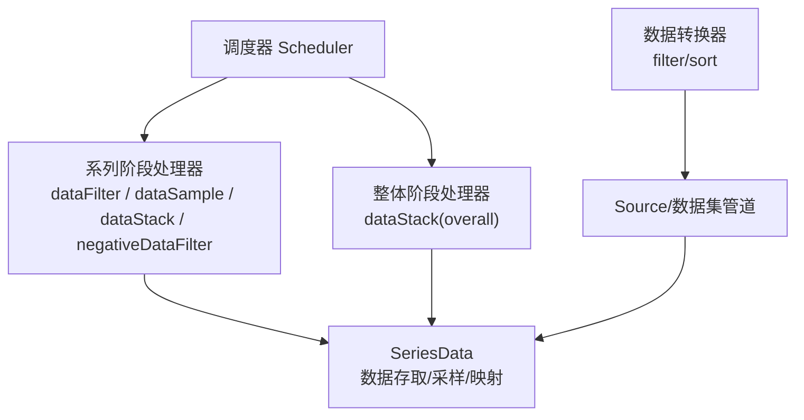
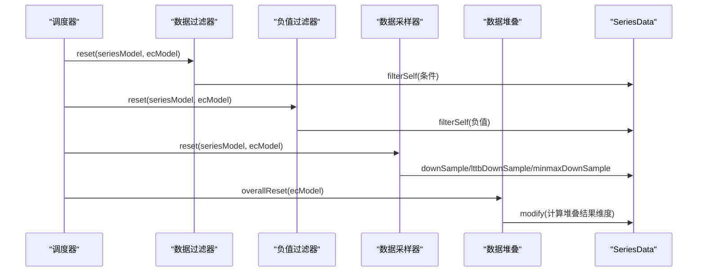
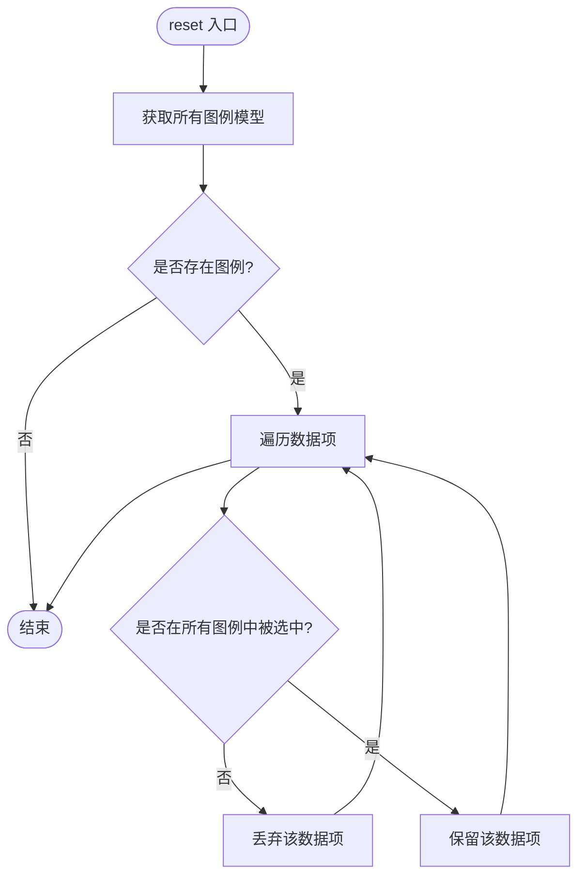
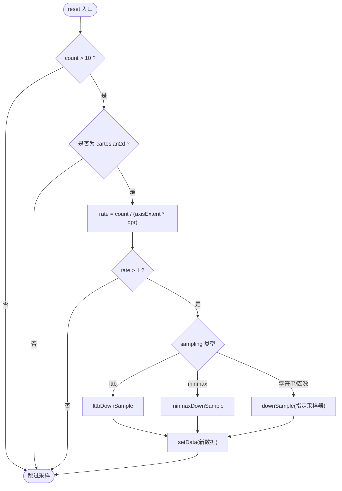
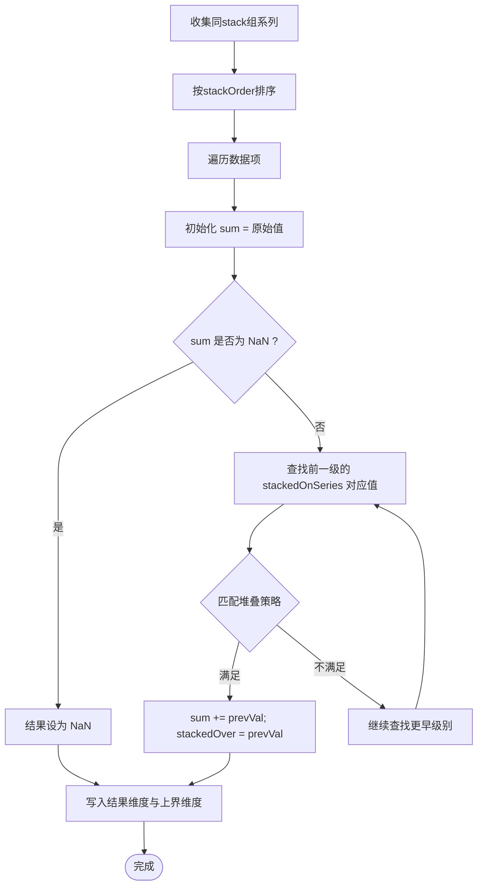
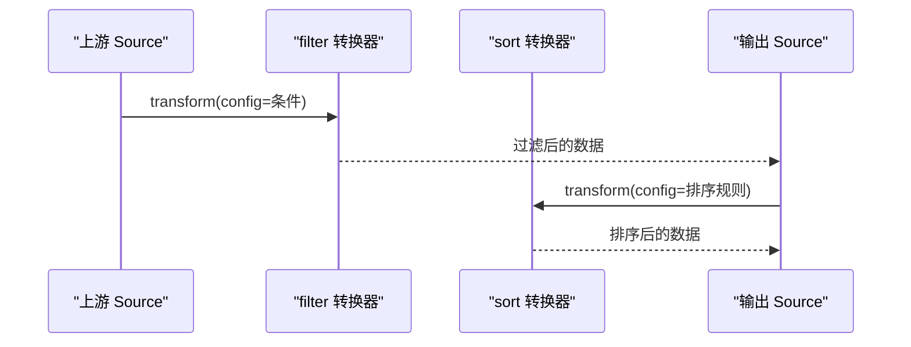
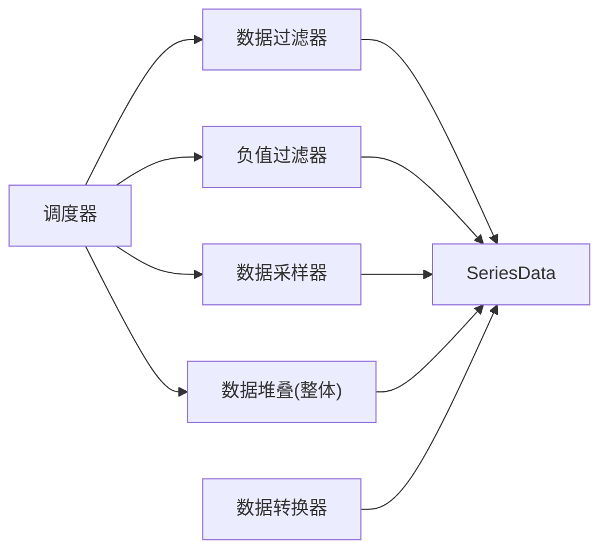

# 数据处理器

<cite>
**本文引用的文件**
- [src/processor/dataFilter.ts](file://src/processor/dataFilter.ts)
- [src/processor/dataSample.ts](file://src/processor/dataSample.ts)
- [src/processor/dataStack.ts](file://src/processor/dataStack.ts)
- [src/processor/negativeDataFilter.ts](file://src/processor/negativeDataFilter.ts)
- [src/component/transform/filterTransform.ts](file://src/component/transform/filterTransform.ts)
- [src/component/transform/sortTransform.ts](file://src/component/transform/sortTransform.ts)
- [src/component/transform/install.ts](file://src/component/transform/install.ts)
- [src/util/types.ts](file://src/util/types.ts)
- [src/core/Scheduler.ts](file://src/core/Scheduler.ts)
- [src/data/SeriesData.ts](file://src/data/SeriesData.ts)
</cite>

## 目录
1. [简介](#简介)
2. [项目结构](#项目结构)
3. [核心组件](#核心组件)
4. [架构总览](#架构总览)
5. [详细组件分析](#详细组件分析)
6. [依赖关系分析](#依赖关系分析)
7. [性能考量](#性能考量)
8. [故障排查指南](#故障排查指南)
9. [结论](#结论)
10. [附录](#附录)

## 简介
本文件系统性阐述 ECharts 数据处理器系统的设计原理与使用方法，覆盖以下主题：
- 数据过滤器的实现机制：条件过滤、范围过滤、去重等（通过内置处理器与数据转换器组合实现）
- 数据采样器：在大数据量场景下的采样策略与优化方法
- 数据堆叠处理器：堆叠计算、边界处理、视觉效果联动
- 数据转换器：数据格式转换与计算管道
- 自定义数据处理器开发指南与实际应用场景

## 项目结构
ECharts 的数据处理由“调度器 + 阶段处理器 + 数据容器”构成。处理器以“阶段任务”的形式挂载到系列流水线中，按序执行；SeriesData 提供统一的数据访问与变换接口；数据转换器作为外部扩展，可在数据集层面进行链式转换。

图表来源
- [src/core/Scheduler.ts:114-138](file://src/core/Scheduler.ts#L114-L138)
- [src/processor/dataFilter.ts:22-45](file://src/processor/dataFilter.ts#L22-L45)
- [src/processor/dataSample.ts:75-122](file://src/processor/dataSample.ts#L75-L122)
- [src/processor/dataStack.ts:47-103](file://src/processor/dataStack.ts#L47-L103)
- [src/component/transform/filterTransform.ts:34-97](file://src/component/transform/filterTransform.ts#L34-L97)
- [src/component/transform/sortTransform.ts:77-206](file://src/component/transform/sortTransform.ts#L77-L206)
- [src/data/SeriesData.ts:152-200](file://src/data/SeriesData.ts#L152-L200)

章节来源
- [src/core/Scheduler.ts:114-138](file://src/core/Scheduler.ts#L114-L138)
- [src/util/types.ts:354-469](file://src/util/types.ts#L354-L469)

## 核心组件
- 调度器（Scheduler）：负责将阶段处理器组织为流水线任务，支持阻塞点、进度回调与脏标记传播。
- 系列阶段处理器（StageHandler）：针对特定 seriesType 或全局的 reset/progress 钩子，用于数据过滤、采样、堆叠等。
- SeriesData：封装维度、值存储、索引、采样、映射、修改等能力，是数据处理的核心载体。
- 数据转换器（External Data Transform）：在 Source 层对数据进行链式转换，如 filter、sort、聚合等。

章节来源
- [src/core/Scheduler.ts:388-402](file://src/core/Scheduler.ts#L388-L402)
- [src/util/types.ts:354-469](file://src/util/types.ts#L354-L469)
- [src/data/SeriesData.ts:152-200](file://src/data/SeriesData.ts#L152-L200)

## 架构总览
数据从 Source 进入，经过可选的数据转换器（filter/sort/聚合），再进入系列级数据处理器（过滤、负值过滤、采样、堆叠），最终输出给视图渲染。调度器保证各阶段的执行顺序与依赖关系，必要时阻塞后续阶段以保证一致性。

图表来源
- [src/processor/dataFilter.ts:22-45](file://src/processor/dataFilter.ts#L22-L45)
- [src/processor/negativeDataFilter.ts:23-38](file://src/processor/negativeDataFilter.ts#L23-L38)
- [src/processor/dataSample.ts:75-122](file://src/processor/dataSample.ts#L75-L122)
- [src/processor/dataStack.ts:47-103](file://src/processor/dataStack.ts#L47-L103)
- [src/data/SeriesData.ts:152-200](file://src/data/SeriesData.ts#L152-L200)

## 详细组件分析

### 数据过滤器（series 级）
- 功能：根据图例选择状态过滤当前系列数据项，仅保留被选中的名称对应的数据。
- 机制：遍历 legend 模型，调用 SeriesData.filterSelf 传入回调函数，返回 true 保留、false 剔除。
- 适用场景：多系列交互时隐藏未选中系列的数据项。

图表来源
- [src/processor/dataFilter.ts:22-45](file://src/processor/dataFilter.ts#L22-L45)

章节来源
- [src/processor/dataFilter.ts:22-45](file://src/processor/dataFilter.ts#L22-L45)

### 负值数据过滤器
- 功能：过滤掉 value 维度上的负数值，常用于某些只展示非负值的图表类型。
- 机制：读取 value 维度的值，若为有限数字且小于 0，则丢弃。

章节来源
- [src/processor/negativeDataFilter.ts:23-38](file://src/processor/negativeDataFilter.ts#L23-L38)

### 数据采样器（大数据优化）
- 目标：当笛卡尔坐标系下数据量远大于可视宽度时，降低绘制点数以提升性能。
- 策略：
  - 基于坐标轴范围和设备像素比估算采样率 rate = count / size
  - 支持多种采样器：average、sum、max、min、nearest
  - 支持 LTTB（最大三角形面积抽样）和 minmaxDownSample（极值保持）
  - 仅对第一个值维度（value 轴映射）进行采样
- 触发条件：数据量 > 10，坐标系为 cartesian2d，且配置了 sampling

图表来源
- [src/processor/dataSample.ts:75-122](file://src/processor/dataSample.ts#L75-L122)

章节来源
- [src/processor/dataSample.ts:75-122](file://src/processor/dataSample.ts#L75-L122)

### 数据堆叠处理器
- 目标：在同一 stack 组内，按维度或索引将多个系列叠加，计算堆叠结果与上界值，供面积图等视觉呈现。
- 关键信息：
  - stackedDimension：参与堆叠的原始维度
  - stackedByDimension：按此维度对齐（或按索引对齐 isStackedByIndex）
  - stackResultDimension：堆叠后的结果维度
  - stackedOverDimension：记录上一级的值，用于绘制上边界
  - stackStrategy：all / positive / negative / samesign
- 流程：
  - 收集同 stack 组的所有系列，按 stackOrder 排序并设置 stackedOnSeries
  - 对每个数据项，累加前一级堆叠值，考虑正负策略与 NaN 连接逻辑
  - 使用 addSafe 避免浮点误差影响坐标轴极值判断

图表来源
- [src/processor/dataStack.ts:47-103](file://src/processor/dataStack.ts#L47-L103)
- [src/processor/dataStack.ts:105-176](file://src/processor/dataStack.ts#L105-L176)

章节来源
- [src/processor/dataStack.ts:47-103](file://src/processor/dataStack.ts#L47-L103)
- [src/processor/dataStack.ts:105-176](file://src/processor/dataStack.ts#L105-L176)

### 数据转换器（Dataset 层）
- 作用：在数据源层进行链式转换，支持过滤、排序、聚合等，输出新的 Source 列表供下游使用。
- 内置转换器：
  - echarts:filter：基于条件表达式过滤数据项
  - echarts:sort：按维度与顺序排序，支持解析器与不可比较值处理
- 安装与注册：通过 install.ts 注册至扩展系统，供 dataset.transform 使用

图表来源
- [src/component/transform/filterTransform.ts:34-97](file://src/component/transform/filterTransform.ts#L34-L97)
- [src/component/transform/sortTransform.ts:77-206](file://src/component/transform/sortTransform.ts#L77-L206)
- [src/component/transform/install.ts:20-27](file://src/component/transform/install.ts#L20-L27)

章节来源
- [src/component/transform/filterTransform.ts:34-97](file://src/component/transform/filterTransform.ts#L34-L97)
- [src/component/transform/sortTransform.ts:77-206](file://src/component/transform/sortTransform.ts#L77-L206)
- [src/component/transform/install.ts:20-27](file://src/component/transform/install.ts#L20-L27)

### 自定义数据处理器开发指南
- 阶段处理器（StageHandler）
  - 定义 reset/progress/plan 等钩子，可限定 seriesType 或 createOnAllSeries
  - 通过 SeriesData 的 filterSelf、modify、mapDimension、downSample 等方法操作数据
  - 参考路径：[阶段处理器类型定义:354-469](file://src/util/types.ts#L354-L469)
- 数据转换器（External Data Transform）
  - 实现 transform(params) 返回 { data }，可读取 upstream 维度信息与原始数据
  - 通过 registers.registerTransform 注册后，在 dataset.transform 中使用
  - 参考路径：[filter 转换器:34-97](file://src/component/transform/filterTransform.ts#L34-L97)、[sort 转换器:77-206](file://src/component/transform/sortTransform.ts#L77-L206)
- 实际应用场景
  - 条件过滤：基于业务字段动态筛选数据（如时间窗口、分类标签）
  - 范围过滤：结合数据缩放组件，限制显示范围
  - 去重：在 sort/filter 后对键值去重，减少冗余
  - 采样：大数据折线/散点图的降采样，提升渲染性能
  - 堆叠：多系列面积图、柱状图的堆叠计算与边界控制

章节来源
- [src/util/types.ts:354-469](file://src/util/types.ts#L354-L469)
- [src/component/transform/filterTransform.ts:34-97](file://src/component/transform/filterTransform.ts#L34-L97)
- [src/component/transform/sortTransform.ts:77-206](file://src/component/transform/sortTransform.ts#L77-L206)

## 依赖关系分析
- 调度器依赖阶段处理器集合，按优先级与阻塞点组织流水线
- 系列处理器依赖 SeriesData 提供的数据访问与变换能力
- 数据转换器依赖 Source 抽象，提供链式处理能力
- 堆叠处理器依赖全局模型与各系列模型，维护堆叠组信息

图表来源
- [src/core/Scheduler.ts:114-138](file://src/core/Scheduler.ts#L114-L138)
- [src/processor/dataFilter.ts:22-45](file://src/processor/dataFilter.ts#L22-L45)
- [src/processor/negativeDataFilter.ts:23-38](file://src/processor/negativeDataFilter.ts#L23-L38)
- [src/processor/dataSample.ts:75-122](file://src/processor/dataSample.ts#L75-L122)
- [src/processor/dataStack.ts:47-103](file://src/processor/dataStack.ts#L47-L103)
- [src/component/transform/filterTransform.ts:34-97](file://src/component/transform/filterTransform.ts#L34-L97)
- [src/component/transform/sortTransform.ts:77-206](file://src/component/transform/sortTransform.ts#L77-L206)
- [src/data/SeriesData.ts:152-200](file://src/data/SeriesData.ts#L152-L200)

章节来源
- [src/core/Scheduler.ts:114-138](file://src/core/Scheduler.ts#L114-L138)
- [src/util/types.ts:354-469](file://src/util/types.ts#L354-L469)

## 性能考量
- 采样策略选择
  - LTTB：适合折线图，保持形状特征
  - minmaxDownSample：适合需要极值的场景
  - average/sum/max/min：根据业务需求选择统计方式
- 采样率计算
  - 基于坐标轴范围与设备像素比，避免过度采样或欠采样
- 堆叠计算
  - 使用 addSafe 避免浮点误差导致坐标轴极值异常
  - 合理设置 stackStrategy，减少不必要的计算
- 数据转换器
  - 尽量在 Dataset 层完成过滤与排序，减少后续处理压力
  - 避免无意义的完整数据集返回，采用失败快速原则

## 故障排查指南
- 条件过滤无效
  - 检查 dimension 是否正确，确保维度存在
  - 确认条件表达式语法与取值获取逻辑
  - 参考路径：[filter 转换器:34-97](file://src/component/transform/filterTransform.ts#L34-L97)
- 排序结果不符合预期
  - 校验 order 与 parser 配置
  - 注意 incomparable 的处理策略
  - 参考路径：[sort 转换器:77-206](file://src/component/transform/sortTransform.ts#L77-L206)
- 堆叠显示异常
  - 检查 stackedDimension 与 stackedByDimension 是否有效
  - 确认 stackStrategy 与数据正负性
  - 参考路径：[堆叠处理器:105-176](file://src/processor/dataStack.ts#L105-L176)
- 采样效果不佳
  - 调整采样算法与 rate 计算
  - 确认坐标系与数据量阈值
  - 参考路径：[数据采样器:75-122](file://src/processor/dataSample.ts#L75-L122)

章节来源
- [src/component/transform/filterTransform.ts:34-97](file://src/component/transform/filterTransform.ts#L34-L97)
- [src/component/transform/sortTransform.ts:77-206](file://src/component/transform/sortTransform.ts#L77-L206)
- [src/processor/dataStack.ts:105-176](file://src/processor/dataStack.ts#L105-L176)
- [src/processor/dataSample.ts:75-122](file://src/processor/dataSample.ts#L75-L122)

## 结论
ECharts 的数据处理器系统通过调度器统一管理阶段任务，结合 SeriesData 与数据转换器，实现了灵活高效的数据处理管线。数据过滤器、采样器、堆叠处理器各司其职，既保证了可视化准确性，又兼顾了大数据场景的性能。通过扩展 StageHandler 与 External Data Transform，用户可按需定制复杂的数据处理逻辑，满足多样化业务需求。

## 附录
- 相关类型与接口
  - 阶段处理器接口：[StageHandler:354-469](file://src/util/types.ts#L354-L469)
  - 数据容器接口：[SeriesData:152-200](file://src/data/SeriesData.ts#L152-L200)
- 示例与测试
  - 数据转换示例：[test/lib/ecSimpleTransform.js](file://test/lib/ecSimpleTransform.js)
  - 数据转换用例：[test/custom-shape-morphing2.html](file://test/custom-shape-morphing2.html)