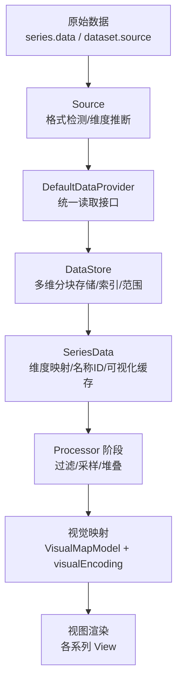
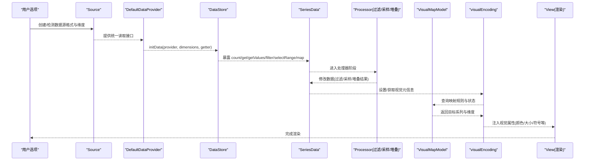
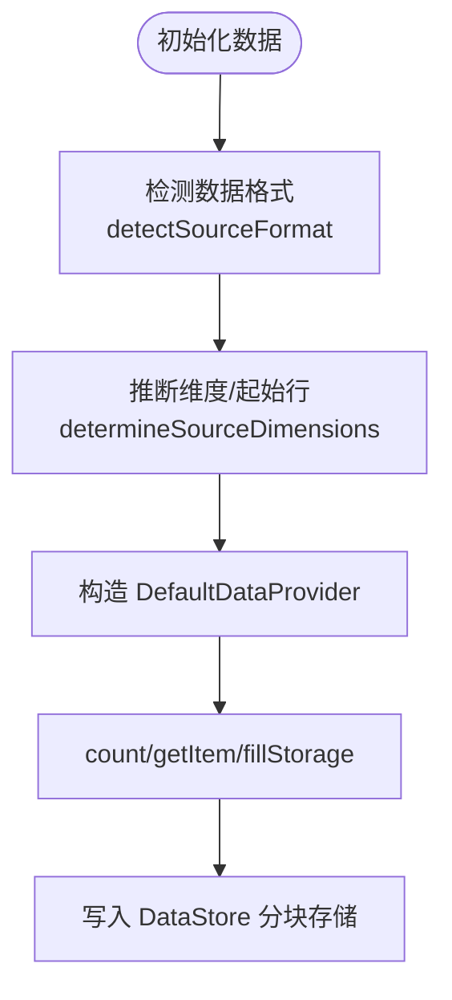
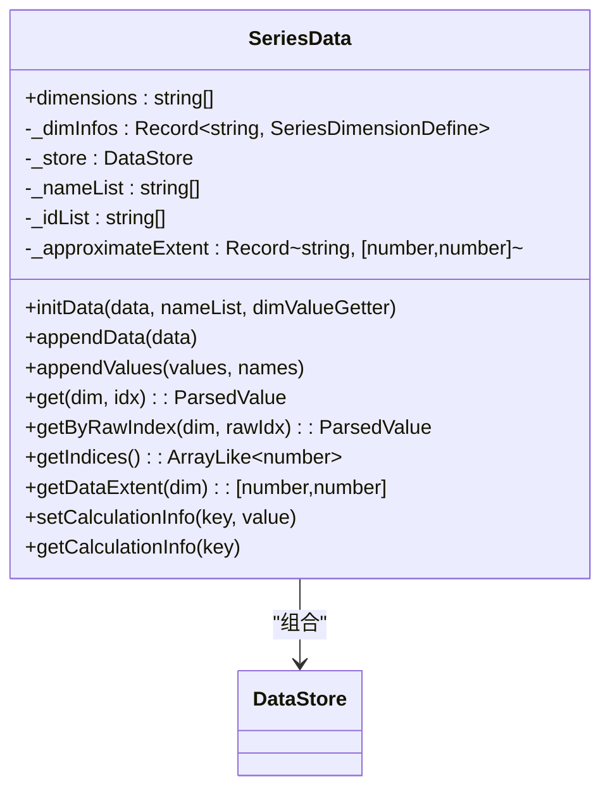
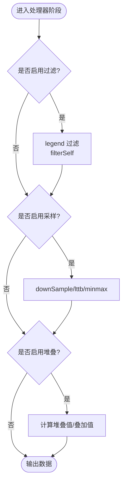
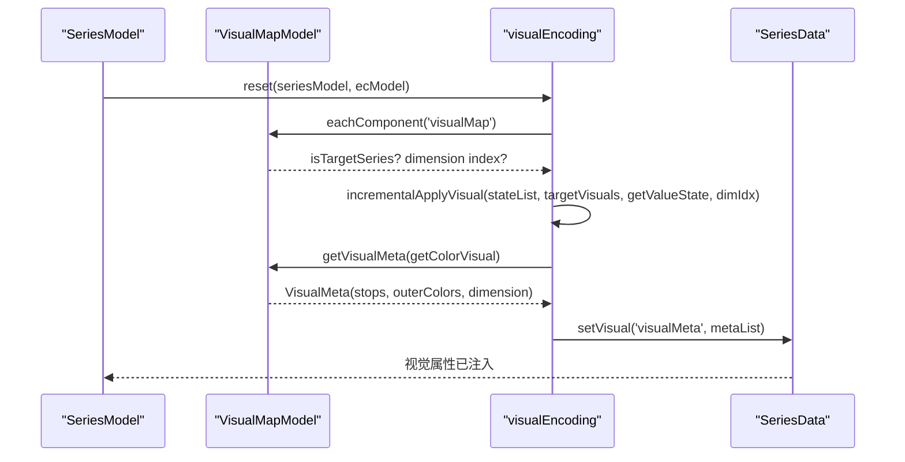
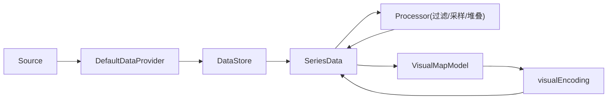

# 数据处理管道

<cite>
**本文引用的文件**
- [src/data/DataStore.ts](file://src/data/DataStore.ts)
- [src/data/SeriesData.ts](file://src/data/SeriesData.ts)
- [src/data/Source.ts](file://src/data/Source.ts)
- [src/data/helper/dataProvider.ts](file://src/data/helper/dataProvider.ts)
- [src/data/helper/dimensionHelper.ts](file://src/data/helper/dimensionHelper.ts)
- [src/processor/dataFilter.ts](file://src/processor/dataFilter.ts)
- [src/processor/dataStack.ts](file://src/processor/dataStack.ts)
- [src/processor/dataSample.ts](file://src/processor/dataSample.ts)
- [src/component/visualMap/VisualMapModel.ts](file://src/component/visualMap/VisualMapModel.ts)
- [src/component/visualMap/visualEncoding.ts](file://src/component/visualMap/visualEncoding.ts)
</cite>

## 目录
1. [简介](#简介)
2. [项目结构](#项目结构)
3. [核心组件](#核心组件)
4. [架构总览](#架构总览)
5. [详细组件分析](#详细组件分析)
6. [依赖关系分析](#依赖关系分析)
7. [性能考量](#性能考量)
8. [故障排查指南](#故障排查指南)
9. [结论](#结论)
10. [附录：扩展与自定义处理器](#附录：扩展与自定义处理器)

## 简介
本文件系统性阐述 ECharts 数据处理管道的完整流程与架构设计，覆盖从原始数据输入到渲染输出的全链路：原始数据接收、格式标准化、数据预处理（过滤、采样、堆叠）、视觉编码（值域映射）、布局计算等阶段。重点解析 SeriesData 与 DataStore 的数据结构设计及存储访问机制；说明数据处理器（过滤器、转换器、聚合器）的工作方式与配置方法；解释视觉映射系统如何将数据值自动映射为颜色、大小、符号等视觉属性；并提供扩展方法与自定义处理器的开发指南。

## 项目结构
ECharts 的数据处理相关代码主要分布在以下模块：
- 数据层：SeriesData、DataStore、Source、DataProvider、维度汇总工具
- 处理器层：数据过滤、采样、堆叠等 StageHandler
- 视觉映射：VisualMapModel、visualEncoding
- 辅助：维度定义、源格式检测、值获取器等



图表来源
- [src/data/Source.ts:197-224](file://src/data/Source.ts#L197-L224)
- [src/data/helper/dataProvider.ts:107-183](file://src/data/helper/dataProvider.ts#L107-L183)
- [src/data/DataStore.ts:192-234](file://src/data/DataStore.ts#L192-L234)
- [src/data/SeriesData.ts:527-563](file://src/data/SeriesData.ts#L527-L563)
- [src/processor/dataFilter.ts:22-45](file://src/processor/dataFilter.ts#L22-L45)
- [src/processor/dataSample.ts:75-122](file://src/processor/dataSample.ts#L75-L122)
- [src/processor/dataStack.ts:47-103](file://src/processor/dataStack.ts#L47-L103)
- [src/component/visualMap/visualEncoding.ts:28-80](file://src/component/visualMap/visualEncoding.ts#L28-L80)

章节来源
- [src/data/Source.ts:197-224](file://src/data/Source.ts#L197-L224)
- [src/data/helper/dataProvider.ts:107-183](file://src/data/helper/dataProvider.ts#L107-L183)
- [src/data/DataStore.ts:192-234](file://src/data/DataStore.ts#L192-L234)
- [src/data/SeriesData.ts:527-563](file://src/data/SeriesData.ts#L527-L563)

## 核心组件
- Source：负责识别并标准化多种数据源格式（数组行、对象行、键列、TypedArray、原始项），推断维度与起始行，提供不可变元信息。
- DefaultDataProvider：基于 Source 提供统一的 count/getItem/fillStorage/appendData/clean 接口，屏蔽不同数据格式的读取差异。
- DataStore：多维数据的底层存储，按维度分块存储（支持数值类型数组优化），维护原始计数、过滤后的索引、维度范围等信息，提供 get/getValues/filter/selectRange/map 等操作。
- SeriesData：面向系列的“列表式”数据抽象，封装维度名、维度类型、名称/ID 列表、近似范围、计算信息等，并通过 DataStore 进行读写。
- Processor（StageHandler）：在数据处理流水线中执行过滤、采样、堆叠等任务，可针对特定 seriesType 或全局注册。
- VisualMap 系统：将数据值映射为视觉属性（颜色、大小、透明度等），通过 VisualMapModel 管理目标系列与映射规则，visualEncoding 在流水线中应用映射。

章节来源
- [src/data/Source.ts:256-294](file://src/data/Source.ts#L256-L294)
- [src/data/helper/dataProvider.ts:84-183](file://src/data/helper/dataProvider.ts#L84-L183)
- [src/data/DataStore.ts:162-234](file://src/data/DataStore.ts#L162-L234)
- [src/data/SeriesData.ts:152-232](file://src/data/SeriesData.ts#L152-L232)
- [src/processor/dataFilter.ts:22-45](file://src/processor/dataFilter.ts#L22-L45)
- [src/processor/dataSample.ts:75-122](file://src/processor/dataSample.ts#L75-L122)
- [src/processor/dataStack.ts:47-103](file://src/processor/dataStack.ts#L47-L103)
- [src/component/visualMap/VisualMapModel.ts:179-247](file://src/component/visualMap/VisualMapModel.ts#L179-L247)
- [src/component/visualMap/visualEncoding.ts:28-80](file://src/component/visualMap/visualEncoding.ts#L28-L80)

## 架构总览
下图展示了数据从输入到渲染的完整流水线，包括关键阶段与组件交互。



图表来源
- [src/data/Source.ts:197-224](file://src/data/Source.ts#L197-L224)
- [src/data/helper/dataProvider.ts:107-183](file://src/data/helper/dataProvider.ts#L107-L183)
- [src/data/DataStore.ts:192-234](file://src/data/DataStore.ts#L192-L234)
- [src/data/SeriesData.ts:527-563](file://src/data/SeriesData.ts#L527-L563)
- [src/processor/dataFilter.ts:22-45](file://src/processor/dataFilter.ts#L22-L45)
- [src/processor/dataSample.ts:75-122](file://src/processor/dataSample.ts#L75-L122)
- [src/processor/dataStack.ts:47-103](file://src/processor/dataStack.ts#L47-L103)
- [src/component/visualMap/visualEncoding.ts:28-80](file://src/component/visualMap/visualEncoding.ts#L28-L80)
- [src/component/visualMap/VisualMapModel.ts:259-320](file://src/component/visualMap/VisualMapModel.ts#L259-L320)

## 详细组件分析

### 数据源与标准化（Source 与 DefaultDataProvider）
- Source 负责：
  - 检测数据格式（数组行、对象行、键列、TypedArray、原始项）
  - 推断维度定义与起始行
  - 提供不可变的元信息（dimensionsDefine、startIndex、sourceFormat 等）
- DefaultDataProvider 负责：
  - 根据 sourceFormat 与 seriesLayoutBy 动态挂载 getItem/count/fillStorage/appendData/clean 等方法
  - 对 TypedArray 提供高效 fillStorage 以一次性填充多维存储并更新范围
  - 对不同数据格式提供一致的读取语义



图表来源
- [src/data/Source.ts:256-294](file://src/data/Source.ts#L256-L294)
- [src/data/Source.ts:300-401](file://src/data/Source.ts#L300-L401)
- [src/data/helper/dataProvider.ts:107-183](file://src/data/helper/dataProvider.ts#L107-L183)
- [src/data/helper/dataProvider.ts:185-227](file://src/data/helper/dataProvider.ts#L185-L227)

章节来源
- [src/data/Source.ts:256-294](file://src/data/Source.ts#L256-L294)
- [src/data/Source.ts:300-401](file://src/data/Source.ts#L300-L401)
- [src/data/helper/dataProvider.ts:107-183](file://src/data/helper/dataProvider.ts#L107-L183)
- [src/data/helper/dataProvider.ts:185-227](file://src/data/helper/dataProvider.ts#L185-L227)

### 数据存储与访问（DataStore）
- 数据结构：
  - _chunks：按维度分块的存储（支持 Float64Array/Int32Array/Uint32Array/Array）
  - _indices：过滤后使用的索引映射（升序）
  - _rawExtent/_extent：维度范围（原始/过滤后）
  - _dimensions：维度定义（type、property、ordinalMeta 等）
- 关键能力：
  - initData：从 provider 初始化数据，构建维度与范围
  - appendData/appendValues：追加数据并更新范围
  - get/getValues/getByRawIndex：按维度与索引取值
  - filter/selectRange：生成新的 DataStore 实例（不可变风格），维护 _indices 与 _count
  - map：基于维度映射生成新 DataStore
  - ensureCalculationDimension：按需创建计算维度（如堆叠结果）

```mermaid
classDiagram
class DataStore {
-_chunks : ArrayLike[]
-_provider : DataProvider
-_rawExtent : number[][]
-_extent : Record~string, number[]~
-_indices : ArrayLike~number~
-_count : number
-_rawCount : number
-_dimensions : DimensionDefine[]
+initData(provider, inputDimensions, dimValueGetter)
+appendData(data) : number[]
+appendValues(values, minFillLen) : {start,end}
+get(dim, idx) : ParsedValue
+getValues(dims|idx) : ParsedValue[]
+getByRawIndex(dim, rawIdx) : ParsedValue
+filter(dims, cb) : DataStore
+selectRange(range) : DataStore
+map(dims, cb) : DataStore
+ensureCalculationDimension(name, type) : DimensionIndex
}
```

图表来源
- [src/data/DataStore.ts:162-234](file://src/data/DataStore.ts#L162-L234)
- [src/data/DataStore.ts:325-440](file://src/data/DataStore.ts#L325-L440)
- [src/data/DataStore.ts:449-601](file://src/data/DataStore.ts#L449-L601)
- [src/data/DataStore.ts:606-781](file://src/data/DataStore.ts#L606-L781)
- [src/data/DataStore.ts:797-800](file://src/data/DataStore.ts#L797-L800)

章节来源
- [src/data/DataStore.ts:162-234](file://src/data/DataStore.ts#L162-L234)
- [src/data/DataStore.ts:325-440](file://src/data/DataStore.ts#L325-L440)
- [src/data/DataStore.ts:449-601](file://src/data/DataStore.ts#L449-L601)
- [src/data/DataStore.ts:606-781](file://src/data/DataStore.ts#L606-L781)
- [src/data/DataStore.ts:797-800](file://src/data/DataStore.ts#L797-L800)

### 系列数据抽象（SeriesData）
- 职责：
  - 管理维度名、维度类型、坐标维度映射（coordDim/coordDimIndex）
  - 维护名称/ID 列表、近似范围、计算信息（堆叠相关）
  - 提供 initData/appendData/appendValues/get/getByRawIndex/getIndices 等 API
  - 通过 summarizeDimensions 汇总 encode 与默认 label/tooltip 维度
- 与 DataStore 的关系：
  - SeriesData 持有 DataStore 实例，所有数据访问最终委托给 DataStore
  - 通过 storeDimIndex 将维度名映射到 DataStore 的具体维度索引



图表来源
- [src/data/SeriesData.ts:152-232](file://src/data/SeriesData.ts#L152-L232)
- [src/data/SeriesData.ts:527-563](file://src/data/SeriesData.ts#L527-L563)
- [src/data/SeriesData.ts:731-800](file://src/data/SeriesData.ts#L731-L800)

章节来源
- [src/data/SeriesData.ts:152-232](file://src/data/SeriesData.ts#L152-L232)
- [src/data/SeriesData.ts:527-563](file://src/data/SeriesData.ts#L527-L563)
- [src/data/SeriesData.ts:731-800](file://src/data/SeriesData.ts#L731-L800)

### 维度汇总与映射（dimensionHelper）
- summarizeDimensions：
  - 汇总 encode 映射（坐标维度、视觉维度）
  - 生成 userOutput 用于外部回调输出
  - 记录 dataDimsOnCoord、encodeFirstDimNotExtra 等常用信息
- 作用：
  - 为后续视觉映射、标签/提示框默认维度选择提供依据
  - 避免重复计算，提升访问效率

章节来源
- [src/data/helper/dimensionHelper.ts:93-186](file://src/data/helper/dimensionHelper.ts#L93-L186)

### 数据处理器（Processor）
- 数据过滤（dataFilter）：
  - 基于 legend 选中状态过滤数据项
  - 调用 SeriesData.filterSelf 实现
- 数据采样（dataSample）：
  - 在笛卡尔坐标系下，根据像素尺寸与数据量计算采样率
  - 支持 average/sum/max/min/nearest/lttb/minmax 等策略
  - 通过 downSample/minmaxDownSample/lttbDownSample 生成新数据
- 数据堆叠（dataStack）：
  - 收集同组 stack 的系列，按顺序计算堆叠值与 stackedOver
  - 支持 stackStrategy（all/positive/negative/samesign）
  - 通过 modify 写入结果维度与叠加维度



图表来源
- [src/processor/dataFilter.ts:22-45](file://src/processor/dataFilter.ts#L22-L45)
- [src/processor/dataSample.ts:75-122](file://src/processor/dataSample.ts#L75-L122)
- [src/processor/dataStack.ts:47-103](file://src/processor/dataStack.ts#L47-L103)
- [src/processor/dataStack.ts:105-176](file://src/processor/dataStack.ts#L105-L176)

章节来源
- [src/processor/dataFilter.ts:22-45](file://src/processor/dataFilter.ts#L22-L45)
- [src/processor/dataSample.ts:75-122](file://src/processor/dataSample.ts#L75-L122)
- [src/processor/dataStack.ts:47-103](file://src/processor/dataStack.ts#L47-L103)
- [src/processor/dataStack.ts:105-176](file://src/processor/dataStack.ts#L105-L176)

### 视觉映射系统（VisualMap 与 visualEncoding）
- VisualMapModel：
  - 管理目标系列（seriesIndex/seriesId/seriesTargets）
  - 维护 inRange/outOfRange 视觉配置与控制器样式
  - 提供 getDataDimensionIndex、getVisualMeta、formatValueText 等能力
- visualEncoding：
  - 在流水线中为每个系列应用增量视觉映射（incrementalApplyVisual）
  - 收集 VisualMeta（stops、outerColors、dimension）并注入 SeriesData
  - 通过 getVisualFromData 获取默认视觉属性（如 color）



图表来源
- [src/component/visualMap/visualEncoding.ts:28-80](file://src/component/visualMap/visualEncoding.ts#L28-L80)
- [src/component/visualMap/VisualMapModel.ts:259-320](file://src/component/visualMap/VisualMapModel.ts#L259-L320)
- [src/component/visualMap/VisualMapModel.ts:448-478](file://src/component/visualMap/VisualMapModel.ts#L448-L478)
- [src/component/visualMap/VisualMapModel.ts:665-667](file://src/component/visualMap/VisualMapModel.ts#L665-L667)

章节来源
- [src/component/visualMap/visualEncoding.ts:28-80](file://src/component/visualMap/visualEncoding.ts#L28-L80)
- [src/component/visualMap/VisualMapModel.ts:259-320](file://src/component/visualMap/VisualMapModel.ts#L259-L320)
- [src/component/visualMap/VisualMapModel.ts:448-478](file://src/component/visualMap/VisualMapModel.ts#L448-L478)
- [src/component/visualMap/VisualMapModel.ts:665-667](file://src/component/visualMap/VisualMapModel.ts#L665-L667)

## 依赖关系分析
- Source 与 DefaultDataProvider：
  - Source 提供不可变元信息，DataProvider 基于此实现具体读取逻辑
  - 两者解耦，便于扩展新数据格式
- DataStore 与 SeriesData：
  - SeriesData 组合 DataStore，对外暴露更高层的维度语义与可视化缓存
  - DataStore 专注高性能存储与操作
- Processor 与 SeriesData：
  - 处理器通过 SeriesData 的 filterSelf/downSample/modify 等方法改变数据
  - 保持无副作用（多数返回新实例或仅写计算维度）
- VisualMap 与 SeriesData：
  - visualEncoding 将 VisualMeta 注入 SeriesData，供渲染阶段使用
  - VisualMapModel 决定目标系列与维度映射



图表来源
- [src/data/Source.ts:197-224](file://src/data/Source.ts#L197-L224)
- [src/data/helper/dataProvider.ts:107-183](file://src/data/helper/dataProvider.ts#L107-L183)
- [src/data/DataStore.ts:192-234](file://src/data/DataStore.ts#L192-L234)
- [src/data/SeriesData.ts:527-563](file://src/data/SeriesData.ts#L527-L563)
- [src/processor/dataFilter.ts:22-45](file://src/processor/dataFilter.ts#L22-L45)
- [src/processor/dataSample.ts:75-122](file://src/processor/dataSample.ts#L75-L122)
- [src/processor/dataStack.ts:47-103](file://src/processor/dataStack.ts#L47-L103)
- [src/component/visualMap/visualEncoding.ts:28-80](file://src/component/visualMap/visualEncoding.ts#L28-L80)

章节来源
- [src/data/Source.ts:197-224](file://src/data/Source.ts#L197-L224)
- [src/data/helper/dataProvider.ts:107-183](file://src/data/helper/dataProvider.ts#L107-L183)
- [src/data/DataStore.ts:192-234](file://src/data/DataStore.ts#L192-L234)
- [src/data/SeriesData.ts:527-563](file://src/data/SeriesData.ts#L527-L563)
- [src/processor/dataFilter.ts:22-45](file://src/processor/dataFilter.ts#L22-L45)
- [src/processor/dataSample.ts:75-122](file://src/processor/dataSample.ts#L75-L122)
- [src/processor/dataStack.ts:47-103](file://src/processor/dataStack.ts#L47-L103)
- [src/component/visualMap/visualEncoding.ts:28-80](file://src/component/visualMap/visualEncoding.ts#L28-L80)

## 性能考量
- 数据类型与内存：
  - DataStore 使用 TypedArray（Float64Array/Int32Array/Uint32Array/Uint16Array）存储数值维度，减少内存占用与提高访问速度
  - 根据 rawCount 动态选择 Uint16Array 或 Uint32Array 作为索引类型
- 批量填充与范围计算：
  - DefaultDataProvider.fillStorage 一次性填充多维数据并更新维度范围，避免多次遍历
- 过滤与范围：
  - selectRange 针对一维/二维范围进行快速路径优化，减少函数调用开销
- 采样：
  - 在大数据量时启用采样（average/sum/max/min/nearest/lttb/minmax），降低渲染压力
- 不可变风格：
  - filter/selectRange/map 返回新 DataStore，避免共享状态导致的意外修改

[本节为通用性能指导，不直接分析具体文件]

## 故障排查指南
- 数据为空或未渲染：
  - 检查 Source 格式检测是否正确（detectSourceFormat）
  - 确认 dimensionsDefine 与 startIndex 推断合理
- 维度错误：
  - 核对 series.dimensions 或 dataset.dimensions 是否与数据匹配
  - 使用 dimensionHelper.summarizeDimensions 查看 encode 与默认 label/tooltip 维度
- 过滤无效：
  - 确认 legend 选中状态与 dataFilter 的过滤逻辑
- 堆叠异常：
  - 检查 stack 分组与 stackStrategy 配置
  - 确认 stackedDimension 与 stackedByDimension 正确设置
- 视觉映射不生效：
  - 确认 visualMap.seriesTargets/seriesIndex/seriesId 与 dimension 配置
  - 检查 visualEncoding 是否为目标系列注入 VisualMeta

章节来源
- [src/data/Source.ts:256-294](file://src/data/Source.ts#L256-L294)
- [src/data/helper/dimensionHelper.ts:93-186](file://src/data/helper/dimensionHelper.ts#L93-L186)
- [src/processor/dataFilter.ts:22-45](file://src/processor/dataFilter.ts#L22-L45)
- [src/processor/dataStack.ts:47-103](file://src/processor/dataStack.ts#L47-L103)
- [src/component/visualMap/visualEncoding.ts:28-80](file://src/component/visualMap/visualEncoding.ts#L28-L80)

## 结论
ECharts 的数据处理管道通过 Source、DataProvider、DataStore、SeriesData、Processor 与 VisualMap 系统的协同工作，实现了从原始数据到可视化的完整链路。其设计强调：
- 数据格式标准化与维度推断
- 高性能的多维分块存储与范围计算
- 可扩展的处理器阶段（过滤、采样、堆叠）
- 灵活的视觉映射与增量应用
- 清晰的职责分离与不可变风格，便于调试与维护

## 附录：扩展与自定义处理器
- 扩展数据格式：
  - 在 DefaultDataProvider 中为新格式挂载 getItem/count/fillStorage/appendData/clean 方法
  - 在 Source 中扩展 detectSourceFormat 与 determineSourceDimensions
- 自定义处理器：
  - 实现 StageHandler 接口（reset 方法），注册到对应 seriesType 或全局
  - 通过 SeriesData 的 filterSelf/downSample/modify 等方法修改数据
- 自定义视觉映射：
  - 扩展 VisualMapModel 的 getValueState 与 getVisualMeta
  - 在 visualEncoding 中应用增量映射并注入 SeriesData

章节来源
- [src/data/helper/dataProvider.ts:157-293](file://src/data/helper/dataProvider.ts#L157-L293)
- [src/data/Source.ts:256-294](file://src/data/Source.ts#L256-L294)
- [src/processor/dataFilter.ts:22-45](file://src/processor/dataFilter.ts#L22-L45)
- [src/processor/dataSample.ts:75-122](file://src/processor/dataSample.ts#L75-L122)
- [src/processor/dataStack.ts:47-103](file://src/processor/dataStack.ts#L47-L103)
- [src/component/visualMap/VisualMapModel.ts:632-667](file://src/component/visualMap/VisualMapModel.ts#L632-L667)
- [src/component/visualMap/visualEncoding.ts:28-80](file://src/component/visualMap/visualEncoding.ts#L28-L80)