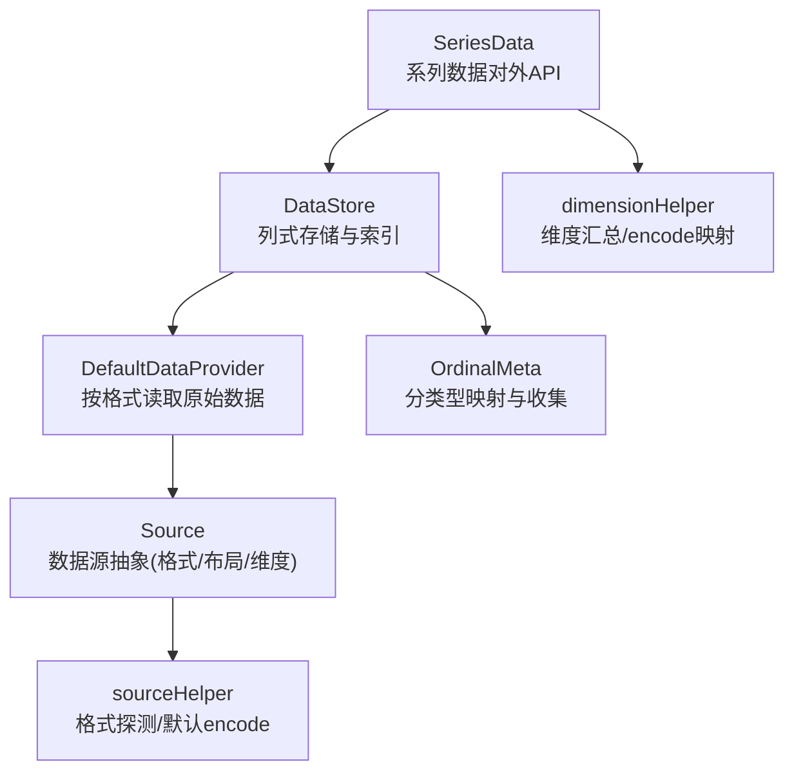
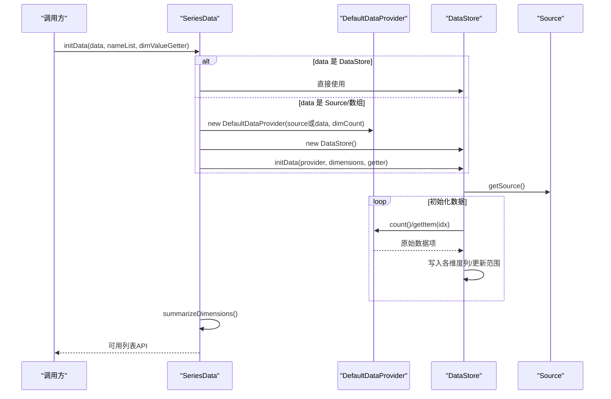
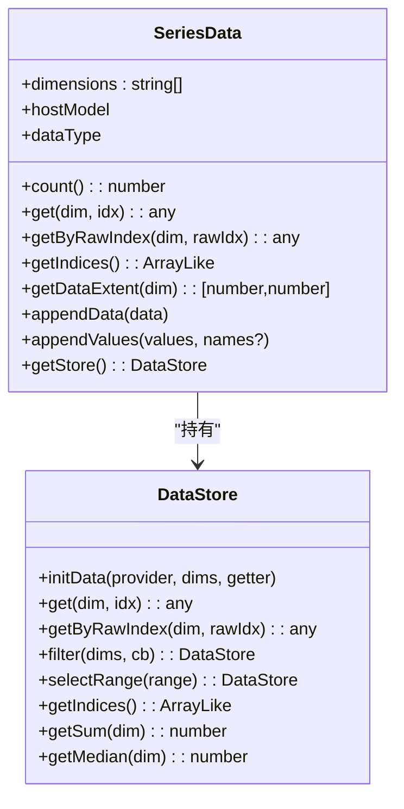
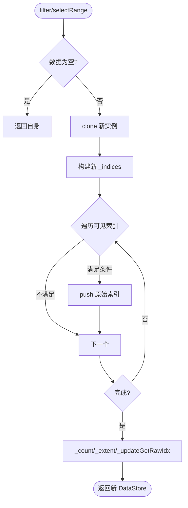
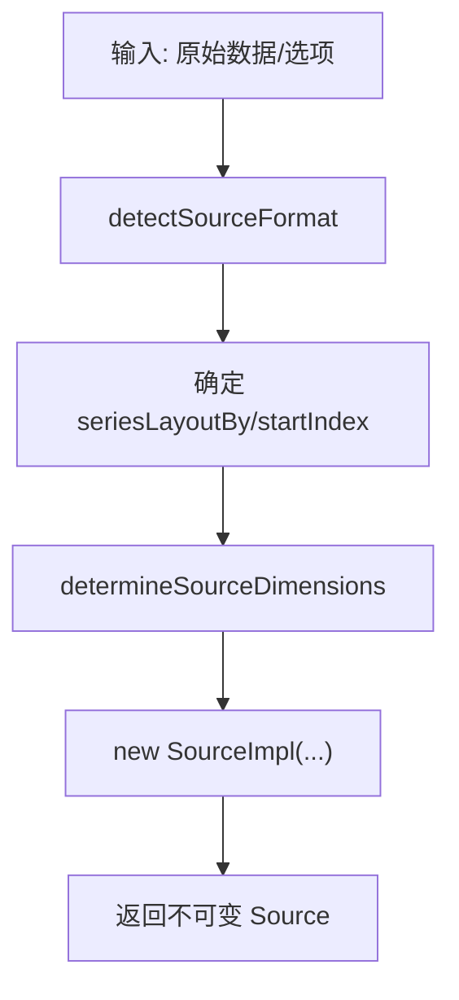
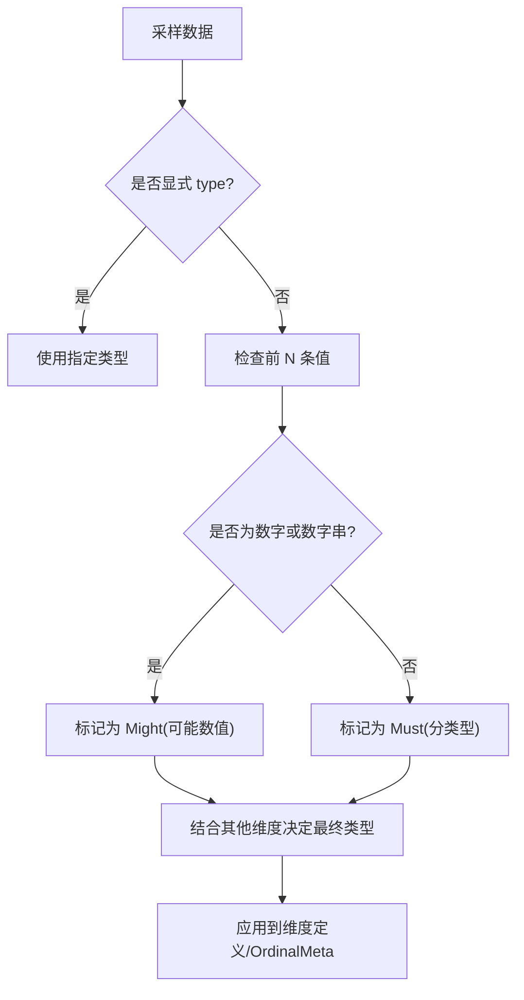
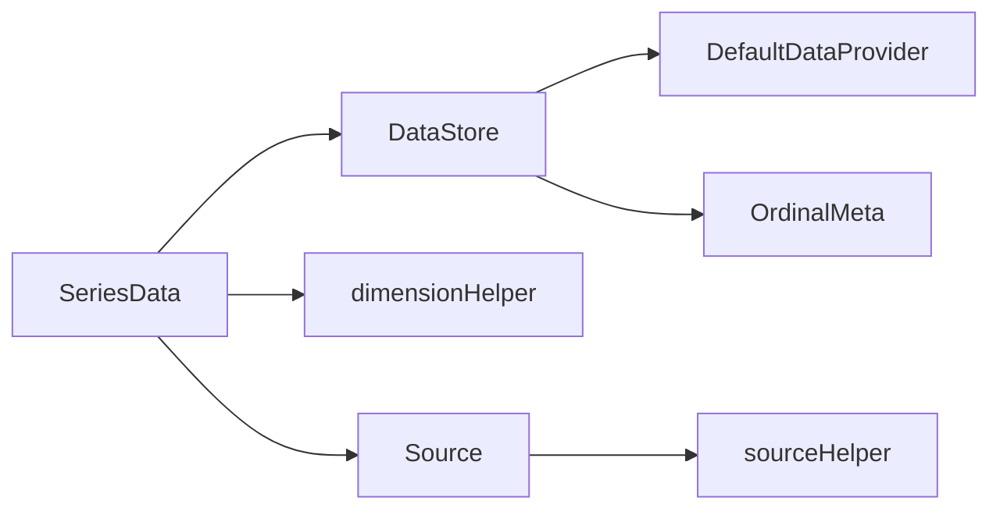

# 数据存储

<cite>
**本文引用的文件**
- [SeriesData.ts](file://src/data/SeriesData.ts)
- [DataStore.ts](file://src/data/DataStore.ts)
- [Source.ts](file://src/data/Source.ts)
- [dataProvider.ts](file://src/data/helper/dataProvider.ts)
- [dimensionHelper.ts](file://src/data/helper/dimensionHelper.ts)
- [sourceHelper.ts](file://src/data/helper/sourceHelper.ts)
- [OrdinalMeta.ts](file://src/data/OrdinalMeta.ts)
</cite>

## 目录
1. [简介](#简介)
2. [项目结构](#项目结构)
3. [核心组件](#核心组件)
4. [架构总览](#架构总览)
5. [详细组件分析](#详细组件分析)
6. [依赖关系分析](#依赖关系分析)
7. [性能考量](#性能考量)
8. [故障排查指南](#故障排查指南)
9. [结论](#结论)
10. [附录](#附录)

## 简介
本文件系统性阐述 ECharts 的数据存储体系，重点覆盖：
- SeriesData 的数据组织与访问接口
- DataStore 的存储、索引、查询优化机制
- Source 数据源抽象与统一访问方式
- 数据类型检测与自动推断（数值型、分类型、时间型）
- 最佳实践与性能优化建议

ECharts 将“原始数据”通过 Source 抽象为统一模型，由 DataProvider 适配不同格式，再由 DataStore 以列式分块存储并维护索引与统计信息；SeriesData 作为面向图表系列的对外 API，封装维度定义、名称/ID、可视化与布局信息等。

## 项目结构
数据存储相关代码集中在 src/data 及其 helper 子目录：
- 核心类：SeriesData、DataStore、Source
- 数据提供者：DefaultDataProvider
- 维度与编码汇总：dimensionHelper
- 数据源探测与默认 encode：sourceHelper
- 分类型元数据：OrdinalMeta

图示来源
- [SeriesData.ts:152-563](file://src/data/SeriesData.ts#L152-L563)
- [DataStore.ts:162-440](file://src/data/DataStore.ts#L162-L440)
- [dataProvider.ts:84-294](file://src/data/helper/dataProvider.ts#L84-L294)
- [Source.ts:94-224](file://src/data/Source.ts#L94-L224)
- [dimensionHelper.ts:93-186](file://src/data/helper/dimensionHelper.ts#L93-L186)
- [sourceHelper.ts:256-401](file://src/data/helper/sourceHelper.ts#L256-L401)
- [OrdinalMeta.ts:26-149](file://src/data/OrdinalMeta.ts#L26-L149)

章节来源
- [SeriesData.ts:152-563](file://src/data/SeriesData.ts#L152-L563)
- [DataStore.ts:162-440](file://src/data/DataStore.ts#L162-L440)
- [Source.ts:94-224](file://src/data/Source.ts#L94-L224)
- [dataProvider.ts:84-294](file://src/data/helper/dataProvider.ts#L84-L294)
- [dimensionHelper.ts:93-186](file://src/data/helper/dimensionHelper.ts#L93-L186)
- [sourceHelper.ts:256-401](file://src/data/helper/sourceHelper.ts#L256-L401)
- [OrdinalMeta.ts:26-149](file://src/data/OrdinalMeta.ts#L26-L149)

## 核心组件
- SeriesData：面向系列的列表数据结构，管理维度定义、名称/ID、视觉与布局缓存、近似范围等，并提供 get/getByRawIndex/count/filter/map 等访问接口。
- DataStore：多维权值列式存储，使用 TypedArray/Array 分块存储各维度值，维护 _indices 过滤后的可见索引、_rawExtent/_extent 范围缓存、求和/中位数等统计。
- Source：对 dataset/series.data 的统一抽象，包含 sourceFormat、seriesLayoutBy、dimensionsDefine、startIndex 等元信息。
- DefaultDataProvider：根据 Source 的格式与布局，提供 getItem/count/fillStorage/appendData/clean 等能力，屏蔽底层数组/对象行/键列/TypedArray 的差异。
- dimensionHelper：汇总维度到坐标轴/视觉维度的映射，生成 userOutput 与默认 label/tooltip 维度。
- sourceHelper：数据源格式探测、默认 encode 推导、分类型推断策略。
- OrdinalMeta：分类型类别收集与去重，提供 parseAndCollect 将原始类别转为整数索引。

章节来源
- [SeriesData.ts:152-800](file://src/data/SeriesData.ts#L152-L800)
- [DataStore.ts:162-800](file://src/data/DataStore.ts#L162-L800)
- [Source.ts:94-224](file://src/data/Source.ts#L94-L224)
- [dataProvider.ts:84-294](file://src/data/helper/dataProvider.ts#L84-L294)
- [dimensionHelper.ts:93-186](file://src/data/helper/dimensionHelper.ts#L93-L186)
- [sourceHelper.ts:256-401](file://src/data/helper/sourceHelper.ts#L256-L401)
- [OrdinalMeta.ts:26-149](file://src/data/OrdinalMeta.ts#L26-L149)

## 架构总览
数据从用户配置进入，经 Source 抽象后由 DataProvider 暴露统一访问；DataStore 负责将数据按维度列式存储，构建索引与统计；SeriesData 在 DataStore 之上提供语义化 API 与缓存。

图示来源
- [SeriesData.ts:518-563](file://src/data/SeriesData.ts#L518-L563)
- [DataStore.ts:192-234](file://src/data/DataStore.ts#L192-L234)
- [DataStore.ts:381-440](file://src/data/DataStore.ts#L381-L440)
- [dataProvider.ts:107-182](file://src/data/helper/dataProvider.ts#L107-L182)
- [Source.ts:197-224](file://src/data/Source.ts#L197-L224)

## 详细组件分析

### SeriesData：序列数据的组织与访问
- 维度与类型：通过构造参数或 Schema 声明维度名与类型，内部维护 _dimInfos 与 dimensions 列表，支持省略维度以提升高维数据集性能。
- 名称/ID：支持从数据项 name/id 提取，或在无 id 时基于 name 生成稳定 id，便于动态数据 diff。
- 数据访问：
  - get(dim, idx)/getByRawIndex(dim, rawIdx)：按维度名或原始索引取值
  - count()：当前可见数据量
  - getIndices()：返回可见索引数组（过滤后）
  - getDataExtent()/getSum()/getMedian()：统计与范围
  - appendData()/appendValues()：追加原始数据或按维度列追加
- 可视化与布局：维护 _visual/_layout/_itemVisuals/_itemLayouts 等缓存，减少重复计算。
- 近似范围：_approximateExtent 用于快速估算过滤后的范围，避免全量扫描。

图示来源
- [SeriesData.ts:152-800](file://src/data/SeriesData.ts#L152-L800)
- [DataStore.ts:162-800](file://src/data/DataStore.ts#L162-L800)

章节来源
- [SeriesData.ts:152-800](file://src/data/SeriesData.ts#L152-L800)

### DataStore：存储、索引与查询优化
- 列式存储：每个维度一个 chunk（TypedArray 或 Array），按类型选择合适构造函数（float/int/time/ordinal/number）。
- 索引机制：
  - _indices：过滤后的可见索引，支持二分查找 indexOfRawIndex
  - getIndices()：按需克隆或视图化返回，避免不必要拷贝
- 范围与统计：
  - _rawExtent 记录原始范围，_extent 记录过滤后的范围（带 filterKey）
  - getSum/getMedian 等聚合方法
- 过滤与选择：
  - filter(dims, cb)：通用过滤，返回新 DataStore
  - selectRange(range)：针对范围选择的高度内联优化，支持 1~N 维范围判断
- 增量与填充：
  - appendData/appendValues：支持追加原始数据或按维度列追加
  - fillStorage：当 provider 可批量填充时直接写入，减少 JS 循环开销

图示来源
- [DataStore.ts:606-661](file://src/data/DataStore.ts#L606-L661)
- [DataStore.ts:667-781](file://src/data/DataStore.ts#L667-L781)

章节来源
- [DataStore.ts:162-800](file://src/data/DataStore.ts#L162-L800)

### Source：数据源的抽象与统一访问
- 统一元信息：sourceFormat（original/arrayRows/objectRows/keyedColumns/typedArray）、seriesLayoutBy（row/column）、dimensionsDefine、startIndex、dimensionsDetectedCount。
- 格式探测：detectSourceFormat 根据顶层结构与元素类型推断格式。
- 维度确定：determineSourceDimensions 结合 seriesLayoutBy 与 sourceHeader 推断起始行与维度名。
- 默认 encode：makeSeriesEncodeForAxisCoordSys/makeSeriesEncodeForNameBased 在 dataset 场景下自动生成 x/y/itemName/seriesName 等映射。

图示来源
- [Source.ts:256-401](file://src/data/Source.ts#L256-L401)
- [Source.ts:94-224](file://src/data/Source.ts#L94-L224)

章节来源
- [Source.ts:94-224](file://src/data/Source.ts#L94-L224)
- [Source.ts:256-401](file://src/data/Source.ts#L256-L401)

### DefaultDataProvider：按格式读取数据
- 根据 Source 的 format/layout 挂载不同的 getItem/count/fillStorage/appendData/clean 实现。
- 支持 typedArray 的高效 fillStorage，直接按维度切片写入 DataStore 并更新范围。
- 对 objectRows/keyedColumns 等复杂格式进行行列转换与属性抽取。

章节来源
- [dataProvider.ts:84-294](file://src/data/helper/dataProvider.ts#L84-L294)
- [dataProvider.ts:331-483](file://src/data/helper/dataProvider.ts#L331-L483)

### 维度汇总与默认标签/提示
- summarizeDimensions 将维度映射到坐标轴维度与视觉维度，生成 userOutput 与默认 label/tooltip 维度集合。
- 支持从 schema 输出完整维度名，即使部分维度被省略也能正确解析。

章节来源
- [dimensionHelper.ts:93-186](file://src/data/helper/dimensionHelper.ts#L93-L186)

### 数据类型检测与自动推断
- 分类型推断：sourceHelper.guessOrdinal 采样前若干条数据，依据是否纯数字、字符串等判定 Must/Might/Not 分类型。
- 维度类型映射：dimensionHelper.getDimensionTypeByAxis 将 axis 类型映射为 float/ordinal/time。
- 分类型元数据：OrdinalMeta 维护 categories 与 map，parseAndCollect 将原始类别转为整数索引，支持去重与懒加载 map。

图示来源
- [sourceHelper.ts:341-463](file://src/data/helper/sourceHelper.ts#L341-L463)
- [OrdinalMeta.ts:91-149](file://src/data/OrdinalMeta.ts#L91-L149)
- [dimensionHelper.ts:198-204](file://src/data/helper/dimensionHelper.ts#L198-L204)

章节来源
- [sourceHelper.ts:341-463](file://src/data/helper/sourceHelper.ts#L341-L463)
- [OrdinalMeta.ts:26-149](file://src/data/OrdinalMeta.ts#L26-L149)
- [dimensionHelper.ts:198-204](file://src/data/helper/dimensionHelper.ts#L198-L204)

## 依赖关系分析
- SeriesData 依赖 DataStore 进行实际存取，依赖 dimensionHelper 做维度汇总，依赖 Source/Schema 做维度声明。
- DataStore 依赖 DataProvider 获取原始数据，依赖 OrdinalMeta 处理分类型。
- Source 依赖 sourceHelper 做格式探测与维度推断。
- DefaultDataProvider 依赖 Source 的 format/layout 选择具体实现。

图示来源
- [SeriesData.ts:152-563](file://src/data/SeriesData.ts#L152-L563)
- [DataStore.ts:162-440](file://src/data/DataStore.ts#L162-L440)
- [Source.ts:94-224](file://src/data/Source.ts#L94-L224)
- [dataProvider.ts:84-294](file://src/data/helper/dataProvider.ts#L84-L294)
- [dimensionHelper.ts:93-186](file://src/data/helper/dimensionHelper.ts#L93-L186)
- [sourceHelper.ts:256-401](file://src/data/helper/sourceHelper.ts#L256-L401)
- [OrdinalMeta.ts:26-149](file://src/data/OrdinalMeta.ts#L26-L149)

章节来源
- [SeriesData.ts:152-563](file://src/data/SeriesData.ts#L152-L563)
- [DataStore.ts:162-440](file://src/data/DataStore.ts#L162-L440)
- [Source.ts:94-224](file://src/data/Source.ts#L94-L224)
- [dataProvider.ts:84-294](file://src/data/helper/dataProvider.ts#L84-L294)
- [dimensionHelper.ts:93-186](file://src/data/helper/dimensionHelper.ts#L93-L186)
- [sourceHelper.ts:256-401](file://src/data/helper/sourceHelper.ts#L256-L401)
- [OrdinalMeta.ts:26-149](file://src/data/OrdinalMeta.ts#L26-L149)

## 性能考量
- 列式存储与 TypedArray：DataStore 按维度使用 TypedArray（float/int/time）或 Array（ordinal/number），降低内存占用并提升数值运算速度。
- 惰性索引与视图：getIndices 仅在需要时创建或返回视图，避免多余拷贝。
- 范围缓存：_rawExtent/_extent 避免重复扫描，过滤后重置 extent 保证一致性。
- 快速路径：selectRange 对 1~2 维范围选择做了内联优化，显著加速常见缩放场景。
- 批量填充：provider.fillStorage 允许外部一次性填充多个维度，减少 JS 层循环。
- 维度省略：高维数据集可省略未使用维度，减少 SeriesData.dimensions 与后续处理成本。
- 分类型去重与懒建 Map：OrdinalMeta 仅在需要时构建哈希表，支持关闭去重以节省内存。

[本节为通用性能指导，无需特定文件引用]

## 故障排查指南
- 维度不存在：SeriesData 在开发模式下会校验未知维度并抛出错误，确保传入的维度名存在于 dimensions 或 schema 中。
- 索引越界：DataStore.get/getByRawIndex 对越界返回 NaN，调用方需自行处理空值。
- 过滤后索引不一致：filter/selectRange 会重建 _indices 并重置 _extent，若发现范围异常，检查是否在过滤后仍使用了旧范围缓存。
- 分类型识别异常：若期望为数值却被识别为分类型，检查 sourceHelper 的 guessOrdinal 采样逻辑与 dimensionsDefine.type 设置。
- 追加数据限制：appendData 仅能在创建 _indices 之前调用，否则将触发断言失败。

章节来源
- [SeriesData.ts:448-456](file://src/data/SeriesData.ts#L448-L456)
- [DataStore.ts:449-455](file://src/data/DataStore.ts#L449-L455)
- [DataStore.ts:606-661](file://src/data/DataStore.ts#L606-L661)
- [sourceHelper.ts:341-463](file://src/data/helper/sourceHelper.ts#L341-L463)
- [DataStore.ts:325-343](file://src/data/DataStore.ts#L325-L343)

## 结论
ECharts 的数据存储系统通过 Source/DataProvider/DataStore/SeriesData 的分层设计，实现了：
- 统一的数据源抽象与高效的多格式读取
- 列式存储与 TypedArray 优化，兼顾内存与速度
- 灵活的维度定义、自动推断与默认 encode
- 强大的过滤、选择与统计能力，支撑大数据量交互
- 完善的缓存与惰性计算，保障渲染与交互性能

遵循本文的最佳实践与优化建议，可在大规模数据场景下获得稳定高效的可视化体验。

## 附录
- 常用 API 速查
  - SeriesData：get/getByRawIndex/count/getIndices/getDataExtent/appendData/appendValues
  - DataStore：filter/selectRange/getSum/getMedian/getIndices
  - Source：createSource/createSourceFromSeriesDataOption/detectSourceFormat
  - 维度工具：summarizeDimensions/getDimensionTypeByAxis
  - 分类型：OrdinalMeta.parseAndCollect

[本节为概念性补充，无需特定文件引用]