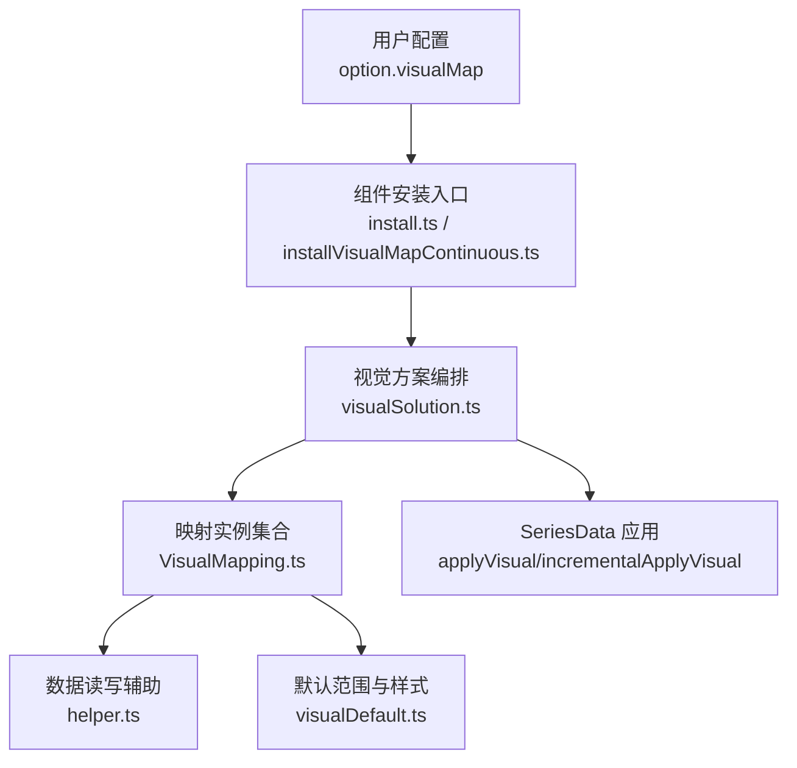
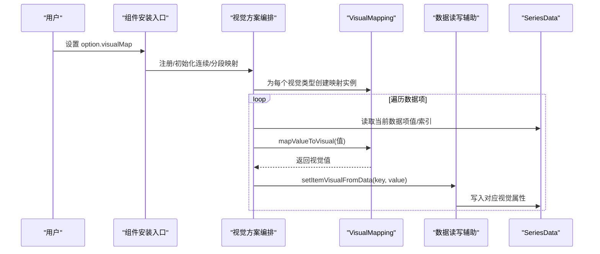
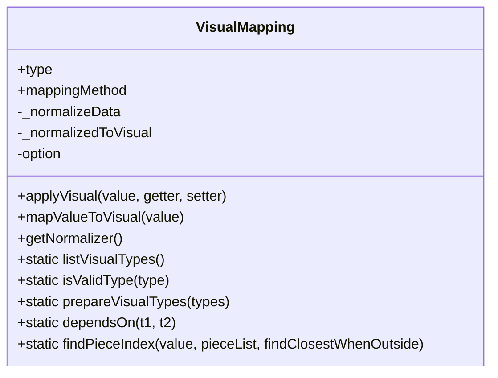
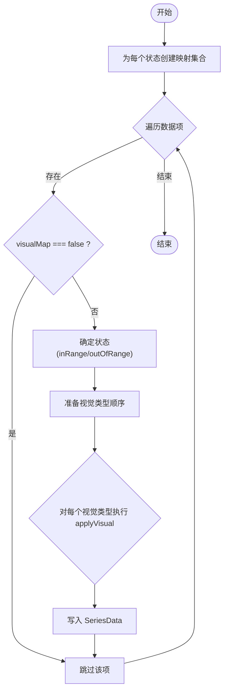
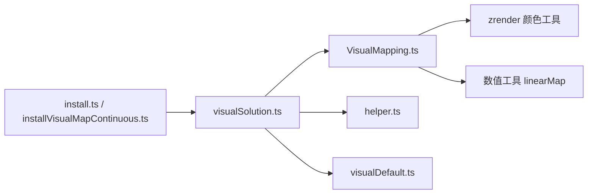

# 视觉映射

<cite>
**本文引用的文件**
- [VisualMapping.ts](file://src/visual/VisualMapping.ts)
- [visualSolution.ts](file://src/visual/visualSolution.ts)
- [helper.ts](file://src/visual/helper.ts)
- [visualDefault.ts](file://src/visual/visualDefault.ts)
- [install.ts](file://src/component/visualMap/install.ts)
- [installVisualMapContinuous.ts](file://src/component/visualMap/installVisualMapContinuous.ts)
- [visualMap.ts](file://src/component/visualMap.ts)
- [visualMapContinuous.ts](file://src/component/visualMapContinuous.ts)
- [visualMapPiecewise.ts](file://src/component/visualMapPiecewise.ts)
- [visualMap-continuous.html](file://test/visualMap-continuous.html)
- [visualMap-pieces.html](file://test/visualMap-pieces.html)
</cite>

## 目录
1. [简介](#简介)
2. [项目结构](#项目结构)
3. [核心组件](#核心组件)
4. [架构总览](#架构总览)
5. [详细组件分析](#详细组件分析)
6. [依赖关系分析](#依赖关系分析)
7. [性能考量](#性能考量)
8. [故障排查指南](#故障排查指南)
9. [结论](#结论)
10. [附录：配置示例与最佳实践](#附录：配置示例与最佳实践)

## 简介
本文件系统性阐述 ECharts 视觉映射系统的工作原理与配置方法，重点解释 VisualMapping 的核心能力：将数据值自动映射到颜色、大小、透明度、符号等视觉属性。文档覆盖连续映射与分段映射的差异与适用场景，说明颜色、大小、形状等属性的映射规则；解析计算过程与优先级（全局映射、系列映射、数据项映射的覆盖关系）；介绍自定义视觉映射器的扩展机制；并提供复杂场景的配置示例与最佳实践。

## 项目结构
ECharts 的视觉映射由“核心映射引擎 + 可视化方案编排 + 组件安装入口”三部分构成：
- 核心映射引擎：负责数值归一化、映射策略选择、视觉值生成与写入。
- 可视化方案编排：负责按状态（如 inRange/outOfRange）创建多个映射实例，并在渲染阶段批量应用到数据项。
- 组件安装入口：注册连续型与分段型 visualMap 组件，供用户通过 option.visualMap 使用。

图表来源
- [install.ts:20-30](file://src/component/visualMap/install.ts#L20-L30)
- [installVisualMapContinuous.ts:20-30](file://src/component/visualMap/installVisualMapContinuous.ts#L20-L30)
- [visualSolution.ts:61-102](file://src/visual/visualSolution.ts#L61-L102)
- [VisualMapping.ts:157-211](file://src/visual/VisualMapping.ts#L157-L211)
- [helper.ts:30-88](file://src/visual/helper.ts#L30-L88)
- [visualDefault.ts:27-89](file://src/visual/visualDefault.ts#L27-L89)

章节来源
- [install.ts:20-30](file://src/component/visualMap/install.ts#L20-L30)
- [installVisualMapContinuous.ts:20-30](file://src/component/visualMap/installVisualMapContinuous.ts#L20-L30)
- [visualSolution.ts:61-102](file://src/visual/visualSolution.ts#L61-L102)
- [VisualMapping.ts:157-211](file://src/visual/VisualMapping.ts#L157-L211)
- [helper.ts:30-88](file://src/visual/helper.ts#L30-L88)
- [visualDefault.ts:27-89](file://src/visual/visualDefault.ts#L27-L89)

## 核心组件
- VisualMapping：映射引擎核心，封装了四种映射方法（linear/piecewise/category/fixed），并为每种内置视觉类型（color、opacity、symbol、symbolSize、liftZ、decal 及其派生 colorHue/colorSaturation/colorLightness/colorAlpha）提供映射实现。
- visualSolution：按状态组织映射集合，统一在 applyVisual/incrementalApplyVisual 中遍历数据并调用各映射实例的 applyVisual，完成视觉属性写入。
- helper：提供 SeriesData 与外部开发者可见的视觉键之间的转换与读写桥接。
- visualDefault：提供各视觉类型的默认区间与激活/非激活态默认值。
- 组件安装入口：注册 continuous/piecewise 两种 visualMap 组件，使 option.visualMap 生效。

章节来源
- [VisualMapping.ts:157-336](file://src/visual/VisualMapping.ts#L157-L336)
- [visualSolution.ts:61-102](file://src/visual/visualSolution.ts#L61-L102)
- [helper.ts:30-88](file://src/visual/helper.ts#L30-L88)
- [visualDefault.ts:27-89](file://src/visual/visualDefault.ts#L27-L89)
- [install.ts:20-30](file://src/component/visualMap/install.ts#L20-L30)
- [installVisualMapContinuous.ts:20-30](file://src/component/visualMap/installVisualMapContinuous.ts#L20-L30)

## 架构总览
下图展示从用户配置到数据项视觉属性落地的完整流程，包括归一化、映射策略选择、视觉值生成与写入。

图表来源
- [install.ts:20-30](file://src/component/visualMap/install.ts#L20-L30)
- [installVisualMapContinuous.ts:20-30](file://src/component/visualMap/installVisualMapContinuous.ts#L20-L30)
- [visualSolution.ts:136-190](file://src/visual/visualSolution.ts#L136-L190)
- [VisualMapping.ts:208-211](file://src/visual/VisualMapping.ts#L208-L211)
- [helper.ts:66-88](file://src/visual/helper.ts#L66-L88)

## 详细组件分析

### VisualMapping 类与映射方法
- 构造期处理
  - 根据 mappingMethod 选择归一化器 normalizers 和 _normalizedToVisual 映射函数。
  - piecewise/category/linear/fixed 分别进行预处理（如区间标准化、类别映射表构建）。
- 运行时映射
  - mapValueToVisual(value)：先归一化，再按映射方法得到视觉值。
  - getColorMapper()：针对 color 提供高性能映射器，支持直接输出 RGB 数组用于像素操作。
- 内置视觉类型处理器
  - color：线性插值或分类映射，支持 parsedVisual 缓存加速。
  - opacity/symbolSize/liftZ：数值到数值的线性映射。
  - symbol：线性取色板或分类映射。
  - decal：仅支持分类映射。
  - colorHue/Saturation/Lightness/Alpha：基于 color 的通道级修改。

图表来源
- [VisualMapping.ts:157-211](file://src/visual/VisualMapping.ts#L157-L211)
- [VisualMapping.ts:217-336](file://src/visual/VisualMapping.ts#L217-L336)
- [VisualMapping.ts:345-541](file://src/visual/VisualMapping.ts#L345-L541)
- [VisualMapping.ts:711-732](file://src/visual/VisualMapping.ts#L711-L732)

章节来源
- [VisualMapping.ts:157-211](file://src/visual/VisualMapping.ts#L157-L211)
- [VisualMapping.ts:217-336](file://src/visual/VisualMapping.ts#L217-L336)
- [VisualMapping.ts:345-541](file://src/visual/VisualMapping.ts#L345-L541)
- [VisualMapping.ts:711-732](file://src/visual/VisualMapping.ts#L711-L732)

### 视觉方案编排与数据应用
- createVisualMappings：按状态（如 inRange/outOfRange）为每个视觉类型创建 VisualMapping 实例，并支持补充选项（如 alpha 通道）。
- applyVisual/incrementalApplyVisual：遍历数据，按状态获取映射集合与视觉类型顺序，依次调用映射实例的 applyVisual，最终通过 helper 写入 SeriesData。
- 数据项跳过：当数据项标记 visualMap: false 时，跳过该数据项的视觉映射。

图表来源
- [visualSolution.ts:61-102](file://src/visual/visualSolution.ts#L61-L102)
- [visualSolution.ts:136-190](file://src/visual/visualSolution.ts#L136-L190)
- [visualSolution.ts:199-253](file://src/visual/visualSolution.ts#L199-L253)
- [helper.ts:30-88](file://src/visual/helper.ts#L30-L88)

章节来源
- [visualSolution.ts:61-102](file://src/visual/visualSolution.ts#L61-L102)
- [visualSolution.ts:136-190](file://src/visual/visualSolution.ts#L136-L190)
- [visualSolution.ts:199-253](file://src/visual/visualSolution.ts#L199-L253)
- [helper.ts:30-88](file://src/visual/helper.ts#L30-L88)

### 颜色、大小、形状等视觉属性的映射规则
- 颜色（color）
  - 线性映射：在 dataExtent 范围内线性插值颜色数组，内部使用 parsedVisual 缓存加速。
  - 分类映射：按 categories 或序数索引映射到颜色数组。
  - 分段映射：优先匹配 pieceList 中的精确值或区间，未命中则回退到线性插值。
  - 派生通道：colorHue/Saturation/Lightness/Alpha 基于基础 color 进行通道级调整。
- 不透明度（opacity）
  - 数值到数值线性映射，默认范围 [0,1]。
- 符号（symbol）
  - 线性映射：从符号数组中按归一化位置取整选取。
  - 分类映射：按类别索引选取。
  - 分段映射：优先匹配 pieceList 指定符号，否则回退线性。
- 符号大小（symbolSize）
  - 数值到数值线性映射，默认范围 [0,1]。
- 层级提升（liftZ）
  - 固定值映射，用于控制绘制层级。
- 贴花（decal）
  - 仅支持分类映射。

章节来源
- [VisualMapping.ts:217-336](file://src/visual/VisualMapping.ts#L217-L336)
- [VisualMapping.ts:634-679](file://src/visual/VisualMapping.ts#L634-L679)
- [VisualMapping.ts:693-705](file://src/visual/VisualMapping.ts#L693-L705)
- [visualDefault.ts:27-89](file://src/visual/visualDefault.ts#L27-L89)

### 计算过程与优先级规则
- 归一化阶段
  - linear：将原始值按 dataExtent 映射到 [0,1]。
  - piecewise：根据 pieceList 查找区间或精确值，得到段内归一化位置。
  - category：按 categories 或序数索引得到类别序号。
  - fixed：忽略输入值，直接使用固定视觉值。
- 映射阶段
  - 对于 color：线性插值或分类映射；分段时优先 pieceList 指定视觉，否则回退线性。
  - 对于数值型（opacity/symbolSize/liftZ）：线性映射到目标范围。
  - 对于 symbol：线性取色板或分类映射；分段时优先 pieceList 指定符号。
- 优先级与覆盖
  - 数据项级别：若 rawDataItem.visualMap === false，则跳过该数据项的映射。
  - 系列级别：通过 series 的 visualMap 配置限定维度与映射范围，影响归一化与映射结果。
  - 全局级别：通过全局 visualMap 定义默认映射，可被系列级配置覆盖。
  - 数据项内联样式：如 itemStyle.color 会作为数据项自身样式，通常不受视觉映射覆盖（具体取决于渲染管线对样式的合并策略）。

章节来源
- [VisualMapping.ts:711-732](file://src/visual/VisualMapping.ts#L711-L732)
- [VisualMapping.ts:681-691](file://src/visual/VisualMapping.ts#L681-L691)
- [visualSolution.ts:167-189](file://src/visual/visualSolution.ts#L167-L189)

### 自定义视觉映射器的开发方法与扩展机制
- 扩展点
  - 通过 VisualMapping.listVisualTypes 查看已支持的视觉类型。
  - 通过 VisualMapping.isValidType 校验类型是否内置。
  - 通过 VisualMapping.prepareVisualTypes 对视觉类型排序，确保依赖关系（如 color 先于 colorAlpha）。
- 扩展建议
  - 新增视觉类型需实现对应的 VisualHandler（applyVisual、_normalizedToVisual 及可选 getColorMapper）。
  - 在视觉方案编排中注册新类型，使其参与 applyVisual 流程。
  - 如需高性能颜色映射，参考 color 的 getColorMapper 实现，支持直接输出 RGB 数组。

章节来源
- [VisualMapping.ts:345-361](file://src/visual/VisualMapping.ts#L345-L361)
- [VisualMapping.ts:431-466](file://src/visual/VisualMapping.ts#L431-L466)
- [VisualMapping.ts:217-270](file://src/visual/VisualMapping.ts#L217-L270)

## 依赖关系分析
- 组件安装入口依赖 visualSolution 与 VisualMapping，负责将 option.visualMap 转换为实际的映射实例集合。
- visualSolution 依赖 helper 与 SeriesData，负责数据遍历与视觉属性写入。
- VisualMapping 依赖 zrender 的颜色工具与数值工具，实现高效插值与字符串化。
- visualDefault 提供默认视觉范围，影响未显式配置时的行为。

图表来源
- [install.ts:20-30](file://src/component/visualMap/install.ts#L20-L30)
- [installVisualMapContinuous.ts:20-30](file://src/component/visualMap/installVisualMapContinuous.ts#L20-L30)
- [visualSolution.ts:61-102](file://src/visual/visualSolution.ts#L61-L102)
- [VisualMapping.ts:20-31](file://src/visual/VisualMapping.ts#L20-L31)
- [visualDefault.ts:27-89](file://src/visual/visualDefault.ts#L27-L89)

章节来源
- [install.ts:20-30](file://src/component/visualMap/install.ts#L20-L30)
- [installVisualMapContinuous.ts:20-30](file://src/component/visualMap/installVisualMapContinuous.ts#L20-L30)
- [visualSolution.ts:61-102](file://src/visual/visualSolution.ts#L61-L102)
- [VisualMapping.ts:20-31](file://src/visual/VisualMapping.ts#L20-L31)
- [visualDefault.ts:27-89](file://src/visual/visualDefault.ts#L27-L89)

## 性能考量
- 颜色映射缓存：color 类型在构造期将颜色字符串解析为 RGBA 数组并缓存，避免重复解析开销。
- 增量应用：incrementalApplyVisual 支持分片迭代，适合大数据集渲染，降低单次主线程压力。
- 跳过数据项：对 visualMap: false 的数据项直接跳过，减少不必要计算。
- 类型排序：prepareVisualTypes 保证依赖顺序，避免重复计算与无效更新。

章节来源
- [VisualMapping.ts:693-705](file://src/visual/VisualMapping.ts#L693-L705)
- [visualSolution.ts:199-253](file://src/visual/visualSolution.ts#L199-L253)
- [visualSolution.ts:167-189](file://src/visual/visualSolution.ts#L167-L189)
- [visualSolution.ts:144-148](file://src/visual/visualSolution.ts#L144-L148)

## 故障排查指南
- 颜色非法警告：当传入颜色字符串无法解析时，会发出警告并回退到默认颜色。检查 inRange/outOfRange 的颜色配置是否正确。
- 映射未生效：确认 option.visualMap 的 dimension 与系列数据维度一致；检查是否在 series 或全局正确声明映射。
- 数据项未被映射：若数据项设置了 visualMap: false，将被跳过；如需强制映射，移除该标记。
- 分段映射未命中：检查 pieceList 的 interval/close 配置是否与数据范围匹配；必要时启用 findClosestWhenOutside 逻辑（内部实现）。

章节来源
- [VisualMapping.ts:693-705](file://src/visual/VisualMapping.ts#L693-L705)
- [visualSolution.ts:167-189](file://src/visual/visualSolution.ts#L167-L189)
- [VisualMapping.ts:475-541](file://src/visual/VisualMapping.ts#L475-L541)

## 结论
ECharts 视觉映射系统以 VisualMapping 为核心，结合 visualSolution 的状态化编排与 helper 的数据读写桥接，实现了灵活、高性能且可扩展的“数据值到视觉属性”的自动映射。通过连续、分段、分类与固定四种映射方法，以及丰富的内置视觉类型，能够覆盖绝大多数可视化需求。配合默认范围、增量应用与数据项跳过等优化，系统在易用性与性能之间取得良好平衡。

## 附录：配置示例与最佳实践
- 连续映射（colorHue 示例）
  - 使用 visualMap 的 inRange 配置 colorHue 范围，实现色相随数据变化。
  - 参考测试用例：[visualMap-continuous.html](file://test/visualMap-continuous.html)
- 分段映射（pieces 示例）
  - 使用 pieces 定义区间与特殊值，支持文本标签与自定义颜色。
  - 参考测试用例：[visualMap-pieces.html](file://test/visualMap-pieces.html)
- 最佳实践
  - 明确数据维度：确保 visualMap.dimension 与系列数据维度一致。
  - 合理设置 dataExtent：避免超出范围的异常映射。
  - 利用分段映射处理异常值：为极端值或特殊类别单独配置视觉。
  - 使用增量应用：大数据集场景优先使用 incrementalApplyVisual。
  - 谨慎使用数据项跳过：仅在确实需要保留数据项原样式时使用 visualMap: false。

章节来源
- [visualMap-continuous.html:89-145](file://test/visualMap-continuous.html#L89-L145)
- [visualMap-pieces.html:84-110](file://test/visualMap-pieces.html#L84-L110)
- [visualSolution.ts:199-253](file://src/visual/visualSolution.ts#L199-L253)
- [VisualMapping.ts:711-732](file://src/visual/VisualMapping.ts#L711-L732)