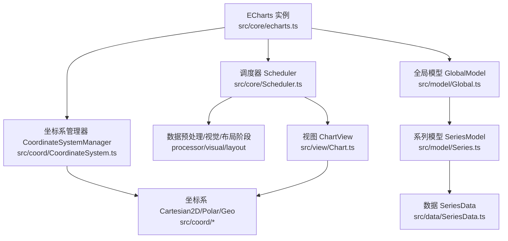
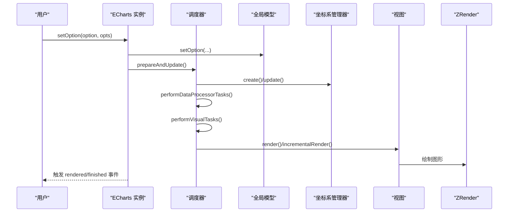
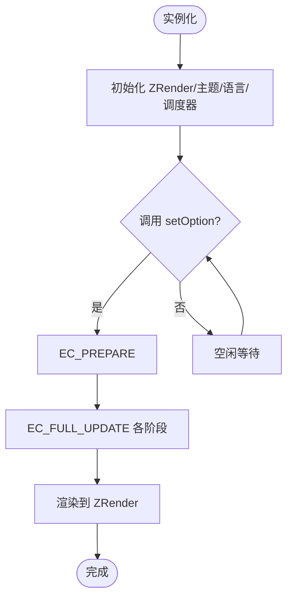
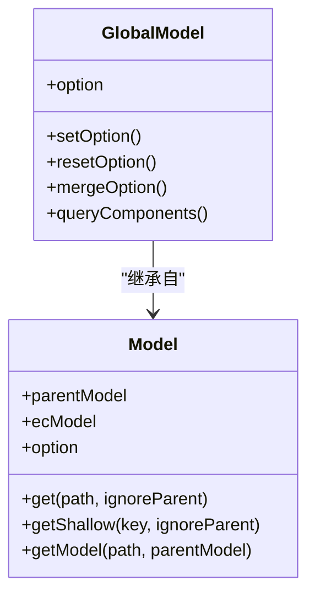
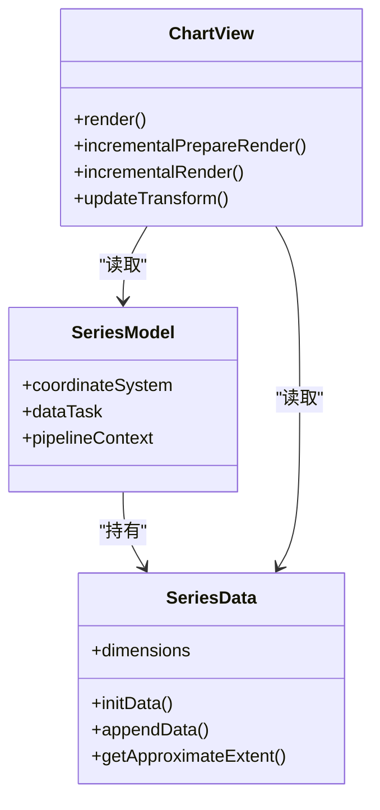
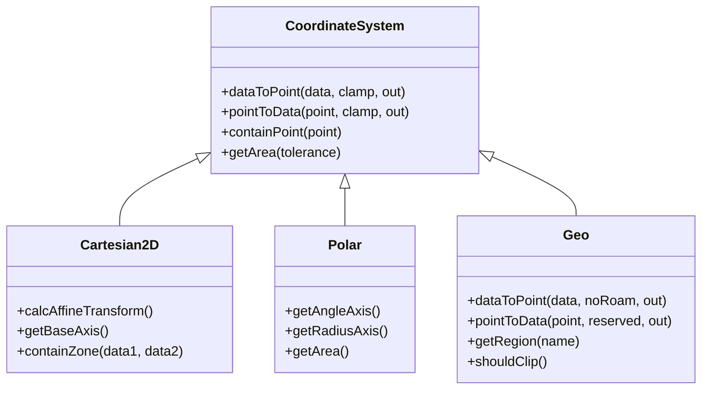
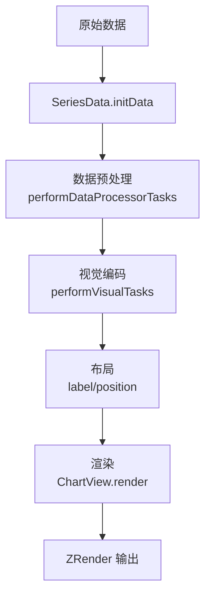
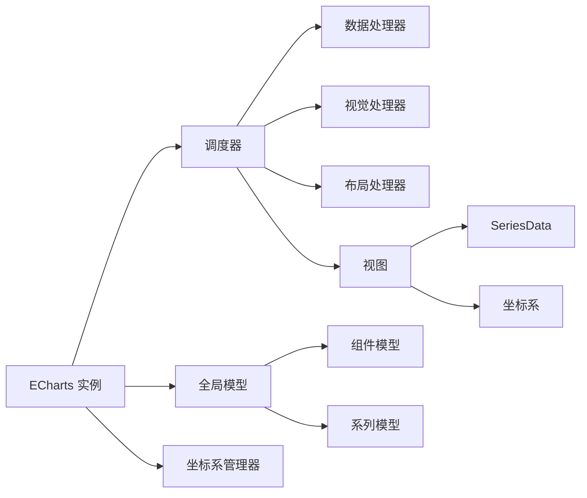

# 核心概念

<cite>
**本文引用的文件**
- [src/core/echarts.ts](file://src/core/echarts.ts)
- [src/core/lifecycle.ts](file://src/core/lifecycle.ts)
- [src/model/Model.ts](file://src/model/Model.ts)
- [src/model/Global.ts](file://src/model/Global.ts)
- [src/view/Chart.ts](file://src/view/Chart.ts)
- [src/core/Scheduler.ts](file://src/core/Scheduler.ts)
- [src/data/SeriesData.ts](file://src/data/SeriesData.ts)
- [src/coord/CoordinateSystem.ts](file://src/coord/CoordinateSystem.ts)
- [src/coord/cartesian/Cartesian2D.ts](file://src/coord/cartesian/Cartesian2D.ts)
- [src/coord/polar/Polar.ts](file://src/coord/polar/Polar.ts)
- [src/coord/geo/Geo.ts](file://src/coord/geo/Geo.ts)
</cite>

## 目录
1. [简介](#简介)
2. [项目结构](#项目结构)
3. [核心组件](#核心组件)
4. [架构总览](#架构总览)
5. [详细组件分析](#详细组件分析)
6. [依赖关系分析](#依赖关系分析)
7. [性能考量](#性能考量)
8. [故障排查指南](#故障排查指南)
9. [结论](#结论)
10. [附录](#附录)

## 简介
本章节面向希望深入理解 ECharts 内部机制的开发者，系统阐述以下主题：
- 图表实例生命周期管理（初始化、更新、销毁）
- option 配置对象的层次结构与继承关系（全局、组件、系列）
- Model-View 分离架构（Model 负责配置与数据处理，View 负责渲染与交互）
- 坐标系系统工作原理（直角、极坐标、地理坐标的转换机制）
- 数据流处理管道（从原始数据到最终渲染的完整流程）
- 架构图表与代码级示例路径，帮助定位实现细节

## 项目结构
ECharts 的核心由“入口实例 + 调度器 + 模型层 + 视图层 + 坐标系 + 数据”构成。关键目录与职责如下：
- core：实例入口、生命周期、调度器、扩展 API、坐标系管理器
- model：全局模型、组件模型、系列模型、选项管理与合并
- view：图表视图基类，定义渲染与增量更新接口
- data：SeriesData、DataStore、维度定义、数据差异与采样
- coord：坐标系抽象与具体实现（直角、极坐标、地理等）
- processor/visual/layout：数据预处理、视觉编码、布局阶段处理器
- chart/component：各图表类型与组件的具体实现

图示来源
- [src/core/echarts.ts:454-618](file://src/core/echarts.ts#L454-L618)
- [src/core/Scheduler.ts:114-149](file://src/core/Scheduler.ts#L114-L149)
- [src/model/Global.ts:156-235](file://src/model/Global.ts#L156-L235)
- [src/coord/CoordinateSystem.ts:47-107](file://src/coord/CoordinateSystem.ts#L47-L107)
- [src/view/Chart.ts:98-147](file://src/view/Chart.ts#L98-L147)
- [src/data/SeriesData.ts:152-350](file://src/data/SeriesData.ts#L152-L350)
- [src/coord/cartesian/Cartesian2D.ts:41-88](file://src/coord/cartesian/Cartesian2D.ts#L41-L88)
- [src/coord/polar/Polar.ts:34-64](file://src/coord/polar/Polar.ts#L34-L64)
- [src/coord/geo/Geo.ts:58-166](file://src/coord/geo/Geo.ts#L58-L166)

章节来源
- [src/core/echarts.ts:454-618](file://src/core/echarts.ts#L454-L618)
- [src/core/Scheduler.ts:114-149](file://src/core/Scheduler.ts#L114-L149)
- [src/model/Global.ts:156-235](file://src/model/Global.ts#L156-L235)
- [src/coord/CoordinateSystem.ts:47-107](file://src/coord/CoordinateSystem.ts#L47-L107)
- [src/view/Chart.ts:98-147](file://src/view/Chart.ts#L98-L147)
- [src/data/SeriesData.ts:152-350](file://src/data/SeriesData.ts#L152-L350)
- [src/coord/cartesian/Cartesian2D.ts:41-88](file://src/coord/cartesian/Cartesian2D.ts#L41-L88)
- [src/coord/polar/Polar.ts:34-64](file://src/coord/polar/Polar.ts#L34-L64)
- [src/coord/geo/Geo.ts:58-166](file://src/coord/geo/Geo.ts#L58-L166)

## 核心组件
- ECharts 实例：封装 DOM、ZRender、主题、语言、事件、调度器、坐标系管理器，提供 setOption/resize/dispatchAction 等 API，并驱动 EC_CYCLE 更新流程。
- 调度器 Scheduler：编排数据预处理、视觉编码、布局、渲染任务；支持渐进式渲染与流式更新；维护 pipeline 与 stage task。
- 模型层 Model/Global：统一解析、合并、挂载 option；构建组件树；管理主题、locale、组件映射与查询。
- 视图层 ChartView：定义 render/incrementalPrepareRender/incrementalRender/updateTransform 等接口，基于任务计划执行渲染。
- 数据层 SeriesData：维度定义、数据存储、名称/ID、近似范围、计算信息、可视化属性缓存、图形元素关联。
- 坐标系系统：抽象 CoordinateSystem，提供 dataToPoint/pointToData/contain 等能力；具体实现包括直角、极坐标、地理坐标。

章节来源
- [src/core/echarts.ts:454-618](file://src/core/echarts.ts#L454-L618)
- [src/core/Scheduler.ts:114-149](file://src/core/Scheduler.ts#L114-L149)
- [src/model/Model.ts:48-243](file://src/model/Model.ts#L48-L243)
- [src/model/Global.ts:156-235](file://src/model/Global.ts#L156-L235)
- [src/view/Chart.ts:98-147](file://src/view/Chart.ts#L98-L147)
- [src/data/SeriesData.ts:152-350](file://src/data/SeriesData.ts#L152-L350)
- [src/coord/CoordinateSystem.ts:47-107](file://src/coord/CoordinateSystem.ts#L47-L107)

## 架构总览
ECharts 采用“实例驱动 + 调度器编排 + Model-View 分离 + 坐标系抽象”的整体架构。setOption 触发 EC_FULL_UPDATE_CYCLE，依次完成：
- 准备阶段（EC_PREPARE）
- 坐标系创建/更新
- 数据预处理（filter/stack/sample 等）
- 视觉编码（颜色、符号、样式等）
- 布局（标签、位置等）
- 渲染（ComponentView/SeriesView）
- 生命周期事件回调

图示来源
- [src/core/echarts.ts:737-800](file://src/core/echarts.ts#L737-L800)
- [src/core/echarts.ts:1896-1921](file://src/core/echarts.ts#L1896-L1921)
- [src/core/Scheduler.ts:292-303](file://src/core/Scheduler.ts#L292-L303)
- [src/view/Chart.ts:271-320](file://src/view/Chart.ts#L271-L320)

章节来源
- [src/core/echarts.ts:737-800](file://src/core/echarts.ts#L737-L800)
- [src/core/echarts.ts:1896-1921](file://src/core/echarts.ts#L1896-L1921)
- [src/core/Scheduler.ts:292-303](file://src/core/Scheduler.ts#L292-L303)
- [src/view/Chart.ts:271-320](file://src/view/Chart.ts#L271-L320)

## 详细组件分析

### 图表实例生命周期管理
- 初始化：构造时创建 ZRender、主题、语言、坐标系管理器、调度器、消息中心，绑定帧事件与鼠标事件。
- 更新：setOption 进入 EC_CYCLE，prepare 后调用 updateMethods.update，按阶段执行数据/视觉/布局/渲染。
- 销毁：dispose 释放资源（如移除图形元素、解绑事件），确保内存回收。
- 懒更新：lazyUpdate 模式下将更新推迟至下一帧，避免频繁重绘。

图示来源
- [src/core/echarts.ts:520-618](file://src/core/echarts.ts#L520-L618)
- [src/core/echarts.ts:737-800](file://src/core/echarts.ts#L737-L800)
- [src/core/echarts.ts:1896-1921](file://src/core/echarts.ts#L1896-L1921)

章节来源
- [src/core/echarts.ts:520-618](file://src/core/echarts.ts#L520-L618)
- [src/core/echarts.ts:737-800](file://src/core/echarts.ts#L737-L800)
- [src/core/echarts.ts:1896-1921](file://src/core/echarts.ts#L1896-L1921)

### option 配置对象层次与继承
- 全局配置：theme/locale/globalDefault 等，通过 GlobalModel 挂载与合并。
- 组件配置：grid/polar/legend/tooltip 等，按 mainType/subType 组织，支持 replaceMerge/normalMerge。
- 系列配置：series.*，包含 encode/dimensions/visualMap 等，与坐标系和数据维度紧密耦合。
- 继承关系：Model.get/getShallow 支持父模型回退查找，实现层级覆盖与默认值继承。

图示来源
- [src/model/Global.ts:156-235](file://src/model/Global.ts#L156-L235)
- [src/model/Model.ts:48-243](file://src/model/Model.ts#L48-L243)

章节来源
- [src/model/Global.ts:156-235](file://src/model/Global.ts#L156-L235)
- [src/model/Model.ts:48-243](file://src/model/Model.ts#L48-L243)

### Model-View 分离架构
- Model 层：负责解析与合并 option，构建组件树，暴露查询与遍历 API，管理主题与 locale。
- View 层：ChartView 定义渲染与增量更新接口，基于 Scheduler 的任务计划执行渲染；支持渐进式渲染与 appendData。
- 协作方式：SeriesModel 持有 SeriesData，View 读取数据与视觉属性进行绘制；坐标系为 View 提供坐标转换。

图示来源
- [src/model/Series.ts:149-200](file://src/model/Series.ts#L149-L200)
- [src/data/SeriesData.ts:152-350](file://src/data/SeriesData.ts#L152-L350)
- [src/view/Chart.ts:98-147](file://src/view/Chart.ts#L98-L147)

章节来源
- [src/model/Series.ts:149-200](file://src/model/Series.ts#L149-L200)
- [src/data/SeriesData.ts:152-350](file://src/data/SeriesData.ts#L152-L350)
- [src/view/Chart.ts:98-147](file://src/view/Chart.ts#L98-L147)

### 坐标系系统工作原理
- 抽象接口：CoordinateSystem 提供 dataToPoint/pointToData/contain/getArea 等通用方法。
- 直角坐标系（Cartesian2D）：基于 x/y 轴刻度，支持仿射变换加速大数据时间序列；提供 getBaseAxis、containZone 等能力。
- 极坐标系（Polar）：基于 radius/angle 轴，支持角度范围与半径范围判定，提供环状区域面积与包含判断。
- 地理坐标系（Geo）：加载地图资源，支持投影/反投影，提供区域查询、裁剪、视口矩形与漫游变换。

图示来源
- [src/coord/CoordinateSystem.ts:47-107](file://src/coord/CoordinateSystem.ts#L47-L107)
- [src/coord/cartesian/Cartesian2D.ts:41-88](file://src/coord/cartesian/Cartesian2D.ts#L41-L88)
- [src/coord/polar/Polar.ts:34-64](file://src/coord/polar/Polar.ts#L34-L64)
- [src/coord/geo/Geo.ts:58-166](file://src/coord/geo/Geo.ts#L58-L166)

章节来源
- [src/coord/CoordinateSystem.ts:47-107](file://src/coord/CoordinateSystem.ts#L47-L107)
- [src/coord/cartesian/Cartesian2D.ts:41-88](file://src/coord/cartesian/Cartesian2D.ts#L41-L88)
- [src/coord/polar/Polar.ts:34-64](file://src/coord/polar/Polar.ts#L34-L64)
- [src/coord/geo/Geo.ts:58-166](file://src/coord/geo/Geo.ts#L58-L166)

### 数据流处理管道
- 数据源：SeriesData.initData 接收 Source/DataStore/DataProvider，建立 DataStore 与维度信息。
- 预处理：Scheduler.performDataProcessorTasks 执行 filter/stack/sample 等，影响后续统计与过滤。
- 视觉编码：Scheduler.performVisualTasks 注入颜色、符号、样式等视觉属性。
- 布局：标签与位置计算，部分图表在自身布局中处理。
- 渲染：ChartView.render/incrementalRender 根据任务计划逐步绘制，支持渐进式与追加数据。

图示来源
- [src/data/SeriesData.ts:527-563](file://src/data/SeriesData.ts#L527-L563)
- [src/core/Scheduler.ts:292-303](file://src/core/Scheduler.ts#L292-L303)
- [src/view/Chart.ts:271-320](file://src/view/Chart.ts#L271-L320)

章节来源
- [src/data/SeriesData.ts:527-563](file://src/data/SeriesData.ts#L527-L563)
- [src/core/Scheduler.ts:292-303](file://src/core/Scheduler.ts#L292-L303)
- [src/view/Chart.ts:271-320](file://src/view/Chart.ts#L271-L320)

## 依赖关系分析
- ECharts 实例依赖：ZRender、全局模型、坐标系管理器、调度器、扩展 API、主题与语言。
- 调度器依赖：数据处理器、视觉处理器、阶段任务、流水线上下文。
- 模型依赖：组件模型、系列模型、选项管理器、主题与 locale。
- 视图依赖：系列模型、数据、坐标系、ZRender 图形元素。
- 坐标系依赖：轴、尺度、投影、视口矩形。

图示来源
- [src/core/echarts.ts:454-618](file://src/core/echarts.ts#L454-L618)
- [src/core/Scheduler.ts:114-149](file://src/core/Scheduler.ts#L114-L149)
- [src/model/Global.ts:156-235](file://src/model/Global.ts#L156-L235)
- [src/view/Chart.ts:98-147](file://src/view/Chart.ts#L98-L147)
- [src/coord/CoordinateSystem.ts:47-107](file://src/coord/CoordinateSystem.ts#L47-L107)

章节来源
- [src/core/echarts.ts:454-618](file://src/core/echarts.ts#L454-L618)
- [src/core/Scheduler.ts:114-149](file://src/core/Scheduler.ts#L114-L149)
- [src/model/Global.ts:156-235](file://src/model/Global.ts#L156-L235)
- [src/view/Chart.ts:98-147](file://src/view/Chart.ts#L98-L147)
- [src/coord/CoordinateSystem.ts:47-107](file://src/coord/CoordinateSystem.ts#L47-L107)

## 性能考量
- 渐进式渲染：Scheduler 支持 progressiveRender，分片执行视觉与布局，降低首屏阻塞。
- 仿射变换加速：Cartesian2D 对线性/时间轴计算 dataToPoint 使用矩阵变换，提升大数据时序性能。
- 数据采样与过滤：数据预处理阶段可降采样与过滤，减少渲染压力。
- 懒更新：setOption 支持 lazyUpdate，延迟至下一帧合并更新，避免抖动。
- 增量更新：ChartView 支持 incrementalPrepareRender/incrementalRender，仅处理新增或变更项。

[本节为通用性能建议，不直接分析具体文件]

## 故障排查指南
- 组件缺失：GlobalModel 检查未导入的组件/图表类型并打印错误日志，提示引入路径。
- 坐标系不可用：CoordinateSystemManager 注册与获取失败时，返回空或未找到，需确认 coordinateSystemUsage 与类型匹配。
- 数据维度错误：SeriesData 维度未定义或索引越界会抛出异常，需检查 dimensions/encode 配置。
- 渲染异常：ChartView.render 必须实现，否则开发环境报错；确保视图正确挂载到组并调用 ZRender 绘制。
- 生命周期冲突：在 EC_CYCLE 内禁止再次调用 setOption，防止嵌套更新导致状态不一致。

章节来源
- [src/model/Global.ts:142-154](file://src/model/Global.ts#L142-L154)
- [src/coord/CoordinateSystem.ts:186-233](file://src/coord/CoordinateSystem.ts#L186-L233)
- [src/data/SeriesData.ts:448-456](file://src/data/SeriesData.ts#L448-L456)
- [src/view/Chart.ts:151-155](file://src/view/Chart.ts#L151-L155)
- [src/core/echarts.ts:741-747](file://src/core/echarts.ts#L741-L747)

## 结论
ECharts 通过清晰的实例生命周期、强大的调度器、严格的 Model-View 分离以及可扩展的坐标系体系，实现了高性能、高可维护性的图表渲染框架。理解其数据流与坐标转换机制，有助于定制复杂图表、优化性能与扩展功能。

[本节为总结性内容，不直接分析具体文件]

## 附录
- 关键实现路径参考：
  - 实例初始化与 setOption：[src/core/echarts.ts:520-800](file://src/core/echarts.ts#L520-L800)
  - 生命周期事件：[src/core/lifecycle.ts:55-72](file://src/core/lifecycle.ts#L55-L72)
  - 模型合并与挂载：[src/model/Global.ts:216-306](file://src/model/Global.ts#L216-L306)
  - 视图渲染任务：[src/view/Chart.ts:271-320](file://src/view/Chart.ts#L271-L320)
  - 数据初始化与维度：[src/data/SeriesData.ts:527-563](file://src/data/SeriesData.ts#L527-L563)
  - 坐标系创建与更新：[src/coord/CoordinateSystem.ts:59-89](file://src/coord/CoordinateSystem.ts#L59-L89)
  - 直角坐标转换：[src/coord/cartesian/Cartesian2D.ts:131-184](file://src/coord/cartesian/Cartesian2D.ts#L131-L184)
  - 极坐标转换：[src/coord/polar/Polar.ts:140-203](file://src/coord/polar/Polar.ts#L140-L203)
  - 地理坐标转换：[src/coord/geo/Geo.ts:198-222](file://src/coord/geo/Geo.ts#L198-L222)

[本节为附录，不直接分析具体文件]