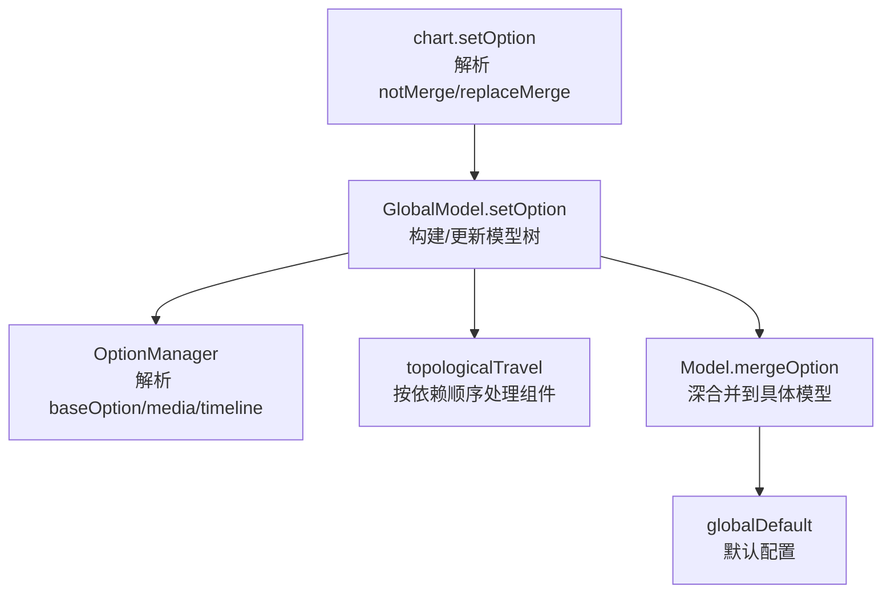
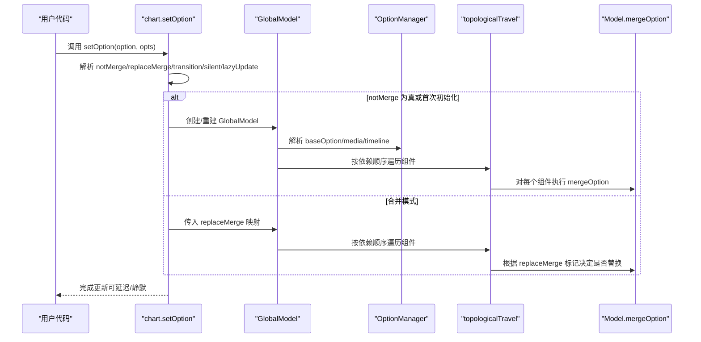
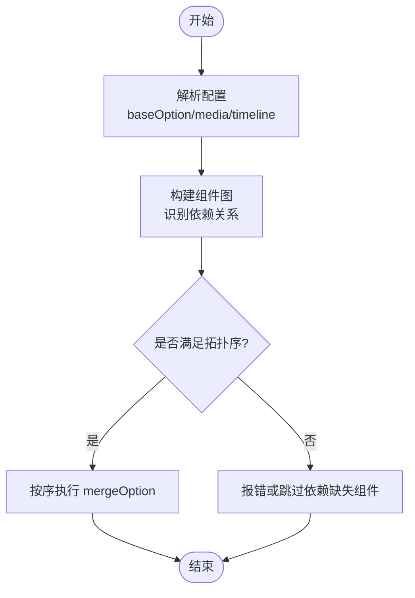

# 配置合并

<cite>
**本文引用的文件**
- [src/core/echarts.ts](file://src/core/echarts.ts)
- [src/model/OptionManager.ts](file://src/model/OptionManager.ts)
- [src/model/Global.ts](file://src/model/Global.ts)
- [src/model/Model.ts](file://src/model/Model.ts)
- [src/model/globalDefault.ts](file://src/model/globalDefault.ts)
- [src/util/component.ts](file://src/util/component.ts)
</cite>

## 目录
1. [简介](#简介)
2. [项目结构](#项目结构)
3. [核心组件](#核心组件)
4. [架构总览](#架构总览)
5. [详细组件分析](#详细组件分析)
6. [依赖关系与拓扑排序](#依赖关系与拓扑排序)
7. [性能考量](#性能考量)
8. [故障排查指南](#故障排查指南)
9. [结论](#结论)
10. [附录：配置优先级与最佳实践](#附录：配置优先级与最佳实践)

## 简介
本文聚焦 ECharts 的配置合并算法与策略，系统解释 notMerge 参数、replaceMerge 选项的作用与使用场景，说明默认值、主题配置与用户配置的优先级顺序，剖析组件间依赖与合并顺序（含拓扑排序），并提供复杂场景下的配置处理逻辑与最佳实践。目标是帮助读者在动态更新、主题切换、媒体查询、时间轴等场景中精准控制配置合并行为。

## 项目结构
ECharts 的配置合并贯穿入口层、模型层与工具层：
- 入口层：Chart.setOption 接收用户配置，解析 notMerge、replaceMerge、lazyUpdate、transition 等参数，并委派给 GlobalModel。
- 模型层：GlobalModel 负责构建/维护全局模型树，执行组件的拓扑遍历与合并；OptionManager 负责原始配置的解析、备份与媒体/时间轴选项管理；Model.mergeOption 提供底层深合并能力。
- 工具层：util/component.ts 提供 topologicalTravel 用于按依赖顺序处理组件；globalDefault.ts 提供全局默认配置。

图表来源
- [src/core/echarts.ts:740-820](file://src/core/echarts.ts#L740-L820)
- [src/model/Global.ts:156-200](file://src/model/Global.ts#L156-L200)
- [src/model/OptionManager.ts:87-169](file://src/model/OptionManager.ts#L87-L169)
- [src/model/Model.ts:84-89](file://src/model/Model.ts#L84-L89)
- [src/model/globalDefault.ts:34-128](file://src/model/globalDefault.ts#L34-L128)

章节来源
- [src/core/echarts.ts:740-820](file://src/core/echarts.ts#L740-L820)
- [src/model/OptionManager.ts:87-169](file://src/model/OptionManager.ts#L87-L169)
- [src/model/Global.ts:156-200](file://src/model/Global.ts#L156-L200)
- [src/model/Model.ts:84-89](file://src/model/Model.ts#L84-L89)
- [src/model/globalDefault.ts:34-128](file://src/model/globalDefault.ts#L34-L128)

## 核心组件
- chart.setOption：统一入口，支持两种调用方式：
  - setOption(option, notMerge, lazyUpdate)
  - setOption(option, { notMerge, replaceMerge, transition, lazyUpdate, silent }, lazyUpdate)
  当 notMerge 为对象时，会解构出 replaceMerge、transition、silent、lazyUpdate 等选项，并将 notMerge 作为布尔标志继续传递。
- GlobalModel：维护全局模型树，负责组件注册、依赖拓扑遍历、以及将新配置合并进现有模型。
- OptionManager：解析 rawOption，提取 baseOption、media、timeline，并在二次 setOption 时进行备份与替换策略处理。
- Model.mergeOption：对单个模型的 option 进行深合并，是组件级合并的基础。
- globalDefault：提供全局默认配置，如颜色、文本样式、动画阈值等。

章节来源
- [src/core/echarts.ts:740-820](file://src/core/echarts.ts#L740-L820)
- [src/model/Global.ts:156-200](file://src/model/Global.ts#L156-L200)
- [src/model/OptionManager.ts:87-169](file://src/model/OptionManager.ts#L87-L169)
- [src/model/Model.ts:84-89](file://src/model/Model.ts#L84-L89)
- [src/model/globalDefault.ts:34-128](file://src/model/globalDefault.ts#L34-L128)

## 架构总览
下图展示从用户调用 setOption 到最终模型合并的关键流程，包括 notMerge 分支、replaceMerge 传递、以及拓扑遍历驱动的组件合并。

图表来源
- [src/core/echarts.ts:740-820](file://src/core/echarts.ts#L740-L820)
- [src/model/OptionManager.ts:87-169](file://src/model/OptionManager.ts#L87-L169)
- [src/model/Global.ts:357-404](file://src/model/Global.ts#L357-L404)
- [src/model/Model.ts:84-89](file://src/model/Model.ts#L84-L89)

## 详细组件分析

### notMerge 参数与完全替换模式
- 作用：当 notMerge 为 true 或首次初始化时，ECharts 会重建 GlobalModel 并重新解析配置，相当于“完全替换”当前实例的配置状态。
- 适用场景：
  - 需要彻底重置图表配置，避免历史交互导致的残留状态影响。
  - 切换完全不同的主题或布局结构时，确保旧配置不干扰新配置。
  - 批量替换多个组件且希望以新配置为准，避免增量合并带来的歧义。
- 行为要点：
  - 在 notMerge 模式下，不会尝试保留上一次 setOption 产生的中间态，直接基于新配置重建模型树。
  - 若同时传入 replaceMerge，notMerge 优先，因为此时已重建模型，replaceMerge 不再参与。

章节来源
- [src/core/echarts.ts:740-820](file://src/core/echarts.ts#L740-L820)

### replaceMerge 选项与精确控制
- 作用：在合并模式下，通过 replaceMerge 指定一个或多个主类型（mainType），对这些主类型的组件采用“替换合并”而非“增量合并”。
- 使用方式：
  - 可在 setOption 的 opts.replaceMerge 中传入字符串或数组，例如 ["series", "dataZoom"]。
  - 被标记的主类型在该次更新中将以“覆盖”的方式合并，而不是逐项属性叠加。
- 典型场景：
  - 更新 series 列表时，希望用新的系列集合完全替代旧的系列集合，而不是按索引/名称逐项合并。
  - 更新 dataZoom 时，希望清空旧的缩放范围并应用新的配置。
  - 在 timeline 切换时，某些组件需要随时间线整体替换。
- 注意事项：
  - replaceMerge 仅影响合并阶段的策略，不影响 notMerge 的完全替换路径。
  - 对于未被标记的主类型，仍遵循默认的增量合并规则（同名/同 id/name 匹配）。

章节来源
- [src/core/echarts.ts:740-820](file://src/core/echarts.ts#L740-L820)
- [src/model/Global.ts:66-71](file://src/model/Global.ts#L66-L71)
- [src/component/timeline/timelineAction.ts:65](file://src/component/timeline/timelineAction.ts#L65)

### 配置项优先级与覆盖规则
- 优先级顺序（从高到低）：
  1) 用户配置（setOption 传入的 option）
  2) 主题配置（通过 setTheme 或内置主题注入）
  3) 全局默认配置（globalDefault）
- 覆盖规则：
  - 主题配置会覆盖默认配置中的对应字段。
  - 用户配置会覆盖主题与默认配置。
  - 在组件内部，父级模型的值可作为子级的回退值（getShallow 支持向上查找）。
- 示例路径参考：
  - 默认配置定义位置：[src/model/globalDefault.ts:34-128](file://src/model/globalDefault.ts#L34-L128)
  - 主题设置入口：[src/core/echarts.ts:827-875](file://src/core/echarts.ts#L827-L875)

章节来源
- [src/model/globalDefault.ts:34-128](file://src/model/globalDefault.ts#L34-L128)
- [src/core/echarts.ts:827-875](file://src/core/echarts.ts#L827-L875)
- [src/model/Model.ts:120-134](file://src/model/Model.ts#L120-L134)

### 组件依赖与合并顺序（拓扑排序）
- 拓扑排序的作用：
  - 保证依赖关系正确的组件先合并，后合并依赖它的组件，避免未就绪导致的错误。
  - 例如 xAxis/yAxis 依赖 grid，应在 grid 之后处理；legend/tooltip 等通用组件通常在较晚阶段处理。
- 实现位置：
  - 全局模型在合并过程中调用 topologicalTravel 遍历组件，按依赖顺序执行合并与初始化。
- 关键路径：
  - 组件依赖声明与遍历接口：[src/util/component.ts:81-119](file://src/util/component.ts#L81-L119)
  - 全局模型中使用拓扑遍历：[src/model/Global.ts:357-404](file://src/model/Global.ts#L357-L404)

图表来源
- [src/model/OptionManager.ts:87-169](file://src/model/OptionManager.ts#L87-L169)
- [src/model/Global.ts:357-404](file://src/model/Global.ts#L357-L404)
- [src/util/component.ts:81-119](file://src/util/component.ts#L81-L119)

## 依赖关系与拓扑排序
- 组件依赖声明：
  - 内置组件映射表定义了坐标系统与图表的关系，如 xAxis/yAxis 依赖 GridComponent，angleAxis/radiusAxis 依赖 PolarComponent。
  - 这些映射有助于在拓扑排序时确定先后顺序。
- 拓扑遍历：
  - topologicalTravel 接受组件构造器与回调，按依赖顺序依次调用，确保依赖先于消费者被处理。
  - 在 GlobalModel 中，该遍历用于合并与初始化各组件模型。
- 实际影响：
  - 若某组件依赖缺失，可能触发警告或跳过，需确保必要组件已引入。
  - 自定义扩展组件应正确声明依赖，以保证合并顺序正确。

章节来源
- [src/model/Global.ts:83-112](file://src/model/Global.ts#L83-L112)
- [src/util/component.ts:81-119](file://src/util/component.ts#L81-L119)

## 性能考量
- 深合并开销：
  - Model.mergeOption 使用深合并，频繁调用会带来一定性能成本。建议在大数据量或高频更新场景下减少不必要的 setOption 调用。
- 完全替换 vs 增量合并：
  - notMerge 会重建模型树，适合大范围变更；replaceMerge 仅针对特定主类型替换，适合局部更新。
- 媒体与时间轴：
  - OptionManager 会对 media/timeline 选项进行解析与克隆，注意避免重复引用导致意外修改。
- 懒更新：
  - 通过 lazyUpdate 可将更新延后到下一帧，结合 zrender 唤醒机制提升渲染效率。

[本节为通用指导，无需具体文件引用]

## 故障排查指南
- 常见问题：
  - 组件未引入：当使用了未注册的组件，会在检查阶段输出错误日志，提示引入对应组件。
  - 非法媒体配置：media 格式不正确时会抛出错误，需确保 media 为数组且每项包含 query 与 option。
  - 循环依赖或缺失依赖：拓扑遍历无法构建合法顺序时，可能导致部分组件未合并。
- 定位建议：
  - 检查 setOption 的参数是否正确，特别是 notMerge 与 replaceMerge 的使用。
  - 确认所有依赖组件已引入，尤其是坐标系统与图表类型。
  - 查看媒体查询配置是否符合规范。

章节来源
- [src/model/Global.ts:142-154](file://src/model/Global.ts#L142-L154)
- [src/model/OptionManager.ts:330-359](file://src/model/OptionManager.ts#L330-L359)

## 结论
- notMerge 用于完全替换模式，适合大范围重构或彻底重置配置。
- replaceMerge 用于精确控制特定主类型的合并策略，避免增量合并带来的副作用。
- 配置优先级为用户配置 > 主题配置 > 默认配置，确保上层覆盖下层。
- 拓扑排序保障组件依赖的正确性，是合并顺序的核心机制。
- 合理使用懒更新与媒体/时间轴特性，可在复杂场景中保持高性能与可维护性。

[本节为总结，无需具体文件引用]

## 附录：配置优先级与最佳实践
- 优先级顺序
  - 用户配置（最高）
  - 主题配置
  - 默认配置（最低）
- 最佳实践
  - 小范围更新：使用默认合并模式 + replaceMerge 精确替换受影响的主类型。
  - 大范围重构：使用 notMerge 完全替换，避免历史状态污染。
  - 主题切换：通过 setTheme 注入主题，再配合用户配置微调。
  - 媒体适配：合理划分 media 列表，后者具有更高优先级。
  - 时间轴：利用 timeline 的 replaceMerge 控制时间步进的组件替换策略。
  - 性能优化：减少高频 setOption 调用，必要时使用 lazyUpdate。

[本节为通用指导，无需具体文件引用]