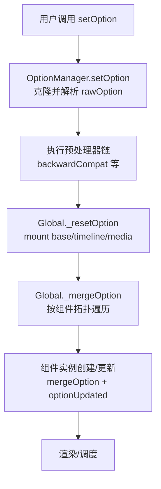
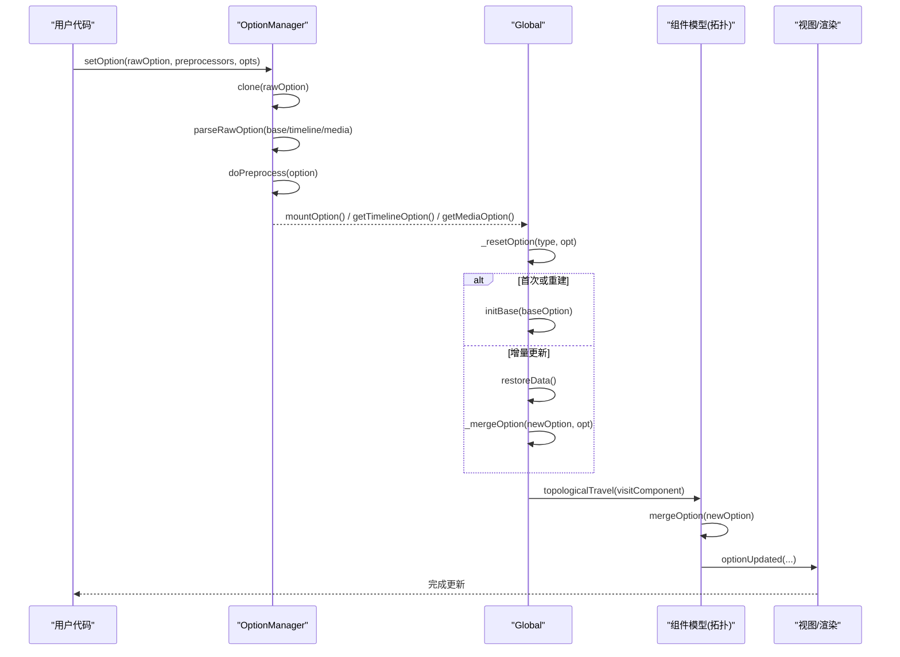
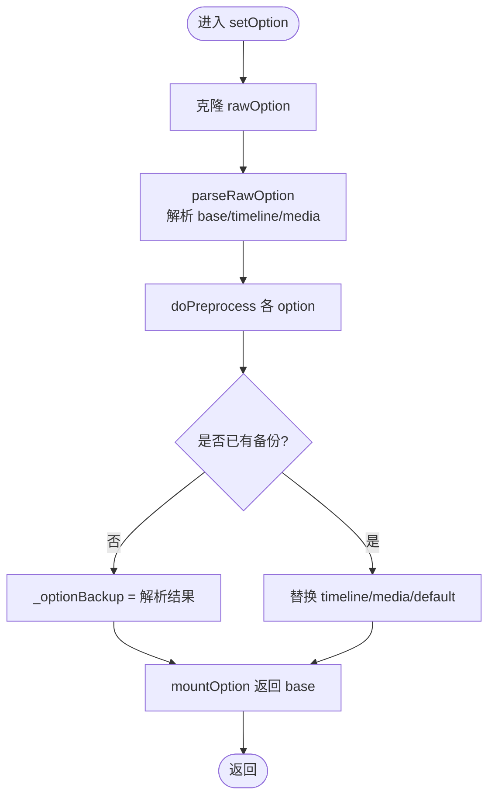
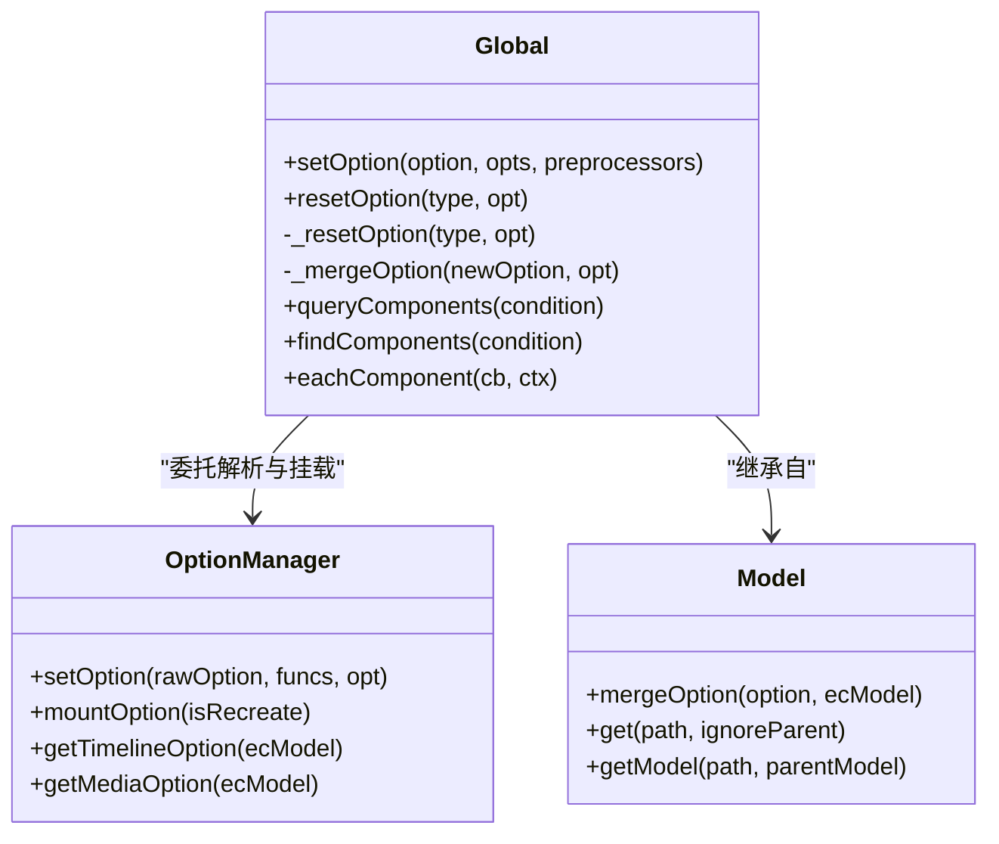
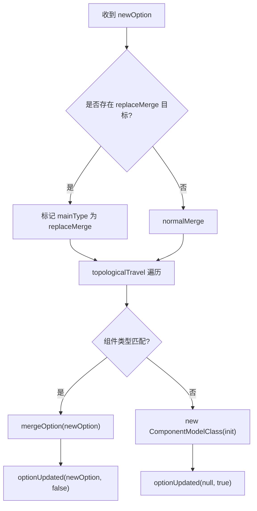
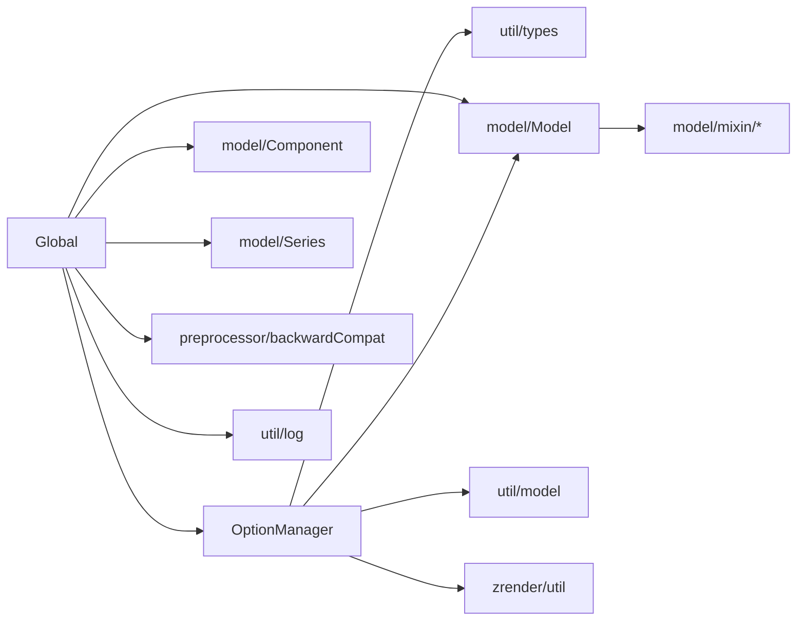

# 配置系统

<cite>
**本文引用的文件**
- [src/model/OptionManager.ts](file://src/model/OptionManager.ts)
- [src/model/Global.ts](file://src/model/Global.ts)
- [src/model/Model.ts](file://src/model/Model.ts)
- [src/preprocessor/backwardCompat.ts](file://src/preprocessor/backwardCompat.ts)
- [src/model/globalDefault.ts](file://src/model/globalDefault.ts)
- [src/util/model.ts](file://src/util/model.ts)
- [src/util/types.ts](file://src/util/types.ts)
</cite>

## 目录
1. [简介](#简介)
2. [项目结构](#项目结构)
3. [核心组件](#核心组件)
4. [架构总览](#架构总览)
5. [详细组件分析](#详细组件分析)
6. [依赖关系分析](#依赖关系分析)
7. [性能考量](#性能考量)
8. [故障排查指南](#故障排查指南)
9. [结论](#结论)
10. [附录：配置示例与最佳实践](#附录：配置示例与最佳实践)

## 简介
本文件系统性阐述 ECharts 的配置系统架构与工作原理，覆盖 option 配置的层次结构（全局、组件、系列）、继承与合并机制（含 notMerge、replaceMerge）、默认值与验证、预处理器/后处理器链路、向后兼容与配置转换，并提供常见配置模式与最佳实践。

## 项目结构
ECharts 配置系统围绕“原始选项解析 → 预处理 → 合并到全局模型 → 组件实例化/更新”的流水线组织，关键模块如下：
- OptionManager：负责解析 rawOption（支持 baseOption、timeline、media），执行预处理器，维护备份与媒体/时间线切换。
- Global：全局模型，负责将解析后的选项按组件拓扑顺序合并、创建或更新组件实例，处理 replaceMerge 等策略。
- Model：通用模型基类，提供 get/getModel/mergeOption 等能力，支撑层级读取与浅合并。
- backwardCompat：全局向后兼容预处理器，统一旧版字段到新字段。
- globalDefault：全局默认配置（主题色、动画、文本样式等）。
- util/model：工具函数，包含 normalizeToArray、mappingToExists、defaultEmphasis 等，支撑组件映射与默认态同步。
- util/types：类型定义，约束 ECUnitOption、ComponentMainType 等。

**图表来源**
- [src/model/OptionManager.ts:87-169](file://src/model/OptionManager.ts#L87-L169)
- [src/model/Global.ts:216-306](file://src/model/Global.ts#L216-L306)
- [src/preprocessor/backwardCompat.ts:144-273](file://src/preprocessor/backwardCompat.ts#L144-L273)

**章节来源**
- [src/model/OptionManager.ts:87-169](file://src/model/OptionManager.ts#L87-L169)
- [src/model/Global.ts:216-306](file://src/model/Global.ts#L216-L306)
- [src/preprocessor/backwardCompat.ts:144-273](file://src/preprocessor/backwardCompat.ts#L144-L273)

## 核心组件
- OptionManager
  - 职责：接收 rawOption，执行预处理，管理 baseOption/timeline/media 的解析与挂载；维护 _optionBackup 以支持多次 setOption 的合并与恢复。
  - 关键点：clone(rawOption)、parseRawOption、doPreprocess、getMediaOption、getTimelineOption。
- Global
  - 职责：维护全局 ecModel.option，按组件拓扑顺序合并新选项，创建/更新组件实例；处理 replaceMerge 策略；提供 query/find/each 等查询接口。
  - 关键点：setOption、_resetOption、_mergeOption、topologicalTravel、mappingToExists。
- Model
  - 职责：提供 get/getModel/mergeOption/isAnimationEnabled 等基础能力；支持 parentModel 链式读取。
  - 关键点：mergeOption 使用深度合并；get 支持路径解析与父级回退。
- backwardCompat
  - 职责：全局向后兼容预处理器，将旧字段映射为新字段（如 dataRange→visualMap、mapType→map、clockWise→clockwise 等），并对布局属性进行归一化。
- globalDefault
  - 职责：提供全局默认配置（颜色、文本样式、动画阈值、渐进渲染阈值等）。
- util/model
  - 职责：normalizeToArray、mappingToExists、defaultEmphasis 等工具，支撑组件映射与默认态同步。

**章节来源**
- [src/model/OptionManager.ts:87-169](file://src/model/OptionManager.ts#L87-L169)
- [src/model/Global.ts:312-512](file://src/model/Global.ts#L312-L512)
- [src/model/Model.ts:87-168](file://src/model/Model.ts#L87-L168)
- [src/preprocessor/backwardCompat.ts:144-273](file://src/preprocessor/backwardCompat.ts#L144-L273)
- [src/model/globalDefault.ts:34-128](file://src/model/globalDefault.ts#L34-L128)
- [src/util/model.ts:87-128](file://src/util/model.ts#L87-L128)

## 架构总览
下图展示从用户调用 setOption 到组件实例化的完整流程，包括预处理、合并策略、媒体/时间线注入与组件拓扑更新。

**图表来源**
- [src/model/OptionManager.ts:87-169](file://src/model/OptionManager.ts#L87-L169)
- [src/model/Global.ts:216-306](file://src/model/Global.ts#L216-L306)
- [src/model/Global.ts:312-512](file://src/model/Global.ts#L312-L512)

## 详细组件分析

### OptionManager：原始选项解析与生命周期管理
- 入口：setOption(rawOption, optionPreprocessorFuncs, opt)
  - 对 series.data/dataset.source 中的 TypedArray 标记为 primitive，避免后续修改污染。
  - clone(rawOption) 防止重复 setOption 时共享引用导致副作用。
  - parseRawOption 解析 baseOption、timeline、media，并在每个 option 上执行 doPreprocess。
  - 第二次及以后 setOption 时，仅替换 timeline/media/default，baseOption 通过内部备份机制参与合并。
- 挂载：mountOption(isRecreate)
  - 首次或重建时使用备份的 baseOption；否则使用本次解析出的 newBaseOption。
- 媒体与时间线：
  - getMediaOption：根据当前宽高匹配 media.query，返回匹配的 option 列表（后者优先级更高）。
  - getTimelineOption：根据 timeline 当前索引返回对应 option。

**图表来源**
- [src/model/OptionManager.ts:87-169](file://src/model/OptionManager.ts#L87-L169)
- [src/model/OptionManager.ts:294-378](file://src/model/OptionManager.ts#L294-L378)

**章节来源**
- [src/model/OptionManager.ts:87-169](file://src/model/OptionManager.ts#L87-L169)
- [src/model/OptionManager.ts:294-378](file://src/model/OptionManager.ts#L294-L378)

### Global：全局模型与组件合并
- setOption：调用 OptionManager.setOption 后，执行 _resetOption。
- _resetOption：
  - 首次或 recreate：initBase(baseOption)。
  - 非首次：restoreData() 并 _mergeOption(baseOption, opt)。
  - 若存在 timeline/media，依次 _mergeOption 注入。
- _mergeOption：
  - 先合并非组件属性（如 color、animation 等）到 option。
  - 收集需要处理的 mainType，按组件拓扑顺序 visitComponent。
  - 对每个 mainType：
    - 计算合并模式：'replaceAll' | 'replaceMerge' | 'normalMerge'。
    - 使用 mappingToExists 建立新旧组件映射。
    - 设置 keyInfo（name/id/mainType/subType）。
    - 对已存在且同类型的组件：mergeOption(newOption) + optionUpdated(newOption, false)。
    - 对新组件：构造 ComponentModelClass，init(newOption) + optionUpdated(null, true)。
    - 记录 optionsByMainType 与 componentsMap。

**图表来源**
- [src/model/Global.ts:216-306](file://src/model/Global.ts#L216-L306)
- [src/model/Global.ts:312-512](file://src/model/Global.ts#L312-L512)
- [src/model/Model.ts:87-168](file://src/model/Model.ts#L87-L168)

**章节来源**
- [src/model/Global.ts:216-306](file://src/model/Global.ts#L216-L306)
- [src/model/Global.ts:312-512](file://src/model/Global.ts#L312-L512)

### Model：层级读取与合并
- mergeOption：对 this.option 与传入 option 进行深度合并（true 表示深合并）。
- get/getModel：支持路径字符串或数组，可忽略父级；getModel 会基于 parentModel 构建新的子模型。
- isAnimationEnabled：优先取自身 animation，否则向父级查找。

**章节来源**
- [src/model/Model.ts:87-168](file://src/model/Model.ts#L87-L168)

### 预处理器与向后兼容
- backwardCompat.globalBackwardCompat：
  - 标准化 series 数组。
  - 针对 line/pie/gauge/bar/sunburst/graph/map 等序列类型进行字段迁移（如 clipOverflow→clip、clockWise→clockwise、hoverOffset→emphasis.scaleSize、mapType→map 等）。
  - 将 dataRange 迁移至 visualMap。
  - 对 grid/geo/legend/toolbox/title/visualMap/dataZoom/timeline 等组件统一布局属性（x→left、y→top 等）。
- 在 OptionManager.parseRawOption 中，对 baseOption、timelineOptions、mediaList 的每个 option 执行 doPreprocess，即应用所有注册的预处理器。

**章节来源**
- [src/preprocessor/backwardCompat.ts:144-273](file://src/preprocessor/backwardCompat.ts#L144-L273)
- [src/model/OptionManager.ts:362-370](file://src/model/OptionManager.ts#L362-L370)

### 默认值与验证
- 默认值：globalDefault 提供全局默认（颜色、文本样式、动画、渐进渲染阈值等），在组件初始化/合并过程中被应用（由具体组件与 Model 体系消费）。
- 验证：
  - 开发模式下检查缺失组件/系列导入，输出错误日志提示如何引入。
  - 对非法 media 配置进行告警。
  - 对禁止直接写入的内部 option 键进行断言保护。

**章节来源**
- [src/model/globalDefault.ts:34-128](file://src/model/globalDefault.ts#L34-L128)
- [src/model/Global.ts:142-154](file://src/model/Global.ts#L142-L154)
- [src/model/Global.ts:222-228](file://src/model/Global.ts#L222-L228)
- [src/model/OptionManager.ts:332-359](file://src/model/OptionManager.ts#L332-L359)

### 配置合并机制与 notMerge/replaceMerge
- 合并模式判定：
  - replaceMerge：当 opts.replaceMerge 指定某 mainType 时，该主类型的组件将以“替换合并”方式处理，保持原有序列但允许出现“空洞”，用于精准移除或替换组件。
  - normalMerge：常规深度合并，按 id/name/index 映射新旧组件。
  - replaceAll：首次初始化时采用全量替换。
- 映射与更新：
  - 使用 mappingToExists 建立新旧组件映射，随后按类型决定 mergeOption 或新建组件。
  - 对于 tooltip 等单例组件有额外限制与警告。
- notMerge：
  - 在 OptionManager 注释中说明 timeline 场景不支持 notMerge，以避免复杂性与性能问题；普通 setOption 的 notMerge 行为由上层调用方控制（此处未在本片段实现）。

**图表来源**
- [src/model/Global.ts:312-512](file://src/model/Global.ts#L312-L512)

**章节来源**
- [src/model/Global.ts:312-512](file://src/model/Global.ts#L312-L512)
- [src/model/OptionManager.ts:72-82](file://src/model/OptionManager.ts#L72-L82)

### 扩展自定义配置项
- 通过注册预处理器（OptionPreprocessor）在 OptionManager.doPreprocess 阶段对 option 进行转换或校验。
- 通过扩展组件模型（ComponentModel 子类）在 init/mergeOption/optionUpdated 中消费自定义字段。
- 利用 util/model.defaultEmphasis 保证 normal/emphasis 间相关属性的默认同步。

**章节来源**
- [src/model/OptionManager.ts:362-370](file://src/model/OptionManager.ts#L362-L370)
- [src/util/model.ts:107-128](file://src/util/model.ts#L107-L128)

## 依赖关系分析
- OptionManager 依赖：
  - util/types（OptionPreprocessor、ECUnitOption 等）
  - model/Global（InnerSetOptionOpts）
  - util/model（normalizeToArray）
  - zrender 工具（clone、each、isTypedArray 等）
- Global 依赖：
  - zrender 工具（merge、extend、createHashMap 等）
  - model/Model、model/Component、model/Series
  - preprocessor/backwardCompat（作为预处理器之一）
  - util/model（mappingToExists、normalizeToArray）
  - util/log（error/warn）
- Model 依赖：
  - zrender 工具（mixin、clone、merge）
  - model/mixin（LineStyle、ItemStyle、TextStyle、AreaStyle）
  - util/types（AnimationOptionMixin）

**图表来源**
- [src/model/OptionManager.ts:20-34](file://src/model/OptionManager.ts#L20-L34)
- [src/model/Global.ts:36-64](file://src/model/Global.ts#L36-L64)
- [src/model/Model.ts:20-35](file://src/model/Model.ts#L20-L35)

**章节来源**
- [src/model/OptionManager.ts:20-34](file://src/model/OptionManager.ts#L20-L34)
- [src/model/Global.ts:36-64](file://src/model/Global.ts#L36-L64)
- [src/model/Model.ts:20-35](file://src/model/Model.ts#L20-L35)

## 性能考量
- 避免重复数据共享：setOption 时对 rawOption 进行 clone，防止多次 setOption 共享引用导致的副作用。
- 延迟合并：仅在必要时合并 timeline/media，减少不必要的计算。
- 拓扑遍历：按组件依赖顺序遍历，避免循环与重复初始化。
- 渐进渲染与阈值：globalDefault 提供 progressiveThreshold/hoverLayerThreshold 等参数，平衡交互与渲染性能。
- 大数据优化：util/model 中对 TypedArray 的处理与 defaultEmphasis 的性能敏感分支。

[本节为通用指导，不直接分析具体文件]

## 故障排查指南
- 组件/系列未导入：
  - 现象：控制台报错提示组件或系列未导入，需按需引入。
  - 定位：Global.checkMissingComponents 与 _mergeOption 中的缺失检测。
- 非法 media 配置：
  - 现象：开发环境报错提示 media 格式不正确。
  - 定位：OptionManager.parseRawOption 中对 media 结构的校验。
- 内部 option 误写：
  - 现象：断言失败，提示勿直接写入内部键。
  - 定位：Global.setOption 中的断言检查。
- 字段弃用/迁移：
  - 现象：控制台输出弃用日志，建议改用新字段。
  - 定位：backwardCompat 中的 deprecateLog/deprecateReplaceLog。

**章节来源**
- [src/model/Global.ts:142-154](file://src/model/Global.ts#L142-L154)
- [src/model/Global.ts:222-228](file://src/model/Global.ts#L222-L228)
- [src/model/OptionManager.ts:332-359](file://src/model/OptionManager.ts#L332-L359)
- [src/preprocessor/backwardCompat.ts:80-133](file://src/preprocessor/backwardCompat.ts#L80-L133)

## 结论
ECharts 的配置系统以 OptionManager 为入口，结合 Global 的全局合并与组件拓扑更新，形成稳定可扩展的管线。通过预处理器与向后兼容层，既保证了历史配置的平滑迁移，又为自定义扩展提供了清晰钩子。replaceMerge 与 normalMerge 的组合策略，使得组件增删改具备高可控性。配合默认值与验证机制，整体具备良好的健壮性与可维护性。

## 附录：配置示例与最佳实践
- 使用 baseOption/options/media 组合：
  - 将公共配置放入 baseOption，动态变化部分放入 options 或 media，便于复用与响应式适配。
- 合理使用 replaceMerge：
  - 对需要精确替换或移除的组件（如 legend、dataZoom），使用 replaceMerge 提升可控性。
- 利用预处理器做统一转换：
  - 在 doPreprocess 中集中处理字段迁移、校验与规范化，降低业务侧复杂度。
- 关注默认值与主题：
  - 通过 globalDefault 与主题机制统一视觉风格，减少重复配置。
- 注意性能阈值：
  - 合理设置 progressiveThreshold、hoverLayerThreshold 等，平衡交互流畅度与渲染开销。

[本节为概念性内容，不直接分析具体文件]