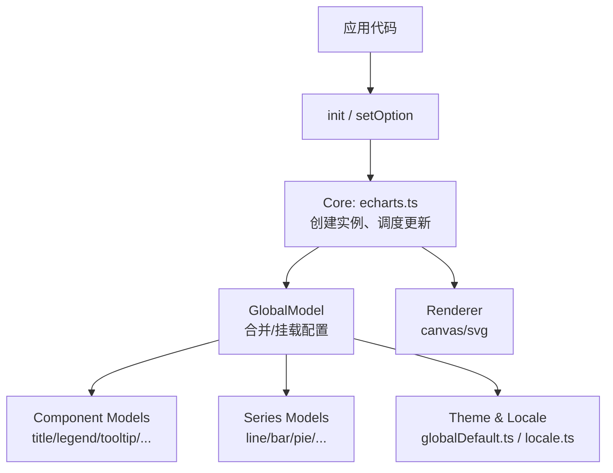
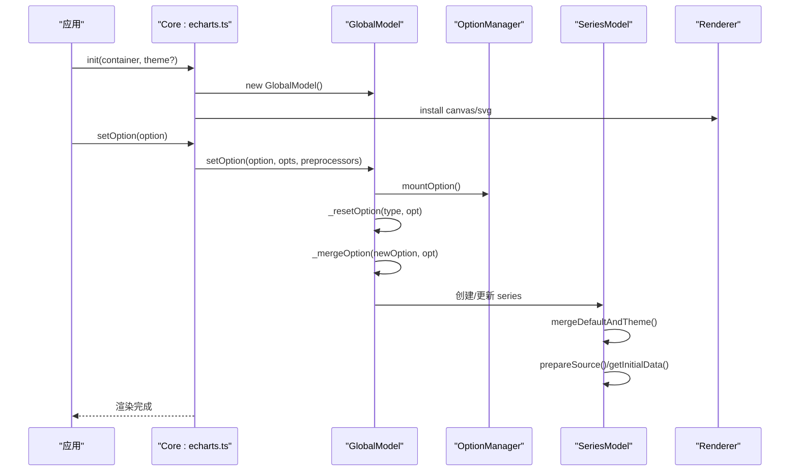
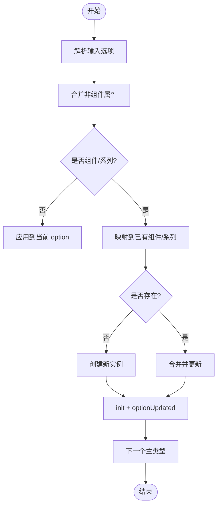
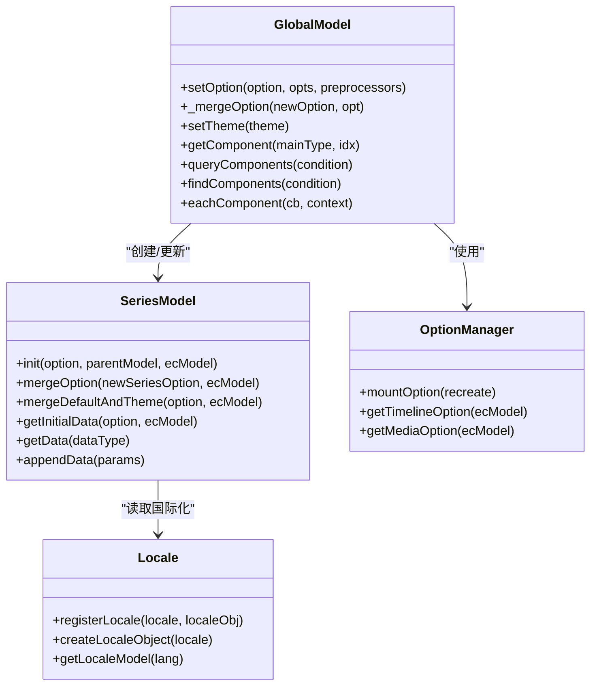

# 配置结构

<cite>
**本文引用的文件**
- [src/echarts.ts](file://src/echarts.ts)
- [src/core/echarts.ts](file://src/core/echarts.ts)
- [src/model/Global.ts](file://src/model/Global.ts)
- [src/model/Series.ts](file://src/model/Series.ts)
- [src/model/globalDefault.ts](file://src/model/globalDefault.ts)
- [src/util/types.ts](file://src/util/types.ts)
- [src/export/option.ts](file://src/export/option.ts)
- [src/core/locale.ts](file://src/core/locale.ts)
- [src/renderer/installCanvasRenderer.ts](file://src/renderer/installCanvasRenderer.ts)
- [src/renderer/installSVGRenderer.ts](file://src/renderer/installSVGRenderer.ts)
</cite>

## 目录
1. [简介](#简介)
2. [项目结构](#项目结构)
3. [核心组件](#核心组件)
4. [架构总览](#架构总览)
5. [详细组件分析](#详细组件分析)
6. [依赖关系分析](#依赖关系分析)
7. [性能考量](#性能考量)
8. [故障排查指南](#故障排查指南)
9. [结论](#结论)
10. [附录：配置示例与最佳实践](#附录配置示例与最佳实践)

## 简介
本章节聚焦 ECharts 配置对象的整体结构与组织方式，系统说明全局配置项（主题、国际化、渲染器选择等）、组件配置（图例、提示框、工具栏等）以及系列配置的组织方式与命名规范。通过源码级分析，帮助开发者准确理解并正确使用各类配置选项，覆盖基础、高级与复杂场景的配置模式。

## 项目结构
ECharts 的配置体系围绕“单元配置 ECUnitOption”和“基本配置 ECBasicOption”构建，并通过 GlobalModel 进行合并、解析与应用；SeriesModel 负责系列级别的默认值、主题与数据初始化；类型定义集中在 types.ts，导出类型在 export/option.ts 中聚合；国际化与主题在 core/locale.ts 与 model/globalDefault.ts 中提供；渲染器安装由 renderer 模块完成。

图表来源
- [src/core/echarts.ts:824-871](file://src/core/echarts.ts#L824-L871)
- [src/model/Global.ts:201-310](file://src/model/Global.ts#L201-L310)
- [src/model/globalDefault.ts:34-128](file://src/model/globalDefault.ts#L34-L128)
- [src/core/locale.ts:34-81](file://src/core/locale.ts#L34-L81)

章节来源
- [src/echarts.ts:20-46](file://src/echarts.ts#L20-L46)
- [src/core/echarts.ts:148-200](file://src/core/echarts.ts#L148-L200)
- [src/model/Global.ts:83-138](file://src/model/Global.ts#L83-L138)
- [src/util/types.ts:793-859](file://src/util/types.ts#L793-L859)

## 核心组件
- 全局配置模型 GlobalModel：负责接收、合并、挂载配置，维护主题与语言模型，管理组件与系列的创建与更新。
- 系列模型 SeriesModel：负责系列默认值与主题合并、数据源准备、可视化样式映射、动画与交互状态。
- 类型系统 types.ts：定义 ECUnitOption、ECBasicOption、ComponentOption、系列通用选项、标签/线条/区域样式等。
- 导出类型 export/option.ts：将各组件与系列的选项类型聚合为 EChartsOption，便于外部使用。
- 默认全局配置 globalDefault.ts：提供默认颜色、文本样式、动画、渐进渲染阈值等。
- 国际化 locale.ts：注册语言包、创建语言对象、获取系统语言。
- 渲染器安装：默认启用 Canvas 渲染器与 dataset 组件。

章节来源
- [src/model/Global.ts:156-310](file://src/model/Global.ts#L156-L310)
- [src/model/Series.ts:149-328](file://src/model/Series.ts#L149-L328)
- [src/util/types.ts:793-859](file://src/util/types.ts#L793-L859)
- [src/export/option.ts:259-282](file://src/export/option.ts#L259-L282)
- [src/model/globalDefault.ts:34-128](file://src/model/globalDefault.ts#L34-L128)
- [src/core/locale.ts:34-81](file://src/core/locale.ts#L34-L81)
- [src/echarts.ts:20-46](file://src/echarts.ts#L20-L46)

## 架构总览
ECharts 的选项处理流程如下：
- 入口 init/setOption 调用 Core 层，创建或复用实例，进入更新生命周期。
- GlobalModel.setOption 将传入的 ECBasicOption 交由 OptionManager 挂载，再执行 _resetOption/_mergeOption 对组件与系列进行拓扑遍历与合并。
- 对于非组件属性（如 color、animation），直接合并到 option；对于组件/系列，按主类型与子类型匹配对应 Model 类，创建或更新实例。
- SeriesModel 在 init/mergeOption 中合并主题与默认值，准备数据源，设置初始数据与自动名称等。
- 主题与国际化在 GlobalModel 中以独立 Model 持有，setTheme 会触发重建与更新。
- 渲染器在安装阶段注入，默认启用 Canvas 与 dataset。

图表来源
- [src/core/echarts.ts:824-871](file://src/core/echarts.ts#L824-L871)
- [src/model/Global.ts:201-310](file://src/model/Global.ts#L201-L310)
- [src/model/Series.ts:225-328](file://src/model/Series.ts#L225-L328)
- [src/echarts.ts:20-46](file://src/echarts.ts#L20-L46)

## 详细组件分析

### 全局配置项：主题、国际化、渲染器
- 主题设置
  - 通过 Core 的 setTheme 方法设置主题名或主题对象，内部调用 ecModel.setTheme 并触发更新。
  - GlobalModel 持有 _theme Model，支持动态切换主题并重新应用。
- 国际化配置
  - 通过 core/locale.ts 注册语言包，createLocaleObject 根据语言字符串或对象生成语言配置，默认英文与中文已注册。
  - 系统语言检测基于 document.documentElement.lang 或 navigator.language。
- 渲染器选择
  - 默认安装 Canvas 渲染器与 dataset 组件，可通过扩展机制安装 SVG 渲染器。
  - 渲染器类型 RendererType 定义为 'canvas' | 'svg'。

章节来源
- [src/core/echarts.ts:824-871](file://src/core/echarts.ts#L824-L871)
- [src/model/Global.ts:548-559](file://src/model/Global.ts#L548-L559)
- [src/core/locale.ts:34-81](file://src/core/locale.ts#L34-L81)
- [src/echarts.ts:20-46](file://src/echarts.ts#L20-L46)
- [src/util/types.ts:65-66](file://src/util/types.ts#L65-L66)

### 组件配置：图例、提示框、工具栏等
- 组件主类型映射
  - GlobalModel 内置组件主类型到组件类的映射，包括 grid、polar、geo、singleAxis、parallel、calendar、matrix、graphic、toolbox、tooltip、axisPointer、brush、title、timeline、markPoint、markLine、markArea、legend、dataZoom、visualMap 等。
  - xAxis/yAxis 作为 GridComponent 的子类型存在；angleAxis/radiusAxis 属于 PolarComponent。
- 组件合并与创建
  - 在 _mergeOption 中，按主类型拓扑遍历，将新选项与已有组件进行映射与合并；若不存在则创建新组件实例，并调用 init 与 optionUpdated。
  - tooltip 当前仅允许一个实例，重复声明会发出警告。
- 查询与遍历
  - 提供 queryComponents/findComponents/eachComponent 等方法，支持按主类型、索引、id、name 及子类型过滤。

章节来源
- [src/model/Global.ts:83-138](file://src/model/Global.ts#L83-L138)
- [src/model/Global.ts:312-512](file://src/model/Global.ts#L312-L512)
- [src/model/Global.ts:572-748](file://src/model/Global.ts#L572-L748)

### 系列配置：组织方式与特有配置
- 系列基类 SeriesModel
  - 提供 type、defaultOption、seriesIndex、coordinateSystem、pipelineContext 等属性。
  - 初始化时合并主题与默认值，准备数据源，设置初始数据，自动生成系列名称。
  - 支持 appendData、getData/getRawData、encode、colorBy、progressive 等能力。
- 系列特有配置
  - 不同图表类型（line、bar、pie、scatter、radar、map、tree、treemap、graph、chord、gauge、funnel、parallel、sankey、boxplot、candlestick、effectScatter、lines、heatmap、pictorialBar、themeRiver、sunburst、custom）在 BUILTIN_CHARTS_MAP 中注册，各自实现其特有配置项。
- 系列样式与视觉
  - 通过 makeStyleMapper、LegendVisualProvider、PaletteMixin 等统一样式映射与视觉编码。
  - 支持 symbol、itemStyle、lineStyle、areaStyle、label、emphasis/blur/select 状态样式。

章节来源
- [src/model/Series.ts:149-328](file://src/model/Series.ts#L149-L328)
- [src/model/Global.ts:114-138](file://src/model/Global.ts#L114-L138)
- [src/util/types.ts:1227-1500](file://src/util/types.ts#L1227-L1500)

### 配置项命名规范与类型定义
- 配置对象类型
  - ECUnitOption：包含组件与属性的单元配置，支持 baseOption/options/media 等保留字段。
  - ECBasicOption：setOption 输入的基本配置，可包含 baseOption、options、media。
  - ComponentOption：任意组件配置，支持数组形式多实例。
  - EChartsOption：导出类型，聚合 dataset、aria、title、grid、radar、polar、geo、axis、toolbox、tooltip、axisPointer、brush 等。
- 通用样式与布局
  - ItemStyleOption、LineStyleOption、AreaStyleOption、LabelOption、TextCommonOption、SymbolOptionMixin、RoamOptionMixin、PreserveAspectMixin 等。
- 数据与编码
  - OptionSourceData、OptionEncode、OptionEncodeValue、CallbackDataParams 等用于数据源与维度编码。
- 媒体查询与动画
  - MediaQuery、MediaUnit、AnimationOption、AnimationOptionMixin 等。

章节来源
- [src/util/types.ts:793-859](file://src/util/types.ts#L793-L859)
- [src/export/option.ts:259-282](file://src/export/option.ts#L259-L282)
- [src/util/types.ts:1024-1155](file://src/util/types.ts#L1024-L1155)
- [src/util/types.ts:1227-1500](file://src/util/types.ts#L1227-L1500)

### 配置合并与更新流程
- 合并策略
  - 非组件属性直接 clone/merge；组件/系列按主类型拓扑顺序处理，支持 replaceMerge/normalMerge 模式。
  - 支持 timeline 与 media 配置的叠加与优先级控制。
- 更新生命周期
  - setOption -> OptionManager.mountOption -> GlobalModel._resetOption -> _mergeOption -> 组件/系列实例化与更新 -> 视图渲染。

图表来源
- [src/model/Global.ts:312-512](file://src/model/Global.ts#L312-L512)
- [src/model/Global.ts:251-306](file://src/model/Global.ts#L251-L306)

## 依赖关系分析
- GlobalModel 依赖：
  - OptionManager：管理 baseOption/options/media/timeline 的挂载与合并。
  - ComponentModel/SeriesModel：组件与系列的基类与具体实现。
  - Scheduler：调度任务与更新周期。
  - Model/Util：合并、克隆、日志等工具。
- SeriesModel 依赖：
  - SourceManager/Source：数据源管理与转换。
  - LegendVisualProvider/PaletteMixin：图例与调色板视觉映射。
  - Layout/Visual：布局与视觉编码。
- Core 层依赖：
  - Renderer：Canvas/SVG 渲染器安装。
  - Locale：国际化语言包。
  - Theme：默认主题与暗色模式。

图表来源
- [src/model/Global.ts:156-310](file://src/model/Global.ts#L156-L310)
- [src/model/Series.ts:149-328](file://src/model/Series.ts#L149-L328)
- [src/core/locale.ts:34-81](file://src/core/locale.ts#L34-L81)

章节来源
- [src/model/Global.ts:156-310](file://src/model/Global.ts#L156-L310)
- [src/model/Series.ts:149-328](file://src/model/Series.ts#L149-L328)
- [src/core/locale.ts:34-81](file://src/core/locale.ts#L34-L81)

## 性能考量
- 动画阈值与渐进渲染
  - animationThreshold、progressiveThreshold、progressive 控制大数据量下的动画与渐进渲染行为，避免卡顿。
- 悬停层优化
  - hoverLayerThreshold 控制是否使用单独悬停层以提升交互性能。
- 数据预处理与任务调度
  - SeriesModel 的数据任务与 PipelineContext 确保数据流高效处理，减少重复计算。
- 组件合并与拓扑遍历
  - 通过拓扑顺序与映射机制减少不必要的重建，提升 setOption 的性能。

章节来源
- [src/model/globalDefault.ts:102-128](file://src/model/globalDefault.ts#L102-L128)
- [src/model/Series.ts:548-599](file://src/model/Series.ts#L548-L599)
- [src/model/Global.ts:312-512](file://src/model/Global.ts#L312-L512)

## 故障排查指南
- 组件未导入
  - 当使用未注册的组件或系列时，GlobalModel 会输出错误日志，提示需要 import 并 use 相应组件。
- Tooltip 唯一性
  - 当前仅允许一个 tooltip 组件，重复声明会发出警告。
- 主题设置时机
  - setTheme 不应在主流程中调用，否则可能抛出错误；应在合适时机调用以避免循环更新。
- 国际化语言缺失
  - 若请求的语言未注册，将回退到默认语言（英文）。

章节来源
- [src/model/Global.ts:142-154](file://src/model/Global.ts#L142-L154)
- [src/model/Global.ts:440-452](file://src/model/Global.ts#L440-L452)
- [src/core/echarts.ts:824-871](file://src/core/echarts.ts#L824-L871)
- [src/core/locale.ts:56-68](file://src/core/locale.ts#L56-L68)

## 结论
ECharts 的配置体系以 ECUnitOption/ECBasicOption 为核心，通过 GlobalModel 进行统一的合并与挂载，SeriesModel 负责系列级别的数据与样式处理。类型系统提供了严格的选项定义，便于开发期校验与智能提示。主题、国际化与渲染器的解耦设计使得配置灵活可扩展。掌握这些结构与流程，有助于编写高效、可维护的图表配置。

## 附录：配置示例与最佳实践
- 基础配置
  - 使用 ECBasicOption 设置 title、legend、xAxis、yAxis、series 等基础组件与系列。
  - 通过 textStyle、color、animation 等全局属性统一风格与动效。
- 高级配置
  - 使用 baseOption/options/media 组合实现响应式与时间线切换。
  - 通过 visualMap、dataZoom、tooltip、toolbox 增强交互与可视化映射。
- 复杂场景
  - 结合 dataset、encode、transform 等实现数据驱动与复杂映射。
  - 自定义系列与组件时，遵循类型定义与合并规则，确保兼容性与可维护性。

章节来源
- [src/util/types.ts:793-859](file://src/util/types.ts#L793-L859)
- [src/export/option.ts:259-282](file://src/export/option.ts#L259-L282)
- [src/model/Global.ts:251-306](file://src/model/Global.ts#L251-L306)