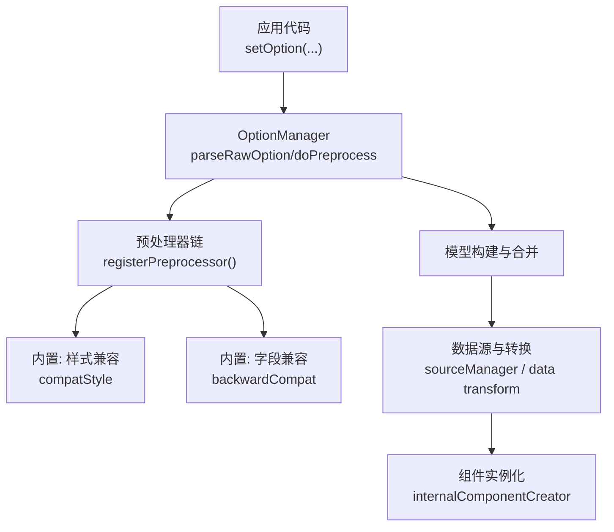
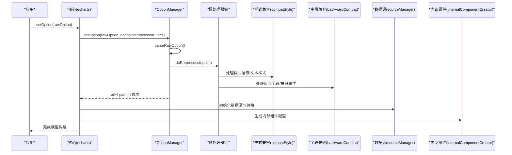
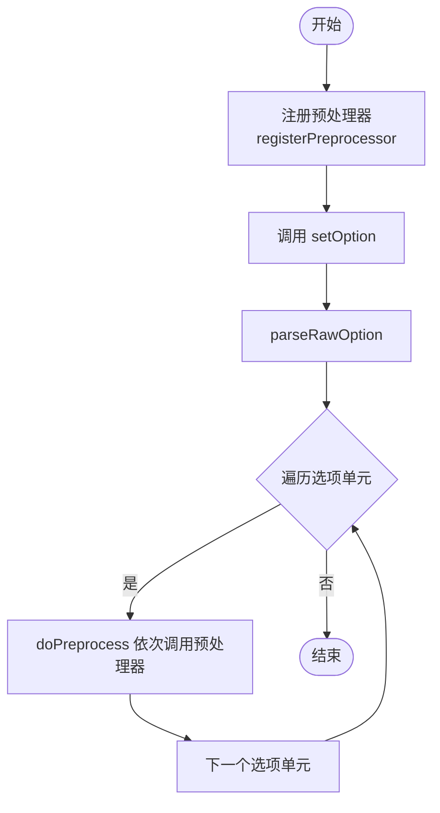
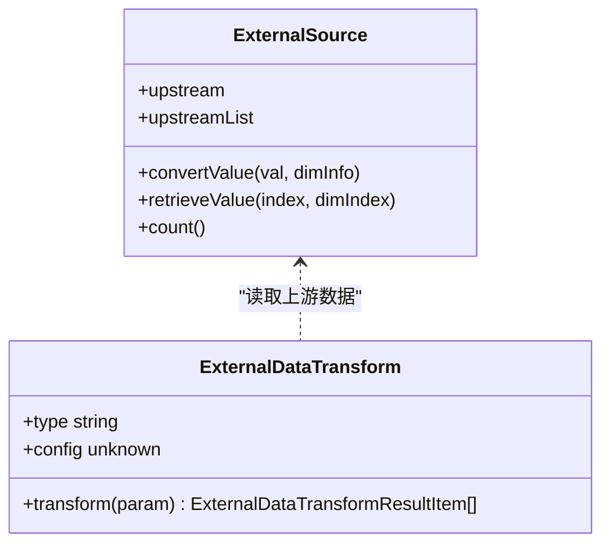
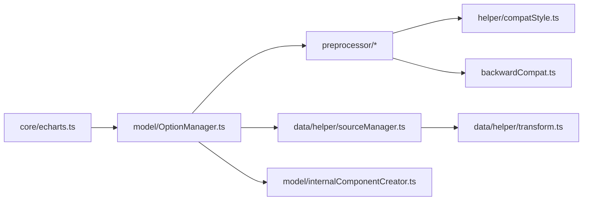

# 配置预处理

<cite>
**本文引用的文件**
- [src/core/echarts.ts](file://src/core/echarts.ts)
- [src/model/OptionManager.ts](file://src/model/OptionManager.ts)
- [src/preprocessor/backwardCompat.ts](file://src/preprocessor/backwardCompat.ts)
- [src/preprocessor/helper/compatStyle.ts](file://src/preprocessor/helper/compatStyle.ts)
- [src/util/types.ts](file://src/util/types.ts)
- [src/component/transform.ts](file://src/component/transform.ts)
- [src/data/helper/transform.ts](file://src/data/helper/transform.ts)
- [src/data/helper/sourceManager.ts](file://src/data/helper/sourceManager.ts)
- [src/model/internalComponentCreator.ts](file://src/model/internalComponentCreator.ts)
</cite>

## 目录
1. [简介](#简介)
2. [项目结构](#项目结构)
3. [核心组件](#核心组件)
4. [架构总览](#架构总览)
5. [详细组件分析](#详细组件分析)
6. [依赖关系分析](#依赖关系分析)
7. [性能考虑](#性能考虑)
8. [故障排查指南](#故障排查指南)
9. [结论](#结论)
10. [附录](#附录)

## 简介
本文件系统性介绍 ECharts 配置预处理系统的工作原理与应用场景，覆盖预处理器链的执行机制、内置预处理器的职责与顺序、向后兼容性处理（废弃配置项与版本迁移）、自定义预处理器的开发与注册规范、内部组件创建过程中的配置转换逻辑，以及数据转换管道与最佳实践。目标是帮助开发者理解从 setOption 到模型构建的完整预处理链路，并据此编写高效、可维护的扩展。

## 项目结构
ECharts 的配置预处理涉及以下关键模块：
- 入口与生命周期：在核心模块中提供预处理器注册与执行上下文。
- 选项管理：负责解析原始配置、调用预处理器链、合并媒体/时间线等。
- 向后兼容：统一处理历史 API 与样式结构的迁移。
- 数据转换：通过 transform 与 source 管理实现数据集的链式变换。
- 内部组件：为某些组件动态生成内部配置项，参与后续合并与渲染。

图表来源
- [src/model/OptionManager.ts:294-378](file://src/model/OptionManager.ts#L294-L378)
- [src/core/echarts.ts:3055-3062](file://src/core/echarts.ts#L3055-L3062)
- [src/preprocessor/helper/compatStyle.ts:259-355](file://src/preprocessor/helper/compatStyle.ts#L259-L355)
- [src/preprocessor/backwardCompat.ts:144-273](file://src/preprocessor/backwardCompat.ts#L144-L273)
- [src/data/helper/sourceManager.ts:54-98](file://src/data/helper/sourceManager.ts#L54-L98)
- [src/model/internalComponentCreator.ts:47-74](file://src/model/internalComponentCreator.ts#L47-L74)

章节来源
- [src/model/OptionManager.ts:294-378](file://src/model/OptionManager.ts#L294-L378)
- [src/core/echarts.ts:3055-3062](file://src/core/echarts.ts#L3055-L3062)

## 核心组件
- 预处理器接口与注册
  - OptionPreprocessor: 定义预处理器签名 (option, isTheme)。
  - registerPreprocessor: 将自定义预处理器加入全局队列，按注册顺序执行。
- 选项管理器
  - parseRawOption: 解析 baseOption、media、timeline，并在 doPreprocess 中依次调用所有预处理器。
- 内置预处理器
  - compatStyle: 处理 ECharts 2/3 遗留样式结构（如 itemStyle.normal/emphasis、textStyle 层级）。
  - backwardCompat: 处理废弃字段映射（如 clipOverflow→clip、clockWise→clockwise、dataRange→visualMap 等）与布局属性兼容。
- 数据转换管道
  - ExternalDataTransform: 定义外部数据转换接口，支持上游 Source 与维度继承规则。
  - sourceManager: 管理数据源访问与维度继承，确保转换结果维度一致性。
- 内部组件创建
  - internalComponentCreator: 根据当前 GlobalModel 动态生成内部组件配置，并追加到待合并列表。

章节来源
- [src/util/types.ts:346-348](file://src/util/types.ts#L346-L348)
- [src/core/echarts.ts:3055-3062](file://src/core/echarts.ts#L3055-L3062)
- [src/model/OptionManager.ts:294-378](file://src/model/OptionManager.ts#L294-L378)
- [src/preprocessor/helper/compatStyle.ts:259-355](file://src/preprocessor/helper/compatStyle.ts#L259-L355)
- [src/preprocessor/backwardCompat.ts:144-273](file://src/preprocessor/backwardCompat.ts#L144-L273)
- [src/data/helper/transform.ts:43-57](file://src/data/helper/transform.ts#L43-L57)
- [src/data/helper/sourceManager.ts:54-98](file://src/data/helper/sourceManager.ts#L54-L98)
- [src/model/internalComponentCreator.ts:47-74](file://src/model/internalComponentCreator.ts#L47-L74)

## 架构总览
下图展示从 setOption 到模型构建的关键流程，包括预处理器链、内置兼容处理、数据转换与内部组件注入。

图表来源
- [src/core/echarts.ts:3055-3062](file://src/core/echarts.ts#L3055-L3062)
- [src/model/OptionManager.ts:294-378](file://src/model/OptionManager.ts#L294-L378)
- [src/preprocessor/helper/compatStyle.ts:259-355](file://src/preprocessor/helper/compatStyle.ts#L259-L355)
- [src/preprocessor/backwardCompat.ts:144-273](file://src/preprocessor/backwardCompat.ts#L144-L273)
- [src/data/helper/sourceManager.ts:54-98](file://src/data/helper/sourceManager.ts#L54-L98)
- [src/model/internalComponentCreator.ts:47-74](file://src/model/internalComponentCreator.ts#L47-L74)

## 详细组件分析

### 预处理器链与执行顺序
- 注册机制
  - 通过 registerPreprocessor 将函数加入全局队列；重复注册会被忽略。
- 执行时机
  - 在 OptionManager.parseRawOption 中，对 baseOption、timelineOptions、mediaList 中的每个单元选项执行 doPreprocess，依次调用所有已注册的预处理器。
- 执行顺序
  - 按注册顺序执行；内置预处理器通常在框架初始化阶段注册，用户自定义预处理器可在应用启动时注册以插入到链中。

图表来源
- [src/core/echarts.ts:3055-3062](file://src/core/echarts.ts#L3055-L3062)
- [src/model/OptionManager.ts:294-378](file://src/model/OptionManager.ts#L294-L378)

章节来源
- [src/core/echarts.ts:3055-3062](file://src/core/echarts.ts#L3055-L3062)
- [src/model/OptionManager.ts:294-378](file://src/model/OptionManager.ts#L294-L378)

### 内置预处理器：样式兼容（compatStyle）
- 主要职责
  - 将 ECharts 2/3 的 itemStyle.normal/emphasis 结构迁移至新版样式位置。
  - 将 textStyle 层级提升到对应节点（如 label、axisLabel）。
  - 处理特定组件（如 calendar、toolbox、timeline）的样式迁移。
- 影响范围
  - series、axis、parallel、calendar、radar、geo、timeline、toolbox、tooltip.axisPointer 等。
- 开发建议
  - 避免在自定义预处理器中重复处理已被内置兼容覆盖的字段，减少冗余开销。

章节来源
- [src/preprocessor/helper/compatStyle.ts:259-355](file://src/preprocessor/helper/compatStyle.ts#L259-L355)

### 内置预处理器：字段兼容（backwardCompat）
- 主要职责
  - 废弃字段重映射：例如 line.clipOverflow→line.clip、pie/gauge.clockWise→clockwise、dataRange→visualMap、mapType→map 等。
  - 布局属性兼容：x/y/x2/y2 → left/top/right/bottom。
  - 系列特定迁移：bar 的 itemStyle 字段重命名、sunburst 的 downplay→blur、graph/sankey 的 focusNodeAdjacency→emphasis.focus 等。
- 执行策略
  - 遍历 series 数组并对每个系列类型分支处理；同时处理组件级布局属性。
- 开发建议
  - 新增废弃字段时，优先在此处添加映射并输出弃用日志，便于用户迁移。

章节来源
- [src/preprocessor/backwardCompat.ts:144-273](file://src/preprocessor/backwardCompat.ts#L144-L273)

### 数据转换管道（dataset transform）
- 接口规范
  - ExternalDataTransform 定义 type、config、transform 方法，接收上游 Source 与配置，返回转换后的数据项或数组。
- 维度继承
  - 默认继承上游维度定义，除非转换返回新的 dimensions；保证链式转换的维度一致性。
- 使用方式
  - 通过 dataset.transform 配置多个转换步骤，形成数据流水线；适合过滤、聚合、排序、采样等。

图表来源
- [src/data/helper/transform.ts:43-57](file://src/data/helper/transform.ts#L43-L57)
- [src/data/helper/transform.ts:162-159](file://src/data/helper/transform.ts#L162-L159)
- [src/data/helper/sourceManager.ts:54-98](file://src/data/helper/sourceManager.ts#L54-L98)

章节来源
- [src/data/helper/transform.ts:43-57](file://src/data/helper/transform.ts#L43-L57)
- [src/data/helper/sourceManager.ts:54-98](file://src/data/helper/sourceManager.ts#L54-L98)

### 内部组件创建（internalComponentCreator）
- 作用
  - 根据当前 GlobalModel 动态生成内部组件配置（id 带内部前缀），并追加到待合并列表。
- 合并策略
  - 内部组件采用 replaceMerge 策略：若新配置未匹配到已有 id，则移除旧的内部组件。
- 使用场景
  - 某些组件需要基于运行时状态生成隐藏或辅助配置项，供后续渲染或交互使用。

章节来源
- [src/model/internalComponentCreator.ts:47-74](file://src/model/internalComponentCreator.ts#L47-L74)

### 组件安装与扩展点（transform 组件）
- 作用
  - 通过 use(install) 将组件安装到系统中，使 transform 能力可用。
- 扩展方式
  - 可通过扩展机制注册新的 transform 类型，配合数据转换管道使用。

章节来源
- [src/component/transform.ts:20-23](file://src/component/transform.ts#L20-L23)

## 依赖关系分析
- 核心依赖
  - echarts.ts 提供 registerPreprocessor 与生命周期钩子，驱动 OptionManager 执行预处理。
  - OptionManager 串联预处理链，并将结果传递给模型构建与数据源初始化。
- 内置依赖
  - compatStyle 与 backwardCompat 作为内置预处理器被注册并执行。
  - data transform 与 sourceManager 协同工作，确保数据流一致性与维度继承。
  - internalComponentCreator 为部分组件提供动态配置注入。

图表来源
- [src/core/echarts.ts:3055-3062](file://src/core/echarts.ts#L3055-L3062)
- [src/model/OptionManager.ts:294-378](file://src/model/OptionManager.ts#L294-L378)
- [src/preprocessor/helper/compatStyle.ts:259-355](file://src/preprocessor/helper/compatStyle.ts#L259-L355)
- [src/preprocessor/backwardCompat.ts:144-273](file://src/preprocessor/backwardCompat.ts#L144-L273)
- [src/data/helper/sourceManager.ts:54-98](file://src/data/helper/sourceManager.ts#L54-L98)
- [src/data/helper/transform.ts:43-57](file://src/data/helper/transform.ts#L43-L57)
- [src/model/internalComponentCreator.ts:47-74](file://src/model/internalComponentCreator.ts#L47-L74)

章节来源
- [src/core/echarts.ts:3055-3062](file://src/core/echarts.ts#L3055-L3062)
- [src/model/OptionManager.ts:294-378](file://src/model/OptionManager.ts#L294-L378)

## 性能考虑
- 预处理器链
  - 尽量保持预处理器轻量，避免在 doPreprocess 中进行深度递归或昂贵计算。
  - 复用内置兼容逻辑，减少重复处理。
- 数据转换
  - 合理使用 transform 链，避免过多中间态；必要时利用 print 调试（仅开发模式）。
  - 关注维度继承规则，减少不必要的维度重建。
- 内部组件
  - 控制内部组件数量与复杂度，避免频繁替换导致合并成本上升。
- 通用优化
  - 在大数据集场景下，优先使用数据采样与过滤；合理设置 large mode 与渐进渲染。

[本节为通用指导，不直接分析具体文件]

## 故障排查指南
- 常见问题
  - 样式不生效：检查是否仍在使用 ECharts 2/3 的 itemStyle.normal/emphasis 结构；确认 compatStyle 已执行。
  - 字段无效：确认是否使用了废弃字段（如 clipOverflow、clockWise、dataRange）；查看 backwardCompat 映射。
  - 数据转换异常：检查 transform 的 upstream 与 dimensions 定义是否符合继承规则。
  - 内部组件冲突：确认内部组件 id 的唯一性与 replaceMerge 行为是否符合预期。
- 定位方法
  - 在开发模式下启用弃用日志，观察 deprecateLog/deprecateReplaceLog 输出。
  - 逐步拆分预处理器链，定位问题所在环节。
  - 使用数据转换的 print 选项（开发模式）打印中间结果。

章节来源
- [src/preprocessor/helper/compatStyle.ts:259-355](file://src/preprocessor/helper/compatStyle.ts#L259-L355)
- [src/preprocessor/backwardCompat.ts:144-273](file://src/preprocessor/backwardCompat.ts#L144-L273)
- [src/data/helper/transform.ts:43-57](file://src/data/helper/transform.ts#L43-L57)

## 结论
ECharts 的配置预处理系统通过清晰的注册机制与模块化设计，实现了强大的向后兼容与可扩展性。内置预处理器覆盖了样式与字段的广泛迁移需求，数据转换管道提供了灵活的数据处理能力，内部组件机制增强了运行时配置生成的灵活性。开发者应遵循接口规范与最佳实践，编写高效、可维护的自定义预处理器与数据转换，以获得更好的性能与可维护性。

[本节为总结，不直接分析具体文件]

## 附录
- 自定义预处理器开发示例（概念说明）
  - 目标：数据标准化与错误修复
  - 步骤：
    - 在应用启动时调用 registerPreprocessor 注册函数。
    - 在函数内校验并标准化必要字段（如数值类型、必填项）。
    - 对废弃字段进行映射并输出弃用日志。
    - 避免修改不可变对象，必要时克隆后处理。
  - 参考路径：
    - 注册接口：[src/core/echarts.ts:3055-3062](file://src/core/echarts.ts#L3055-L3062)
    - 执行入口：[src/model/OptionManager.ts:294-378](file://src/model/OptionManager.ts#L294-L378)
    - 兼容示例：[src/preprocessor/backwardCompat.ts:144-273](file://src/preprocessor/backwardCompat.ts#L144-L273)
    - 样式兼容：[src/preprocessor/helper/compatStyle.ts:259-355](file://src/preprocessor/helper/compatStyle.ts#L259-L355)

[本节为概念性内容，不直接分析具体文件]