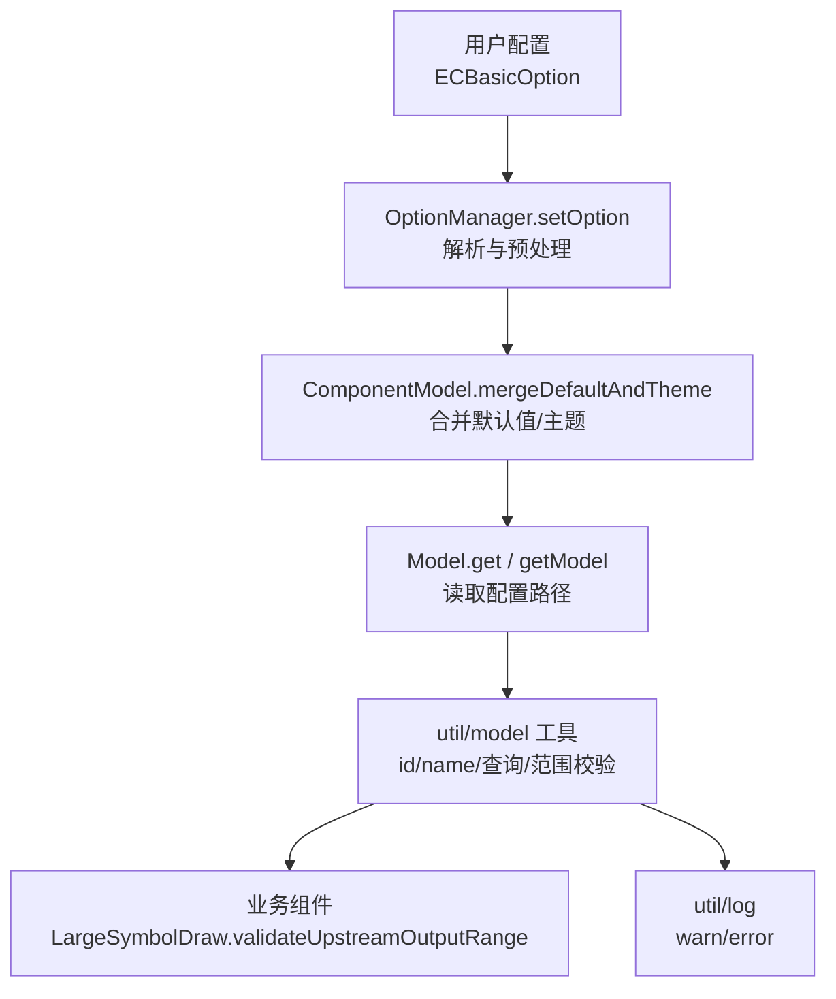
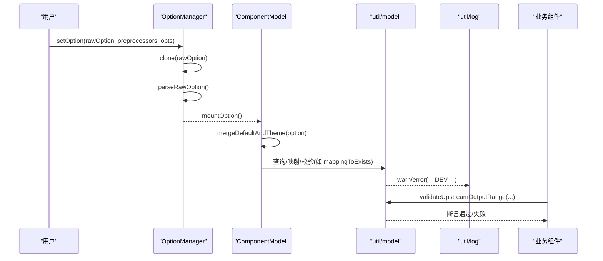
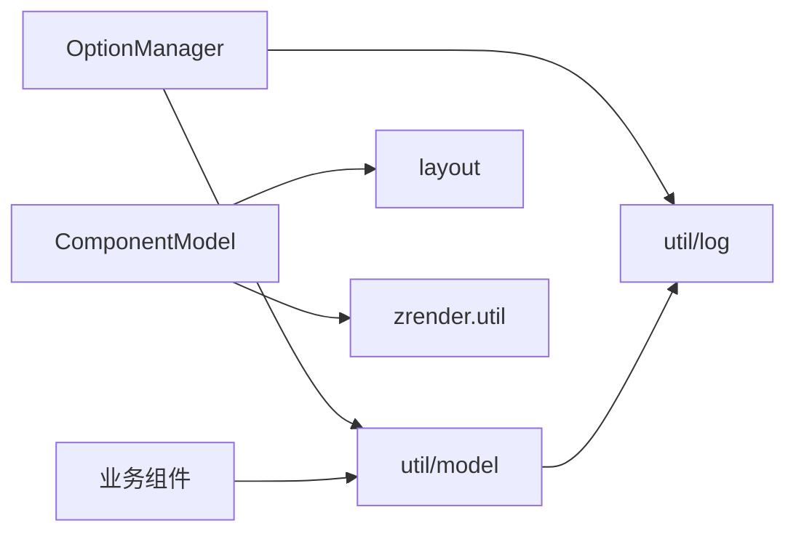
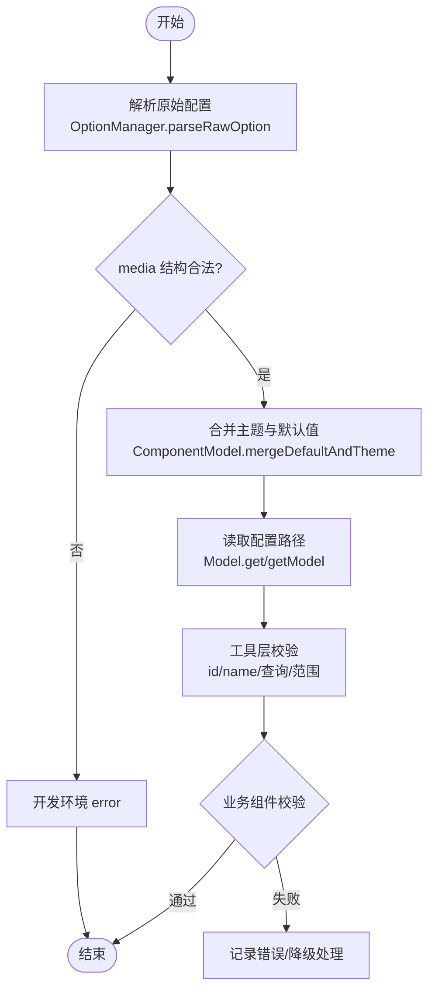

# 配置验证

<cite>
**本文引用的文件**
- [src/model/Model.ts](file://src/model/Model.ts)
- [src/model/Component.ts](file://src/model/Component.ts)
- [src/model/OptionManager.ts](file://src/model/OptionManager.ts)
- [src/util/model.ts](file://src/util/model.ts)
- [src/util/log.ts](file://src/util/log.ts)
- [src/chart/helper/LargeSymbolDraw.ts](file://src/chart/helper/LargeSymbolDraw.ts)
</cite>

## 目录
1. [简介](#简介)
2. [项目结构](#项目结构)
3. [核心组件](#核心组件)
4. [架构总览](#架构总览)
5. [详细组件分析](#详细组件分析)
6. [依赖关系分析](#依赖关系分析)
7. [性能考量](#性能考量)
8. [故障排查指南](#故障排查指南)
9. [结论](#结论)
10. [附录](#附录)

## 简介
本文件系统性说明 ECharts 的配置验证机制，覆盖类型检查、格式校验、必填项与取值范围、枚举值校验、自定义验证器注册与使用、扩展组件的验证逻辑接入、以及开发环境与生产环境的错误降级策略。通过源码级分析与图示，帮助读者理解并安全地扩展 ECharts 的配置验证能力。

## 项目结构
ECharts 的配置处理与验证贯穿“选项解析 -> 模型合并 -> 组件初始化 -> 运行时校验”的全链路：
- 选项解析与预处理：由 OptionManager 负责，统一解析 baseOption、timeline、media 等，并在解析阶段进行基础合法性检查（如 media 结构）。
- 模型层：Model/ComponentModel 负责默认值合并、主题合并、布局参数合并，以及 get/getModel 等读取路径。
- 工具层：util/model 提供大量通用校验与辅助方法（如 id/name 合法性、查询条件构造、范围断言等）。
- 日志与告警：util/log 提供 warn/error 输出，配合 __DEV__ 在开发环境给出调试信息。
- 业务侧验证：各组件/图表在自身流程中调用工具方法进行更细粒度的校验（例如上游输出范围校验）。

**图示来源**
- [src/model/OptionManager.ts:87-151](file://src/model/OptionManager.ts#L87-L151)
- [src/model/Component.ts:160-189](file://src/model/Component.ts#L160-L189)
- [src/model/Model.ts:94-168](file://src/model/Model.ts#L94-L168)
- [src/util/model.ts:233-287](file://src/util/model.ts#L233-L287)
- [src/chart/helper/LargeSymbolDraw.ts:35-303](file://src/chart/helper/LargeSymbolDraw.ts#L35-L303)
- [src/util/log.ts:62-63](file://src/util/log.ts#L62-L63)

**章节来源**
- [src/model/OptionManager.ts:87-151](file://src/model/OptionManager.ts#L87-L151)
- [src/model/Component.ts:160-189](file://src/model/Component.ts#L160-L189)
- [src/model/Model.ts:94-168](file://src/model/Model.ts#L94-L168)
- [src/util/model.ts:233-287](file://src/util/model.ts#L233-L287)
- [src/chart/helper/LargeSymbolDraw.ts:35-303](file://src/chart/helper/LargeSymbolDraw.ts#L35-L303)
- [src/util/log.ts:62-63](file://src/util/log.ts#L62-L63)

## 核心组件
- OptionManager：负责 setOption 入口、rawOption 克隆、媒体/时间线解析、预处理器链执行、备份与挂载。
- Model/ComponentModel：负责默认值与主题合并、布局参数合并、路径读取、继承与扩展。
- util/model：提供 id/name 合法性校验、组件映射与查找、查询条件构造、范围断言、去重、迭代器等。
- util/log：提供 warn/error，受 __DEV__ 控制，用于开发期调试与提示。

**章节来源**
- [src/model/OptionManager.ts:87-151](file://src/model/OptionManager.ts#L87-L151)
- [src/model/Component.ts:160-189](file://src/model/Component.ts#L160-L189)
- [src/util/model.ts:233-287](file://src/util/model.ts#L233-L287)
- [src/util/log.ts:62-63](file://src/util/log.ts#L62-L63)

## 架构总览
下图展示了从用户配置到最终渲染前，配置验证的关键节点与数据流。

**图示来源**
- [src/model/OptionManager.ts:87-151](file://src/model/OptionManager.ts#L87-L151)
- [src/model/Component.ts:160-189](file://src/model/Component.ts#L160-L189)
- [src/util/model.ts:233-287](file://src/util/model.ts#L233-L287)
- [src/chart/helper/LargeSymbolDraw.ts:35-303](file://src/chart/helper/LargeSymbolDraw.ts#L35-L303)
- [src/util/log.ts:62-63](file://src/util/log.ts#L62-L63)

## 详细组件分析

### 选项解析与预处理（OptionManager）
- 职责：接收 rawOption，克隆避免污染；解析 baseOption/timeline/media；执行预处理器链；维护备份以便后续恢复或对比。
- 验证点：
  - media 结构非法时，在开发环境下通过 error 提示。
  - 对 series/data 中的 TypedArray 做特殊处理，避免重复 setOption 时的副作用。
- 关键点：
  - setOption 不直接做深度类型校验，而是将“结构合法性”交给预处理与后续模型合并阶段。
  - 支持媒体查询匹配，按优先级应用 media 片段。

**章节来源**
- [src/model/OptionManager.ts:87-151](file://src/model/OptionManager.ts#L87-L151)
- [src/model/OptionManager.ts:294-378](file://src/model/OptionManager.ts#L294-L378)
- [src/model/OptionManager.ts:385-427](file://src/model/OptionManager.ts#L385-L427)

### 模型合并与默认值（Model/ComponentModel）
- ComponentModel.mergeDefaultAndTheme：
  - 先合并主题配置，再合并组件默认配置；若存在布局模式，会合并布局参数。
  - 保证 option 具备完整默认值，为后续验证提供稳定基线。
- Model.get/getModel：
  - 提供路径式读取，支持忽略父级或沿继承链查找。
  - 为上层组件提供一致的配置访问方式。

**章节来源**
- [src/model/Component.ts:160-189](file://src/model/Component.ts#L160-L189)
- [src/model/Model.ts:94-168](file://src/model/Model.ts#L94-L168)

### 通用校验与工具（util/model）
- 组件映射与 id/name 校验：
  - mappingToExists：在合并组件选项时，校验并规范化 id/name，必要时生成唯一 id；开发环境下对非法 id/name 发出警告。
  - isValidIdOrName/warnInvalidateIdOrName：确保 id/name 为字符串或可安全转换的数字。
- 查询条件构造：
  - parseFinder/queryReferringComponents：将 payload 或 finder 解析为查询条件，并对 index/id/name 的非法值（如 'all'/'none' 在不允许的场景）进行开发期报错。
- 范围与断言：
  - validateUpstreamOutputRange：断言上游输出范围与当前任务计划范围一致，防止下游消费越界或不一致。
  - extent 相关函数：unionExtentFromNumber/isValidBoundsForExtent 等，用于数值范围的累积与校验。
- 其他：
  - removeDuplicates/groupData/compressBatches 等工具，保障数据结构的稳定性与一致性。

**章节来源**
- [src/util/model.ts:233-287](file://src/util/model.ts#L233-L287)
- [src/util/model.ts:555-574](file://src/util/model.ts#L555-L574)
- [src/util/model.ts:828-1003](file://src/util/model.ts#L828-L1003)
- [src/util/model.ts:1417-1426](file://src/util/model.ts#L1417-L1426)
- [src/util/model.ts:1220-1288](file://src/util/model.ts#L1220-L1288)

### 业务组件中的具体验证（LargeSymbolDraw）
- 在大符号绘制流程中，调用 validateUpstreamOutputRange 对上一步输出的 pointsRange 进行断言，确保下游消费范围与上游产出一致，避免性能退化或渲染异常。

**章节来源**
- [src/chart/helper/LargeSymbolDraw.ts:35-303](file://src/chart/helper/LargeSymbolDraw.ts#L35-L303)
- [src/util/model.ts:1417-1426](file://src/util/model.ts#L1417-L1426)

## 依赖关系分析
- OptionManager 依赖 util/model 的 normalizeToArray 等工具，以及 util/log 的错误输出。
- ComponentModel 依赖 layout 与 zrUtil 进行默认值与布局参数合并。
- 业务组件依赖 util/model 的断言与范围工具，确保数据流一致性。
- 整体耦合度低、内聚度高：每个模块聚焦单一职责，通过清晰接口交互。

**图示来源**
- [src/model/OptionManager.ts:87-151](file://src/model/OptionManager.ts#L87-L151)
- [src/model/Component.ts:160-189](file://src/model/Component.ts#L160-L189)
- [src/util/model.ts:233-287](file://src/util/model.ts#L233-L287)
- [src/util/log.ts:62-63](file://src/util/log.ts#L62-L63)

**章节来源**
- [src/model/OptionManager.ts:87-151](file://src/model/OptionManager.ts#L87-L151)
- [src/model/Component.ts:160-189](file://src/model/Component.ts#L160-L189)
- [src/util/model.ts:233-287](file://src/util/model.ts#L233-L287)
- [src/util/log.ts:62-63](file://src/util/log.ts#L62-L63)

## 性能考量
- 配置克隆与备份：setOption 中对 rawOption 进行克隆，避免复用数据导致的副作用；媒体/时间线选项仅在必要时克隆，减少内存分配。
- 合并策略：ComponentModel 的合并优先顺序为主题 -> 默认值 -> 布局参数，尽量减少重复计算。
- 断言与校验：validateUpstreamOutputRange 等断言在关键路径上快速失败，避免后续更大开销。
- 开发期 vs 生产期：warn/error 仅在 __DEV__ 下生效，生产环境无额外开销。

[本节为通用指导，无需特定文件引用]

## 故障排查指南
- 常见错误与定位
  - media 结构非法：在开发环境会触发 error，检查 media 数组结构与 query/option 字段。
  - id/name 非法：开发环境会 warn，确保 id/name 为字符串或数字。
  - index/id/name 查询非法：当传入 'all'/'none' 不被允许时，开发环境会 error，调整查询参数。
  - 上游输出范围不一致：validateUpstreamOutputRange 断言失败，检查上游任务范围与下游消费范围是否一致。
- 调试建议
  - 开启开发环境以获取详细警告/错误信息。
  - 逐步缩小问题范围：先确认 OptionManager 解析结果，再检查 ComponentModel 合并后的 option，最后查看业务组件的断言位置。
- 生产环境降级策略
  - 非致命警告在生产环境被抑制，避免影响性能与用户体验。
  - 关键断言失败可能抛出异常，需在上层捕获并做降级处理（如回退到默认配置或跳过该步骤）。

**章节来源**
- [src/model/OptionManager.ts:333-358](file://src/model/OptionManager.ts#L333-L358)
- [src/util/model.ts:247-263](file://src/util/model.ts#L247-L263)
- [src/util/model.ts:968-995](file://src/util/model.ts#L968-L995)
- [src/util/model.ts:1417-1426](file://src/util/model.ts#L1417-L1426)
- [src/util/log.ts:62-63](file://src/util/log.ts#L62-L63)

## 结论
ECharts 的配置验证采用“分层+工具化”的设计：在选项解析阶段做结构合法性检查，在模型合并阶段注入默认值与主题，在工具层提供统一的校验与断言能力，业务组件按需进行细粒度验证。开发环境提供丰富的调试信息，生产环境保持轻量与稳定。通过合理运用内置验证规则与扩展点，可以为自定义组件添加可靠的配置验证逻辑。

[本节为总结性内容，无需特定文件引用]

## 附录

### 配置验证流程图（概念）

[此图为概念流程，不直接映射具体代码结构，故无图示来源]

### 如何为扩展组件添加配置验证逻辑（最佳实践）
- 在组件的 init 或 mergeOption 后，利用 util/model 提供的工具进行必要校验（如 id/name、查询条件、范围断言）。
- 对于复杂业务规则，可在组件内部定义私有校验函数，并在关键路径调用。
- 使用 util/log 的 warn/error 在开发环境输出提示信息，生产环境自动静默。
- 示例参考路径：
  - 组件映射与 id/name 校验：[src/util/model.ts:233-287](file://src/util/model.ts#L233-L287)
  - 查询条件构造与非法值处理：[src/util/model.ts:828-1003](file://src/util/model.ts#L828-L1003)
  - 上游输出范围断言：[src/util/model.ts:1417-1426](file://src/util/model.ts#L1417-L1426)
  - 业务组件调用示例：[src/chart/helper/LargeSymbolDraw.ts:35-303](file://src/chart/helper/LargeSymbolDraw.ts#L35-L303)

**章节来源**
- [src/util/model.ts:233-287](file://src/util/model.ts#L233-L287)
- [src/util/model.ts:828-1003](file://src/util/model.ts#L828-L1003)
- [src/util/model.ts:1417-1426](file://src/util/model.ts#L1417-L1426)
- [src/chart/helper/LargeSymbolDraw.ts:35-303](file://src/chart/helper/LargeSymbolDraw.ts#L35-L303)