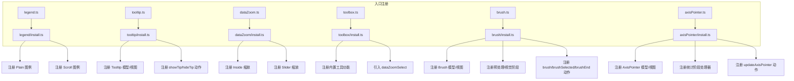
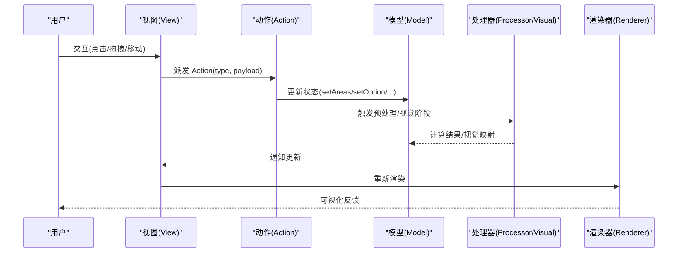
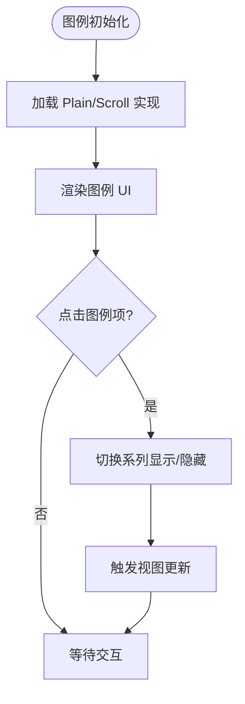
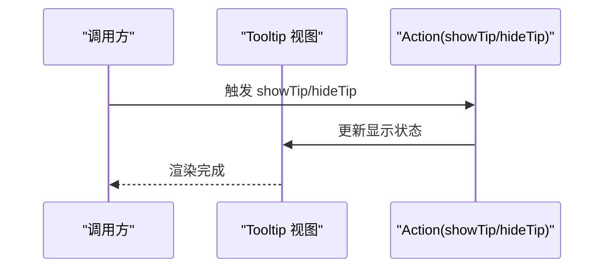
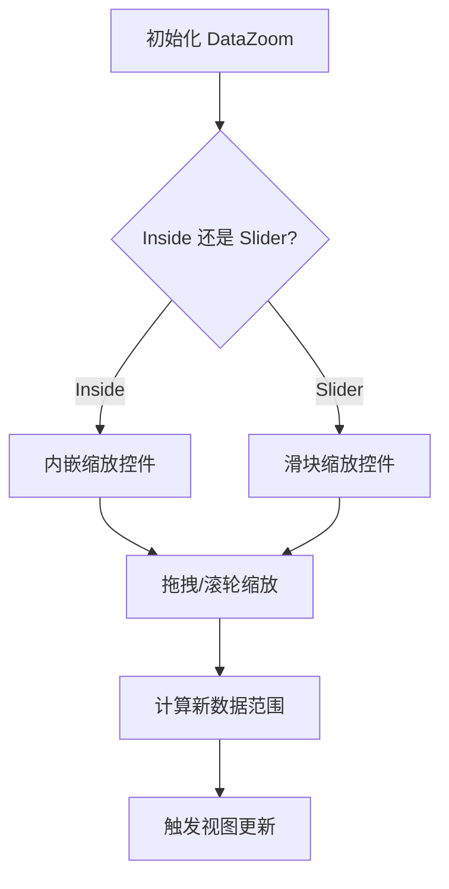
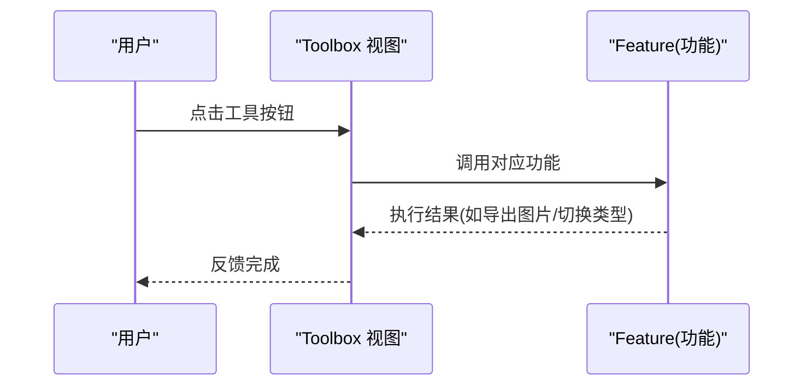
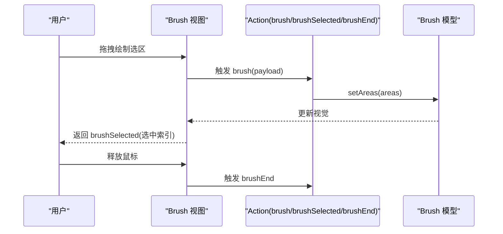
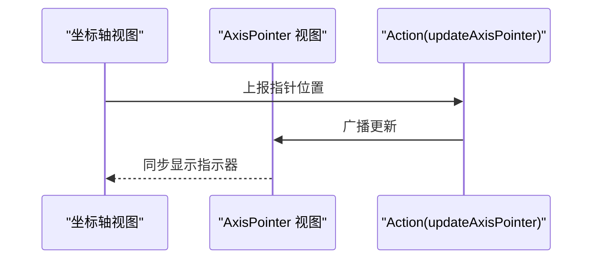
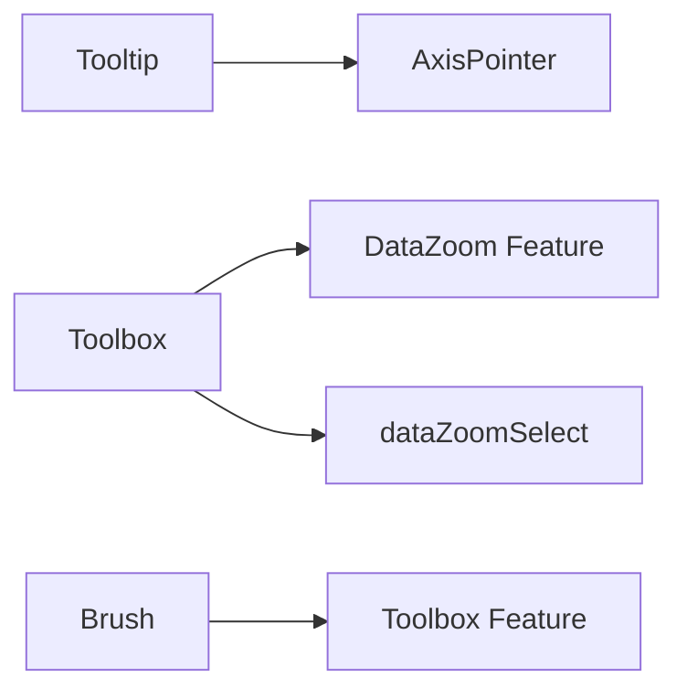

# 交互组件

<cite>
**本文引用的文件**
- [src/component/legend.ts](file://src/component/legend.ts)
- [src/component/legend/install.ts](file://src/component/legend/install.ts)
- [src/component/tooltip.ts](file://src/component/tooltip.ts)
- [src/component/tooltip/install.ts](file://src/component/tooltip/install.ts)
- [src/component/dataZoom.ts](file://src/component/dataZoom.ts)
- [src/component/dataZoom/install.ts](file://src/component/dataZoom/install.ts)
- [src/component/toolbox.ts](file://src/component/toolbox.ts)
- [src/component/toolbox/install.ts](file://src/component/toolbox/install.ts)
- [src/component/brush.ts](file://src/component/brush.ts)
- [src/component/brush/install.ts](file://src/component/brush/install.ts)
- [src/component/axisPointer.ts](file://src/component/axisPointer.ts)
- [src/component/axisPointer/install.ts](file://src/component/axisPointer/install.ts)
</cite>

## 目录
1. [简介](#简介)
2. [项目结构](#项目结构)
3. [核心组件](#核心组件)
4. [架构总览](#架构总览)
5. [详细组件分析](#详细组件分析)
6. [依赖关系分析](#依赖关系分析)
7. [性能考虑](#性能考虑)
8. [故障排查指南](#故障排查指南)
9. [结论](#结论)
10. [附录](#附录)

## 简介
本章节聚焦 ECharts 的交互组件系统，围绕图例（Legend）、提示框（Tooltip）、数据缩放（DataZoom）、工具栏（Toolbox）、刷选（Brush）与轴点指示器（AxisPointer）展开。我们将解释这些组件如何响应用户操作、管理状态、彼此通信，并梳理其配置项、API 与使用模式。同时提供组合多个组件构建复杂交互式图表的实践建议、性能优化策略与常见问题排查方法。

## 项目结构
ECharts 将每个交互组件以“入口注册 + install 安装”的方式组织：
- 顶层入口文件负责通过扩展机制加载对应 install 模块。
- install 模块完成模型（Model）、视图（View）、动作（Action）、预处理（Preprocessor）、视觉编码（Visual）等注册，并将子能力按需引入。

图示来源
- [src/component/legend.ts:20-25](file://src/component/legend.ts#L20-L25)
- [src/component/legend/install.ts:20-27](file://src/component/legend/install.ts#L20-L27)
- [src/component/tooltip.ts:20-23](file://src/component/tooltip.ts#L20-L23)
- [src/component/tooltip/install.ts:20-56](file://src/component/tooltip/install.ts#L20-L56)
- [src/component/dataZoom.ts:20-23](file://src/component/dataZoom.ts#L20-L23)
- [src/component/dataZoom/install.ts:20-31](file://src/component/dataZoom/install.ts#L20-L31)
- [src/component/toolbox.ts:20-23](file://src/component/toolbox.ts#L20-L23)
- [src/component/toolbox/install.ts:20-44](file://src/component/toolbox/install.ts#L20-L44)
- [src/component/brush.ts:20-23](file://src/component/brush.ts#L20-L23)
- [src/component/brush/install.ts:20-93](file://src/component/brush/install.ts#L20-L93)
- [src/component/axisPointer.ts:20-23](file://src/component/axisPointer.ts#L20-L23)
- [src/component/axisPointer/install.ts:20-73](file://src/component/axisPointer/install.ts#L20-L73)

章节来源
- [src/component/legend.ts:20-25](file://src/component/legend.ts#L20-L25)
- [src/component/tooltip.ts:20-23](file://src/component/tooltip.ts#L20-L23)
- [src/component/dataZoom.ts:20-23](file://src/component/dataZoom.ts#L20-L23)
- [src/component/toolbox.ts:20-23](file://src/component/toolbox.ts#L20-L23)
- [src/component/brush.ts:20-23](file://src/component/brush.ts#L20-L23)
- [src/component/axisPointer.ts:20-23](file://src/component/axisPointer.ts#L20-L23)

## 核心组件
- 图例（Legend）
  - 作用：控制系列可见性与选中状态，支持滚动与纯展示两种实现。
  - 安装：入口注册后，install 中分别注册 Plain 与 Scroll 两种图例实现。
  - 事件/动作：通过图例点击触发系列显示/隐藏与高亮联动。
  - 典型配置：位置、布局、选中态、滚动行为、图标样式等。
  - 参考路径
    - [入口注册:20-25](file://src/component/legend.ts#L20-L25)
    - [install 注册 Plain/Scroll:20-27](file://src/component/legend/install.ts#L20-L27)

- 提示框（Tooltip）
  - 作用：在鼠标悬停或程序化调用时展示数据详情，可联动轴点指示器。
  - 安装：install 中注册模型/视图，并注册 showTip/hideTip 动作；同时依赖 axisPointer 安装。
  - 事件/动作：showTip/hideTip 由外部触发，内部更新视图显示。
  - 典型配置：触发方式、内容格式、跟随策略、是否始终显示、DOM 挂载等。
  - 参考路径
    - [install 注册 Model/View/Actions:20-56](file://src/component/tooltip/install.ts#L20-L56)

- 数据缩放（DataZoom）
  - 作用：对数据进行范围筛选与缩放，支持内置滑块与内嵌式两种形态。
  - 安装：install 中注册 Inside 与 Slider 两种缩放实现。
  - 事件/动作：缩放过程中产生数据范围变化，驱动视图重绘与联动。
  - 典型配置：类型、起始/结束百分比、平滑度、同步、过滤模式等。
  - 参考路径
    - [install 注册 Inside/Slider:20-31](file://src/component/dataZoom/install.ts#L20-L31)

- 工具栏（Toolbox）
  - 作用：提供保存图像、类型切换、数据视图、还原、数据缩放等常用工具。
  - 安装：install 中注册模型/视图，并注册内置功能（如 saveAsImage、magicType、dataView、restore、dataZoom），同时引入 dataZoomSelect。
  - 事件/动作：用户点击工具按钮触发对应 action，执行相应逻辑。
  - 典型配置：工具项列表、图标、标题、位置、行为开关等。
  - 参考路径
    - [install 注册 Model/View/Features:20-44](file://src/component/toolbox/install.ts#L20-L44)

- 刷选（Brush）
  - 作用：在坐标系上绘制选择区域，按区域筛选数据并反馈选中结果。
  - 安装：install 中注册模型/视图、预处理、视觉阶段，以及 brush/brushSelected/brushEnd 动作；并注册 toolbox 中的 brush 功能。
  - 事件/动作：brush 设置区域，brushSelected 返回选中数据索引，brushEnd 表示交互结束。
  - 典型配置：刷选类型、回调、联动、视觉编码等。
  - 参考路径
    - [install 注册 Model/View/Actions/Feature:20-93](file://src/component/brush/install.ts#L20-L93)

- 轴点指示器（AxisPointer）
  - 作用：在坐标轴上显示十字线/标尺等指示元素，常用于 tooltip 联动。
  - 安装：install 中注册模型/视图，并在统计阶段收集坐标轴信息；注册 updateAxisPointer 动作用于跨视图广播更新。
  - 事件/动作：updateAxisPointer 触发各视图同步更新指示器位置。
  - 典型配置：显示模式、样式、联动、吸附、多轴同步等。
  - 参考路径
    - [install 注册 Model/View/Processor/Action:20-73](file://src/component/axisPointer/install.ts#L20-L73)

章节来源
- [src/component/legend/install.ts:20-27](file://src/component/legend/install.ts#L20-L27)
- [src/component/tooltip/install.ts:20-56](file://src/component/tooltip/install.ts#L20-L56)
- [src/component/dataZoom/install.ts:20-31](file://src/component/dataZoom/install.ts#L20-L31)
- [src/component/toolbox/install.ts:20-44](file://src/component/toolbox/install.ts#L20-L44)
- [src/component/brush/install.ts:20-93](file://src/component/brush/install.ts#L20-L93)
- [src/component/axisPointer/install.ts:20-73](file://src/component/axisPointer/install.ts#L20-L73)

## 架构总览
交互组件遵循统一的“模型-视图-动作-处理器”架构：
- 模型（Model）：承载配置与状态。
- 视图（View）：负责渲染与交互响应。
- 动作（Action）：统一的事件处理入口，修改模型状态并触发更新。
- 处理器（Processor/Preprocessor/Visual）：在特定阶段进行数据/视觉处理。

图示来源
- [src/component/tooltip/install.ts:20-56](file://src/component/tooltip/install.ts#L20-L56)
- [src/component/brush/install.ts:40-93](file://src/component/brush/install.ts#L40-L93)
- [src/component/axisPointer/install.ts:54-73](file://src/component/axisPointer/install.ts#L54-L73)

## 详细组件分析

### 图例（Legend）
- 职责与能力
  - 控制系列的显示/隐藏与选中态，支持滚动与纯展示两种实现。
  - 通过 install 注册 Plain 与 Scroll 两类图例，便于按需加载。
- 事件与状态
  - 点击图例项触发系列可见性切换，影响视图渲染与联动。
- 配置要点
  - 布局与位置、图标与文本样式、选中态、滚动行为等。
- 使用模式
  - 在 option.legend 中声明图例，结合 series 的 name 字段匹配。
- 参考路径
  - [入口注册:20-25](file://src/component/legend.ts#L20-L25)
  - [install 注册 Plain/Scroll:20-27](file://src/component/legend/install.ts#L20-L27)

图示来源
- [src/component/legend/install.ts:20-27](file://src/component/legend/install.ts#L20-L27)

章节来源
- [src/component/legend.ts:20-25](file://src/component/legend.ts#L20-L25)
- [src/component/legend/install.ts:20-27](file://src/component/legend/install.ts#L20-L27)

### 提示框（Tooltip）
- 职责与能力
  - 在交互时展示数据详情，支持程序化显示/隐藏。
  - 依赖 axisPointer，可在坐标轴上显示指示线。
- 事件与动作
  - showTip/hideTip 动作由外部触发，内部更新视图显示。
- 配置要点
  - 触发方式、内容格式化、跟随策略、是否始终显示、DOM 挂载位置等。
- 使用模式
  - 在 option.tooltip 中配置，或通过 API 触发 showTip/hideTip。
- 参考路径
  - [install 注册 Model/View/Actions:20-56](file://src/component/tooltip/install.ts#L20-L56)

图示来源
- [src/component/tooltip/install.ts:20-56](file://src/component/tooltip/install.ts#L20-L56)

章节来源
- [src/component/tooltip/install.ts:20-56](file://src/component/tooltip/install.ts#L20-L56)

### 数据缩放（DataZoom）
- 职责与能力
  - 提供数据范围筛选与缩放，支持 Inside（内嵌）与 Slider（滑块）两种形态。
- 事件与动作
  - 缩放过程改变数据范围，驱动视图重绘与联动。
- 配置要点
  - 类型、起止百分比、平滑度、同步、过滤模式等。
- 使用模式
  - 在 option.dataZoom 中声明一个或多个缩放实例，绑定到指定轴或全局。
- 参考路径
  - [install 注册 Inside/Slider:20-31](file://src/component/dataZoom/install.ts#L20-L31)

图示来源
- [src/component/dataZoom/install.ts:20-31](file://src/component/dataZoom/install.ts#L20-L31)

章节来源
- [src/component/dataZoom/install.ts:20-31](file://src/component/dataZoom/install.ts#L20-L31)

### 工具栏（Toolbox）
- 职责与能力
  - 集成常用工具：保存图片、类型切换、数据视图、还原、数据缩放等。
- 事件与动作
  - 点击工具项触发对应 action，执行具体功能。
- 配置要点
  - 工具项列表、图标、标题、位置、行为开关等。
- 使用模式
  - 在 option.toolbox 中声明工具项，按需启用内置功能。
- 参考路径
  - [install 注册 Model/View/Features:20-44](file://src/component/toolbox/install.ts#L20-L44)

图示来源
- [src/component/toolbox/install.ts:20-44](file://src/component/toolbox/install.ts#L20-L44)

章节来源
- [src/component/toolbox/install.ts:20-44](file://src/component/toolbox/install.ts#L20-L44)

### 刷选（Brush）
- 职责与能力
  - 在坐标系上绘制选择区域，按区域筛选数据并返回选中索引。
- 事件与动作
  - brush：设置区域；brushSelected：返回选中数据；brushEnd：交互结束。
- 配置要点
  - 刷选类型、回调、联动、视觉编码等。
- 使用模式
  - 在 option.brush 中启用并配置回调，结合其他组件联动。
- 参考路径
  - [install 注册 Model/View/Actions/Feature:20-93](file://src/component/brush/install.ts#L20-L93)

图示来源
- [src/component/brush/install.ts:40-93](file://src/component/brush/install.ts#L40-L93)

章节来源
- [src/component/brush/install.ts:20-93](file://src/component/brush/install.ts#L20-L93)

### 轴点指示器（AxisPointer）
- 职责与能力
  - 在坐标轴上显示十字线/标尺等指示元素，常用于 tooltip 联动。
- 事件与动作
  - updateAxisPointer：跨视图广播更新指示器位置。
- 配置要点
  - 显示模式、样式、联动、吸附、多轴同步等。
- 使用模式
  - 在 option.axisPointer 中配置，配合 tooltip 使用以获得更好的交互体验。
- 参考路径
  - [install 注册 Model/View/Processor/Action:20-73](file://src/component/axisPointer/install.ts#L20-L73)

图示来源
- [src/component/axisPointer/install.ts:54-73](file://src/component/axisPointer/install.ts#L54-L73)

章节来源
- [src/component/axisPointer/install.ts:20-73](file://src/component/axisPointer/install.ts#L20-L73)

## 依赖关系分析
- 组件间耦合
  - Tooltip 依赖 AxisPointer 以增强交互体验。
  - Toolbox 集成多种 Feature，并可引入 dataZoomSelect 以增强缩放能力。
  - Brush 与 ToolBox 通过 featureManager 注册 brush 功能，形成松耦合扩展。
- 安装顺序
  - 入口文件通过 use(install) 加载各组件安装器，确保 Model/View/Action/Processor 正确注册。
- 动作与视图通信
  - Action 作为统一入口，修改模型状态并触发视图更新，保证状态一致性与可预测性。

图示来源
- [src/component/tooltip/install.ts:20-56](file://src/component/tooltip/install.ts#L20-L56)
- [src/component/toolbox/install.ts:20-44](file://src/component/toolbox/install.ts#L20-L44)
- [src/component/brush/install.ts:20-93](file://src/component/brush/install.ts#L20-L93)

章节来源
- [src/component/tooltip/install.ts:20-56](file://src/component/tooltip/install.ts#L20-L56)
- [src/component/toolbox/install.ts:20-44](file://src/component/toolbox/install.ts#L20-L44)
- [src/component/brush/install.ts:20-93](file://src/component/brush/install.ts#L20-L93)

## 性能考虑
- 按需加载
  - 仅引入需要的交互组件，减少包体积与初始化开销。
- 合理配置
  - 避免过多同时启用的交互组件；对大数据集优先使用 DataZoom 过滤后再渲染。
- 事件节流
  - 高频交互（如拖拽缩放、刷选）建议使用节流/防抖策略，降低渲染压力。
- 视觉阶段优化
  - 利用 Visual 阶段进行批量视觉映射，减少重复计算。
- 联动范围控制
  - 限制联动组件数量与范围，避免级联更新导致的性能抖动。

[本节为通用指导，不直接分析具体文件]

## 故障排查指南
- 提示框不显示
  - 检查是否已安装 Tooltip 及其依赖 AxisPointer；确认 showTip/hideTip 动作是否正确触发。
  - 参考路径：[Tooltip install:20-56](file://src/component/tooltip/install.ts#L20-L56)
- 刷选无回调
  - 确认 brush 动作已注册且回调函数已绑定；检查 areas 参数是否正确传入。
  - 参考路径：[Brush install:40-93](file://src/component/brush/install.ts#L40-L93)
- 工具栏功能无效
  - 检查对应 Feature 是否已注册；确认工具箱配置项是否启用。
  - 参考路径：[Toolbox install:20-44](file://src/component/toolbox/install.ts#L20-L44)
- 轴点指示器不同步
  - 确认 updateAxisPointer 动作已注册；检查坐标轴信息是否在统计阶段被正确收集。
  - 参考路径：[AxisPointer install:54-73](file://src/component/axisPointer/install.ts#L54-L73)

章节来源
- [src/component/tooltip/install.ts:20-56](file://src/component/tooltip/install.ts#L20-L56)
- [src/component/brush/install.ts:40-93](file://src/component/brush/install.ts#L40-L93)
- [src/component/toolbox/install.ts:20-44](file://src/component/toolbox/install.ts#L20-L44)
- [src/component/axisPointer/install.ts:54-73](file://src/component/axisPointer/install.ts#L54-L73)

## 结论
ECharts 的交互组件系统通过统一的模型-视图-动作-处理器架构，实现了高度解耦与可扩展的交互能力。图例、提示框、数据缩放、工具栏、刷选与轴点指示器各司其职，既能独立工作，也能协同配合，满足从基础交互到复杂场景的需求。在实际项目中，应结合数据规模与交互复杂度，合理配置与优化，以获得最佳的用户体验与性能表现。

[本节为总结性内容，不直接分析具体文件]

## 附录
- 组合使用示例（概念流程）
  - 使用 DataZoom 进行数据范围筛选，提升大数据渲染性能。
  - 启用 Brush 进行区域选择，获取选中数据索引并联动其他图表。
  - 通过 Tooltip 与 AxisPointer 联动，提供更精确的数据查看体验。
  - 借助 Toolbox 提供快捷工具（如保存图片、类型切换、数据视图）。
  - 使用 Legend 控制系列显示与选中态，简化数据对比。

[本节为概念性说明，不直接分析具体文件]