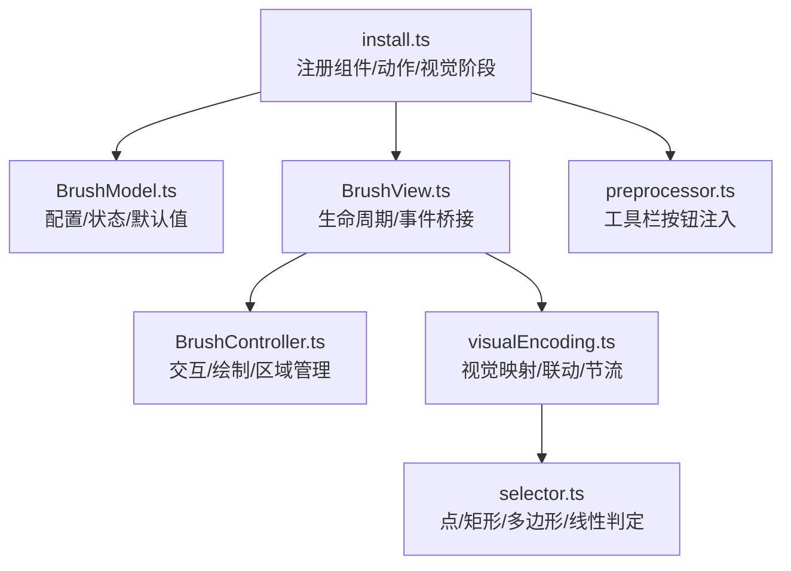
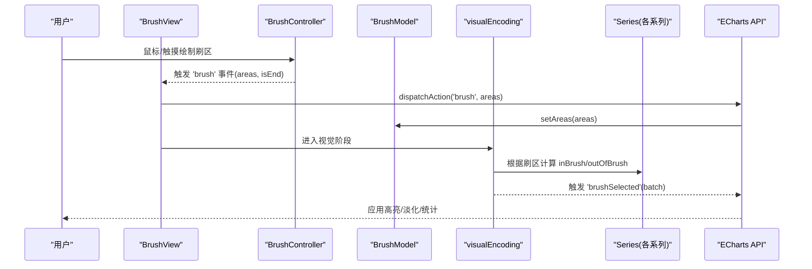
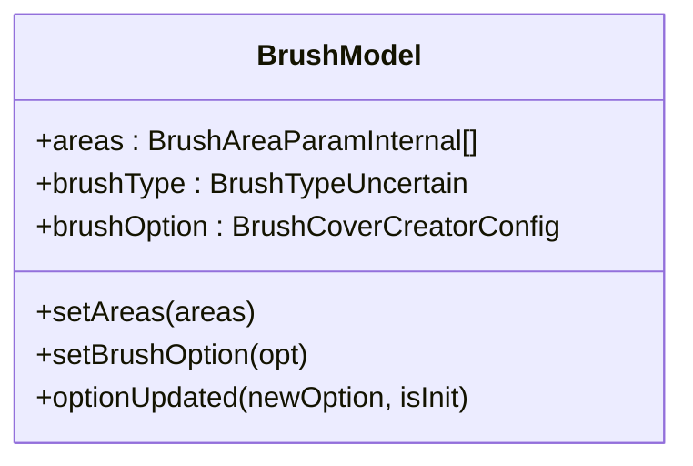
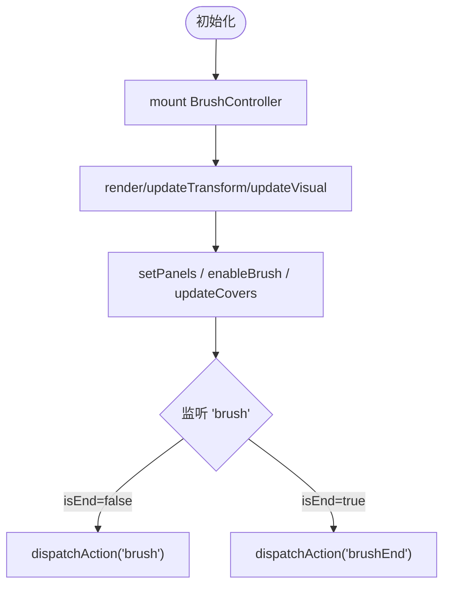
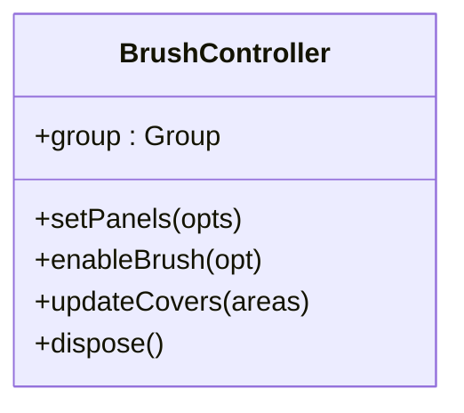
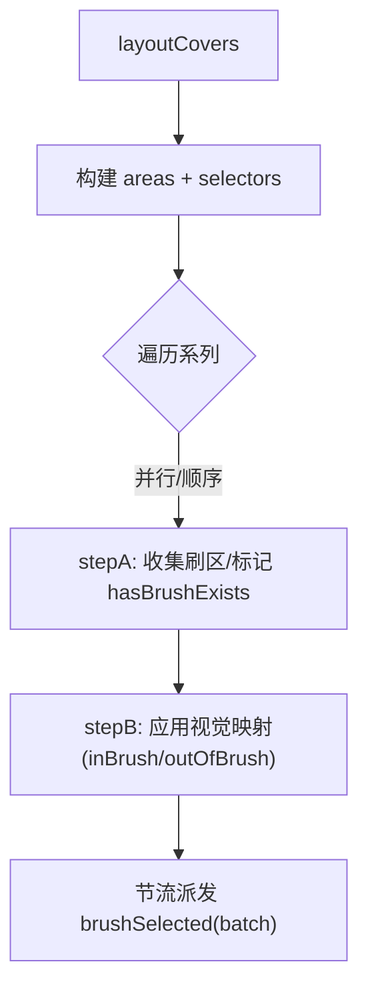
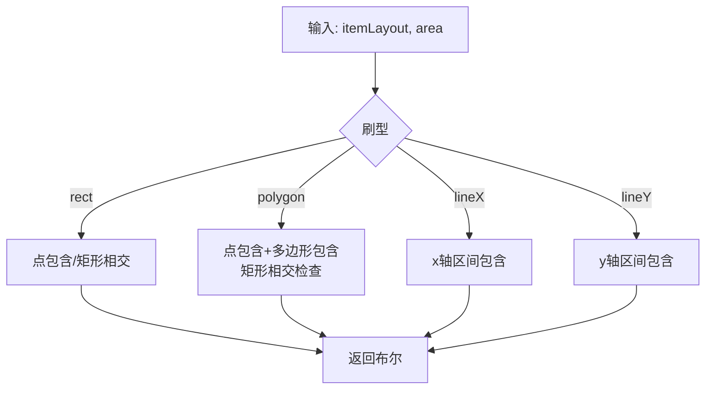
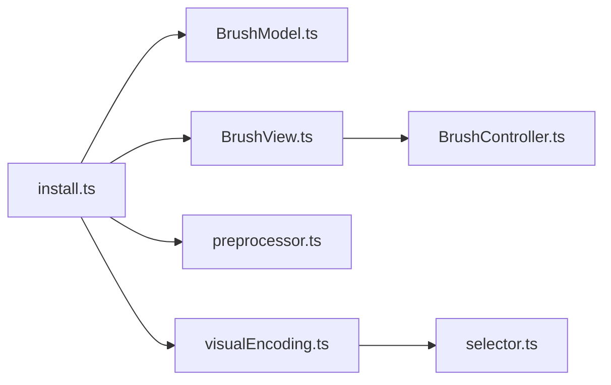

# 刷选组件 (Brush)

<cite>
**本文引用的文件**
- [src/component/brush.ts](file://src/component/brush.ts)
- [src/component/brush/install.ts](file://src/component/brush/install.ts)
- [src/component/brush/BrushModel.ts](file://src/component/brush/BrushModel.ts)
- [src/component/brush/BrushView.ts](file://src/component/brush/BrushView.ts)
- [src/component/brush/preprocessor.ts](file://src/component/brush/preprocessor.ts)
- [src/component/brush/visualEncoding.ts](file://src/component/brush/visualEncoding.ts)
- [src/component/brush/selector.ts](file://src/component/brush/selector.ts)
- [src/component/helper/BrushController.ts](file://src/component/helper/BrushController.ts)
- [test/brush.html](file://test/brush.html)
- [test/brush2.html](file://test/brush2.html)
</cite>

## 目录
1. [简介](#简介)
2. [项目结构](#项目结构)
3. [核心组件](#核心组件)
4. [架构总览](#架构总览)
5. [详细组件分析](#详细组件分析)
6. [依赖关系分析](#依赖关系分析)
7. [性能与大数据优化](#性能与大数据优化)
8. [故障排查指南](#故障排查指南)
9. [结论](#结论)
10. [附录：配置项与事件参考](#附录配置项与事件参考)

## 简介
本章节面向 ECharts 的“刷选组件（Brush）”，系统性阐述其实现原理、数据筛选机制、多模式刷选（矩形、自由多边形、线性）、配置选项、视觉编码、联动控制，以及与其它组件的集成方式（数据过滤、高亮显示、统计计算）。同时提供基于仓库测试用例的代码示例路径，覆盖基础刷选、多图表联动、动态更新与性能优化等场景。

## 项目结构
刷选能力由“组件模型 + 视图 + 控制器 + 视觉编码 + 选择器”共同构成，并通过预处理器与安装脚本完成注册与初始化。

**图示来源**
- [src/component/brush/install.ts:39-92](file://src/component/brush/install.ts#L39-L92)
- [src/component/brush/BrushModel.ts:129-251](file://src/component/brush/BrushModel.ts#L129-L251)
- [src/component/brush/BrushView.ts:31-113](file://src/component/brush/BrushView.ts#L31-L113)
- [src/component/helper/BrushController.ts:192-200](file://src/component/helper/BrushController.ts#L192-L200)
- [src/component/brush/visualEncoding.ts:61-239](file://src/component/brush/visualEncoding.ts#L61-L239)
- [src/component/brush/selector.ts:71-171](file://src/component/brush/selector.ts#L71-L171)
- [src/component/brush/preprocessor.ts:30-69](file://src/component/brush/preprocessor.ts#L30-L69)

**章节来源**
- [src/component/brush/install.ts:39-92](file://src/component/brush/install.ts#L39-L92)
- [src/component/brush/BrushModel.ts:129-251](file://src/component/brush/BrushModel.ts#L129-L251)
- [src/component/brush/BrushView.ts:31-113](file://src/component/brush/BrushView.ts#L31-L113)
- [src/component/helper/BrushController.ts:192-200](file://src/component/helper/BrushController.ts#L192-L200)
- [src/component/brush/visualEncoding.ts:61-239](file://src/component/brush/visualEncoding.ts#L61-L239)
- [src/component/brush/selector.ts:71-171](file://src/component/brush/selector.ts#L71-L171)
- [src/component/brush/preprocessor.ts:30-69](file://src/component/brush/preprocessor.ts#L30-L69)

## 核心组件
- 安装与注册
  - 通过 install.ts 注册组件视图与模型、预处理器、视觉阶段处理器以及 brush/brushSelect/brushEnd 动作。
- 模型层 BrushModel
  - 维护 areas（当前刷区）、brushOption（当前画笔配置）、默认样式与联动范围等；提供 setAreas/setBrushOption 等方法。
- 视图层 BrushView
  - 负责生命周期中更新控制器面板、启用刷选、同步区域，并将底层交互事件转换为 ECharts 动作。
- 控制器 BrushController
  - 封装画布交互、区域创建/更新、裁剪与命中检测、拖拽变换、事件派发等。
- 视觉编码 visualEncoding
  - 将刷区映射为 inBrush/outOfBrush 视觉状态，驱动系列高亮/淡化，并触发 brushSelected 事件（支持节流）。
- 选择器 selector
  - 针对不同刷型（rect/polygon/lineX/lineY）实现点/矩形的包含或相交判定。

**章节来源**
- [src/component/brush/install.ts:39-92](file://src/component/brush/install.ts#L39-L92)
- [src/component/brush/BrushModel.ts:129-251](file://src/component/brush/BrushModel.ts#L129-L251)
- [src/component/brush/BrushView.ts:31-113](file://src/component/brush/BrushView.ts#L31-L113)
- [src/component/helper/BrushController.ts:192-200](file://src/component/helper/BrushController.ts#L192-L200)
- [src/component/brush/visualEncoding.ts:61-239](file://src/component/brush/visualEncoding.ts#L61-L239)
- [src/component/brush/selector.ts:71-171](file://src/component/brush/selector.ts#L71-L171)

## 架构总览
刷选从用户交互到数据可视化的完整链路如下：

**图示来源**
- [src/component/brush/BrushView.ts:41-108](file://src/component/brush/BrushView.ts#L41-L108)
- [src/component/brush/install.ts:48-88](file://src/component/brush/install.ts#L48-L88)
- [src/component/brush/visualEncoding.ts:73-239](file://src/component/brush/visualEncoding.ts#L73-L239)

## 详细组件分析

### 模型层：BrushModel
- 职责
  - 维护刷区数组 areas、当前画笔配置 brushOption、默认样式与联动策略。
  - 合并用户传入与默认配置，生成内部可用对象。
- 关键流程
  - optionUpdated：处理 inBrush/outOfBrush 视觉选项替换与默认值填充。
  - setAreas：将外部 area 参数转为内部结构，保留 range 状态。
  - setBrushOption：设置当前画笔类型、样式、是否可变换、点击移除等。
- 复杂度
  - setAreas 对 areas 进行映射合并，时间复杂度 O(n)。

**图示来源**
- [src/component/brush/BrushModel.ts:129-251](file://src/component/brush/BrushModel.ts#L129-L251)

**章节来源**
- [src/component/brush/BrushModel.ts:129-251](file://src/component/brush/BrushModel.ts#L129-L251)

### 视图层：BrushView
- 职责
  - 初始化 BrushController，挂载事件监听。
  - 在 render/updateTransform/updateVisual 中同步面板、启用刷选、更新区域。
  - 将底层事件转换为 ECharts 动作（brush/brushEnd），避免重复派发。
- 关键点
  - updateTransform 强制布局以保障刷区位置正确。
  - _onBrush 中仅在非拖尾或 removeOnClick 时派发 brush 动作，确保动画流畅。

**图示来源**
- [src/component/brush/BrushView.ts:41-108](file://src/component/brush/BrushView.ts#L41-L108)

**章节来源**
- [src/component/brush/BrushView.ts:41-108](file://src/component/brush/BrushView.ts#L41-L108)

### 控制器：BrushController
- 职责
  - 管理画布交互（绘制、拖拽、缩放、删除）。
  - 维护面板（panel）与裁剪路径，保证刷区只在目标坐标系内可见。
  - 输出 areas（像素坐标范围）供上层转换与使用。
- 重要概念
  - BrushType：rect/polygon/lineX/lineY。
  - BrushMode：single/multiple。
  - BrushPanelConfig：定义裁剪、命中判断、默认刷型等。
- 事件
  - 内部事件 'brush' 携带 areas、isEnd、removeOnClick。

**图示来源**
- [src/component/helper/BrushController.ts:192-200](file://src/component/helper/BrushController.ts#L192-L200)

**章节来源**
- [src/component/helper/BrushController.ts:192-200](file://src/component/helper/BrushController.ts#L192-L200)

### 视觉编码：visualEncoding
- 职责
  - 为每个刷组件计算 areas 的边界框与选择器。
  - 遍历所有系列，按 brushLink 策略计算选中索引集合。
  - 应用 inBrush/outOfBrush 视觉映射，批量更新系列可视化。
  - 节流派发 brushSelected 事件，避免频繁重绘。
- 算法要点
  - Step A：收集受控系列的刷区信息，记录 hasBrushExists。
  - Step B：按系列应用视觉映射，收集 selected.dataIndex。
  - 节流：基于 fixRate/debounce 两种策略。

**图示来源**
- [src/component/brush/visualEncoding.ts:61-239](file://src/component/brush/visualEncoding.ts#L61-L239)

**章节来源**
- [src/component/brush/visualEncoding.ts:61-239](file://src/component/brush/visualEncoding.ts#L61-L239)

### 选择器：selector
- 职责
  - 针对 rect/polygon/lineX/lineY 四种刷型，实现点与矩形元素的包含/相交判定。
- 实现要点
  - rect：点包含、矩形相交。
  - polygon：点包含 + 多边形包含；矩形相交通过顶点与边相交判定。
  - lineX/lineY：一维区间包含判定。

**图示来源**
- [src/component/brush/selector.ts:71-171](file://src/component/brush/selector.ts#L71-L171)

**章节来源**
- [src/component/brush/selector.ts:71-171](file://src/component/brush/selector.ts#L71-L171)

### 预处理器：preprocessor
- 职责
  - 自动注入工具箱中的刷选按钮类型，去重并补齐默认按钮。
- 行为
  - 若未显式配置 toolbox.feature.brush.type，则注入默认按钮集。

**章节来源**
- [src/component/brush/preprocessor.ts:30-69](file://src/component/brush/preprocessor.ts#L30-L69)

## 依赖关系分析
- 模块耦合
  - install.ts 作为入口，聚合注册 Model/View/Preprocessor/VisualStage/Actions。
  - BrushView 依赖 BrushController 与 visualEncoding。
  - visualEncoding 依赖 selector 与 BrushTargetManager（用于面板与系列控制）。
  - BrushModel 依赖 BrushTargetManager 与视觉方案。
- 外部依赖
  - zrender 图形库用于几何计算与渲染。
  - 视觉 tokens 提供默认颜色与样式。

**图示来源**
- [src/component/brush/install.ts:39-92](file://src/component/brush/install.ts#L39-L92)
- [src/component/brush/BrushView.ts:31-113](file://src/component/brush/BrushView.ts#L31-L113)
- [src/component/brush/visualEncoding.ts:61-239](file://src/component/brush/visualEncoding.ts#L61-L239)
- [src/component/brush/selector.ts:71-171](file://src/component/brush/selector.ts#L71-L171)
- [src/component/brush/preprocessor.ts:30-69](file://src/component/brush/preprocessor.ts#L30-L69)

**章节来源**
- [src/component/brush/install.ts:39-92](file://src/component/brush/install.ts#L39-L92)
- [src/component/brush/BrushView.ts:31-113](file://src/component/brush/BrushView.ts#L31-L113)
- [src/component/brush/visualEncoding.ts:61-239](file://src/component/brush/visualEncoding.ts#L61-L239)
- [src/component/brush/selector.ts:71-171](file://src/component/brush/selector.ts#L71-L171)
- [src/component/brush/preprocessor.ts:30-69](file://src/component/brush/preprocessor.ts#L30-L69)

## 性能与大数据优化
- 事件节流
  - 通过 throttleType（fixRate/debounce）与 throttleDelay 控制 brushSelected 频率，减少高频更新带来的开销。
- 视觉映射批处理
  - 使用 createVisualMappings 与 applyVisual 批量应用 inBrush/outOfBrush，降低逐条更新的成本。
- 选择器高效判定
  - 针对 rect/polygon/lineX/lineY 的几何判定尽量使用轻量函数，避免不必要的对象分配。
- 联动范围控制
  - 通过 brushLink 与 seriesIndex 限制参与联动的系列，减少不必要遍历。
- 大数据建议
  - 合理设置 brushLink 与 seriesIndex，仅对必要系列执行视觉映射。
  - 结合 dataZoom 缩小数据规模后再刷选。
  - 关闭不必要的动画与标签以提升交互响应。

[本节为通用指导，不直接分析具体文件]

## 故障排查指南
- 刷选无响应
  - 确认已注册 brush 组件与工具栏按钮；检查是否在正确的坐标系（grid/geo/parallel）上启用。
  - 查看 BrushView 是否正确 mount 控制器并监听事件。
- 联动失效
  - 检查 brushLink 与 seriesIndex 配置；确认系列实现了 brushSelector。
- 事件过多导致卡顿
  - 调整 throttleType/throttleDelay；或在事件中做防抖/节流。
- 刷区位置异常
  - 确保 updateTransform 被调用以重新布局；检查面板裁剪路径是否正确。

**章节来源**
- [src/component/brush/BrushView.ts:56-78](file://src/component/brush/BrushView.ts#L56-L78)
- [src/component/brush/visualEncoding.ts:241-296](file://src/component/brush/visualEncoding.ts#L241-L296)

## 结论
ECharts 刷选组件通过清晰的模型-视图-控制器分层，配合强大的视觉编码与选择器，实现了多种刷选模式与灵活的联动控制。借助节流与批处理机制，可在大数据场景下保持良好交互体验。结合测试用例，可快速上手基础与高级用法。

[本节为总结性内容，不直接分析具体文件]

## 附录：配置项与事件参考

- 常用配置项（节选）
  - brushType：rect/polygon/lineX/lineY/false/auto
  - brushMode：single/multiple
  - brushStyle：边框宽度、填充色、边框色等
  - transformable：是否可拖拽/缩放
  - removeOnClick：点击是否移除刷区
  - brushLink：all/none/数字数组，控制联动范围
  - seriesIndex：指定受控系列
  - throttleType：fixRate/debounce
  - throttleDelay：节流延迟（ms）
  - inBrush/outOfBrush：刷区内外的视觉编码

- 主要事件
  - brush：刷区变化时触发（含 areas、isEnd、removeOnClick）
  - brushSelected：刷选结果（包含各系列 dataIndex）
  - brushEnd：拖拽结束事件

- 代码示例路径
  - 基础散点图刷选与统计：[test/brush.html](file://test/brush.html)
  - K线图/折线/柱状图联动刷选：[test/brush2.html](file://test/brush2.html)

**章节来源**
- [src/component/brush/BrushModel.ts:92-151](file://src/component/brush/BrushModel.ts#L92-L151)
- [src/component/helper/BrushController.ts:43-93](file://src/component/helper/BrushController.ts#L43-L93)
- [src/component/brush/install.ts:48-88](file://src/component/brush/install.ts#L48-L88)
- [test/brush.html:231-349](file://test/brush.html#L231-L349)
- [test/brush2.html:211-422](file://test/brush2.html#L211-L422)