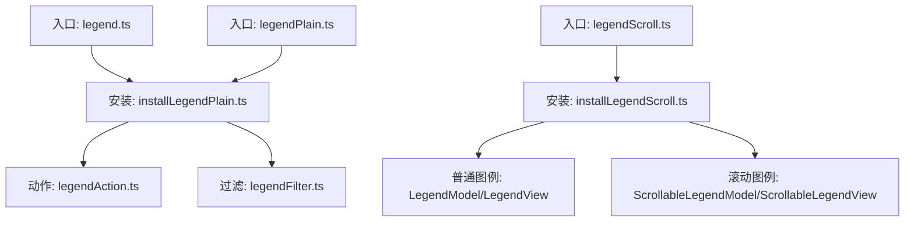
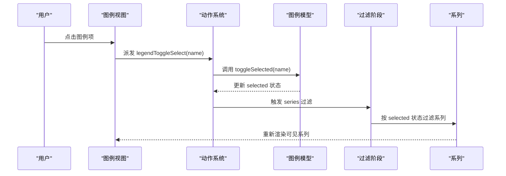
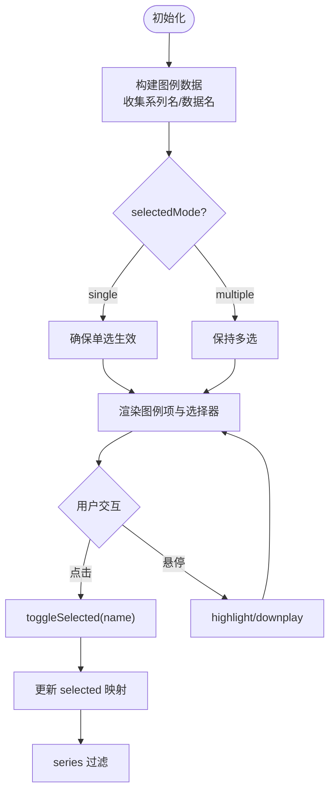
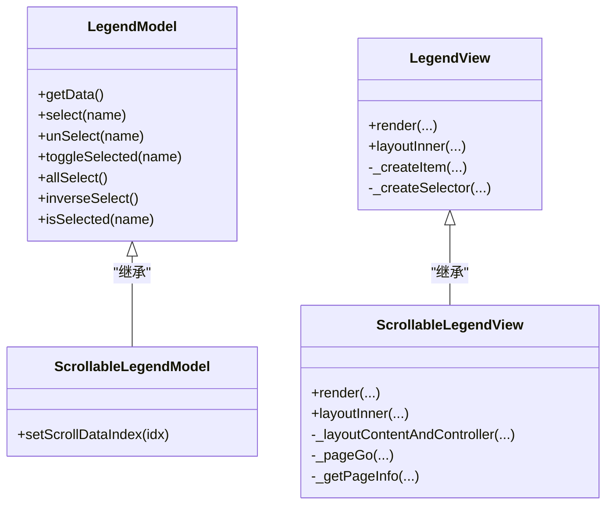
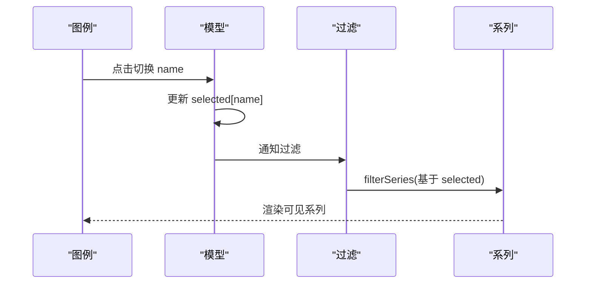
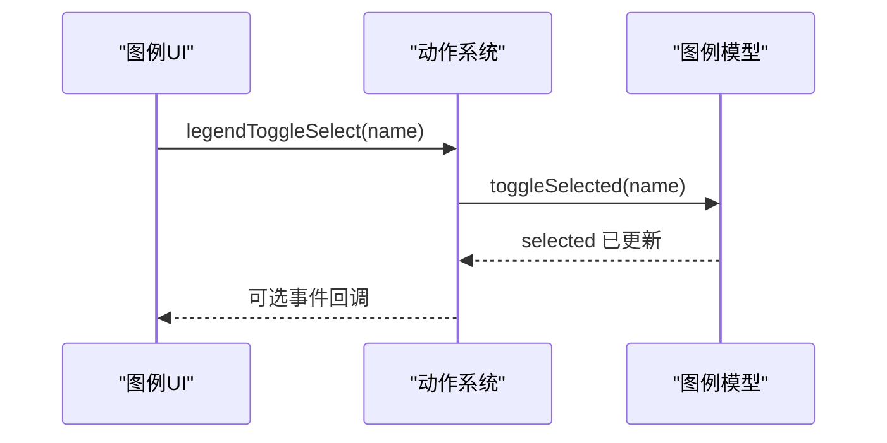
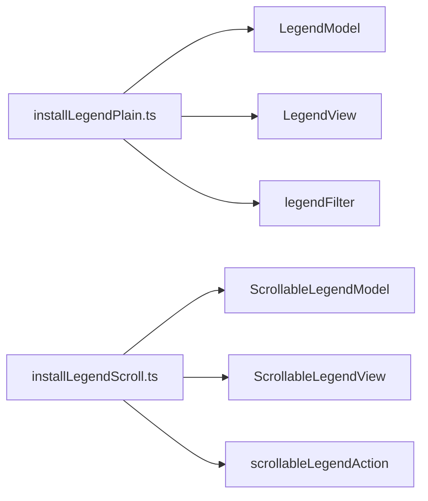

# 图例组件 (Legend)

<cite>
**本文引用的文件**
- [src/component/legend.ts](file://src/component/legend.ts)
- [src/component/legendPlain.ts](file://src/component/legendPlain.ts)
- [src/component/legendScroll.ts](file://src/component/legendScroll.ts)
- [src/component/legend/LegendModel.ts](file://src/component/legend/LegendModel.ts)
- [src/component/legend/LegendView.ts](file://src/component/legend/LegendView.ts)
- [src/component/legend/ScrollableLegendModel.ts](file://src/component/legend/ScrollableLegendModel.ts)
- [src/component/legend/ScrollableLegendView.ts](file://src/component/legend/ScrollableLegendView.ts)
- [src/component/legend/installLegendPlain.ts](file://src/component/legend/installLegendPlain.ts)
- [src/component/legend/installLegendScroll.ts](file://src/component/legend/installLegendScroll.ts)
- [src/component/legend/legendAction.ts](file://src/component/legend/legendAction.ts)
- [src/component/legend/legendFilter.ts](file://src/component/legend/legendFilter.ts)
- [test/legend.html](file://test/legend.html)
- [test/legend-style.html](file://test/legend-style.html)
</cite>

## 目录
1. [简介](#简介)
2. [项目结构](#项目结构)
3. [核心组件](#核心组件)
4. [架构总览](#架构总览)
5. [详细组件分析](#详细组件分析)
6. [依赖关系分析](#依赖关系分析)
7. [性能考虑](#性能考虑)
8. [故障排查指南](#故障排查指南)
9. [结论](#结论)
10. [附录：配置项速查与示例路径](#附录：配置项速查与示例路径)

## 简介
ECharts 的图例（Legend）用于展示并控制图表系列的可见性与交互状态。它支持普通图例（Plain Legend）和可滚动图例（Scrollable Legend），提供丰富的样式、布局、选择模式、过滤联动以及事件处理能力，帮助用户快速理解数据维度并进行交互式筛选。

## 项目结构
图例组件采用“模型-视图”分离与插件化安装的组织方式：
- 入口注册：分别通过 legend.ts、legendPlain.ts、legendScroll.ts 暴露安装入口，按需引入以减少包体积。
- 普通图例：由 LegendModel + LegendView 实现，负责数据解析、默认选项、渲染与布局。
- 可滚动图例：在普通图例基础上扩展 ScrollableLegendModel + ScrollableLegendView，增加分页控制器与滚动动画。
- 动作与过滤器：通过 legendAction.ts 注册选择类动作；通过 legendFilter.ts 将图例选择状态映射为系列过滤逻辑。
- 安装器：installLegendPlain.ts 与 installLegendScroll.ts 完成组件模型/视图注册、处理器注入与子类型默认值设置。

**图示来源**
- [src/component/legend.ts:20-25](file://src/component/legend.ts#L20-L25)
- [src/component/legendPlain.ts:20-25](file://src/component/legendPlain.ts#L20-L25)
- [src/component/legendScroll.ts:20-27](file://src/component/legendScroll.ts#L20-L27)
- [src/component/legend/installLegendPlain.ts:26-36](file://src/component/legend/installLegendPlain.ts#L26-L36)
- [src/component/legend/installLegendScroll.ts:26-33](file://src/component/legend/installLegendScroll.ts#L26-L33)

**章节来源**
- [src/component/legend.ts:20-25](file://src/component/legend.ts#L20-L25)
- [src/component/legendPlain.ts:20-25](file://src/component/legendPlain.ts#L20-L25)
- [src/component/legendScroll.ts:20-27](file://src/component/legendScroll.ts#L20-L27)
- [src/component/legend/installLegendPlain.ts:26-36](file://src/component/legend/installLegendPlain.ts#L26-L36)
- [src/component/legend/installLegendScroll.ts:26-33](file://src/component/legend/installLegendScroll.ts#L26-L33)

## 核心组件
- 普通图例（Plain Legend）
  - 职责：解析系列名称或数据名生成图例项；根据 selectedMode 管理选中状态；渲染图标、文本、背景与选择器按钮；处理点击/悬停事件并派发高亮/弱化动作。
  - 关键能力：位置与布局（box）、对齐方式、方向、选择器（全选/反选）、富文本与样式继承、tooltip 支持。
- 可滚动图例（Scrollable Legend）
  - 职责：在普通图例基础上计算分页、绘制翻页控件、执行内容平移动画、裁剪溢出区域。
  - 关键能力：页码显示、前后翻页、页面按钮位置、图标尺寸与颜色、更新动画时长等。

**章节来源**
- [src/component/legend/LegendModel.ts:245-543](file://src/component/legend/LegendModel.ts#L245-L543)
- [src/component/legend/LegendView.ts:61-759](file://src/component/legend/LegendView.ts#L61-L759)
- [src/component/legend/ScrollableLegendModel.ts:31-124](file://src/component/legend/ScrollableLegendModel.ts#L31-L124)
- [src/component/legend/ScrollableLegendView.ts:72-553](file://src/component/legend/ScrollableLegendView.ts#L72-L553)

## 架构总览
图例组件遵循“模型驱动视图”的架构：
- Model 层负责配置合并、数据构建、选择状态管理与业务规则（如单选模式）。
- View 层负责 DOM/SVG/Canvas 元素创建、布局计算、事件绑定与渲染。
- Action 层统一处理用户交互（切换、全选、反选、滚动翻页）并同步到所有图例实例。
- Filter 层将图例选择状态转换为系列过滤条件，影响最终渲染的数据集。

**图示来源**
- [src/component/legend/LegendView.ts:709-756](file://src/component/legend/LegendView.ts#L709-L756)
- [src/component/legend/legendAction.ts:28-72](file://src/component/legend/legendAction.ts#L28-L72)
- [src/component/legend/legendFilter.ts:28-45](file://src/component/legend/legendFilter.ts#L28-L45)

## 详细组件分析

### 普通图例（Plain Legend）
- 数据构建
  - 遍历原始系列，收集 series.name 或 legendVisualProvider 提供的数据名，去重后形成图例数据。
  - 若未显式配置 data，则使用潜在数据名集合。
- 选择模式
  - selectedMode: false | 'single' | 'multiple'
  - single 模式下自动保证仅一项被选中；toggle/select/unSelect/allSelect/inverseSelect 等方法维护 selected 映射。
- 渲染与布局
  - 根据 orient 与 align 决定排列方向与对齐；支持 itemGap、itemWidth/Height、padding、borderRadius 等。
  - 支持 selector 按钮组（全选/反选），可配置位置与间距。
  - 支持 tooltip、triggerEvent、rich text 等。
- 事件与联动
  - 点击图例项触发 legendToggleSelect；鼠标进入/离开触发 highlight/downplay。
  - 通过 legendFilter 将选中状态映射为系列过滤结果。

**图示来源**
- [src/component/legend/LegendModel.ts:318-440](file://src/component/legend/LegendModel.ts#L318-L440)
- [src/component/legend/LegendView.ts:174-325](file://src/component/legend/LegendView.ts#L174-L325)
- [src/component/legend/legendFilter.ts:28-45](file://src/component/legend/legendFilter.ts#L28-L45)

**章节来源**
- [src/component/legend/LegendModel.ts:245-543](file://src/component/legend/LegendModel.ts#L245-L543)
- [src/component/legend/LegendView.ts:61-759](file://src/component/legend/LegendView.ts#L61-L759)
- [src/component/legend/legendFilter.ts:28-45](file://src/component/legend/legendFilter.ts#L28-L45)

### 可滚动图例（Scrollable Legend）
- 新增能力
  - 分页控制器：上一页/下一页按钮与页码文本。
  - 自动检测是否需要滚动：当内容宽度/高度超过容器时显示控制器。
  - 裁剪与动画：对内容容器设置裁剪矩形，并在翻页时执行平移动画。
- 关键配置
  - scrollDataIndex：初始滚动目标索引。
  - pageButtonPosition：控制器位置（start/end）。
  - pageIcons/pageIconColor/pageIconInactiveColor/pageIconSize：翻页图标样式。
  - pageFormatter：页码格式化函数或模板字符串。
  - animationDurationUpdate：翻页动画时长。
- 布局与计算
  - 基于当前可视区域与每项边界计算分页区间，确定前一页/下一页的目标索引。
  - 保持控制器与内容垂直/水平居中对齐。

**图示来源**
- [src/component/legend/LegendModel.ts:245-543](file://src/component/legend/LegendModel.ts#L245-L543)
- [src/component/legend/LegendView.ts:61-759](file://src/component/legend/LegendView.ts#L61-L759)
- [src/component/legend/ScrollableLegendModel.ts:31-124](file://src/component/legend/ScrollableLegendModel.ts#L31-L124)
- [src/component/legend/ScrollableLegendView.ts:72-553](file://src/component/legend/ScrollableLegendView.ts#L72-L553)

**章节来源**
- [src/component/legend/ScrollableLegendModel.ts:31-124](file://src/component/legend/ScrollableLegendModel.ts#L31-L124)
- [src/component/legend/ScrollableLegendView.ts:72-553](file://src/component/legend/ScrollableLegendView.ts#L72-L553)

### 图例与系列的关联机制
- 关联依据
  - 通过 series.name 或 legendVisualProvider 提供的数据名建立映射。
  - 若未指定 legend.data，则自动从系列中推导可用名称。
- 状态同步
  - 图例选中状态保存在 model.option.selected 中。
  - 过滤阶段根据每个图例的 isSelected(seriesName) 决定是否保留该系列。
- 多图例一致性
  - 动作处理器会同步所有图例的选中状态，避免不一致。

**图示来源**
- [src/component/legend/LegendModel.ts:318-440](file://src/component/legend/LegendModel.ts#L318-L440)
- [src/component/legend/legendFilter.ts:28-45](file://src/component/legend/legendFilter.ts#L28-L45)
- [src/component/legend/legendAction.ts:28-72](file://src/component/legend/legendAction.ts#L28-L72)

**章节来源**
- [src/component/legend/LegendModel.ts:318-440](file://src/component/legend/LegendModel.ts#L318-L440)
- [src/component/legend/legendFilter.ts:28-45](file://src/component/legend/legendFilter.ts#L28-L45)
- [src/component/legend/legendAction.ts:28-72](file://src/component/legend/legendAction.ts#L28-L72)

### 事件处理与动作
- 图例项点击
  - 派发 legendToggleSelect，随后触发 highlight/downplay 以即时反馈。
- 选择器按钮
  - 全选/反选按钮派发 legendAllSelect / legendInverseSelect。
- 滚动翻页
  - 翻页按钮派发 legendScroll，携带目标索引与图例标识。
- 事件回传
  - 可通过 triggerEvent 将图例事件包装为标准事件对象，便于上层监听。

**图示来源**
- [src/component/legend/LegendView.ts:709-756](file://src/component/legend/LegendView.ts#L709-L756)
- [src/component/legend/legendAction.ts:94-139](file://src/component/legend/legendAction.ts#L94-L139)
- [src/component/legend/ScrollableLegendView.ts:350-362](file://src/component/legend/ScrollableLegendView.ts#L350-L362)

**章节来源**
- [src/component/legend/LegendView.ts:709-756](file://src/component/legend/LegendView.ts#L709-L756)
- [src/component/legend/legendAction.ts:94-139](file://src/component/legend/legendAction.ts#L94-L139)
- [src/component/legend/ScrollableLegendView.ts:350-362](file://src/component/legend/ScrollableLegendView.ts#L350-L362)

## 依赖关系分析
- 组件注册与依赖
  - 普通图例：注册模型/视图、系列过滤处理器、子类型默认值为 plain。
  - 滚动图例：复用普通图例安装，再注册滚动模型/视图与滚动动作。
- 外部依赖
  - 布局工具：box 布局、参考容器计算。
  - 图形库：zrender 图形元素与工具。
  - 视觉令牌：tokens 提供默认色板与尺寸。

**图示来源**
- [src/component/legend/installLegendPlain.ts:26-36](file://src/component/legend/installLegendPlain.ts#L26-L36)
- [src/component/legend/installLegendScroll.ts:26-33](file://src/component/legend/installLegendScroll.ts#L26-L33)

**章节来源**
- [src/component/legend/installLegendPlain.ts:26-36](file://src/component/legend/installLegendPlain.ts#L26-L36)
- [src/component/legend/installLegendScroll.ts:26-33](file://src/component/legend/installLegendScroll.ts#L26-L33)

## 性能考虑
- 按需加载
  - 使用 legendPlain.ts 与 legendScroll.ts 分别引入，避免打包冗余代码。
- 减少重绘
  - 首次渲染标记 _isFirstRender，避免不必要的初始位置动画。
  - 滚动翻页仅在需要时启用裁剪与动画，非滚动场景隐藏控制器。
- 布局优化
  - 使用 box 布局批量计算，减少多次测量。
  - 合理设置 itemGap、itemWidth/Height，避免过多换行导致重排。
- 事件与过滤
  - 合理使用 triggerEvent，避免过度事件分发。
  - 图例过滤在整体阶段执行，尽量集中变更，减少中间态。

[本节为通用指导，不直接分析具体文件]

## 故障排查指南
- 图例项不显示
  - 检查 series.name 是否与 legend.data 一致；若无 data，确认系列是否提供 legendVisualProvider。
  - 查看控制台警告信息（开发模式）提示名称不存在。
- 选择状态不同步
  - 确认多个图例实例间是否通过动作系统同步；检查 selected 映射是否正确更新。
- 滚动翻页异常
  - 检查 scrollDataIndex 是否越界；确认容器尺寸与内容尺寸关系，必要时调整 pageButtonPosition 或尺寸。
- 样式不生效
  - 注意 inherit/auto 的继承规则；确保 itemStyle/lineStyle/textStyle 正确设置。

**章节来源**
- [src/component/legend/LegendView.ts:313-319](file://src/component/legend/LegendView.ts#L313-L319)
- [src/component/legend/legendAction.ts:28-72](file://src/component/legend/legendAction.ts#L28-L72)
- [src/component/legend/ScrollableLegendView.ts:524-549](file://src/component/legend/ScrollableLegendView.ts#L524-L549)

## 结论
ECharts 图例组件通过清晰的模型-视图分层、可扩展的动作系统与过滤机制，提供了强大的系列可视化与交互控制能力。普通图例适用于常规场景，可滚动图例则在大量图例项时显著提升可用性。结合丰富的样式与事件能力，开发者可以灵活定制图例以满足多样化需求。

[本节为总结性内容，不直接分析具体文件]

## 附录：配置项速查与示例路径
- 基础配置
  - show、orient、align、left/right/top/bottom、backgroundColor、borderRadius、padding、itemGap、itemWidth、itemHeight
  - 参考路径：[src/component/legend/LegendModel.ts:450-539](file://src/component/legend/LegendModel.ts#L450-L539)
- 样式配置
  - icon、inactiveColor、inactiveBorderColor、inactiveBorderWidth、formatter、itemStyle、lineStyle、textStyle、symbolRotate、symbolKeepAspect
  - 参考路径：[src/component/legend/LegendModel.ts:89-126](file://src/component/legend/LegendModel.ts#L89-L126)
- 选择与过滤
  - selectedMode、selected、selector、selectorLabel、emphasis.selectorLabel、selectorPosition、selectorItemGap、selectorButtonGap
  - 参考路径：[src/component/legend/LegendModel.ts:201-234](file://src/component/legend/LegendModel.ts#L201-L234)
- 滚动图例专属
  - scrollDataIndex、pageButtonItemGap、pageButtonGap、pageButtonPosition、pageFormatter、pageIcons、pageIconColor、pageIconInactiveColor、pageIconSize、pageTextStyle、animationDurationUpdate
  - 参考路径：[src/component/legend/ScrollableLegendModel.ts:31-54](file://src/component/legend/ScrollableLegendModel.ts#L31-L54)
- 事件与交互
  - triggerEvent、tooltip、点击/悬停事件、legendToggleSelect/legendAllSelect/legendInverseSelect/legendScroll
  - 参考路径：[src/component/legend/LegendView.ts:236-248](file://src/component/legend/LegendView.ts#L236-L248)、[src/component/legend/legendAction.ts:94-139](file://src/component/legend/legendAction.ts#L94-L139)、[src/component/legend/ScrollableLegendView.ts:350-362](file://src/component/legend/ScrollableLegendView.ts#L350-L362)
- 示例与演示
  - 普通/滚动图例、样式定制、选择器按钮、响应式布局等
  - 参考路径：[test/legend.html](file://test/legend.html)、[test/legend-style.html](file://test/legend-style.html)

[本节为配置速查与示例指引，不直接分析具体文件]