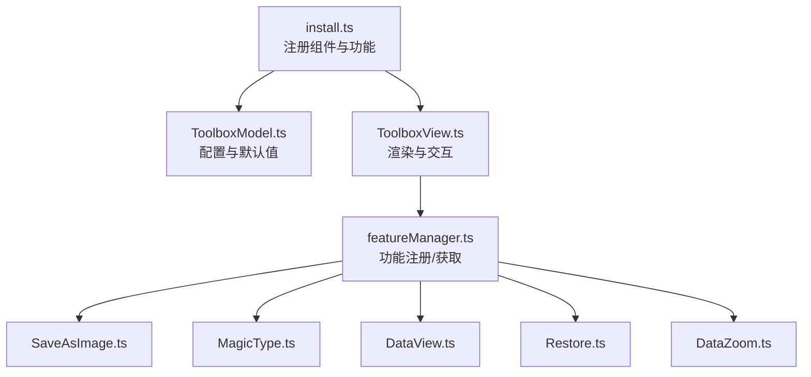
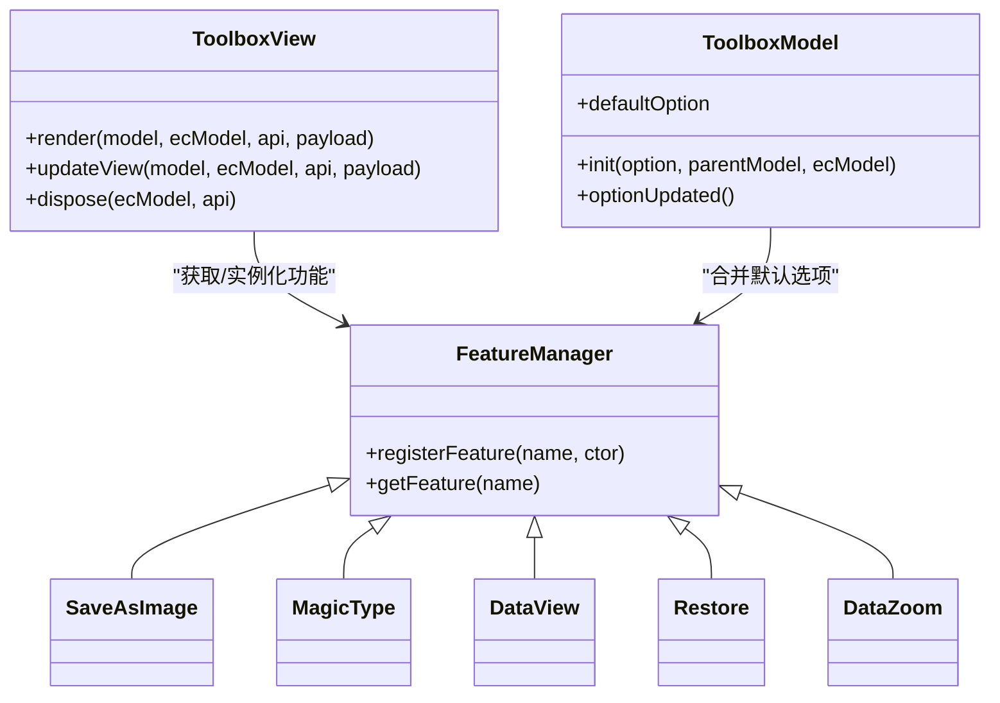
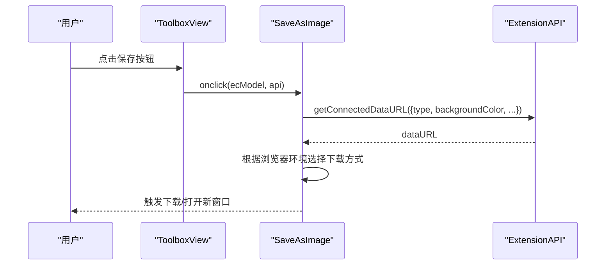
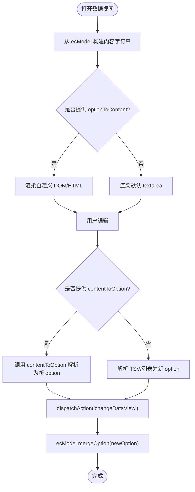
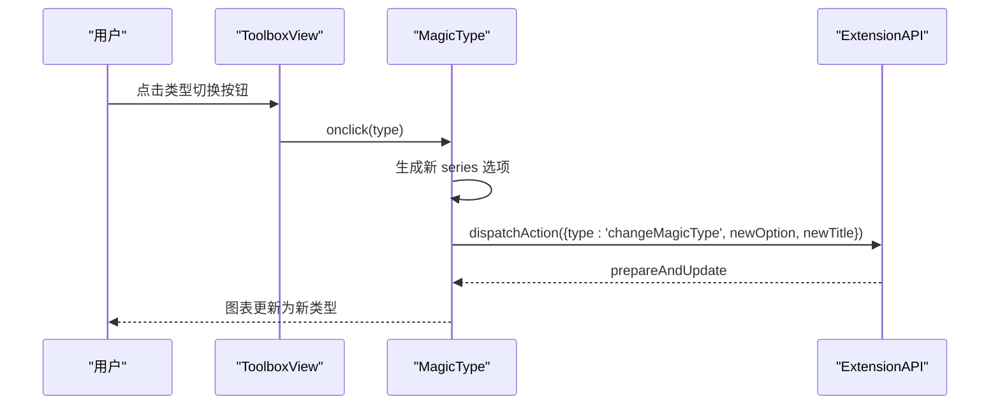
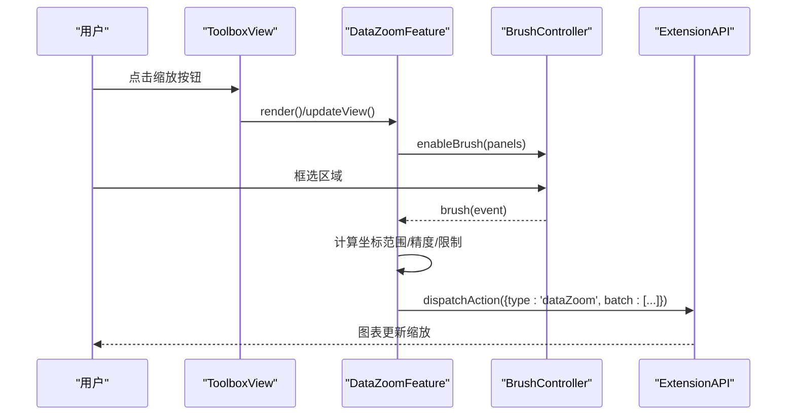
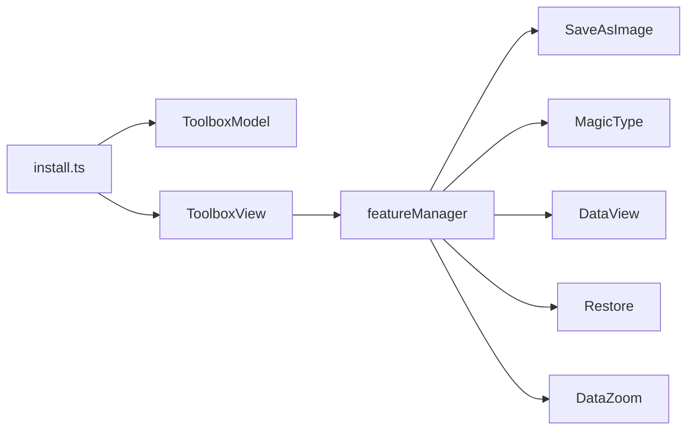

# 工具栏组件 (Toolbox)

<cite>
**本文引用的文件**
- [src/component/toolbox.ts](file://src/component/toolbox.ts)
- [src/component/toolbox/install.ts](file://src/component/toolbox/install.ts)
- [src/component/toolbox/ToolboxModel.ts](file://src/component/toolbox/ToolboxModel.ts)
- [src/component/toolbox/ToolboxView.ts](file://src/component/toolbox/ToolboxView.ts)
- [src/component/toolbox/featureManager.ts](file://src/component/toolbox/featureManager.ts)
- [src/component/toolbox/feature/SaveAsImage.ts](file://src/component/toolbox/feature/SaveAsImage.ts)
- [src/component/toolbox/feature/MagicType.ts](file://src/component/toolbox/feature/MagicType.ts)
- [src/component/toolbox/feature/DataView.ts](file://src/component/toolbox/feature/DataView.ts)
- [src/component/toolbox/feature/Restore.ts](file://src/component/toolbox/feature/Restore.ts)
- [src/component/toolbox/feature/DataZoom.ts](file://src/component/toolbox/feature/DataZoom.ts)
- [test/toolbox-custom.html](file://test/toolbox-custom.html)
- [test/toolbox-stack.html](file://test/toolbox-stack.html)
</cite>

## 目录
1. [简介](#简介)
2. [项目结构](#项目结构)
3. [核心组件](#核心组件)
4. [架构总览](#架构总览)
5. [详细组件分析](#详细组件分析)
6. [依赖关系分析](#依赖关系分析)
7. [性能考量](#性能考量)
8. [故障排查指南](#故障排查指南)
9. [结论](#结论)
10. [附录](#附录)

## 简介
本文件系统性梳理 ECharts 工具栏（Toolbox）组件的架构与扩展机制，覆盖内置功能实现原理、配置项说明、事件处理流程、自定义按钮开发方法、样式与国际化支持，以及用户体验优化建议与最佳实践。读者可据此快速掌握如何按需启用、定制和扩展工具栏能力。

## 项目结构
工具栏由“模型 + 视图 + 功能管理器 + 内置功能”构成：
- 入口注册：在组件安装时注册模型与视图，并注册内置功能。
- 模型层：负责解析配置、合并主题与默认选项、维护 feature 列表。
- 视图层：负责布局、图标渲染、提示文字、事件绑定与更新。
- 功能管理：统一注册/获取功能类，定义功能接口契约。
- 内置功能：保存图片、数据视图、还原、类型切换、数据缩放等。

图表来源
- [src/component/toolbox/install.ts:33-44](file://src/component/toolbox/install.ts#L33-L44)
- [src/component/toolbox/ToolboxModel.ts:88-141](file://src/component/toolbox/ToolboxModel.ts#L88-L141)
- [src/component/toolbox/ToolboxView.ts:66-179](file://src/component/toolbox/ToolboxView.ts#L66-L179)
- [src/component/toolbox/featureManager.ts:114-122](file://src/component/toolbox/featureManager.ts#L114-L122)

章节来源
- [src/component/toolbox/install.ts:33-44](file://src/component/toolbox/install.ts#L33-L44)
- [src/component/toolbox/ToolboxModel.ts:88-141](file://src/component/toolbox/ToolboxModel.ts#L88-L141)
- [src/component/toolbox/ToolboxView.ts:66-179](file://src/component/toolbox/ToolboxView.ts#L66-L179)
- [src/component/toolbox/featureManager.ts:114-122](file://src/component/toolbox/featureManager.ts#L114-L122)

## 核心组件
- 模型（ToolboxModel）
  - 负责 toolbox 的配置解析、主题合并、feature 默认选项注入。
  - 关键行为：optionUpdated 中为每个已声明的 feature 合并其默认选项与主题配置。
- 视图（ToolboxView）
  - 负责根据 orient 进行布局、创建图标元素、绑定 hover/点击事件、生成 tooltip。
  - 使用 DataDiffer 对 feature 集合做增删改差量更新，避免重复创建。
  - 支持用户自定义功能（my* 命名约定）。
- 功能管理器（featureManager）
  - 提供 registerFeature/getFeature 以注册与获取功能类。
  - 定义功能接口：getIcons、onclick、render、updateView、dispose 等。
- 安装器（install）
  - 注册组件模型/视图，并注册内置功能 saveAsImage、magicType、dataView、restore、dataZoom。

章节来源
- [src/component/toolbox/ToolboxModel.ts:88-141](file://src/component/toolbox/ToolboxModel.ts#L88-L141)
- [src/component/toolbox/ToolboxView.ts:66-179](file://src/component/toolbox/ToolboxView.ts#L66-L179)
- [src/component/toolbox/featureManager.ts:70-122](file://src/component/toolbox/featureManager.ts#L70-L122)
- [src/component/toolbox/install.ts:33-44](file://src/component/toolbox/install.ts#L33-L44)

## 架构总览
工具栏采用“模型-视图-功能”解耦设计：
- 模型只关心配置与默认值；视图负责 UI 与交互；功能模块专注业务逻辑。
- 通过功能管理器统一注册与分发，便于扩展与复用。
- 视图在渲染阶段将 feature 实例化或复用，并注入 model/ecModel/api。

图表来源
- [src/component/toolbox/ToolboxModel.ts:88-141](file://src/component/toolbox/ToolboxModel.ts#L88-L141)
- [src/component/toolbox/ToolboxView.ts:66-179](file://src/component/toolbox/ToolboxView.ts#L66-L179)
- [src/component/toolbox/featureManager.ts:114-122](file://src/component/toolbox/featureManager.ts#L114-L122)

## 详细组件分析

### 配置项与布局
- 容器与布局
  - show：是否显示工具栏。
  - orient：布局方向（水平/垂直）。
  - left/top/right/bottom：定位。
  - padding：内边距。
  - itemSize/itemGap：图标尺寸与间距。
  - backgroundColor/borderRadius/borderColor/borderWidth：背景与边框。
  - z/zlevel：层级控制。
- 样式与提示
  - iconStyle/emphasis.iconStyle：图标样式与强调态样式。
  - textStyle：文本样式。
  - showTitle：是否显示悬浮标题。
  - tooltip：工具栏级 tooltip 配置（含 formatterParams 包含 name/title）。
- 功能开关
  - feature：键名对应功能名称，值为该功能的配置对象。

章节来源
- [src/component/toolbox/ToolboxModel.ts:47-86](file://src/component/toolbox/ToolboxModel.ts#L47-L86)
- [src/component/toolbox/ToolboxModel.ts:143-193](file://src/component/toolbox/ToolboxModel.ts#L143-L193)
- [src/component/toolbox/ToolboxView.ts:219-308](file://src/component/toolbox/ToolboxView.ts#L219-L308)

### 事件处理与交互
- 鼠标悬停：触发 enterEmphasis/leaveEmphasis，动态显示/隐藏标题文本，自动调整位置避免溢出。
- 点击事件：转发到对应功能的 onclick，传入 ecModel、api、iconName。
- 状态同步：通过 setIconStatus 设置图标状态（normal/emphasis），视图层响应高亮。

章节来源
- [src/component/toolbox/ToolboxView.ts:256-308](file://src/component/toolbox/ToolboxView.ts#L256-L308)
- [src/component/toolbox/ToolboxView.ts:166-174](file://src/component/toolbox/ToolboxView.ts#L166-L174)

### 内置功能详解

#### 保存图片（saveAsImage）
- 作用：导出当前图表为图片（png/jpeg/svg）。
- 关键点：
  - 自动判断渲染器类型选择 svg/png。
  - 支持背景色、像素比、排除组件等。
  - 浏览器兼容下载策略（现代浏览器直接下载，IE/旧 Edge 走 Blob/iframe）。
- 典型配置：type、name、backgroundColor、connectedBackgroundColor、excludeComponents、pixelRatio、lang。

图表来源
- [src/component/toolbox/feature/SaveAsImage.ts:47-126](file://src/component/toolbox/feature/SaveAsImage.ts#L47-L126)

章节来源
- [src/component/toolbox/feature/SaveAsImage.ts:29-43](file://src/component/toolbox/feature/SaveAsImage.ts#L29-L43)
- [src/component/toolbox/feature/SaveAsImage.ts:128-145](file://src/component/toolbox/feature/SaveAsImage.ts#L128-L145)

#### 数据视图（dataView）
- 作用：以可编辑/只读面板查看与修改数据，支持 TSV 与列表格式。
- 关键点：
  - 按坐标轴维度分组组装内容。
  - 支持 optionToContent/contentToOption 自定义序列化/反序列化。
  - 提交后通过 changeDataView action 合并更新系列数据。
- 典型配置：readOnly、optionToContent、contentToOption、lang、颜色相关样式。

图表来源
- [src/component/toolbox/feature/DataView.ts:168-297](file://src/component/toolbox/feature/DataView.ts#L168-L297)
- [src/component/toolbox/feature/DataView.ts:323-448](file://src/component/toolbox/feature/DataView.ts#L323-L448)
- [src/component/toolbox/feature/DataView.ts:504-533](file://src/component/toolbox/feature/DataView.ts#L504-L533)

章节来源
- [src/component/toolbox/feature/DataView.ts:299-317](file://src/component/toolbox/feature/DataView.ts#L299-L317)
- [src/component/toolbox/feature/DataView.ts:454-474](file://src/component/toolbox/feature/DataView.ts#L454-L474)

#### 还原（restore）
- 作用：清空历史并重置图表至初始状态。
- 关键点：清理 dataZoom 历史，触发 restore action 重建选项。

章节来源
- [src/component/toolbox/feature/Restore.ts:31-60](file://src/component/toolbox/feature/Restore.ts#L31-L60)

#### 类型切换（magicType）
- 作用：在线切换折线/柱状/堆叠/平铺等展示形式。
- 关键点：
  - 基于 series 类型映射生成新 series 选项，保留数据与标记信息。
  - 通过 changeMagicType action 合并新选项，并联动标题切换。
  - 支持 radio 组互斥（line/bar 互斥，stack/tiled 成对）。
- 典型配置：type、icon、title、option、seriesIndex。

图表来源
- [src/component/toolbox/feature/MagicType.ts:98-181](file://src/component/toolbox/feature/MagicType.ts#L98-L181)
- [src/component/toolbox/feature/MagicType.ts:199-236](file://src/component/toolbox/feature/MagicType.ts#L199-L236)
- [src/component/toolbox/feature/MagicType.ts:239-246](file://src/component/toolbox/feature/MagicType.ts#L239-L246)

章节来源
- [src/component/toolbox/feature/MagicType.ts:43-61](file://src/component/toolbox/feature/MagicType.ts#L43-L61)
- [src/component/toolbox/feature/MagicType.ts:78-96](file://src/component/toolbox/feature/MagicType.ts#L78-L96)

#### 数据缩放（dataZoom）
- 作用：通过框选/拖拽区域进行数据缩放，支持回退。
- 关键点：
  - 内部维护 BrushController 进行绘制与监听。
  - 将选中范围转换为 dataZoom 的 startValue/endValue，并通过 dataZoom action 批量更新。
  - 支持 xAxisIndex/yAxisId 等查找规则，自动生成 select 类型的 dataZoom 组件。
- 典型配置：filterMode、xAxisIndex/yAxisIndex/xAxisId/yAxisId、brushStyle。

图表来源
- [src/component/toolbox/feature/DataZoom.ts:84-112](file://src/component/toolbox/feature/DataZoom.ts#L84-L112)
- [src/component/toolbox/feature/DataZoom.ts:114-214](file://src/component/toolbox/feature/DataZoom.ts#L114-L214)
- [src/component/toolbox/feature/DataZoom.ts:237-251](file://src/component/toolbox/feature/DataZoom.ts#L237-L251)
- [src/component/toolbox/feature/DataZoom.ts:330-365](file://src/component/toolbox/feature/DataZoom.ts#L330-L365)

章节来源
- [src/component/toolbox/feature/DataZoom.ts:61-74](file://src/component/toolbox/feature/DataZoom.ts#L61-L74)
- [src/component/toolbox/feature/DataZoom.ts:216-234](file://src/component/toolbox/feature/DataZoom.ts#L216-L234)

### 自定义功能开发
- 命名约定：以 my 开头的 feature 名称会被识别为用户自定义功能。
- 最小实现：在 feature 配置中提供 title、icon、onclick；如需多图标，可实现 getIcons。
- 生命周期：视图会为其创建 Model，并注入 model/ecModel/api；可通过 updateView/dispose 扩展行为。
- 示例参考：测试用例展示了自定义按钮与主题样式覆盖。

章节来源
- [src/component/toolbox/ToolboxView.ts:120-138](file://src/component/toolbox/ToolboxView.ts#L120-L138)
- [test/toolbox-custom.html:58-74](file://test/toolbox-custom.html#L58-L74)
- [test/toolbox-custom.html:121-141](file://test/toolbox-custom.html#L121-L141)

### 样式定制与国际化
- 样式定制
  - 全局：toolbox.iconStyle/emphasis.iconStyle/textStyle。
  - 功能级：各 feature 的 iconStyle、title、颜色等。
  - dataView 面板：backgroundColor、textColor、textareaColor、buttonColor 等。
- 国际化
  - 通过 ecModel.getLocaleModel().get(['toolbox', 'featureName', 'title/lang']) 读取本地化文案。
  - 各内置功能默认标题与语言数组均取自 locale。

章节来源
- [src/component/toolbox/ToolboxModel.ts:176-193](file://src/component/toolbox/ToolboxModel.ts#L176-L193)
- [src/component/toolbox/feature/SaveAsImage.ts:128-145](file://src/component/toolbox/feature/SaveAsImage.ts#L128-L145)
- [src/component/toolbox/feature/DataView.ts:454-474](file://src/component/toolbox/feature/DataView.ts#L454-L474)
- [src/component/toolbox/feature/MagicType.ts:78-96](file://src/component/toolbox/feature/MagicType.ts#L78-L96)
- [src/component/toolbox/feature/Restore.ts:42-50](file://src/component/toolbox/feature/Restore.ts#L42-L50)
- [src/component/toolbox/feature/DataZoom.ts:216-234](file://src/component/toolbox/feature/DataZoom.ts#L216-L234)

## 依赖关系分析
- 安装期依赖：install.ts 引入并注册所有内置功能，确保运行时可用。
- 运行期依赖：
  - ToolboxView 依赖 featureManager 获取功能类，依赖 zrender 图形与布局工具。
  - 各功能依赖 ExtensionAPI 执行动作（如 getConnectedDataURL、dispatchAction）。
  - dataZoom 依赖 BrushController、history 等子模块。

图表来源
- [src/component/toolbox/install.ts:33-44](file://src/component/toolbox/install.ts#L33-L44)
- [src/component/toolbox/featureManager.ts:114-122](file://src/component/toolbox/featureManager.ts#L114-L122)

章节来源
- [src/component/toolbox/install.ts:33-44](file://src/component/toolbox/install.ts#L33-L44)
- [src/component/toolbox/featureManager.ts:114-122](file://src/component/toolbox/featureManager.ts#L114-L122)

## 性能考量
- 差量更新：使用 DataDiffer 仅对变更的 feature 进行增删改，减少重绘与内存分配。
- 懒初始化：dataZoom 仅在需要时挂载 BrushController，降低初始开销。
- 文本测量与自适应：hover 标题根据边界自动调整位置，避免溢出导致的重排。
- 导出优化：保存图片时根据渲染器选择最优路径（SVG 直出 vs Base64 解码）。

[本节为通用性能建议，不直接分析具体文件]

## 故障排查指南
- 功能未显示
  - 检查 feature 的 show 是否为 true。
  - 确认 install.ts 中已注册对应功能。
- 自定义按钮无效
  - 确保名称以 my 开头，并提供 onclick。
  - 检查 icon 与 title 是否正确传入。
- dataView 无法更新
  - 若同时提供 optionToContent 与 contentToOption，需成对实现；否则忽略数据变更。
- 数据缩放无响应
  - 确认存在可匹配的坐标轴与 grid，且 filterMode 合理。
  - 检查 xAxisIndex/yAxisId 等查找条件是否匹配。

章节来源
- [src/component/toolbox/ToolboxView.ts:120-138](file://src/component/toolbox/ToolboxView.ts#L120-L138)
- [src/component/toolbox/feature/DataView.ts:398-430](file://src/component/toolbox/feature/DataView.ts#L398-L430)
- [src/component/toolbox/feature/DataZoom.ts:254-274](file://src/component/toolbox/feature/DataZoom.ts#L254-L274)

## 结论
ECharts 工具栏通过清晰的模型-视图-功能分层，提供了高度可扩展的交互能力。内置功能覆盖了常见的导出、数据查看、还原、类型切换与缩放需求；同时支持通过简单约定与回调快速扩展自定义功能。结合丰富的配置项与国际化支持，可在不同场景下灵活定制工具栏的外观与行为。

## 附录
- 常用配置速查
  - 布局：orient、left/top/right/bottom、padding、itemSize、itemGap。
  - 样式：iconStyle、emphasis.iconStyle、textStyle、showTitle、tooltip。
  - 功能：feature 键名即功能名，值为功能配置。
- 示例参考
  - 自定义按钮与主题覆盖：见测试用例。
  - 组合多种内置功能：见堆叠/类型切换示例。

章节来源
- [test/toolbox-custom.html:58-74](file://test/toolbox-custom.html#L58-L74)
- [test/toolbox-custom.html:121-141](file://test/toolbox-custom.html#L121-L141)
- [test/toolbox-stack.html:69-82](file://test/toolbox-stack.html#L69-L82)