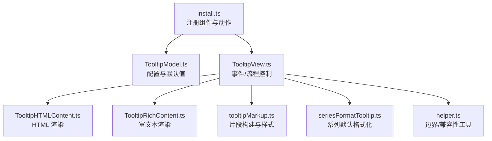
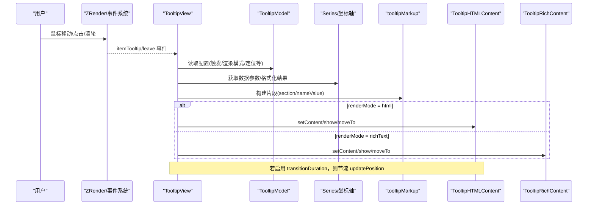
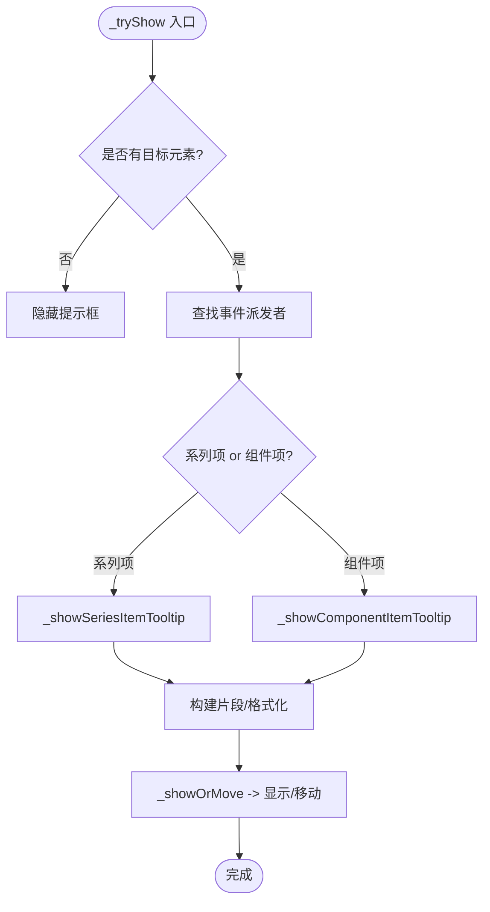
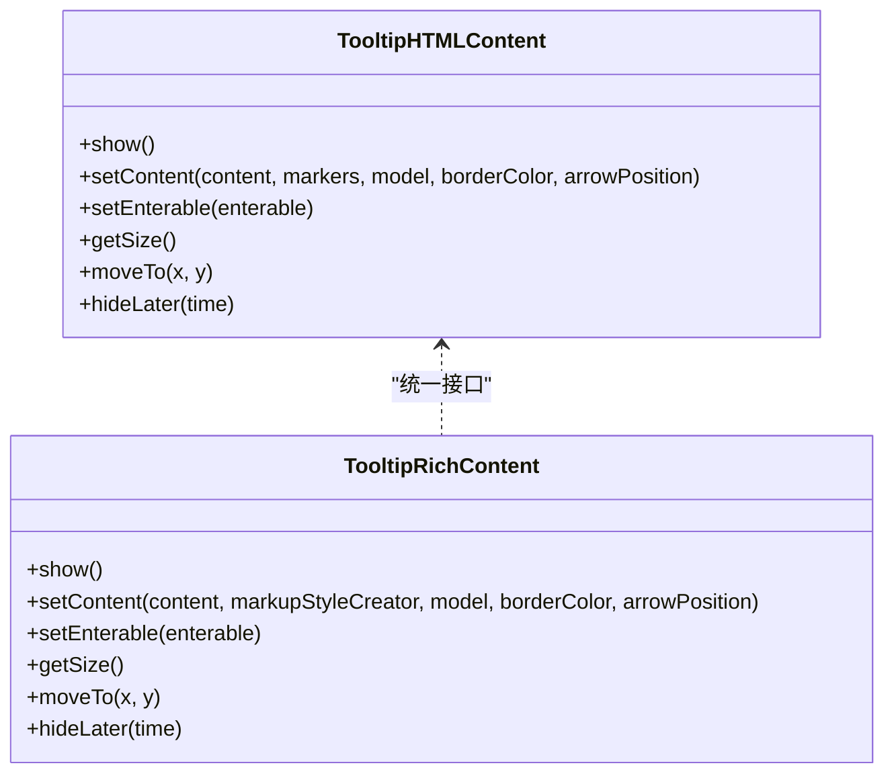
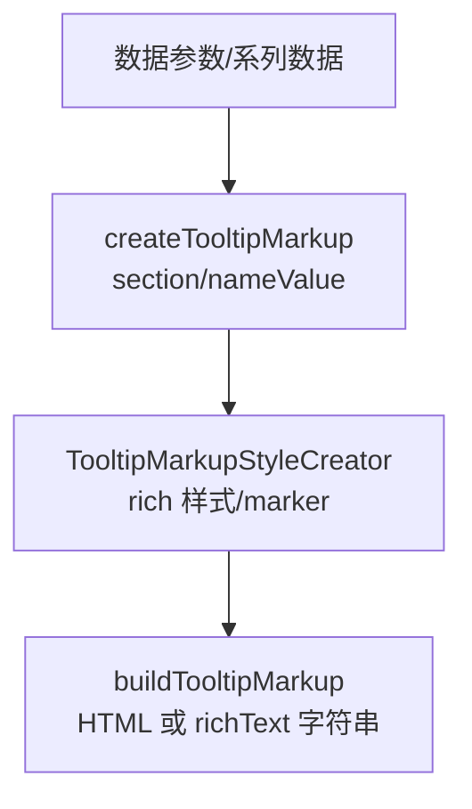
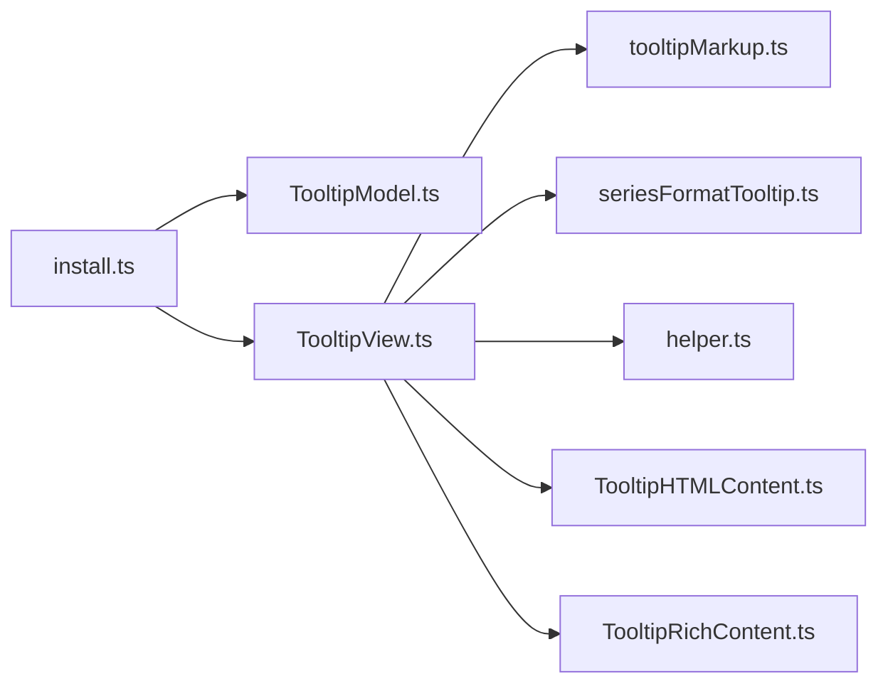

# 提示框组件 (Tooltip)

<cite>
**本文引用的文件**
- [src/component/tooltip.ts](file://src/component/tooltip.ts)
- [src/component/tooltip/install.ts](file://src/component/tooltip/install.ts)
- [src/component/tooltip/TooltipModel.ts](file://src/component/tooltip/TooltipModel.ts)
- [src/component/tooltip/TooltipView.ts](file://src/component/tooltip/TooltipView.ts)
- [src/component/tooltip/TooltipHTMLContent.ts](file://src/component/tooltip/TooltipHTMLContent.ts)
- [src/component/tooltip/TooltipRichContent.ts](file://src/component/tooltip/TooltipRichContent.ts)
- [src/component/tooltip/helper.ts](file://src/component/tooltip/helper.ts)
- [src/component/tooltip/seriesFormatTooltip.ts](file://src/component/tooltip/seriesFormatTooltip.ts)
- [src/component/tooltip/tooltipMarkup.ts](file://src/component/tooltip/tooltipMarkup.ts)
- [test/tooltip.html](file://test/tooltip.html)
- [test/tooltip-rich.html](file://test/tooltip-rich.html)
</cite>

## 目录
1. [简介](#简介)
2. [项目结构](#项目结构)
3. [核心组件](#核心组件)
4. [架构总览](#架构总览)
5. [详细组件分析](#详细组件分析)
6. [依赖关系分析](#依赖关系分析)
7. [性能考虑](#性能考虑)
8. [故障排查指南](#故障排查指南)
9. [结论](#结论)
10. [附录](#附录)

## 简介
本文件系统性梳理 ECharts 提示框（Tooltip）组件的实现原理与渲染机制，覆盖 HTML 内容与富文本内容两种渲染模式、触发方式、显示条件、定位策略、样式设置、数据格式化与模板语法、自定义内容生成、与不同图表类型的集成方式，并提供丰富的示例路径与常见问题解决方案。读者可据此快速掌握提示框的配置与扩展方法，并在实际项目中高效使用。

## 项目结构
提示框组件位于 src/component/tooltip 目录下，采用“模型-视图-内容”的分层设计：
- 安装入口：注册组件模型与视图，并暴露 showTip/hideTip 动作
- 模型层：定义默认配置项与类型约束
- 视图层：处理事件监听、数据组装、内容构建与定位更新
- 内容层：分别实现 HTML 与富文本两种渲染后端
- 工具层：提供标记样式创建、布局间距计算、DOM/Canvas/SVG 兼容等能力

**图示来源**
- [src/component/tooltip/install.ts:26-56](file://src/component/tooltip/install.ts#L26-L56)
- [src/component/tooltip/TooltipModel.ts:88-187](file://src/component/tooltip/TooltipModel.ts#L88-L187)
- [src/component/tooltip/TooltipView.ts:164-217](file://src/component/tooltip/TooltipView.ts#L164-L217)
- [src/component/tooltip/TooltipHTMLContent.ts:270-329](file://src/component/tooltip/TooltipHTMLContent.ts#L270-L329)
- [src/component/tooltip/TooltipRichContent.ts:30-53](file://src/component/tooltip/TooltipRichContent.ts#L30-L53)
- [src/component/tooltip/tooltipMarkup.ts:136-193](file://src/component/tooltip/tooltipMarkup.ts#L136-L193)
- [src/component/tooltip/seriesFormatTooltip.ts:33-101](file://src/component/tooltip/seriesFormatTooltip.ts#L33-L101)
- [src/component/tooltip/helper.ts:27-33](file://src/component/tooltip/helper.ts#L27-L33)

**章节来源**
- [src/component/tooltip/install.ts:26-56](file://src/component/tooltip/install.ts#L26-L56)
- [src/component/tooltip/TooltipModel.ts:88-187](file://src/component/tooltip/TooltipModel.ts#L88-L187)

## 核心组件
- 安装器 install.ts：注册 Tooltip 模型与视图，并注册 showTip/hideTip 动作，联动 axisPointer 能力
- 模型 TooltipModel.ts：集中声明 tooltip 的所有配置项与默认值，包括触发方式、渲染模式、定位限制、动画、样式等
- 视图 TooltipView.ts：负责事件绑定、数据拼装、内容构建、定位与显示/隐藏流程控制
- 内容层：
  - TooltipHTMLContent.ts：基于 DOM 的 HTML 渲染，支持箭头、过渡动画、appendToBody、className、extraCssText 等
  - TooltipRichContent.ts：基于 ZRender 文本对象的富文本渲染，支持 rich 样式、阴影、边框、内边距等
- 工具与格式化：
  - tooltipMarkup.ts：抽象的片段构建器，统一 HTML 与富文本输出，提供 nameValue/section 块、排序、样式封装
  - seriesFormatTooltip.ts：系列默认的提示框内容生成逻辑
  - helper.ts：是否限制在视口内、浏览器特性检测等

**章节来源**
- [src/component/tooltip/install.ts:26-56](file://src/component/tooltip/install.ts#L26-L56)
- [src/component/tooltip/TooltipModel.ts:88-187](file://src/component/tooltip/TooltipModel.ts#L88-L187)
- [src/component/tooltip/TooltipView.ts:164-217](file://src/component/tooltip/TooltipView.ts#L164-L217)
- [src/component/tooltip/TooltipHTMLContent.ts:270-329](file://src/component/tooltip/TooltipHTMLContent.ts#L270-L329)
- [src/component/tooltip/TooltipRichContent.ts:30-53](file://src/component/tooltip/TooltipRichContent.ts#L30-L53)
- [src/component/tooltip/tooltipMarkup.ts:136-193](file://src/component/tooltip/tooltipMarkup.ts#L136-L193)
- [src/component/tooltip/seriesFormatTooltip.ts:33-101](file://src/component/tooltip/seriesFormatTooltip.ts#L33-L101)
- [src/component/tooltip/helper.ts:27-33](file://src/component/tooltip/helper.ts#L27-L33)

## 架构总览
提示框从事件到渲染的整体流程如下：

**图示来源**
- [src/component/tooltip/TooltipView.ts:219-237](file://src/component/tooltip/TooltipView.ts#L219-L237)
- [src/component/tooltip/TooltipView.ts:292-387](file://src/component/tooltip/TooltipView.ts#L292-L387)
- [src/component/tooltip/TooltipView.ts:533-657](file://src/component/tooltip/TooltipView.ts#L533-L657)
- [src/component/tooltip/TooltipView.ts:659-738](file://src/component/tooltip/TooltipView.ts#L659-L738)
- [src/component/tooltip/TooltipHTMLContent.ts:404-475](file://src/component/tooltip/TooltipHTMLContent.ts#L404-L475)
- [src/component/tooltip/TooltipRichContent.ts:66-139](file://src/component/tooltip/TooltipRichContent.ts#L66-L139)
- [src/component/tooltip/tooltipMarkup.ts:390-411](file://src/component/tooltip/tooltipMarkup.ts#L390-L411)

## 详细组件分析

### 模型层：TooltipModel
- 职责：定义 tooltip 的全局配置项与默认值，包含触发方式、渲染模式、定位限制、动画、样式、轴指针等
- 关键配置要点：
  - trigger: 'item' | 'axis' | 'none'
  - triggerOn: 'mousemove|click|mousewheel'
  - renderMode: 'auto' | 'html' | 'richText'
  - confine: null | boolean（richText 模式下默认限制）
  - position / positionDefault：定位表达式或默认位置
  - enterable：是否允许鼠标进入提示框
  - showDelay / hideDelay / transitionDuration / displayTransition：显示延迟、隐藏延迟、过渡时长、显示过渡开关
  - backgroundColor / shadow* / borderRadius / borderWidth / padding / extraCssText / className：外观样式
  - axisPointer：联动十字线/阴影/线的样式与行为
  - order：多系列排序策略（valueAsc/valueDesc/seriesDesc）
  - valueFormatter：数值格式化回调
  - textStyle：字体颜色、字号、行高、阴影等

**章节来源**
- [src/component/tooltip/TooltipModel.ts:36-86](file://src/component/tooltip/TooltipModel.ts#L36-L86)
- [src/component/tooltip/TooltipModel.ts:94-187](file://src/component/tooltip/TooltipModel.ts#L94-L187)

### 视图层：TooltipView
- 职责：
  - 初始化渲染模式与内容容器（HTML 或富文本）
  - 注册全局事件监听，根据 triggerOn 决定是否响应
  - 手动显示/隐藏 API：manuallyShowTip/manuallyHideTip
  - 数据组装：按 item/axis 分支获取数据参数与格式化结果
  - 构建内容：调用 tooltipMarkup 生成片段，再交由对应内容层渲染
  - 定位与更新：updatePosition（含节流优化）、保持显示（刷新后重试）
- 重要流程：
  - _tryShow：判断目标元素，选择系列项或组件项提示框分支
  - _showSeriesItemTooltip：单系列项提示框，构造 marker、nameValue 片段
  - _showAxisTooltip：轴触发时聚合多系列数据，生成 section + 多个 nameValue
  - _showOrMove：结合 showDelay 与 enterable 控制显示时机
  - 节流 updatePosition：当启用 transitionDuration 且非 richText 时，降低高频移动抖动

**图示来源**
- [src/component/tooltip/TooltipView.ts:453-515](file://src/component/tooltip/TooltipView.ts#L453-L515)
- [src/component/tooltip/TooltipView.ts:517-531](file://src/component/tooltip/TooltipView.ts#L517-L531)
- [src/component/tooltip/TooltipView.ts:659-738](file://src/component/tooltip/TooltipView.ts#L659-L738)
- [src/component/tooltip/TooltipView.ts:740-800](file://src/component/tooltip/TooltipView.ts#L740-L800)

**章节来源**
- [src/component/tooltip/TooltipView.ts:164-217](file://src/component/tooltip/TooltipView.ts#L164-L217)
- [src/component/tooltip/TooltipView.ts:292-387](file://src/component/tooltip/TooltipView.ts#L292-L387)
- [src/component/tooltip/TooltipView.ts:453-515](file://src/component/tooltip/TooltipView.ts#L453-L515)
- [src/component/tooltip/TooltipView.ts:533-657](file://src/component/tooltip/TooltipView.ts#L533-L657)
- [src/component/tooltip/TooltipView.ts:659-738](file://src/component/tooltip/TooltipView.ts#L659-L738)
- [src/component/tooltip/TooltipView.ts:740-800](file://src/component/tooltip/TooltipView.ts#L740-L800)

### 内容层：HTML 与富文本
- HTML 内容（TooltipHTMLContent）
  - 基于 DOM div，支持 appendTo/appendToBody、className、extraCssText
  - 自动计算 transform/left/top，兼容不支持 transform 的环境
  - 支持箭头绘制、过渡动画、enterable 交互、alwaysShowContent
  - 通过 assembleCssText 应用背景、阴影、边框、文字样式、padding
- 富文本内容（TooltipRichContent）
  - 基于 ZRender Text，使用 rich 样式实现复杂排版
  - 支持阴影、边框、内边距、z-index
  - 不支持传入 DOM 节点作为内容
  - moveTo 时考虑边框与阴影外扩尺寸

**图示来源**
- [src/component/tooltip/TooltipHTMLContent.ts:270-329](file://src/component/tooltip/TooltipHTMLContent.ts#L270-L329)
- [src/component/tooltip/TooltipHTMLContent.ts:404-475](file://src/component/tooltip/TooltipHTMLContent.ts#L404-L475)
- [src/component/tooltip/TooltipRichContent.ts:30-53](file://src/component/tooltip/TooltipRichContent.ts#L30-L53)
- [src/component/tooltip/TooltipRichContent.ts:66-139](file://src/component/tooltip/TooltipRichContent.ts#L66-L139)

**章节来源**
- [src/component/tooltip/TooltipHTMLContent.ts:270-329](file://src/component/tooltip/TooltipHTMLContent.ts#L270-L329)
- [src/component/tooltip/TooltipHTMLContent.ts:404-475](file://src/component/tooltip/TooltipHTMLContent.ts#L404-L475)
- [src/component/tooltip/TooltipRichContent.ts:66-139](file://src/component/tooltip/TooltipRichContent.ts#L66-L139)

### 数据格式化与模板
- 默认系列格式化：seriesFormatTooltip.ts 将数据维度映射为 nameValue 片段，支持数组值拆分、标题头、排序参数
- 片段构建：tooltipMarkup.ts 提供 createTooltipMarkup('section'|'nameValue')，统一 HTML 与富文本输出
- 样式封装：TooltipMarkupStyleCreator 生成 rich 样式名与 marker，避免重复样式冲突
- 值格式化：支持 valueType（如 time/ordinal），以及 valueFormatter 回调；支持 useUTC 切换

**图示来源**
- [src/component/tooltip/seriesFormatTooltip.ts:33-101](file://src/component/tooltip/seriesFormatTooltip.ts#L33-L101)
- [src/component/tooltip/tooltipMarkup.ts:136-193](file://src/component/tooltip/tooltipMarkup.ts#L136-L193)
- [src/component/tooltip/tooltipMarkup.ts:390-411](file://src/component/tooltip/tooltipMarkup.ts#L390-L411)
- [src/component/tooltip/tooltipMarkup.ts:515-580](file://src/component/tooltip/tooltipMarkup.ts#L515-L580)

**章节来源**
- [src/component/tooltip/seriesFormatTooltip.ts:33-101](file://src/component/tooltip/seriesFormatTooltip.ts#L33-L101)
- [src/component/tooltip/tooltipMarkup.ts:136-193](file://src/component/tooltip/tooltipMarkup.ts#L136-L193)
- [src/component/tooltip/tooltipMarkup.ts:390-411](file://src/component/tooltip/tooltipMarkup.ts#L390-L411)
- [src/component/tooltip/tooltipMarkup.ts:515-580](file://src/component/tooltip/tooltipMarkup.ts#L515-L580)

### 与图表类型的集成
- 系列项提示框：通过 getSeriesByIndex 与 getDataParams 获取数据，构造 nameValue 片段
- 轴触发提示框：聚合多系列数据，按轴维度分组，生成 section 与多个 nameValue，支持排序
- 组件项提示框：如图例、地图等组件可通过 tooltipConfig 直接注入内容，视图层会进行 HTML 编码防护

**章节来源**
- [src/component/tooltip/TooltipView.ts:659-738](file://src/component/tooltip/TooltipView.ts#L659-L738)
- [src/component/tooltip/TooltipView.ts:533-657](file://src/component/tooltip/TooltipView.ts#L533-L657)
- [src/component/tooltip/TooltipView.ts:740-800](file://src/component/tooltip/TooltipView.ts#L740-L800)

## 依赖关系分析
- 安装器依赖 axisPointer，以支持十字线/阴影/线等联动效果
- 视图依赖 format、number、layout、time 等工具模块，用于数据格式化、布局计算、时间处理
- 内容层依赖 zrender 环境检测与 DOM/Canvas/SVG 能力
- 片段构建依赖视觉 tokens、排序比较器等

**图示来源**
- [src/component/tooltip/install.ts:26-56](file://src/component/tooltip/install.ts#L26-L56)
- [src/component/tooltip/TooltipView.ts:19-59](file://src/component/tooltip/TooltipView.ts#L19-L59)
- [src/component/tooltip/TooltipHTMLContent.ts:20-40](file://src/component/tooltip/TooltipHTMLContent.ts#L20-L40)
- [src/component/tooltip/TooltipRichContent.ts:20-28](file://src/component/tooltip/TooltipRichContent.ts#L20-L28)

**章节来源**
- [src/component/tooltip/install.ts:26-56](file://src/component/tooltip/install.ts#L26-L56)
- [src/component/tooltip/TooltipView.ts:19-59](file://src/component/tooltip/TooltipView.ts#L19-L59)

## 性能考虑
- 高频移动节流：当启用 transitionDuration 且非 richText 模式时，updatePosition 使用节流函数降低重绘频率，缓解抖动与卡顿
- 显示过渡：displayTransition 与 transitionDuration 配合，平滑显示/隐藏；首次显示与长时间隐藏后的过渡策略不同
- 定位计算优化：使用 transform 而非 left/top 提升性能；在不支持 transform 的环境下回退到 left/top
- 内容复用：richText 模式下通过 rich 样式名缓存减少重复样式对象创建
- 视口限制：richText 模式默认 confine=true，避免溢出不可见区域；HTML 模式默认不限制，便于自由定位

**章节来源**
- [src/component/tooltip/TooltipView.ts:206-216](file://src/component/tooltip/TooltipView.ts#L206-L216)
- [src/component/tooltip/TooltipHTMLContent.ts:106-143](file://src/component/tooltip/TooltipHTMLContent.ts#L106-L143)
- [src/component/tooltip/TooltipHTMLContent.ts:404-475](file://src/component/tooltip/TooltipHTMLContent.ts#L404-L475)
- [src/component/tooltip/TooltipRichContent.ts:145-172](file://src/component/tooltip/TooltipRichContent.ts#L145-L172)
- [src/component/tooltip/helper.ts:27-33](file://src/component/tooltip/helper.ts#L27-L33)

## 故障排查指南
- 提示框不显示
  - 检查 trigger 是否为 'none'，triggerOn 是否包含所需事件
  - 确认 renderMode 与目标环境兼容性（如小程序环境可能跳过 DOM）
  - 查看 manuallyShowTip 的参数是否正确（x/y、seriesIndex/dataIndex、dataByCoordSys）
- 定位异常或遮挡
  - 调整 position 或 positionDefault；必要时开启 confine
  - 检查容器 CSS 定位（relative/absolute）与 transform 支持
  - 对于 richText 模式，注意阴影与边框对尺寸的影响
- 内容乱码或 XSS
  - 组件项提示框在 HTML 模式下会对 content 进行 HTML 编码；如需自定义 HTML，请确保来源可信
  - 使用 valueFormatter 或 rich 样式安全地格式化内容
- 频繁移动抖动
  - 启用 transitionDuration 并使用内置节流；或适当增大 showDelay
- 始终显示但无法交互
  - 设置 enterable=true 以允许鼠标进入提示框；否则 pointer-events:none 会阻止交互

**章节来源**
- [src/component/tooltip/TooltipView.ts:219-237](file://src/component/tooltip/TooltipView.ts#L219-L237)
- [src/component/tooltip/TooltipView.ts:292-387](file://src/component/tooltip/TooltipView.ts#L292-L387)
- [src/component/tooltip/TooltipHTMLContent.ts:336-368](file://src/component/tooltip/TooltipHTMLContent.ts#L336-L368)
- [src/component/tooltip/TooltipHTMLContent.ts:404-475](file://src/component/tooltip/TooltipHTMLContent.ts#L404-L475)
- [src/component/tooltip/TooltipRichContent.ts:122-139](file://src/component/tooltip/TooltipRichContent.ts#L122-L139)

## 结论
ECharts 提示框组件通过清晰的模型-视图-内容分层，提供了灵活的触发、定位、样式与内容定制能力。HTML 与富文本双后端兼顾了易用性与高性能，配合轴指针与片段构建器，能够适配多种图表类型与业务场景。合理使用配置项与性能优化手段，可在保证体验的同时满足复杂展示需求。

## 附录
- 示例参考
  - 基础与联动示例：[test/tooltip.html](file://test/tooltip.html)
  - 富文本模式示例：[test/tooltip-rich.html](file://test/tooltip-rich.html)
- 常用配置速查
  - 触发：trigger、triggerOn
  - 渲染：renderMode、confine、position、positionDefault
  - 交互：enterable、showDelay、hideDelay、alwaysShowContent
  - 样式：backgroundColor、shadow*、borderRadius、borderWidth、padding、extraCssText、className、textStyle
  - 联动：axisPointer（type、axis、crossStyle）
  - 排序与格式化：order、valueFormatter、useUTC