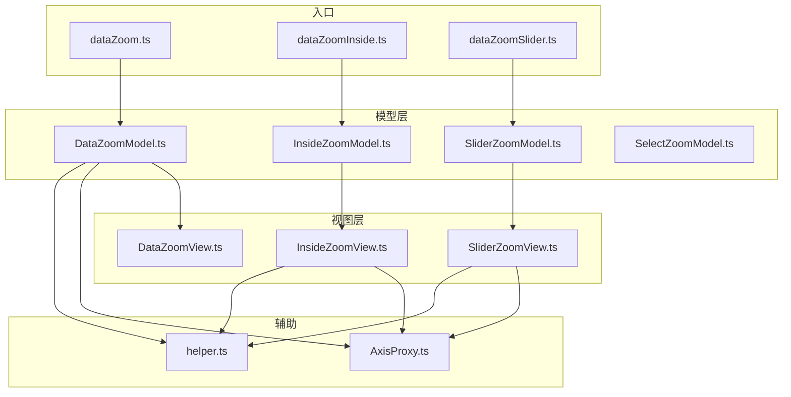
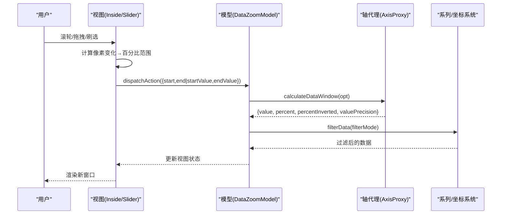
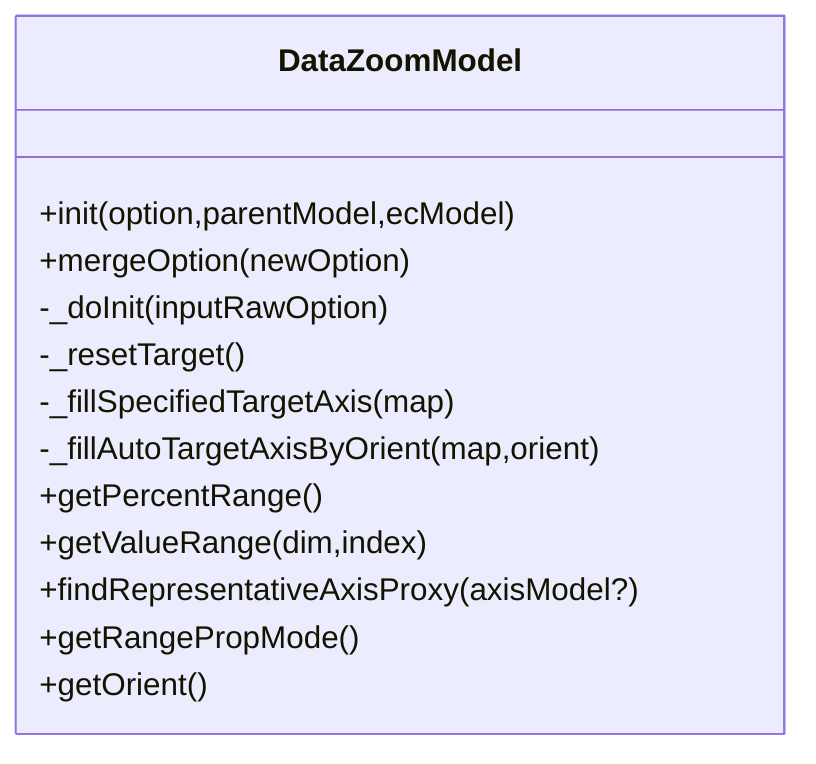
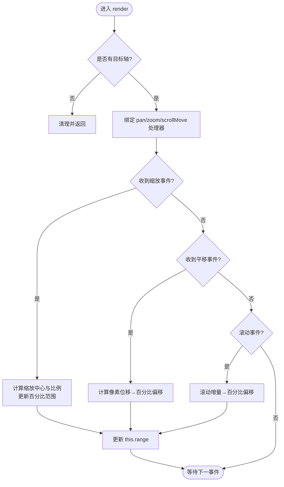
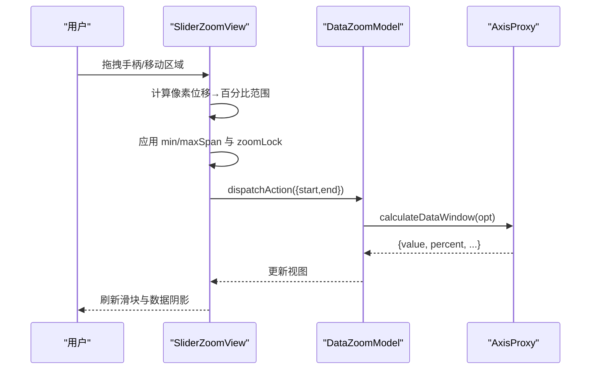
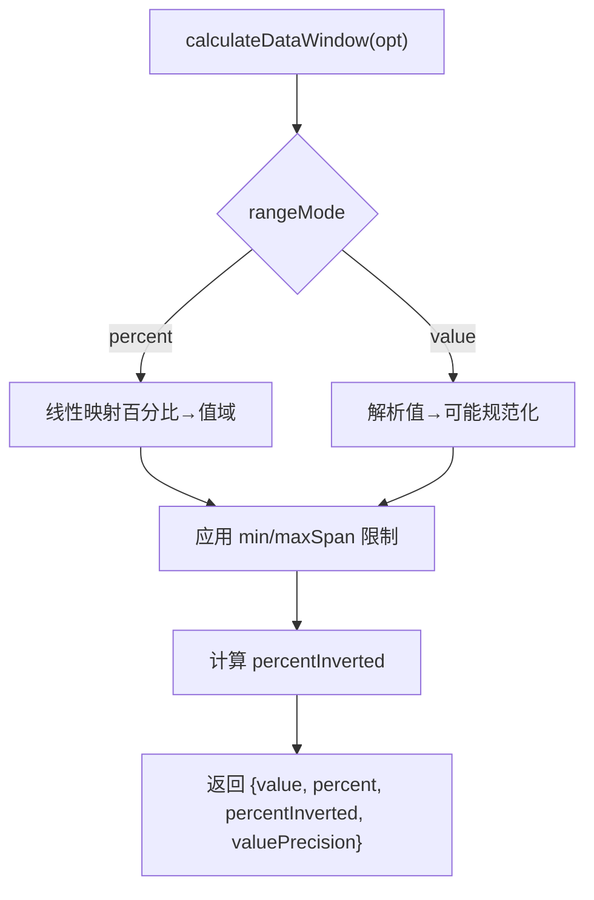
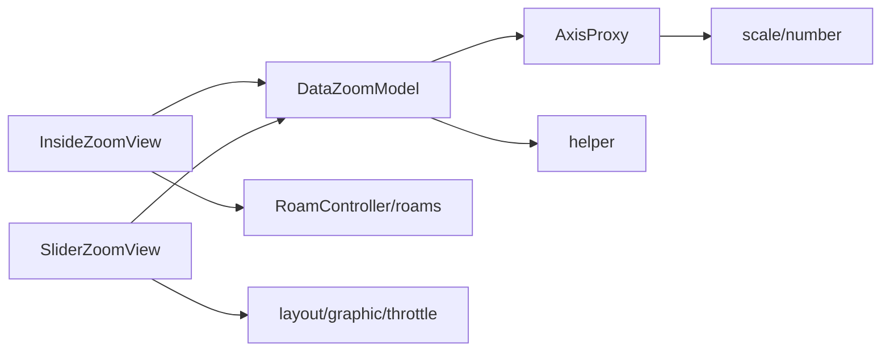

# 数据缩放组件 (DataZoom)

<cite>
**本文引用的文件**
- [src/component/dataZoom.ts](file://src/component/dataZoom.ts)
- [src/component/dataZoomInside.ts](file://src/component/dataZoomInside.ts)
- [src/component/dataZoomSlider.ts](file://src/component/dataZoomSlider.ts)
- [src/component/dataZoom/DataZoomModel.ts](file://src/component/dataZoom/DataZoomModel.ts)
- [src/component/dataZoom/DataZoomView.ts](file://src/component/dataZoom/DataZoomView.ts)
- [src/component/dataZoom/InsideZoomModel.ts](file://src/component/dataZoom/InsideZoomModel.ts)
- [src/component/dataZoom/InsideZoomView.ts](file://src/component/dataZoom/InsideZoomView.ts)
- [src/component/dataZoom/SliderZoomModel.ts](file://src/component/dataZoom/SliderZoomModel.ts)
- [src/component/dataZoom/SliderZoomView.ts](file://src/component/dataZoom/SliderZoomView.ts)
- [src/component/dataZoom/SelectZoomModel.ts](file://src/component/dataZoom/SelectZoomModel.ts)
- [src/component/dataZoom/helper.ts](file://src/component/dataZoom/helper.ts)
- [src/component/dataZoom/AxisProxy.ts](file://src/component/dataZoom/AxisProxy.ts)
</cite>

## 目录
1. [简介](#简介)
2. [项目结构](#项目结构)
3. [核心组件](#核心组件)
4. [架构总览](#架构总览)
5. [详细组件分析](#详细组件分析)
6. [依赖关系分析](#依赖关系分析)
7. [性能考量](#性能考量)
8. [故障排查指南](#故障排查指南)
9. [结论](#结论)
10. [附录](#附录)

## 简介
本文件系统性梳理 ECharts 数据缩放组件（DataZoom）的实现原理与工作流程，覆盖内部缩放（Inside Zoom）与滑块缩放（Slider Zoom）两类类型、配置项、联动机制、事件处理、程序化控制以及大数据量下的性能优化策略。通过源码级分析与可视化图示，帮助读者快速掌握如何正确配置与扩展 DataZoom，以支撑复杂交互场景。

## 项目结构
DataZoom 采用“模型-视图”分层：
- 模型层：定义配置、范围计算、目标轴选择、联动与同步等逻辑
- 视图层：负责渲染与交互（鼠标滚轮、拖拽、刷选等），并派发 Action 更新模型
- 辅助层：坐标系统信息收集、轴代理（AxisProxy）、工具函数等

图表来源
- [src/component/dataZoom.ts:1-24](file://src/component/dataZoom.ts#L1-L24)
- [src/component/dataZoomInside.ts:1-23](file://src/component/dataZoomInside.ts#L1-L23)
- [src/component/dataZoomSlider.ts:1-24](file://src/component/dataZoomSlider.ts#L1-L24)
- [src/component/dataZoom/DataZoomModel.ts:149-166](file://src/component/dataZoom/DataZoomModel.ts#L149-L166)
- [src/component/dataZoom/InsideZoomModel.ts:56-68](file://src/component/dataZoom/InsideZoomModel.ts#L56-L68)
- [src/component/dataZoom/SliderZoomModel.ts:148-239](file://src/component/dataZoom/SliderZoomModel.ts#L148-L239)
- [src/component/dataZoom/DataZoomView.ts:26-38](file://src/component/dataZoom/DataZoomView.ts#L26-L38)
- [src/component/dataZoom/InsideZoomView.ts:34-77](file://src/component/dataZoom/InsideZoomView.ts#L34-L77)
- [src/component/dataZoom/SliderZoomView.ts:89-188](file://src/component/dataZoom/SliderZoomView.ts#L89-L188)
- [src/component/dataZoom/helper.ts:184-217](file://src/component/dataZoom/helper.ts#L184-L217)
- [src/component/dataZoom/AxisProxy.ts:67-122](file://src/component/dataZoom/AxisProxy.ts#L67-L122)

章节来源
- [src/component/dataZoom.ts:1-24](file://src/component/dataZoom.ts#L1-L24)
- [src/component/dataZoomInside.ts:1-23](file://src/component/dataZoomInside.ts#L1-L23)
- [src/component/dataZoomSlider.ts:1-24](file://src/component/dataZoomSlider.ts#L1-L24)

## 核心组件
- DataZoomModel：统一的数据缩放模型基类，负责目标轴发现、方向推断、范围模式（百分比/值）、节流策略、原始选项缓存等
- InsideZoomModel / SliderZoomModel：分别定义内部缩放与滑块缩放的默认配置与特有属性
- DataZoomView / InsideZoomView / SliderZoomView：视图层渲染与交互，驱动范围变化并通过 Action 更新模型
- AxisProxy：对单轴的窗口计算、过滤、最小/最大跨度限制、精度处理等核心算法
- helper：坐标系统信息收集、联动查找、轴代理映射等工具

章节来源
- [src/component/dataZoom/DataZoomModel.ts:149-166](file://src/component/dataZoom/DataZoomModel.ts#L149-L166)
- [src/component/dataZoom/InsideZoomModel.ts:56-68](file://src/component/dataZoom/InsideZoomModel.ts#L56-L68)
- [src/component/dataZoom/SliderZoomModel.ts:148-239](file://src/component/dataZoom/SliderZoomModel.ts#L148-L239)
- [src/component/dataZoom/DataZoomView.ts:26-38](file://src/component/dataZoom/DataZoomView.ts#L26-L38)
- [src/component/dataZoom/InsideZoomView.ts:34-77](file://src/component/dataZoom/InsideZoomView.ts#L34-L77)
- [src/component/dataZoom/SliderZoomView.ts:89-188](file://src/component/dataZoom/SliderZoomView.ts#L89-L188)
- [src/component/dataZoom/AxisProxy.ts:151-331](file://src/component/dataZoom/AxisProxy.ts#L151-L331)
- [src/component/dataZoom/helper.ts:103-163](file://src/component/dataZoom/helper.ts#L103-L163)

## 架构总览
DataZoom 的运行时流程围绕“交互→范围计算→数据过滤→重绘”展开：
- 内部缩放：基于 RoamController 捕获 pan/zoom/scrollMove，换算为百分比范围变化，经节流后派发 Action
- 滑块缩放：拖拽手柄或移动区域，计算像素位移→百分比→值域，应用 min/maxSpan 约束，派发 Action
- 轴代理：根据当前数据范围与 scale 类型进行取值、取整、对齐与过滤
- 联动：通过 helper 找到受同一轴影响的其他 dataZoom，实现多图表同步

图表来源
- [src/component/dataZoom/InsideZoomView.ts:44-77](file://src/component/dataZoom/InsideZoomView.ts#L44-L77)
- [src/component/dataZoom/InsideZoomView.ts:97-150](file://src/component/dataZoom/InsideZoomView.ts#L97-L150)
- [src/component/dataZoom/SliderZoomView.ts:723-758](file://src/component/dataZoom/SliderZoomView.ts#L723-L758)
- [src/component/dataZoom/AxisProxy.ts:151-331](file://src/component/dataZoom/AxisProxy.ts#L151-L331)
- [src/component/dataZoom/AxisProxy.ts:378-472](file://src/component/dataZoom/AxisProxy.ts#L378-L472)

## 详细组件分析

### 模型层：DataZoomModel
- 目标轴发现与方向推断：支持 x/y/radius/angle/single 维度，自动按 orient 或首个平行轴确定方向
- 范围模式：支持 start/end 百分比与 startValue/endValue 值域两种模式，可混合使用；提供 rangeMode 指定边界解析策略
- 节流策略：throttle 默认根据全局动画开关动态设置，避免高频触发
- 原始选项缓存：settledOption 保存用户输入，避免被中间计算覆盖导致 setOption 行为异常
- 代表性轴代理：findRepresentativeAxisProxy 用于获取窗口、跨度等信息

图表来源
- [src/component/dataZoom/DataZoomModel.ts:149-166](file://src/component/dataZoom/DataZoomModel.ts#L149-L166)
- [src/component/dataZoom/DataZoomModel.ts:199-260](file://src/component/dataZoom/DataZoomModel.ts#L199-L260)
- [src/component/dataZoom/DataZoomModel.ts:262-379](file://src/component/dataZoom/DataZoomModel.ts#L262-L379)
- [src/component/dataZoom/DataZoomModel.ts:381-415](file://src/component/dataZoom/DataZoomModel.ts#L381-L415)
- [src/component/dataZoom/DataZoomModel.ts:504-570](file://src/component/dataZoom/DataZoomModel.ts#L504-L570)

章节来源
- [src/component/dataZoom/DataZoomModel.ts:149-166](file://src/component/dataZoom/DataZoomModel.ts#L149-L166)
- [src/component/dataZoom/DataZoomModel.ts:199-260](file://src/component/dataZoom/DataZoomModel.ts#L199-L260)
- [src/component/dataZoom/DataZoomModel.ts:262-379](file://src/component/dataZoom/DataZoomModel.ts#L262-L379)
- [src/component/dataZoom/DataZoomModel.ts:381-415](file://src/component/dataZoom/DataZoomModel.ts#L381-L415)
- [src/component/dataZoom/DataZoomModel.ts:504-570](file://src/component/dataZoom/DataZoomModel.ts#L504-L570)

### 内部缩放：InsideZoomModel / InsideZoomView
- 默认行为：启用鼠标滚轮缩放、鼠标移动平移、可选禁用缩放仅平移（zoomLock）
- 事件绑定：注册到 RoamController，将 pan/zoom/scrollMove 转换为百分比范围变化
- 方向计算：针对 grid/polar/singleAxis 坐标系，计算像素位移、信号方向与长度，映射为百分比偏移
- 节流：通过 throttle 保证命令顺序与性能

图表来源
- [src/component/dataZoom/InsideZoomView.ts:44-77](file://src/component/dataZoom/InsideZoomView.ts#L44-L77)
- [src/component/dataZoom/InsideZoomView.ts:97-150](file://src/component/dataZoom/InsideZoomView.ts#L97-L150)
- [src/component/dataZoom/InsideZoomView.ts:210-286](file://src/component/dataZoom/InsideZoomView.ts#L210-L286)

章节来源
- [src/component/dataZoom/InsideZoomModel.ts:56-68](file://src/component/dataZoom/InsideZoomModel.ts#L56-L68)
- [src/component/dataZoom/InsideZoomView.ts:34-77](file://src/component/dataZoom/InsideZoomView.ts#L34-L77)
- [src/component/dataZoom/InsideZoomView.ts:97-150](file://src/component/dataZoom/InsideZoomView.ts#L97-L150)
- [src/component/dataZoom/InsideZoomView.ts:210-286](file://src/component/dataZoom/InsideZoomView.ts#L210-L286)

### 滑块缩放：SliderZoomModel / SliderZoomView
- 布局与定位：基于 box 布局，自适应网格矩形，支持水平/垂直方向
- 数据阴影：可选绘制数据背景（折线/面积），提升视觉反馈；对大数据进行步长采样优化
- 交互：拖拽手柄、移动区域、点击面板、刷选（brushSelect）
- 范围更新：将像素位移映射为百分比范围，应用 min/maxSpan 与 zoomLock 约束，再派发 Action

图表来源
- [src/component/dataZoom/SliderZoomView.ts:227-309](file://src/component/dataZoom/SliderZoomView.ts#L227-L309)
- [src/component/dataZoom/SliderZoomView.ts:360-489](file://src/component/dataZoom/SliderZoomView.ts#L360-L489)
- [src/component/dataZoom/SliderZoomView.ts:549-721](file://src/component/dataZoom/SliderZoomView.ts#L549-L721)
- [src/component/dataZoom/SliderZoomView.ts:723-758](file://src/component/dataZoom/SliderZoomView.ts#L723-L758)
- [src/component/dataZoom/AxisProxy.ts:151-331](file://src/component/dataZoom/AxisProxy.ts#L151-L331)

章节来源
- [src/component/dataZoom/SliderZoomModel.ts:148-239](file://src/component/dataZoom/SliderZoomModel.ts#L148-L239)
- [src/component/dataZoom/SliderZoomView.ts:89-188](file://src/component/dataZoom/SliderZoomView.ts#L89-L188)
- [src/component/dataZoom/SliderZoomView.ts:227-309](file://src/component/dataZoom/SliderZoomView.ts#L227-L309)
- [src/component/dataZoom/SliderZoomView.ts:360-489](file://src/component/dataZoom/SliderZoomView.ts#L360-L489)
- [src/component/dataZoom/SliderZoomView.ts:549-721](file://src/component/dataZoom/SliderZoomView.ts#L549-L721)
- [src/component/dataZoom/SliderZoomView.ts:723-758](file://src/component/dataZoom/SliderZoomView.ts#L723-L758)

### 选择型缩放：SelectZoomModel
- 轻量模型，主要用于通过工具栏或外部操作生成选择范围，配合其他 dataZoom 完成联动

章节来源
- [src/component/dataZoom/SelectZoomModel.ts:22-25](file://src/component/dataZoom/SelectZoomModel.ts#L22-L25)

### 轴代理：AxisProxy
- 窗口计算：根据 start/end 或 startValue/endValue 计算 value/percent 窗口，考虑 scale 类型与精度
- 跨度限制：应用 minSpan/maxSpan/minValueSpan/maxValueSpan，确保窗口合法
- 数据过滤：filterMode 支持 filter/weakFilter/empty/none，针对不同模式高效筛选或标记空值
- 精度处理：时间/序数刻度特殊处理，区间/对数刻度按 tick 精度取整，避免视觉伪影

图表来源
- [src/component/dataZoom/AxisProxy.ts:151-331](file://src/component/dataZoom/AxisProxy.ts#L151-L331)

章节来源
- [src/component/dataZoom/AxisProxy.ts:151-331](file://src/component/dataZoom/AxisProxy.ts#L151-L331)
- [src/component/dataZoom/AxisProxy.ts:378-472](file://src/component/dataZoom/AxisProxy.ts#L378-L472)

### 联动与同步
- 联动查找：通过 helper.findEffectedDataZooms 从 payload 出发，遍历所有受同一轴影响的 dataZoom 模型，形成联动集合
- 坐标系统信息：collectReferCoordSysModelInfo 聚合每个坐标系统下被控制的轴列表，便于视图与模型协作

章节来源
- [src/component/dataZoom/helper.ts:103-163](file://src/component/dataZoom/helper.ts#L103-L163)
- [src/component/dataZoom/helper.ts:184-217](file://src/component/dataZoom/helper.ts#L184-L217)

## 依赖关系分析
- DataZoomModel 依赖 axis、series、toolbox 等组件，用于目标轴发现与联动
- InsideZoomView 依赖 RoamController 与 roams 模块，处理坐标系相关的漫游事件
- SliderZoomView 依赖布局、图形、节流、符号等工具，负责渲染与交互
- AxisProxy 依赖 scale 与 number 工具，执行数值映射与精度处理

图表来源
- [src/component/dataZoom/DataZoomModel.ts:149-166](file://src/component/dataZoom/DataZoomModel.ts#L149-L166)
- [src/component/dataZoom/InsideZoomView.ts:20-31](file://src/component/dataZoom/InsideZoomView.ts#L20-L31)
- [src/component/dataZoom/SliderZoomView.ts:20-49](file://src/component/dataZoom/SliderZoomView.ts#L20-L49)
- [src/component/dataZoom/AxisProxy.ts:20-38](file://src/component/dataZoom/AxisProxy.ts#L20-L38)

章节来源
- [src/component/dataZoom/DataZoomModel.ts:149-166](file://src/component/dataZoom/DataZoomModel.ts#L149-L166)
- [src/component/dataZoom/InsideZoomView.ts:20-31](file://src/component/dataZoom/InsideZoomView.ts#L20-L31)
- [src/component/dataZoom/SliderZoomView.ts:20-49](file://src/component/dataZoom/SliderZoomView.ts#L20-L49)
- [src/component/dataZoom/AxisProxy.ts:20-38](file://src/component/dataZoom/AxisProxy.ts#L20-L38)

## 性能考量
- 节流控制：throttle 默认根据全局动画开关设置，避免高频派发；可通过配置关闭或调整频率
- 数据阴影采样：SliderZoomView 在绘制数据阴影时按屏幕宽度计算 stride，减少点数量，提升渲染性能
- 窗口计算优化：AxisProxy 在时间/序数刻度下不进行额外取整，区间/对数刻度按 tick 精度取整，避免不必要的计算
- 过滤模式选择：filterMode='none' 跳过过滤；'empty' 适合需要保留数据结构的场景；'filter'/'weakFilter' 适合大数据裁剪
- 联动范围收敛：helper 中联动查找仅在必要时遍历，避免全图扫描

章节来源
- [src/component/dataZoom/DataZoomModel.ts:381-391](file://src/component/dataZoom/DataZoomModel.ts#L381-L391)
- [src/component/dataZoom/SliderZoomView.ts:407-449](file://src/component/dataZoom/SliderZoomView.ts#L407-L449)
- [src/component/dataZoom/AxisProxy.ts:277-317](file://src/component/dataZoom/AxisProxy.ts#L277-L317)
- [src/component/dataZoom/AxisProxy.ts:378-472](file://src/component/dataZoom/AxisProxy.ts#L378-L472)

## 故障排查指南
- 无目标轴：当没有匹配的目标轴时，视图会清理并退出；检查 xAxisIndex/yAxisId 等配置是否正确
- 范围无效：若 start/end 或 startValue/endValue 解析失败，将回退到数据 extent；检查 scale 类型与输入格式
- 联动不生效：确认多个 dataZoom 是否控制同一轴；使用 helper 的联动查找验证
- 性能问题：开启 showDataShadow 可能导致大数据渲染变慢；可关闭或调整 brushSelect、throttle
- 过滤异常：filterMode='empty' 会将超出窗口的数据置空，注意堆叠图形的显示差异

章节来源
- [src/component/dataZoom/InsideZoomView.ts:44-77](file://src/component/dataZoom/InsideZoomView.ts#L44-L77)
- [src/component/dataZoom/SliderZoomView.ts:169-188](file://src/component/dataZoom/SliderZoomView.ts#L169-L188)
- [src/component/dataZoom/AxisProxy.ts:225-232](file://src/component/dataZoom/AxisProxy.ts#L225-L232)
- [src/component/dataZoom/helper.ts:103-163](file://src/component/dataZoom/helper.ts#L103-L163)

## 结论
DataZoom 通过清晰的模型-视图分层与轴代理抽象，提供了灵活且高性能的数据缩放能力。内部缩放适合沉浸式交互，滑块缩放提供直观的范围控制；两者均可与坐标轴、图例、工具栏联动，满足多图表同步与复杂业务需求。合理配置 throttle、filterMode、min/maxSpan 等参数，并结合数据阴影采样与联动优化，可在大数据场景下保持流畅体验。

## 附录
- 常用配置要点
  - 范围：start/end（百分比）或 startValue/endValue（值域），支持 rangeMode 控制解析策略
  - 滑动行为：throttle、realtime、zoomLock、preventDefaultMouseMove
  - 滑块外观：handleStyle、fillerColor、showDataShadow、brushSelect、brushStyle
  - 联动：通过共享轴实现多 dataZoom 同步；可使用 toolbox.dataZoom 注入
- 典型交互示例路径（参考测试用例）
  - 鼠标滚轮缩放：dataZoom-rainfall-inside.html
  - 触摸手势缩放：touch-slide.html
  - 程序化控制：dataZoom-action.html、dataZoom-action2.html
  - 多图表同步缩放：dataZoom-sync.html、dataZoom-rainfall-connect.html
  - 工具栏联动：dataZoom-toolbox.html

[本节为概念性说明，不直接分析具体文件]