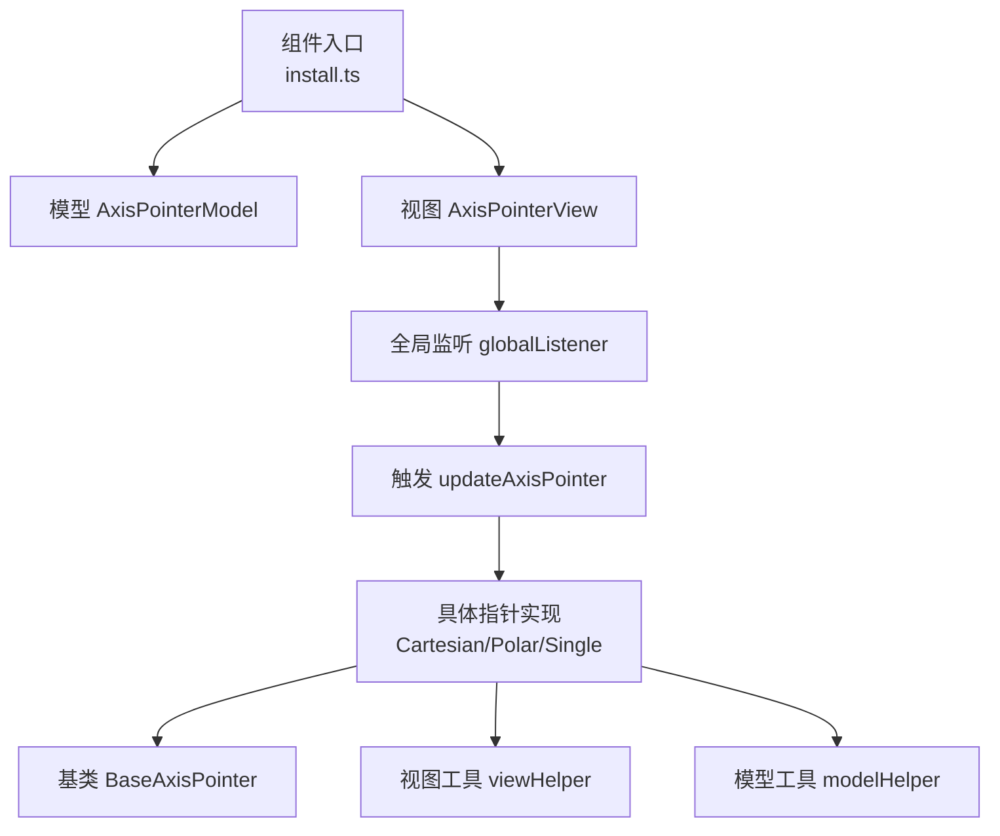
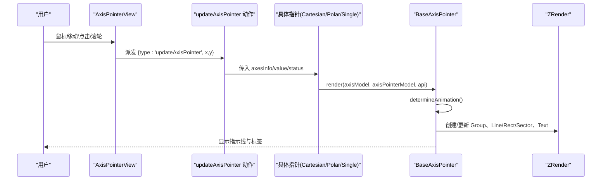
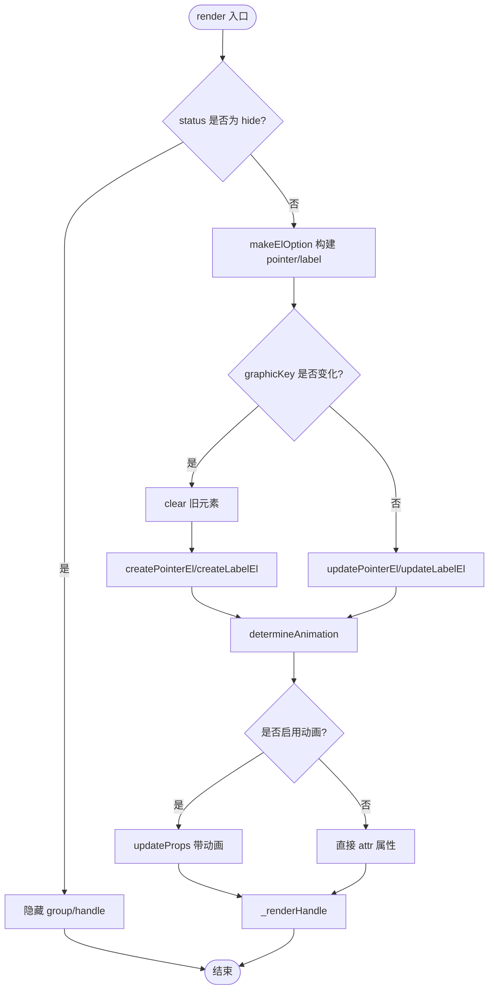
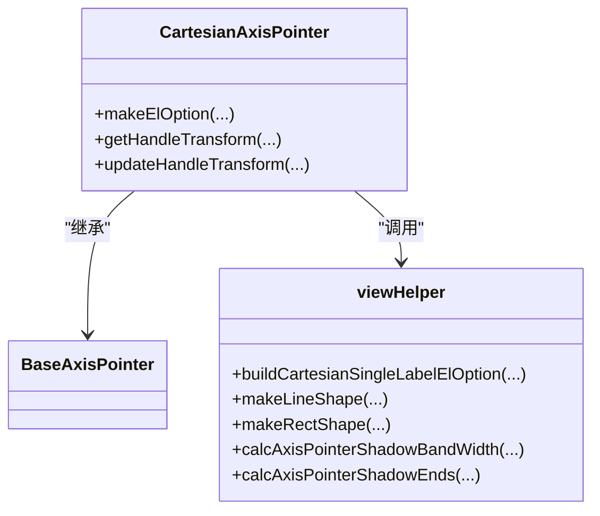
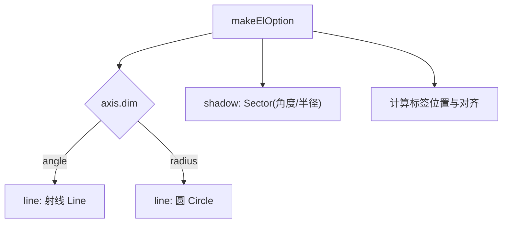
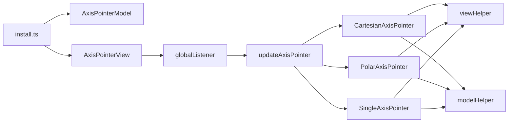

# 轴点指示器 (AxisPointer)

<cite>
**本文引用的文件**
- [src/component/axisPointer.ts](file://src/component/axisPointer.ts)
- [src/component/axisPointer/install.ts](file://src/component/axisPointer/install.ts)
- [src/component/axisPointer/BaseAxisPointer.ts](file://src/component/axisPointer/BaseAxisPointer.ts)
- [src/component/axisPointer/CartesianAxisPointer.ts](file://src/component/axisPointer/CartesianAxisPointer.ts)
- [src/component/axisPointer/PolarAxisPointer.ts](file://src/component/axisPointer/PolarAxisPointer.ts)
- [src/component/axisPointer/SingleAxisPointer.ts](file://src/component/axisPointer/SingleAxisPointer.ts)
- [src/component/axisPointer/modelHelper.ts](file://src/component/axisPointer/modelHelper.ts)
- [src/component/axisPointer/viewHelper.ts](file://src/component/axisPointer/viewHelper.ts)
- [src/component/axisPointer/AxisPointerModel.ts](file://src/component/axisPointer/AxisPointerModel.ts)
- [src/component/axisPointer/AxisPointerView.ts](file://src/component/axisPointer/AxisPointerView.ts)
- [src/util/types.ts](file://src/util/types.ts)
</cite>

## 目录
1. [简介](#简介)
2. [项目结构](#项目结构)
3. [核心组件](#核心组件)
4. [架构总览](#架构总览)
5. [详细组件分析](#详细组件分析)
6. [依赖关系分析](#依赖关系分析)
7. [性能考量](#性能考量)
8. [故障排查指南](#故障排查指南)
9. [结论](#结论)
10. [附录](#附录)

## 简介
轴点指示器用于在鼠标或交互触发时，沿坐标轴显示一条或多条辅助线（直线、阴影、十字等），并可选地显示标签与可拖拽手柄。它支持直角坐标系、极坐标系和单轴等多种坐标系统，具备联动、吸附、样式定制、动画、事件处理等能力。

## 项目结构
ECharts 的轴点指示器以“组件”形式注册，包含模型、视图、具体坐标系的实现以及工具模块：
- 入口与安装：组件入口统一注册安装逻辑，将不同坐标系的指针类注入到坐标轴系统中。
- 基类与具体实现：BaseAxisPointer 提供通用渲染、动画、手柄拖拽与事件派发；CartesianAxisPointer、PolarAxisPointer、SingleAxisPointer 分别适配直角、极坐标与单轴。
- 模型与视图：AxisPointerModel 定义默认配置与类型；AxisPointerView 负责全局事件监听与触发。
- 工具与辅助：modelHelper 负责收集坐标轴信息、合并 tooltip 配置、构建联动组；viewHelper 负责样式生成、标签布局、形状构造与像素范围计算。

**图表来源**
- [src/component/axisPointer/install.ts:29-70](file://src/component/axisPointer/install.ts#L29-L70)
- [src/component/axisPointer/AxisPointerView.ts:31-55](file://src/component/axisPointer/AxisPointerView.ts#L31-L55)
- [src/component/axisPointer/BaseAxisPointer.ts:129-192](file://src/component/axisPointer/BaseAxisPointer.ts#L129-L192)

**章节来源**
- [src/component/axisPointer/install.ts:29-70](file://src/component/axisPointer/install.ts#L29-L70)
- [src/component/axisPointer/AxisPointerView.ts:31-55](file://src/component/axisPointer/AxisPointerView.ts#L31-L55)

## 核心组件
- 模型 AxisPointerModel：定义 axisPointer 的默认选项（显示模式、类型、样式、标签、手柄、动画等）与联动 link 配置。
- 视图 AxisPointerView：根据全局 tooltip 的 triggerOn 设置，注册全局事件监听，并在满足条件时派发 updateAxisPointer 动作。
- 基类 BaseAxisPointer：封装渲染管线（创建/更新图形元素、标签、手柄）、动画阈值判断、拖拽与节流、值状态同步与清理。
- 具体实现：
  - CartesianAxisPointer：直角坐标系下的直线、阴影、十字（由 tooltip 驱动）等形状构建与标签定位。
  - PolarAxisPointer：极坐标下角度轴/半径轴的扇形、圆环、直线等形状构建与标签定位。
  - SingleAxisPointer：单轴下的直线、阴影构建与标签定位。
- 工具：
  - modelHelper：收集坐标轴信息、合并 tooltip.axisPointer 配置、构建联动组、修复初始值。
  - viewHelper：构建样式、标签文本与位置、线段/矩形/扇形形状、阴影带宽与端点计算。

**章节来源**
- [src/component/axisPointer/AxisPointerModel.ts:80-141](file://src/component/axisPointer/AxisPointerModel.ts#L80-L141)
- [src/component/axisPointer/AxisPointerView.ts:31-55](file://src/component/axisPointer/AxisPointerView.ts#L31-L55)
- [src/component/axisPointer/BaseAxisPointer.ts:129-192](file://src/component/axisPointer/BaseAxisPointer.ts#L129-L192)
- [src/component/axisPointer/CartesianAxisPointer.ts:41-74](file://src/component/axisPointer/CartesianAxisPointer.ts#L41-L74)
- [src/component/axisPointer/PolarAxisPointer.ts:49-88](file://src/component/axisPointer/PolarAxisPointer.ts#L49-L88)
- [src/component/axisPointer/SingleAxisPointer.ts:43-78](file://src/component/axisPointer/SingleAxisPointer.ts#L43-L78)
- [src/component/axisPointer/modelHelper.ts:82-114](file://src/component/axisPointer/modelHelper.ts#L82-L114)
- [src/component/axisPointer/viewHelper.ts:57-135](file://src/component/axisPointer/viewHelper.ts#L57-L135)

## 架构总览
轴点指示器的整体流程如下：
- 初始化阶段：install 注册组件模型与视图，并将 CartesianAxisPointer 注册为坐标轴指针类；统计阶段收集各坐标轴信息并构建 coordSysAxesInfo。
- 交互阶段：AxisPointerView 根据 triggerOn 监听全局事件，符合条件则派发 updateAxisPointer；具体坐标系的指针类根据 value/status/type 计算图形与标签。
- 渲染阶段：BaseAxisPointer 管理图形组、指针元素、标签元素与手柄；根据动画阈值决定是否启用过渡动画；拖拽手柄时通过节流派发更新。

**图表来源**
- [src/component/axisPointer/install.ts:56-70](file://src/component/axisPointer/install.ts#L56-L70)
- [src/component/axisPointer/AxisPointerView.ts:31-55](file://src/component/axisPointer/AxisPointerView.ts#L31-L55)
- [src/component/axisPointer/BaseAxisPointer.ts:129-192](file://src/component/axisPointer/BaseAxisPointer.ts#L129-L192)

## 详细组件分析

### 基类 BaseAxisPointer
- 职责：统一渲染生命周期、元素复用、动画控制、手柄拖拽、事件派发与清理。
- 关键行为：
  - render：当 status 为 hide 时隐藏元素；否则根据 type 构建 pointer 与 label；若 graphicKey 变化则重建元素。
  - determineAnimation：基于轴类型、snap、数据密度与 bandWidth 自动决定动画开关。
  - _renderHandle：创建/更新手柄图标，绑定拖拽与节流，拖拽中派发 updateAxisPointer。
  - 动画优化：属性变更比较后仅对差异使用 updateProps，避免不必要的重绘。

**图表来源**
- [src/component/axisPointer/BaseAxisPointer.ts:129-192](file://src/component/axisPointer/BaseAxisPointer.ts#L129-L192)
- [src/component/axisPointer/BaseAxisPointer.ts:211-242](file://src/component/axisPointer/BaseAxisPointer.ts#L211-L242)
- [src/component/axisPointer/BaseAxisPointer.ts:338-477](file://src/component/axisPointer/BaseAxisPointer.ts#L338-L477)

**章节来源**
- [src/component/axisPointer/BaseAxisPointer.ts:129-192](file://src/component/axisPointer/BaseAxisPointer.ts#L129-L192)
- [src/component/axisPointer/BaseAxisPointer.ts:211-242](file://src/component/axisPointer/BaseAxisPointer.ts#L211-L242)
- [src/component/axisPointer/BaseAxisPointer.ts:338-477](file://src/component/axisPointer/BaseAxisPointer.ts#L338-L477)

### 直角坐标系 CartesianAxisPointer
- 形状构建：line 生成垂直/水平直线；shadow 根据 seriesDataIndices 计算 bandWidth 并生成矩形阴影；cross 由 tooltip 驱动（见 modelHelper）。
- 标签定位：使用 cartesianAxisHelper.layout 获取布局信息，结合 viewHelper.buildCartesianSingleLabelElOption 计算标签位置与对齐。
- 手柄支持：getHandleTransform/updateHandleTransform 计算手柄位置与旋转，限制在轴范围内，并返回 tooltip 对齐建议。

**图表来源**
- [src/component/axisPointer/CartesianAxisPointer.ts:41-74](file://src/component/axisPointer/CartesianAxisPointer.ts#L41-L74)
- [src/component/axisPointer/CartesianAxisPointer.ts:79-139](file://src/component/axisPointer/CartesianAxisPointer.ts#L79-L139)
- [src/component/axisPointer/CartesianAxisPointer.ts:151-192](file://src/component/axisPointer/CartesianAxisPointer.ts#L151-L192)
- [src/component/axisPointer/viewHelper.ts:210-227](file://src/component/axisPointer/viewHelper.ts#L210-L227)
- [src/component/axisPointer/viewHelper.ts:229-301](file://src/component/axisPointer/viewHelper.ts#L229-L301)

**章节来源**
- [src/component/axisPointer/CartesianAxisPointer.ts:41-74](file://src/component/axisPointer/CartesianAxisPointer.ts#L41-L74)
- [src/component/axisPointer/CartesianAxisPointer.ts:79-139](file://src/component/axisPointer/CartesianAxisPointer.ts#L79-L139)
- [src/component/axisPointer/CartesianAxisPointer.ts:151-192](file://src/component/axisPointer/CartesianAxisPointer.ts#L151-L192)

### 极坐标系 PolarAxisPointer
- 形状构建：angle 轴 line 为从内半径到外半径的射线；radius 轴 line 为同心圆；shadow 对应扇形区域。
- 标签定位：根据轴类型与极坐标变换计算标签位置与对齐方式，考虑角度轴旋转与半径轴偏移。
- 动画阈值：角度轴场景降低动画阈值以提升平滑度。

**图表来源**
- [src/component/axisPointer/PolarAxisPointer.ts:49-88](file://src/component/axisPointer/PolarAxisPointer.ts#L49-L88)
- [src/component/axisPointer/PolarAxisPointer.ts:94-140](file://src/component/axisPointer/PolarAxisPointer.ts#L94-L140)
- [src/component/axisPointer/PolarAxisPointer.ts:143-212](file://src/component/axisPointer/PolarAxisPointer.ts#L143-L212)

**章节来源**
- [src/component/axisPointer/PolarAxisPointer.ts:49-88](file://src/component/axisPointer/PolarAxisPointer.ts#L49-L88)
- [src/component/axisPointer/PolarAxisPointer.ts:94-140](file://src/component/axisPointer/PolarAxisPointer.ts#L94-L140)
- [src/component/axisPointer/PolarAxisPointer.ts:143-212](file://src/component/axisPointer/PolarAxisPointer.ts#L143-L212)

### 单轴 SingleAxisPointer
- 形状构建：line 为垂直/水平直线；shadow 为矩形阴影，依据 bandWidth 计算范围。
- 标签定位：使用 singleAxisHelper.layout 与 viewHelper.buildCartesianSingleLabelElOption 计算标签位置。
- 手柄支持：与直角坐标系类似，限制在轴范围内并返回 tooltip 对齐建议。

**章节来源**
- [src/component/axisPointer/SingleAxisPointer.ts:43-78](file://src/component/axisPointer/SingleAxisPointer.ts#L43-L78)
- [src/component/axisPointer/SingleAxisPointer.ts:83-135](file://src/component/axisPointer/SingleAxisPointer.ts#L83-L135)
- [src/component/axisPointer/SingleAxisPointer.ts:138-182](file://src/component/axisPointer/SingleAxisPointer.ts#L138-L182)

### 模型与工具
- AxisPointerModel：默认 show='auto'，type 支持 'line'/'shadow'/'cross'/'none'；支持 lineStyle/shadowStyle/label/handle 等样式；默认 z=50；动画参数与节流策略。
- modelHelper：collect 收集坐标轴信息，合并 tooltip.axisPointer 配置，构建联动组；fixValue 修正初始值与状态；getAxisInfo/getAxisPointerModel 提供查询。
- viewHelper：buildElStyle 按 type 选择 lineStyle 或 areaStyle；buildLabelElOption 生成标签文本与背景；makeLineShape/makeRectShape/makeSectorShape 构造几何；calcAxisPointerShadowBandWidth/calcAxisPointerShadowEnds 计算阴影范围。

**章节来源**
- [src/component/axisPointer/AxisPointerModel.ts:80-141](file://src/component/axisPointer/AxisPointerModel.ts#L80-L141)
- [src/component/axisPointer/modelHelper.ts:82-114](file://src/component/axisPointer/modelHelper.ts#L82-L114)
- [src/component/axisPointer/modelHelper.ts:233-282](file://src/component/axisPointer/modelHelper.ts#L233-L282)
- [src/component/axisPointer/modelHelper.ts:352-396](file://src/component/axisPointer/modelHelper.ts#L352-L396)
- [src/component/axisPointer/viewHelper.ts:57-135](file://src/component/axisPointer/viewHelper.ts#L57-L135)
- [src/component/axisPointer/viewHelper.ts:147-192](file://src/component/axisPointer/viewHelper.ts#L147-L192)
- [src/component/axisPointer/viewHelper.ts:229-301](file://src/component/axisPointer/viewHelper.ts#L229-L301)

## 依赖关系分析
- 组件注册：install 将 CartesianAxisPointer 注册到坐标轴系统，并注册预处理与处理器，确保在统计阶段更新 coordSysAxesInfo。
- 视图依赖：AxisPointerView 依赖全局监听与 tooltip 的 triggerOn，统一触发 updateAxisPointer。
- 具体实现依赖：各指针类依赖 viewHelper 进行样式与形状构建，依赖 modelHelper 获取轴信息与联动配置。
- 类型定义：CommonAxisPointerOption 等类型来自 util/types，保证配置项的类型安全。

**图表来源**
- [src/component/axisPointer/install.ts:29-70](file://src/component/axisPointer/install.ts#L29-L70)
- [src/component/axisPointer/AxisPointerView.ts:31-55](file://src/component/axisPointer/AxisPointerView.ts#L31-L55)
- [src/component/axisPointer/CartesianAxisPointer.ts:41-74](file://src/component/axisPointer/CartesianAxisPointer.ts#L41-L74)
- [src/component/axisPointer/PolarAxisPointer.ts:49-88](file://src/component/axisPointer/PolarAxisPointer.ts#L49-L88)
- [src/component/axisPointer/SingleAxisPointer.ts:43-78](file://src/component/axisPointer/SingleAxisPointer.ts#L43-L78)

**章节来源**
- [src/component/axisPointer/install.ts:29-70](file://src/component/axisPointer/install.ts#L29-L70)
- [src/component/axisPointer/AxisPointerView.ts:31-55](file://src/component/axisPointer/AxisPointerView.ts#L31-L55)

## 性能考量
- 动画阈值自适应：BaseAxisPointer.determineAnimation 根据轴类型、bandWidth、数据密度与 snap 自动开启/关闭动画，减少移动端重绘压力。
- 属性变更比较：updateProps 仅在属性变化时更新，避免重复绘制。
- 拖拽节流：handle 拖拽通过 throttle 控制 updateAxisPointer 频率，提升交互流畅性。
- 阴影带宽计算：viewHelper.calcAxisPointerShadowBandWidth 基于 seriesDataIndices 精确计算 bandWidth，避免过大阴影导致渲染开销。
- 标签防溢出：buildLabelElOption 计算文本包围盒并进行容器边界裁剪，防止标签超出画布。

[本节为通用性能指导，不直接分析具体代码片段]

## 故障排查指南
- 指示器不显示：
  - 检查 axisPointer.show 是否为 'auto' 且未通过 tooltip 或 handle 触发；确认 status 未被强制设为 'hide'。
  - 参考 fixValue 逻辑，确保 value 在轴范围内，必要时手动设置 value。
- 十字准星无效：
  - cross 由 tooltip.axisPointer.type 驱动，需确保 tooltip 已启用且 trigger 为 'axis' 或设置了 cross。
- 标签位置异常：
  - 检查 label.margin、align、verticalAlign 与坐标轴布局；viewHelper 会进行容器边界裁剪，必要时调整 margin。
- 拖拽手柄无响应：
  - 确认 handle.show 为 true；检查 triggerOn 是否包含必要事件；查看节流 throttle 设置是否过高。
- 联动失效：
  - 检查 link 配置是否正确匹配轴 id/index/name；modelHelper 会根据链接组映射 value。

**章节来源**
- [src/component/axisPointer/modelHelper.ts:352-396](file://src/component/axisPointer/modelHelper.ts#L352-L396)
- [src/component/axisPointer/modelHelper.ts:233-282](file://src/component/axisPointer/modelHelper.ts#L233-L282)
- [src/component/axisPointer/viewHelper.ts:113-145](file://src/component/axisPointer/viewHelper.ts#L113-L145)
- [src/component/axisPointer/BaseAxisPointer.ts:338-477](file://src/component/axisPointer/BaseAxisPointer.ts#L338-L477)

## 结论
轴点指示器通过统一的基类与多坐标系的专用实现，提供了灵活的显示模式、样式定制、联动与交互能力。其渲染管线注重性能优化，包括动画阈值自适应、属性变更比较、拖拽节流与阴影带宽精确计算。合理配置 show、type、snap、link、label、handle 等选项，可在直角、极坐标与单轴场景下获得一致的交互体验。

[本节为总结性内容，不直接分析具体代码片段]

## 附录

### 配置选项速览（基于默认选项与类型）
- 显示与行为
  - show: 'auto' | true | false
  - type: 'line' | 'shadow' | 'cross' | 'none'
  - snap: boolean（数值/时间轴在 tooltip 触发时自动吸附）
  - triggerTooltip: boolean
  - triggerEmphasis: boolean
  - value: 任意类型（会被 scale.parse 解析）
  - status: null | 'show' | 'hide'
  - animation: null | boolean | 'auto'
  - animationDurationUpdate: number
- 样式
  - lineStyle: 线条样式（颜色、宽度、虚线等）
  - shadowStyle: 阴影样式（填充色等）
  - label: show/formatter/precision/margin/color/padding/backgroundColor/borderColor/borderRadius
  - handle: show/icon/size/margin/color/throttle
- 联动
  - link: 数组，支持 xAxisIndex/xAxisId/xAxisName 等维度匹配，并提供 mapper 函数转换值

**章节来源**
- [src/component/axisPointer/AxisPointerModel.ts:80-141](file://src/component/axisPointer/AxisPointerModel.ts#L80-L141)
- [src/util/types.ts:65-99](file://src/util/types.ts#L65-L99)

### 常见效果示例路径（参考仓库测试用例）
- 直线指示器：参见直角坐标系下的 line 类型配置与样式。
- 阴影指示器：参见 shadow 类型与 bandWidth 计算。
- 十字准星：参见 tooltip.axisPointer.type='cross' 的联动行为。
- 自定义指示器：通过 formatter、样式与系列数据索引自定义标签与高亮。

[本节为概念性指引，不直接分析具体代码片段]